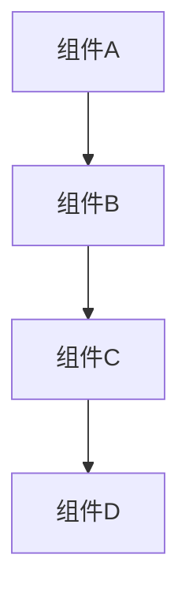
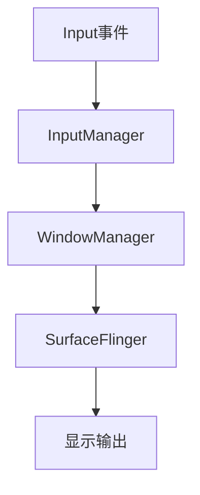

# AOSP Frameworks 项目规则

## 项目概述

本项目是基于Android Open Source Project (AOSP) 16的Framework层源码分析项目，主要关注Input事件、显示流程、AMS、WMS、SurfaceFlinger、Handler、Binder、系统Service、WindowManager、SystemUI、Launcher等核心模块的源码分析和文档编写。

## 代码分析规则

### 1. 源码分析规范

#### 1.0 文件路径引用规范
在文档中引用源码文件时，**只显示相对路径**，不包含项目根目录：

**路径格式：**
- 直接使用相对路径，从项目根目录开始计算
- 链接格式：`[文件名](相对路径)`

**示例：**
- 正确：`[RenderThread.cpp](base/libs/hwui/renderthread/RenderThread.cpp)`
- 错误：`[RenderThread.cpp](file:///base/libs/hwui/renderthread/RenderThread.cpp)`
- 错误：`[RenderThread.cpp](file:///Users/yuchuan/CodeMX/MX/AOSP_Frameworks/base/libs/hwui/renderthread/RenderThread.cpp)`

**代码注释中的路径引用：**
```cpp
// base/libs/hwui/renderthread/RenderThread.cpp#L107-L114
RenderThread& RenderThread::getInstance() {
    // ...
}
```

#### 1.1 项目结构扫描
在进行深度分析前，必须先进行项目结构扫描：

**扫描步骤：**
1. **目录结构分析**：使用`LS`工具扫描项目目录结构
2. **文件类型统计**：统计Java、Kotlin、AIDL等文件数量
3. **核心模块识别**：识别Framework、SystemUI、Launcher等核心模块
4. **依赖关系分析**：分析模块间的依赖关系和接口定义

**扫描命令示例：**
```bash
# 扫描项目根目录
LS "/Users/yuchuan/CodeMX/MX/AOSP_Frameworks"

# 扫描特定模块
LS "/Users/yuchuan/CodeMX/MX/AOSP_Frameworks/base/libs/WindowManager/Shell"

# 统计文件类型
Glob "**/*.java"
Glob "**/*.kt"
Glob "**/*.aidl"
```

#### 1.2 文件分类规范
根据扫描结果对文件进行分类：

**核心文件（必须分析）：**
- 核心管理器类：`Transitions.java`, `RecentTasksController.java`
- 关键接口定义：`TransitionHandler.java`, `IRecentTasks.aidl`
- 系统集成类：与WindowManager、SurfaceFlinger交互的类

**重要文件（建议分析）：**
- 工具类和辅助类：`TransitionUtil.java`, `TransactionPool.java`
- 数据模型类：`GroupedTaskInfo.java`, `TransitionInfo.java`
- 观察者和监听器：`TransitionObserver.java`, `TaskStackListenerCallback`

**参考文件（可选分析）：**
- 常量定义文件：`ShellSharedConstants.java`
- 配置和资源文件：`R.java`, 资源文件
- 测试文件：`*Test.java`, `*Test.kt`

#### 1.3 分析深度要求
- **必须分析**：核心类的构造函数、关键方法、状态机实现
- **建议分析**：接口定义、回调机制、跨进程通信
- **可选分析**：工具类、辅助方法、常量定义

#### 1.4 调用链追踪要求
- 从用户输入到系统响应的完整调用链
- 跨进程调用的Binder通信路径
- 关键状态变化的触发条件

#### 1.5 架构图绘制规范

- 使用Mermaid语法绘制组件关系图
- 标注关键的数据流向和调用关系
- 包含状态变化和生命周期信息

### 2. 文档编写规则

#### 2.1 文档结构规范
```markdown
# [模块名称] 分析文档

## 概述
- 模块功能和定位
- 在系统架构中的位置
- 主要职责和依赖关系

## 核心组件分析
- 关键类和方法分析
- 状态机和生命周期
- 接口定义和实现

## 调用链分析
- 完整的调用流程图
- 关键时序分析
- 异常处理机制

## 性能优化分析
- 性能瓶颈识别
- 优化建议和方案
- 监控指标定义
```

#### 2.2 图表绘制规范

**图表工具优先级：**
1. **优先使用Mermaid**：用于绘制流程图、架构图、时序图
2. **可选使用drawio**：用于复杂图表绘制

**Mermaid图表规范：**
- **流程图**：使用graph语法，标注关键数据流向
- **时序图**：使用sequenceDiagram语法，标注关键时序
- **架构图**：使用graph TD语法，标注组件关系

**示例：**


**对比度规范：**
- **背景色与文字对比度**：确保背景色和文字颜色具有高对比度，保证文字显示清晰可读
- **深色背景 + 白色文字**：使用深色背景配合白色文字，推荐对比度≥7:1
- **颜色搭配示例**：
  - 深蓝背景(#1565c0) + 白色文字(#ffffff)
  - 深绿背景(#2e7d32) + 白色文字(#ffffff)
  - 深橙背景(#e65100) + 白色文字(#ffffff)
  - 深红背景(#c62828) + 白色文字(#ffffff)
  - 深紫背景(#7b1fa2) + 白色文字(#ffffff)
  - 深黄背景(#f57f17) + 白色文字(#ffffff)
- **Mermaid样式设置**：使用`style`命令设置节点颜色，格式为`style 节点ID fill:背景色,color:文字颜色`

#### 2.3 源码引用规范
- 使用文件路径引用：`[文件名](file:///path/to/file#L行号)`
- 关键代码块必须包含行号范围
- 重要的接口定义需要完整展示

#### 2.4 证据链要求
- 每个分析结论必须有源码证据支持
- 关键调用关系需要提供方法签名
- 状态变化需要提供状态机实现

#### 2.5 需求文档规范
- **功能需求**：明确功能边界和用户场景
- **技术架构**：描述系统架构和技术选型
- **测试策略**：定义测试方法和验收标准

#### 2.6 架构文档规范
- **系统架构图**：使用Mermaid绘制整体架构
- **模块关系图**：展示模块间的依赖关系
- **数据流程图**：描述关键数据流向

### 3. Skill使用规则

#### 3.1 AOSP源码分析专家技能
- **适用场景**：系统级源码分析、调用链追踪、性能问题定位
- **分析范围**：Framework / SystemUI / Launcher / WindowManager / SurfaceFlinger
- **输出要求**：Mermaid图表 + 源码证据链 + 时序分析

#### 3.2 Launcher Animation分析技能
- **适用场景**：手势动画、远程动画、图标动画分析
- **分析重点**：动画状态机、跨进程协调、性能监控
- **输出要求**：动画时序图 + 性能指标分析 + 优化建议

#### 3.3 Android应用需求文档技能
- **适用场景**：应用开发需求分析、技术方案设计
- **文档结构**：功能需求 + 技术架构 + 测试策略
- **输出要求**：完整的需求文档模板 + 测试用例设计

## 开发规范

### 4. 代码风格规范

#### 4.1 Java代码规范
- 遵循AOSP代码风格：4空格缩进、80字符行宽
- 类名使用大驼峰：`RecentTasksController`
- 方法名使用小驼峰：`onTransitionReady()`
- 常量使用全大写：`TRANSIT_OPEN`

#### 4.4 注释规范
- **类级别注释**：说明类的职责和主要功能
- **方法级别注释**：说明方法的作用、参数、返回值
- **关键算法注释**：说明算法逻辑和边界条件
- **注释原则**：注释应该解释为什么，而不是做什么
- **API文档**：为公共API提供清晰的文档
- **注释更新**：更新注释以反映代码变化

#### 4.5 包结构规范
```
com.android.wm.shell.transition/
├── Transitions.java          # 核心管理器
├── TransitionHandler.java    # 处理器接口
├── DefaultTransitionHandler.java
└── tracing/                  # 追踪相关
    └── PerfettoTransitionTracer.java
```

### 5. 工具使用规则

#### 5.1 项目扫描工具

**文件扫描工具：**
- **LS**：扫描目录结构，了解项目布局
- **Glob**：按文件模式搜索，统计文件类型分布
- **SearchCodebase**：语义搜索，快速定位相关代码模块

**扫描分析流程：**
```bash
# 1. 扫描项目根目录结构
LS "/Users/yuchuan/CodeMX/MX/AOSP_Frameworks"

# 2. 统计核心模块文件分布
Glob "base/libs/WindowManager/Shell/**/*.java"
Glob "base/core/java/android/**/*.java"

# 3. 识别关键接口和类
SearchCodebase "TransitionHandler接口实现"
SearchCodebase "最近任务管理相关类"

# 4. 分析模块依赖关系
Grep "import.*WindowManager" base/libs/WindowManager/Shell/**/*.java
Grep "extends.*Base" base/libs/WindowManager/Shell/**/*.java
```

#### 5.2 源码分析工具
- **SearchCodebase**：用于快速定位相关代码
- **Grep**：用于精确搜索特定模式
- **Read**：用于详细阅读源码实现

#### 5.2 文档生成工具
- **Mermaid**：用于绘制架构图和时序图
- **Markdown**：用于编写分析文档
- **图表工具**：用于生成性能分析图表

#### 5.3 调试分析工具
- **Perfetto**：系统级性能分析
- **Systrace**：应用性能分析
- **Layout Inspector**：UI层级分析

## 质量保证规则

### 6. 分析质量要求

#### 6.1 完整性要求
- 必须分析核心模块的所有关键组件
- 必须提供完整的调用链和时序分析
- 必须包含性能优化建议

#### 6.2 准确性要求
- 所有分析结论必须有源码证据支持
- 调用关系必须经过实际代码验证
- 性能数据必须基于实际测试

#### 6.3 可读性要求
- 文档结构清晰，层次分明
- 图表清晰，标注完整
- 语言简洁，避免冗余

### 7. 评审流程规则

#### 7.1 自检要求
- 检查文档结构是否完整
- 验证源码引用是否正确
- 确认分析结论是否合理

#### 7.2 同行评审
- 邀请其他开发者进行技术评审
- 重点关注分析深度和准确性
- 提出改进建议和优化方案

#### 7.3 最终审核
- 由项目负责人进行最终审核
- 确保符合项目质量标准
- 确认可以归档或发布

## 项目管理规则

### 8. 文件组织规则

#### 8.1 文档目录结构
```
docs/
├── AppVsyncAnalysis.md              # VSYNC机制分析
├── WindowManagerShellTransitionAnalysis.md  # Shell Transition分析
├── RecentTaskViewAnalysis.md        # Recent和TaskView分析
├── LauncherRemoteAnimation.md       # Launcher远程动画分析
└── ANRAnalysis.md                   # ANR机制分析
```

#### 8.2 Skill目录结构
```
.trae/skills/
├── aosp-source-analysis-expert/     # AOSP源码分析专家
├── launcher-animation分析/          # Launcher动画分析
└── android-requirements/            # Android应用需求文档
```

### 9. 版本控制规则

#### 9.1 提交规范
- 提交信息格式：`[类型] 简要描述`
- 类型包括：feat, fix, docs, style, refactor, test, chore
- 详细描述需要说明修改内容和影响范围

#### 9.2 分支管理
- `main`分支：稳定版本，用于发布
- `develop`分支：开发版本，用于日常开发
- `feature/*`分支：功能开发分支
- `docs/*`分支：文档更新分支

## 安全与合规规则

### 10. 安全规范

#### 10.1 代码安全
- 避免硬编码敏感信息
- 使用安全的API调用方式
- 遵循Android安全最佳实践

#### 10.2 文档安全
- 不包含内部系统架构细节
- 避免泄露敏感的业务逻辑
- 遵循公司信息安全政策

### 11. 合规要求

#### 11.1 版权声明
- 所有文档必须包含适当的版权声明
- 引用第三方代码需要注明来源
- 遵循开源许可证要求

#### 11.2 隐私保护
- 不收集或存储用户隐私信息
- 遵循GDPR等隐私保护法规
- 在文档中说明数据处理方式

## 附录

### A. 常用命令参考

#### A.1 项目扫描命令

**目录结构扫描：**
```bash
# 扫描项目根目录
LS "/Users/yuchuan/CodeMX/MX/AOSP_Frameworks"

# 扫描核心模块目录
LS "/Users/yuchuan/CodeMX/MX/AOSP_Frameworks/base/libs/WindowManager/Shell"
LS "/Users/yuchuan/CodeMX/MX/AOSP_Frameworks/base/core/java/android"

# 扫描特定子模块
LS "/Users/yuchuan/CodeMX/MX/AOSP_Frameworks/base/libs/WindowManager/Shell/src/com/android/wm/shell/transition"
LS "/Users/yuchuan/CodeMX/MX/AOSP_Frameworks/base/libs/WindowManager/Shell/src/com/android/wm/shell/recents"
```

**文件类型统计：**
```bash
# 统计Java文件数量
Glob "**/*.java" | head -20

# 统计Kotlin文件数量
Glob "**/*.kt" | head -10

# 统计AIDL文件数量
Glob "**/*.aidl" | head -10

# 统计特定模块文件
Glob "base/libs/WindowManager/Shell/**/*.java" | head -30
```

#### A.2 源码搜索命令
```bash
# 搜索特定类
SearchCodebase "RecentTasksController"

# 搜索方法定义
Grep "public void onTransitionReady"

# 搜索接口实现
Grep "implements TransitionHandler"
```

#### A.2 文档生成命令
```bash
# 生成架构图
使用Mermaid语法绘制组件关系图

# 生成时序图
使用Mermaid sequenceDiagram语法

# 生成调用链图
使用graph TD语法绘制调用关系
```

### B. 模板文件参考

#### B.1 分析文档模板

参见：`docs/template/analysis_template.md`

#### B.2 Skill文档模板
参见：`.trae/skills/template/SKILL.md`

---

**最后更新**: 2026年1月27日  
**适用项目**: AOSP Frameworks源码分析  
**维护者**: 项目开发团队  
**版本**: 1.1