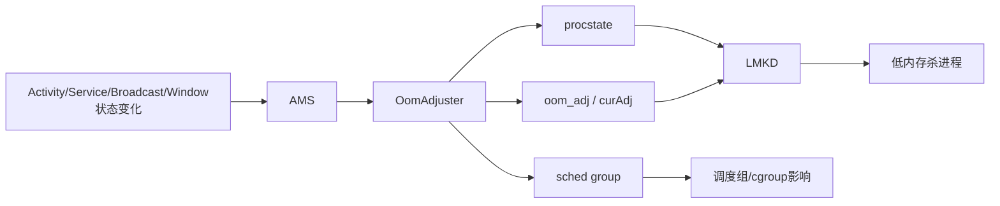

# 架构与核心机制
<!-- source: 02-1-skill.md -->

# 1. Skill 定位

`aosp-ams` 用于对 Android AOSP 中以 **ActivityManagerService（AMS）** 为核心的运行时管理体系进行专家级源码分析。  
本 Skill 不只回答“代码怎么走”，还要回答：

- 体系架构如何划分
- 为什么这样设计
- 状态由谁维护
- 调度如何跨服务传递
- 问题发生时证据在哪里
- 如何从 bugreport / dumpsys / logcat / trace 中还原真实根因

本版本为 **专家增强版**，重点强化以下五个维度：

1. **完整 AMS → ATMS → WMS → App 跨层调用链**
2. **AMS ANR 深度模型**
3. **OOM_ADJ / procstate / LMKD 专项体系**
4. **bugreport / dumpsys / logcat 自动分析规则**
5. **80+ AMS 异常模式库**

---


<!-- source: 03-2-skill.md -->

# 2. Skill 适用范围

当用户存在以下诉求时，应优先调用本 Skill：

### 2.1 架构理解
- 分析 AMS 总体架构
- 分析 AMS 与 ATMS / WMS 的边界
- 分析 Android 进程与组件运行管理模型
- 分析 OOM_ADJ / procstate / LMKD 协同机制
- 分析 Android 生命周期与资源管理设计思想

### 2.2 源码分析
- 分析 startActivity / startService / bindService / sendBroadcast / getContentProvider 流程
- 分析进程启动、attachApplication、进程死亡清理
- 分析前后台状态更新
- 分析广播、服务、Provider 超时
- 分析 ANR 形成链路
- 分析 Activity 可见与进程优先级联动

### 2.3 问题定位
- App 冷启动慢
- 首屏慢
- 进程频繁被杀
- 广播 ANR
- Service ANR
- Provider 卡死
- 后台保活异常
- 前台可见进程被杀
- 进程优先级异常
- 多进程互拉导致系统抖动
- system_server / app 主线程阻塞造成表象异常

---


<!-- source: 04-3.md -->

# 3. 专家级输出要求

每次使用本 Skill，输出必须尽量包含以下 10 项：

1. **问题定义**
2. **结论摘要**
3. **涉及模块**
4. **完整跨层调用链**
5. **关键状态对象**
6. **源码级详细解释**
7. **架构设计思想**
8. **运行时证据映射**
9. **异常模式匹配**
10. **修复建议与验证方案**

并且必须包含以下 4 项强制交付物：

- **架构图**
- **时序图**
- **关键代码路径解释**
- **证据链映射**

---


<!-- source: 06-51-ams.md -->

# 5.1 AMS 的核心职责

AMS 是 Android Framework 运行时调度与进程资源编排的核心服务之一，主要负责：

- 进程生命周期管理
- 组件运行时调度
- 进程优先级管理
- 前后台状态维护
- 进程回收相关状态输出
- ANR / crash / timeout 处理
- 与 Zygote / LMKD / ATMS / WMS / PKMS 的协同
- 用户切换、多进程、多 UID 场景管理

> Android 10+ 后，Activity / Task 栈管理主体已迁移到 ATMS，AMS 更聚焦于 **process + component runtime orchestration**。

---


<!-- source: 07-52.md -->

# 5.2 职责边界表

| 模块                        | 核心职责                                          | 与 AMS 的关系             |
| --------------------------- | ------------------------------------------------- | ------------------------- |
| AMS                         | 进程与组件运行时编排                              | 核心控制器                |
| ATMS                        | Activity / Task / DisplayArea / TaskFragment 管理 | Activity 生命周期协同     |
| WMS                         | Window / Focus / Insets / Visibility              | Activity 可见性联动       |
| ProcessList                 | 进程记录、LRU、启动与回收管理                     | AMS 核心子系统            |
| OomAdjuster                 | OOM_ADJ / procstate / sched group 计算            | AMS 重要性模型核心        |
| ActiveServices              | Service 启动、绑定、重启、超时                    | AMS 子系统                |
| BroadcastQueue / Dispatcher | 广播分发与超时                                    | AMS 子系统                |
| ContentProviderHelper       | Provider 解析、引用、发布与死亡处理               | AMS 子系统                |
| AppErrors / AnrHelper       | crash / ANR 处理                                  | AMS 子系统                |
| ZygoteProcess               | 新进程 fork                                       | AMS 进程创建后端          |
| LMKD                        | 内存压力杀进程                                    | 消费 AMS 输出的重要性信息 |
| PKMS/PMS                    | 包、组件、权限、安装状态                          | AMS 调度前依赖            |
| App 进程 / ActivityThread   | 组件实际执行端                                    | AMS 调度落地点            |

---

# 6. 完整 AMS → ATMS → WMS → App 跨层调用链

本章是专家增强版核心内容。

---


<!-- source: 16-72-ams-anr.md -->

# 7.2 AMS ANR 分类模型

### A. Input ANR

- 典型观察者：InputDispatcher
- AMS 作用：接收 ANR 上报，记录 ProcessRecord 状态，辅助堆栈采集和错误处理
- 真正根因：常在 app 主线程 / binder 依赖 / system_server 锁 / WMS/Input 链

### B. Broadcast ANR

- 典型观察者：BroadcastQueue / BroadcastDispatcher / AMS
- AMS 作用：管理广播分发与 timeout
- 真正根因：receiver 主线程长阻塞 / ordered 前驱阻塞 / 冷启动拖慢 / finishReceiver 延迟

### C. Service ANR

- 典型观察者：ActiveServices / AMS
- AMS 作用：service timeout 计时与判定
- 真正根因：onCreate / onStartCommand / onBind 主线程阻塞、锁竞争、binder 卡死

### D. Provider ANR

- 典型观察者：AMS / provider 获取链
- AMS 作用：provider 获取和发布的超时监控
- 真正根因：Provider onCreate 慢、数据库升级、同步等待远端结果

### E. App 主线程冻结型

- 典型观察者：各种外部 timeout 机制
- AMS 作用：最终统一收敛与错误展示
- 真正根因：主线程 I/O、锁等待、binder 同步调用、无限循环、GC 风暴

### F. SystemServer 反压型 ANR

- 表面：App ANR
- 本质：system_server 持锁、WMS/AMS/ATMS 长阻塞、Binder 依赖阻塞
- AMS 角色：既可能是观察者，也可能是链路上的阻塞参与者

------


<!-- source: 17-73-ams-anr.md -->

# 7.3 AMS ANR 根因树

```
ANR
├─ 观察者是谁
│  ├─ InputDispatcher
│  ├─ BroadcastQueue
│  ├─ ActiveServices
│  ├─ Provider获取链
│  └─ 其他系统监控器
├─ 表层超时对象是谁
│  ├─ Activity所属进程
│  ├─ Broadcast receiver 进程
│  ├─ Service进程
│  └─ Provider进程
├─ 实际阻塞线程是谁
│  ├─ app 主线程
│  ├─ binder线程池
│  ├─ RenderThread
│  ├─ system_server binder线程
│  └─ native阻塞线程
└─ 深层机制原因
   ├─ 锁竞争
   ├─ Binder环路等待
   ├─ 同步I/O
   ├─ 远端服务未返回
   ├─ 冷启动补偿调度过慢
   ├─ system_server持锁
   └─ 调度饥饿/线程池耗尽
```

------


<!-- source: 21-82.md -->

# 8.2 三层模型关系



------


<!-- source: 22-83-procstate.md -->

# 8.3 procstate 的语义

`procstate` 用于表达进程处于哪种运行语义级别，常见大类包括：

- TOP
- FOREGROUND_SERVICE
- BOUND_TOP
- IMPORTANT_FOREGROUND
- IMPORTANT_BACKGROUND
- TRANSIENT_BACKGROUND
- BACKUP
- SERVICE
- RECEIVER
- HOME
- LAST_ACTIVITY
- CACHED_ACTIVITY
- CACHED_EMPTY

### 专家理解要点

- procstate 是“系统对进程角色的语义判定”
- 不是简单前后台二元模型
- 同一个进程的 procstate 会因为窗口可见、绑定关系、FGS、广播执行等动态变化
- 分析异常时必须看 **变化路径**，不能只看最终状态

------


<!-- source: 25-86-oom-adj.md -->

# 8.6 OOM_ADJ 的主要触发源

以下状态变化通常会触发重新计算：

1. Activity resumed / paused / stopped
2. 窗口可见性变化
3. 焦点变化
4. 前台服务状态变化
5. Service bind / unbind
6. Broadcast 开始 / 完成
7. Provider 引用建立 / 释放
8. 进程死亡 / 新进程创建
9. 用户切换
10. 屏幕状态变化
11. 任务切换
12. 系统内存压力变化
13. 进程进入 cached 队列
14. pending intent / backup / instrumentation 等特殊状态

------


<!-- source: 26-87.md -->

# 8.7 绑定关系传播模型

### 绑定提升的核心原则

一个低重要性进程，如果为高重要性进程提供关键服务，则可能被提升。

传播路径常见于：

- bindService
- content provider stable reference
- 某些前台关联组件
- top app 所依赖的重要进程

### 典型误区

- 用户以为“后台就是 cached”，实际上被前台 client 绑定后会被提升
- 用户以为“前台可见就一定不杀”，实际上窗口状态、焦点、sleeping/top-sleeping、瞬时状态都会影响最终判定
- 用户以为“FGS 一定绝不被杀”，实际上依然受系统整体资源策略影响，只是优先级更高

------


<!-- source: 31-93-dumpsys.md -->

# 9.3 dumpsys 自动分析规则

### Rule-DS-01：`dumpsys activity processes`

抽取：

- pid / uid / processName
- procstate / curAdj / setAdj
- sched group
- persistent / isolated
- 当前绑定组件
- lru rank
- cached / empty / service / receiver 状态

### Rule-DS-02：`dumpsys activity oom`

抽取：

- top app
- visible app
- perceptible app
- cached app
- 关键 connection 传播
- 当前重要性排序

### Rule-DS-03：`dumpsys activity services`

抽取：

- ServiceRecord
- started / bound
- executing services
- restarting services
- foreground service 状态
- timeout 风险对象

### Rule-DS-04：`dumpsys activity broadcasts`

抽取：

- ordered / parallel queue
- active broadcast
- pending receiver
- 当前卡住的 receiver
- timeout 计时对象

### Rule-DS-05：`dumpsys activity providers`

抽取：

- ProviderRecord
- stable / unstable 引用数
- 启动中的 provider
- 是否存在跨进程长链依赖

------


<!-- source: 34-101-115.md -->

# 10.1 进程启动类（1~15）

1. 冷启动被 Provider 初始化拖慢
2. `Application.onCreate()` 过重
3. attachApplication 后补偿调度延迟
4. 进程创建后等待系统服务结果过久
5. 启动期间主线程同步 I/O
6. 启动期间同步 Binder 调用阻塞
7. 启动期间类加载 / Dex 优化开销大
8. 启动链上隐式拉起多个进程
9. 多进程互相拉起形成风暴
10. isolated process 频繁创建销毁
11. persistent 进程启动失败反复拉起
12. 首个组件不是 Activity 而是 Provider 导致首屏慢
13. 冷启动期间 Receiver/Service 插队
14. 启动后立刻发生 OOM_ADJ 波动
15. 进程刚启动即被低内存回收

------


<!-- source: 39-106-oom-adj-procstate-6780.md -->

# 10.6 OOM_ADJ / procstate 类（67~80）

1. 用户可见进程被判成 cached
2. FGS 进程未获得预期 adj
3. bindService 连接未形成，优先级传播失败
4. 已 unbind 但连接残留导致优先级虚高
5. visible 与 perceptible 理解错误
6. top-sleeping 状态误判
7. cached app optimizer 影响行为判断
8. 进程短时间频繁状态抖动
9. LRU 排位异常导致早杀
10. Activity 切后台后 adj 下降过快
11. provider stable ref 抬升了本不该常驻的进程
12. isolated process 生命周期短被误判异常
13. procstate 正确但 sched group 太低导致体验差
14. 多用户/工作资料夹场景下状态判断错位

------


<!-- source: 42-111-ams.md -->

# 11.1 AMS 核心

- `frameworks/base/services/core/java/com/android/server/am/ActivityManagerService.java`


<!-- source: 44-113-service.md -->

# 11.3 Service

- `ActiveServices.java`
- `ServiceRecord.java`


<!-- source: 48-117-activity-task.md -->

# 11.7 Activity / Task 协同

- `ActivityTaskManagerService.java`
- `ActivityStartController.java`
- `ActivityStarter.java`
- `RootWindowContainer.java`


<!-- source: 49-118-window.md -->

# 11.8 Window 协同

- `WindowManagerService.java`
- `ActivityRecord.java`
- `WindowProcessController.java`


<!-- source: 53-123.md -->

# 12.3 第三步：锁定关键状态对象

至少识别一个：

- `ProcessRecord`
- `ServiceRecord`
- `BroadcastRecord`
- `ContentProviderRecord`
- `ActivityRecord`
- `WindowProcessController`
