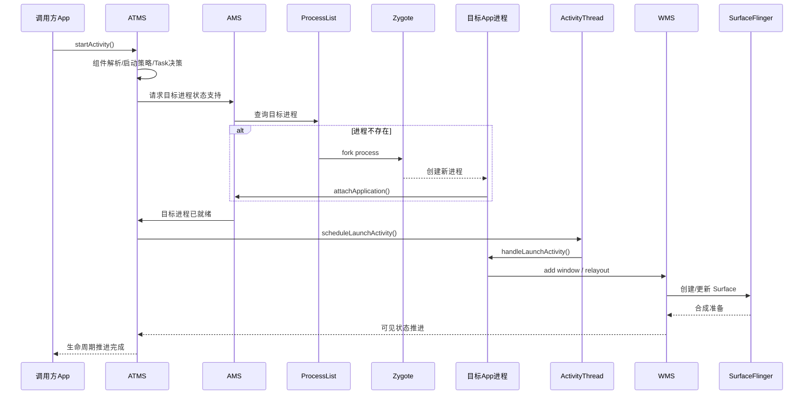
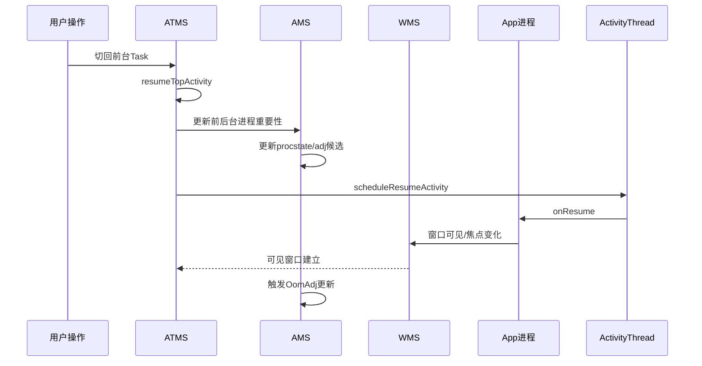
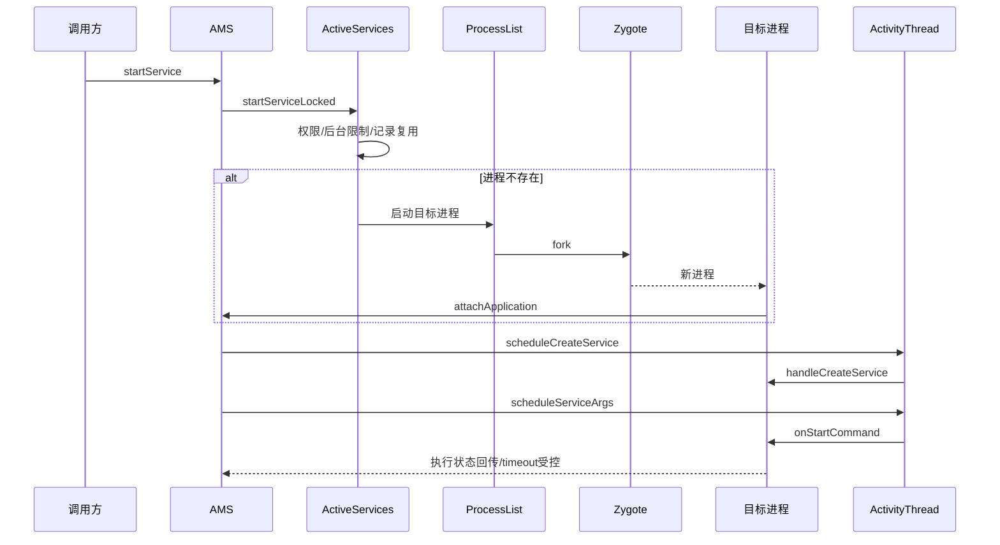
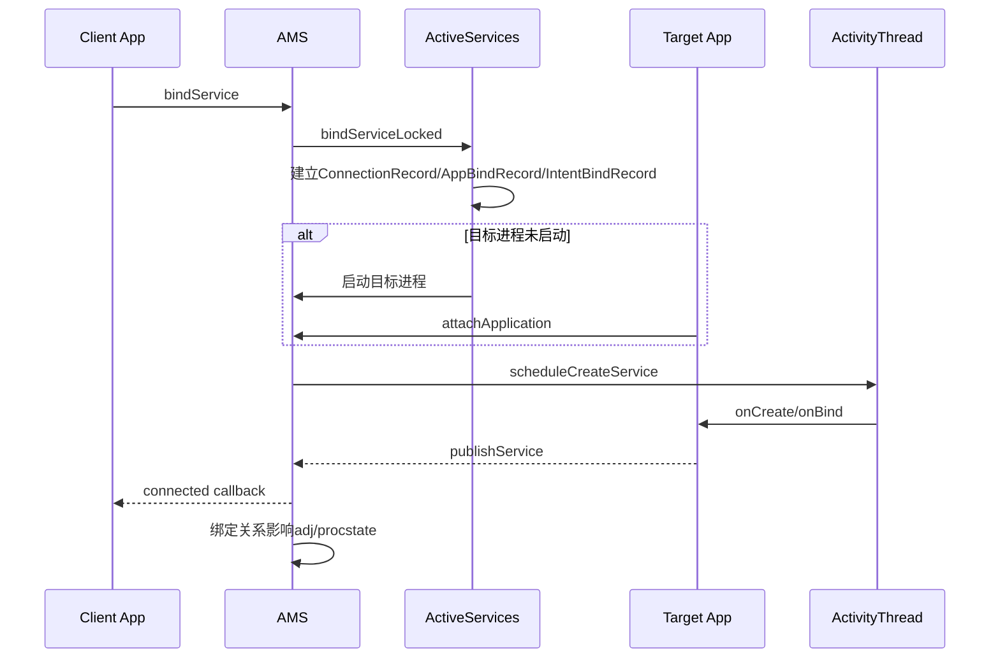
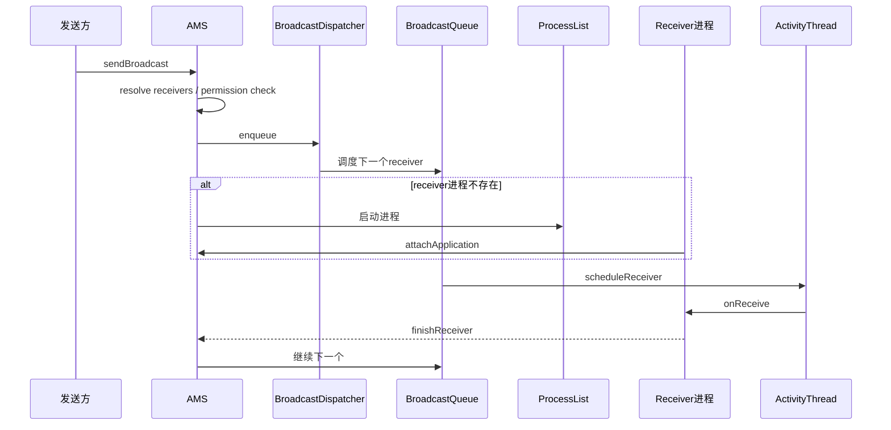
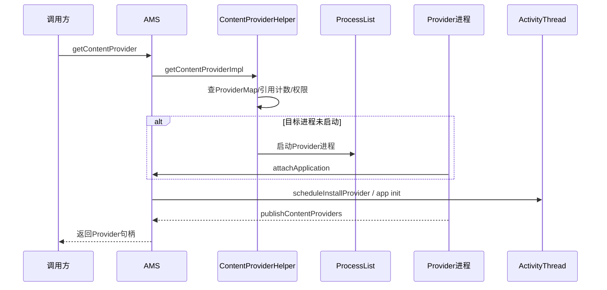
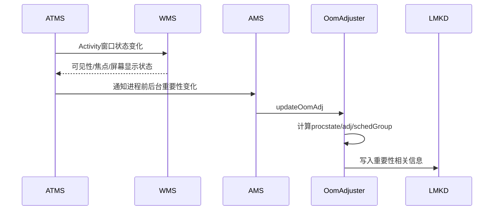

# 调用链与时序
<!-- source: 08-61-activity.md -->

# 6.1 Activity 冷启动完整跨层调用链

### 关键结论

- **启动决策主导者是 ATMS**
- **进程存在性与创建由 AMS/ProcessList 负责**
- **Activity 真正执行在 App 进程 ActivityThread**
- **窗口准备由 WMS 接手**
- **最终“用户看见界面”依赖 WMS + SF，而不是 AMS 单独完成**

### 必查拆分

- ATMS 做了什么启动策略决策
- AMS 是否触发冷启动
- attachApplication 是否及时
- scheduleLaunchActivity 是否延迟
- 窗口创建是否卡在 WMS / 渲染侧

------

<!-- source: 09-62-activity.md -->

# 6.2 Activity 恢复前台完整跨层调用链

### 核心关注

- resumed 不等于用户可见
- visible 不等于 top resumed
- 前台状态变化会反向影响 OOM_ADJ
- WMS 的窗口可见、焦点、屏幕状态会改变进程重要性判断

------

<!-- source: 10-63-startservice.md -->

# 6.3 startService 完整跨层调用链

### 关键点

- 记录对象由 AMS/ActiveServices 维护
- 组件实际执行由 App 主线程完成
- timeout 观察者在 system_server，执行者在 app
- Service 与进程优先级强绑定，FGS/绑定关系会抬升重要性

------

<!-- source: 11-64-bindservice.md -->

# 6.4 bindService 完整跨层调用链

### 关键点

- bind 不只是回调链问题，也是优先级传播链问题
- binding client 的重要性会通过 connection 向 server 侧传播
- 很多“后台 service 却没被杀”的根因是绑定提升 adj
- 很多“该提升但没提升”的问题本质是连接未建立、断链、或不符合传播条件

------

<!-- source: 12-65-broadcast.md -->

# 6.5 Broadcast 完整跨层调用链

### 关键点

- ordered broadcast 是链式串行模型
- 前一个 receiver 卡住，会阻塞整个链
- 广播 ANR 的 timeout 观察在 AMS，实际阻塞常在 app 主线程或跨进程依赖
- “AMS 超时”不等于“AMS 卡住”，往往只是超时观察者

------

<!-- source: 13-66-provider.md -->

# 6.6 Provider 完整跨层调用链

### 关键点

- Provider 首次访问常处于冷启动关键路径
- Provider `onCreate()` 在主线程执行
- 数据库升级 / 文件 I/O / 同步依赖很容易把 Provider 变成启动瓶颈
- 很多冷启动慢本质是 Provider 隐式启动

------

<!-- source: 14-67.md -->

# 6.7 可见性与进程重要性联动调用链

### 核心结论

- “用户能看到” 与 “系统认为重要” 之间有映射层
- 这个映射层由 **ATMS/WMS → AMS/OomAdjuster** 完成
- 问题分析必须跨过 AMS、ATMS、WMS 三层，而不能只看单层 log

------

# 7. AMS ANR 深度模型

本章为专家增强版重点。

------

<!-- source: 38-105-provider-5666.md -->

# 10.5 Provider 类（56~66）

1. Provider 首次访问触发冷启动
2. Provider `onCreate()` 数据库升级过慢
3. Provider 初始化读大文件/扫目录
4. 多个 Provider 串行初始化
5. stable reference 长期不释放
6. unstable reference 抖动导致频繁重连
7. provider publish 迟到导致调用方卡住
8. provider 所在进程已启动但主线程卡死
9. ContentResolver 调用链引发隐式跨进程阻塞
10. provider 死亡后重建抖动
11. provider ANR 表层在 caller，根因在 provider 进程

------
