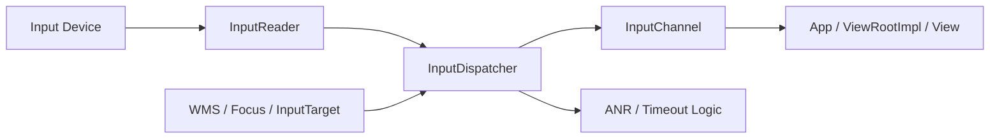
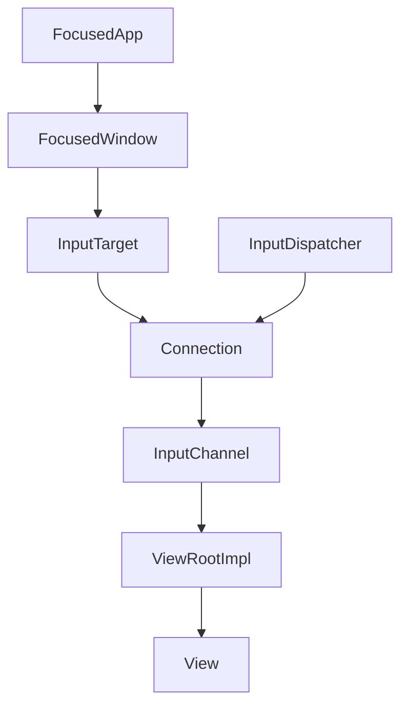
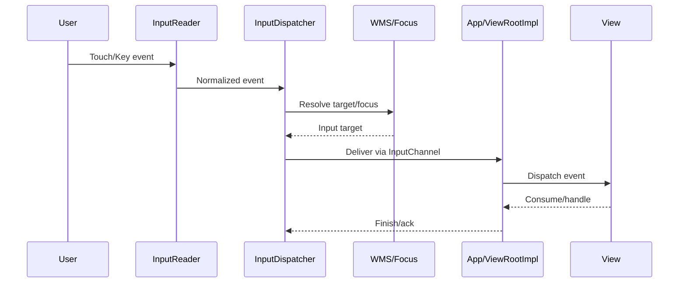
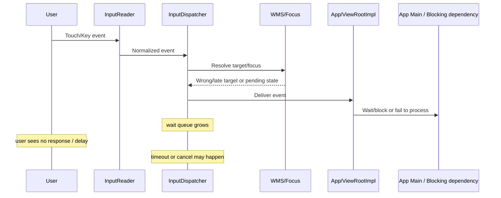

# 输出模板与检查清单
<!-- source: 19-diagram-output-templates.md -->

# Diagram Output Templates

在输出时，优先使用如下图类型。

### 输入系统架构图模板

```mermaid
flowchart LR
    Dev[Input Device]
    Reader[InputReader]
    Dispatcher[InputDispatcher]
    WMS[WMS / Focus / InputTarget]
    Channel[InputChannel]
    App[App / ViewRootImpl / View]
    ANR[ANR / Timeout Logic]

    Dev --> Reader
    Reader --> Dispatcher
    WMS --> Dispatcher
    Dispatcher --> Channel
    Channel --> App
    Dispatcher --> ANR
```

### 核心对象关系图模板

```mermaid
flowchart TD
    ID[InputDispatcher]
    FW[FocusedWindow]
    FA[FocusedApp]
    IT[InputTarget]
    CN[Connection]
    CH[InputChannel]
    VR[ViewRootImpl]
    VW[View]

    FA --> FW
    FW --> IT
    IT --> CN
    ID --> CN
    CN --> CH
    CH --> VR
    VR --> VW
```

### 正常时序图模板

```mermaid
sequenceDiagram
    participant U as User
    participant R as InputReader
    participant D as InputDispatcher
    participant W as WMS/Focus
    participant A as App/ViewRootImpl
    participant V as View

    U->>R: Touch/Key event
    R->>D: Normalized event
    D->>W: Resolve target/focus
    W-->>D: Input target
    D->>A: Deliver via InputChannel
    A->>V: Dispatch event
    V-->>A: Consume/handle
    A-->>D: Finish/ack
```

### 异常时序图模板

```mermaid
sequenceDiagram
    participant U as User
    participant R as InputReader
    participant D as InputDispatcher
    participant W as WMS/Focus
    participant A as App/ViewRootImpl
    participant M as App Main / Blocking dependency

    U->>R: Touch/Key event
    R->>D: Normalized event
    D->>W: Resolve target/focus
    W-->>D: Wrong/late target or pending state
    D->>A: Deliver event
    A->>M: Wait/block or fail to process
    Note over D: wait queue grows
    Note over U: user sees no response / delay
    Note over D: timeout or cancel may happen
```

------
