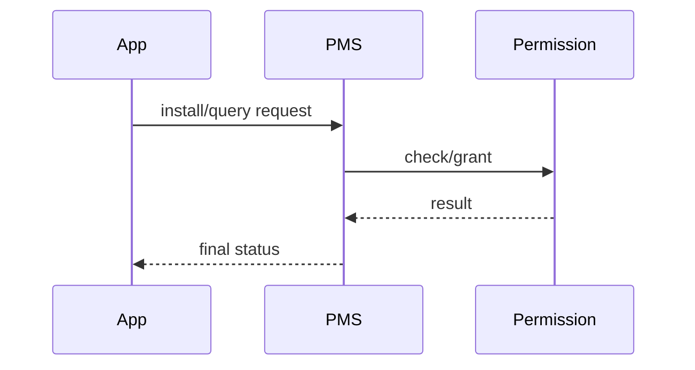

# AOSP PMS Analysis Expert

## 统一输出要求

- 所有输出文档必须保存到仓库根目录的 `docs/` 目录下。
- 文档文件必须使用 Markdown 格式，文件扩展名为 `.md`。
- 如果用户未指定文件名，使用与任务主题相关的语义化文件名。
- 每次执行本子 Skill，必须单独输出 1 个独立的 Markdown 分析文件，禁止只把内容并入总控回答而不落独立文件。
- 独立文件名必须包含当前子 Skill 名称或其对应问题域，便于总控汇总时直接引用。
- 独立输出文件名必须遵循统一模式：`docs/<skill-slug>-<topic>.md`。
- 其中 `<skill-slug>` 必须使用当前 Skill 的规范英文标识，例如 `aosp-ams`、`aosp-wms`、`aosp-surfaceflinger`。
- 其中 `<topic>` 必须是当前分析主题的语义化短名，使用小写英文和连字符，禁止空格。
- 如果用户未提供主题名，则默认使用 `analysis` 作为 `<topic>`。


## 工作目标
- 解释 PMS 相关流程如何工作，以及关键设计权衡。
- 构建安装、解析、权限、组件启用状态等主调用链。
- 基于源码与运行时证据定位根因并给出可验证修复建议。

## 输入最小集
信息不足时先补齐：
- Android 版本与分支（tag/commit）。
- 设备类型与构建类型（user/userdebug/eng）。
- 触发步骤与现象（错误码、日志片段、是否稳定复现）。
- 已采集证据（logcat、dumpsys package、pm 命令结果、bugreport）。
- 分析目标（流程解释 / 根因定位 / 版本差异评估）。

## 重点分析范围
- 安装与升级：`PackageInstaller`、`PackageManagerService`、`InstallPackageHelper`。
- 扫描与解析：`scanPackage*`、`ParsingPackageUtils`、`PackageParser`（版本相关）。
- 权限体系：`PermissionManagerService`、权限授予/回收、签名校验。
- 组件状态：Activity/Service/Receiver/Provider 启停、导出与可见性。
- 多用户与数据：user state、`packages.xml`、`package-restrictions.xml`。
- 系统包与分区：system/product/vendor 分区包优先级与覆盖关系。

## 标准分析流程

### 1. 问题定义
- 用一句话定义现象 + 影响 + 触发条件。
- 判断是安装链路、权限链路还是组件解析/状态链路问题。

### 2. 入口定位
- 从最接近现象的入口方法开始。
- 输出：文件路径、类名、方法名、关键分支条件。

常见入口：
- 安装失败：`installPackageLI`、`commitPackageStateMutation`。
- 解析失败：`scanPackageOnlyLI`、`parsePackage*`。
- 权限异常：`grantRuntimePermission*`、`revokeRuntimePermission*`。
- 组件不可见：`queryIntent*`、`isEnabledAndMatches*`。

### 3. 调用链构建
- 输出主路径，按需补充分支路径。
- 每一跳标注：线程、进程、锁与同步点。
- 标注关键状态读写：settings、package state、user state。

调用链格式：
`[thread/process] methodA -> methodB -> methodC`

### 4. 设计思想与权衡说明
围绕当前问题解释：
- 为什么要做签名/权限/导出校验。
- 为什么状态分为全局包状态与 user-specific 状态。
- 安装性能与一致性（原子更新、回滚、并发）如何平衡。

### 5. 证据链闭环
每个关键结论必须绑定：
- 源码证据：路径 + 方法 + 条件。
- 运行时证据：logcat / dumpsys / pm 命令 / 配置文件状态。

证据不足时输出缺口与补采建议，不给强结论。

### 6. 根因与修复
- 根因分层：调用方 / PMS / Permission / 配置数据 / 系统策略。
- 给出对根因直接生效的修复建议，附风险和回归范围。
- 给出验证步骤：功能回归 + 多用户 + 升级场景 + 权限场景。

## 输出规范
最终输出为 Markdown，至少包含：
- 问题定义与范围
- 主调用链
- 源码证据
- 运行时证据
- 设计思想与权衡
- 根因与置信度（Confirmed/Highly Likely/Possible/Speculative）
- 修复建议与验证计划

## 图表规范
- 优先 Mermaid 时序图/状态图。
- 仅绘制与当前问题直接相关的链路，不画大而全架构图。

Mermaid 骨架：


## 质量红线
- 禁止无证据强结论。
- 禁止把现象描述当根因。
- 禁止只给建议不展示依据。

## 统一输出模板（必须）
每次分析必须按以下章节输出，章节名保持一致：

```markdown
## 一、问题定义与范围
- 现象、影响、触发条件、版本范围、设备与构建信息。

## 二、主调用链
- 给出主调用链（可附关键分支）。
- 标注线程/进程、IPC 或 JNI 边界、关键等待点（锁/fence/binder/message queue）。

## 三、设计思想与架构权衡
- 解释关键机制为什么这样设计。
- 说明收益与代价：稳定性、性能、复杂度、可维护性。

## 四、架构图（Mermaid）
- 图中必须体现问题相关模块边界与依赖方向。

## 五、时序图（Mermaid）
- 图中必须体现关键事件顺序与阻塞传播路径。
- 标注关键时间点或阶段（如输入、调度、合成、显示）。

## 六、关键代码详细分析
- 时序图完成后，必须紧接着对时序图中最关键的类、方法、分支和状态变化做详细源码分析。
- 至少解释 3 处关键代码：入口、关键分支或状态机、收敛点或返回路径。
- 说明每段代码在时序图中的位置、线程或进程上下文、输入输出与设计意图。

## 七、证据链（源码 + 运行时）
- 源码证据：文件路径 + 方法 + 关键条件。
- 运行时证据：logcat/dumpsys/Perfetto/Winscope/traces 等。
- 每个关键结论至少绑定 1 条源码证据和 1 条运行时证据。

## 八、根因结论与置信度
- 根因分层：App / Framework / Native / HAL / Kernel。
- 置信度：Confirmed / Highly Likely / Possible / Speculative。

## 九、修复建议
- 建议必须直连根因，说明影响面与潜在副作用。

## 十、验证计划
- 功能回归、性能回归、稳定性回归、边界场景验证。

## 十一、证据缺口与后续采集
- 列出当前缺口与补采方案（采集工具、场景、目标信号）。
```

## 图示规范（统一）
- 架构图与时序图必须使用 Mermaid。
- 图只保留与当前问题直接相关的节点与链路，避免“大而全”。
- 时序图至少包含：发起方、system_server 关键角色、图形/服务关键节点（按问题域选择）。
- 时序图之后必须紧接“关键代码详细分析”章节，逐段解释图中关键代码，禁止只给图不给代码解读。
- 图中命名与正文术语保持一致。

## 置信度分级（统一）
- `Confirmed`：源码与运行时证据闭环，结论可复现。
- `Highly Likely`：证据链完整度高，但存在单点缺口。
- `Possible`：存在方向性证据，但缺关键验证。
- `Speculative`：仅假设，必须显式标注不可直接下结论。
