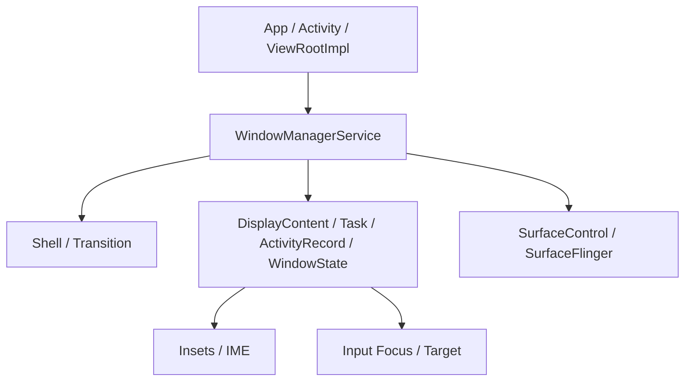
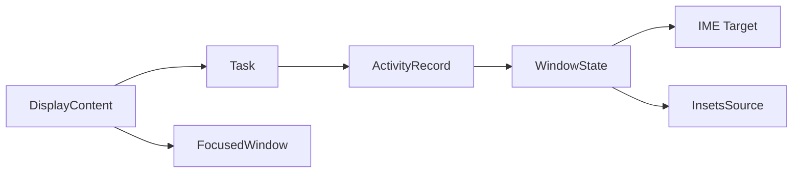
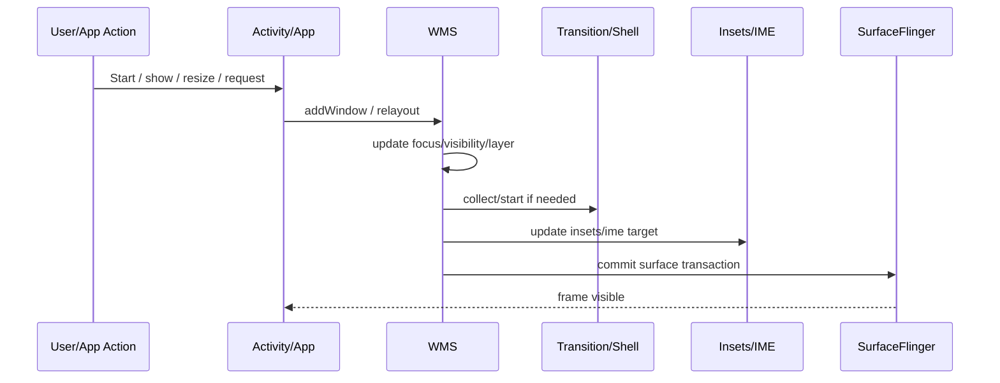
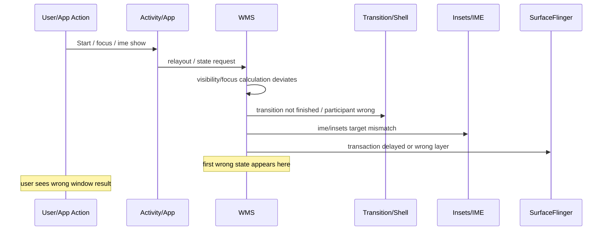

# 输出模板与检查清单
<!-- source: 19-diagram-output-templates.md -->

# Diagram Output Templates

在输出时，优先使用如下图类型。

### 窗口系统架构图模板

### 核心对象关系图模板

### 正常时序图模板

### 异常时序图模板

------

<!-- source: 23-suggested-shared-resources.md -->

# Suggested Shared Resources

建议与以下共享资源配合使用：

- `../shared/templates/analysis_report.md`
- `../shared/templates/root_cause_report.md`
- `../shared/templates/evidence_table.md`
- `../shared/templates/architecture_analysis.md`
- `../shared/templates/architecture_diagram.md`
- `../shared/templates/sequence_diagram.md`
- `../shared/templates/code_walkthrough.md`
- `../shared/checklists/common_checklist.md`
- `../shared/checklists/log_checklist.md`
- `../shared/checklists/trace_checklist.md`
- `../shared/checklists/bugreport_checklist.md`
- `../shared/checklists/wms_checklist.md`
- `../shared/refs/aosp_module_index.md`
- `../shared/refs/common_paths.md`
- `../shared/refs/android_version_notes.md`
- `../shared/refs/glossary.md`
- `../shared/refs/wms_object_map.md`
- `../shared/refs/transition_flow_guide.md`
- `../shared/refs/insets_ime_guide.md`
- `../shared/examples/wms_case_01.md`
- `../shared/examples/wms_case_02.md`

------
