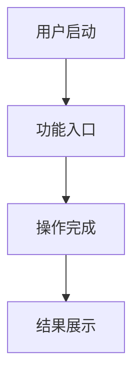

# Android应用需求文档

## 描述

Android应用需求文档技能专注于将业务需求转化为可执行的Android开发技术方案。该技能适用于新应用开发、功能迭代、架构重构等场景，提供从需求分析到测试验证的全链路指导，包括单元测试、自动化测试和功能测试策略。

## 使用场景

当需要执行以下任务时，应使用此技能：
- 新Android应用的功能需求分析和文档编写
- 现有应用的功能迭代需求文档
- 技术架构设计和选型文档
- UI/UX设计规范和技术实现方案
- 性能指标和测试需求定义
- 跨平台兼容性需求分析
- 安全性和隐私保护需求定义
- 单元测试策略和用例设计
- 自动化测试框架和脚本设计
- 功能测试方案和验收标准

## 指令

### 1. 需求分析框架

**需求文档结构模板：**
```markdown
# [应用名称] 需求文档

## 1. 项目概述
- 项目背景和目标
- 目标用户群体
- 核心价值主张

## 2. 功能需求
- 核心功能模块
- 用户交互流程
- 数据流设计

## 3. 技术架构
- 技术栈选型
- 系统架构设计
- 数据存储方案

## 4. UI/UX设计
- 界面设计规范
- 交互设计原则
- 适配方案

## 5. 性能指标
- 性能要求
- 兼容性要求
- 测试标准
```

### 2. 功能需求分析方法

**功能需求分析矩阵：**
| 需求类型 | 分析方法 | 输出文档 |
|----------|----------|----------|
| 用户故事 | 用户场景分析 | 用户故事地图 |
| 业务流程 | 流程图绘制 | 业务流程图 |
| 数据需求 | 数据模型设计 | ER图/数据字典 |
| 接口需求 | API设计规范 | API接口文档 |

### 3. 技术架构设计

**Android应用架构要素：**
- **架构模式**：MVVM/MVI/MVP选择依据
- **组件化**：模块划分和依赖管理
- **数据层**：本地存储+网络层设计
- **UI层**：Compose/XML选择策略

### 4. 性能需求定义

**性能指标定义方法：**
```
启动时间：冷启动 < 2s，热启动 < 1s
内存使用：峰值内存 < 256MB
帧率稳定性：UI动画 60fps
电池消耗：后台运行 < 1%/小时
```

### 5. 兼容性需求分析

**兼容性矩阵：**
| 维度 | 要求 | 测试方案 |
|------|------|----------|
| Android版本 | 支持Android 8.0+ | 多版本真机测试 |
| 屏幕尺寸 | 适配手机/平板 | 多分辨率测试 |
| 厂商定制 | 主流厂商兼容 | 品牌机测试 |
| 网络环境 | 2G/3G/4G/5G/WiFi | 网络切换测试 |

### 6. 测试策略设计

**测试金字塔模型：**
```
       功能测试 (10%)
          ↑
    集成测试 (20%)
          ↑
   单元测试 (70%)
```

**单元测试策略：**
- **测试框架**：JUnit + Mockito + Robolectric
- **测试范围**：业务逻辑、数据层、工具类
- **覆盖率目标**：核心代码 > 80%
- **测试模式**：TDD/BDD开发模式

**自动化测试策略：**
- **UI测试**：Espresso + UI Automator
- **性能测试**：Android Profiler + Benchmark
- **API测试**：Retrofit Mock + WireMock
- **持续集成**：GitHub Actions + Jenkins

**功能测试策略：**
- **测试用例设计**：基于用户故事和业务流程
- **测试数据准备**：Mock数据 + 真实数据
- **验收标准**：功能完整性 + 性能指标 + 用户体验

## 示例

### 示例1：社交应用需求文档
```markdown
# 社交应用需求文档

## 功能需求
- 用户注册登录（手机号/第三方）
- 好友关系管理（添加/删除/分组）
- 即时通讯（文字/图片/语音）
- 动态发布和浏览
- 消息推送和通知

## 技术架构
- 架构：MVVM + Clean Architecture
- 网络：Retrofit + OkHttp
- 数据库：Room + SQLite
- 推送：FCM/厂商推送
- 图片：Glide/Picasso
```

### 示例2：电商应用需求文档
```markdown
# 电商应用需求文档

## 功能需求
- 商品浏览和搜索
- 购物车和订单管理
- 支付集成（支付宝/微信）
- 物流跟踪
- 用户评价系统

## 性能要求
- 首页加载时间 < 1.5s
- 图片加载缓存策略
- 订单支付成功率 > 99%
- 崩溃率 < 0.1%
```

### 示例3：工具类应用需求文档
```markdown
# 工具类应用需求文档

## 功能需求
- 核心工具功能实现
- 数据同步和备份
- 设置和个性化
- 帮助和反馈

## 技术选型
- UI：Jetpack Compose
- 状态管理：ViewModel + StateFlow
- 本地存储：DataStore/SharedPreferences
- 后台任务：WorkManager

## 测试策略
### 单元测试
- ViewModel逻辑测试：覆盖率 > 90%
- 工具类功能测试：Mock外部依赖
- 数据层测试：Room数据库操作验证

### 自动化测试
- UI测试：Compose界面交互测试
- 性能测试：内存泄漏和性能基准
- 集成测试：WorkManager后台任务测试

### 功能测试
- 核心功能验收：功能完整性验证
- 用户体验测试：界面流畅度和响应性
- 兼容性测试：多版本Android系统适配
```

### 示例4：测试策略需求文档
```markdown
# 测试策略需求文档

## 单元测试需求
### 测试框架配置
- JUnit 5 + Mockito + Robolectric
- JaCoCo代码覆盖率工具
- 测试报告生成和可视化

### 测试用例设计
- 业务逻辑测试：每个UseCase对应测试类
- 数据层测试：Repository和DAO测试
- 工具类测试：Utility和Helper类测试

## 自动化测试需求
### UI自动化测试
- Espresso测试脚本编写规范
- 页面对象模式（Page Object Pattern）
- 测试数据管理和清理

### API自动化测试
- Retrofit接口Mock配置
- 网络异常场景测试
- 数据序列化/反序列化测试

## 功能测试需求
### 测试用例管理
- 测试用例优先级划分（P0/P1/P2）
- 测试数据准备和清理策略
- 测试环境配置和隔离

### 验收标准定义
- 功能完整性验收标准
- 性能指标验收标准
- 用户体验验收标准
```

## 工具协同

### 1. 需求分析工具
- **用户故事地图**：功能优先级排序
- **流程图工具**：业务流程可视化
- **原型设计工具**：界面交互设计

### 2. 技术设计工具
- **架构图工具**：系统架构可视化
- **API设计工具**：接口规范定义
- **数据库设计工具**：数据模型设计

### 3. 测试工具集成
- **单元测试工具**：JUnit, Mockito, Robolectric, JaCoCo
- **自动化测试工具**：Espresso, UI Automator, Appium
- **性能测试工具**：Android Profiler, Benchmark, Firebase Test Lab
- **持续集成工具**：GitHub Actions, Jenkins, Bitrise

### 4. 文档输出工具
- **Markdown编辑器**：需求文档编写
- **图表生成工具**：架构图/流程图
- **版本控制工具**：文档版本管理
- **测试报告工具**：测试结果可视化和分析

## 输出模板

### 需求文档标准模板
```markdown
# [应用名称] Android应用需求文档

## 1. 项目背景
- 项目目标
- 目标用户
- 市场定位

## 2. 功能需求
### 2.1 核心功能
- [功能1]：描述 + 用户场景
- [功能2]：描述 + 用户场景

### 2.2 用户流程


## 3. 技术方案
### 3.1 架构设计
- 架构模式选择
- 模块划分
- 技术栈选型

### 3.2 数据设计
- 数据模型
- 存储方案
- 网络接口

## 4. UI/UX设计
### 4.1 设计规范
- 设计系统
- 交互原则
- 适配方案

## 5. 非功能需求
### 5.1 性能要求
- 启动时间
- 内存使用
- 电池消耗

### 5.2 兼容性要求
- Android版本
- 设备类型
- 网络环境

## 6. 测试策略
### 6.1 单元测试计划
- **测试框架**：JUnit + Mockito + Robolectric
- **覆盖率目标**：核心代码 > 80%
- **测试用例设计**：基于业务逻辑和边界条件

### 6.2 自动化测试计划
- **UI自动化测试**：Espresso + UI Automator
- **API测试**：Retrofit Mock测试
- **性能测试**：启动时间、内存使用、电池消耗

### 6.3 功能测试计划
- **测试用例管理**：优先级划分和用例设计
- **测试环境**：多设备、多版本测试
- **验收标准**：功能完整性、性能指标、用户体验

## 7. 开发计划
### 7.1 里程碑
- 阶段1：核心功能开发 + 单元测试
- 阶段2：功能完善 + 自动化测试
- 阶段3：测试验证 + 发布准备

## 8. 风险评估
- 技术风险：新技术学习成本、第三方库稳定性
- 测试风险：测试覆盖率不足、自动化测试维护成本
- 时间风险：开发周期紧张、测试时间不足
- 资源风险：测试设备不足、人力配置不合理
```

## 测试文档模板

### 单元测试设计模板
```markdown
# [模块名称] 单元测试设计

## 测试目标
- 验证业务逻辑正确性
- 确保数据层操作可靠性
- 测试边界条件和异常处理

## 测试用例设计
### 正常场景测试
- 用例1：正常输入验证
- 用例2：边界值测试
- 用例3：数据转换测试

### 异常场景测试
- 用例4：空值处理
- 用例5：网络异常
- 用例6：数据格式错误

## Mock策略
- 外部API调用Mock
- 数据库操作Mock
- 系统服务Mock

## 覆盖率报告
- 方法覆盖率：目标 > 80%
- 分支覆盖率：目标 > 70%
- 行覆盖率：目标 > 75%
```

### 自动化测试脚本模板
```markdown
# [功能模块] 自动化测试脚本

## 测试环境配置
- 设备要求：Android 8.0+
- 网络环境：WiFi/4G/5G
- 测试数据：Mock数据 + 真实数据

## 测试脚本设计
### UI自动化测试
```kotlin
@Test
fun testUserLogin() {
    // 1. 启动应用
    // 2. 输入用户名密码
    // 3. 点击登录按钮
    // 4. 验证登录结果
}
```

### 性能测试脚本
```kotlin
@Test
fun testAppStartupPerformance() {
    // 1. 冷启动时间测试
    // 2. 热启动时间测试
    // 3. 内存使用测试
}
```

## 测试报告
- 测试执行结果统计
- 失败用例分析和修复
- 性能指标对比分析
```

## 注意事项

### 1. 需求优先级管理
- 必须实现的核心功能（Must Have）
- 重要但可延期的功能（Should Have）
- 可有可无的优化功能（Could Have）
- 未来考虑的功能（Won't Have）

### 2. 测试注意事项
- **测试优先级**：核心功能优先测试，边缘功能后续测试
- **测试数据管理**：Mock数据和真实数据的合理使用
- **测试环境隔离**：开发、测试、生产环境分离

### 2. 技术可行性评估
- 新技术的学习成本
- 第三方库的稳定性
- 团队技术能力匹配

### 3. 资源约束考虑
- 开发时间限制
- 团队规模限制
- 预算限制

### 4. 风险控制策略
- 技术风险应对方案
- 时间风险缓冲计划
- 质量风险测试策略

## 最佳实践

### 1. 测试驱动开发（TDD）实践
- **红-绿-重构循环**：先写失败测试，再实现功能，最后重构优化
- **测试用例先行**：在编写功能代码前先设计测试用例
- **持续集成**：每次提交自动运行测试套件

### 2. 自动化测试最佳实践
- **测试数据管理**：使用Factory模式创建测试数据
- **测试隔离**：每个测试用例独立运行，互不干扰
- **测试报告**：生成详细的测试报告和覆盖率分析

### 3. 性能测试最佳实践
- **基准测试**：建立性能基准，监控性能回归
- **内存泄漏检测**：使用LeakCanary等工具检测内存问题
- **电池消耗监控**：监控后台任务和网络请求的电池消耗

### 4. 需求验证方法
- 用户场景验证
- 技术可行性验证
- 资源可行性验证
- 测试可行性验证

### 5. 文档维护策略
- 版本控制管理
- 变更记录跟踪
- 评审流程建立
- 测试用例同步更新

### 6. 团队协作规范
- 文档编写标准
- 评审流程规范
- 更新通知机制
- 测试用例评审机制

---

**技能版本**: 1.0  
**适用场景**: Android应用开发需求分析  
**输出格式**: Markdown文档 + Mermaid图表  
**协作工具**: Git + Markdown编辑器 + 图表工具