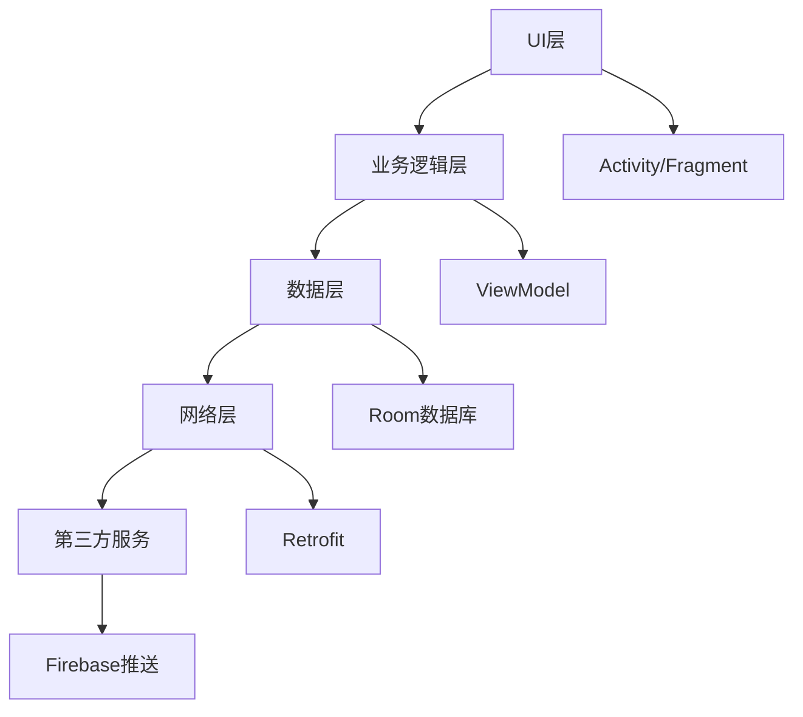

# Android 软件设计开发

## 描述

Android软件设计开发技能专注于Android应用和系统的全生命周期设计开发，涵盖需求分析、技术方案设计、架构评审、性能优化等关键环节。该技能适用于新产品立项、复杂系统架构设计、技术方案评审、遗留系统重构等场景。

## 使用场景

当需要执行以下任务时，应使用此技能：
- 新Android产品立项和需求分析
- 复杂系统架构设计和评审
- 技术方案设计和优化
- 遗留系统重构和迁移
- 多模块/多团队系统拆解
- 性能/稳定性/安全专项设计

## 指令

### 1. 需求分析与建模

**需求分析要求：**
- 分析需求文档，理解业务目标和用户场景
- 评估需求合理性，识别不合理或冲突的需求
- 检查需求完整性，提出缺失的功能点或约束条件
- 根据需求文档进行功能模块拆分

**需求建模输出：**
- 用户故事地图和功能矩阵
- 需求优先级和依赖关系图
- 非功能性需求分析（性能、安全、兼容性等）

### 2. 技术方案设计与评审

**技术方案分析要求：**
- 整体理解技术方案的架构和实现思路
- 评估技术方案合理性，识别潜在的技术风险
- 检查技术方案完整性，确保覆盖所有关键场景
- 分析技术方案的优化点和创新点
- 识别技术方案中的安全漏洞和性能瓶颈

**技术方案评审要点：**
- 技术栈选择和版本兼容性
- 第三方库依赖和许可证合规
- 数据存储和网络通信方案
- 安全机制和隐私保护
- 性能指标和监控方案

### 3. 架构设计与风险审计

**架构设计分析要求：**
- 根据设计文档分析整体架构设计
- 评估架构合理性，识别设计缺陷和耦合问题
- 检查架构完整性，确保模块划分清晰
- 分析架构的可扩展性和可维护性
- 识别架构中的单点故障和安全风险

**架构设计原则：**
- 模块化设计，高内聚低耦合
- 分层架构，清晰的职责边界
- 可测试性设计，便于单元测试和集成测试
- 可观测性设计，完善的日志和监控
- 容错设计，优雅的错误处理机制

### 4. Android系统特性设计

**Android特有设计考虑：**
- Activity/Fragment生命周期管理
- Service/Broadcast/ContentProvider使用场景
- 多进程架构设计
- 后台任务和WorkManager
- 权限管理和安全策略
- 多屏幕适配和响应式设计
- 国际化本地化支持

### 5. 性能与优化设计

**性能设计要点：**
- 内存使用优化和泄漏预防
- 网络请求优化和缓存策略
- 数据库设计和查询优化
- 界面渲染性能优化
- 启动时间和响应速度优化
- 电量消耗优化

### 6. 安全与合规设计

**安全设计要求：**
- 数据加密和存储安全
- 网络通信安全（HTTPS、证书验证）
- 权限最小化原则
- 用户隐私保护
- 代码混淆和反编译防护
- 合规性检查（GDPR、CCPA等）

## 示例

### 输入示例
```
设计一个支持多语言、离线缓存、实时消息推送的新闻阅读应用
```

### 输出示例

**需求分析：**
- **核心功能**：新闻浏览、分类管理、离线阅读、推送通知
- **用户场景**：日常阅读、专题关注、离线使用、个性化推荐
- **非功能性需求**：响应时间<2秒、离线缓存7天、支持10万用户并发

**技术方案：**


**架构设计：**
- **模块划分**：
  - 新闻模块：浏览、搜索、收藏
  - 用户模块：登录、个性化设置
  - 推送模块：消息接收、通知管理
  - 缓存模块：离线数据、图片缓存

- **技术栈选择**：
  - 开发语言：Kotlin + Java
  - 架构模式：MVVM + Repository模式
  - 数据库：Room + SQLite
  - 网络：Retrofit + OkHttp
  - 图片加载：Glide
  - 推送：Firebase Cloud Messaging

**性能优化方案：**
- **内存优化**：使用弱引用缓存、及时释放资源
- **网络优化**：请求合并、数据压缩、智能缓存
- **启动优化**：懒加载、异步初始化
- **渲染优化**：视图复用、布局优化

**安全设计：**
- **数据安全**：AES加密敏感数据
- **通信安全**：HTTPS + 证书锁定
- **权限管理**：运行时权限申请
- **隐私保护**：匿名化用户数据

**风险评估：**
- **技术风险**：第三方服务稳定性、网络连接可靠性
- **安全风险**：数据泄露、恶意攻击
- **性能风险**：内存泄漏、界面卡顿
- **合规风险**：隐私政策、数据存储合规性