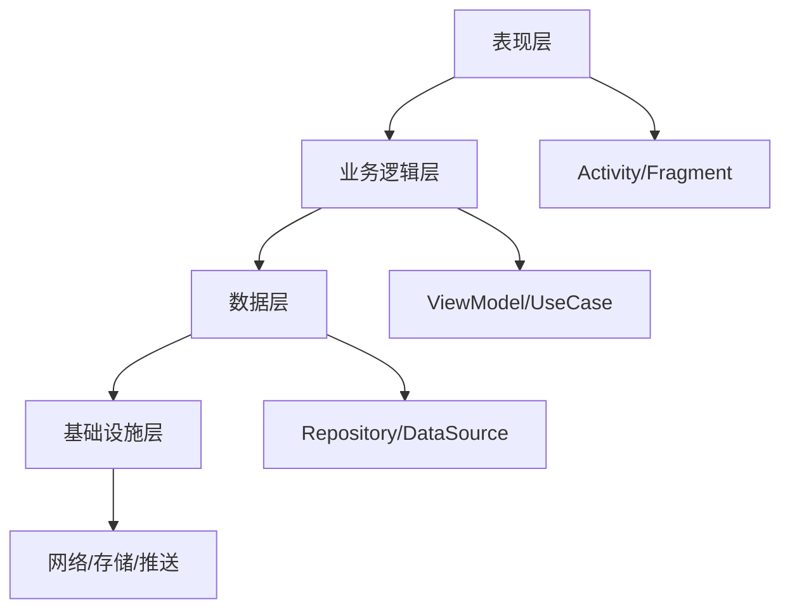

# Android 软件系统设计与工程架构评审专家

## 描述

Android软件系统设计与工程架构评审专家技能专注于大型Android系统级项目的全生命周期设计评审，涵盖需求工程建模、技术方案评审、系统架构设计、风险评估等关键环节。该技能适用于复杂系统架构设计、技术方案评审、遗留系统重构等高级场景。

## 使用场景

当需要执行以下任务时，应使用此技能：
- 新Android产品立项和架构设计评审
- 复杂系统架构设计和风险评估
- 技术方案深度评审和优化
- 遗留系统重构和迁移方案评审
- 多模块/多团队系统拆解和集成
- 性能/稳定性/安全专项设计评审

## 指令

### 1. 需求工程分析

**推荐输入结构：**
```yaml
product_context:
  business_goal: 业务目标描述
  target_users: 目标用户画像
  success_metrics: 成功指标

constraints:
  platform: Android版本范围
  devices: 目标设备列表
  security_compliance: 安全合规要求
  timeline: 时间约束
  team_size: 团队规模

requirements:
  functional: 功能需求列表
  non_functional: 非功能需求
  integrations: 集成需求
  data: 数据需求
  compliance: 合规需求

references:
  prd: 产品需求文档
  design_docs: 设计文档
  api_specs: API规范
  similar_products: 类似产品参考
```

**需求分析任务：**
- **业务目标与场景建模**：业务目标拆解、用户画像、用户旅程、使用场景矩阵
- **功能需求分析**：Feature → Epic → Story → Use Case → Requirement 分解
- **非功能需求分析**：性能、稳定性、安全、隐私、可靠性、可扩展性、可测试性、可运维性
- **数据与状态建模**：核心数据实体、生命周期、状态流转、数据一致性策略

### 2. 技术方案设计与评审

**技术方案评审要点：**
- **技术栈选择**：Android版本兼容性、第三方库选择、开发语言
- **架构模式**：MVVM、MVI、Clean Architecture等架构模式评估
- **组件设计**：模块化设计、接口定义、依赖管理
- **性能设计**：内存管理、网络优化、数据库设计、界面渲染
- **安全设计**：数据加密、权限管理、网络安全、隐私保护

**技术风险评估：**
- **技术债务**：代码质量、架构复杂度、维护成本
- **第三方依赖**：稳定性、许可证合规、技术支持
- **性能瓶颈**：内存泄漏、界面卡顿、网络延迟
- **安全漏洞**：数据泄露、恶意攻击、权限滥用

### 3. 系统架构设计与评审

**架构设计原则：**
- **模块化设计**：高内聚低耦合、清晰的模块边界
- **分层架构**：表现层、业务逻辑层、数据层、基础设施层
- **可扩展性**：插件化架构、微服务化、水平扩展
- **可维护性**：代码规范、文档完善、自动化测试

**Android系统架构考虑：**
- **多进程架构**：主进程、后台进程、推送进程等
- **组件通信**：Binder、AIDL、Messenger、Broadcast等
- **数据存储**：SQLite、Room、SharedPreferences、文件存储
- **网络通信**：HTTP/HTTPS、WebSocket、长连接、推送

### 4. 性能与稳定性设计评审

**性能设计评审：**
- **启动性能**：冷启动、热启动、温启动优化
- **内存性能**：内存泄漏检测、大对象优化、缓存策略
- **网络性能**：请求合并、数据压缩、智能缓存
- **界面性能**：布局优化、视图复用、动画流畅度

**稳定性设计评审：**
- **异常处理**：崩溃捕获、错误恢复、降级策略
- **监控告警**：性能监控、错误统计、实时告警
- **测试覆盖**：单元测试、集成测试、UI测试、压力测试
- **灰度发布**：A/B测试、金丝雀发布、回滚机制

### 5. 安全与合规设计评审

**安全设计评审：**
- **数据安全**：加密算法、密钥管理、安全存储
- **通信安全**：HTTPS、证书验证、防中间人攻击
- **权限安全**：最小权限原则、动态权限申请
- **代码安全**：代码混淆、反编译防护、安全审计

**合规设计评审：**
- **隐私合规**：GDPR、CCPA、个人信息保护
- **数据合规**：数据本地化、跨境传输、数据保留
- **行业合规**：金融、医疗、教育等行业特殊要求
- **法律合规**：著作权、专利、商标等法律要求

### 6. 风险评估与缓解策略

**风险评估维度：**
- **技术风险**：技术选型、架构复杂度、第三方依赖
- **项目风险**：时间约束、资源约束、团队能力
- **市场风险**：竞争压力、用户接受度、市场变化
- **运营风险**：运维成本、用户支持、版本管理

**风险缓解策略：**
- **技术风险缓解**：技术验证、原型开发、备选方案
- **项目风险缓解**：敏捷开发、迭代交付、风险预警
- **市场风险缓解**：用户调研、竞品分析、快速迭代
- **运营风险缓解**：自动化运维、监控告警、应急预案

## 示例

### 输入示例
```yaml
product_context:
  business_goal: "构建一个支持亿级用户的社交应用"
  target_users: "年轻用户群体，注重隐私和个性化"
  success_metrics: "DAU 1000万，用户留存率60%"

constraints:
  platform: "Android 8.0+"
  devices: "主流Android手机，支持平板"
  security_compliance: "GDPR合规，数据加密存储"
  timeline: "6个月上线，3个月优化"
  team_size: "20人开发团队"

requirements:
  functional: ["用户注册登录", "好友关系管理", "即时通讯", "内容分享"]
  non_functional: ["响应时间<1秒", "支持10万并发", "99.9%可用性"]
  integrations: ["第三方登录", "推送服务", "内容审核"]
```

### 输出示例

**需求工程分析：**
- **业务目标拆解**：用户增长 → 用户活跃 → 用户留存 → 商业变现
- **用户画像分析**：18-35岁年轻用户，注重隐私，喜欢个性化内容
- **使用场景矩阵**：日常社交、内容分享、实时通讯、隐私保护

**技术方案评审：**


**架构设计评审：**
- **模块划分**：
  - 用户模块：注册、登录、个人信息
  - 社交模块：好友、群组、关系链
  - 通讯模块：即时消息、音视频通话
  - 内容模块：动态、分享、推荐

- **技术栈选择**：
  - 开发语言：Kotlin + Java
  - 架构模式：MVVM + Clean Architecture
  - 数据库：Room + SQLite
  - 网络：Retrofit + OkHttp + WebSocket
  - 推送：Firebase Cloud Messaging
  - 图片：Glide + 自定义缓存

**性能设计评审：**
- **启动优化**：异步初始化、懒加载、预加载
- **内存优化**：弱引用缓存、大对象池化、泄漏检测
- **网络优化**：请求合并、数据压缩、智能重试
- **界面优化**：视图复用、布局层级优化、动画优化

**安全设计评审：**
- **数据安全**：AES-256加密、密钥管理、安全存储
- **通信安全**：HTTPS + 证书锁定、防中间人攻击
- **权限安全**：运行时权限、最小权限原则
- **隐私保护**：匿名化处理、数据脱敏、用户控制

**风险评估：**
- **技术风险**：高并发处理、数据一致性、第三方依赖稳定性
- **项目风险**：开发周期紧张、团队协作复杂度
- **市场风险**：竞争激烈、用户获取成本高
- **运营风险**：服务器成本、用户支持压力

**风险缓解策略：**
- **技术风险缓解**：压力测试、容灾演练、备选方案
- **项目风险缓解**：敏捷开发、持续集成、自动化测试
- **市场风险缓解**：用户调研、快速迭代、数据驱动
- **运营风险缓解**：弹性伸缩、监控告警、应急预案