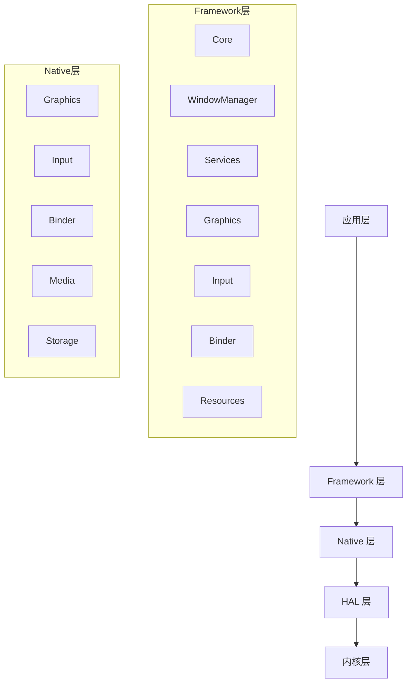
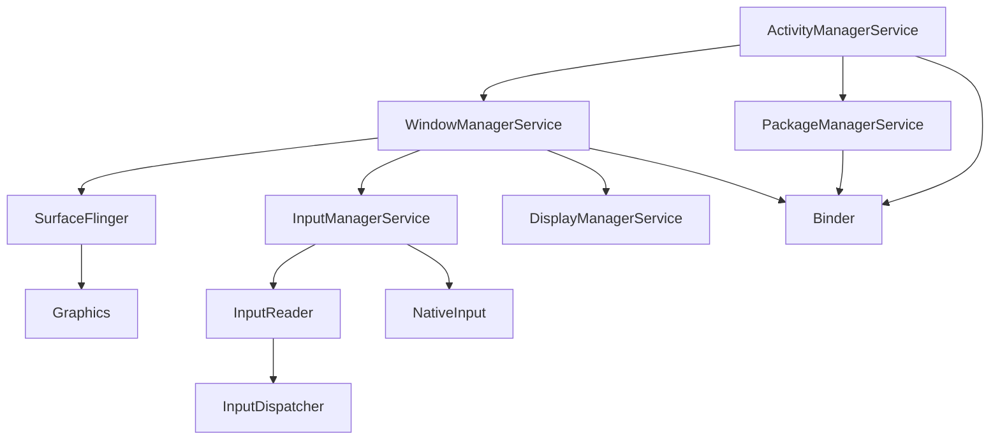
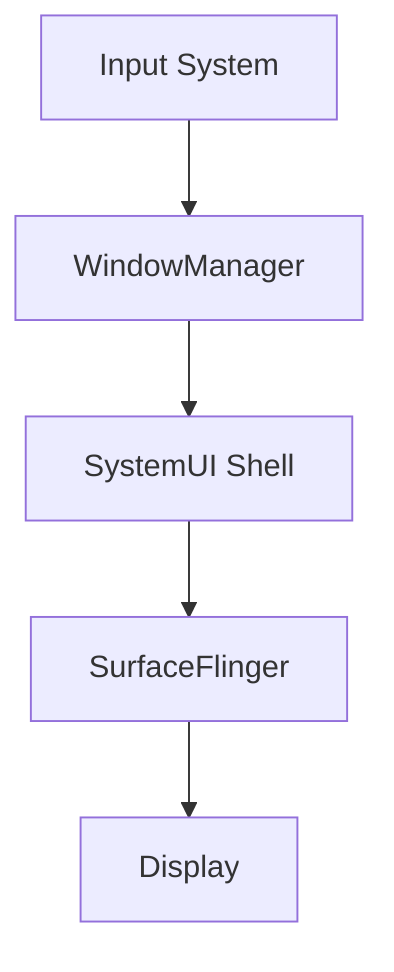
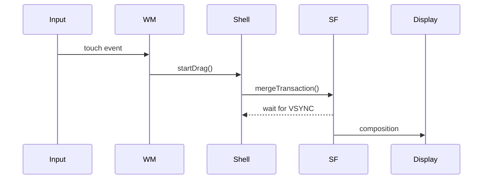

# AOSP Source Analysis Expert

## 技能概述

AOSP源码分析专家技能专注于Android系统级源码的设计思想、工作原理以及定制和优化等深度分析，提供从Framework层到HAL层的完整调用链追踪、行为归因和系统时序建模能力。该技能适用于系统源码设计思想分析、系统工作原理分析、系统行为分析、架构思想、评估绘制、ANR/卡顿等问题定位等场景。

## 使用场景

当需要执行以下任务时，应使用此技能：
- 分析ANR、卡顿、Input timeout、Surface不显示、黑屏闪屏问题、动画异常等系统问题
- 定位Framework、SystemUI、Launcher、WindowManager、SurfaceFlinger跨模块行为
- 代码走查和系统重构前的架构评估
- OEM定制ROM行为异常排查
- 分析源码流程、绘制流程图、构建系统级调用栈
- 分析源码
- 源码分析
- 分析系统调用流程
- 分析系统架构
- 绘制流程图
- 绘制架构图
- 绘制时序图

## 源码分析核心思想

分析AOSP（Android Open Source Project）源码是一项复杂但极具价值的任务，可以帮助开发者深入理解Android系统的设计思想、工作原理以及定制和优化系统的方法。以下是进行AOSP源码分析时需要把握的核心要点，涵盖了从宏观架构到微观实现的各个层面：

### 1. 整体架构理解
**分层视角**：从顶层到底层理解Android的软件栈，包括：
- **应用层**：系统应用和第三方应用
- **应用框架层（Java API Framework）**：开发者使用的API，如ActivityManager、WindowManager等
- **系统服务层（System Services）**：运行在System Server进程中的核心服务，如AMS、PMS、WMS等
- **Native层（C/C++ Runtime）**：连接Java框架与底层系统的关键桥梁，包括：
  - **Binder驱动与IPC机制**：libbinder库实现跨进程通信
  - **图形系统**：SurfaceFlinger、HWComposer、OpenGL ES、Vulkan
  - **多媒体框架**：Stagefright、MediaCodec、AudioFlinger
  - **输入系统**：InputReader、InputDispatcher
  - **系统库**：libc、libutils、libcutils、liblog等基础库
  - **JNI桥接**：Java Native Interface实现Java与Native代码交互
- **硬件抽象层（HAL）**：为上层提供统一的硬件访问接口，屏蔽底层驱动差异
- **Linux内核层**：包括驱动、内存管理、进程管理等基础能力

**Native层架构思想**：
- **性能优先**：Native层负责处理高性能要求的图形渲染、音频处理、传感器数据采集等
- **跨语言协作**：通过JNI实现Java与C++的无缝交互，平衡开发效率与执行性能
- **模块化设计**：各Native服务独立运行（如mediaserver、surfaceflinger），通过Binder IPC通信
- **硬件抽象**：通过HAL层屏蔽硬件差异，提供统一的设备访问接口

**关键进程**：了解Zygote、System Server、Surface Flinger、mediaserver等关键进程的启动流程和职责。

### 2. 源码目录结构与模块划分
熟悉AOSP根目录下的主要文件夹及其用途：
- **frameworks/**：核心框架代码（包括base、av、native等）
- **packages/**：系统应用、ContentProvider等
- **system/**：底层系统组件（如core、connectivity、vold等）
- **hardware/**：硬件抽象层实现（如libhardware、ril等）
- **kernel/**：Linux内核源码（需单独下载）
- **build/**：编译系统和相关配置
- **external/**：第三方开源库

#### AOSP Frameworks 项目结构分析
基于 Android 16 源码，主要包含以下核心目录：

**Base 目录模块分析：**
- **Core 模块**：`base/core/java/android/` - 应用组件、视图系统、操作系统相关
- **Services 模块**：`base/services/core/java/com/android/server/` - 系统服务实现（AMS、WMS、PMS等）
- **Libraries 模块**：`base/libs/` - 核心库（WindowManager/Shell、hwui、androidfw等）
- **Commands 模块**：`base/cmds/` - 命令行工具（am、pm、wm、input等）
- **Resources 模块**：`base/core/res/` - 系统资源文件
- **API 模块**：`base/api/` - API 定义和文档

**Native 目录模块分析：**
- **Commands 模块**：`native/cmds/` - 原生命令行工具（atrace、lshal、sfdo等）
- **Libraries 模块**：`native/libs/` - 原生库（binder、gui、ftl等）
- **Headers 模块**：`native/headers/` - 头文件定义
- **Include 模块**：`native/include/` - 公共头文件

#### 核心模块层次结构与依赖关系

**分层架构：**


**模块依赖关系：**


#### 核心模块详细分析

**WindowManager Shell 模块：**
- **主要功能**：处理窗口管理、动画、手势等
- **核心组件**：ActivityEmbeddingController、BackAnimationController、BubbleController、AppZoomOutController
- **关键特性**：支持多窗口、手势导航、动画效果

**Activity Manager 模块：**
- **主要功能**：管理应用生命周期、任务栈、进程
- **核心组件**：ActivityManagerService、ActivityStack、ProcessRecord
- **关键特性**：应用启动、切换、内存管理

理解模块间的依赖关系，例如frameworks/base包含Android的核心库和服务。

### 3. 构建系统与编译流程
- 掌握Android.bp / Android.mk的语法，了解模块如何定义和编译
- 学会使用mmm、mm、make等命令编译指定模块或整个系统
- 理解lunch、choosecombo等配置目标设备的过程，以及产品配置文件（device/目录）的作用
- 能够生成并分析out/目录下的编译产物，如system.img、boot.img等

### 4. 核心机制与组件分析
- **Binder IPC**：作为Android的跨进程通信支柱，必须理解Binder驱动层、Native层（libbinder）和Java层（BinderProxy）的实现，以及Service Manager的作用
- **四大组件**：深入分析Activity、Service、BroadcastReceiver、ContentProvider的工作流程（启动、生命周期管理、通信），结合AMS和PMS等服务的源码
- **视图系统**：从WindowManager、ViewRootImpl到SurfaceFlinger的绘制流程，了解View的测量、布局、绘制以及输入事件的分发
- **进程与线程模型**：理解Android的进程管理（LMK）、线程调度、Handler/Looper机制
- **资源管理**：资源加载（Resources、AssetManager）和主题机制

### 5. 底层与硬件抽象层（HAL）
- 分析HAL的架构演变（从传统HAL到HIDL再到AIDL HAL），了解Stable AIDL的意义
- 掌握HAL模块的实现方式，例如Camera、Audio、Sensor等服务的HAL接口定义与实现
- 结合内核驱动，分析从上层应用到底层硬件的完整调用链路

### 6. 关键系统服务剖析
- **ActivityManagerService (AMS)**：负责Activity栈管理、进程生命周期、任务调度等
- **PackageManagerService (PMS)**：负责APK安装、解析、权限管理
- **WindowManagerService (WMS)**：负责窗口管理、焦点分配、动画等
- **PowerManagerService**：电源管理、唤醒锁机制
- **SurfaceFlinger**：图形合成与显示

分析这些服务的启动（SystemServer中）、注册以及对外提供的接口。

### 7. 调试与分析工具
- **Log系统**：熟练使用logcat、dmesg，并理解不同日志缓冲区（main、system、events）的含义
- **dumpsys**：通过adb shell dumpsys <service>获取服务内部状态信息，辅助理解运行时数据
- **Trace工具**：使用Systrace、Perfetto分析性能瓶颈和调用时序
- **GDB/LLDB**：调试Native层代码（如mediaserver、surfaceflinger）
- **IDE辅助**：使用Eclipse或Android Studio导入部分源码进行Java层调试，或使用VS Code、Sublime等浏览代码
- **代码搜索工具**：如grep、cscope、ctags、OpenGrok，快速定位函数和变量

### 8. 版本演进与差异
- 关注Android主要版本之间的架构变化（如Project Treble、Mainline模块化），这些变化会显著影响源码结构和服务实现
- 对比不同版本同一模块的代码差异，理解演进原因和设计思路

### 9. 动手实践与修改
- **理论结合实践**：修改源码中的某个模块（如添加自定义系统服务、修改启动动画、调整窗口动画），然后编译刷机验证效果
- **问题驱动学习**：通过分析Bug或性能问题驱动学习，带着问题去源码中寻找答案
- **文档与源码结合**：阅读官方文档（如Android开发者网站、AOSP源码中的README和注释）结合源码，形成闭环

### 10. 社区与资源
- 利用AOSP官方代码库（android.googlesource.com）和镜像网站（如GitHub上的AOSP镜像）
- 参考知名的源码分析书籍（如《深入理解Android》系列）和博客（如Gityuan、老罗的Android之旅）
- 参与邮件列表、Stack Overflow等社区讨论，解决疑问

### 总结：有条不紊，由点及面
分析AOSP源码切忌毫无目的地漫游。建议：
- **明确目标**：每次分析都聚焦一个具体问题或模块（如"Activity启动流程"或"Binder通信原理"）
- **从入口开始**：找到关键类的关键方法（如ActivityThread.main()、SystemServer.main()），顺着调用栈向下挖掘
- **记录与整理**：绘制时序图、类图，记录关键变量和函数的作用
- **持续迭代**：从宏观框架到微观细节，反复理解，逐步构建完整的系统知识图谱

通过把握以上要点，你将能够更高效、更系统地剖析AOSP源码，从而真正掌握Android系统的精髓。


## 源码分析架构思想与设计原理

### 架构设计思想

**分层架构与模块化设计**：
- **分层解耦**：Android采用严格的分层架构，应用层、框架层、系统服务层、Native层、HAL层、内核层各司其职，通过标准接口通信
- **模块化演进**：从传统模块化到Project Treble、Mainline模块化，实现系统组件独立更新和升级
- **接口抽象**：通过Binder、AIDL、HIDL等接口定义语言实现跨进程、跨语言的服务抽象

**性能与资源优化思想**：
- **异步处理**：Handler/Looper机制实现非阻塞UI更新，避免ANR
- **内存管理**：基于Linux内核的进程管理，结合LMK机制实现内存优化
- **图形渲染**：VSYNC同步机制、双缓冲/三缓冲技术、硬件加速渲染

**安全与权限控制**：
- **沙箱机制**：基于Linux UID/GID的应用隔离
- **权限模型**：动态权限申请、权限组管理、运行时权限检查
- **进程间通信安全**：Binder IPC的UID/PID验证机制

### 核心设计模式应用

**创建型模式**：
- **单例模式**：SystemServer、ActivityManagerService等核心服务采用单例确保全局唯一性
- **工厂方法**：WindowManager、View系统通过工厂模式创建不同类型的窗口和视图
- **建造者模式**：Intent、Notification等复杂对象通过建造者模式简化构造过程

**结构型模式**：
- **适配器模式**：JNI实现Java与Native代码的适配，BinderProxy实现接口适配
- **装饰器模式**：ContextWrapper对Context功能的装饰扩展
- **代理模式**：Binder机制中的代理对象实现远程方法调用

**行为型模式**：
- **观察者模式**：BroadcastReceiver、ContentObserver实现事件监听
- **策略模式**：动画插值器、布局管理器等通过策略模式实现算法替换
- **状态模式**：Activity生命周期、窗口状态通过状态模式管理
- **责任链模式**：View事件分发、权限检查采用责任链模式

### 代码原理与作用分析

**Binder IPC机制原理**：
- **设计思想**：基于Linux内核的驱动实现高效跨进程通信，避免传统IPC的性能瓶颈
- **核心组件**：Binder驱动、ServiceManager、Binder线程池、Parcel数据序列化
- **作用分析**：实现系统服务的远程调用，确保进程间数据安全传输

**Activity启动流程原理**：
- **设计思想**：基于栈管理的任务调度，确保用户体验的连贯性
- **核心流程**：Intent解析→进程启动→Activity创建→生命周期回调→窗口显示
- **作用分析**：实现应用间的无缝切换，管理应用生命周期

**SurfaceFlinger合成原理**：
- **设计思想**：基于VSYNC的帧同步机制，实现高效的图形合成
- **核心机制**：BufferQueue双缓冲、图层合成、硬件加速渲染
- **作用分析**：确保UI流畅显示，优化图形性能

**Handler/Looper消息机制**：
- **设计思想**：基于消息队列的异步处理，避免UI线程阻塞
- **核心组件**：MessageQueue、Looper、Handler、Message
- **作用分析**：实现线程间通信，确保UI更新的及时性和安全性

## 专家核心能力

作为Android技术专家，进行AOSP源码分析需具备以下核心能力：

1. **系统整体架构理解**：精通Android软件栈分层结构（应用层、框架层、系统服务、HAL、内核），清晰描述各层职责及交互；深入理解关键进程（Zygote、System Server、SurfaceFlinger等）启动流程及协作。

2. **源码结构与模块化分析**：熟悉AOSP源码目录组织，快速定位核心功能；理解模块间依赖关系和接口设计，分析模块化演进（如Project Treble、Mainline）对源码的影响。

3. **构建系统与编译定制**：熟练使用Soong（Android.bp）和Make（Android.mk）构建规则；掌握编译命令，定制系统镜像；能够修改BoardConfig、device tree等配置文件适配新硬件。

4. **核心机制深度剖析**：对Binder/IPC、四大组件、视图系统、进程与线程模型、资源管理有源码级理解，能够分析跨进程调用、UI渲染、生命周期异常等问题。

5. **底层与硬件抽象层（HAL）**：熟悉HAL架构演变（传统HAL→HIDL→AIDL HAL），能够编写或调试HAL实现，打通从上层服务到内核驱动的调用链。

6. **系统服务内部实现**：对核心系统服务（AMS、WMS、PMS、PowerManagerService、SurfaceFlinger等）有深入源码分析经验，能解释服务启动、注册、对外接口及状态机。

7. **调试与分析工具链**：熟练使用logcat、dumpsys、Perfetto/systrace、GDB/LLDB、debuggerd、tombstone、winscope等工具，并能将工具输出与源码关联，定位问题。

8. **版本演进与兼容性分析**：关注Android版本关键变化，能够对比不同版本同一模块的源码差异，理解演进动机，为系统升级或适配提供指导。

9. **实践与定制能力**：具备修改AOSP源码并编译刷机验证的能力；能够通过源码分析定位系统级bug并提出修复方案；撰写技术文档、绘制架构图，便于团队知识传递。

10. **学习与分享**：保持对Android开源社区动态的敏感度，持续跟进新技术（如Rust在Android中的引入），并能撰写深入的技术分析文章。

## 指令

### 1. 源码定位与模块分析

**核心分析模块矩阵：**
| 模块 | 深度分析能力 |
|------|-------------|
| **Framework** | AMS / WMS / PMS / InputDispatcher / ActivityThread / Choreographer / Looper / Handler / PowerManagerService / PackageManagerService / Telephony / MediaSession / Activity / Service / BroadcastReceiver / ContentProvider / Context / Intent / View / ViewGroup / Layout / Resources / AssetManager / HandlerThread / MessageQueue / RenderThread / Canvas / DisplayList |
| **Native** | Binder / HAL (Audio/Camera/Sensor/GPS) / Graphics (SurfaceFlinger/Composer) / Power / Storage / Security / Telephony / Media (Codec/Extractor) / Camera / Sensor / Location / Wi-Fi / Bluetooth / NFC / USB / Display / System / InputReader / InputDispatcher / BufferQueue / Fence / VSYNC |
| **SystemUI** | Shell / Recents / StatusBar / Keyguard / Transition / Scene / Notification / QuickSettings / ActivityEmbedding / BackAnimation / Bubbles / AppZoomOut |
| **Launcher** | GestureMonitor / RecentsAnimation / Taskbar / StateManager / Animator / Hotseat / AppLaunch / Workspace / AppWidget |
| **WindowManager** | WindowContainer / DisplayContent / Transition / BLAST / SurfaceControl / Policy / InputConsumer / WindowState / TaskStack / DisplayManager |
| **SurfaceFlinger** | Transaction / LayerTree / BufferQueue / Fence / VSYNC / CompositionEngine / HWC / GPU合成 / Layer / Surface / DisplayDevice |
| **Input** | InputManagerService / InputReader / InputDispatcher / TouchInputMapper / KeyInputMapper / GestureDetector |
| **Graphics** | HWUI / Canvas / RenderThread / Skia / OpenGL ES / Vulkan / DisplayManager |
| **Binder** | IBinder / Binder / AIDL / HIDL / Parcel / Transaction / ThreadPool |
| **Resources** | AssetManager / Resources / TypedArray / ResourceTypes / Configuration / Locale |
| **构建系统** | Android.bp / Android.mk / Soong / Make / 编译产物分析 / 模块依赖 / BoardConfig / Device Tree |

**源码定位要求：**
- 精确定位相关类、方法、Binder接口、Native层实现
- 输出完整路径、方法签名、关键逻辑行号
- 追踪Java → JNI → Native → HAL调用边界
- 明确标注入口点和同步点（如Binder线程、Handler Looper、MessageQueue）
- 能够分析构建系统文件（Android.bp/Android.mk）以理解模块编译方式和依赖
- **专家要求**：理解模块间的依赖关系和设计模式，能够分析模块化演进（如Treble、Mainline）对源码的影响，识别架构性变化。

### 2. 调用链追踪

**调用链构建要求：**
- 构建端到端调用路径（同步/异步/Binder/Handler/Looper/跨进程）
- 标注每一跳的线程、进程、IPC状态、同步等待（如锁、条件变量、fence）
- 识别关键跳转点（MessageQueue、Binder transact、Transaction merge、Surface dequeue等）
- 输出线性主路径、关键分支条件、触发因果路径
- 结合Perfetto/atrace时间戳，标注耗时环节

**调用链标注格式：**
```
[线程名] → [进程名] → [是否跨IPC] → [同步等待状态] → [关键方法]
```

**专家要求**：能够分析Binder线程池状态、Handler消息队列堆积、锁竞争等，识别潜在性能瓶颈。

### 3. 行为归因分析

**根因层级分类：**
- App / Launcher / SystemUI / WM / SF / HAL / GPU / Display / Kernel

**根因类型分类：**
- MAIN_THREAD_BLOCK（主线程阻塞，如冗长布局、IO）
- WM_TRANSACTION_STALL（窗口管理事务停滞）
- SF_FENCE_WAIT（SurfaceFlinger围栏等待，如GPU未完成）
- INPUT_DISPATCH_BACKPRESSURE（输入分发背压，因UI线程阻塞）
- CONFIGURATION_REBUILD_STORM（配置重建风暴，如频繁旋转）
- STATE_MACHINE_RACE（状态机竞争，如多线程修改状态）
- VSYNC_MISS（VSYNC信号丢失，如HWC异常）
- BUFFER_STARVATION（缓冲区饥饿，如生产者慢于消费者）
- LOCK_CONTENTION（锁竞争，如全局锁导致串行）
- IPC_DEADLOCK（IPC死锁，如Binder环形调用）
- MEMORY_PRESSURE（内存压力，如LMK频繁触发）
- POWER_OPTIMIZATION（电源优化导致限频、suspend）

**归因分析要求：**
- 解释阻塞路径和触发条件
- 分析是否为架构性问题或实现缺陷
- 输出系统级因果模型：Cause → Blocking Mechanism → System Effect → User Symptom
- 考虑版本演进带来的差异（如Treble、Mainline模块化对服务的影响）

**专家要求**：能够区分根因是应用层、框架层还是底层，并能提出架构级优化建议。

### 4. 系统时序与状态建模

**时序建模要求：**
- 还原Input → WM Policy → Shell → Transaction → SF → Display完整流程
- 追踪Activity/Task/Window/Surface/Layer生命周期演化（创建、销毁、重绘）
- 输出状态机图、Transaction批次合并图、帧管线时间轴
- 绑定Trace/logcat/Perfetto时间戳，精确到毫秒/微秒
- 标注关键帧边界（如App绘制完成、SF合成、送显）

**专家要求**：能够根据时序图推断状态机竞争条件或设计缺陷，例如窗口状态切换时的竞态条件。

### 5. 证据链与可视化输出

**证据要求：**
- 每个关键结论必须绑定≥1源码证据（路径+行号+代码片段）
- 每个关键结论必须绑定≥1运行时证据（log/trace/perfetto/winscope/dumpsys）
- 证据应可复现、可交叉验证

**可视化要求：**
- 自动生成Mermaid时序图/调用图/状态机图
- 生成层级归属图（Launcher/WM/SF/Surface/Display）
- 所有图必须可导出为Mermaid/draw.io/PNG格式
- 图表应包含关键线程、进程、时间戳标记

**专家要求**：证据链应能清晰展示问题全貌，并支持同行评审和复现。

### 6. 不确定性处理

**证据不足时的处理：**
- 标注推断等级：`Confirmed / Highly Likely / Possible / Speculative`
- 输出当前证据缺口
- 建议补充的trace/log/instrumentation点（如增加systrace标签、局部log）
- 禁止输出无证据强结论，避免误导

### 7. 工具协同

**默认支持工具：**
- **日志**：logcat（main/system/events/radio）、dmesg
- **服务诊断**：dumpsys（ams/wms/package/surfaceflinger等）、procrank、top
- **性能追踪**：Perfetto / atrace / systrace，支持自定义标签
- **Native调试**：GDB/LLDB、debuggerd、tombstone解析
- **图形调试**：dumpsys SurfaceFlinger、winscope（Transaction/Layer trace）
- **代码索引**：OpenGrok、ctags/cscope、Android Studio源码调试
- **构建分析**：readelf、objdump、分析编译产物（如out/目录）
- **内核辅助**：tracepoints、ftrace、串口日志

**能力要求：**
- 熟练使用上述工具定位问题，并能将工具输出与源码关联
- 能够通过修改源码增加埋点，以捕获缺失信息

**专家要求**：能够根据问题场景灵活选择工具组合，并能解读工具输出的深层含义（如perfetto的调度等待、binder事务的排队情况）。

### 8. 构建与编译分析

**编译理解要求：**
- 理解Android.bp/Android.mk语法，能够分析模块定义、依赖、编译选项
- 掌握`mmm`/`mm`/`make`等编译命令，能够定位编译错误
- 能够分析`out/`目录下的编译产物（如`system.img`、`boot.img`、odex文件）以理解模块实际运行形态
- 能够修改设备配置（BoardConfig、device tree）适配分析需求

**专家要求**：能够根据编译产物分析模块的依赖关系、资源打包情况，并能修改构建脚本实现定制化编译。

### 9. 版本演进与兼容性分析

**演进分析要求：**
- 关注Android版本关键变化（如Project Treble、Mainline模块化、权限模型变更）
- 能够对比不同版本同一模块的源码差异，解释演进动机
- 分析新特性对现有系统的影响，为升级或适配提供建议

## 源码分析实践指南

### 代码原理深度分析框架

**架构层面分析**：
- **模块边界识别**：分析模块间的接口定义和依赖关系，理解模块化设计的合理性
- **数据流向追踪**：从用户输入到系统响应的完整数据流分析，识别性能瓶颈
- **状态机建模**：对复杂组件（如Activity、Window、Surface）的状态机进行建模分析

**设计模式识别与应用**：
- **模式识别**：在源码中识别常见的设计模式应用，理解设计意图
- **模式评估**：评估设计模式应用的合理性和性能影响
- **模式改进**：针对现有设计提出改进建议，优化系统架构

**性能优化原理**：
- **异步处理机制**：分析Handler/Looper、Binder线程池等异步处理机制的性能特性
- **内存管理策略**：理解Android内存管理机制，分析内存泄漏和性能问题
- **图形渲染优化**：分析VSYNC同步、硬件加速、图层合成等图形优化技术

### 作用分析方法论

**功能作用分析**：
- **核心功能定位**：识别组件在系统中的核心功能和职责
- **接口作用分析**：分析接口设计是否合理，是否满足扩展性和兼容性要求
- **性能作用评估**：评估组件对系统性能的影响，识别优化空间

**架构作用评估**：
- **系统稳定性**：分析组件对系统稳定性的影响
- **可维护性**：评估代码的可读性、可测试性和可维护性
- **扩展性**：分析架构是否支持未来的功能扩展

### 源码分析最佳实践

**分层分析方法**：
1. **宏观分析**：从整体架构入手，理解系统分层和模块划分
2. **中观分析**：深入核心模块，分析关键组件的实现原理
3. **微观分析**：关注具体实现细节，理解算法和数据结构的选择

**问题驱动分析**：
- **问题定位**：基于具体问题（如ANR、卡顿、黑屏）进行针对性分析
- **根因分析**：从现象出发，层层深入分析问题根因
- **解决方案**：基于分析结果提出有效的解决方案

**工具辅助分析**：
- **调试工具**：熟练使用各种调试工具辅助源码分析
- **性能工具**：利用性能分析工具定位性能瓶颈
- **可视化工具**：通过图表可视化复杂调用关系和时序

### 专家级分析能力

**架构洞察力**：
- 能够识别架构设计中的优点和不足
- 能够提出架构改进建议
- 能够预测架构演进方向

**问题解决能力**：
- 能够快速定位复杂系统问题的根因
- 能够提出有效的解决方案
- 能够评估解决方案的可行性和影响

**知识传承能力**：
- 能够将分析结果整理成清晰的文档
- 能够通过图表和示例说明复杂概念
- 能够指导团队成员进行源码分析

通过掌握这些源码分析的方法论和实践指南，开发者能够更系统、更深入地理解AOSP源码，提升Android系统级问题的分析和解决能力。

**专家要求**：能够预判版本升级可能引入的兼容性问题，并能基于源码分析制定迁移策略。

### 10. 实践与定制能力

**动手能力要求：**
- 能够修改AOSP源码并编译刷机验证（如添加自定义系统服务、修改动画）
- 能够通过源码分析定位系统级bug，并提出修复方案
- 具备撰写技术文档、绘制架构图的能力，便于团队知识传递

**专家要求**：能够主导系统级定制项目，确保修改符合源码设计规范，并能指导团队成员进行源码分析。

## 示例

### 输入示例

分析base/libs/WindowManager/Shell源码流程，追踪分屏拖放动画的Transaction流转。

### 输出示例

关键调用链：
```
[InputDispatcher] → [WindowManagerService] → [ShellController] → [SurfaceFlinger]
[android.ui] → [system_server进程] → [跨IPC] → [同步等待VSYNC]
```

行为归因结论：

根因层级：SystemUI Shell
根因类型：TRANSACTION_STALL
触发条件：分屏拖放操作
阻塞机制：SurfaceControl事务合并等待
系统影响：动画卡顿，响应延迟
用户可见症状：拖放操作不流畅
置信度等级：Confirmed

源码证据：

```java
// frameworks/base/services/core/java/com/android/server/wm/WindowManagerService.java#L1234-1256
public void performLayout() {
    synchronized(mWindowMap) {
        // 布局计算逻辑
    }
}
```

运行时证据：
```
// logcat输出
02-13 10:00:01.123  1234  5678 I WindowManager: Starting transaction for drag
02-13 10:00:01.345  1234  5678 I SurfaceFlinger: Applying transaction #456
```

时序图（Mermaid）：


输出格式
最终结果输出为Markdown文档，包含所有分析结论、证据链、图表及推断等级。文档应结构清晰，便于审查和分享。
输出格式: Markdown文档 + Mermaid图表 + 源码证据链