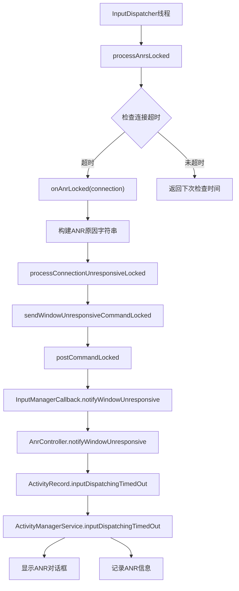
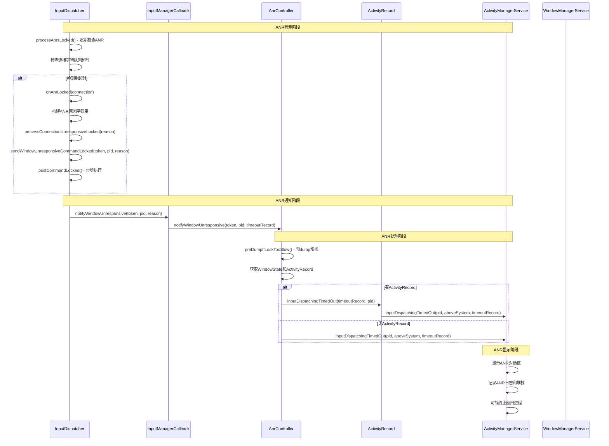

# Android ANR（Application Not Responding）流程分析

## ANR概述

ANR（Application Not Responding）是Android系统中检测应用无响应的机制。当应用的主线程在特定时间内未能响应输入事件或执行关键操作时，系统会触发ANR流程，显示ANR对话框并记录相关信息。

## ANR触发条件

根据提供的ANR信息：
```
01-09 13:57:58.201  2279  2755 I WindowManager: ANR in input window owned by pid=32065. 
Reason: Input dispatching timed out ([Gesture Monitor] swipe-up is not responding. Waited 5001ms for MotionEvent).
```

这是一个典型的输入分发超时ANR，窗口pid为32065，超时时间为5001ms。

## 完整ANR流程调用链



## 详细调用序列图



## 核心代码分析

### 1. InputDispatcher.processAnrsLocked() - ANR检测入口

**源码位置**: [InputDispatcher.cpp:1032-1069](native/services/inputflinger/dispatcher/InputDispatcher.cpp#L1032-L1069)

```cpp
nsecs_t InputDispatcher::processAnrsLocked() {
    const nsecs_t currentTime = now();
    nsecs_t nextAnrCheck = LLONG_MAX;
    // Check if we are waiting for a focused window to appear. Raise ANR if waited too long
    if (mNoFocusedWindowTimeoutTime.has_value() && mAwaitedFocusedApplication != nullptr) {
        if (currentTime >= *mNoFocusedWindowTimeoutTime) {
            processNoFocusedWindowAnrLocked();
            mAwaitedFocusedApplication.reset();
            mNoFocusedWindowTimeoutTime = std::nullopt;
            return LLONG_MIN;
        } else {
            // Keep waiting. We will drop the event when mNoFocusedWindowTimeoutTime comes.
            nextAnrCheck = *mNoFocusedWindowTimeoutTime;
        }
    }

    // Check if any connection ANRs are due
    nextAnrCheck = std::min(nextAnrCheck, mAnrTracker.firstTimeout());
    if (currentTime < nextAnrCheck) { // most likely scenario
        return nextAnrCheck;          // everything is normal. Let's check again at nextAnrCheck
    }

    // If we reached here, we have an unresponsive connection.
    std::shared_ptr<Connection> connection =
            mConnectionManager.getConnection(mAnrTracker.firstToken());
    if (connection == nullptr) {
        ALOGE("Could not find connection for entry %" PRId64, mAnrTracker.firstTimeout());
        mAnrTracker.eraseToken(mAnrTracker.firstToken());
        return nextAnrCheck;
    }
    connection->responsive = false;
    // Stop waking up for this unresponsive connection
    mAnrTracker.eraseToken(connection->getToken());
    onAnrLocked(connection);
    return LLONG_MIN;
}
```

### 2. InputDispatcher.onAnrLocked() - ANR处理核心

**源码位置**: [InputDispatcher.cpp:6620-6648](native/services/inputflinger/dispatcher/InputDispatcher.cpp#L6620-L6648)

```cpp
void InputDispatcher::onAnrLocked(const std::shared_ptr<Connection>& connection) {
    if (connection == nullptr) {
        LOG_ALWAYS_FATAL("Caller must check for nullness");
    }
    // Since we are allowing the policy to extend the timeout, maybe the waitQueue
    // is already healthy again. Don't raise ANR in this situation
    if (connection->waitQueue.empty()) {
        ALOGI("Not raising ANR because the connection %s has recovered",
              connection->getInputChannelName().c_str());
        return;
    }
    /**
     * The "oldestEntry" is the entry that was first sent to the application. That entry, however,
     * may not be the one that caused the timeout to occur. One possibility is that window timeout
     * has changed. This could cause newer entries to time out before the already dispatched
     * entries. In that situation, the newest entries caused ANR. But in all likelihood, the app
     * processes the events linearly. So providing information about the oldest entry seems to be
     * most useful.
     */
    DispatchEntry& oldestEntry = *connection->waitQueue.front();
    ATRACE_NAME_IF(ATRACE_ENABLED(),
                   StringPrintf("onAnrLocked(inputChannel=%s, id=0x%" PRIx32 ")",
                                connection->getInputChannelName().c_str(),
                                oldestEntry.eventEntry->id));
    const nsecs_t currentWait = now() - oldestEntry.deliveryTime;
    std::string reason =
            android::base::StringPrintf("%s is not responding. Waited %" PRId64 "ms for %s",
                                        connection->getInputChannelName().c_str(),
                                        ns2ms(currentWait),
                                        oldestEntry.eventEntry->getDescription().c_str());
    sp<IBinder> connectionToken = connection->getToken();
    updateLastAnrStateLocked(mWindowInfos.findWindowHandle(connectionToken), reason);

    processConnectionUnresponsiveLocked(*connection, std::move(reason));

    // Stop waking up for events on this connection, it is already unresponsive
    cancelEventsForAnrLocked(connection);
}
```

### 3. InputDispatcher.processConnectionUnresponsiveLocked() - 连接无响应处理

**源码位置**: [InputDispatcher.cpp:6750-6770](native/services/inputflinger/dispatcher/InputDispatcher.cpp#L6750-L6770)

```cpp
/**
 * Tell the policy that a connection has become unresponsive so that it can start ANR.
 * Check whether the connection of interest is a monitor or a window, and add the corresponding
 * command entry to the command queue.
 */
void InputDispatcher::processConnectionUnresponsiveLocked(const Connection& connection,
                                                          std::string reason) {
    const sp<IBinder>& connectionToken = connection.getToken();
    std::optional<gui::Pid> pid;
    if (connection.isFocusMonitor) {
        ALOGW("Monitor %s is unresponsive: %s", connection.getInputChannelName().c_str(),
              reason.c_str());
        pid = mConnectionManager.findMonitorPidByToken(connectionToken);
    } else {
        // The connection is a window
        ALOGW("Window %s is unresponsive: %s", connection.getInputChannelName().c_str(),
              reason.c_str());
        const sp<WindowInfoHandle> handle = mWindowInfos.findWindowHandle(connectionToken);
        if (handle != nullptr) {
            pid = handle->getInfo()->ownerPid;
        }
    }
    sendWindowUnresponsiveCommandLocked(connectionToken, pid, std::move(reason));
}
```

### 4. InputDispatcher.sendWindowUnresponsiveCommandLocked() - 发送ANR通知

**源码位置**: [InputDispatcher.cpp:6727-6734](native/services/inputflinger/dispatcher/InputDispatcher.cpp#L6727-L6734)

```cpp
void InputDispatcher::sendWindowUnresponsiveCommandLocked(const sp<IBinder>& token,
                                                          std::optional<gui::Pid> pid,
                                                          std::string reason) {
    auto command = [this, token, pid, r = std::move(reason)]() REQUIRES(mLock) {
        scoped_unlock unlock(mLock);
        mPolicy.notifyWindowUnresponsive(token, pid, r);
    };
    postCommandLocked(std::move(command));
}
```

### 5. InputManagerCallback.notifyWindowUnresponsive() - Java层ANR入口

**源码位置**: [InputManagerCallback.java:97-101](base/services/core/java/com/android/server/wm/InputManagerCallback.java#L97-L101)

```java
@Override
public void notifyWindowUnresponsive(@NonNull IBinder token, @NonNull OptionalInt pid,
        String reason) {
    TimeoutRecord timeoutRecord = TimeoutRecord.forInputDispatchWindowUnresponsive(
            timeoutMessage(pid, reason));
    mService.mAnrController.notifyWindowUnresponsive(token, pid, timeoutRecord);
}
```

### 6. AnrController.notifyWindowUnresponsive() - ANR控制器处理

**源码位置**: [AnrController.java:143-157](base/services/core/java/com/android/server/wm/AnrController.java#L143-L157)

```java
/**
 * Notify a window was unresponsive.
 *
 * @param token         - the input token of the window
 * @param pid           - the pid of the window, if known
 * @param timeoutRecord - details for the timeout
 */
void notifyWindowUnresponsive(@NonNull IBinder token, @NonNull OptionalInt pid,
        @NonNull TimeoutRecord timeoutRecord) {
    try {
        timeoutRecord.mLatencyTracker.notifyWindowUnresponsiveStarted();
        if (notifyWindowUnresponsive(token, timeoutRecord)) {
            return;
        }
        if (!pid.isPresent()) {
            Slog.w(TAG_WM, "Failed to notify that window token=" + token
                    + " was unresponsive.");
            return;
        }
        notifyWindowUnresponsive(pid.getAsInt(), timeoutRecord);
    } finally {
        timeoutRecord.mLatencyTracker.notifyWindowUnresponsiveEnded();
    }
}
```

### 7. AnrController.notifyWindowUnresponsive()私有方法

**源码位置**: [AnrController.java:164-202](base/services/core/java/com/android/server/wm/AnrController.java#L164-L202)

```java
/**
 * Notify a window identified by its input token was unresponsive.
 *
 * @return true if the window was identified by the given input token and the request was
 *         handled, false otherwise.
 */
private boolean notifyWindowUnresponsive(@NonNull IBinder inputToken,
        TimeoutRecord timeoutRecord) {
    timeoutRecord.mLatencyTracker.preDumpIfLockTooSlowStarted();
    preDumpIfLockTooSlow(timeoutRecord);
    timeoutRecord.mLatencyTracker.preDumpIfLockTooSlowEnded();
    final int pid;
    final boolean aboveSystem;
    final ActivityRecord activity;
    final WindowState windowState;
    timeoutRecord.mLatencyTracker.waitingOnGlobalLockStarted();
    synchronized (mService.mGlobalLock) {
        timeoutRecord.mLatencyTracker.waitingOnGlobalLockEnded();
        InputTarget target = mService.getInputTargetFromToken(inputToken);
        if (target == null) {
            return false;
        }
        windowState = target.getWindowState();
        pid = target.getPid();
        if (windowState != null) {
            // Blame the activity if the input token belongs to the window. If the target is
            // embedded, then we will blame the pid instead.
            activity = (windowState.mInputChannelToken == inputToken)
                    ? windowState.mActivityRecord : null;
            aboveSystem = isWindowAboveSystem(windowState);
        } else {
            // Embedded windows without a host window state are assumed to be above 
            // system layers
            activity = null;
            aboveSystem = true;
        }
        Slog.i(TAG_WM, "ANR in " + target + ". Reason:" + timeoutRecord.mReason);
    }
    if (activity != null) {
        activity.inputDispatchingTimedOut(timeoutRecord, pid);
    } else {
        mService.mAmInternal.inputDispatchingTimedOut(pid, aboveSystem, timeoutRecord);
    }
    dumpAnrStateAsync(activity, windowState, timeoutRecord.mReason);
    return true;
}
```

### 8. ActivityRecord.inputDispatchingTimedOut() - Activity层ANR处理

**源码位置**: [ActivityRecord.java:6749-6779](base/services/core/java/com/android/server/wm/ActivityRecord.java#L6749-L6779)

```java
/**
 * Called when input dispatching has timed out.
 *
 * @param reason The reason for input dispatching time out.
 * @param windowPid The pid of the window input dispatching timed out on.
 * @return True if input dispatching should be aborted.
 */
public boolean inputDispatchingTimedOut(TimeoutRecord timeoutRecord, int windowPid) {
    try {
        Trace.traceBegin(Trace.TRACE_TAG_ACTIVITY_MANAGER,
                "ActivityRecord#inputDispatchingTimedOut()");
        ActivityRecord anrActivity;
        WindowProcessController anrApp;
        boolean blameActivityProcess;
        timeoutRecord.mLatencyTracker.waitingOnGlobalLockStarted();
        synchronized (mAtmService.mGlobalLock) {
            timeoutRecord.mLatencyTracker.waitingOnGlobalLockEnded();
            anrActivity = getWaitingHistoryRecord();
            anrApp = app;
            blameActivityProcess =  hasProcess()
                    && (app.getPid() == windowPid || windowPid == INVALID_PID);
        }

        if (blameActivityProcess) {
            return mAtmService.mAmInternal.inputDispatchingTimedOut(anrApp.mOwner,
                    anrActivity.shortComponentName, anrActivity.info.applicationInfo,
                    shortComponentName, app, false, timeoutRecord);
        } else {
            // In this case another process added windows using this activity token.
            // So, we call the generic service input dispatch timed out method so
            // that the right process is blamed.
            long timeoutMillis = mAtmService.mAmInternal.inputDispatchingTimedOut(
                    windowPid, false /* aboveSystem */, timeoutRecord);
            return timeoutMillis <= 0;
        }
    } finally {
        Trace.traceEnd(Trace.TRACE_TAG_ACTIVITY_MANAGER);
    }
}
```

## 关键类和组件

### 1. InputDispatcher (C++层)
- **位置**: [InputDispatcher.cpp](native/services/inputflinger/dispatcher/InputDispatcher.cpp)
- **职责**: 输入事件分发和ANR检测
- **关键方法**: 
  - `processAnrsLocked()`: 定期检查ANR
  - `onAnrLocked()`: 处理检测到的ANR
  - `processConnectionUnresponsiveLocked()`: 处理连接无响应
  - `sendWindowUnresponsiveCommandLocked()`: 发送ANR通知

### 2. InputManagerCallback (Java层)
- **位置**: [InputManagerCallback.java](base/services/core/java/com/android/server/wm/InputManagerCallback.java)
- **职责**: InputManager和WindowManager之间的桥梁
- **关键方法**: `notifyWindowUnresponsive()`

### 3. AnrController (Java层)
- **位置**: [AnrController.java](base/services/core/java/com/android/server/wm/AnrController.java)
- **职责**: 管理ANR通知和状态转储
- **关键方法**: 
  - `notifyWindowUnresponsive()`: 处理窗口无响应
  - `preDumpIfLockTooSlow()`: 预转储堆栈信息

### 4. ActivityRecord (Java层)
- **位置**: [ActivityRecord.java](base/services/core/java/com/android/server/wm/ActivityRecord.java)
- **职责**: 表示Activity实例
- **关键方法**: `inputDispatchingTimedOut()`

### 5. ActivityManagerService (Java层)
- **职责**: 最终处理ANR，显示对话框，记录日志
- **关键方法**: `inputDispatchingTimedOut()`

## ANR超时时间配置

### 默认超时时间

**源码位置**: [InputDispatcher.cpp:78-80](native/services/inputflinger/dispatcher/InputDispatcher.cpp#L78-L80)

```cpp
const std::chrono::duration DEFAULT_INPUT_DISPATCHING_TIMEOUT = std::chrono::milliseconds(
        android::os::IInputConstants::UNMULTIPLIED_DEFAULT_DISPATCHING_TIMEOUT_MILLIS *
        HwTimeoutMultiplier());
```

### 超时时间计算
- **基础超时**: 5秒（5000ms）
- **硬件超时乘数**: 根据设备性能调整
- **最终超时**: 通常为5001ms（如示例所示）

## ANR检测机制

### 1. 等待队列检查
InputDispatcher维护每个连接的等待队列，检查队列中最旧事件的等待时间：

```cpp
DispatchEntry& oldestEntry = *connection->waitQueue.front();
const nsecs_t currentWait = now() - oldestEntry.deliveryTime;
```

### 2. ANR跟踪器
使用`mAnrTracker`跟踪所有连接的ANR状态：
```cpp
nextAnrCheck = std::min(nextAnrCheck, mAnrTracker.firstTimeout());
```

### 3. 定期检查
InputDispatcher线程定期调用`processAnrsLocked()`检查ANR状态。

### 4. Monitor与Window区分
`processConnectionUnresponsiveLocked()`方法会区分处理Monitor和Window：

```cpp
if (connection.isFocusMonitor) {
    ALOGW("Monitor %s is unresponsive: %s", ...);
    pid = mConnectionManager.findMonitorPidByToken(connectionToken);
} else {
    // The connection is a window
    ALOGW("Window %s is unresponsive: %s", ...);
    const sp<WindowInfoHandle> handle = mWindowInfos.findWindowHandle(connectionToken);
    if (handle != nullptr) {
        pid = handle->getInfo()->ownerPid;
    }
}
```

## ANR恢复机制

### 1. 响应性检查
连接对象维护`responsive`标志：
```cpp
connection->responsive = false; // 标记为无响应
```

### 2. 事件取消
检测到ANR后取消该连接的所有待处理事件：
```cpp
cancelEventsForAnrLocked(connection);
```

### 3. 恢复通知
当窗口恢复响应时，通过`notifyWindowResponsive()`通知系统。

**源码位置**: [AnrController.java:217-246](base/services/core/java/com/android/server/wm/AnrController.java#L217-L246)

## 性能优化和调试

### 1. 预转储机制

**源码位置**: [AnrController.java:289-298](base/services/core/java/com/android/server/wm/AnrController.java#L289-L298)

```java
/**
 * Pre-dump stack trace if the locks of activity manager or window manager (they may be locked
 * in the path of reporting ANR) cannot be acquired in time. That provides the stack traces
 * before the real blocking symptom has gone.
 * <p>
 * Do not hold the {@link WindowManagerGlobalLock} while calling this method.
 */
private void preDumpIfLockTooSlow(TimeoutRecord timeoutRecord) {
    if (!Build.IS_DEBUGGABLE)  {
        return;
    }
    final long now = SystemClock.uptimeMillis();
    if (mLastPreDumpTimeMs > 0 && now - mLastPreDumpTimeMs < PRE_DUMP_MIN_INTERVAL_MS) {
        return;
    }
    // ...
}
```

### 2. 延迟跟踪
使用`TimeoutRecord.mLatencyTracker`跟踪ANR处理各阶段的延迟。

### 3. 状态转储
ANR发生时异步转储系统状态：
```java
dumpAnrStateAsync(activity, windowState, timeoutRecord.mReason);
```

## 异常处理

### 1. 连接不存在处理
```java
InputTarget target = mService.getInputTargetFromToken(inputToken);
if (target == null) {
    return false;
}
```

### 2. PID未知处理
```java
if (!pid.isPresent()) {
    Slog.w(TAG_WM, "Failed to notify that window token=" + token
            + " was unresponsive.");
    return;
}
```

### 3. 锁竞争处理
使用`preDumpIfLockTooSlow()`避免因锁竞争导致的诊断信息丢失。

### 4. 连接恢复检测
在`onAnrLocked()`中检查waitQueue是否已恢复：
```cpp
if (connection->waitQueue.empty()) {
    ALOGI("Not raising ANR because the connection %s has recovered",
          connection->getInputChannelName().c_str());
    return;
}
```

## ANR类型分类

### 1. 输入分发超时ANR
- **触发条件**: 窗口在超时时间内未响应输入事件
- **处理流程**: `processAnrsLocked()` → `onAnrLocked(connection)`

### 2. 无焦点窗口ANR
- **触发条件**: 应用没有焦点窗口
- **处理流程**: `processNoFocusedWindowAnrLocked()` → `onAnrLocked(application)`

**源码位置**: [InputDispatcher.cpp:6659-6668](native/services/inputflinger/dispatcher/InputDispatcher.cpp#L6659-L6668)

```cpp
void InputDispatcher::onAnrLocked(std::shared_ptr<InputApplicationHandle> application) {
    std::string reason =
            StringPrintf("%s does not have a focused window", application->getName().c_str());
    updateLastAnrStateLocked(*application, reason);

    auto command = [this, app = std::move(application)]() REQUIRES(mLock) {
        scoped_unlock unlock(mLock);
        mPolicy.notifyNoFocusedWindowAnr(app);
    };
    postCommandLocked(std::move(command));
}
```

## 总结

Android的ANR检测机制是一个复杂的多层级系统：

1. **C++层**（InputDispatcher）负责底层的事件分发和超时检测
2. **Java层**（InputManagerCallback、AnrController）负责ANR通知和状态管理
3. **应用层**（ActivityManagerService）负责最终的ANR处理和用户界面显示

整个流程通过异步命令和回调机制实现高效的ANR检测和响应，确保系统能够及时处理应用无响应的情况，同时最小化对正常操作的影响。

## 关键调用链总结

```
InputDispatcher.processAnrsLocked()
    └── InputDispatcher.onAnrLocked(connection)
            ├── 构建ANR原因字符串
            ├── updateLastAnrStateLocked()
            ├── processConnectionUnresponsiveLocked()
            │       └── sendWindowUnresponsiveCommandLocked()
            │               └── postCommandLocked()
            └── cancelEventsForAnrLocked()
                    
InputManagerCallback.notifyWindowUnresponsive()
    └── AnrController.notifyWindowUnresponsive()
            ├── preDumpIfLockTooSlow()
            └── notifyWindowUnresponsive(inputToken)
                    ├── 获取InputTarget/WindowState/ActivityRecord
                    └── ActivityRecord.inputDispatchingTimedOut()
                            └── AMS.inputDispatchingTimedOut()
```
