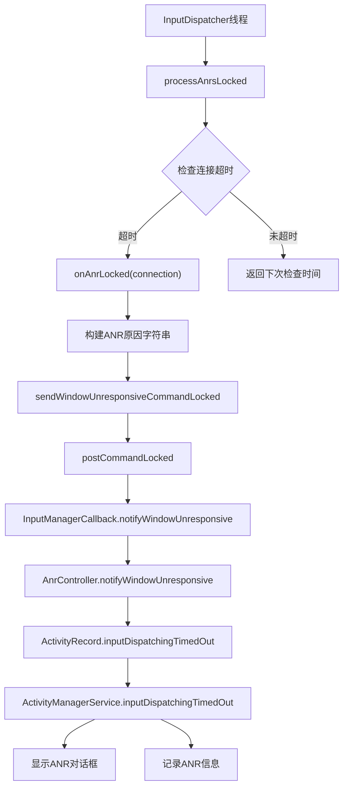
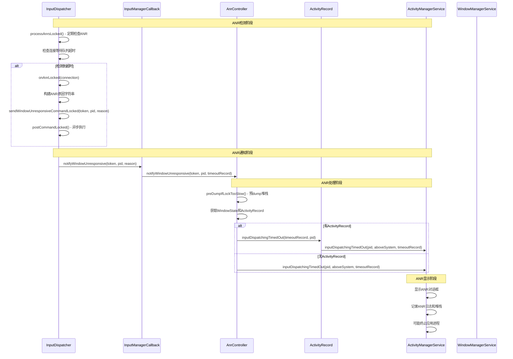

# Android ANR（Application Not Responding）流程分析

## ANR概述

ANR（Application Not Responding）是Android系统中检测应用无响应的机制。当应用的主线程在特定时间内未能响应输入事件或执行关键操作时，系统会触发ANR流程，显示ANR对话框并记录相关信息。

## ANR触发条件

根据提供的ANR信息：
```
01-09 13:57:58.201  2279  2755 I WindowManager: ANR in input window owned by pid=32065. 
Reason: Input dispatching timed out ([Gesture Monitor] swipe-up is not responding. Waited 5001ms for MotionEvent).
```

这是一个典型的输入分发超时ANR，窗口pid为32065，超时时间为5001ms。

## 完整ANR流程调用链



## 详细调用序列图



## 核心代码分析

### 1. InputDispatcher.processAnrsLocked() - ANR检测入口

```cpp
nsecs_t InputDispatcher::processAnrsLocked() {
    const nsecs_t currentTime = now();
    nsecs_t nextAnrCheck = LLONG_MAX;
    
    // 检查是否等待焦点窗口出现
    if (mNoFocusedWindowTimeoutTime.has_value() && mAwaitedFocusedApplication != nullptr) {
        if (currentTime >= *mNoFocusedWindowTimeoutTime) {
            processNoFocusedWindowAnrLocked();
            return LLONG_MIN;
        }
    }
    
    // 检查连接ANR是否到期
    nextAnrCheck = std::min(nextAnrCheck, mAnrTracker.firstTimeout());
    if (currentTime < nextAnrCheck) {
        return nextAnrCheck; // 正常情况，返回下次检查时间
    }
    
    // 检测到无响应连接
    std::shared_ptr<Connection> connection = 
        mConnectionManager.getConnection(mAnrTracker.firstToken());
    if (connection == nullptr) {
        mAnrTracker.eraseToken(mAnrTracker.firstToken());
        return nextAnrCheck;
    }
    
    connection->responsive = false;
    mAnrTracker.eraseToken(connection->getToken());
    onAnrLocked(connection);
    return LLONG_MIN;
}
```

### 2. InputDispatcher.onAnrLocked() - ANR处理核心

```cpp
void InputDispatcher::onAnrLocked(const std::shared_ptr<Connection>& connection) {
    if (connection->waitQueue.empty()) {
        ALOGI("Not raising ANR because the connection %s has recovered",
              connection->getInputChannelName().c_str());
        return;
    }
    
    // 获取最旧的事件条目
    DispatchEntry& oldestEntry = *connection->waitQueue.front();
    const nsecs_t currentWait = now() - oldestEntry.deliveryTime;
    
    // 构建ANR原因字符串（如示例中的"swipe-up is not responding. Waited 5001ms for MotionEvent"）
    std::string reason = android::base::StringPrintf(
        "%s is not responding. Waited %" PRId64 "ms for %s",
        connection->getInputChannelName().c_str(),
        ns2ms(currentWait),
        oldestEntry.eventEntry->getDescription().c_str());
    
    sp<IBinder> connectionToken = connection->getToken();
    updateLastAnrStateLocked(mWindowInfos.findWindowHandle(connectionToken), reason);
    
    // 取消该连接的事件
    cancelEventsForAnrLocked(connection);
    
    // 发送ANR通知
    sendWindowUnresponsiveCommandLocked(connectionToken, connection->getPid(), reason);
}
```

### 3. InputDispatcher.sendWindowUnresponsiveCommandLocked() - 发送ANR通知

```cpp
void InputDispatcher::sendWindowUnresponsiveCommandLocked(const sp<IBinder>& token,
                                                         std::optional<gui::Pid> pid,
                                                         std::string reason) {
    auto command = [this, token, pid, r = std::move(reason)]() REQUIRES(mLock) {
        scoped_unlock unlock(mLock);
        mPolicy.notifyWindowUnresponsive(token, pid, r);
    };
    postCommandLocked(std::move(command));
}
```

### 4. InputManagerCallback.notifyWindowUnresponsive() - Java层ANR入口

```java
@Override
public void notifyWindowUnresponsive(@NonNull IBinder token, @NonNull OptionalInt pid,
        String reason) {
    TimeoutRecord timeoutRecord = TimeoutRecord.forInputDispatchWindowUnresponsive(
            timeoutMessage(pid, reason));
    mService.mAnrController.notifyWindowUnresponsive(token, pid, timeoutRecord);
}
```

### 5. AnrController.notifyWindowUnresponsive() - ANR控制器处理

```java
void notifyWindowUnresponsive(@NonNull IBinder token, @NonNull OptionalInt pid,
        @NonNull TimeoutRecord timeoutRecord) {
    try {
        timeoutRecord.mLatencyTracker.notifyWindowUnresponsiveStarted();
        if (notifyWindowUnresponsive(token, timeoutRecord)) {
            return;
        }
        if (!pid.isPresent()) {
            Slog.w(TAG_WM, "Failed to notify that window token=" + token
                    + " was unresponsive.");
            return;
        }
        notifyWindowUnresponsive(pid.getAsInt(), timeoutRecord);
    } finally {
        timeoutRecord.mLatencyTracker.notifyWindowUnresponsiveEnded();
    }
}
```

### 6. AnrController.notifyWindowUnresponsive()私有方法

```java
private boolean notifyWindowUnresponsive(@NonNull IBinder inputToken,
        TimeoutRecord timeoutRecord) {
    timeoutRecord.mLatencyTracker.preDumpIfLockTooSlowStarted();
    preDumpIfLockTooSlow(timeoutRecord);
    timeoutRecord.mLatencyTracker.preDumpIfLockTooSlowEnded();
    
    final int pid;
    final boolean aboveSystem;
    final ActivityRecord activity;
    final WindowState windowState;
    
    synchronized (mService.mGlobalLock) {
        timeoutRecord.mLatencyTracker.waitingOnGlobalLockEnded();
        InputTarget target = mService.getInputTargetFromToken(inputToken);
        if (target == null) {
            return false;
        }
        windowState = target.getWindowState();
        pid = target.getPid();
        
        if (windowState != null) {
            // 如果输入token属于窗口，则归咎于Activity
            activity = (windowState.mInputChannelToken == inputToken)
                    ? windowState.mActivityRecord : null;
            aboveSystem = isWindowAboveSystem(windowState);
        } else {
            // 嵌入式窗口假设在系统层之上
            activity = null;
            aboveSystem = true;
        }
        
        Slog.i(TAG_WM, "ANR in " + target + ". Reason:" + timeoutRecord.mReason);
    }
    
    if (activity != null) {
        activity.inputDispatchingTimedOut(timeoutRecord, pid);
    } else {
        mService.mAmInternal.inputDispatchingTimedOut(pid, aboveSystem, timeoutRecord);
    }
    
    dumpAnrStateAsync(activity, windowState, timeoutRecord.mReason);
    return true;
}
```

### 7. ActivityRecord.inputDispatchingTimedOut() - Activity层ANR处理

```java
void inputDispatchingTimedOut(TimeoutRecord timeoutRecord, int pid) {
    // 调用ActivityManagerService处理ANR
    mAtmService.mAmInternal.inputDispatchingTimedOut(
            this, app != null ? app.mName : null, appInfo,
            shortComponentName, parent, parentProc, aboveSystem(), timeoutRecord);
}
```

## 关键类和组件

### 1. InputDispatcher (C++层)
- **位置**: `/native/services/inputflinger/dispatcher/InputDispatcher.cpp`
- **职责**: 输入事件分发和ANR检测
- **关键方法**: 
  - `processAnrsLocked()`: 定期检查ANR
  - `onAnrLocked()`: 处理检测到的ANR
  - `sendWindowUnresponsiveCommandLocked()`: 发送ANR通知

### 2. InputManagerCallback (Java层)
- **位置**: `/services/core/java/com/android/server/wm/InputManagerCallback.java`
- **职责**: InputManager和WindowManager之间的桥梁
- **关键方法**: `notifyWindowUnresponsive()`

### 3. AnrController (Java层)
- **位置**: `/services/core/java/com/android/server/wm/AnrController.java`
- **职责**: 管理ANR通知和状态转储
- **关键方法**: 
  - `notifyWindowUnresponsive()`: 处理窗口无响应
  - `preDumpIfLockTooSlow()`: 预转储堆栈信息

### 4. ActivityRecord (Java层)
- **位置**: `/services/core/java/com/android/server/wm/ActivityRecord.java`
- **职责**: 表示Activity实例
- **关键方法**: `inputDispatchingTimedOut()`

### 5. ActivityManagerService (Java层)
- **职责**: 最终处理ANR，显示对话框，记录日志
- **关键方法**: `inputDispatchingTimedOut()`

## ANR超时时间配置

### 默认超时时间
```cpp
const std::chrono::duration DEFAULT_INPUT_DISPATCHING_TIMEOUT = std::chrono::milliseconds(
    android::os::IInputConstants::UNMULTIPLIED_DEFAULT_DISPATCHING_TIMEOUT_MILLIS *
    HwTimeoutMultiplier());
```

### 超时时间计算
- **基础超时**: 5秒（5000ms）
- **硬件超时乘数**: 根据设备性能调整
- **最终超时**: 通常为5001ms（如示例所示）

## ANR检测机制

### 1. 等待队列检查
InputDispatcher维护每个连接的等待队列，检查队列中最旧事件的等待时间：

```cpp
DispatchEntry& oldestEntry = *connection->waitQueue.front();
const nsecs_t currentWait = now() - oldestEntry.deliveryTime;
```

### 2. ANR跟踪器
使用`mAnrTracker`跟踪所有连接的ANR状态：
```cpp
nextAnrCheck = std::min(nextAnrCheck, mAnrTracker.firstTimeout());
```

### 3. 定期检查
InputDispatcher线程定期调用`processAnrsLocked()`检查ANR状态。

## ANR恢复机制

### 1. 响应性检查
连接对象维护`responsive`标志：
```cpp
connection->responsive = false; // 标记为无响应
```

### 2. 事件取消
检测到ANR后取消该连接的所有待处理事件：
```cpp
cancelEventsForAnrLocked(connection);
```

### 3. 恢复通知
当窗口恢复响应时，通过`notifyWindowResponsive()`通知系统。

## 性能优化和调试

### 1. 预转储机制
```java
private void preDumpIfLockTooSlow(TimeoutRecord timeoutRecord) {
    if (!Build.IS_DEBUGGABLE) {
        return;
    }
    // 在获取锁之前预转储堆栈信息
}
```

### 2. 延迟跟踪
使用`TimeoutRecord.mLatencyTracker`跟踪ANR处理各阶段的延迟。

### 3. 状态转储
ANR发生时异步转储系统状态：
```java
dumpAnrStateAsync(activity, windowState, timeoutRecord.mReason);
```

## 异常处理

### 1. 连接不存在处理
```java
InputTarget target = mService.getInputTargetFromToken(inputToken);
if (target == null) {
    return false;
}
```

### 2. PID未知处理
```java
if (!pid.isPresent()) {
    Slog.w(TAG_WM, "Failed to notify that window token=" + token
            + " was unresponsive.");
    return;
}
```

### 3. 锁竞争处理
使用`preDumpIfLockTooSlow()`避免因锁竞争导致的诊断信息丢失。

## 总结

Android的ANR检测机制是一个复杂的多层级系统：

1. **C++层**（InputDispatcher）负责底层的事件分发和超时检测
2. **Java层**（InputManagerCallback、AnrController）负责ANR通知和状态管理
3. **应用层**（ActivityManagerService）负责最终的ANR处理和用户界面显示

整个流程通过异步命令和回调机制实现高效的ANR检测和响应，确保系统能够及时处理应用无响应的情况，同时最小化对正常操作的影响。