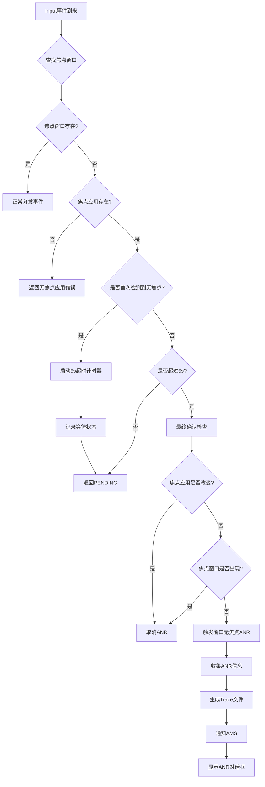

# Android ANR原理及渲染流程中的ANR风险点全面分析

## 一、ANR核心原理架构图

```
┌─────────────────────────────────────────────────────────────────────────┐
│                          ANR检测机制架构                                  │
└─────────────────────────────────────────────────────────────────────────┘

                        ┌──────────────────────┐
                        │   Input Event        │
                        │   (Key/Touch)        │
                        └──────────┬───────────┘
                                   │
                        ┌──────────▼───────────┐
                        │  InputDispatcher     │
                        │  (Native层)          │
                        └──────────┬───────────┘
                                   │
                    ┌──────────────┼──────────────┐
                    │              │              │
         ┌──────────▼─────┐  ┌────▼─────┐  ┌───▼──────────┐
         │ 查找焦点窗口     │  │ 查找焦点  │  │  事件分发      │
         │ findFocused    │  │ 应 用     │  │  超时检测     │
         │ WindowTarget   │  │          │  │              │
         └──────────┬─────┘  └─────┬────┘  └─────┬────────┘
                    │              │             │
                    └──────────────┼─────────────┘
                                   │
              ┌────────────────────▼─────────────────────┐
              │          ANR触发条件判断                   │
              ├──────────────────────────────────────────┤
              │ 1. 焦点应用存在 && 焦点窗口为null            │
              │    → 窗口无焦点ANR (5s)                    │
              │                                          │
              │ 2. 事件分发超时                            │
              │    → Input事件无响应ANR (5s)               │
              │                                          │
              │ 3. Service/Broadcast/Provider超时         │
              │    → 组件无响应ANR (10s/60s/20s)           │
              └────────────────────┬─────────────────────┘
                                   │
              ┌────────────────────▼─────────────────────┐
              │           ANR上报流程                     │
              │                                          │
              │  InputDispatcher → AMS                   │
              │         ↓                                │
              │  收集ANR信息(CPU/Trace/Log)               │
              │         ↓                                │
              │  生成ANR Trace文件                        │
              │         ↓                                │
              │  显示ANR对话框                            │
              └──────────────────────────────────────────┘
```

## 二、窗口无焦点ANR详细原理

### 2.1 核心判断逻辑流程图



### 2.2 关键数据结构

**源码位置**: [InputDispatcher.h:682](native/services/inputflinger/dispatcher/InputDispatcher.h#L682)

```cpp
// frameworks/native/services/inputflinger/dispatcher/InputDispatcher.h

class InputDispatcher {
private:
    // Focused applications.
    std::unordered_map<ui::LogicalDisplayId /*displayId*/, std::shared_ptr<InputApplicationHandle>>
            mFocusedApplicationHandlesByDisplay GUARDED_BY(mLock);

    // Keeps track of the focused window per display and determines focus changes.
    FocusResolver mFocusResolver GUARDED_BY(mLock);

    /**
     * This field is set if there is no focused window, and we have an event that requires
     * a focused window to be dispatched (for example, a KeyEvent).
     * When this happens, we will wait until *mNoFocusedWindowTimeoutTime before
     * dropping the event and raising an ANR for that application.
     * This is useful if an application is slow to add a focused window.
     */
    std::optional<nsecs_t> mNoFocusedWindowTimeoutTime GUARDED_BY(mLock);

    /**
     * The focused application at the time when no focused window was present.
     * Used to raise an ANR when we have no focused window.
     */
    std::shared_ptr<InputApplicationHandle> mAwaitedFocusedApplication GUARDED_BY(mLock);

    /**
     * The displayId that the focused application is associated with.
     */
    ui::LogicalDisplayId mAwaitedApplicationDisplayId GUARDED_BY(mLock);
};
```

### 2.3 窗口无焦点ANR触发条件

**源码位置**: [InputDispatcher.cpp:2310-2350](native/services/inputflinger/dispatcher/InputDispatcher.cpp#L2310-L2350)

```cpp
// 条件1：焦点应用不为空
focusedApplicationHandle != nullptr

// 条件2：焦点窗口为空
focusedWindowHandle == nullptr

// 条件3：等待超时（5秒）
currentTime > *mNoFocusedWindowTimeoutTime

// 条件4：焦点应用未改变
focusedApplication == mAwaitedFocusedApplication

// 条件5：焦点窗口仍然为空
getFocusedWindowHandleLocked(displayId) == nullptr
```

### 2.4 findFocusedWindowTargetLocked 核心实现

**源码位置**: [InputDispatcher.cpp:2310-2380](native/services/inputflinger/dispatcher/InputDispatcher.cpp#L2310-L2380)

```cpp
base::Result<sp<android::gui::WindowInfoHandle>, os::InputEventInjectionResult>
InputDispatcher::findFocusedWindowTargetLocked(nsecs_t currentTime, const EventEntry& entry,
                                               nsecs_t& nextWakeupTime) {
    ui::LogicalDisplayId displayId = getTargetDisplayId(entry);
    sp<WindowInfoHandle> focusedWindowHandle = getFocusedWindowHandleLocked(displayId);
    std::shared_ptr<InputApplicationHandle> focusedApplicationHandle =
            getValueByKey(mFocusedApplicationHandlesByDisplay, displayId);

    // If there is no currently focused window and no focused application
    // then drop the event.
    if (focusedWindowHandle == nullptr && focusedApplicationHandle == nullptr) {
        ALOGI("Dropping %s event because there is no focused window or focused application in "
              "display %s.",
              ftl::enum_string(entry.type).c_str(), displayId.toString().c_str());
        return injectionError(InputEventInjectionResult::FAILED);
    }

    // Compatibility behavior: raise ANR if there is a focused application, but no focused window.
    // Only start counting when we have a focused event to dispatch. The ANR is canceled if we
    // start interacting with another application via touch (app switch).
    if (focusedWindowHandle == nullptr && focusedApplicationHandle != nullptr) {
        if (!mNoFocusedWindowTimeoutTime.has_value()) {
            // We just discovered that there's no focused window. Start the ANR timer
            std::chrono::nanoseconds timeout = focusedApplicationHandle->getDispatchingTimeout(
                    DEFAULT_INPUT_DISPATCHING_TIMEOUT);
            mNoFocusedWindowTimeoutTime = currentTime + timeout.count();
            mAwaitedFocusedApplication = focusedApplicationHandle;
            mAwaitedApplicationDisplayId = displayId;
            ALOGW("Waiting because no window has focus but %s may eventually add a "
                  "window when it finishes starting up. Will wait for %" PRId64 "ms",
                  mAwaitedFocusedApplication->getName().c_str(), millis(timeout));
            nextWakeupTime = std::min(nextWakeupTime, *mNoFocusedWindowTimeoutTime);
            return injectionError(InputEventInjectionResult::PENDING);
        } else if (currentTime > *mNoFocusedWindowTimeoutTime) {
            // Already raised ANR. Drop the event
            ALOGE("Dropping %s event because there is no focused window",
                  ftl::enum_string(entry.type).c_str());
            return injectionError(InputEventInjectionResult::FAILED);
        } else {
            // Still waiting for the focused window
            return injectionError(InputEventInjectionResult::PENDING);
        }
    }

    // we have a valid, non-null focused window
    resetNoFocusedWindowTimeoutLocked();
    // ...
    return focusedWindowHandle;
}
```

## 三、从View刷新到显示的ANR风险点完整流程

```
┌─────────────────────────────────────────────────────────────────────────┐
│                    完整渲染流程与ANR风险点                                │
└─────────────────────────────────────────────────────────────────────────┘

时间线                   操作流程                           ANR风险点
━━━━━━━━━━━━━━━━━━━━━━━━━━━━━━━━━━━━━━━━━━━━━━━━━━━━━━━━━━━━━━━━━━━━━━

T0: 0ms
├─ View.invalidate()                              
├─ ViewRootImpl.scheduleTraversals()              
└─ Choreographer.postCallback()                   
                                                   ⚠️ 风险点1: 主线程耗时操作
                                                      - onCreate/onResume阻塞
                                                      - 主线程执行耗时任务
━━━━━━━━━━━━━━━━━━━━━━━━━━━━━━━━━━━━━━━━━━━━━━━━━━━━━━━━━━━━━━━━━━━━━━

T1: 0.5ms (Vsync)
├─ Choreographer.doFrame()                        
├─ performMeasure()         [1-2ms]               ⚠️ 风险点2: Layout计算耗时
├─ performLayout()          [1-2ms]                  - 深层次View嵌套
├─ performDraw()            [3-5ms]                  - 复杂布局计算
└─ ThreadedRenderer.draw()                           - 自定义View测量慢
                                                   
━━━━━━━━━━━━━━━━━━━━━━━━━━━━━━━━━━━━━━━━━━━━━━━━━━━━━━━━━━━━━━━━━━━━━━

T2: 8ms
├─ RenderThread启动                               ⚠️ 风险点3: RenderThread处理慢
├─ 构建DisplayList                                   - DisplayList构建复杂
├─ dequeueBuffer()                                   - Buffer队列满等待
└─ 同步等待Buffer         [0-2ms]                    - GPU渲染积压

━━━━━━━━━━━━━━━━━━━━━━━━━━━━━━━━━━━━━━━━━━━━━━━━━━━━━━━━━━━━━━━━━━━━━━

T3: 10ms
├─ GPU开始渲染            [4-6ms]                 ⚠️ 风险点4: GPU渲染超时
└─ 执行OpenGL/Vulkan命令                            - 过度绘制
                                                      - 大量纹理加载
                                                      - 复杂Shader运算
━━━━━━━━━━━━━━━━━━━━━━━━━━━━━━━━━━━━━━━━━━━━━━━━━━━━━━━━━━━━━━━━━━━━━━

T4: 16ms
├─ queueBuffer()                                  
├─ onFrameAvailable()                             
└─ 等待SurfaceFlinger合成                         ⚠️ 风险点5: Surface未就绪
                                                      - Surface创建延迟
                                                      - Layer状态异常
━━━━━━━━━━━━━━━━━━━━━━━━━━━━━━━━━━━━━━━━━━━━━━━━━━━━━━━━━━━━━━━━━━━━━━

T5: 16.6ms (Vsync)
├─ SurfaceFlinger.latchBuffer()                   ⚠️ 风险点6: SF合成延迟
├─ CompositionEngine合成   [2-3ms]                   - Layer过多
├─ HWC.prepare()                                     - 合成超时
└─ HWC.present()                                     - HWC处理慢

━━━━━━━━━━━━━━━━━━━━━━━━━━━━━━━━━━━━━━━━━━━━━━━━━━━━━━━━━━━━━━━━━━━━━━

T6: 19ms
├─ Display扫描显示        [16.6ms]                
└─ 实际显示内容                                   ⚠️ 风险点7: Layer可见性问题
                                                      - Layer被隐藏
                                                      - 可见性状态异常
━━━━━━━━━━━━━━━━━━━━━━━━━━━━━━━━━━━━━━━━━━━━━━━━━━━━━━━━━━━━━━━━━━━━━━

T7: 33.2ms
├─ finishDrawing()                                
├─ updateFocusedWindow()                          ⚠️ 风险点8: 焦点更新失败
├─ updateInputFocus()                                - InputFocus未更新
└─ Activity.onWindowFocusChanged()                   - Surface不可见
                                                      - Layer状态NOT_VISIBLE
━━━━━━━━━━━━━━━━━━━━━━━━━━━━━━━━━━━━━━━━━━━━━━━━━━━━━━━━━━━━━━━━━━━━━━

⚠️ 风险点9: 焦点窗口超时 (T1 + 5000ms = 5001ms)
   - 焦点应用存在
   - 焦点窗口一直为null
   - 超过5秒触发ANR

━━━━━━━━━━━━━━━━━━━━━━━━━━━━━━━━━━━━━━━━━━━━━━━━━━━━━━━━━━━━━━━━━━━━━━
```

## 四、各阶段ANR风险点详细分析

### 风险点1: 应用生命周期阻塞

```java
// ========== 问题代码示例 ==========
public class MainActivity extends Activity {
    @Override
    protected void onCreate(Bundle savedInstanceState) {
        super.onCreate(savedInstanceState);
        
        // ❌ 错误：在主线程执行耗时操作
        Thread.sleep(6000);  // 超过5秒
        
        // ❌ 错误：同步加载大量数据
        loadLargeDataFromDatabase();
        
        // ❌ 错误：复杂初始化逻辑
        initComplexLibrary();
        
        setContentView(R.layout.activity_main);
    }
}

// ========== ANR日志特征 ==========
// 1. 应用启动时间超长
wm_activity_launch_time: [0,161928112,com.example.app/.MainActivity,10495]
                                                                    ^^^^^ 10秒

// 2. onCreate到onResume间隔超长
wm_on_create_called: [timestamp1,...]
wm_on_resume_called: [timestamp2,...]  // timestamp2 - timestamp1 > 5s

// 3. 焦点应用已设置，但窗口未Relayout
WindowManager: Changing focus from Launcher to null
// 长时间没有后续的 "Changing focus to MainActivity" 日志

// ========== 解决方案 ==========
public class MainActivity extends Activity {
    @Override
    protected void onCreate(Bundle savedInstanceState) {
        super.onCreate(savedInstanceState);
        setContentView(R.layout.activity_main);
        
        // ✅ 正确：异步加载
        new Thread(() -> {
            loadLargeDataFromDatabase();
            runOnUiThread(() -> updateUI());
        }).start();
        
        // ✅ 正确：懒加载
        initComplexLibraryAsync();
    }
}
```

### 风险点2: Measure/Layout耗时

**源码位置**: [ViewRootImpl.java:5082](base/core/java/android/view/ViewRootImpl.java#L5082)

```java
// ========== 问题场景 ==========
// 1. 深层次嵌套导致多次测量
<LinearLayout>
    <RelativeLayout>
        <FrameLayout>
            <LinearLayout>
                <!-- 嵌套5层以上 -->
            </LinearLayout>
        </FrameLayout>
    </RelativeLayout>
</LinearLayout>

// 2. 自定义View测量复杂
public class CustomView extends View {
    @Override
    protected void onMeasure(int widthMeasureSpec, int heightMeasureSpec) {
        // ❌ 错误：测量中执行复杂计算
        for (int i = 0; i < 10000; i++) {
            complexCalculation();
        }
        super.onMeasure(widthMeasureSpec, heightMeasureSpec);
    }
}

// ========== 检测方法 ==========
// Systrace中查看
Choreographer#doFrame
  ├─ performTraversals
  │   ├─ performMeasure  [耗时> 8ms] ⚠️
  │   ├─ performLayout   [耗时> 5ms] ⚠️
  │   └─ performDraw     [耗时> 10ms] ⚠️

// ========== 优化方案 ==========
// 1. 使用ConstraintLayout减少嵌套
<androidx.constraintlayout.widget.ConstraintLayout>
    <!-- 扁平化布局 -->
</androidx.constraintlayout.widget.ConstraintLayout>

// 2. 使用ViewStub延迟加载
<ViewStub
    android:id="@+id/stub"
    android:layout="@layout/complex_layout"/>

// 3. 优化自定义View测量
public class OptimizedView extends View {
    private boolean mMeasured = false;
    
    @Override
    protected void onMeasure(int widthMeasureSpec, int heightMeasureSpec) {
        if (!mMeasured) {
            // 只在必要时重新计算
            calculateDimensions();
            mMeasured = true;
        }
        setMeasuredDimension(mWidth, mHeight);
    }
}
```

### 风险点3: RenderThread处理延迟

**源码位置**: [BufferQueueProducer.cpp:300-450](native/libs/gui/BufferQueueProducer.cpp#L300-L450)

```cpp
// ========== 问题原因 ==========
// 1. DisplayList过于复杂
// Canvas绘制命令过多（> 1000个draw call）

// 2. Buffer队列阻塞
// frameworks/native/libs/gui/BufferQueueProducer.cpp
int BufferQueueProducer::getFreeBufferLocked() const {
    if (mCore->mFreeBuffers.empty()) {
        return BufferQueueCore::INVALID_BUFFER_SLOT;
    }
    int slot = mCore->mFreeBuffers.front();
    mCore->mFreeBuffers.pop_front();
    return slot;
}

status_t BufferQueueProducer::waitForFreeSlotThenRelock(FreeSlotCaller caller,
        std::unique_lock<std::mutex>& lock, int* found) const {
    // ...
    while (tryAgain) {
        // ⚠️ 如果没有可用Buffer，会阻塞等待
        if (tryAgain) {
            if (status_t status = waitForBufferRelease(lock, mDequeueTimeout);
                status == TIMED_OUT) {
                return TIMED_OUT;
            }
        }
    }
}

status_t BufferQueueProducer::waitForBufferRelease(std::unique_lock<std::mutex>& lock,
                                                   nsecs_t timeout) const {
    if (mDequeueTimeout >= 0) {
        std::cv_status result =
                mCore->mDequeueCondition.wait_for(lock, std::chrono::nanoseconds(timeout));
        if (result == std::cv_status::timeout) {
            return TIMED_OUT;
        }
    } else {
        mCore->mDequeueCondition.wait(lock);
    }
    return OK;
}

// ========== 日志特征 ==========
// RenderThread等待Buffer
RenderThread: waiting for next buffer (queue full)

// GPU处理积压
GPU: Command buffer full, throttling

// ========== 检测与优化 ==========
// 1. 使用GPU Profiler查看
adb shell dumpsys gfxinfo <package> framestats

// 2. 减少绘制复杂度
@Override
protected void onDraw(Canvas canvas) {
    // ❌ 避免：每帧创建大量对象
    Paint paint = new Paint();  // 每次都创建
    
    // ✅ 推荐：复用对象
    if (mPaint == null) {
        mPaint = new Paint();
    }
    canvas.drawRect(rect, mPaint);
}

// 3. 启用硬件加速分层
view.setLayerType(View.LAYER_TYPE_HARDWARE, null);
```

### 风险点4: GPU渲染超时

```java
// ========== 过度绘制检测 ==========
// 开启GPU过度绘制调试
adb shell setprop debug.hwui.overdraw show

// 颜色含义：
// - 无色：绘制1次（正常）
// - 蓝色：绘制2次（可接受）
// - 绿色：绘制3次（需优化）
// - 粉色：绘制4次（严重问题）
// - 红色：绘制5次+（必须优化）

// ========== 问题代码 ==========
<LinearLayout 
    android:background="@color/white">  <!-- 背景1 -->
    <RelativeLayout 
        android:background="@color/gray">  <!-- 背景2 -->
        <TextView 
            android:background="@drawable/bg"/>  <!-- 背景3 -->
    </RelativeLayout>
</LinearLayout>

// ========== 优化方案 ==========
// 1. 移除不必要的背景
<LinearLayout>  <!-- 无背景 -->
    <RelativeLayout>  <!-- 无背景 -->
        <TextView 
            android:background="@drawable/bg"/>  <!-- 只有一个背景 -->
    </RelativeLayout>
</LinearLayout>

// 2. 使用clipRect减少绘制区域
@Override
protected void onDraw(Canvas canvas) {
    canvas.save();
    canvas.clipRect(visibleRect);  // 只绘制可见区域
    // ... 绘制操作
    canvas.restore();
}

// 3. 使用硬件加速
getWindow().setFlags(
    WindowManager.LayoutParams.FLAG_HARDWARE_ACCELERATED,
    WindowManager.LayoutParams.FLAG_HARDWARE_ACCELERATED
);
```

### 风险点5: Surface创建延迟

```java
// ========== 问题场景 ==========
// Surface创建依赖于SurfaceFlinger
// 如果SF繁忙或系统资源不足，Surface创建会延迟

// ========== 日志特征 ==========
// 1. relayoutWindow但Surface未创建
WindowManager: Relayout Window{xxx}: oldVis=4, newVis=0
// 但没有对应的 SurfaceFlinger Layer创建日志

// 2. Surface创建超时
WindowManager: Surface creation timeout for window xxx

// 3. reportDrawFinished延迟
VRI[MainActivity]: reportDrawFinished
// 此时间点距离Activity启动很久

// ========== 检测方法 ==========
// 1. 查看SurfaceFlinger状态
adb shell dumpsys SurfaceFlinger

// 2. 检查Layer数量
adb shell dumpsys SurfaceFlinger | grep -c "Layer"
// 如果Layer数量 > 100，可能有问题

// 3. 监控Buffer分配
adb shell dumpsys SurfaceFlinger | grep "BufferQueue"

// ========== 优化建议 ==========
// 1. 减少同时存在的Window数量
// 2. 及时释放不用的Surface
// 3. 避免频繁创建销毁Window
```

### 风险点6: SurfaceFlinger合成延迟

```cpp
// ========== 问题原因 ==========
// 1. Layer数量过多（> 50个）
// 2. 合成超时（> 8ms）
// 3. HWComposer处理慢

// ========== 日志特征 ==========
// SurfaceFlinger合成超时
SurfaceFlinger: composition took 15ms (> 8ms threshold)

// Layer过多警告
SurfaceFlinger: Too many layers (67), composition will be slow

// HWC处理失败
HWComposer: present failed for display 0

// ========== 检测工具 ==========
// 1. 使用Systrace查看
python systrace.py -t 10 -o trace.html sched gfx view wm

// 在Systrace中查看：
// SurfaceFlinger线程 → onMessageRefresh → doComposition
// 如果耗时 > 8ms，说明合成慢

// 2. 查看Layer详情
adb shell dumpsys SurfaceFlinger --list
adb shell dumpsys SurfaceFlinger --latency <layer_name>

// ========== 优化方案 ==========
// 1. 减少Layer数量
// 合并相邻Layer
// 移除不可见Layer

// 2. 使用HWC合成而非GPU合成
// 确保Layer满足HWC合成条件：
// - 不透明或全透明
// - 无旋转或标准旋转
```

### 风险点7: Layer可见性问题

```java
// ========== 问题场景 ==========
// Layer创建成功但不可见，导致焦点窗口无法设置

// ========== 关键源码路径 ==========
// WindowState.java -> InputMonitor.java -> InputDispatcher

// ========== 日志特征 ==========
// Layer状态异常
SurfaceFlinger: Layer xxx is NOT_VISIBLE

// InputFocus未更新
InputDispatcher: Focus request for window xxx ignored (not visible)

// ========== 检测方法 ==========
// 1. 查看Layer可见性
adb shell dumpsys SurfaceFlinger | grep -A 5 "Layer"

// 2. 检查InputFocus状态
adb shell dumpsys input | grep "Focus"

// ========== 解决方案 ==========
// 1. 确保Window正确添加和显示
// 2. 检查Window可见性状态
// 3. 验证Surface是否正确创建
```

### 风险点8: 焦点更新失败

```java
// ========== 问题场景 ==========
// 窗口已显示但焦点未正确更新到InputDispatcher

// ========== 关键源码路径 ==========
// ViewRootImpl.java -> WindowManagerService.java -> InputMonitor.java

// ========== 日志特征 ==========
// 焦点窗口未更新
WindowManager: Changing focus from null to null (no change)

// InputFocus请求被忽略
InputDispatcher: Focus request ignored, window not ready

// ========== 检测方法 ==========
// 1. 检查焦点窗口状态
adb shell dumpsys window windows | grep -E "mCurrentFocus|mFocusedApp"

// 2. 查看InputDispatcher焦点
adb shell dumpsys input | grep "FocusedWindow"

// ========== 解决方案 ==========
// 1. 确保Window正确添加到WMS
// 2. 检查Window可见性状态
// 3. 验证InputChannel正确创建
```

### 风险点9: 焦点窗口超时ANR

**源码位置**: [InputDispatcher.cpp:1036-1045](native/services/inputflinger/dispatcher/InputDispatcher.cpp#L1036-L1045)

```cpp
// ========== 核心检测逻辑 ==========
nsecs_t InputDispatcher::processAnrsLocked() {
    const nsecs_t currentTime = now();
    nsecs_t nextAnrCheck = LLONG_MAX;
    
    // Check if we are waiting for a focused window to appear. Raise ANR if waited too long
    if (mNoFocusedWindowTimeoutTime.has_value() && mAwaitedFocusedApplication != nullptr) {
        if (currentTime >= *mNoFocusedWindowTimeoutTime) {
            processNoFocusedWindowAnrLocked();
            mAwaitedFocusedApplication.reset();
            mNoFocusedWindowTimeoutTime = std::nullopt;
            return LLONG_MIN;
        } else {
            // Keep waiting. We will drop the event when mNoFocusedWindowTimeoutTime comes.
            nextAnrCheck = *mNoFocusedWindowTimeoutTime;
        }
    }
    // ...
}

// ========== ANR触发条件 ==========
// 1. 焦点应用存在：mAwaitedFocusedApplication != nullptr
// 2. 焦点窗口一直为null：focusedWindowHandle == nullptr
// 3. 超过5秒：currentTime >= *mNoFocusedWindowTimeoutTime

// ========== 日志特征 ==========
// 1. 开始等待焦点窗口
InputDispatcher: Waiting because no window has focus but xxx may eventually add a window when it finishes starting up. Will wait for 5000ms

// 2. ANR触发
WindowManager: ANR in Application xxx. Reason: Application does not have a focused window

// ========== 检测方法 ==========
// 1. 监控焦点窗口状态
adb shell dumpsys window windows | grep "mCurrentFocus"

// 2. 检查焦点应用
adb shell dumpsys window windows | grep "mFocusedApp"

// 3. 查看InputDispatcher状态
adb shell dumpsys input | grep -A 20 "Dispatch State"

// ========== 解决方案 ==========
// 1. 确保Activity在onCreate后尽快完成UI初始化
// 2. 避免在主线程执行耗时操作
// 3. 确保Window正确添加和显示
// 4. 检查Surface创建是否正常
```

## 五、ViewRootImpl核心渲染流程

### 5.1 scheduleTraversals 实现

**源码位置**: [ViewRootImpl.java:3085-3114](base/core/java/android/view/ViewRootImpl.java#L3085-L3114)

```java
void scheduleTraversals() {
    if (!mTraversalScheduled) {
        mTraversalScheduled = true;
        // The following behavior is load-bearing for public API correctness.
        // For example, the following code is defined to be correct and the
        // MessageQueue sync barrier mechanism and its usage here is
        // responsible for ensuring it:
        //
        //   textView.setText("Hello, world!");
        //   textView.getHandler().post(new Runnable() {
        //     public void run() {
        //       // This code will run after traversals have happened
        //       // and the TextView has been measured with its new text.
        //       reportNewTextWidth(textView.getWidth());
        //     }
        //   });
        //
        // Any message posted after scheduling traversals (e.g. via
        // View#requestLayout or View#invalidate) is guaranteed to run after
        // the scheduled traversals have occurred unless the message is
        // specifically "asynchronous" - see Message#setAsynchronous
        mTraversalBarrier = mQueue.postSyncBarrier();
        mChoreographer.postCallback(
                Choreographer.CALLBACK_TRAVERSAL, mTraversalRunnable, null);
        notifyRendererOfFramePending();
        pokeDrawLockIfNeeded();
    }
}
```

### 5.2 performTraversals 核心流程

**源码位置**: [ViewRootImpl.java:3574](base/core/java/android/view/ViewRootImpl.java#L3574)

```java
private void performTraversals() {
    // ... 省略前置处理
    
    // 1. 执行测量
    performMeasure(childWidthMeasureSpec, childHeightMeasureSpec);
    
    // 2. 执行布局
    performLayout(lp, mWidth, mHeight);
    
    // 3. 执行绘制
    if (!performDraw(mActiveSurfaceSyncGroup)) {
        // 绘制失败处理
    }
    
    // ... 省略后置处理
}
```

## 六、ANR检测与调试工具

### 6.1 关键命令

```bash
# 1. 查看当前ANR状态
adb shell dumpsys activity anr

# 2. 查看InputDispatcher状态
adb shell dumpsys input

# 3. 查看窗口焦点状态
adb shell dumpsys window windows | grep -E "mCurrentFocus|mFocusedApp"

# 4. 查看SurfaceFlinger状态
adb shell dumpsys SurfaceFlinger

# 5. 查看GPU渲染信息
adb shell dumpsys gfxinfo <package>

# 6. 查看Layer详情
adb shell dumpsys SurfaceFlinger --list
adb shell dumpsys SurfaceFlinger --latency <layer_name>
```

### 6.2 Systrace分析

```bash
# 采集Systrace
python systrace.py -t 10 -o trace.html sched gfx view wm input

# 关键关注点：
# 1. Choreographer#doFrame 耗时
# 2. performMeasure/performLayout/performDraw 耗时
# 3. RenderThread 处理耗时
# 4. SurfaceFlinger 合成耗时
# 5. InputDispatcher 事件分发耗时
```

## 七、总结

### ANR风险点汇总

| 风险点 | 位置 | 超时时间 | 主要原因 |
|--------|------|----------|----------|
| 风险点1 | 主线程 | 5s | 生命周期阻塞 |
| 风险点2 | performMeasure/Layout | 16ms | 布局计算耗时 |
| 风险点3 | RenderThread | 16ms | Buffer队列阻塞 |
| 风险点4 | GPU | 16ms | 过度绘制 |
| 风险点5 | Surface创建 | - | SF繁忙 |
| 风险点6 | SurfaceFlinger | 8ms | Layer过多 |
| 风险点7 | Layer可见性 | - | 状态异常 |
| 风险点8 | 焦点更新 | - | InputFocus未更新 |
| 风险点9 | 焦点窗口超时 | 5s | 窗口未创建 |

### 关键源码路径

| 模块 | 文件路径 |
|------|----------|
| InputDispatcher | [InputDispatcher.cpp](native/services/inputflinger/dispatcher/InputDispatcher.cpp) |
| BufferQueue | [BufferQueueProducer.cpp](native/libs/gui/BufferQueueProducer.cpp) |
| ViewRootImpl | [ViewRootImpl.java](base/core/java/android/view/ViewRootImpl.java) |
| AnrController | [AnrController.java](base/services/core/java/com/android/server/wm/AnrController.java) |

每个环节的优化都需要确保在**5秒超时时间**内完成，这是避免窗口无焦点ANR的核心要求。
