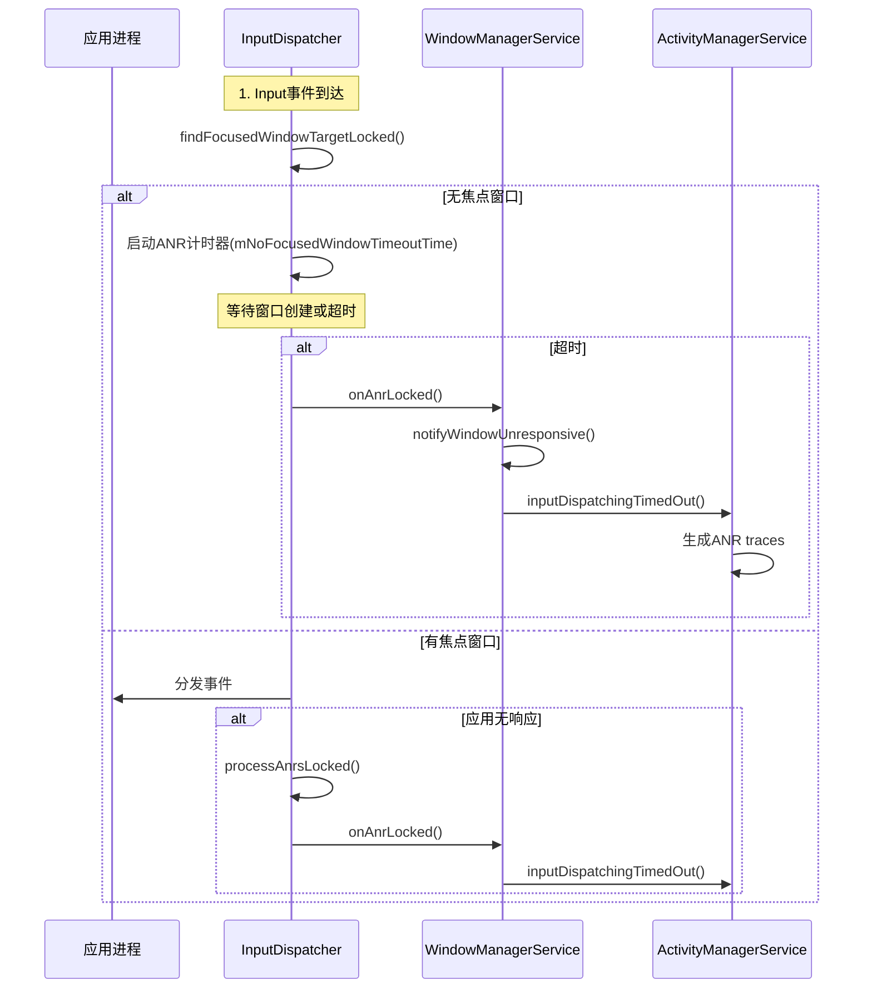

# Android ANR日志分析完整实战指南

> **源码参考**：本文档基于AOSP 16源码分析
> - ANR控制器：[AnrController.java](file:///Users/yuchuan/CodeMX/MX/AOSP_Frameworks/base/services/core/java/com/android/server/wm/AnrController.java)
> - Input分发器：[InputDispatcher.cpp](file:///Users/yuchuan/CodeMX/MX/AOSP_Frameworks/native/services/inputflinger/dispatcher/InputDispatcher.cpp)
> - EventLog标签：[EventLogTags.logtags](file:///Users/yuchuan/CodeMX/MX/AOSP_Frameworks/base/services/core/java/com/android/server/wm/EventLogTags.logtags)

## 一、ANR分析所需日志文件清单

```plain
┌─────────────────────────────────────────────────────────────────────┐
│                    ANR分析必需文件清单                                │
└─────────────────────────────────────────────────────────────────────┘

优先级1 - 核心文件（必须）
├─ traces.txt / anr_*.txt              # 主线程堆栈，ANR根因
├─ logcat (main)                       # 应用日志，生命周期
├─ events.log                          # 系统事件，焦点变化
└─ system.log                          # 系统服务日志

优先级2 - 辅助文件（重要）
├─ kernel.log / dmesg                  # 内核日志，死锁/内存
├─ dropbox文件                         # ANR完整记录
├─ bugreport.zip                       # 完整系统状态
└─ systrace.html                       # 性能trace（如果有）

优先级3 - 深度分析（可选）
├─ dumpsys window                      # Window状态快照
├─ dumpsys input                       # Input状态快照
├─ dumpsys SurfaceFlinger              # SF状态快照
├─ dumpsys activity                    # Activity状态快照
└─ winscope文件                        # 窗口/Layer可视化
```

## 二、日志文件获取方法

### 2.1 实时ANR发生时的抓取

```bash
#!/bin/bash
# ========== ANR发生时立即执行 ==========

# 创建输出目录
TIMESTAMP=$(date +%Y%m%d_%H%M%S)
OUTPUT_DIR="anr_logs_${TIMESTAMP}"
mkdir -p ${OUTPUT_DIR}

# 1. 【最重要】立即拉取traces文件
echo "1. Pulling ANR traces..."
adb pull /data/anr/traces.txt ${OUTPUT_DIR}/traces.txt
# 或者新版本Android
adb pull /data/anr/ ${OUTPUT_DIR}/anr/

# 2. 抓取logcat（包含ANR前后的日志）
echo "2. Capturing logcat..."
adb logcat -d > ${OUTPUT_DIR}/logcat.txt
adb logcat -d -b events > ${OUTPUT_DIR}/events.log
adb logcat -d -b system > ${OUTPUT_DIR}/system.log
adb logcat -d -b crash > ${OUTPUT_DIR}/crash.log

# 3. 抓取关键dumpsys信息
echo "3. Capturing dumpsys..."
adb shell dumpsys window > ${OUTPUT_DIR}/dumpsys_window.txt
adb shell dumpsys input > ${OUTPUT_DIR}/dumpsys_input.txt
adb shell dumpsys SurfaceFlinger > ${OUTPUT_DIR}/dumpsys_sf.txt
adb shell dumpsys activity > ${OUTPUT_DIR}/dumpsys_activity.txt

# 4. 获取dropbox中的ANR记录
echo "4. Pulling dropbox ANR files..."
adb shell "ls -lt /data/system/dropbox/ | grep anr | head -5" > ${OUTPUT_DIR}/dropbox_list.txt
# 拉取最新的5个ANR记录
for file in $(adb shell "ls -t /data/system/dropbox/data_app_anr* | head -5"); do
    adb pull $file ${OUTPUT_DIR}/
done

# 5. 获取内核日志
echo "5. Capturing kernel log..."
adb shell dmesg > ${OUTPUT_DIR}/dmesg.txt

# 6. 获取CPU和内存信息
echo "6. Capturing system info..."
adb shell top -n 1 > ${OUTPUT_DIR}/top.txt
adb shell cat /proc/meminfo > ${OUTPUT_DIR}/meminfo.txt
adb shell ps -A > ${OUTPUT_DIR}/ps.txt

# 7. 如果需要完整的bugreport
echo "7. Generating bugreport (this may take a while)..."
adb bugreport ${OUTPUT_DIR}/bugreport.zip

echo "All logs saved to ${OUTPUT_DIR}/"
```

### 2.2 从bugreport中提取关键信息

```bash
#!/bin/bash
# ========== 从bugreport.zip提取关键文件 ==========

BUGREPORT_ZIP="bugreport.zip"
OUTPUT_DIR="extracted_logs"

# 解压bugreport
unzip -q ${BUGREPORT_ZIP} -d ${OUTPUT_DIR}

# 进入解压目录（bugreport目录结构）
cd ${OUTPUT_DIR}/bugreport-*/ || cd ${OUTPUT_DIR}/

# 提取关键文件
echo "Extracting key files from bugreport..."

# traces文件
find . -name "traces.txt" -exec cp {} ../traces.txt \;
find . -path "*/data/anr/*" -name "*.txt" -exec cp {} ../ \;

# logcat
find . -name "logcat.txt" -exec cp {} ../logcat_main.txt \;
find . -name "logcat_events.txt" -exec cp {} ../events.log \;
find . -name "logcat_system.txt" -exec cp {} ../system.log \;

# dumpsys文件
grep -A 10000 "DUMP OF SERVICE window" bugreport-*.txt > ../dumpsys_window.txt
grep -A 10000 "DUMP OF SERVICE input" bugreport-*.txt > ../dumpsys_input.txt
grep -A 10000 "DUMP OF SERVICE SurfaceFlinger" bugreport-*.txt > ../dumpsys_sf.txt
grep -A 10000 "DUMP OF SERVICE activity" bugreport-*.txt > ../dumpsys_activity.txt

echo "Key files extracted to parent directory"
```

### 2.3 Monkey测试中自动抓取ANR

```bash
#!/bin/bash
# ========== Monkey测试ANR自动捕获脚本 ==========

PACKAGE="com.example.app"
EVENT_COUNT=10000
OUTPUT_BASE="monkey_anr_logs"

# 启动logcat监控
adb logcat -c
adb logcat -v time > ${OUTPUT_BASE}/logcat_monitor.txt &
LOGCAT_PID=$!

# 同时监控events log
adb logcat -b events -v time > ${OUTPUT_BASE}/events_monitor.log &
EVENTS_PID=$!

# 运行Monkey
echo "Starting Monkey test..."
adb shell monkey -p ${PACKAGE} \
    --throttle 300 \
    --ignore-crashes \
    --ignore-timeouts \
    --monitor-native-crashes \
    -v -v -v \
    ${EVENT_COUNT} > ${OUTPUT_BASE}/monkey.log 2>&1

# Monkey结束后，再运行30秒收集ANR信息
sleep 30

# 停止logcat监控
kill ${LOGCAT_PID}
kill ${EVENTS_PID}

# 检查是否有ANR
if grep -q "ANR in" ${OUTPUT_BASE}/logcat_monitor.txt; then
    echo "ANR detected! Collecting logs..."
    
    # 拉取ANR traces
    adb pull /data/anr/ ${OUTPUT_BASE}/anr/
    
    # 抓取dumpsys
    adb shell dumpsys window > ${OUTPUT_BASE}/dumpsys_window.txt
    adb shell dumpsys input > ${OUTPUT_BASE}/dumpsys_input.txt
    adb shell dumpsys activity > ${OUTPUT_BASE}/dumpsys_activity.txt
    
    # 从logcat中提取ANR相关时间段的日志
    ANR_TIME=$(grep "ANR in" ${OUTPUT_BASE}/logcat_monitor.txt | head -1 | awk '{print $2}')
    echo "ANR occurred at: ${ANR_TIME}"
    
    # 提取ANR前后1分钟的日志
    grep -B 1000 -A 1000 "ANR in" ${OUTPUT_BASE}/logcat_monitor.txt > ${OUTPUT_BASE}/anr_context.log
    
    echo "ANR logs collected in ${OUTPUT_BASE}/"
else
    echo "No ANR detected during Monkey test"
fi
```

## 三、日志分析流程与关键信息

### 3.1 分析流程总览

```plain
┌─────────────────────────────────────────────────────────────────────┐
│                      ANR分析标准流程                                  │
└─────────────────────────────────────────────────────────────────────┘

第一步：快速定位ANR类型
    ↓
    logcat → 搜索 "ANR in"
    ↓
    确定：进程名、组件名、ANR原因
    ↓
┌───────────────┬───────────────┬───────────────┐
│               │               │               │
窗口无焦点ANR    Input事件ANR    组件超时ANR
│               │               │               │
↓               ↓               ↓               ↓

第二步：确定ANR时间点
    ↓
    提取ANR发生的精确时间戳
    ↓
    在所有日志中定位该时间点前后的记录

第三步：分析事件时间线
    ↓
    events.log → 还原系统事件序列
    ↓
    - Activity启动/切换
    - 焦点变化
    - Input事件
    - 窗口创建/销毁

第四步：分析主线程状态
    ↓
    traces.txt → 查看堆栈
    ↓
    - 主线程在做什么
    - 是否阻塞
    - 等待什么资源

第五步：分析系统状态
    ↓
    dumpsys → 系统各模块状态
    ↓
    - Window状态
    - Input状态
    - SurfaceFlinger状态
    - Activity状态

第六步：定位根因
    ↓
    综合分析 → 确定责任归属
    ↓
┌───────────┬───────────┬───────────┐
│           │           │           │
应用问题    系统问题    硬件问题
```

### 3.2 关键Log过滤命令速查表

> **源码参考**：
> - ANR日志输出：[AnrController.java:112](file:///Users/yuchuan/CodeMX/MX/AOSP_Frameworks/base/services/core/java/com/android/server/wm/AnrController.java#L112)
> - 焦点等待日志：[InputDispatcher.cpp:2345](file:///Users/yuchuan/CodeMX/MX/AOSP_Frameworks/native/services/inputflinger/dispatcher/InputDispatcher.cpp#L2345)
> - 焦点变化日志：[DisplayContent.java:4050](file:///Users/yuchuan/CodeMX/MX/AOSP_Frameworks/base/services/core/java/com/android/server/wm/DisplayContent.java#L4050)
> - 绘制完成日志：[ViewRootImpl.java:5454](file:///Users/yuchuan/CodeMX/MX/AOSP_Frameworks/base/core/java/android/view/ViewRootImpl.java#L5454)

```bash
# ========== 1. 定位ANR基本信息 ==========

# 查找ANR发生时间和类型
grep "ANR in" logcat.txt
# 输出示例：
# 12-05 17:18:55.096 1903 2245 I WindowManager: ANR in Window{xxx MainActivity}. 
# Reason: Input dispatching timed out (Application does not have a focused window)

# 提取ANR时间点
ANR_TIME=$(grep "ANR in" logcat.txt | head -1 | awk '{print $1" "$2}')
echo "ANR Time: ${ANR_TIME}"

# ========== 2. 分析Activity生命周期 ==========

# 过滤Activity生命周期事件
grep "wm_.*activity\|wm_on_.*_called" events.log

# 关键事件说明（源码定义见 base/services/core/java/com/android/server/wm/EventLogTags.logtags）：
# wm_create_activity (30005)      - Activity创建
# wm_on_create_called (30057)     - onCreate执行
# wm_on_start_called (30059)      - onStart执行
# wm_on_resume_called (30022)     - onResume执行
# wm_on_pause_called (30021)      - onPause执行
# wm_on_stop_called (30049)       - onStop执行
# wm_restart_activity (30006)     - Activity重启
# wm_set_resumed_activity (30043) - Activity变为resumed状态
# wm_activity_launch_time (30009) - Activity启动总时间
# wm_finish_activity (30001)      - Activity销毁
# wm_destroy_activity (30018)     - Activity销毁完成
# wm_focused_root_task (30044)    - 焦点Task变化

# 分析启动时间
grep "wm_activity_launch_time" events.log
# 输出示例：
# 12-05 17:18:55.809 1903 2010 I wm_activity_launch_time: [0,161928112,com.example.app/.MainActivity,10495]
#                                                                                                      ^^^^^ 启动耗时10495ms

# ========== 3. 分析焦点变化 ==========

# WindowManager焦点变化
grep "Changing focus" logcat.txt
# 输出示例：
# WindowManager: Changing focus from Window{Launcher} to null
# WindowManager: Changing focus from null to Window{MainActivity}

# Input焦点变化
grep "input_focus:" events.log
# 输出示例：
# input_focus: [Focus leaving xxx, reason=NO_WINDOW]
# input_focus: [Focus request xxx MainActivity, reason=UpdateInputWindows]
# input_focus: [Focus entering xxx MainActivity, reason=Window became focusable. Previous reason: NOT_VISIBLE]

# ========== 4. 分析窗口绘制 ==========

# 窗口Relayout
grep "Relayout Window" logcat.txt
# 输出示例：
# WindowManager: Relayout Window{xxx MainActivity}: oldVis=4, newVis=0, req=1080x2340

# 绘制完成
grep "reportDrawFinished\|finishDrawingWindow" logcat.txt
# 输出示例：
# VRI[MainActivity]: reportDrawFinished
# WindowManager: finishDrawingWindow: Window{xxx MainActivity}

# ========== 5. 分析Input事件 ==========

# 按键事件
grep "interceptKeyTq" logcat.txt
# 输出示例：
# WindowManager: interceptKeyTq keyCode=4 action=0 repeatCount=0 keyguardOn=false

# Input等待超时
grep "Waiting because\|Input dispatching timed out" logcat.txt
# 输出示例：
# InputDispatcher: Waiting because no window has focus but ActivityRecord{xxx} may eventually add a window

# ========== 6. 分析Recent手势 ==========

# Recent动画
grep "ShellRecents\|RecentsAnimation\|recents_animation" logcat.txt events.log
# 关键日志：
# ShellRecents: startRecentsTransition
# RecentsController.setInputConsumerEnabled
# RecentsController.finishInner

# ========== 7. 分析Surface/Layer状态 ==========

# Surface创建
grep "Surface.*creation\|createSurfaceControl" logcat.txt

# Layer可见性
grep "Layer.*isHidden\|Layer.*NOT_VISIBLE" logcat.txt

# ========== 8. 分析系统资源 ==========

# 内存不足
grep "Low memory\|OutOfMemoryError\|GC_FOR_ALLOC" logcat.txt

# CPU占用
grep "CPU usage" traces.txt

# Binder超时
grep "Binder.*timeout\|Binder.*ANR" logcat.txt
```

### 3.3 创建综合分析脚本

```bash
#!/bin/bash
# ========== ANR日志综合分析脚本 ==========

LOGCAT="logcat.txt"
EVENTS="events.log"
TRACES="traces.txt"
OUTPUT="anr_analysis_report.txt"

echo "========== ANR Analysis Report ==========" > ${OUTPUT}
echo "Generated: $(date)" >> ${OUTPUT}
echo "" >> ${OUTPUT}

# ========== 1. ANR基本信息 ==========
echo "========== 1. ANR Basic Information ==========" >> ${OUTPUT}
ANR_LINE=$(grep "ANR in" ${LOGCAT} | head -1)
echo "ANR Message: ${ANR_LINE}" >> ${OUTPUT}

# 提取时间
ANR_TIME=$(echo ${ANR_LINE} | awk '{print $1" "$2}')
echo "ANR Time: ${ANR_TIME}" >> ${OUTPUT}

# 提取进程和原因
ANR_PROCESS=$(echo ${ANR_LINE} | sed -n 's/.*ANR in $$[^(]*$$.*/\1/p')
ANR_REASON=$(echo ${ANR_LINE} | sed -n 's/.*Reason: $$.*$$/\1/p')
echo "Process: ${ANR_PROCESS}" >> ${OUTPUT}
echo "Reason: ${ANR_REASON}" >> ${OUTPUT}
echo "" >> ${OUTPUT}

# ========== 2. Activity启动时间线 ==========
echo "========== 2. Activity Launch Timeline ==========" >> ${OUTPUT}
echo "查找ANR前30秒的Activity事件..." >> ${OUTPUT}

# 计算ANR前30秒的时间点（简化处理）
grep "wm_create_activity\|wm_on_create_called\|wm_on_resume_called\|wm_set_resumed_activity\|wm_activity_launch_time" ${EVENTS} | tail -20 >> ${OUTPUT}
echo "" >> ${OUTPUT}

# 检查启动时间
LAUNCH_TIME=$(grep "wm_activity_launch_time" ${EVENTS} | tail -1 | awk -F',' '{print $NF}' | tr -d ']')
echo "Last Activity Launch Time: ${LAUNCH_TIME}ms" >> ${OUTPUT}
if [ "$LAUNCH_TIME" -gt 5000 ]; then
    echo "⚠️ WARNING: Launch time > 5000ms, 应用启动慢！" >> ${OUTPUT}
fi
echo "" >> ${OUTPUT}

# ========== 3. 焦点变化时间线 ==========
echo "========== 3. Focus Change Timeline ==========" >> ${OUTPUT}
echo "WindowManager Focus Changes:" >> ${OUTPUT}
grep "Changing focus" ${LOGCAT} | tail -10 >> ${OUTPUT}
echo "" >> ${OUTPUT}

echo "Input Focus Changes:" >> ${OUTPUT}
grep "input_focus:" ${EVENTS} | tail -10 >> ${OUTPUT}
echo "" >> ${OUTPUT}

# 检查是否有焦点丢失
FOCUS_TO_NULL=$(grep "Changing focus.*to null" ${LOGCAT} | tail -1)
if [ -n "${FOCUS_TO_NULL}" ]; then
    echo "⚠️ WARNING: Focus changed to null" >> ${OUTPUT}
    echo "${FOCUS_TO_NULL}" >> ${OUTPUT}
    
    # 检查是否有后续的焦点恢复
    FOCUS_RESTORED=$(grep "Changing focus from null" ${LOGCAT} | tail -1)
    if [ -n "${FOCUS_RESTORED}" ]; then
        echo "Focus restored: ${FOCUS_RESTORED}" >> ${OUTPUT}
    else
        echo "❌ ERROR: Focus never restored!" >> ${OUTPUT}
    fi
fi
echo "" >> ${OUTPUT}

# ========== 4. 窗口绘制状态 ==========
echo "========== 4. Window Drawing Status ==========" >> ${OUTPUT}
echo "Relayout Events:" >> ${OUTPUT}
grep "Relayout Window" ${LOGCAT} | tail -5 >> ${OUTPUT}
echo "" >> ${OUTPUT}

echo "Draw Finished Events:" >> ${OUTPUT}
grep "reportDrawFinished\|finishDrawingWindow" ${LOGCAT} | tail -5 >> ${OUTPUT}
echo "" >> ${OUTPUT}

# ========== 5. Input事件 ==========
echo "========== 5. Input Events ==========" >> ${OUTPUT}
echo "Key Events:" >> ${OUTPUT}
grep "interceptKeyTq" ${LOGCAT} | tail -10 >> ${OUTPUT}
echo "" >> ${OUTPUT}

echo "Input Waiting/Timeout:" >> ${OUTPUT}
grep "Waiting because\|Input dispatching timed out" ${LOGCAT} | tail -5 >> ${OUTPUT}
echo "" >> ${OUTPUT}

# ========== 6. Recent手势分析 ==========
echo "========== 6. Recent Gesture Analysis ==========" >> ${OUTPUT}
RECENT_EVENTS=$(grep -i "recents\|recent.*animation" ${LOGCAT} | tail -10)
if [ -n "${RECENT_EVENTS}" ]; then
    echo "Recent gesture events detected:" >> ${OUTPUT}
    echo "${RECENT_EVENTS}" >> ${OUTPUT}
    
    # 检查Recent手势是否完成
    if echo "${RECENT_EVENTS}" | grep -q "finishInner"; then
        echo "✓ Recent gesture finished" >> ${OUTPUT}
    else
        echo "⚠️ WARNING: Recent gesture may not have finished!" >> ${OUTPUT}
    fi
else
    echo "No recent gesture events" >> ${OUTPUT}
fi
echo "" >> ${OUTPUT}

# ========== 7. 主线程堆栈分析 ==========
echo "========== 7. Main Thread Stack Analysis ==========" >> ${OUTPUT}
if [ -f "${TRACES}" ]; then
    echo "Main thread stack:" >> ${OUTPUT}
    # 提取主线程堆栈（简化处理，实际需要更复杂的解析）
    sed -n '/^"main"/,/^$/p' ${TRACES} | head -30 >> ${OUTPUT}
    echo "" >> ${OUTPUT}
    
    # 检查是否有阻塞关键字
    if grep -q "Object.wait\|Thread.sleep\|MessageQueue.nativePollOnce" ${TRACES}; then
        echo "✓ Main thread appears to be waiting (normal idle state)" >> ${OUTPUT}
    elif grep -q "Binder\|IPC" ${TRACES}; then
        echo "⚠️ Main thread blocked on Binder call" >> ${OUTPUT}
    elif grep -q "synchronized\|lock" ${TRACES}; then
        echo "⚠️ Main thread blocked on lock" >> ${OUTPUT}
    else
        echo "⚠️ Main thread may be executing long operation" >> ${OUTPUT}
    fi
else
    echo "traces.txt not found" >> ${OUTPUT}
fi
echo "" >> ${OUTPUT}

# ========== 8. 系统资源状态 ==========
echo "========== 8. System Resource Status ==========" >> ${OUTPUT}
echo "Memory warnings:" >> ${OUTPUT}
grep -i "low memory\|OutOfMemoryError" ${LOGCAT} | tail -5 >> ${OUTPUT}
echo "" >> ${OUTPUT}

echo "Binder issues:" >> ${OUTPUT}
grep -i "binder.*timeout\|binder.*full" ${LOGCAT} | tail -5 >> ${OUTPUT}
echo "" >> ${OUTPUT}

# ========== 9. 初步结论 ==========
echo "========== 9. Preliminary Conclusion ==========" >> ${OUTPUT}

# 判断ANR类型和可能原因
if echo "${ANR_REASON}" | grep -q "does not have a focused window"; then
    echo "ANR Type: 窗口无焦点ANR" >> ${OUTPUT}
    echo "" >> ${OUTPUT}
    
    if [ "$LAUNCH_TIME" -gt 5000 ]; then
        echo "Likely Cause: 应用启动慢" >> ${OUTPUT}
        echo "- Activity从创建到显示超过5秒" >> ${OUTPUT}
        echo "- 需要检查onCreate/onResume是否有耗时操作" >> ${OUTPUT}
        echo "Responsibility: 应用层问题" >> ${OUTPUT}
    else
        echo "Likely Cause: 系统窗口焦点更新问题" >> ${OUTPUT}
        echo "- 应用已启动完成，但InputFocus未更新" >> ${OUTPUT}
        echo "- 需要检查Surface/Layer状态" >> ${OUTPUT}
        echo "Responsibility: 系统层问题（需进一步分析）" >> ${OUTPUT}
    fi
    
elif echo "${ANR_REASON}" | grep -q "Input dispatching timed out"; then
    echo "ANR Type: Input事件超时ANR" >> ${OUTPUT}
    echo "Likely Cause: Input事件分发超时" >> ${OUTPUT}
    echo "- 需要检查事件处理链路" >> ${OUTPUT}
    
else
    echo "ANR Type: 其他类型ANR" >> ${OUTPUT}
    echo "Reason: ${ANR_REASON}" >> ${OUTPUT}
fi

echo "" >> ${OUTPUT}
echo "========== Analysis Complete ==========" >> ${OUTPUT}
echo "Report saved to: ${OUTPUT}"
cat ${OUTPUT}
```

## 四、ANR检测核心流程源码分析

### 4.0 ANR检测流程概述

ANR（Application Not Responding）检测主要发生在InputDispatcher中，核心流程如下：



### 4.0.1 窗口无焦点ANR检测源码

**核心代码位置**：[InputDispatcher.cpp:2330-2360](file:///Users/yuchuan/CodeMX/MX/AOSP_Frameworks/native/services/inputflinger/dispatcher/InputDispatcher.cpp#L2330)

```cpp
// 当有焦点应用但无焦点窗口时，启动ANR计时器
if (focusedWindowHandle == nullptr && focusedApplicationHandle != nullptr) {
    if (!mNoFocusedWindowTimeoutTime.has_value()) {
        // 刚发现没有焦点窗口，启动ANR计时器
        std::chrono::nanoseconds timeout = focusedApplicationHandle->getDispatchingTimeout(
                DEFAULT_INPUT_DISPATCHING_TIMEOUT);
        mNoFocusedWindowTimeoutTime = currentTime + timeout.count();
        mAwaitedFocusedApplication = focusedApplicationHandle;
        ALOGW("Waiting because no window has focus but %s may eventually add a "
              "window when it finishes starting up. Will wait for %" PRId64 "ms",
              mAwaitedFocusedApplication->getName().c_str(), millis(timeout));
        nextWakeupTime = std::min(nextWakeupTime, *mNoFocusedWindowTimeoutTime);
        return injectionError(InputEventInjectionResult::PENDING);
    } else if (currentTime > *mNoFocusedWindowTimeoutTime) {
        // 已超时，触发ANR
        ALOGE("Dropping %s event because there is no focused window",
              ftl::enum_string(entry.type).c_str());
        return injectionError(InputEventInjectionResult::FAILED);
    }
}
```

### 4.0.2 ANR处理流程源码

**核心代码位置**：[AnrController.java:100-130](file:///Users/yuchuan/CodeMX/MX/AOSP_Frameworks/base/services/core/java/com/android/server/wm/AnrController.java#L100)

```java
// AnrController处理无响应窗口
void notifyWindowUnresponsive(@NonNull IBinder token, @NonNull OptionalInt pid,
        @NonNull TimeoutRecord timeoutRecord) {
    try {
        timeoutRecord.mLatencyTracker.notifyWindowUnresponsiveStarted();
        if (notifyWindowUnresponsive(token, timeoutRecord)) {
            return;
        }
        // ... 省略部分代码
    } finally {
        timeoutRecord.mLatencyTracker.notifyWindowUnresponsiveEnded();
    }
}

// 实际的ANR日志输出
private boolean notifyWindowUnresponsive(@NonNull IBinder inputToken,
        TimeoutRecord timeoutRecord) {
    // ... 获取窗口信息 ...
    Slog.i(TAG_WM, "ANR in " + target + ". Reason:" + timeoutRecord.mReason);
    // ... 调用AMS处理ANR ...
    if (activity != null) {
        activity.inputDispatchingTimedOut(timeoutRecord, pid);
    } else {
        mService.mAmInternal.inputDispatchingTimedOut(pid, aboveSystem, timeoutRecord);
    }
    dumpAnrStateAsync(activity, windowState, timeoutRecord.mReason);
    return true;
}
```

### 4.0.3 ANR超时检测源码

**核心代码位置**：[InputDispatcher.cpp:2820-2860](file:///Users/yuchuan/CodeMX/MX/AOSP_Frameworks/native/services/inputflinger/dispatcher/InputDispatcher.cpp#L2820)

```cpp
nsecs_t InputDispatcher::processAnrsLocked() {
    const nsecs_t currentTime = now();
    nsecs_t nextAnrCheck = LLONG_MAX;
    
    // 检查是否在等待焦点窗口出现，如果等待太久则触发ANR
    if (mNoFocusedWindowTimeoutTime.has_value() && mAwaitedFocusedApplication != nullptr) {
        if (currentTime >= *mNoFocusedWindowTimeoutTime) {
            processNoFocusedWindowAnrLocked();  // 触发无焦点窗口ANR
            mAwaitedFocusedApplication.reset();
            mNoFocusedWindowTimeoutTime = std::nullopt;
            return LLONG_MIN;
        } else {
            nextAnrCheck = *mNoFocusedWindowTimeoutTime;
        }
    }
    
    // 检查是否有连接ANR到期
    nextAnrCheck = std::min(nextAnrCheck, mAnrTracker.firstTimeout());
    if (currentTime < nextAnrCheck) {
        return nextAnrCheck;  // 一切正常，下次检查时间
    }
    
    // 有无响应的连接，触发ANR
    std::shared_ptr<Connection> connection =
            mConnectionManager.getConnection(mAnrTracker.firstToken());
    connection->responsive = false;
    mAnrTracker.eraseToken(connection->getToken());
    onAnrLocked(connection);
    return LLONG_MIN;
}
```

## 五、具体ANR场景分析方法

### 5.1 窗口无焦点ANR分析

```bash
#!/bin/bash
# ========== 窗口无焦点ANR专项分析 ==========

analyze_no_focus_anr() {
    local LOGCAT=$1
    local EVENTS=$2
    local TRACES=$3
    
    echo "===== 窗口无焦点ANR分析 ====="
    
    # Step 1: 确认是窗口无焦点ANR
    if ! grep -q "does not have a focused window" ${LOGCAT}; then
        echo "This is not a no-focus-window ANR"
        return 1
    fi
    
    # Step 2: 提取ANR时间
    ANR_TIME=$(grep "ANR in.*does not have a focused window" ${LOGCAT} | head -1 | awk '{print $1" "$2}')
    echo "ANR Time: ${ANR_TIME}"
    
    # Step 3: 分析Activity启动时间
    echo ""
    echo "--- Activity Launch Analysis ---"
    LAUNCH_TIME_LINE=$(grep "wm_activity_launch_time" ${EVENTS} | grep -B5 -A5 "${ANR_TIME}" | tail -1)
    echo "${LAUNCH_TIME_LINE}"
    
    LAUNCH_TIME=$(echo ${LAUNCH_TIME_LINE} | awk -F',' '{print $NF}' | tr -d ']')
    echo "Launch Time: ${LAUNCH_TIME}ms"
    
    if [ "${LAUNCH_TIME}" -gt 5000 ]; then
        echo ""
        echo "❌ 结论: 应用启动慢导致ANR"
        echo "详细分析："
        echo "1. Activity启动超过5秒"
        echo "2. 焦点在等待窗口显示"
        echo "3. 应用层问题"
        echo ""
        echo "需要检查的代码位置："
        
        # 从traces中提取主线程堆栈的关键部分
        echo "Main thread stack:"
        sed -n '/^"main"/,/^$/p' ${TRACES} | grep -E "onCreate|onResume|onStart" | head -10
        
        return 0
    fi
    
    # Step 4: 检查绘制完成状态
    echo ""
    echo "--- Drawing Status Analysis ---"
    
    # 查找reportDrawFinished
    DRAW_FINISHED=$(grep "reportDrawFinished" ${LOGCAT} | grep -A5 "${ANR_TIME}" | head -1)
    
    if [ -z "${DRAW_FINISHED}" ]; then
        echo "⚠️  应用窗口未完成绘制"
        echo ""
        echo "需要检查："
        echo "1. onDraw是否有耗时操作"
        echo "2. 自定义View的measure/layout是否复杂"
        echo "3. 是否有大量绘制指令"
        
        # 检查是否有Relayout
        RELAYOUT=$(grep "Relayout Window" ${LOGCAT} | grep -B10 "${ANR_TIME}" | tail -1)
        echo ""
        echo "Last Relayout: ${RELAYOUT}"
        
        if [ -n "${RELAYOUT}" ]; then
            echo "✓ Relayout已执行，但绘制未完成"
            echo "问题在绘制阶段 - 应用层问题"
        else
            echo "❌ Relayout未执行"
            echo "问题在Window创建阶段 - 可能是系统问题"
        fi
        
        return 0
    fi
    
    # Step 5: 检查InputFocus更新
    echo ""
    echo "--- Input Focus Analysis ---"
    
    # 提取Focus变化序列
    echo "Focus change sequence:"
    grep -E "Changing focus|input_focus:" ${LOGCAT} ${EVENTS} | \
        grep -B10 -A10 "${ANR_TIME}" | tail -20
    
    # 检查Focus entering
    FOCUS_ENTERING=$(grep "Focus entering" ${EVENTS} | grep -A5 "${ANR_TIME}" | head -1)
    
    if [ -z "${FOCUS_ENTERING}" ]; then
        echo ""
        echo "❌ InputFocus未更新成功"
        echo ""
        echo "可能原因："
        echo "1. Surface不可见 (NOT_VISIBLE)"
        echo "2. Layer状态异常"
        echo "3. Surface未创建"
        echo ""
        echo "需要检查："
        echo "1. dumpsys SurfaceFlinger 中对应Layer的状态"
        echo "2. 使用Winscope查看Layer可见性"
        echo "3. 检查是否有系统动画干扰（如Recent手势）"
        
        # 检查Recent手势
        if grep -q "recents_animation_input_consumer\|RecentsAnimation" ${LOGCAT}; then
            echo ""
            echo "⚠️  检测到Recent手势相关日志"
            echo "可能是Recent手势导致焦点异常"
            grep -i "recents" ${LOGCAT} | grep -B5 -A5 "${ANR_TIME}" | tail -15
        fi
        
        echo ""
        echo "责任归属: 系统层问题"
        return 0
    else
        echo ""
        echo "✓ InputFocus更新成功"
        echo "${FOCUS_ENTERING}"
        echo ""
        echo "⚠️  这种情况下不应该发生ANR"
        echo "可能是时间线问题，需要仔细核对时间戳"
    fi
}

# 使用方法
# analyze_no_focus_anr logcat.txt events.log traces.txt
```

### 5.2 从traces.txt分析主线程状态

```bash
#!/bin/bash
# ========== traces.txt 主线程堆栈分析 ==========

analyze_main_thread() {
    local TRACES=$1
    
    echo "===== Main Thread Stack Analysis ====="
    
    # 提取主线程堆栈
    MAIN_THREAD=$(sed -n '/^"main" /,/^$/p' ${TRACES})
    
    if [ -z "${MAIN_THREAD}" ]; then
        echo "Cannot find main thread in traces"
        return 1
    fi
    
    echo "Main Thread:"
    echo "${MAIN_THREAD}" | head -30
    echo ""
    
    # 分析线程状态
    THREAD_STATE=$(echo "${MAIN_THREAD}" | grep "state=" | head -1)
    echo "Thread State: ${THREAD_STATE}"
    echo ""
    
    # 检查是否阻塞
    if echo "${MAIN_THREAD}" | grep -q "Object.wait"; then
        echo "✓ 主线程处于wait状态（正常等待消息）"
        echo "  这是正常的空闲状态，ANR不是因为主线程阻塞"
        echo ""
        
    elif echo "${MAIN_THREAD}" | grep -q "MessageQueue.nativePollOnce"; then
        echo "✓ 主线程处于消息队列等待状态（正常）"
        echo "  这是正常的空闲状态，ANR不是因为主线程阻塞"
        echo ""
        
    elif echo "${MAIN_THREAD}" | grep -q "Binder.*transact"; then
        echo "❌ 主线程阻塞在Binder调用"
        echo "  正在等待其他进程/服务响应"
        echo ""
        echo "Binder调用堆栈:"
        echo "${MAIN_THREAD}" | grep -A5 "Binder"
        echo ""
        echo "可能原因："
        echo "1. 系统服务响应慢"
        echo "2. Binder线程池满"
        echo "3. 死锁"
        echo ""
        
    elif echo "${MAIN_THREAD}" | grep -q "synchronized\|monitor"; then
        echo "❌ 主线程阻塞在锁上"
        echo ""
        LOCK_INFO=$(echo "${MAIN_THREAD}" | grep -B2 -A5 "monitor")
        echo "${LOCK_INFO}"
        echo ""
        echo "需要检查：持有锁的线程是谁"
        echo ""
        
        # 查找持有锁的线程
        LOCK_ID=$(echo "${LOCK_INFO}" | grep "monitor" | sed -n 's/.*<$$0x[0-9a-f]*$$>.*/\1/p')
        if [ -n "${LOCK_ID}" ]; then
            echo "查找持有锁 ${LOCK_ID} 的线程："
            grep -B5 "locked <${LOCK_ID}>" ${TRACES} | head -10
        fi
        echo ""
        
    elif echo "${MAIN_THREAD}" | grep -q "Thread.sleep"; then
        echo "❌ 主线程在sleep"
        echo "  这是不应该的，主线程不应该sleep"
        echo ""
        SLEEP_STACK=$(echo "${MAIN_THREAD}" | grep -B5 "Thread.sleep")
        echo "${SLEEP_STACK}"
        echo ""
        
    elif echo "${MAIN_THREAD}" | grep -q "onCreate\|onResume\|onStart"; then
        echo "⚠️  主线程正在执行生命周期回调"
        echo ""
        LIFECYCLE=$(echo "${MAIN_THREAD}" | grep -B3 -A3 "onCreate\|onResume\|onStart")
        echo "${LIFECYCLE}"
        echo ""
        echo "生命周期方法执行时间过长"
        echo "需要检查该方法中是否有耗时操作"
        echo ""
        
    elif echo "${MAIN_THREAD}" | grep -q "measure\|layout\|draw"; then
        echo "⚠️  主线程正在执行measure/layout/draw"
        echo ""
        DRAW=$(echo "${MAIN_THREAD}" | grep -B3 -A3 "measure\|layout\|draw")
        echo "${DRAW}"
        echo ""
        echo "可能原因："
        echo "1. 布局层次太深"
        echo "2. 自定义View的onMeasure/onDraw复杂"
        echo "3. 过度绘制"
        echo ""
        
    else
        echo "⚠️  主线程正在执行其他操作"
        echo "需要仔细分析堆栈："
        echo "${MAIN_THREAD}" | grep "at " | head -20
        echo ""
    fi
    
    # CPU使用情况
    echo "--- CPU Usage ---"
    grep -A50 "^CPU usage" ${TRACES} | head -30
    echo ""
    
    # 检查是否有其他可疑线程
    echo "--- Other Suspicious Threads ---"
    
    # Binder线程状态
    echo "Binder threads:"
    grep "^\"Binder:" ${TRACES} | head -5
    
    # 查找BLOCKED状态的线程
    echo ""
    echo "BLOCKED threads:"
    grep "state=.*BLOCKED" ${TRACES} | head -10
    
    # 查找持有锁时间长的线程
    echo ""
    echo "Threads holding monitors:"
    grep "locked <" ${TRACES} | head -10
}

# 使用方法
# analyze_main_thread traces.txt
```

### 5.3 从dumpsys分析系统状态

```bash
#!/bin/bash
# ========== dumpsys 系统状态分析 ==========

analyze_dumpsys() {
    local WINDOW_DUMP=$1
    local INPUT_DUMP=$2
    local SF_DUMP=$3
    local ACTIVITY_DUMP=$4
    
    echo "===== System State Analysis from dumpsys ====="
    
    # ========== 1. Window状态分析 ==========
    echo ""
    echo "--- Window State ---"
    
    # 焦点窗口
    FOCUS_WINDOW=$(grep "mCurrentFocus=" ${WINDOW_DUMP})
    echo "Current Focus: ${FOCUS_WINDOW}"
    
    # 焦点应用
    FOCUS_APP=$(grep "mFocusedApp=" ${WINDOW_DUMP})
    echo "Focused App: ${FOCUS_APP}"
    
    # 检查焦点一致性
    if echo "${FOCUS_WINDOW}" | grep -q "mCurrentFocus=null"; then
        echo "⚠️  焦点窗口为null"
        
        if ! echo "${FOCUS_APP}" | grep -q "mFocusedApp=null"; then
            echo "❌ 焦点应用存在但焦点窗口为null - 窗口无焦点ANR的典型状态"
        fi
    fi
    
    # 查找ANR相关窗口的详细信息
    echo ""
    echo "Window details (查找问题窗口):"
    # 假设从ANR信息中知道窗口名称
    if [ -n "${TARGET_WINDOW}" ]; then
        grep -A30 "Window #.*${TARGET_WINDOW}" ${WINDOW_DUMP} | head -35
    fi
    
    # ========== 2. Input状态分析 ==========
    echo ""
    echo "--- Input State ---"
    
    # InputDispatcher状态
    echo "InputDispatcher state:"
    grep -A5 "InputDispatcher" ${INPUT_DUMP} | head -10
    
    # 当前焦点窗口（Input侧）
    INPUT_FOCUS=$(grep "FocusedWindowHandle" ${INPUT_DUMP})
    echo "Input Focus: ${INPUT_FOCUS}"
    
    # 待处理事件
    echo ""
    echo "Pending events:"
    grep -A10 "PendingEvent" ${INPUT_DUMP} | head -15
    
    # 最近事件
    echo ""
    echo "Recent events:"
    grep -A20 "RecentQueue" ${INPUT_DUMP} | head -25
    
    # ========== 3. SurfaceFlinger状态分析 ==========
    echo ""
    echo "--- SurfaceFlinger State ---"
    
    # Layer数量
    LAYER_COUNT=$(grep -c "^| Layer" ${SF_DUMP})
    echo "Total Layers: ${LAYER_COUNT}"
    
    if [ ${LAYER_COUNT} -gt 100 ]; then
        echo "⚠️  Layer数量过多，可能影响性能"
    fi
    
    # 查找问题窗口对应的Layer
    if [ -n "${TARGET_WINDOW}" ]; then
        echo ""
        echo "Target window layer:"
        grep -A20 "${TARGET_WINDOW}" ${SF_DUMP} | head -25
        
        # 检查Layer属性
        LAYER_SECTION=$(grep -A20 "${TARGET_WINDOW}" ${SF_DUMP})
        
        if echo "${LAYER_SECTION}" | grep -q "isHidden.*true"; then
            echo "❌ Layer is hidden"
        fi
        
        if echo "${LAYER_SECTION}" | grep -q "alpha=0"; then
            echo "❌ Layer alpha is 0"
        fi
        
        # 检查Layer的z-order
        Z_ORDER=$(echo "${LAYER_SECTION}" | grep "z=" | head -1)
        echo "Layer z-order: ${Z_ORDER}"
    fi
    
    # Buffer状态
    echo ""
    echo "BufferQueue status:"
    grep -A5 "BufferQueue" ${SF_DUMP} | head -20
    
    # ========== 4. Activity状态分析 ==========
    echo ""
    echo "--- Activity State ---"
    
    # 当前可见的Activities
    echo "Visible Activities:"
    grep "* TaskFragment" ${ACTIVITY_DUMP} -A10 | grep "mResumedActivity\|mVisible" | head -20
    
    # Task状态
    echo ""
    echo "Recent Tasks:"
    grep -A15 "* Task{" ${ACTIVITY_DUMP} | head -50
    
    # Activity状态
    if [ -n "${TARGET_ACTIVITY}" ]; then
        echo ""
        echo "Target Activity state:"
        grep -B5 -A30 "${TARGET_ACTIVITY}" ${ACTIVITY_DUMP} | head -40
    fi
}

# 使用方法
# TARGET_WINDOW="MainActivity" TARGET_ACTIVITY="com.example.app/.MainActivity" \
# analyze_dumpsys dumpsys_window.txt dumpsys_input.txt dumpsys_sf.txt dumpsys_activity.txt
```

## 六、完整ANR分析案例

### 案例1：应用启动慢导致的窗口无焦点ANR

```bash
# ========== 日志片段分析 ==========

# 1. ANR信息
12-05 17:18:55.096  1903  2245 I WindowManager: ANR in ActivityRecord{161928112 u0 com.example.myapplication/.Main t83}
Reason: Input dispatching timed out (Application does not have a focused window)

# 2. Activity启动时间
12-05 17:18:45.313  1903  2196 I wm_create_activity: [0,161928112,83,com.example.myapplication/.Main,...]
12-05 17:18:55.809  1903  2010 I wm_activity_launch_time: [0,161928112,com.example.myapplication/.Main,10495]
                                                                                                    ^^^^^^ 10.5秒！

# 3. 生命周期时间线
12-05 17:18:45.313  onCreate
12-05 17:18:55.719  wm_on_create_called  # 10秒后才完成onCreate!
12-05 17:18:55.728  wm_on_resume_called
12-05 17:18:55.770  Relayout Window
12-05 17:18:55.796  reportDrawFinished

# 分析结论：
echo "ANR根因: 应用onCreate阻塞10秒"
echo "责任归属: 应用层"
echo "需要检查: MainActivity.onCreate()中的耗时操作"
echo "修复方向: 将onCreate中的耗时操作移到异步线程"

# traces.txt中的堆栈：
"main" prio=5 tid=1 Sleeping
  at java.lang.Thread.sleep(Thread.java:-2)
  at com.example.myapplication.MainActivity.loadData(MainActivity.java:45)
  at com.example.myapplication.MainActivity.onCreate(MainActivity.java:23)
  ...

# 问题代码：
// MainActivity.java:45
private void loadData() {
    Thread.sleep(10000);  // ❌ 主线程sleep 10秒
}
```

### 案例2：系统Layer不可见导致的窗口无焦点ANR

```bash
# ========== 日志片段分析 ==========

# 1. ANR信息（同上）
11-12 21:06:28.406  1334  3330 I WindowManager: ANR in Window{e8d2bd3 u0 com.tencent.qqmusic/LockScreenActivity}

# 2. Activity启动正常（2秒内）
11-12 21:06:17.586  wm_set_resumed_activity
11-12 21:06:17.646  wm_on_resume_called
11-12 21:06:17.682  finishDrawingWindow  # ✓ 绘制完成

# 3. 但InputFocus一直未更新
11-12 21:06:17.664  input_focus: [Focus request e8d2bd3 LockScreenActivity, reason=UpdateInputWindows]
# 没有后续的 "Focus entering"

# 4. 检查SurfaceFlinger
adb shell dumpsys SurfaceFlinger | grep -A20 "LockScreenActivity"

Layer: LockScreenActivity
  isHiddenByPolicy: true  # ❌ Layer被隐藏
  parent: DefaultTaskDisplayArea#9
    isHiddenByPolicy: true  # ❌ 父Layer也被隐藏
    flags: HIDDEN  # ❌ 被标记为HIDDEN

# 分析结论：
echo "ANR根因: DefaultTaskDisplayArea被错误标记为HIDDEN"
echo "责任归属: 系统层（Transition动画问题）"
echo "触发场景: Recent手势 + Activity切换"
echo "修复方向: 避免对根Layer执行TO_BACK操作"

# 相关日志：
11-12 21:06:16.264 WindowManagerShell: start keyguard unocclude transition
  {WCT{...} m=TO_BACK leash=Surface(name=DefaultTaskDisplayArea)}
                      ^^^^^^^^^ 错误地将根Layer移到后台
```

### 案例3：Recent手势导致的焦点异常ANR

```bash
# ========== 日志片段分析 ==========

# 1. 启动Message应用
03-15 15:43:29.219  START u0 com.google.android.apps.messaging/.ui.ConversationListActivity

# 2. 焦点离开Launcher
03-15 15:43:29.237  input_focus: [Focus leaving Launcher, reason=NO_WINDOW]

# 3. Message Resume
03-15 15:43:29.371  wm_set_resumed_activity: ConversationListActivity

# 4. 快速进入Recent
03-15 15:43:29.414  wm_focused_root_task: startExistingRecents
03-15 15:43:29.456  input_focus: [Focus entering recents_animation_input_consumer]

# 5. Message又启动了另一个Activity
03-15 15:43:30.204  START u0 com.google.android.apps.messaging/BugleExpressSignInActivity

# 6. 焦点异常离开Recent consumer
03-15 15:43:30.728  input_focus: [Focus leaving recents_animation_input_consumer, reason=NOT_VISIBLE]
                                                                                   ^^^^^^^^^^^

# 7. 此时按Back键
03-15 15:43:31.000  interceptKeyTq keyCode=4

# 8. 触发ANR
03-15 15:43:39.993  ANR in Launcher

# 根因分析：
# recents_animation_input_consumer的Layer相对层级设置为ConversationListActivity
# 当BugleExpressSignInActivity启动后，ConversationListActivity不可见
# 导致recents_animation_input_consumer也变成NOT_VISIBLE
# 但此时Recent界面还在显示，应该保持焦点

# 检查Recent手势状态
grep "RecentsController" logcat.txt
  RecentsController.setInputConsumerEnabled  # ✓ 启动
  # 没有finishInner日志 ❌ 手势未正常结束

# 分析结论：
echo "ANR根因: Recent手势input consumer的相对层级设置错误"
echo "责任归属: 系统层（RecentsAnimation）"
echo "触发条件: Recent手势 + 应用启动新Activity"
echo "修复方向: 将recents layer相对于Task而非Activity"
```

## 七、ANR分析检查清单

```markdown
# ANR分析检查清单

## 第一阶段：基本信息收集 ✓
- [ ] ANR类型确定（窗口无焦点/Input超时/组件超时）
- [ ] ANR时间点提取（精确到毫秒）
- [ ] 进程名和组件名确认
- [ ] ANR原因初步判断

## 第二阶段：时间线分析 ✓
- [ ] Activity启动时间 (wm_activity_launch_time)
  - [ ] < 3秒：正常
  - [ ] 3-5秒：偏慢，需优化
  - [ ] > 5秒：严重问题，应用层责任
  
- [ ] 生命周期时间线 (wm_on_*_called)
  - [ ] onCreate到onResume耗时
  - [ ] onResume到reportDrawFinished耗时
  - [ ] reportDrawFinished到Focus entering耗时
  
- [ ] 焦点变化时间线
  - [ ] Changing focus序列
  - [ ] input_focus序列
  - [ ] 是否有焦点丢失（to null）
  - [ ] 焦点是否恢复

## 第三阶段：主线程分析 ✓
- [ ] traces.txt主线程堆栈
  - [ ] 线程状态 (Runnable/Waiting/Blocked)
  - [ ] 是否阻塞在锁
  - [ ] 是否阻塞在Binder调用
  - [ ] 是否在执行耗时操作
  
- [ ] CPU使用情况
  - [ ] 主线程CPU占用
  - [ ] 系统总体CPU占用
  - [ ] 是否有CPU饥饿

## 第四阶段：系统状态分析 ✓
- [ ] Window状态 (dumpsys window)
  - [ ] mCurrentFocus
  - [ ] mFocusedApp
  - [ ] 目标窗口详细属性
  
- [ ] Input状态 (dumpsys input)
  - [ ] FocusedWindowHandle
  - [ ] PendingEvent
  - [ ] 事件分发链路
  
- [ ] Surface状态 (dumpsys SurfaceFlinger)
  - [ ] Layer是否存在
  - [ ] Layer可见性
  - [ ] Layer层级关系
  - [ ] BufferQueue状态
  
- [ ] Activity状态 (dumpsys activity)
  - [ ] mResumedActivity
  - [ ] Task状态
  - [ ] 窗口可见性

## 第五阶段：特殊场景检查 ✓
- [ ] Recent手势相关
  - [ ] 是否有recents_animation日志
  - [ ] Recent手势是否正常结束
  - [ ] Input consumer状态
  
- [ ] 旋转相关
  - [ ] 是否有override_config
  - [ ] Activity是否在重建
  
- [ ] 内存相关
  - [ ] 是否有low memory警告
  - [ ] 是否有OOM
  
- [ ] Binder相关
  - [ ] 是否有Binder超时
  - [ ] Binder线程池状态

## 第六阶段：根因判定 ✓
- [ ] 应用层问题
  - [ ] 生命周期耗时操作
  - [ ] 布局过于复杂
  - [ ] 绘制性能问题
  - [ ] 主线程阻塞
  
- [ ] 系统层问题
  - [ ] Surface创建失败
  - [ ] Layer状态异常
  - [ ] InputFocus更新失败
  - [ ] 系统动画干扰
  
- [ ] 硬件/环境问题
  - [ ] GPU性能不足
  - [ ] 内存不足
  - [ ] CPU负载过高

## 第七阶段：解决方案 ✓
- [ ] 问题定位报告
- [ ] 根因说明
- [ ] 责任归属
- [ ] 修复建议
- [ ] 验证方案
```

## 八、自动化ANR分析工具

```python
#!/usr/bin/env python3
# -*- coding: utf-8 -*-
"""
ANR自动分析工具
用法: python3 anr_analyzer.py <log_directory>
"""

import os
import re
import sys
from datetime import datetime, timedelta

class ANRAnalyzer:
    def __init__(self, log_dir):
        self.log_dir = log_dir
        self.logcat_file = os.path.join(log_dir, "logcat.txt")
        self.events_file = os.path.join(log_dir, "events.log")
        self.traces_file = os.path.join(log_dir, "traces.txt")
        
        self.anr_info = {}
        self.timeline = []
        self.conclusion = {}
        
    def parse_time(self, time_str):
        """解析时间字符串"""
        try:
            return datetime.strptime(time_str, "%m-%d %H:%M:%S.%f")
        except:
            return None
    
    def time_diff_ms(self, time1, time2):
        """计算时间差（毫秒）"""
        if time1 and time2:
            return int((time2 - time1).total_seconds() * 1000)
        return None
    
    def analyze_anr_basic(self):
        """分析ANR基本信息"""
        print("=== Step 1: Analyzing ANR Basic Information ===")
        
        with open(self.logcat_file, 'r', encoding='utf-8', errors='ignore') as f:
            for line in f:
                if "ANR in" in line:
                    # 提取ANR信息
                    match = re.search(r'(\d{2}-\d{2} \d{2}:\d{2}:\d{2}\.\d{3}).*ANR in (.+?)\. Reason: (.+)$', line)
                    if match:
                        self.anr_info['time'] = match.group(1)
                        self.anr_info['process'] = match.group(2)
                        self.anr_info['reason'] = match.group(3)
                        
                        print(f"ANR Time: {self.anr_info['time']}")
                        print(f"Process: {self.anr_info['process']}")
                        print(f"Reason: {self.anr_info['reason']}")
                        
                        # 判断ANR类型
                        if "does not have a focused window" in self.anr_info['reason']:
                            self.anr_info['type'] = "窗口无焦点ANR"
                        elif "Input dispatching timed out" in self.anr_info['reason']:
                            self.anr_info['type'] = "Input事件超时ANR"
                        else:
                            self.anr_info['type'] = "其他类型ANR"
                        
                        print(f"ANR Type: {self.anr_info['type']}")
                        break
        
        return self.anr_info
    
    def analyze_activity_launch(self):
        """分析Activity启动时间"""
        print("\n=== Step 2: Analyzing Activity Launch Timeline ===")
        
        activity_events = []
        
        with open(self.events_file, 'r', encoding='utf-8', errors='ignore') as f:
            for line in f:
                # wm_activity_launch_time
                if "wm_activity_launch_time" in line:
                    match = re.search(r'(\d{2}-\d{2} \d{2}:\d{2}:\d{2}\.\d{3}).*wm_activity_launch_time: $$.*,(\d+)$$', line)
                    if match:
                        launch_time = int(match.group(2))
                        self.timeline.append({
                            'time': match.group(1),
                            'event': 'launch_time',
                            'value': launch_time
                        })
                        
                        print(f"Activity Launch Time: {launch_time}ms")
                        
                        if launch_time > 5000:
                            print(f"  ❌ WARNING: Launch time > 5000ms!")
                            self.conclusion['launch_slow'] = True
                            self.conclusion['launch_time'] = launch_time
                        elif launch_time > 3000:
                            print(f"  ⚠️  Launch time > 3000ms, needs optimization")
                        else:
                            print(f"  ✓ Launch time acceptable")
                            self.conclusion['launch_slow'] = False
                
                # wm_on_create_called, wm_on_resume_called
                for event in ['wm_on_create_called', 'wm_on_resume_called', 'wm_set_resumed_activity']:
                    if event in line:
                        match = re.search(r'(\d{2}-\d{2} \d{2}:\d{2}:\d{2}\.\d{3})', line)
                        if match:
                            self.timeline.append({
                                'time': match.group(1),
                                'event': event
                            })
                            print(f"{event}: {match.group(1)}")
        
        return self.timeline
    
    def analyze_focus_change(self):
        """分析焦点变化"""
        print("\n=== Step 3: Analyzing Focus Changes ===")
        
        focus_events = []
        
        # WindowManager focus
        with open(self.logcat_file, 'r', encoding='utf-8', errors='ignore') as f:
            for line in f:
                if "Changing focus" in line:
                    match = re.search(r'(\d{2}-\d{2} \d{2}:\d{2}:\d{2}\.\d{3}).*Changing focus from (.+?) to (.+?)(?:\s|$)', line)
                    if match:
                        event = {
                            'time': match.group(1),
                            'event': 'wm_focus_change',
                            'from': match.group(2),
                            'to': match.group(3)
                        }
                        focus_events.append(event)
                        print(f"WM Focus: {match.group(2)} -> {match.group(3)}")
                        
                        if "to null" in line:
                            self.conclusion['focus_to_null'] = True
        
        # Input focus
        with open(self.events_file, 'r', encoding='utf-8', errors='ignore') as f:
            for line in f:
                if "input_focus:" in line:
                    match = re.search(r'(\d{2}-\d{2} \d{2}:\d{2}:\d{2}\.\d{3}).*input_focus: $$(.+?)$$', line)
                    if match:
                        event = {
                            'time': match.group(1),
                            'event': 'input_focus',
                            'detail': match.group(2)
                        }
                        focus_events.append(event)
                        print(f"Input Focus: {match.group(2)}")
                        
                        if "Focus entering" in line:
                            self.conclusion['input_focus_updated'] = True
        
        self.timeline.extend(focus_events)
        return focus_events
    
    def analyze_drawing(self):
        """分析绘制完成"""
        print("\n=== Step 4: Analyzing Drawing Status ===")
        
        with open(self.logcat_file, 'r', encoding='utf-8', errors='ignore') as f:
            for line in f:
                if "reportDrawFinished" in line or "finishDrawingWindow" in line:
                    match = re.search(r'(\d{2}-\d{2} \d{2}:\d{2}:\d{2}\.\d{3})', line)
                    if match:
                        self.timeline.append({
                            'time': match.group(1),
                            'event': 'draw_finished'
                        })
                        self.conclusion['draw_finished'] = True
                        print(f"Draw Finished: {match.group(1)}")
                        break
        
        if not self.conclusion.get('draw_finished'):
            print("⚠️  No draw finished event found")
            self.conclusion['draw_finished'] = False
        
    def analyze_traces(self):
        """分析traces堆栈"""
        print("\n=== Step 5: Analyzing Main Thread Stack ===")
        
        if not os.path.exists(self.traces_file):
            print("traces.txt not found")
            return
        
        with open(self.traces_file, 'r', encoding='utf-8', errors='ignore') as f:
            content = f.read()
            
            # 查找主线程
            main_thread_match = re.search(r'"main".*?(?=\n\n|\n")', content, re.DOTALL)
            if main_thread_match:
                main_thread = main_thread_match.group(0)
                
                # 分析线程状态
                if "Object.wait" in main_thread or "nativePollOnce" in main_thread:
                    print("✓ Main thread is waiting (normal idle state)")
                    self.conclusion['main_thread_blocked'] = False
                    
                elif "Binder" in main_thread:
                    print("❌ Main thread blocked on Binder call")
                    self.conclusion['main_thread_blocked'] = True
                    self.conclusion['block_reason'] = "Binder"
                    
                elif "synchronized" in main_thread or "monitor" in main_thread:
                    print("❌ Main thread blocked on lock")
                    self.conclusion['main_thread_blocked'] = True
                    self.conclusion['block_reason'] = "Lock"
                    
                elif "Thread.sleep" in main_thread:
                    print("❌ Main thread is sleeping")
                    self.conclusion['main_thread_blocked'] = True
                    self.conclusion['block_reason'] = "Sleep"
                    
                elif "onCreate" in main_thread or "onResume" in main_thread:
                    print("⚠️  Main thread executing lifecycle callback")
                    self.conclusion['main_thread_blocked'] = True
                    self.conclusion['block_reason'] = "Lifecycle"
                    
                else:
                    print("Main thread stack (first 20 lines):")
                    lines = main_thread.split('\n')[:20]
                    for line in lines:
                        if line.strip():
                            print(f"  {line}")
    
    def generate_conclusion(self):
        """生成分析结论"""
        print("\n" + "="*60)
        print("=== Analysis Conclusion ===")
        print("="*60)
        
        # ANR类型
        print(f"\nANR Type: {self.anr_info.get('type', 'Unknown')}")
        print(f"ANR Reason: {self.anr_info.get('reason', 'Unknown')}")
        
        # 根因分析
        print("\n--- Root Cause Analysis ---")
        
        if self.anr_info.get('type') == "窗口无焦点ANR":
            # 判断是应用层还是系统层问题
            if self.conclusion.get('launch_slow'):
                print("\n🔍 Root Cause: 应用启动慢")
                print(f"   Launch Time: {self.conclusion.get('launch_time')}ms")
                print("\n📌 Responsibility: 应用层")
                print("\n💡 Recommendations:")
                print("   1. 检查onCreate/onResume是否有耗时操作")
                print("   2. 将耗时操作移到异步线程")
                print("   3. 优化初始化逻辑")
                print("   4. 使用懒加载")
                
                if self.conclusion.get('main_thread_blocked'):
                    print(f"\n⚠️  Main Thread Issue Detected:")
                    print(f"   Block Reason: {self.conclusion.get('block_reason')}")
                    
            elif not self.conclusion.get('draw_finished'):
                print("\n🔍 Root Cause: 窗口绘制未完成")
                print("\n📌 Responsibility: 应用层（绘制阶段）")
                print("\n💡 Recommendations:")
                print("   1. 检查onDraw是否有耗时操作")
                print("   2. 优化布局层次")
                print("   3. 减少过度绘制")
                print("   4. 优化自定义View")
                
            elif not self.conclusion.get('input_focus_updated'):
                print("\n🔍 Root Cause: InputFocus未更新")
                print("\n📌 Responsibility: 系统层")
                print("\n💡 Recommendations:")
                print("   1. 检查dumpsys SurfaceFlinger中Layer状态")
                print("   2. 使用Winscope查看Layer可见性")
                print("   3. 检查是否有系统动画干扰")
                print("   4. 检查Recent手势相关日志")
                
            else:
                print("\n🔍 Root Cause: 需要进一步分析")
                print("\n📌 Recommendations:")
                print("   1. 检查完整的dumpsys输出")
                print("   2. 使用Systrace/Perfetto分析")
                print("   3. 检查是否有特殊场景（旋转、Recent等）")
        
        else:
            print("\n🔍 Root Cause: 需要针对具体ANR类型分析")
        
        # 关键时间点
        print("\n--- Key Timeline ---")
        for event in sorted(self.timeline, key=lambda x: x['time'])[-10:]:
            print(f"{event['time']} - {event['event']}")
        
        print("\n" + "="*60)
    
    def run(self):
        """运行完整分析"""
        try:
            self.analyze_anr_basic()
            self.analyze_activity_launch()
            self.analyze_focus_change()
            self.analyze_drawing()
            self.analyze_traces()
            self.generate_conclusion()
            
            return True
        except Exception as e:
            print(f"Error during analysis: {e}")
            import traceback
            traceback.print_exc()
            return False

def main():
    if len(sys.argv) < 2:
        print("Usage: python3 anr_analyzer.py <log_directory>")
        print("Example: python3 anr_analyzer.py ./anr_logs_20231205/")
        sys.exit(1)
    
    log_dir = sys.argv[1]
    
    if not os.path.isdir(log_dir):
        print(f"Error: {log_dir} is not a directory")
        sys.exit(1)
    
    analyzer = ANRAnalyzer(log_dir)
    success = analyzer.run()
    
    sys.exit(0 if success else 1)

if __name__ == "__main__":
    main()
```

## 九、总结

通过以上完整的分析方法论，你可以：

1. **快速定位ANR类型和时间点**
2. **还原完整的事件时间线**
3. **分析主线程状态和系统状态**
4. **判断责任归属（应用层/系统层）**
5. **给出针对性的修复建议**

关键要点：

- **优先看时间线**：wm_activity_launch_time最关键
- **关注焦点变化**：Changing focus + input_focus配合看
- **traces看阻塞**：主线程是否真的阻塞
- **dumpsys看状态**：系统各模块的实时状态
- **Winscope看可见性**：Layer状态的可视化分析

建议将这些脚本和检查清单保存下来，形成标准化的ANR分析流程！