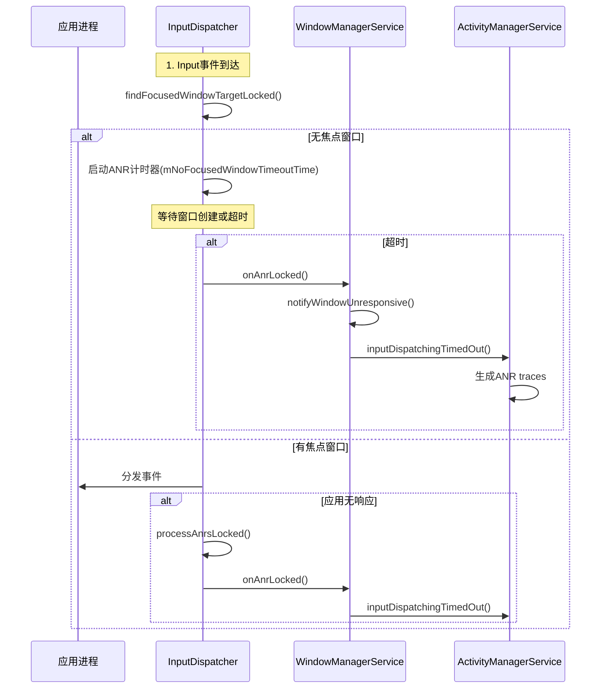

# Android ANR问题完整分析指南

> **源码参考**：本文档基于AOSP 16源码分析
> - ANR控制器：[AnrController.java](base/services/core/java/com/android/server/wm/AnrController.java)
> - Input分发器：[InputDispatcher.cpp](native/services/inputflinger/dispatcher/InputDispatcher.cpp)
> - EventLog标签：[EventLogTags.logtags](base/services/core/java/com/android/server/wm/EventLogTags.logtags)
> - 焦点管理：[DisplayContent.java](base/services/core/java/com/android/server/wm/DisplayContent.java)

## 一、需要收集的日志文件清单

### 1.1 日志文件对应关系表

```plain
┌─────────────────────────────────────────────────────────────────────┐
│                        ANR日志文件全景图                              │
└─────────────────────────────────────────────────────────────────────┘

文件类型              路径位置                 用途                  优先级
━━━━━━━━━━━━━━━━━━━━━━━━━━━━━━━━━━━━━━━━━━━━━━━━━━━━━━━━━━━━━━━━━━
traces.txt       /data/anr/traces.txt      主线程堆栈、线程状态    ⭐⭐⭐⭐⭐
                                           锁信息、CPU使用情况

anr_*.txt        /data/anr/anr_*.txt       ANR详细信息             ⭐⭐⭐⭐⭐
                                           系统状态快照

logcat           adb logcat -b all         实时日志流              ⭐⭐⭐⭐⭐
                                           事件时序、焦点变化

event log        adb logcat -b events      系统事件日志            ⭐⭐⭐⭐⭐
                                           Activity生命周期

bugreport        adb bugreport             完整系统状态            ⭐⭐⭐⭐
                                           包含所有日志

dropbox          /data/system/dropbox/     历史ANR记录             ⭐⭐⭐⭐
                 *.txt

systrace         systrace.py               时间线性能分析          ⭐⭐⭐⭐
                                           各线程耗时分布

perfetto         perfetto工具              新版性能分析            ⭐⭐⭐⭐
                                           更详细的trace

dumpsys window   adb shell dumpsys         窗口状态、焦点信息      ⭐⭐⭐⭐
                 window

dumpsys input    adb shell dumpsys         输入系统状态            ⭐⭐⭐⭐
                 input                     焦点窗口信息

dumpsys SF       adb shell dumpsys         Surface状态             ⭐⭐⭐
                 SurfaceFlinger            Layer可见性

winscope         .winscope文件             可视化窗口层级          ⭐⭐⭐
                                           Layer状态分析
```

## 二、日志获取方法详解

### 2.1 实时抓取（ANR发生时）

```bash
# ========== 完整ANR日志抓取脚本 ==========

ANR_LOG_DIR="anr_logs_$(date +%Y%m%d_%H%M%S)"
mkdir -p $ANR_LOG_DIR

echo "==================== 开始抓取ANR日志 ===================="

# 1. 抓取logcat（所有buffer）
echo "[1/12] 抓取logcat main..."
adb logcat -b main -d > $ANR_LOG_DIR/logcat_main.txt

echo "[2/12] 抓取logcat system..."
adb logcat -b system -d > $ANR_LOG_DIR/logcat_system.txt

echo "[3/12] 抓取logcat events..."
adb logcat -b events -d > $ANR_LOG_DIR/logcat_events.txt

echo "[4/12] 抓取logcat crash..."
adb logcat -b crash -d > $ANR_LOG_DIR/logcat_crash.txt

echo "[5/12] 抓取所有buffer..."
adb logcat -b all -d > $ANR_LOG_DIR/logcat_all.txt

# 2. 拉取ANR traces文件
echo "[6/12] 拉取traces.txt..."
adb pull /data/anr/traces.txt $ANR_LOG_DIR/ 2>/dev/null
adb pull /data/anr/anr_*.txt $ANR_LOG_DIR/ 2>/dev/null

# 3. 抓取bugreport（包含完整系统信息）
echo "[7/12] 生成bugreport（可能需要1-2分钟）..."
adb bugreport $ANR_LOG_DIR/bugreport.zip

# 4. dumpsys关键信息
echo "[8/12] dumpsys window..."
adb shell dumpsys window > $ANR_LOG_DIR/dumpsys_window.txt

echo "[9/12] dumpsys input..."
adb shell dumpsys input > $ANR_LOG_DIR/dumpsys_input.txt

echo "[10/12] dumpsys SurfaceFlinger..."
adb shell dumpsys SurfaceFlinger > $ANR_LOG_DIR/dumpsys_sf.txt

echo "[11/12] dumpsys activity..."
adb shell dumpsys activity > $ANR_LOG_DIR/dumpsys_activity.txt

echo "[12/12] dumpsys meminfo..."
adb shell dumpsys meminfo > $ANR_LOG_DIR/dumpsys_meminfo.txt

# 5. 系统状态信息
echo "抓取系统状态..."
adb shell ps -A > $ANR_LOG_DIR/ps.txt
adb shell top -n 1 > $ANR_LOG_DIR/top.txt
adb shell getprop > $ANR_LOG_DIR/prop.txt

echo "==================== 日志抓取完成 ===================="
echo "日志保存在: $ANR_LOG_DIR"
```

### 2.2 抓取Systrace

```bash
#!/bin/bash
# ========== Systrace抓取脚本 ==========

echo "开始抓取Systrace（持续10秒）..."

# 方法1: 使用systrace.py（推荐）
python $ANDROID_HOME/platform-tools/systrace/systrace.py \
    -t 10 \
    -o systrace_$(date +%Y%m%d_%H%M%S).html \
    sched gfx view wm am input dalvik sync workq \
    freq idle load disk mmc

# 方法2: 使用perfetto（Android 10+）
adb shell perfetto \
  -c - --txt \
  -o /data/misc/perfetto-traces/trace_$(date +%Y%m%d_%H%M%S) \
<<EOF
duration_ms: 10000

buffers: {
    size_kb: 63488
    fill_policy: DISCARD
}

data_sources: {
    config {
        name: "linux.ftrace"
        ftrace_config {
            # 调度事件
            ftrace_events: "sched/sched_switch"
            ftrace_events: "sched/sched_wakeup"
            ftrace_events: "sched/sched_wakeup_new"
            ftrace_events: "sched/sched_waking"
            ftrace_events: "sched/sched_process_exit"
            ftrace_events: "sched/sched_process_free"
            
            # 图形渲染
            ftrace_events: "graphics/gpu_mem_total"
            
            # Input事件
            ftrace_events: "input/input_event"
            
            # 电源管理
            ftrace_events: "power/suspend_resume"
            ftrace_events: "power/cpu_frequency"
            ftrace_events: "power/cpu_idle"
        }
    }
}

data_sources: {
    config {
        name: "android.surfaceflinger.frame"
    }
}

data_sources: {
    config {
        name: "android.graphics.composer.hwc"
    }
}
EOF

# 拉取trace文件
adb pull /data/misc/perfetto-traces/trace_* .

echo "Systrace抓取完成"
```

### 2.3 抓取Winscope

```bash
#!/bin/bash
# ========== Winscope抓取脚本 ==========

echo "开始抓取Winscope trace..."

# 1. 开启WindowManager trace
adb shell cmd window tracing start

# 2. 开启SurfaceFlinger trace  
adb shell "su root service call SurfaceFlinger 1025 i32 1"

echo "Trace已开启，请复现ANR问题..."
echo "按Enter键停止抓取..."
read

# 3. 停止trace
adb shell cmd window tracing stop
adb shell "su root service call SurfaceFlinger 1025 i32 0"

# 4. 拉取trace文件
WINSCOPE_DIR="winscope_$(date +%Y%m%d_%H%M%S)"
mkdir -p $WINSCOPE_DIR

adb pull /data/misc/wmtrace/wm_trace.pb $WINSCOPE_DIR/
adb pull /data/misc/wmtrace/layers_trace.pb $WINSCOPE_DIR/
adb pull /data/misc/wmtrace/transactions_trace.pb $WINSCOPE_DIR/

echo "Winscope trace保存在: $WINSCOPE_DIR"
echo "使用 https://ui.perfetto.dev/ 或 winscope.dev 打开分析"
```

### 2.4 Monkey测试日志抓取

```bash
#!/bin/bash
# ========== Monkey测试完整日志抓取 ==========

PACKAGE_NAME="com.example.app"
EVENT_COUNT=10000
SEED=12345

LOG_DIR="monkey_$(date +%Y%m%d_%H%M%S)"
mkdir -p $LOG_DIR

echo "开始Monkey测试..."

# 1. 清除旧日志
adb logcat -c

# 2. 开始实时日志抓取（后台运行）
adb logcat -v threadtime > $LOG_DIR/logcat_realtime.txt &
LOGCAT_PID=$!

adb logcat -b events -v threadtime > $LOG_DIR/logcat_events_realtime.txt &
EVENTS_PID=$!

# 3. 运行Monkey
adb shell monkey \
    -p $PACKAGE_NAME \
    -s $SEED \
    --throttle 300 \
    --pct-touch 40 \
    --pct-motion 25 \
    --pct-nav 15 \
    --pct-majornav 10 \
    --pct-syskeys 5 \
    --pct-appswitch 5 \
    --ignore-crashes \
    --ignore-timeouts \
    --monitor-native-crashes \
    -v -v -v \
    $EVENT_COUNT \
    2>&1 | tee $LOG_DIR/monkey.log

# 4. 停止日志抓取
kill $LOGCAT_PID
kill $EVENTS_PID

# 5. 检查是否有ANR
if adb shell ls /data/anr/*.txt 2>/dev/null; then
    echo "检测到ANR，拉取traces文件..."
    adb pull /data/anr/ $LOG_DIR/anr/
fi

# 6. 抓取最终状态
adb shell dumpsys window > $LOG_DIR/final_dumpsys_window.txt
adb shell dumpsys activity > $LOG_DIR/final_dumpsys_activity.txt

echo "Monkey测试完成，日志保存在: $LOG_DIR"
```

## 三、关键日志信息及过滤方法

### 3.1 EventLog关键事件

```bash
# ========== EventLog过滤脚本 ==========

#!/bin/bash
LOG_FILE="logcat_events.txt"
OUTPUT="anr_analysis_events.txt"

echo "==================== EventLog关键信息分析 ====================" > $OUTPUT
echo "" >> $OUTPUT

# 1. Activity生命周期
echo "========== Activity生命周期 ==========" >> $OUTPUT
grep -E "wm_.*activity|am_.*activity" $LOG_FILE | tail -100 >> $OUTPUT
echo "" >> $OUTPUT

# 关键事件说明（源码定义见 base/services/core/java/com/android/server/wm/EventLogTags.logtags）：
# wm_create_activity (30005): Activity创建
# wm_restart_activity (30006): Activity重启
# wm_resume_activity (30007): Activity resume
# wm_pause_activity (30013): Activity pause
# wm_destroy_activity (30018): Activity销毁
# wm_on_create_called (30057): onCreate调用
# wm_on_start_called (30059): onStart调用
# wm_on_resume_called (30022): onResume调用
# wm_on_paused_called (30021): onPause调用
# wm_on_stop_called (30049): onStop调用
# wm_activity_launch_time (30009): Activity启动耗时（关键！）
# wm_set_resumed_activity (30043): Activity变为resumed状态
# wm_focused_root_task (30044): 焦点Task变化

# 2. 焦点变化
echo "========== 焦点变化 ==========" >> $OUTPUT
grep -E "input_focus|Changing focus" $LOG_FILE | tail -50 >> $OUTPUT
echo "" >> $OUTPUT

# 关键事件（源码见 InputMonitor.java:518 和 DisplayContent.java:4050）：
# input_focus: Input系统焦点变化
# - Focus entering: 焦点进入某窗口
# - Focus leaving: 焦点离开某窗口
# - Focus request: 请求焦点
# - Requesting to set focus to null: 清空焦点

# 3. ANR事件
echo "========== ANR事件 ==========" >> $OUTPUT
grep -E "am_anr|ANR in" $LOG_FILE >> $OUTPUT
echo "" >> $OUTPUT

# am_anr格式：
# am_anr: [User,PID,Package,Flags,Reason]

# 4. Window事件
echo "========== Window事件 ==========" >> $OUTPUT
grep -E "wm_.*window" $LOG_FILE | tail -50 >> $OUTPUT
echo "" >> $OUTPUT

# 5. Task事件
echo "========== Task/Stack事件 ==========" >> $OUTPUT
grep -E "wm_task|wm_stack|wm_focused_root_task" $LOG_FILE | tail -30 >> $OUTPUT
echo "" >> $OUTPUT

# 6. 配置变更
echo "========== 配置变更 ==========" >> $OUTPUT
grep -E "configuration_changed|override_config" $LOG_FILE | tail -20 >> $OUTPUT
echo "" >> $OUTPUT

# 7. 亮灭屏
echo "========== 屏幕状态 ==========" >> $OUTPUT
grep -E "screen_toggled|power_screen" $LOG_FILE | tail -20 >> $OUTPUT
echo "" >> $OUTPUT

echo "EventLog分析完成: $OUTPUT"
```

### 3.2 Logcat主日志关键信息

```bash
#!/bin/bash
# ========== Logcat主日志过滤脚本 ==========

LOG_FILE="logcat_all.txt"
OUTPUT="anr_analysis_main.txt"

echo "==================== Logcat关键信息分析 ====================" > $OUTPUT

# 1. ANR触发点
echo "========== ANR触发信息 ==========" >> $OUTPUT
grep -B 50 -A 50 "Input dispatching timed out\|ANR in" $LOG_FILE >> $OUTPUT
echo "" >> $OUTPUT

# 2. WindowManager焦点日志
echo "========== WindowManager焦点变化 ==========" >> $OUTPUT
grep "WindowManager:.*Changing focus" $LOG_FILE | tail -100 >> $OUTPUT
echo "" >> $OUTPUT

# 3. InputDispatcher等待日志
echo "========== InputDispatcher等待 ==========" >> $OUTPUT
grep "InputDispatcher.*Waiting" $LOG_FILE | tail -50 >> $OUTPUT
echo "" >> $OUTPUT

# 4. Activity启动日志
echo "========== Activity启动 ==========" >> $OUTPUT
grep "ActivityTaskManager.*START u0" $LOG_FILE | tail -50 >> $OUTPUT
echo "" >> $OUTPUT

# 5. ViewRootImpl关键日志
echo "========== ViewRootImpl ==========" >> $OUTPUT
grep -E "VRI$$.*$$|reportDrawFinished|reportDrawn" $LOG_FILE | tail -50 >> $OUTPUT
echo "" >> $OUTPUT

# 6. SurfaceFlinger日志
echo "========== SurfaceFlinger ==========" >> $OUTPUT
grep -E "SurfaceFlinger|Layer.*Focus" $LOG_FILE | tail -50 >> $OUTPUT
echo "" >> $OUTPUT

# 7. Transition动画
echo "========== Transition动画 ==========" >> $OUTPUT
grep -E "WindowManagerShell.*transition|TransitionController|SentTransition|FinishTransition" \
    $LOG_FILE | tail -50 >> $OUTPUT
echo "" >> $OUTPUT

# 8. Recent手势
echo "========== Recent手势 ==========" >> $OUTPUT
grep -E "ShellRecents|recents.*animation|RecentsController" $LOG_FILE | tail -30 >> $OUTPUT
echo "" >> $OUTPUT

# 9. 按键事件
echo "========== 按键事件 ==========" >> $OUTPUT
grep -E "interceptKeyTq|interceptKeyTi" $LOG_FILE | tail -30 >> $OUTPUT
echo "" >> $OUTPUT

# 10. Surface同步
echo "========== Surface同步 ==========" >> $OUTPUT
grep -E "BLASTSyncEngine|SyncGroup" $LOG_FILE | tail -30 >> $OUTPUT
echo "" >> $OUTPUT

# 11. 窗口Relayout
echo "========== Relayout窗口 ==========" >> $OUTPUT
grep "Relayout Window" $LOG_FILE | tail -30 >> $OUTPUT
echo "" >> $OUTPUT

# 12. GC和内存
echo "========== GC和内存 ==========" >> $OUTPUT
grep -E "GC_|alloc|OutOfMemory" $LOG_FILE | tail -30 >> $OUTPUT
echo "" >> $OUTPUT

echo "Logcat主日志分析完成: $OUTPUT"
```

### 3.3 自动化分析脚本

```python
#!/usr/bin/env python3
# ========== ANR日志自动分析工具 ==========

import re
import sys
from datetime import datetime, timedelta
from collections import defaultdict

class ANRLogAnalyzer:
    def __init__(self, logcat_file, events_file):
        self.logcat_file = logcat_file
        self.events_file = events_file
        self.anr_time = None
        self.anr_package = None
        self.timeline = []
        
    def parse_timestamp(self, line):
        """解析时间戳"""
        match = re.search(r'(\d{2}-\d{2}\s+\d{2}:\d{2}:\d{2}\.\d{3})', line)
        if match:
            return match.group(1)
        return None
    
    def find_anr_info(self):
        """查找ANR基本信息"""
        print("=== 步骤1: 查找ANR信息 ===")
        
        with open(self.logcat_file, 'r', encoding='utf-8', errors='ignore') as f:
            for line in f:
                # 查找ANR触发行
                if 'Input dispatching timed out' in line or 'ANR in' in line:
                    self.anr_time = self.parse_timestamp(line)
                    
                    # 提取包名
                    match = re.search(r'ANR in ([^\s]+)', line)
                    if match:
                        self.anr_package = match.group(1)
                    
                    print(f"发现ANR: {line.strip()}")
                    print(f"ANR时间: {self.anr_time}")
                    print(f"ANR包名: {self.anr_package}")
                    break
        
        if not self.anr_time:
            print("❌ 未找到ANR信息")
            return False
        return True
    
    def analyze_activity_lifecycle(self):
        """分析Activity生命周期"""
        print("\n=== 步骤2: 分析Activity生命周期 ===")
        
        lifecycle_events = []
        
        with open(self.events_file, 'r', encoding='utf-8', errors='ignore') as f:
            for line in f:
                if any(x in line for x in ['wm_create_activity', 'wm_on_create_called',
                                           'wm_on_resume_called', 'wm_activity_launch_time']):
                    timestamp = self.parse_timestamp(line)
                    lifecycle_events.append((timestamp, line.strip()))
        
        # 显示最近的生命周期事件
        for ts, event in lifecycle_events[-10:]:
            print(f"{ts}: {event}")
        
        # 查找启动时间
        for ts, event in lifecycle_events:
            if 'wm_activity_launch_time' in event:
                match = re.search(r'wm_activity_launch_time:.*,(\d+)\]', event)
                if match:
                    launch_time = int(match.group(1))
                    print(f"\n⚠️  Activity启动时间: {launch_time}ms")
                    if launch_time > 5000:
                        print(f"❌ 启动时间过长（>{launch_time}ms），可能是应用启动慢导致")
                        return 'APP_SLOW_START'
                    elif launch_time > 3000:
                        print(f"⚠️  启动时间较长（{launch_time}ms），需要优化")
        
        return 'UNKNOWN'
    
    def analyze_focus_change(self):
        """分析焦点变化"""
        print("\n=== 步骤3: 分析焦点变化 ===")
        
        focus_events = []
        
        with open(self.logcat_file, 'r', encoding='utf-8', errors='ignore') as f:
            for line in f:
                timestamp = self.parse_timestamp(line)
                
                # WindowManager焦点变化
                if 'Changing focus' in line:
                    focus_events.append((timestamp, 'WM', line.strip()))
                
                # Input焦点变化
                if 'input_focus' in line and any(x in line for x in 
                    ['Focus entering', 'Focus leaving', 'Focus request']):
                    focus_events.append((timestamp, 'INPUT', line.strip()))
        
        # 显示ANR前后的焦点变化
        print("\n焦点变化时间线（最近20条）:")
        for ts, source, event in focus_events[-20:]:
            print(f"[{source}] {ts}: {event}")
        
        # 分析焦点状态
        last_wm_focus = None
        last_input_focus = None
        
        for ts, source, event in focus_events:
            if source == 'WM' and 'Changing focus' in event:
                match = re.search(r'to (Window\{[^}]+\}|null)', event)
                if match:
                    last_wm_focus = match.group(1)
            
            elif source == 'INPUT' and 'Focus entering' in event:
                match = re.search(r'Focus entering ([^\s,]+)', event)
                if match:
                    last_input_focus = match.group(1)
        
        print(f"\n最后的WindowManager焦点: {last_wm_focus}")
        print(f"最后的Input焦点: {last_input_focus}")
        
        if last_wm_focus and 'null' not in last_wm_focus and \
           (not last_input_focus or last_input_focus != last_wm_focus):
            print("❌ WindowManager有焦点窗口，但Input焦点未更新")
            return 'INPUT_FOCUS_NOT_UPDATED'
        
        if last_wm_focus and 'null' in last_wm_focus:
            print("❌ WindowManager焦点为null")
            return 'NO_FOCUSED_WINDOW'
        
        return 'UNKNOWN'
    
    def analyze_draw_state(self):
        """分析绘制状态"""
        print("\n=== 步骤4: 分析绘制状态 ===")
        
        draw_events = []
        
        with open(self.logcat_file, 'r', encoding='utf-8', errors='ignore') as f:
            for line in f:
                if any(x in line for x in ['reportDrawFinished', 'Relayout Window',
                                           'performTraversals']):
                    timestamp = self.parse_timestamp(line)
                    draw_events.append((timestamp, line.strip()))
        
        for ts, event in draw_events[-10:]:
            print(f"{ts}: {event}")
        
        # 检查是否有reportDrawFinished
        has_draw_finished = any('reportDrawFinished' in e[1] for e in draw_events)
        
        if not has_draw_finished:
            print("❌ 未找到reportDrawFinished，窗口可能未绘制完成")
            return 'DRAW_NOT_FINISHED'
        
        return 'UNKNOWN'
    
    def analyze_surface_state(self):
        """分析Surface状态"""
        print("\n=== 步骤5: 分析Surface/Layer状态 ===")
        
        surface_events = []
        
        with open(self.logcat_file, 'r', encoding='utf-8', errors='ignore') as f:
            for line in f:
                if any(x in line for x in ['Layer', 'SurfaceFlinger', 'NOT_VISIBLE',
                                           'isHidden', 'isOccluded']):
                    timestamp = self.parse_timestamp(line)
                    surface_events.append((timestamp, line.strip()))
        
        for ts, event in surface_events[-15:]:
            print(f"{ts}: {event}")
        
        # 检查NOT_VISIBLE
        for ts, event in surface_events:
            if 'NOT_VISIBLE' in event:
                print("❌ Layer状态为NOT_VISIBLE，Surface不可见")
                return 'SURFACE_NOT_VISIBLE'
        
        return 'UNKNOWN'
    
    def analyze_recent_gesture(self):
        """分析Recent手势"""
        print("\n=== 步骤6: 检查Recent手势相关 ===")
        
        recent_events = []
        
        with open(self.logcat_file, 'r', encoding='utf-8', errors='ignore') as f:
            for line in f:
                if any(x in line for x in ['ShellRecents', 'recents_animation',
                                           'RecentsController', 'startExistingRecents']):
                    timestamp = self.parse_timestamp(line)
                    recent_events.append((timestamp, line.strip()))
        
        if recent_events:
            print(f"\n发现{len(recent_events)}条Recent相关日志:")
            for ts, event in recent_events[-10:]:
                print(f"{ts}: {event}")
            
            # 检查手势是否完成
            has_finish = any('finishInner' in e[1] or 'Completing' in e[1] 
                           for e in recent_events)
            
            if not has_finish:
                print("❌ Recent手势未正常结束，可能导致焦点异常")
                return 'RECENT_GESTURE_NOT_FINISHED'
        
        return 'UNKNOWN'
    
    def generate_report(self):
        """生成分析报告"""
        print("\n" + "="*70)
        print("                        ANR分析报告")
        print("="*70)
        
        # 基本信息
        print(f"\nANR时间: {self.anr_time}")
        print(f"ANR包名: {self.anr_package}")
        
        # 执行分析
        issues = []
        
        result = self.analyze_activity_lifecycle()
        if result != 'UNKNOWN':
            issues.append(result)
        
        result = self.analyze_focus_change()
        if result != 'UNKNOWN':
            issues.append(result)
        
        result = self.analyze_draw_state()
        if result != 'UNKNOWN':
            issues.append(result)
        
        result = self.analyze_surface_state()
        if result != 'UNKNOWN':
            issues.append(result)
        
        result = self.analyze_recent_gesture()
        if result != 'UNKNOWN':
            issues.append(result)
        
        # 问题总结
        print("\n" + "="*70)
        print("问题总结:")
        print("="*70)
        
        if not issues:
            print("⚠️  未能自动识别具体问题，需要人工深入分析")
        else:
            for issue in issues:
                print(f"❌ {issue}")
        
        # 给出建议
        print("\n" + "="*70)
        print("分析建议:")
        print("="*70)
        
        if 'APP_SLOW_START' in issues:
            print("""
1. 检查Application.onCreate()和Activity.onCreate()耗时
2. 使用Trace查看主线程阻塞点
3. 将耗时操作移到异步线程
4. 优化布局复杂度
            """)
        
        if 'NO_FOCUSED_WINDOW' in issues:
            print("""
1. 检查Activity是否正常Resume
2. 检查窗口是否正常Relayout
3. 查看Winscope确认窗口层级
            """)
        
        if 'INPUT_FOCUS_NOT_UPDATED' in issues:
            print("""
1. 检查reportDrawFinished是否调用
2. 使用Winscope检查Layer可见性
3. 检查Surface是否正常创建
4. 查看SurfaceFlinger日志
            """)
        
        if 'SURFACE_NOT_VISIBLE' in issues:
            print("""
1. 使用Winscope分析Layer状态
2. 检查父Layer是否被隐藏
3. 检查Layer的alpha和bounds
4. 查看是否被其他Layer遮挡
            """)
        
        if 'RECENT_GESTURE_NOT_FINISHED' in issues:
            print("""
1. 检查Recent手势动画是否异常
2. 查看Launcher日志
3. 检查TransitionController日志
4. 可能是系统问题，查看Google Issue
            """)
        
        print("\n" + "="*70)

def main():
    if len(sys.argv) < 3:
        print("用法: python3 anr_analyzer.py <logcat_file> <events_file>")
        sys.exit(1)
    
    logcat_file = sys.argv[1]
    events_file = sys.argv[2]
    
    analyzer = ANRLogAnalyzer(logcat_file, events_file)
    
    if analyzer.find_anr_info():
        analyzer.generate_report()
    else:
        print("未找到ANR信息，请检查日志文件")

if __name__ == '__main__':
    main()
```

## 四、Traces.txt分析方法

### 4.1 Traces文件结构

```plain
traces.txt结构图:
┌─────────────────────────────────────────────────────────────┐
│ ----- pid <PID> at <timestamp> -----                        │  ← ANR进程标识
│ Cmd line: <package_name>                                    │  ← 包名
│                                                              │
│ DALVIK THREADS (N threads):                                 │  ← 线程信息
│                                                              │
│ "main" prio=5 tid=1 Native                                  │  ← 主线程
│   | group="main" sCount=1 dsCount=0 flags=1 obj=0x...      │
│   | sysTid=<tid> nice=0 cgrp=default sched=0/0 handle=...  │
│   | state=S schedstat=( ... ) utm=... stm=... core=...     │
│   | stack=0x... ... pthread_t=0x...                         │
│   native: #00 pc ... <lib> (<symbol>+<offset>)             │  ← Native堆栈
│   native: #01 pc ...                                        │
│   at <java_method>(<source>:<line>)                         │  ← Java堆栈
│   at <java_method>(<source>:<line>)                         │
│   ...                                                        │
│                                                              │
│ "RenderThread" prio=6 tid=10 Native                         │  ← RenderThread
│   ...                                                        │
│                                                              │
│ "HeapTaskDaemon" prio=5 tid=5 Waiting                       │  ← 其他线程
│   ...                                                        │
│                                                              │
│ ----- end <PID> -----                                       │
└─────────────────────────────────────────────────────────────┘
```

### 4.2 Traces分析脚本

```python
#!/usr/bin/env python3
# ========== Traces.txt分析工具 ==========

import re
import sys

class TracesAnalyzer:
    def __init__(self, traces_file):
        self.traces_file = traces_file
        self.threads = {}
        self.anr_pid = None
        
    def parse_traces(self):
        """解析traces文件"""
        print("解析traces.txt...")
        
        current_thread = None
        current_stack = []
        
        with open(self.traces_file, 'r', encoding='utf-8', errors='ignore') as f:
            for line in f:
                # 查找ANR进程
                if 'pid' in line and self.anr_pid is None:
                    match = re.search(r'pid (\d+)', line)
                    if match:
                        self.anr_pid = match.group(1)
                        print(f"ANR进程PID: {self.anr_pid}")
                
                # 解析线程名
                if line.startswith('"') and 'prio=' in line:
                    # 保存上一个线程
                    if current_thread:
                        self.threads[current_thread] = {
                            'stack': current_stack.copy(),
                            'raw': '\n'.join(current_stack)
                        }
                    
                    # 开始新线程
                    match = re.search(r'"([^"]+)".*tid=(\d+)\s+(\w+)', line)
                    if match:
                        current_thread = match.group(1)
                        current_stack = [line.strip()]
                
                elif current_thread:
                    current_stack.append(line.strip())
        
        # 保存最后一个线程
        if current_thread:
            self.threads[current_thread] = {
                'stack': current_stack.copy(),
                'raw': '\n'.join(current_stack)
            }
        
        print(f"共找到 {len(self.threads)} 个线程\n")
    
    def analyze_main_thread(self):
        """分析主线程"""
        print("="*70)
        print("主线程分析")
        print("="*70)
        
        if 'main' not in self.threads:
            print("❌ 未找到主线程信息")
            return
        
        main_thread = self.threads['main']
        stack = main_thread['raw']
        
        print(stack)
        print()
        
        # 检查常见问题
        issues = []
        
        # 1. 检查是否在等待锁
        if 'waiting to lock' in stack.lower() or 'blocked' in stack.lower():
            issues.append("主线程等待锁")
            
            # 提取锁信息
            match = re.search(r'waiting to lock <0x([0-9a-f]+)>', stack)
            if match:
                lock_addr = match.group(1)
                print(f"⚠️  主线程等待锁: 0x{lock_addr}")
                
                # 查找持有该锁的线程
                self.find_lock_holder(lock_addr)
        
        # 2. 检查是否在执行耗时操作
        slow_operations = [
            'Thread.sleep', 'Object.wait', 'MessageQueue.nativePollOnce',
            'Binder.transact', 'socket', 'read', 'write'
        ]
        
        for op in slow_operations:
            if op in stack:
                issues.append(f"可能的耗时操作: {op}")
        
        # 3. 检查是否在onCreate/onResume
        lifecycle_methods = [
            'Activity.onCreate', 'Activity.onResume', 'Activity.onStart',
            'Application.onCreate'
        ]
        
        for method in lifecycle_methods:
            if method in stack:
                issues.append(f"阻塞在生命周期: {method}")
        
        # 显示问题总结
        if issues:
            print("\n主线程问题:")
            for issue in issues:
                print(f"  ❌ {issue}")
        else:
            print("\n✅ 主线程看起来正常")
        
        print()
    
    def find_lock_holder(self, lock_addr):
        """查找持有锁的线程"""
        print(f"\n查找持有锁 0x{lock_addr} 的线程:")
        
        for thread_name, thread_data in self.threads.items():
            stack = thread_data['raw']
            
            # 查找 locked <0x...>
            if f'locked <0x{lock_addr}>' in stack:
                print(f"\n  持有者: {thread_name}")
                print("  " + "─"*60)
                
                # 显示该线程的前10行堆栈
                lines = thread_data['stack'][:10]
                for line in lines:
                    print(f"  {line}")
                
                return
        
        print("  未找到持有该锁的线程")
    
    def analyze_render_thread(self):
        """分析RenderThread"""
        print("="*70)
        print("RenderThread分析")
        print("="*70)
        
        render_threads = [name for name in self.threads.keys() 
                         if 'render' in name.lower()]
        
        if not render_threads:
            print("未找到RenderThread")
            return
        
        for thread_name in render_threads:
            print(f"\n线程: {thread_name}")
            print("─"*60)
            
            stack = self.threads[thread_name]['raw']
            print(stack[:500])  # 显示前500字符
            
            # 检查是否在等待buffer
            if 'dequeueBuffer' in stack or 'queueBuffer' in stack:
                print("\n⚠️  RenderThread可能在等待Buffer")
    
    def analyze_binder_threads(self):
        """分析Binder线程"""
        print("\n" + "="*70)
        print("Binder线程分析")
        print("="*70)
        
        binder_threads = [name for name in self.threads.keys() 
                         if 'binder' in name.lower()]
        
        if not binder_threads:
            print("未找到Binder线程")
            return
        
        print(f"共有 {len(binder_threads)} 个Binder线程\n")
        
        for thread_name in binder_threads:
            stack = self.threads[thread_name]['raw']
            
            # 只显示有问题的Binder线程
            if 'waiting to lock' in stack.lower() or 'blocked' in stack.lower():
                print(f"线程: {thread_name}")
                print("─"*60)
                print(stack[:300])
                print()
    
    def check_deadlock(self):
        """检查死锁"""
        print("="*70)
        print("死锁检测")
        print("="*70)
        
        # 构建等待图
        waiting_for = {}  # thread -> lock
        holding = {}      # lock -> thread
        
        for thread_name, thread_data in self.threads.items():
            stack = thread_data['raw']
            
            # 查找等待的锁
            match = re.search(r'waiting to lock <0x([0-9a-f]+)>', stack)
            if match:
                lock_addr = match.group(1)
                waiting_for[thread_name] = lock_addr
            
            # 查找持有的锁
            matches = re.findall(r'locked <0x([0-9a-f]+)>', stack)
            for lock_addr in matches:
                holding[lock_addr] = thread_name
        
        # 检测循环等待
        deadlock_found = False
        
        for thread1, lock1 in waiting_for.items():
            if lock1 in holding:
                thread2 = holding[lock1]
                
                if thread2 in waiting_for:
                    lock2 = waiting_for[thread2]
                    
                    if lock2 in holding and holding[lock2] == thread1:
                        print(f"\n❌ 发现死锁!")
                        print(f"  {thread1} 等待锁 0x{lock1} (被 {thread2} 持有)")
                        print(f"  {thread2} 等待锁 0x{lock2} (被 {thread1} 持有)")
                        deadlock_found = True
        
        if not deadlock_found:
            print("\n✅ 未发现明显死锁")
        
        print()
    
    def generate_report(self):
        """生成完整报告"""
        self.parse_traces()
        self.analyze_main_thread()
        self.analyze_render_thread()
        self.analyze_binder_threads()
        self.check_deadlock()

def main():
    if len(sys.argv) < 2:
        print("用法: python3 traces_analyzer.py <traces.txt>")
        sys.exit(1)
    
    traces_file = sys.argv[1]
    analyzer = TracesAnalyzer(traces_file)
    analyzer.generate_report()

if __name__ == '__main__':
    main()
```

## 五、ANR检测核心流程源码分析

### 5.0 ANR检测流程概述

ANR（Application Not Responding）检测主要发生在InputDispatcher中，核心流程如下：



### 5.0.1 窗口无焦点ANR检测源码

**核心代码位置**：[InputDispatcher.cpp:2330-2360](native/services/inputflinger/dispatcher/InputDispatcher.cpp#L2330)

```cpp
// 当有焦点应用但无焦点窗口时，启动ANR计时器
if (focusedWindowHandle == nullptr && focusedApplicationHandle != nullptr) {
    if (!mNoFocusedWindowTimeoutTime.has_value()) {
        // 刚发现没有焦点窗口，启动ANR计时器
        std::chrono::nanoseconds timeout = focusedApplicationHandle->getDispatchingTimeout(
                DEFAULT_INPUT_DISPATCHING_TIMEOUT);
        mNoFocusedWindowTimeoutTime = currentTime + timeout.count();
        mAwaitedFocusedApplication = focusedApplicationHandle;
        ALOGW("Waiting because no window has focus but %s may eventually add a "
              "window when it finishes starting up. Will wait for %" PRId64 "ms",
              mAwaitedFocusedApplication->getName().c_str(), millis(timeout));
        nextWakeupTime = std::min(nextWakeupTime, *mNoFocusedWindowTimeoutTime);
        return injectionError(InputEventInjectionResult::PENDING);
    } else if (currentTime > *mNoFocusedWindowTimeoutTime) {
        // 已超时，触发ANR
        ALOGE("Dropping %s event because there is no focused window",
              ftl::enum_string(entry.type).c_str());
        return injectionError(InputEventInjectionResult::FAILED);
    }
}
```

### 5.0.2 ANR处理流程源码

**核心代码位置**：[AnrController.java:100-130](base/services/core/java/com/android/server/wm/AnrController.java#L100)

```java
// AnrController处理无响应窗口
void notifyWindowUnresponsive(@NonNull IBinder token, @NonNull OptionalInt pid,
        @NonNull TimeoutRecord timeoutRecord) {
    try {
        timeoutRecord.mLatencyTracker.notifyWindowUnresponsiveStarted();
        if (notifyWindowUnresponsive(token, timeoutRecord)) {
            return;
        }
        // ... 省略部分代码
    } finally {
        timeoutRecord.mLatencyTracker.notifyWindowUnresponsiveEnded();
    }
}

// 实际的ANR日志输出
private boolean notifyWindowUnresponsive(@NonNull IBinder inputToken,
        TimeoutRecord timeoutRecord) {
    // ... 获取窗口信息 ...
    Slog.i(TAG_WM, "ANR in " + target + ". Reason:" + timeoutRecord.mReason);
    // ... 调用AMS处理ANR ...
    if (activity != null) {
        activity.inputDispatchingTimedOut(timeoutRecord, pid);
    } else {
        mService.mAmInternal.inputDispatchingTimedOut(pid, aboveSystem, timeoutRecord);
    }
    dumpAnrStateAsync(activity, windowState, timeoutRecord.mReason);
    return true;
}
```

### 5.0.3 ANR超时检测源码

**核心代码位置**：[InputDispatcher.cpp:2820-2860](native/services/inputflinger/dispatcher/InputDispatcher.cpp#L2820)

```cpp
nsecs_t InputDispatcher::processAnrsLocked() {
    const nsecs_t currentTime = now();
    nsecs_t nextAnrCheck = LLONG_MAX;
    
    // 检查是否在等待焦点窗口出现，如果等待太久则触发ANR
    if (mNoFocusedWindowTimeoutTime.has_value() && mAwaitedFocusedApplication != nullptr) {
        if (currentTime >= *mNoFocusedWindowTimeoutTime) {
            processNoFocusedWindowAnrLocked();  // 触发无焦点窗口ANR
            mAwaitedFocusedApplication.reset();
            mNoFocusedWindowTimeoutTime = std::nullopt;
            return LLONG_MIN;
        } else {
            nextAnrCheck = *mNoFocusedWindowTimeoutTime;
        }
    }
    
    // 检查是否有连接ANR到期
    nextAnrCheck = std::min(nextAnrCheck, mAnrTracker.firstTimeout());
    if (currentTime < nextAnrCheck) {
        return nextAnrCheck;  // 一切正常，下次检查时间
    }
    
    // 有无响应的连接，触发ANR
    std::shared_ptr<Connection> connection =
            mConnectionManager.getConnection(mAnrTracker.firstToken());
    connection->responsive = false;
    mAnrTracker.eraseToken(connection->getToken());
    onAnrLocked(connection);
    return LLONG_MIN;
}
```

## 七、完整ANR分析流程

```plain
┌─────────────────────────────────────────────────────────────────────┐
│                      完整ANR分析流程图                                │
└─────────────────────────────────────────────────────────────────────┘

步骤1: 收集日志
├─ logcat (main/system/events/crash)
├─ traces.txt
├─ bugreport
├─ dumpsys (window/input/sf/activity)
└─ systrace/winscope (可选)
          │
          ▼
步骤2: 确定ANR类型
├─ 查找 "ANR in" 或 "Input dispatching timed out"
├─ 确定ANR时间点
├─ 确定ANR包名
└─ 确定ANR原因描述
          │
          ├─── "Application does not have a focused window"
          │         │
          │         └──▶ 窗口无焦点ANR (本文重点)
          │                   │
          │                   ▼
          │              步骤3: 检查Activity启动
          │              ├─ 查找 wm_activity_launch_time
          │              ├─ 如果 > 5s → 应用启动慢
          │              │    └──▶ 分析onCreate/onResume
          │              │
          │              └─ 如果 < 5s → 系统问题
          │                     │
          │                     ▼
          │              步骤4: 检查焦点状态
          │              ├─ WindowManager焦点 (Changing focus)
          │              ├─ Input焦点 (input_focus)
          │              ├─ 焦点是否为null?
          │              └─ 焦点是否更新到Input?
          │                     │
          │                     ▼
          │              步骤5: 检查窗口绘制
          │              ├─ reportDrawFinished是否调用?
          │              ├─ Relayout是否完成?
          │              └─ Surface是否创建?
          │                     │
          │                     ▼
          │              步骤6: 检查Layer状态
          │              ├─ 使用Winscope查看
          │              ├─ Layer是否可见?
          │              ├─ Layer是否被隐藏?
          │              └─ 父Layer状态?
          │                     │
          │                     ▼
          │              步骤7: 检查特殊场景
          │              ├─ Recent手势?
          │              ├─ 屏幕旋转?
          │              ├─ 多窗口切换?
          │              └─ 系统动画?
          │
          ├─── "Broadcast"
          │         └──▶ Broadcast ANR
          │
          ├─── "Service"
          │         └──▶ Service ANR
          │
          └─── "ContentProvider"
                    └──▶ Provider ANR
                              │
                              ▼
步骤8: 分析Traces.txt
├─ 主线程在做什么?
│   ├─ 等待锁?
│   ├─ 执行耗时操作?
│   └─ 生命周期阻塞?
│
├─ RenderThread状态?
│   └─ 等待Buffer?
│
├─ 是否有死锁?
└─ Binder线程状态?
          │
          ▼
步骤9: 确定根本原因
├─ 应用层问题
│   ├─ 主线程耗时操作
│   ├─ 布局过于复杂
│   ├─ 绘制过于复杂
│   └─ 死锁/等待锁
│
├─ 系统层问题
│   ├─ Surface创建慢
│   ├─ Layer状态异常
│   ├─ InputFocus未更新
│   ├─ SurfaceFlinger慢
│   └─ Recent手势异常
│
└─ 环境问题
    ├─ 内存不足
    ├─ CPU繁忙
    └─ IO阻塞
          │
          ▼
步骤10: 给出解决方案
```

## 八、实战案例分析

### 案例1: 应用启动慢导致的ANR

```bash
# ========== 关键日志 ==========

# 1. ANR信息
12-05 17:18:55.096  1903  2245 I WindowManager: ANR in ActivityRecord{161928112 u0 
    com.example.myapplication/.Main t83}. 
    Reason: Input dispatching timed out (Application does not have a focused window).

# 2. Activity启动
12-05 17:18:45.313  1903  2196 I wm_create_activity: [0,161928112,83,
    com.example.myapplication/.Main,android.intent.action.MAIN,NULL,NULL,268435456]

# 3. 焦点变化
12-05 17:18:45.333  1903  5331 W WindowManager: Changing focus from 
    Window{243b7ec u0 com.android.launcher/...QuickstepLauncher} to null

# 4. 长时间后才完成onCreate
12-05 17:18:55.719 16362 16362 I wm_on_create_called: [161928112,
    com.example.myapplication.Main,performCreate,10021]

# 5. 启动时间
12-05 17:18:55.809  1903  2010 I wm_activity_launch_time: [0,161928112,
    com.example.myapplication/.Main,10495]
                                                        ^^^^^ 10.5秒!

# ========== 分析结论 ==========
问题: 应用onCreate耗时10秒
原因: 主线程执行耗时操作
解决: 
  1. 检查traces.txt主线程堆栈
  2. 使用Trace查看耗时点
  3. 将耗时操作移到子线程
```

### 案例2: Surface不可见导致的ANR

```bash
# ========== 关键日志 ==========

# 1. Activity正常启动
03-15 15:43:29.553 30851 30851 I wm_on_resume_called: [210563469,
    com.google.android.apps.messaging/.ui.ConversationListActivity,RESUME_ACTIVITY,8]

# 2. 启动时间正常
03-15 15:43:29.631  1446  1761 I wm_activity_launch_time: [0,210563469,
    com.google.android.apps.messaging/.ui.ConversationListActivity,414]

# 3. 焦点窗口已设置
03-15 15:43:29.641  1446  1953 W WindowManager: Changing focus to Window{xxx MainActivity}

# 4. 但Input焦点状态异常
03-15 15:43:29.641  1446  1953 I input_focus: [Focus request xxx MainActivity, 
    reason=UpdateInputWindows]

# 5. reportDrawFinished已调用
03-15 15:43:29.650 30851 30851 D VRI[MainActivity]: reportDrawFinished

# 6. 但是Input焦点一直没有entering
# (应该有 "Focus entering xxx MainActivity")

# 7. SurfaceFlinger日志显示Layer不可见
Layer: isHiddenByPolicy parent=DefaultTaskDisplayArea#9 reason=parent.mHidden=true

# ========== 分析结论 ==========
问题: Layer被父Layer隐藏
原因: DefaultTaskDisplayArea被错误设置为HIDDEN
解决: 
  1. 使用Winscope确认Layer层级
  2. 检查Transition动画是否异常
  3. 查找设置HIDDEN的代码
  4. 检查是否是系统问题
```

### 案例3: Recent手势导致的ANR

```bash
# ========== 关键日志 ==========

# 1. 进入Recent
03-15 15:43:29.414  1446  3785 I wm_focused_root_task: [0,27,-1,startExistingRecents]

# 2. recents_animation_input_consumer获取焦点
03-15 15:43:29.456  1446  1765 I input_focus: [Focus request 
    recents_animation_input_consumer,reason=UpdateInputWindows]
03-15 15:43:29.470  1446  1953 I input_focus: [Focus entering 
    recents_animation_input_consumer (server),reason=setFocusedWindow]

# 3. 应用启动新Activity
03-15 15:43:30.198  1446  1837 I wm_create_activity: [0,237489693,37,
    com.google.android.apps.messaging/gaia.expresssignin.BugleExpressSignInActivity,...]

# 4. Recent焦点异常丢失
03-15 15:43:30.728  1446  1953 I input_focus: [Focus leaving 
    recents_animation_input_consumer (server),reason=NOT_VISIBLE]

# 5. 没有新的焦点窗口

# 6. 按Back键触发ANR
03-15 15:43:39.993  1446 31148 I am_anr: [0,23232,com.google.android.apps.nexuslauncher,
    885767749,Input dispatching timed out(Application does not have a focused window)]

# ========== 分析结论 ==========
问题: Recent手势过程中应用启动新Activity导致焦点丢失
原因: recents_animation_input_consumer的Layer相对层级设置错误
解决: 
  1. 修改Layer相对层级设置
  2. 使用Task而不是Activity作为相对层级基准
  3. 提交Google Case修复
```

## 九、快速诊断检查清单

```plain
┌─────────────────────────────────────────────────────────────────────┐
│                    ANR快速诊断检查清单                                │
└─────────────────────────────────────────────────────────────────────┘

□ 步骤1: 基本信息确认 (1分钟)
  □ ANR时间: _______________
  □ ANR包名: _______________
  □ ANR类型: _______________
  □ 系统版本: _______________

□ 步骤2: 应用启动检查 (2分钟)
  □ 查找 wm_activity_launch_time
  □ 启动时间: _______ ms
  □ 是否 > 5000ms? □是 □否
  □ 如果是 → 应用启动慢，检查onCreate/onResume

□ 步骤3: 焦点状态检查 (3分钟)
  □ WindowManager焦点: _______________
  □ Input焦点: _______________
  □ 两者是否一致? □是 □否
  □ 是否为null? □是 □否

□ 步骤4: 绘制状态检查 (2分钟)
  □ reportDrawFinished是否调用? □是 □否
  □ Relayout是否完成? □是 □否
  □ Surface是否创建? □是 □否

□ 步骤5: Layer状态检查 (5分钟)
  □ 是否抓取了Winscope? □是 □否
  □ Layer是否存在? □是 □否
  □ Layer是否可见? □是 □否
  □ 是否被父Layer隐藏? □是 □否

□ 步骤6: 特殊场景检查 (3分钟)
  □ 是否有Recent手势? □是 □否
  □ 是否有屏幕旋转? □是 □否
  □ 是否有多窗口操作? □是 □否

□ 步骤7: Traces分析 (5分钟)
  □ 主线程状态: _______________
  □ 是否等待锁? □是 □否
  □ 是否有耗时操作? □是 □否
  □ RenderThread状态: _______________

□ 步骤8: 结论 (根据以上检查确定)
  □ 应用层问题
    □ 主线程耗时
    □ 布局复杂
    □ 绘制复杂
    □ 死锁
  
  □ 系统层问题
    □ Surface创建慢
    □ Layer状态异常
    □ InputFocus未更新
    □ Recent手势异常
  
  □ 需要进一步分析

总耗时: _______ 分钟
```

## 十、总结

通过以上完整的日志收集、过滤、分析流程，我们可以系统性地诊断ANR问题：

1. **日志收集**: 使用脚本自动化收集所有相关日志
2. **关键信息提取**: 通过grep和脚本快速定位关键事件
3. **时间线重建**: 根据EventLog重建事件发生顺序
4. **根因定位**: 结合Traces、Systrace、Winscope深入分析
5. **问题分类**: 明确是应用层、系统层还是环境问题
6. **解决方案**: 针对不同类型给出具体优化方案

关键是要**系统化、流程化**地分析，不要遗漏任何一个环节。