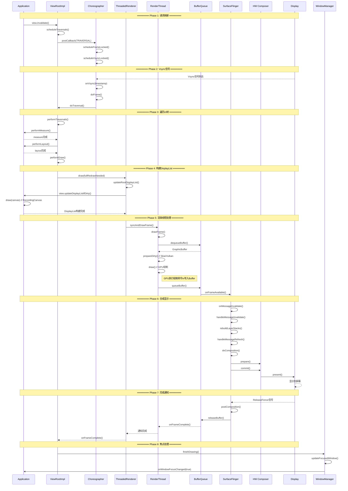

# AOSP16 View渲染到显示完整流程详解

[toc]

## 一、整体架构图

```
┌─────────────────────────────────────────────────────────────────┐
│                         Application Process                     │
│  ┌──────────────┐    ┌──────────────┐    ┌─────────────────┐    │
│  │   Activity   │───▶│     View     │───▶│  ViewRootImpl   │    │
│  └──────────────┘    └──────────────┘    └────────┬────────┘    │
│                                                   │             │
│  ┌──────────────────────────────────────────────┐ │             │
│  │           Choreographer                      │ │             │
│  │  ┌────────────┐  ┌──────────────────────┐    │ │             │
│  │  │ FrameInfo  │  │ CallbackQueue        │  ◀─┘               │
│  │  └────────────┘  └──────────────────────┘    │               │
│  └────────────┬─────────────────────────────────┘               │
│               │ Vsync Signal                                    │
│  ┌────────────▼─────────────────────────────────────────────┐   │
│  │              ThreadedRenderer (HwuiContext)              │   │
│  │  ┌──────────────┐  ┌──────────────────────────────────┐  │   │
│  │  │ RenderProxy  │─▶│ CanvasContext (DisplayList构建)  │  │   │
│  │  └──────────────┘  └──────────────────────────────────┘  │   │
│  └────────────────────────────┬─────────────────────────────┘   │
└────────────────────────────────┼─────────────────────────────────┘
                                 │ Socket/Binder
┌────────────────────────────────▼─────────────────────────────────┐
│                  RenderThread Process (Native)                   │
│  ┌─────────────────────────────────────────────────────────────┐ │
│  │        RenderThread (CanvasContext)                         │ │
│  │  ┌────────────┐  ┌──────────────┐  ┌─────────────────────┐  │ │
│  │  │ DrawFrame  │─▶│ Skia/Vulkan  │─▶│ BufferQueueProducer │  │ │
│  │  └────────────┘  └──────────────┘  └─────────┬───────────┘  │ │
│  └──────────────────────────────────────────────┼──────────────┘ │
└─────────────────────────────────────────────────┼────────────────┘
                                                  │ Gralloc Buffer
┌─────────────────────────────────────────────────▼────────────────┐
│                    SurfaceFlinger Process                        │
│  ┌─────────────────────────────────────────────────────────────┐ │
│  │  BufferQueueConsumer  ◀──▶  BufferQueueProducer             │ │
│  └─────────────────────────────────────────────────────────────┘ │
│                                                                  │
│  ┌─────────────────────────────────────────────────────────────┐ │
│  │           CompositionEngine                                │ │
│  │  ┌──────────┐  ┌────────────┐  ┌─────────────────────────┐  │ │
│  │  │  Layer   │  │  HWComposer│  │  RenderEngine (GPU合成) │  │ │
│  │  └──────────┘  └────────────┘  └─────────────────────────┘  │ │
│  └─────────────────────────────────────────────────────────────┘ │
└─────────────────────────────────────┬─────────────────────────────┘
                                      │
┌─────────────────────────────────────▼─────────────────────────────┐
│                  Hardware Layer                                   │
│  ┌──────────┐  ┌──────────┐  ┌──────────────────────────────────┐ │
│  │   GPU    │  │   DPU    │  │  Display Hardware (Panel)       │ │
│  └──────────┘  └──────────┘  └──────────────────────────────────┘ │
└───────────────────────────────────────────────────────────────────┘
```

## 二、详细流程时序图



## 三、详细流程分解

### 阶段1：View刷新请求

**java**

```java
// 1. Activity/View层发起刷新
public class View {
    public void invalidate() {
        // 标记View需要重绘
        mPrivateFlags |= PFLAG_DIRTY;
        
        if (mParent != null) {
            // 向上传递刷新请求
            mParent.invalidateChild(this, null);
        }
    }
}

// 2. ViewRootImpl接收请求
public final class ViewRootImpl implements ViewParent {
    void invalidateChild(View child, Rect dirty) {
        invalidateChildInParent(null, null);
    }
    
    public ViewParent invalidateChildInParent(int[] location, Rect dirty) {
        checkThread(); // 必须在UI线程
        
        if (!mWillDrawSoon) {
            scheduleTraversals();
        }
        return null;
    }
    
    void scheduleTraversals() {
        if (!mTraversalScheduled) {
            mTraversalScheduled = true;
            
            // 同步屏障，优先处理绘制消息
            mTraversalBarrier = mHandler.getLooper().getQueue()
                .postSyncBarrier();
            
            // 注册Vsync回调
            mChoreographer.postCallback(
                Choreographer.CALLBACK_TRAVERSAL,
                mTraversalRunnable, null);
        }
    }
}
```

### 阶段2：Vsync信号处理

**java**

```java
// Choreographer处理Vsync
public final class Choreographer {
    private void doFrame(long frameTimeNanos, int frame) {
        try {
            // 按优先级执行回调
            doCallbacks(Choreographer.CALLBACK_INPUT, frameTimeNanos);
            doCallbacks(Choreographer.CALLBACK_ANIMATION, frameTimeNanos);
            doCallbacks(Choreographer.CALLBACK_INSETS_ANIMATION, frameTimeNanos);
            doCallbacks(Choreographer.CALLBACK_TRAVERSAL, frameTimeNanos);
        } finally {
            // 清理同步屏障
            if (mTraversalBarrier != 0) {
                mHandler.getLooper().getQueue()
                    .removeSyncBarrier(mTraversalBarrier);
                mTraversalBarrier = 0;
            }
        }
    }
}
```

Vsync

```
Vsync-0    Vsync-1    Vsync-2    Vsync-3
   │          │          │          │
   ▼          ▼          ▼          ▼
┌─────┐    ┌─────┐    ┌─────┐    ┌─────┐
│Frame│    │Frame│    │Frame│    │Frame│
│  0  │    │  1  │    │  2  │    │  3  │
└─────┘    └─────┘    └─────┘    └─────┘
   │          │          │
   ├─Input    ├─Input    ├─Input
   ├─Anim     ├─Anim     ├─Anim
   ├─Traverse ├─Traverse ├─Traverse
   └─Commit   └─Commit   └─Commit
```


### 阶段3：测量、布局、绘制

**java**

```java
// ViewRootImpl执行遍历
private void performTraversals() {
    // 1. 测量
    if (layoutRequested) {
        performMeasure(childWidthMeasureSpec, childHeightMeasureSpec);
        // View.measure() → onMeasure()
    }
    
    // 2. 布局
    if (layoutRequested) {
        performLayout(lp, desiredWindowWidth, desiredWindowHeight);
        // View.layout() → onLayout()
    }
    
    // 3. 绘制
    if (!cancelDraw && !newSurface) {
        performDraw();
    }
}

private void performDraw() {
    if (mAttachInfo.mThreadedRenderer != null) {
        // 硬件加速绘制
        mAttachInfo.mThreadedRenderer.draw(mView, mAttachInfo, this);
    } else {
        // 软件绘制
        drawSoftware(surface, mAttachInfo, xOffset, yOffset);
    }
}
```

## 四、关键组件详细说明

### 1. **Choreographer** - Vsync协调器

**功能**：协调Vsync信号与UI更新，确保渲染节奏一致

**java**

```java
public final class Choreographer {
    // 注册回调
    public void postCallback(int callbackType, Runnable action, Object token) {
        postCallbackDelayed(callbackType, action, token, 0);
    }
    
    // Vsync回调
    void doFrame(long frameTimeNanos, int frame) {
        // 执行所有注册的回调
        mFrameInfo.markInputHandlingStart();
        doCallbacks(CALLBACK_INPUT, frameTimeNanos);
        
        mFrameInfo.markAnimationsStart();
        doCallbacks(CALLBACK_ANIMATION, frameTimeNanos);
        
        mFrameInfo.markPerformTraversalsStart();
        doCallbacks(CALLBACK_TRAVERSAL, frameTimeNanos);
    }
}
```

### 2. **ThreadedRenderer** - 硬件加速渲染

**功能**：管理硬件加速渲染，构建DisplayList树

**java**

```java
public class ThreadedRenderer {
    void draw(View view, AttachInfo attachInfo, DrawCallbacks callbacks) {
        // 更新根DisplayList
        updateRootDisplayList(view, callbacks);
        
        // 同步并绘制帧
        int syncResult = syncAndDrawFrame(mFrameInfo);
        
        if ((syncResult & SYNC_LOST_SURFACE_REWARD_IF_FOUND) != 0) {
            // 处理Surface丢失
            setEnabled(false);
        }
    }
    
    private void updateRootDisplayList(View view, DrawCallbacks callbacks) {
        // 构建DisplayList树
        updateViewTreeDisplayList(view);
        
        if (mRootNodeNeedsUpdate || !mRootNode.isValid()) {
            // 更新根RenderNode
            RecordingCanvas canvas = mRootNode.beginRecording(mSurfaceWidth, mSurfaceHeight);
            try {
                // 记录绘制命令
                canvas.drawRenderNode(view.updateDisplayListIfDirty());
            } finally {
                mRootNode.endRecording();
            }
        }
    }
}
```

**DisplayList机制**：

```
View树                DisplayList树           Native RenderNode
┌──────┐              ┌──────────┐           ┌────────────┐
│ Root │   记录命令    │   Root   │   转换    │  RootNode  │
│ View │  ═════════▶  │  RDList  │ ═══════▶  │  (Native)  │
└──┬───┘              └────┬─────┘           └─────┬──────┘
   │                       │                        │
   ├─View A               ├─RDList A               ├─Node A
   ├─View B               ├─RDList B               ├─Node B
   └─View C               └─RDList C               └─Node C
```


### 3. **RenderThread** - 独立渲染线程

**功能**：在独立线程中执行GPU绘制，避免阻塞UI线程

**cpp**

```cpp
// frameworks/base/libs/hwui/renderthread/RenderThread.cpp
class RenderThread {
    void drawFrame() {
        // 1. 准备阶段
        context->prepareTree(frameInfo);
        
        // 2. 获取Buffer
        SkiaSurface* surface = context->getFrame();
        
        // 3. GPU绘制
        SkiaGpuPipeline::draw(
            canvas, 
            rootRenderNode, 
            frameInfo
        );
        
        // 4. 提交Buffer
        context->swapBuffers(frameInfo);
    }
}
```

### 4. **BufferQueue** - 图形缓冲区管理

**功能**：管理图形缓冲区的生产者-消费者模型

**cpp**

```cpp
// frameworks/native/libs/gui/BufferQueue.cpp
class BufferQueue {
    // 生产者获取Buffer
    status_t dequeueBuffer(int* outSlot, sp<Fence>* outFence) {
        // 等待空闲Buffer
        while (freeBuffers.empty() && !mCore->mIsAbandoned) {
            mCore->mDequeueCondition.wait(lock);
        }
        
        // 分配或返回Buffer
        *outSlot = freeBuffers.front();
        return OK;
    }
    
    // 生产者提交Buffer
    status_t queueBuffer(int slot, const QueueBufferInput& input) {
        // 移动到已填充队列
        mCore->mQueue.push_back(item);
        
        // 通知消费者
        mCore->mConsumerListener->onFrameAvailable(item);
        return OK;
    }
}
```

**BufferQueue状态机**：

```
┌─────────────┐  dequeue   ┌─────────────┐  queue    ┌─────────────┐
│    FREE     │ ════════▶  │   DEQUEUED  │ ═══════▶  │   QUEUED    │
│   (空闲)    │            │  (绘制中)   │           │  (待合成)   │
└─────────────┘            └─────────────┘           └──────┬──────┘
      ▲                                                      │
      │                                                      │ acquire
      │                                                      ▼
      │                    ┌─────────────┐            ┌─────────────┐
      └════════════════════│  RELEASED   │ ◀═════════ │  ACQUIRED   │
           release         │  (释放)     │  release   │  (合成中)   │
                          └─────────────┘            └─────────────┘
```

### 5. **SurfaceFlinger** - 系统合成器

**功能**：管理系统所有Layer的合成和显示

**cpp**

```cpp
// frameworks/native/services/surfaceflinger/SurfaceFlinger.cpp
void SurfaceFlinger::onMessageInvalidate(nsecs_t expectedVSyncTime) {
    // 1. 更新Layer状态
    mDrawingState = mCurrentState;
    
    // 2. 处理Layer变更
    for (auto& layer : mLayersWithQueuedFrames) {
        if (layer->latchBuffer(expectedVSyncTime)) {
            mLayersWithQueuedFrames.push(layer);
        }
    }
    
    // 3. 准备合成
    rebuildLayerStacks();
    calculateWorkingSet();
}

void SurfaceFlinger::onMessageRefresh() {
    // 执行合成
    for (const auto& display : mDisplays) {
        composeSurfaces(display);
    }
    
    // 提交到显示设备
    postComposition();
}

void SurfaceFlinger::composeSurfaces(const sp<DisplayDevice>& display) {
    // 优先使用硬件合成
    if (hwcHasClientComposition) {
        // GPU合成
        renderEngine->drawLayers(...);
    }
    
    // HWC合成
    display->presentAndGetFrameFences();
}
```

**SurfaceFlinger合成策略**：

```
┌─────────────────────────────────────────┐
│         Layer Stack (Z-Order)           │
├─────────────────────────────────────────┤
│  Layer 4 (StatusBar)    ◀── HWC合成    │
│  Layer 3 (App Window)   ◀── HWC合成    │
│  Layer 2 (Wallpaper)    ◀── GPU合成    │
│  Layer 1 (Navigation)   ◀── HWC合成    │
│  Layer 0 (Background)   ◀── HWC合成    │
└─────────────────────────────────────────┘
            │
            ▼
     ┌─────────────┐
     │ FrameBuffer │
     └─────────────┘
            │
            ▼
        Display
```

### 6. **焦点处理流程**

**功能**：窗口绘制完成后更新焦点状态

**java**

```java
// frameworks/base/services/core/java/com/android/server/wm/WindowManagerService.java
class WindowManagerService {
    
    void finishDrawingWindow(Session session, IWindow client) {
        WindowState win = windowForClientLocked(session, client);
        if (win != null && win.finishDrawingLocked()) {
            // 如果是新窗口首次绘制完成
            if (win.mActivityRecord != null) {
                win.mActivityRecord.onFirstWindowDrawn();
            }
            
            // 更新焦点
            mInputManager.updateFocusedWindowLocked(UPDATE_FOCUS_NORMAL);
        }
    }
    
    void updateFocusedWindowLocked(int mode) {
        WindowState newFocus = computeFocusedWindow();
        if (mCurrentFocus != newFocus) {
            // 通知InputDispatcher更新焦点
            mInputManager.setInputWindows(...);
            
            // 通知应用焦点变化
            if (newFocus != null) {
                newFocus.mClient.windowFocusChanged(true);
            }
        }
    }
}
```

## 五、性能优化关键时间节点

```
完整帧时间预算 (60fps = 16.67ms)
═════════════════════════════════════════════════════════

Vsync                                            Vsync+1
  │                                                 │
  ▼                                                 ▼
┌────┬──────┬──────┬─────────┬────────┬──────────┬────┐
│Input│Anim │Trav. │ Render  │  GPU   │ Compose  │Disp│
│     │     │      │ Thread  │        │  (SF)    │    │
└────┴──────┴──────┴─────────┴────────┴──────────┴────┘
 0.5ms 1ms   3ms     2ms       6ms       3ms      1ms

详细分解：
├─ 0-0.5ms:    Input处理 (触摸事件)
├─ 0.5-1.5ms:  Animation (属性动画)
├─ 1.5-4.5ms:  Traversal (Measure+Layout+Record)
│   ├─ 1ms: Measure
│   ├─ 1ms: Layout  
│   └─ 1ms: Draw (RecordingCanvas)
├─ 4.5-6.5ms:  RenderThread (构建GPU命令)
├─ 6.5-12.5ms: GPU绘制
├─ 12.5-15.5ms: SurfaceFlinger合成
└─ 15.5-16.5ms: Display刷新

⚠️  掉帧风险点：
1. UI Thread > 4ms → 挤压RenderThread时间
2. GPU绘制 > 8ms → 跨越到下一个Vsync
3. 总时间 > 16.67ms → Jank (掉帧)
```

## 六、关键优化点

### 1. **减少过度绘制**

**java**

```java
// 使用硬件层缓存
view.setLayerType(View.LAYER_TYPE_HARDWARE, null);

// 使用clipRect减少绘制区域
@Override
protected void onDraw(Canvas canvas) {
    canvas.clipRect(dirtyRect);
    super.onDraw(canvas);
}
```

### 2. **优化DisplayList更新**

**java**

```java
// 只更新变化的部分
view.setHasTransientState(true); // 防止被回收
view.invalidate(dirtyRect); // 局部刷新
```

### 3. **使用RenderEffect (Android 12+)**

**java**

```java
// 使用RenderNode缓存
RenderNode renderNode = new RenderNode("myNode");
renderNode.setRenderEffect(RenderEffect.createBlurEffect(...));
```

### 4. **减少BufferQueue等待**

**java**

```java
// 设置合适的Buffer数量
surface.setBufferCount(3); // 三缓冲
```

## 七、总结

整个流程的关键链路：

1. **请求刷新** → Choreographer调度
2. **Vsync驱动** → 统一渲染节奏
3. **三段遍历** → Measure/Layout/Draw
4. **DisplayList** → GPU命令记录
5. **RenderThread** → 异步GPU绘制
6. **BufferQueue** → 生产者消费者模型
7. **SurfaceFlinger** → 系统级合成
8. **HWC/Display** → 硬件显示

每一帧都是这些环节的精密协作，任何一个环节超时都会导致掉帧。Android 16在此基础上进行了诸多优化，包括：

- 更智能的Vsync预测
- 更高效的GPU命令提交
- 更快的Layer合成
- 更精准的焦点调度

通过理解整个渲染流程，开发者可以更好地优化应用性能，避免掉帧和卡顿问题。