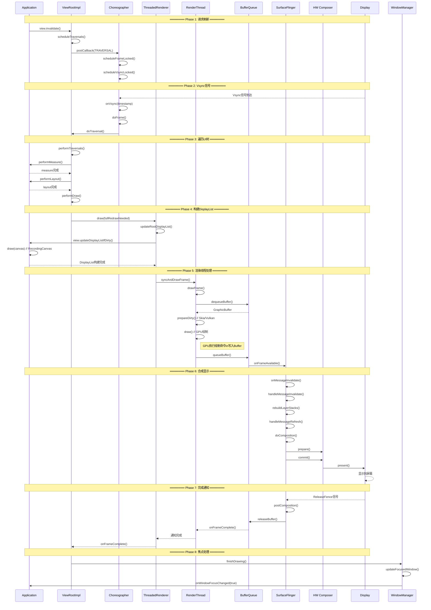
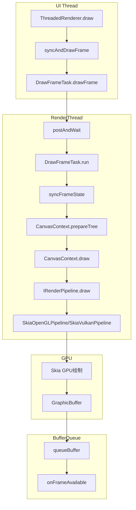
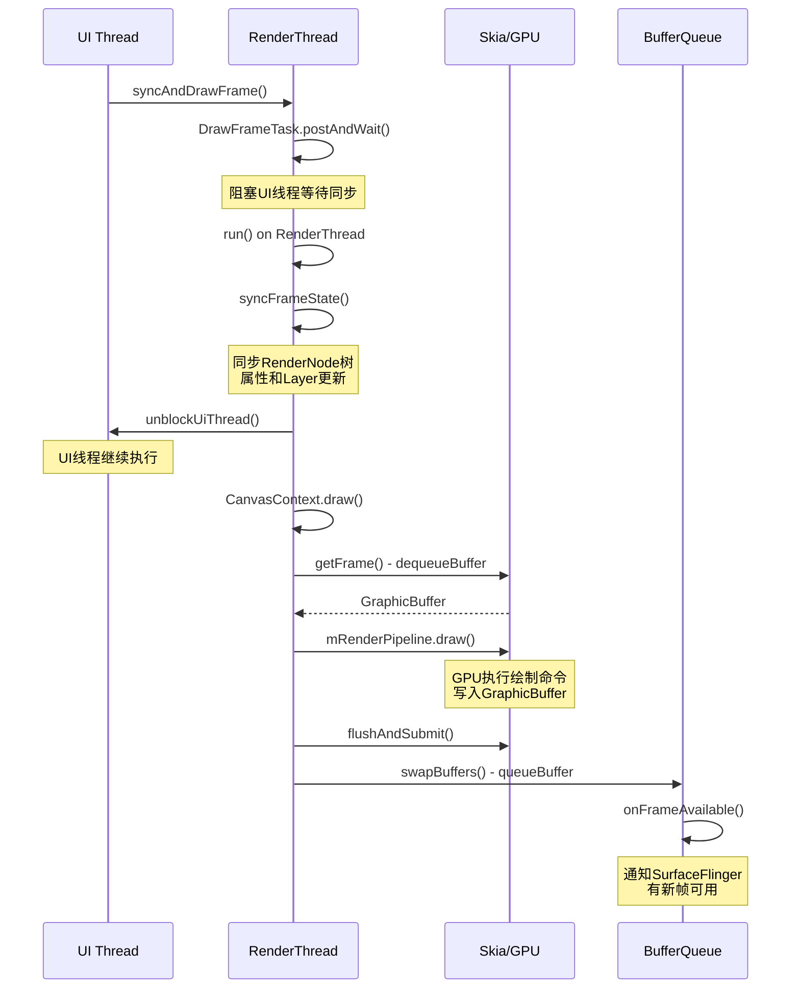
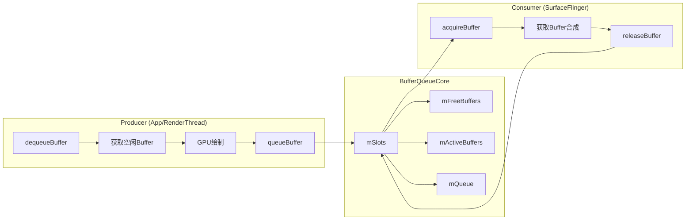
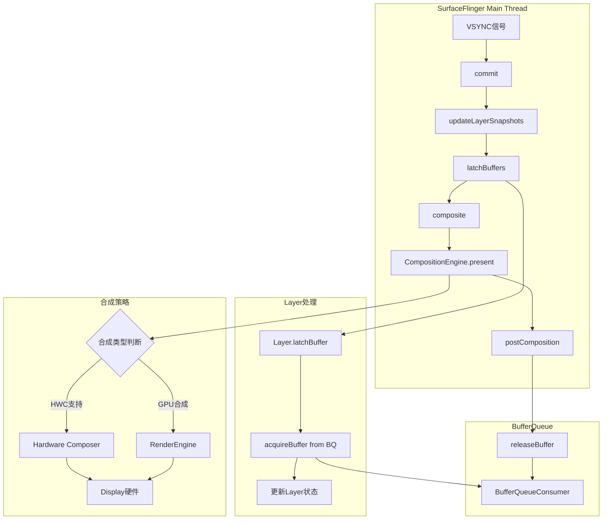
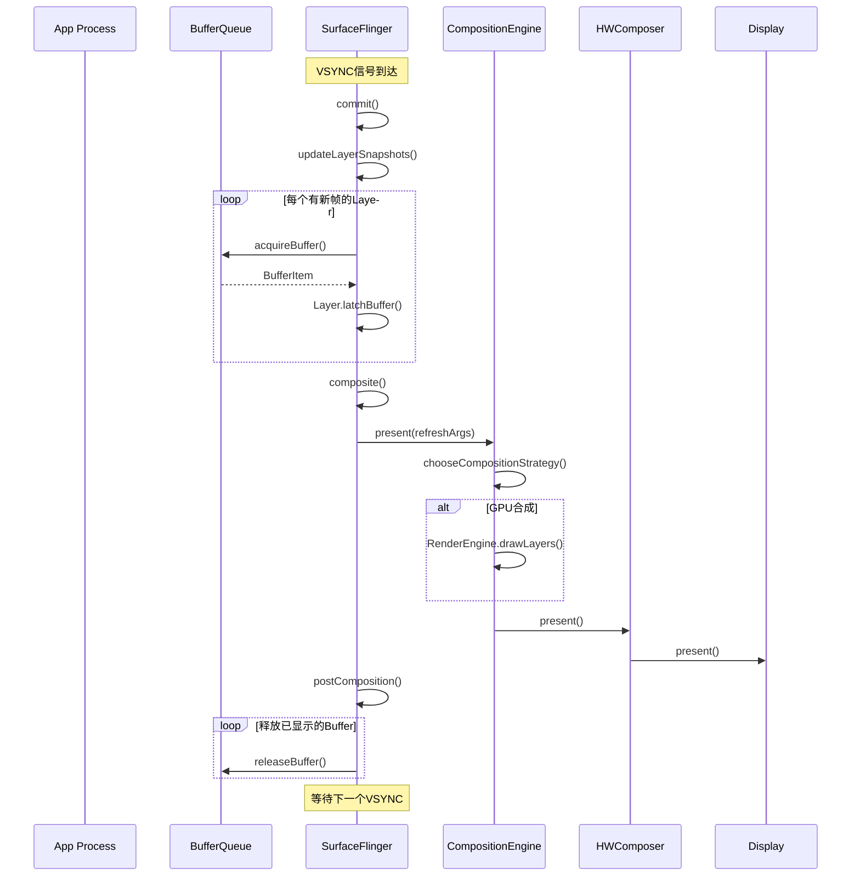

# AOSP16 View渲染到显示完整流程详解

[toc]

## 一、整体架构图

```
┌─────────────────────────────────────────────────────────────────┐
│                         Application Process                     │
│  ┌──────────────┐    ┌──────────────┐    ┌─────────────────┐    │
│  │   Activity   │───▶│     View     │───▶│  ViewRootImpl   │    │
│  └──────────────┘    └──────────────┘    └────────┬────────┘    │
│                                                   │             │
│  ┌──────────────────────────────────────────────┐ │             │
│  │           Choreographer                      │ │             │
│  │  ┌────────────┐  ┌──────────────────────┐    │ │             │
│  │  │ FrameInfo  │  │ CallbackQueue        │  ◀─┘               │
│  │  └────────────┘  └──────────────────────┘    │               │
│  └────────────┬─────────────────────────────────┘               │
│               │ Vsync Signal                                    │
│  ┌────────────▼─────────────────────────────────────────────┐   │
│  │              ThreadedRenderer (HwuiContext)              │   │
│  │  ┌──────────────┐  ┌──────────────────────────────────┐  │   │
│  │  │ RenderProxy  │─▶│ CanvasContext (DisplayList构建)  │  │   │
│  │  └──────────────┘  └──────────────────────────────────┘  │   │
│  └────────────────────────────┬─────────────────────────────┘   │
└────────────────────────────────┼─────────────────────────────────┘
                                 │ Socket/Binder
┌────────────────────────────────▼─────────────────────────────────┐
│                  RenderThread Process (Native)                   │
│  ┌─────────────────────────────────────────────────────────────┐ │
│  │        RenderThread (CanvasContext)                         │ │
│  │  ┌────────────┐  ┌──────────────┐  ┌─────────────────────┐  │ │
│  │  │ DrawFrame  │─▶│ Skia/Vulkan  │─▶│ BufferQueueProducer │  │ │
│  │  └────────────┘  └──────────────┘  └─────────┬───────────┘  │ │
│  └──────────────────────────────────────────────┼──────────────┘ │
└─────────────────────────────────────────────────┼────────────────┘
                                                  │ Gralloc Buffer
┌─────────────────────────────────────────────────▼────────────────┐
│                    SurfaceFlinger Process                        │
│  ┌─────────────────────────────────────────────────────────────┐ │
│  │  BufferQueueConsumer  ◀──▶  BufferQueueProducer             │ │
│  └─────────────────────────────────────────────────────────────┘ │
│                                                                  │
│  ┌─────────────────────────────────────────────────────────────┐ │
│  │           CompositionEngine                                │ │
│  │  ┌──────────┐  ┌────────────┐  ┌─────────────────────────┐  │ │
│  │  │  Layer   │  │  HWComposer│  │  RenderEngine (GPU合成) │  │ │
│  │  └──────────┘  └────────────┘  └─────────────────────────┘  │ │
│  └─────────────────────────────────────────────────────────────┘ │
└─────────────────────────────────────┬─────────────────────────────┘
                                      │
┌─────────────────────────────────────▼─────────────────────────────┐
│                  Hardware Layer                                   │
│  ┌──────────┐  ┌──────────┐  ┌──────────────────────────────────┐ │
│  │   GPU    │  │   DPU    │  │  Display Hardware (Panel)       │ │
│  └──────────┘  └──────────┘  └──────────────────────────────────┘ │
└───────────────────────────────────────────────────────────────────┘
```

## 二、详细流程时序图



## 三、详细流程分解

### 阶段1：View刷新请求

> **源码参考**：
> - View刷新：[View.java](file:///Users/yuchuan/CodeMX/MX/AOSP_Frameworks/base/core/java/android/view/View.java)
> - ViewRootImpl调度：[ViewRootImpl.java:3085](file:///Users/yuchuan/CodeMX/MX/AOSP_Frameworks/base/core/java/android/view/ViewRootImpl.java#L3085)

```java
// 1. Activity/View层发起刷新
public class View {
    public void invalidate() {
        // 标记View需要重绘
        mPrivateFlags |= PFLAG_DIRTY;
        
        if (mParent != null) {
            // 向上传递刷新请求
            mParent.invalidateChild(this, null);
        }
    }
}

// 2. ViewRootImpl接收请求
public final class ViewRootImpl implements ViewParent {
    void invalidateChild(View child, Rect dirty) {
        invalidateChildInParent(null, null);
    }
    
    public ViewParent invalidateChildInParent(int[] location, Rect dirty) {
        checkThread(); // 必须在UI线程
        
        if (!mWillDrawSoon) {
            scheduleTraversals();
        }
        return null;
    }
    
    void scheduleTraversals() {
        if (!mTraversalScheduled) {
            mTraversalScheduled = true;
            
            // 同步屏障，优先处理绘制消息
            mTraversalBarrier = mHandler.getLooper().getQueue()
                .postSyncBarrier();
            
            // 注册Vsync回调
            mChoreographer.postCallback(
                Choreographer.CALLBACK_TRAVERSAL,
                mTraversalRunnable, null);
        }
    }
}
```

### 阶段2：Vsync信号处理

> **源码参考**：[Choreographer.java:1021](file:///Users/yuchuan/CodeMX/MX/AOSP_Frameworks/base/core/java/android/view/Choreographer.java#L1021)

```java
// Choreographer处理Vsync
public final class Choreographer {
    void doFrame(long frameTimeNanos, int frame,
            DisplayEventReceiver.VsyncEventData vsyncEventData) {
        // ... 省略jitter计算和帧时间调整 ...
        
        AnimationUtils.lockAnimationClock(frameTimeNanos / TimeUtils.NANOS_PER_MS,
                timeline.mExpectedPresentationTimeNanos);

        mFrameInfo.markInputHandlingStart();
        doCallbacks(Choreographer.CALLBACK_INPUT, frameIntervalNanos);

        mFrameInfo.markAnimationsStart();
        doCallbacks(Choreographer.CALLBACK_ANIMATION, frameIntervalNanos);
        doCallbacks(Choreographer.CALLBACK_INSETS_ANIMATION, frameIntervalNanos);

        mFrameInfo.markPerformTraversalsStart();
        doCallbacks(Choreographer.CALLBACK_TRAVERSAL, frameIntervalNanos);

        doCallbacks(Choreographer.CALLBACK_COMMIT, frameIntervalNanos);
    }
}
```

Vsync

```
Vsync-0    Vsync-1    Vsync-2    Vsync-3
   │          │          │          │
   ▼          ▼          ▼          ▼
┌─────┐    ┌─────┐    ┌─────┐    ┌─────┐
│Frame│    │Frame│    │Frame│    │Frame│
│  0  │    │  1  │    │  2  │    │  3  │
└─────┘    └─────┘    └─────┘    └─────┘
   │          │          │
   ├─Input    ├─Input    ├─Input
   ├─Anim     ├─Anim     ├─Anim
   ├─Traverse ├─Traverse ├─Traverse
   └─Commit   └─Commit   └─Commit
```


### 阶段3：测量、布局、绘制

> **源码参考**：[ViewRootImpl.java](file:///Users/yuchuan/CodeMX/MX/AOSP_Frameworks/base/core/java/android/view/ViewRootImpl.java)

```java
// ViewRootImpl执行遍历
private void performTraversals() {
    // 1. 测量
    if (layoutRequested) {
        performMeasure(childWidthMeasureSpec, childHeightMeasureSpec);
        // View.measure() → onMeasure()
    }
    
    // 2. 布局
    if (layoutRequested) {
        performLayout(lp, desiredWindowWidth, desiredWindowHeight);
        // View.layout() → onLayout()
    }
    
    // 3. 绘制
    if (!cancelDraw && !newSurface) {
        performDraw();
    }
}

private void performDraw() {
    if (mAttachInfo.mThreadedRenderer != null) {
        // 硬件加速绘制
        mAttachInfo.mThreadedRenderer.draw(mView, mAttachInfo, this);
    } else {
        // 软件绘制
        drawSoftware(surface, mAttachInfo, xOffset, yOffset);
    }
}
```

## 四、关键组件详细说明

### 1. **Choreographer** - Vsync协调器

**功能**：协调Vsync信号与UI更新，确保渲染节奏一致

> **源码参考**：[Choreographer.java](file:///Users/yuchuan/CodeMX/MX/AOSP_Frameworks/base/core/java/android/view/Choreographer.java)

```java
public final class Choreographer {
    // 注册回调
    public void postCallback(int callbackType, Runnable action, Object token) {
        postCallbackDelayed(callbackType, action, token, 0);
    }
    
    // Vsync回调
    void doFrame(long frameTimeNanos, int frame) {
        // 执行所有注册的回调
        mFrameInfo.markInputHandlingStart();
        doCallbacks(CALLBACK_INPUT, frameTimeNanos);
        
        mFrameInfo.markAnimationsStart();
        doCallbacks(CALLBACK_ANIMATION, frameTimeNanos);
        
        mFrameInfo.markPerformTraversalsStart();
        doCallbacks(CALLBACK_TRAVERSAL, frameTimeNanos);
    }
}
```

### 2. **ThreadedRenderer** - 硬件加速渲染

**功能**：管理硬件加速渲染，构建DisplayList树

> **源码参考**：[ThreadedRenderer.java:828](file:///Users/yuchuan/CodeMX/MX/AOSP_Frameworks/base/core/java/android/view/ThreadedRenderer.java#L828)

```java
public class ThreadedRenderer {
    void draw(View view, AttachInfo attachInfo, DrawCallbacks callbacks) {
        // 更新根DisplayList
        updateRootDisplayList(view, callbacks);
        
        // 同步并绘制帧
        int syncResult = syncAndDrawFrame(mFrameInfo);
        
        if ((syncResult & SYNC_LOST_SURFACE_REWARD_IF_FOUND) != 0) {
            // 处理Surface丢失
            setEnabled(false);
        }
    }
    
    private void updateRootDisplayList(View view, DrawCallbacks callbacks) {
        // 构建DisplayList树
        updateViewTreeDisplayList(view);
        
        if (mRootNodeNeedsUpdate || !mRootNode.isValid()) {
            // 更新根RenderNode
            RecordingCanvas canvas = mRootNode.beginRecording(mSurfaceWidth, mSurfaceHeight);
            try {
                // 记录绘制命令
                canvas.drawRenderNode(view.updateDisplayListIfDirty());
            } finally {
                mRootNode.endRecording();
            }
        }
    }
}
```

**DisplayList机制**：

```
View树                DisplayList树           Native RenderNode
┌──────┐              ┌──────────┐           ┌────────────┐
│ Root │   记录命令    │   Root   │   转换    │  RootNode  │
│ View │  ═════════▶  │  RDList  │ ═══════▶  │  (Native)  │
└──┬───┘              └────┬─────┘           └─────┬──────┘
   │                       │                        │
   ├─View A               ├─RDList A               ├─Node A
   ├─View B               ├─RDList B               ├─Node B
   └─View C               └─RDList C               └─Node C
```


### 3. **RenderThread** - 独立渲染线程

**功能**：在独立线程中执行GPU绘制，避免阻塞UI线程

> **源码参考**：
> - [RenderThread.cpp](file:///Users/yuchuan/CodeMX/MX/AOSP_Frameworks/base/libs/hwui/renderthread/RenderThread.cpp)
> - [CanvasContext.cpp](file:///Users/yuchuan/CodeMX/MX/AOSP_Frameworks/base/libs/hwui/renderthread/CanvasContext.cpp)
> - [DrawFrameTask.cpp](file:///Users/yuchuan/CodeMX/MX/AOSP_Frameworks/base/libs/hwui/renderthread/DrawFrameTask.cpp)

#### 3.1 RenderThread架构概览



#### 3.2 DrawFrameTask绘制帧流程

**核心代码位置**：[DrawFrameTask.cpp:68-170](file:///Users/yuchuan/CodeMX/MX/AOSP_Frameworks/base/libs/hwui/renderthread/DrawFrameTask.cpp#L68)

```cpp
// DrawFrameTask::run() - RenderThread上的主要绘制入口
void DrawFrameTask::run() {
    const int64_t vsyncId = mFrameInfo[static_cast<int>(FrameInfoIndex::FrameTimelineVsyncId)];
    ATRACE_FORMAT("DrawFrames %" PRId64, vsyncId);

    mContext->setSyncDelayDuration(systemTime(SYSTEM_TIME_MONOTONIC) - mSyncQueued);
    
    IRenderPipeline* pipeline = mContext->getRenderPipeline();
    bool canUnblockUiThread;
    bool canDrawThisFrame;
    bool solelyTextureViewUpdates;
    
    {
        // 1. 同步帧状态 - 同步UI线程的RenderNode树
        TreeInfo info(TreeInfo::MODE_FULL, *mContext);
        info.forceDrawFrame = mForceDrawFrame;
        canUnblockUiThread = syncFrameState(info);
        canDrawThisFrame = !info.out.skippedFrameReason.has_value();
        solelyTextureViewUpdates = info.out.solelyTextureViewUpdates;
    }

    // 2. 尽早解除UI线程阻塞
    if (canUnblockUiThread) {
        unblockUiThread();
    }

    // 3. 执行绘制
    if (CC_LIKELY(canDrawThisFrame)) {
        context->draw(solelyTextureViewUpdates);
    } else {
        // 跳过绘制时刷新GPU命令
        if (GrDirectContext* grContext = mRenderThread->getGrContext()) {
            grContext->flushAndSubmit();
        }
        context->waitOnFences();
    }
}
```

#### 3.3 CanvasContext.draw() 绘制实现

**核心代码位置**：[CanvasContext.cpp:604-750](file:///Users/yuchuan/CodeMX/MX/AOSP_Frameworks/base/libs/hwui/renderthread/CanvasContext.cpp#L604)

```cpp
void CanvasContext::draw(bool solelyTextureViewUpdates) {
    SkRect dirty;
    mDamageAccumulator.finish(&dirty);

    // 1. 检查是否需要跳过绘制
    const auto skippedFrameReason = [&]() -> std::optional<SkippedFrameReason> {
        if (!Properties::isDrawingEnabled()) {
            return SkippedFrameReason::DrawingOff;
        }
        if (dirty.isEmpty() && Properties::skipEmptyFrames && !surfaceRequiresRedraw()) {
            return SkippedFrameReason::NothingToDraw;
        }
        return std::nullopt;
    }();
    
    if (skippedFrameReason) {
        mCurrentFrameInfo->setSkippedFrameReason(*skippedFrameReason);
        waitOnFences();
        return;
    }

    mCurrentFrameInfo->markIssueDrawCommandsStart();

    // 2. 获取帧缓冲区
    Frame frame = getFrame();
    SkRect windowDirty = computeDirtyRect(frame, &dirty);

    // 3. 执行GPU绘制 - 调用Skia Pipeline
    IRenderPipeline::DrawResult drawResult;
    {
        drawResult = mRenderPipeline->draw(
                frame, windowDirty, dirty, mLightGeometry, &mLayerUpdateQueue, 
                mContentDrawBounds, mOpaque, mLightInfo, mRenderNodes, 
                &(profiler()), mBufferParams, profilerLock());
    }

    // 4. 等待前一帧完成
    waitOnFences();

    // 5. 设置帧时间线信息并提交
    if (mNativeSurface) {
        const auto vsyncId = mCurrentFrameInfo->get(FrameInfoIndex::FrameTimelineVsyncId);
        const ANativeWindowFrameTimelineInfo ftl = {
                .frameNumber = frameCompleteNr,
                .frameTimelineVsyncId = vsyncId,
        };
        mNativeSurface->setFrameTimelineInfo(ftl);
    }

    // 6. 交换缓冲区 - 提交到BufferQueue
    bool didSwap = mRenderPipeline->swapBuffers(frame, drawResult, windowDirty);
}
```

#### 3.4 RenderPipeline绘制流程

**SkiaOpenGLPipeline.draw()** 核心实现：

```cpp
// pipeline/skia/SkiaOpenGLPipeline.cpp
IRenderPipeline::DrawResult SkiaOpenGLPipeline::draw(
        const Frame& frame, const SkRect& dirty, ...) {
    
    // 1. 获取Skia Surface
    SkCanvas* canvas = tryRender(frame, dirty);
    
    // 2. 绘制RenderNode树
    if (canvas) {
        // 设置裁剪区域
        canvas->clipRect(dirty);
        
        // 绘制根RenderNode
        canvas->drawRenderNode(rootRenderNode);
    }
    
    // 3. 刷新GPU命令
    GrDirectContext* grContext = mRenderThread->getGrContext();
    grContext->flushAndSubmit();
    
    return DrawResult::kDrew;
}
```

#### 3.5 RenderThread时序图



### 4. **BufferQueue** - 图形缓冲区管理

**功能**：管理图形缓冲区的生产者-消费者模型

> **源码参考**：
> - [BufferQueueProducer.cpp](file:///Users/yuchuan/CodeMX/MX/AOSP_Frameworks/native/libs/gui/BufferQueueProducer.cpp)
> - [BufferQueueConsumer.cpp](file:///Users/yuchuan/CodeMX/MX/AOSP_Frameworks/native/libs/gui/BufferQueueConsumer.cpp)
> - [BufferQueueCore.cpp](file:///Users/yuchuan/CodeMX/MX/AOSP_Frameworks/native/libs/gui/BufferQueueCore.cpp)

#### 4.1 BufferQueue架构



#### 4.2 dequeueBuffer - 生产者获取缓冲区

**核心代码位置**：[BufferQueueProducer.cpp:449-650](file:///Users/yuchuan/CodeMX/MX/AOSP_Frameworks/native/libs/gui/BufferQueueProducer.cpp#L449)

```cpp
status_t BufferQueueProducer::dequeueBuffer(int* outSlot, sp<android::Fence>* outFence,
                                            uint32_t width, uint32_t height, PixelFormat format,
                                            uint64_t usage, uint64_t* outBufferAge,
                                            FrameEventHistoryDelta* outTimestamps) {
    ATRACE_CALL();
    
    std::unique_lock<std::mutex> lock(mCore->mMutex);

    // 1. 等待空闲Buffer槽位
    int found = BufferItem::INVALID_BUFFER_SLOT;
    while (found == BufferItem::INVALID_BUFFER_SLOT) {
        status_t status = waitForFreeSlotThenRelock(FreeSlotCaller::Dequeue, lock, &found);
        if (status != NO_ERROR) {
            return status;
        }
    }

    const sp<GraphicBuffer>& buffer(mSlots[found].mGraphicBuffer);

    // 2. 检查是否需要重新分配Buffer
    bool needsReallocation = buffer == nullptr ||
            buffer->needsReallocation(width, height, format, BQ_LAYER_COUNT, usage);

    if (needsReallocation) {
        // 分配新的GraphicBuffer
        sp<GraphicBuffer> graphicBuffer = new GraphicBuffer(
                width, height, format, BQ_LAYER_COUNT, usage, mCore->mUniqueId);
        
        mSlots[found].mGraphicBuffer = graphicBuffer;
    }

    // 3. 返回Buffer槽位和Fence
    *outSlot = found;
    *outFence = mSlots[found].mFence;
    
    return NO_ERROR;
}
```

#### 4.3 queueBuffer - 生产者提交缓冲区

**核心代码位置**：[BufferQueueProducer.cpp:953-1150](file:///Users/yuchuan/CodeMX/MX/AOSP_Frameworks/native/libs/gui/BufferQueueProducer.cpp#L953)

```cpp
status_t BufferQueueProducer::queueBuffer(int slot,
        const QueueBufferInput &input, QueueBufferOutput *output) {
    ATRACE_CALL();
    ATRACE_BUFFER_INDEX(slot);

    std::lock_guard<std::mutex> lock(mCore->mMutex);

    // 1. 解析输入参数
    int64_t requestedPresentTimestamp;
    bool isAutoTimestamp;
    android_dataspace dataSpace;
    Rect crop;
    int scalingMode;
    uint32_t transform;
    sp<Fence> acquireFence;
    input.deflate(&requestedPresentTimestamp, &isAutoTimestamp, &dataSpace,
            &crop, &scalingMode, &transform, &acquireFence, ...);

    // 2. 更新Buffer状态
    mSlots[slot].mFence = acquireFence;
    mSlots[slot].mBufferState.queue();

    // 3. 构建BufferItem
    BufferItem item;
    item.mAcquireCalled = mSlots[slot].mAcquireCalled;
    item.mGraphicBuffer = mSlots[slot].mGraphicBuffer;
    item.mFrameNumber = currentFrameNumber;
    item.mTimestamp = requestedPresentTimestamp;
    item.mDataSpace = dataSpace;
    item.mCrop = crop;
    item.mTransform = transform;
    item.mScalingMode = scalingMode;
    item.mFence = acquireFence;

    // 4. 添加到队列
    mCore->mQueue.push_back(item);
    mCore->mDequeueCondition.notify_all();

    // 5. 通知消费者有新帧可用
    mCore->mConsumerListener->onFrameAvailable(item);
    
    return NO_ERROR;
}
```

#### 4.4 acquireBuffer - 消费者获取缓冲区

**核心代码位置**：[BufferQueueConsumer.cpp:85-250](file:///Users/yuchuan/CodeMX/MX/AOSP_Frameworks/native/libs/gui/BufferQueueConsumer.cpp#L85)

```cpp
status_t BufferQueueConsumer::acquireBuffer(BufferItem* outBuffer,
        nsecs_t expectedPresent, uint64_t maxFrameNumber) {
    ATRACE_CALL();

    std::unique_lock<std::mutex> lock(mCore->mMutex);

    // 1. 检查是否有可用的Buffer
    if (mCore->mQueue.empty()) {
        return NO_BUFFER_AVAILABLE;
    }

    // 2. 获取队列头部的Buffer
    BufferItem& front(mCore->mQueue.front());

    // 3. 检查是否应该丢弃过时的Buffer
    if (expectedPresent != 0) {
        while (mCore->mQueue.size() > 1) {
            const BufferItem& nextBuffer = mCore->mQueue[1];
            // 如果下一个Buffer的期望呈现时间更早，丢弃当前Buffer
            if (nextBuffer.mIsAutoTimestamp && nextBuffer.mTimestamp < expectedPresent) {
                mCore->mQueue.erase(mCore->mQueue.begin());
                front = mCore->mQueue.front();
            } else {
                break;
            }
        }
    }

    // 4. 更新Buffer状态
    int slot = front.mSlot;
    mSlots[slot].mBufferState.acquire();

    // 5. 返回Buffer给消费者
    *outBuffer = front;
    mCore->mQueue.erase(mCore->mQueue.begin());
    
    return NO_ERROR;
}
```

#### 4.5 releaseBuffer - 消费者释放缓冲区

**核心代码位置**：[BufferQueueConsumer.cpp:474-600](file:///Users/yuchuan/CodeMX/MX/AOSP_Frameworks/native/libs/gui/BufferQueueConsumer.cpp#L474)

```cpp
status_t BufferQueueConsumer::releaseBuffer(int slot, uint64_t frameNumber,
        const sp<Fence>& releaseFence, EGLDisplay display, EGLSyncKHR eglFence) {
    ATRACE_CALL();

    std::lock_guard<std::mutex> lock(mCore->mMutex);

    // 1. 更新Buffer状态为FREE
    mSlots[slot].mBufferState.release();
    mSlots[slot].mFence = releaseFence;

    // 2. 添加到空闲队列
    mCore->mFreeBuffers.push_back(slot);
    mCore->mActiveBuffers.erase(slot);

    // 3. 通知生产者有Buffer可用
    mCore->mDequeueCondition.notify_all();
    
    // 4. 回调生产者
    if (mCore->mConnectedProducerListener != nullptr) {
        mCore->mConnectedProducerListener->onBufferReleased();
    }
    
    return NO_ERROR;
}
```

**BufferQueue状态机**：

```
┌─────────────┐  dequeue   ┌─────────────┐  queue    ┌─────────────┐
│    FREE     │ ════════▶  │   DEQUEUED  │ ═══════▶  │   QUEUED    │
│   (空闲)    │            │  (绘制中)   │           │  (待合成)   │
└─────────────┘            └─────────────┘           └──────┬──────┘
      ▲                                                      │
      │                                                      │ acquire
      │                                                      ▼
      │                    ┌─────────────┐            ┌─────────────┐
      └════════════════════│  RELEASED   │ ◀═════════ │  ACQUIRED   │
           release         │  (释放)     │  release   │  (合成中)   │
                          └─────────────┘            └─────────────┘
```

### 5. **SurfaceFlinger** - 系统合成器

**功能**：管理系统所有Layer的合成和显示

> **源码参考**：
> - [SurfaceFlinger.cpp](file:///Users/yuchuan/CodeMX/MX/AOSP_Frameworks/native/services/surfaceflinger/SurfaceFlinger.cpp)
> - [Layer.cpp](file:///Users/yuchuan/CodeMX/MX/AOSP_Frameworks/native/services/surfaceflinger/Layer.cpp)
> - [HWComposer.cpp](file:///Users/yuchuan/CodeMX/MX/AOSP_Frameworks/native/services/surfaceflinger/DisplayHardware/HWComposer.cpp)

#### 5.1 SurfaceFlinger架构概览



#### 5.2 commit阶段 - 事务提交与Layer更新

**核心代码位置**：[SurfaceFlinger.cpp:2845-3000](file:///Users/yuchuan/CodeMX/MX/AOSP_Frameworks/native/services/surfaceflinger/SurfaceFlinger.cpp#L2845)

```cpp
bool SurfaceFlinger::commit(PhysicalDisplayId pacesetterId,
                            const scheduler::FrameTargets& frameTargets) {
    const scheduler::FrameTarget& pacesetterFrameTarget = *frameTargets.get(pacesetterId)->get();
    const VsyncId vsyncId = pacesetterFrameTarget.vsyncId();
    SFTRACE_NAME(ftl::Concat(__func__, ' ', ftl::to_underlying(vsyncId)).c_str());

    // 1. 设置帧时间线信息
    mFrameTimeline->setSfWakeUp(ftl::to_underlying(vsyncId),
                                pacesetterFrameTarget.frameBeginTime().ns(),
                                Fps::fromPeriodNsecs(vsyncPeriod.ns()),
                                mScheduler->getPacesetterRefreshRate());

    // 2. 刷新事务队列
    const bool flushTransactions = clearTransactionFlags(eTransactionFlushNeeded);
    
    // 3. 更新Layer快照 - 核心步骤
    bool mustComposite = updateLayerSnapshots(vsyncId, 
                                              pacesetterFrameTarget.frameBeginTime().ns(),
                                              pacesetterFrameTarget.expectedPresentTime().ns(),
                                              flushTransactions, 
                                              transactionsAreEmpty);

    // 4. 如果有Layer变化，通知VsyncTracker
    if (mustComposite) {
        mScheduler->getVsyncSchedule()
                ->getTracker()
                .onFrameBegin(pacesetterFrameTarget.expectedPresentTime(),
                              pacesetterFrameTarget.lastSignaledFrameTime());
    }

    // 5. 发送事务回调
    if (transactionsAreEmpty) {
        mTransactionCallbackInvoker.sendCallbacks(false /* onCommitOnly */);
    } else {
        mTransactionCallbackInvoker.sendCallbacks(true /* onCommitOnly */);
    }

    return mustComposite;
}
```

#### 5.3 Layer.latchBuffer - 获取新帧

**核心代码位置**：[Layer.cpp:1475-1570](file:///Users/yuchuan/CodeMX/MX/AOSP_Frameworks/native/services/surfaceflinger/Layer.cpp#L1475)

```cpp
bool Layer::latchBufferImpl(bool& recomputeVisibleRegions, nsecs_t latchTime,
                            nsecs_t expectedPresentTime, bool bgColorOnly) {
    SFTRACE_FORMAT_INSTANT("latchBuffer %s - %" PRIu64, getDebugName(),
                           getDrawingState().frameNumber);

    bool refreshRequired = latchSidebandStream(recomputeVisibleRegions);
    if (refreshRequired) {
        return refreshRequired;
    }

    // 1. 检查acquire fence是否已signal
    if (!fenceHasSignaled()) {
        SFTRACE_NAME("!fenceHasSignaled()");
        mFlinger->onLayerUpdate();
        return false;
    }
    
    // 2. 更新纹理图像 - 从BufferQueue获取Buffer
    updateTexImage(latchTime, expectedPresentTime, bgColorOnly);

    // 3. 更新Buffer信息
    BufferInfo oldBufferInfo = mBufferInfo;
    mPreviousFrameNumber = mCurrentFrameNumber;
    mCurrentFrameNumber = mDrawingState.frameNumber;
    gatherBufferInfo();

    // 4. 检查是否需要重新计算可见区域
    if (mBufferInfo.mBuffer) {
        mPreviouslyPresentedLayerStacks.clear();
    }

    if (oldBufferInfo.mBuffer == nullptr) {
        // 首次收到Buffer，触发几何失效
        recomputeVisibleRegions = true;
    }

    if ((mBufferInfo.mCrop != oldBufferInfo.mCrop) ||
        (mBufferInfo.mTransform != oldBufferInfo.mTransform)) {
        recomputeVisibleRegions = true;
    }

    return true;
}
```

#### 5.4 composite阶段 - 合成执行

**核心代码位置**：[SurfaceFlinger.cpp:3118-3320](file:///Users/yuchuan/CodeMX/MX/AOSP_Frameworks/native/services/surfaceflinger/SurfaceFlinger.cpp#L3118)

```cpp
CompositeResultsPerDisplay SurfaceFlinger::composite(
        PhysicalDisplayId pacesetterId, const scheduler::FrameTargeters& frameTargeters) {
    const scheduler::FrameTarget& pacesetterTarget =
            frameTargeters.get(pacesetterId)->get()->target();
    const VsyncId vsyncId = pacesetterTarget.vsyncId();

    // 1. 构建合成参数
    compositionengine::CompositionRefreshArgs refreshArgs;
    refreshArgs.outputColorSetting = mDisplayColorSetting;
    refreshArgs.updatingOutputGeometryThisFrame = mVisibleRegionsDirty;
    refreshArgs.refreshStartTime = systemTime();

    // 2. 添加输出Display到参数
    auto [mainThreadRefreshArgs, optionalOffloadedRefreshArgs] =
            addOutputsToRefreshArgs(pacesetterId, refreshArgs, frameTargeters);

    // 3. 添加Layer快照到合成参数
    constexpr bool kCursorOnly = false;
    const auto layers = addLayerSnapshotsToCompositionArgs(mainThreadRefreshArgs, kCursorOnly);

    // 4. 准备Layer合成
    prepareLayersForComposition(mainThreadRefreshArgs, kCursorOnly, layers);

    // 5. 执行合成 - 核心步骤
    mCompositionEngine->present(mainThreadRefreshArgs);

    // 6. 处理合成结果
    for (auto& [layer, layerFE] : layers) {
        CompositionResult compositionResult{layerFE->stealCompositionResult()};
        // 处理每个Layer的合成结果...
    }

    return compositeResults;
}
```

#### 5.5 CompositionEngine.present - 合成引擎

```cpp
// compositionengine/CompositionEngine.cpp
void CompositionEngine::present(CompositionRefreshArgs& args) {
    ATRACE_CALL();
    
    // 1. 为每个Display执行合成
    for (const auto& output : args.outputs) {
        // 2. 准备帧
        output->prepareFrame();
        
        // 3. 执行合成
        present(output, args);
    }
}

void CompositionEngine::present(const sp<Output>& output, 
                                const CompositionRefreshArgs& refreshArgs) {
    // 1. 计算合成策略 - 决定哪些Layer用HWC，哪些用GPU
    output->chooseCompositionStrategy();
    
    // 2. 如果需要GPU合成
    if (output->needsComposition()) {
        // 使用RenderEngine进行GPU合成
        renderEngine->drawLayers(output->getOutputLayers(), 
                                 output->getRenderSurface());
    }
    
    // 3. 提交到HWC
    output->finishFrame(refreshArgs);
    output->postFramebuffer();
}
```

#### 5.6 postComposition阶段 - 合成后处理

**核心代码位置**：[SurfaceFlinger.cpp:3320-3420](file:///Users/yuchuan/CodeMX/MX/AOSP_Frameworks/native/services/surfaceflinger/SurfaceFlinger.cpp#L3320)

```cpp
void SurfaceFlinger::postComposition(...) {
    SFTRACE_NAME("postComposition");

    // 1. 处理HDCP协商
    if (mDisplayModeController.supportsHdcp()) {
        for (const auto& [id, _] : frameTargeters) {
            if (const auto display = getCompositionDisplayLocked(id)) {
                if (!display->isSecure() && display->hasSecureLayers()) {
                    mDisplayModeController.startHdcpNegotiation(id);
                }
            }
        }
    }

    // 2. 记录帧持续时间
    mTimeStats->recordFrameDuration(pacesetterTarget.frameBeginTime().ns(), systemTime());

    // 3. 发送Power Hint
    if (mPowerHintSessionEnabled) {
        const auto& previousPresentFence = pacesetterTarget.presentFenceForPreviousFrame();
        mPowerAdvisor->setSfPresentTiming(
                TimePoint::fromNs(previousPresentFence->getSignalTime()),
                TimePoint::now());
        mPowerAdvisor->reportActualWorkDuration();
    }

    // 4. 通知Scheduler合成完成
    if (mScheduler->onCompositionPresented(presentTime)) {
        scheduleComposite(FrameHint::kNone);
    }

    // 5. 更新InputFlinger
    updateInputFlinger(vsyncId, pacesetterTarget.frameBeginTime());
}
```

#### 5.7 SurfaceFlinger时序图



**SurfaceFlinger合成策略**：

```
┌─────────────────────────────────────────┐
│         Layer Stack (Z-Order)           │
├─────────────────────────────────────────┤
│  Layer 4 (StatusBar)    ◀── HWC合成    │
│  Layer 3 (App Window)   ◀── HWC合成    │
│  Layer 2 (Wallpaper)    ◀── GPU合成    │
│  Layer 1 (Navigation)   ◀── HWC合成    │
│  Layer 0 (Background)   ◀── HWC合成    │
└─────────────────────────────────────────┘
            │
            ▼
     ┌─────────────┐
     │ FrameBuffer │
     └─────────────┘
            │
            ▼
        Display
```

### 6. **焦点处理流程**

**功能**：窗口绘制完成后更新焦点状态

> **源码参考**：[WindowManagerService.java](file:///Users/yuchuan/CodeMX/MX/AOSP_Frameworks/base/services/core/java/com/android/server/wm/WindowManagerService.java)

```java
// frameworks/base/services/core/java/com/android/server/wm/WindowManagerService.java
class WindowManagerService {
    
    void finishDrawingWindow(Session session, IWindow client) {
        WindowState win = windowForClientLocked(session, client);
        if (win != null && win.finishDrawingLocked()) {
            // 如果是新窗口首次绘制完成
            if (win.mActivityRecord != null) {
                win.mActivityRecord.onFirstWindowDrawn();
            }
            
            // 更新焦点
            mInputManager.updateFocusedWindowLocked(UPDATE_FOCUS_NORMAL);
        }
    }
    
    void updateFocusedWindowLocked(int mode) {
        WindowState newFocus = computeFocusedWindow();
        if (mCurrentFocus != newFocus) {
            // 通知InputDispatcher更新焦点
            mInputManager.setInputWindows(...);
            
            // 通知应用焦点变化
            if (newFocus != null) {
                newFocus.mClient.windowFocusChanged(true);
            }
        }
    }
}
```

## 五、性能优化关键时间节点

```
完整帧时间预算 (60fps = 16.67ms)
═════════════════════════════════════════════════════════

Vsync                                            Vsync+1
  │                                                 │
  ▼                                                 ▼
┌────┬──────┬──────┬─────────┬────────┬──────────┬────┐
│Input│Anim │Trav. │ Render  │  GPU   │ Compose  │Disp│
│     │     │      │ Thread  │        │  (SF)    │    │
└────┴──────┴──────┴─────────┴────────┴──────────┴────┘
 0.5ms 1ms   3ms     2ms       6ms       3ms      1ms

详细分解：
├─ 0-0.5ms:    Input处理 (触摸事件)
├─ 0.5-1.5ms:  Animation (属性动画)
├─ 1.5-4.5ms:  Traversal (Measure+Layout+Record)
│   ├─ 1ms: Measure
│   ├─ 1ms: Layout  
│   └─ 1ms: Draw (RecordingCanvas)
├─ 4.5-6.5ms:  RenderThread (构建GPU命令)
├─ 6.5-12.5ms: GPU绘制
├─ 12.5-15.5ms: SurfaceFlinger合成
└─ 15.5-16.5ms: Display刷新

⚠️  掉帧风险点：
1. UI Thread > 4ms → 挤压RenderThread时间
2. GPU绘制 > 8ms → 跨越到下一个Vsync
3. 总时间 > 16.67ms → Jank (掉帧)
```

## 六、关键优化点

### 1. **减少过度绘制**

```java
// 使用硬件层缓存
view.setLayerType(View.LAYER_TYPE_HARDWARE, null);

// 使用clipRect减少绘制区域
@Override
protected void onDraw(Canvas canvas) {
    canvas.clipRect(dirtyRect);
    super.onDraw(canvas);
}
```

### 2. **优化DisplayList更新**

```java
// 只更新变化的部分
view.setHasTransientState(true); // 防止被回收
view.invalidate(dirtyRect); // 局部刷新
```

### 3. **使用RenderEffect (Android 12+)**

```java
// 使用RenderNode缓存
RenderNode renderNode = new RenderNode("myNode");
renderNode.setRenderEffect(RenderEffect.createBlurEffect(...));
```

### 4. **减少BufferQueue等待**

```java
// 设置合适的Buffer数量
surface.setBufferCount(3); // 三缓冲
```

## 七、总结

整个流程的关键链路：

1. **请求刷新** → Choreographer调度
2. **Vsync驱动** → 统一渲染节奏
3. **三段遍历** → Measure/Layout/Draw
4. **DisplayList** → GPU命令记录
5. **RenderThread** → 异步GPU绘制
6. **BufferQueue** → 生产者消费者模型
7. **SurfaceFlinger** → 系统级合成
8. **HWC/Display** → 硬件显示

每一帧都是这些环节的精密协作，任何一个环节超时都会导致掉帧。Android 16在此基础上进行了诸多优化，包括：

- 更智能的Vsync预测
- 更高效的GPU命令提交
- 更快的Layer合成
- 更精准的焦点调度

通过理解整个渲染流程，开发者可以更好地优化应用性能，避免掉帧和卡顿问题。