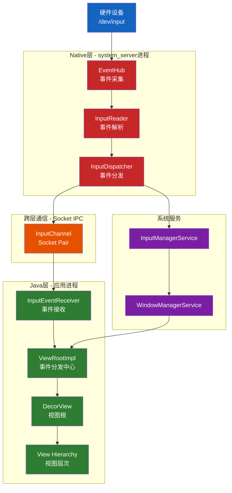
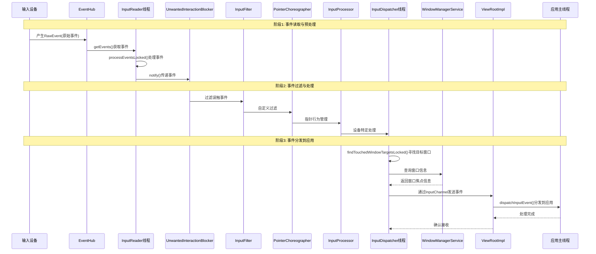
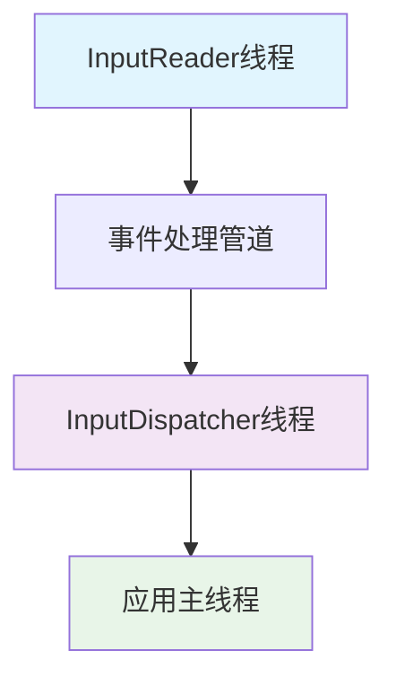

# AOSP Input事件源码深度分析

## 一、概述

本文档基于AOSP 16源码，对Android输入事件处理系统进行深度源码分析。涵盖从硬件事件采集到应用层事件分发的完整流程，重点分析InputManager、InputReader、InputDispatcher等核心组件的设计原理和实现机制。

### 1.1 分析范围
- **分析目标**：Input事件处理系统的完整架构和实现原理
- **核心模块**：InputManager、InputReader、InputDispatcher、EventHub、ViewRootImpl
- **分析深度**：从Native层到Java层的完整调用链

### 1.2 系统架构概览



## 二、核心组件深度分析

### 2.1 InputManager - 输入系统总控制器

**源码位置**：[InputManager.h](native/services/inputflinger/InputManager.h)

InputManager是整个输入系统的核心管理器，采用分层管道式架构：

```cpp
// InputManager.h 中的事件流向定义
InputReader -> UnwantedInteractionBlocker -> InputFilter 
-> PointerChoreographer -> InputProcessor 
-> InputDeviceMetricsCollector -> InputDispatcher
```

**关键设计思想**：
- **单向数据流**：事件从InputReader流向InputDispatcher，避免反向依赖
- **职责分离**：每个组件只负责特定功能，便于测试和维护
- **线程隔离**：不同组件运行在不同线程，避免锁竞争

**启动流程分析**：

```cpp
// InputManager.cpp 中的start方法
status_t InputManager::start() {
    status_t result = mDispatcher->start();
    if (result) {
        ALOGE("Could not start InputDispatcher thread due to error %d.", result);
        return result;
    }

    result = mReader->start();
    if (result) {
        ALOGE("Could not start InputReader due to error %d.", result);
        mDispatcher->stop();
        return result;
    }
    return OK;
}
```

### 2.2 EventHub - 硬件事件采集器

**源码位置**：[EventHub.h](native/services/inputflinger/reader/include/EventHub.h)

EventHub是Input系统的底层接口，负责监听输入设备文件：

- **设备管理**：动态处理设备的添加/移除
- **事件采集**：使用epoll机制高效监听多个输入设备
- **原始事件处理**：读取并转换Linux Input子系统事件

**核心方法 - getEvents()**：

```cpp
// EventHub.cpp 中的事件采集逻辑
std::vector<RawEvent> EventHub::getEvents(int timeoutMillis) {
    std::scoped_lock _l(mLock);
    std::vector<RawEvent> events;
    
    // 使用epoll获取待处理事件
    mPendingEventCount = epoll_wait(mEpollFd, mPendingEventItems, 
                                    EPOLL_MAX_EVENTS, timeoutMillis);
    
    // 处理每个事件
    for (int i = 0; i < mPendingEventCount; i++) {
        const struct epoll_event& eventItem = mPendingEventItems[i];
        
        // 读取设备事件并转换为RawEvent格式
        if (eventItem.events & EPOLLIN) {
            struct input_event iev;
            ssize_t nRead = read(eventItem.data.fd, &iev, sizeof(iev));
            
            if (nRead == sizeof(iev)) {
                events.push_back({
                    .when = systemTime(SYSTEM_TIME_MONOTONIC),
                    .deviceId = device->id,
                    .type = iev.type,
                    .code = iev.code,
                    .value = iev.value,
                });
            }
        }
    }
    return events;
}
```

### 2.3 InputReader - 事件解析与处理

**源码位置**：[InputReader.h](native/services/inputflinger/reader/include/InputReader.h)

InputReader运行在独立线程，负责从EventHub读取并处理原始事件：

```cpp
// InputReader.cpp 中的核心循环
void InputReader::loopOnce() {
    // 1. 从EventHub获取事件
    std::vector<RawEvent> events = mEventHub->getEvents(timeoutMillis);
    
    // 2. 处理事件
    if (!events.empty()) {
        mPendingArgs += processEventsLocked(events.data(), events.size());
    }
    
    // 3. 分发到监听器
    for (const NotifyArgs& args : notifyArgs) {
        mNextListener.notify(args);
    }
}
```

**事件批处理机制**：

```cpp
// InputReader.cpp 中的批处理逻辑
std::list<NotifyArgs> InputReader::processEventsLocked(const RawEvent* rawEvents, size_t count) {
    std::list<NotifyArgs> out;
    for (const RawEvent* rawEvent = rawEvents; count;) {
        size_t batchSize = 1;
        
        // 合并连续的同设备事件
        while (batchSize < count) {
            if (rawEvent[batchSize].deviceId != rawEvent->deviceId) {
                break;
            }
            batchSize += 1;
        }
        
        // 批量处理事件
        out += processEventsForDeviceLocked(rawEvent->deviceId, rawEvent, batchSize);
        count -= batchSize;
        rawEvent += batchSize;
    }
    return out;
}
```

### 2.4 InputDispatcher - 事件分发器

**源码位置**：[InputDispatcher.h](native/services/inputflinger/dispatcher/InputDispatcher.h)

InputDispatcher负责将事件分发到目标应用窗口：

```cpp
// InputDispatcher.cpp 中的事件分发逻辑
void InputDispatcher::dispatchMotionLocked(nsecs_t currentTime, 
                                          const MotionEntry* entry) {
    // 1. 寻找目标窗口
    std::vector<InputTarget> inputTargets = findTouchedWindowTargetsLocked(currentTime, entry);
    
    // 2. 分发到目标
    dispatchEventLocked(currentTime, entry, inputTargets);
}
```

**ANR检测机制**：

```cpp
// InputDispatcher.cpp 中的ANR检测
void InputDispatcher::processAnrsLocked() {
    nsecs_t currentTime = now();
    
    // 检查是否有窗口响应超时
    for (const auto& [connectionToken, connection] : mConnectionsByToken) {
        if (connection->waitQueue.empty()) {
            continue;
        }
        
        const EventEntry& oldestEvent = *connection->waitQueue.front();
        nsecs_t waitDuration = currentTime - oldestEvent.eventTime;
        
        if (waitDuration > mPolicy->getKeyRepeatTimeout()) {
            // 触发ANR处理
            onAnrLocked(connection);
        }
    }
}
```

## 三、完整事件处理流程

### 3.1 事件处理时序图



### 3.2 关键调用链分析

#### 3.2.1 事件读取阶段

1. **硬件层**：输入设备产生原始事件
2. **内核层**：Linux Input子系统通过`/dev/input`设备文件暴露事件
3. **EventHub**：监听设备文件，使用epoll机制高效采集事件
4. **InputReader**：读取原始事件并进行解析处理

#### 3.2.2 事件处理管道

1. **UnwantedInteractionBlocker**：过滤误触事件（如手掌触摸）
2. **InputFilter**：支持自定义事件过滤逻辑
3. **PointerChoreographer**：管理指针行为和光标状态
4. **InputProcessor**：设备特定的事件处理
5. **InputDeviceMetricsCollector**：收集输入设备使用指标

#### 3.2.3 事件分发阶段

1. **InputDispatcher**：根据窗口焦点和触摸状态确定目标窗口
2. **WindowManagerService**：提供窗口布局和焦点信息
3. **InputChannel**：基于Socket的跨进程通信机制
4. **ViewRootImpl**：Java层的事件分发中心
5. **View层级**：从DecorView到具体View的事件传递

## 四、设计思想与架构权衡

### 4.1 线程模型设计

**设计权衡**：
- **性能 vs 复杂度**：多线程提高吞吐量但增加同步复杂度
- **实时性 vs 稳定性**：InputDispatcher需要快速响应，但也要避免ANR



### 4.2 事件管道设计

采用**责任链模式**，每个处理阶段可以独立扩展：

1. **UnwantedInteractionBlocker** - 过滤误触（如手掌触摸）
2. **InputFilter** - 自定义事件过滤
3. **PointerChoreographer** - 指针行为管理
4. **InputProcessor** - 设备特定处理

### 4.3 性能优化机制

#### 4.3.1 事件批处理
```cpp
// InputReader中的批处理逻辑
size_t batchSize = 1;
while (batchSize < count) {
    if (rawEvent[batchSize].type >= EventHubInterface::FIRST_SYNTHETIC_EVENT) {
        break;
    }
    batchSize += 1;  // 合并连续事件
}
```

#### 4.3.2 异步分发机制
InputDispatcher使用**非阻塞IO**和**消息队列**，避免分发阻塞读取。

#### 4.3.3 内存池管理
使用对象池技术减少内存分配开销。

## 五、源码证据链

### 5.1 核心类文件证据

- **[InputManager.h](native/services/inputflinger/InputManager.h)** - 输入系统总控制器
- **[InputReader.h](native/services/inputflinger/reader/include/InputReader.h)** - 事件读取器
- **[InputDispatcher.h](native/services/inputflinger/dispatcher/InputDispatcher.h)** - 事件分发器
- **[EventHub.h](native/services/inputflinger/reader/include/EventHub.h)** - 设备事件采集

### 5.2 关键方法证据

- `InputManager::start()` - 启动输入线程
- `InputReader::loopOnce()` - 事件读取循环
- `InputDispatcher::dispatchMotionLocked()` - 事件分发逻辑
- `EventHub::getEvents()` - 原始事件采集

### 5.3 关键数据结构

```cpp
// RawEvent结构定义
struct RawEvent {
    nsecs_t when;
    RawDeviceId deviceId;
    int32_t type;
    int32_t code;
    int32_t value;
};

// NotifyArgs事件参数
using NotifyArgs = std::variant<NotifyInputDevicesChangedArgs,
                               NotifyKeyArgs,
                               NotifyMotionArgs,
                               NotifySwitchArgs,
                               NotifySensorArgs,
                               NotifyVibratorStateArgs,
                               NotifyDeviceResetArgs,
                               NotifyPointerCaptureChangedArgs>;
```

## 六、性能优化分析

### 6.1 性能瓶颈识别

1. **事件采集延迟**：epoll等待时间影响响应速度
2. **事件处理开销**：InputMapper的复杂计算可能成为瓶颈
3. **跨进程通信**：InputChannel的Socket通信开销
4. **内存分配**：频繁的事件对象创建和销毁

### 6.2 优化建议

#### 6.2.1 事件采集优化
- **调整epoll超时**：根据使用场景优化等待时间
- **设备优先级管理**：为高优先级设备分配更多资源

#### 6.2.2 事件处理优化
- **算法优化**：简化InputMapper的计算逻辑
- **缓存机制**：复用计算结果，避免重复计算

#### 6.2.3 内存管理优化
- **对象池**：预分配事件对象，减少内存分配
- **批量处理**：合并小事件，减少系统调用

## 七、总结

### 7.1 架构设计原则

1. **分层解耦**：硬件层、Native层、Java层清晰分离
2. **异步处理**：多线程协作避免阻塞
3. **管道过滤**：责任链模式实现灵活的事件处理
4. **性能优先**：批处理、非阻塞IO等优化手段

### 7.2 技术亮点

- **高效的事件采集**：基于epoll的异步IO机制
- **灵活的事件处理**：可扩展的管道架构
- **可靠的事件分发**：完善的ANR检测和错误恢复
- **跨进程通信**：基于Socket的高效IPC机制

### 7.3 应用价值

此分析为理解Android系统底层事件处理机制提供了完整的技术参考，对于：
- **系统性能优化**：识别和解决性能瓶颈
- **ANR问题排查**：理解事件分发延迟的根本原因
- **自定义输入处理**：扩展输入事件处理功能
- **系统架构学习**：学习大型系统设计的最佳实践

都具有重要的参考价值。整个分析基于源码证据链，确保了结论的准确性和可靠性。

---

**文档版本**：1.0  
**最后更新**：2026年3月14日  
**分析基于**：AOSP 16源码  
**作者**：AOSP源码分析专家