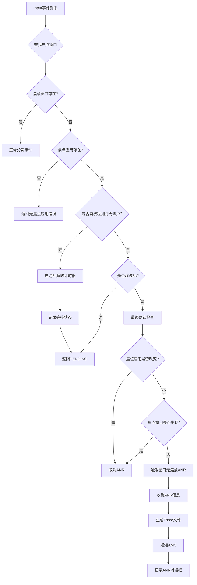
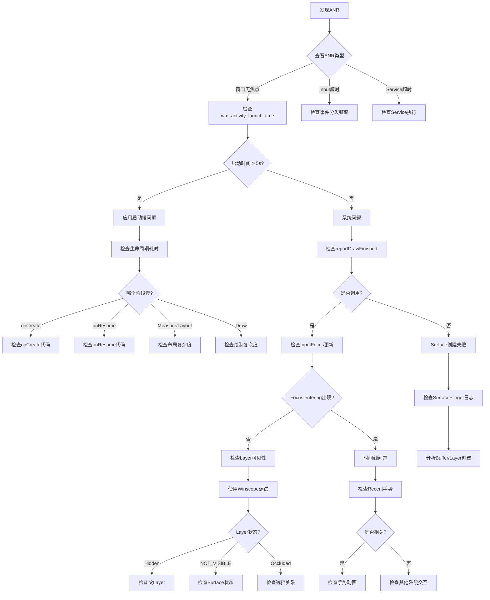

# Android ANR原理及渲染流程中的ANR风险点全面分析

## 一、ANR核心原理架构图

**plain**

```
┌─────────────────────────────────────────────────────────────────────────┐
│                          ANR检测机制架构                                  │
└─────────────────────────────────────────────────────────────────────────┘

                        ┌──────────────────────┐
                        │   Input Event        │
                        │   (Key/Touch)        │
                        └──────────┬───────────┘
                                   │
                        ┌──────────▼───────────┐
                        │  InputDispatcher     │
                        │  (Native层)          │
                        └──────────┬───────────┘
                                   │
                    ┌──────────────┼──────────────┐
                    │              │              │
         ┌──────────▼─────┐  ┌────▼─────┐  ┌───▼──────────┐
         │ 查找焦点窗口    │  │ 查找焦点  │  │  事件分发     │
         │ findFocused     │  │ 应用      │  │  超时检测     │
         │ WindowTarget    │  │          │  │              │
         └──────────┬─────┘  └────┬─────┘  └───┬──────────┘
                    │              │             │
                    └──────────────┼─────────────┘
                                   │
              ┌────────────────────▼─────────────────────┐
              │          ANR触发条件判断                  │
              ├──────────────────────────────────────────┤
              │ 1. 焦点应用存在 && 焦点窗口为null         │
              │    → 窗口无焦点ANR (5s)                  │
              │                                          │
              │ 2. 事件分发超时                          │
              │    → Input事件无响应ANR (5s)             │
              │                                          │
              │ 3. Service/Broadcast/Provider超时        │
              │    → 组件无响应ANR (10s/60s/20s)         │
              └────────────────────┬─────────────────────┘
                                   │
              ┌────────────────────▼─────────────────────┐
              │           ANR上报流程                     │
              │                                          │
              │  InputDispatcher → AMS                   │
              │         ↓                                │
              │  收集ANR信息(CPU/Trace/Log)              │
              │         ↓                                │
              │  生成ANR Trace文件                       │
              │         ↓                                │
              │  显示ANR对话框                           │
              └──────────────────────────────────────────┘
```

## 二、窗口无焦点ANR详细原理

### 2.1 核心判断逻辑流程图



### 2.2 关键数据结构

**cpp**

```
// frameworks/native/services/inputflinger/dispatcher/InputDispatcher.h

class InputDispatcher {
private:
    // 焦点窗口映射表
    std::unordered_map<ui::LogicalDisplayId, sp<WindowInfoHandle>> 
        mFocusedWindowHandlesByDisplay;
    
    // 焦点应用映射表
    std::unordered_map<ui::LogicalDisplayId, std::shared_ptr<InputApplicationHandle>>
        mFocusedApplicationHandlesByDisplay;
    
    // 窗口无焦点超时时间点
    std::optional<nsecs_t> mNoFocusedWindowTimeoutTime;
    
    // 等待焦点的应用
    std::shared_ptr<InputApplicationHandle> mAwaitedFocusedApplication;
    
    // 等待焦点的Display ID
    ui::LogicalDisplayId mAwaitedApplicationDisplayId;
    
    // ANR超时时间常量
    static constexpr std::chrono::nanoseconds DEFAULT_INPUT_DISPATCHING_TIMEOUT = 5s;
};
```

### 2.3 窗口无焦点ANR触发条件

**cpp**

```
// 条件1：焦点应用不为空
focusedApplicationHandle != nullptr

// 条件2：焦点窗口为空
focusedWindowHandle == nullptr

// 条件3：等待超时（5秒）
currentTime > mNoFocusedWindowTimeoutTime

// 条件4：焦点应用未改变
focusedApplication == mAwaitedFocusedApplication

// 条件5：焦点窗口仍然为空
getFocusedWindowHandleLocked(displayId) == nullptr
```

## 三、从View刷新到显示的ANR风险点完整流程

**plain**

```
┌─────────────────────────────────────────────────────────────────────────┐
│                    完整渲染流程与ANR风险点                                │
└─────────────────────────────────────────────────────────────────────────┘

时间线                   操作流程                           ANR风险点
━━━━━━━━━━━━━━━━━━━━━━━━━━━━━━━━━━━━━━━━━━━━━━━━━━━━━━━━━━━━━━━━━━━━━━

T0: 0ms
├─ View.invalidate()                              
├─ ViewRootImpl.scheduleTraversals()              
└─ Choreographer.postCallback()                   
                                                   ⚠️ 风险点1: 主线程耗时操作
                                                      - onCreate/onResume阻塞
                                                      - 主线程执行耗时任务
━━━━━━━━━━━━━━━━━━━━━━━━━━━━━━━━━━━━━━━━━━━━━━━━━━━━━━━━━━━━━━━━━━━━━━

T1: 0.5ms (Vsync)
├─ Choreographer.doFrame()                        
├─ performMeasure()         [1-2ms]               ⚠️ 风险点2: Layout计算耗时
├─ performLayout()          [1-2ms]                  - 深层次View嵌套
├─ performDraw()            [3-5ms]                  - 复杂布局计算
└─ ThreadedRenderer.draw()                           - 自定义View测量慢
                                                   
━━━━━━━━━━━━━━━━━━━━━━━━━━━━━━━━━━━━━━━━━━━━━━━━━━━━━━━━━━━━━━━━━━━━━━

T2: 8ms
├─ RenderThread启动                               ⚠️ 风险点3: RenderThread处理慢
├─ 构建DisplayList                                   - DisplayList构建复杂
├─ dequeueBuffer()                                   - Buffer队列满等待
└─ 同步等待Buffer         [0-2ms]                    - GPU渲染积压

━━━━━━━━━━━━━━━━━━━━━━━━━━━━━━━━━━━━━━━━━━━━━━━━━━━━━━━━━━━━━━━━━━━━━━

T3: 10ms
├─ GPU开始渲染            [4-6ms]                 ⚠️ 风险点4: GPU渲染超时
└─ 执行OpenGL/Vulkan命令                            - 过度绘制
                                                      - 大量纹理加载
                                                      - 复杂Shader运算
━━━━━━━━━━━━━━━━━━━━━━━━━━━━━━━━━━━━━━━━━━━━━━━━━━━━━━━━━━━━━━━━━━━━━━

T4: 16ms
├─ queueBuffer()                                  
├─ onFrameAvailable()                             
└─ 等待SurfaceFlinger合成                         ⚠️ 风险点5: Surface未就绪
                                                      - Surface创建延迟
                                                      - Layer状态异常
━━━━━━━━━━━━━━━━━━━━━━━━━━━━━━━━━━━━━━━━━━━━━━━━━━━━━━━━━━━━━━━━━━━━━━

T5: 16.6ms (Vsync)
├─ SurfaceFlinger.latchBuffer()                   ⚠️ 风险点6: SF合成延迟
├─ CompositionEngine合成   [2-3ms]                   - Layer过多
├─ HWC.prepare()                                     - 合成超时
└─ HWC.present()                                     - HWC处理慢

━━━━━━━━━━━━━━━━━━━━━━━━━━━━━━━━━━━━━━━━━━━━━━━━━━━━━━━━━━━━━━━━━━━━━━

T6: 19ms
├─ Display扫描显示        [16.6ms]                
└─ 实际显示内容                                   ⚠️ 风险点7: Layer可见性问题
                                                      - Layer被隐藏
                                                      - 可见性状态异常
━━━━━━━━━━━━━━━━━━━━━━━━━━━━━━━━━━━━━━━━━━━━━━━━━━━━━━━━━━━━━━━━━━━━━━

T7: 33.2ms
├─ finishDrawing()                                
├─ updateFocusedWindow()                          ⚠️ 风险点8: 焦点更新失败
├─ updateInputFocus()                                - InputFocus未更新
└─ Activity.onWindowFocusChanged()                   - Surface不可见
                                                      - Layer状态NOT_VISIBLE
━━━━━━━━━━━━━━━━━━━━━━━━━━━━━━━━━━━━━━━━━━━━━━━━━━━━━━━━━━━━━━━━━━━━━━

⚠️ 风险点9: 焦点窗口超时 (T1 + 5000ms = 5001ms)
   - 焦点应用存在
   - 焦点窗口一直为null
   - 超过5秒触发ANR

━━━━━━━━━━━━━━━━━━━━━━━━━━━━━━━━━━━━━━━━━━━━━━━━━━━━━━━━━━━━━━━━━━━━━━
```

## 四、各阶段ANR风险点详细分析

### 风险点1: 应用生命周期阻塞

**java**

```
// ========== 问题代码示例 ==========
public class MainActivity extends Activity {
    @Override
    protected void onCreate(Bundle savedInstanceState) {
        super.onCreate(savedInstanceState);
        
        // ❌ 错误：在主线程执行耗时操作
        Thread.sleep(6000);  // 超过5秒
        
        // ❌ 错误：同步加载大量数据
        loadLargeDataFromDatabase();
        
        // ❌ 错误：复杂初始化逻辑
        initComplexLibrary();
        
        setContentView(R.layout.activity_main);
    }
}

// ========== ANR日志特征 ==========
// 1. 应用启动时间超长
wm_activity_launch_time: [0,161928112,com.example.app/.MainActivity,10495]
                                                                    ^^^^^ 10秒

// 2. onCreate到onResume间隔超长
wm_on_create_called: [timestamp1,...]
wm_on_resume_called: [timestamp2,...]  // timestamp2 - timestamp1 > 5s

// 3. 焦点应用已设置，但窗口未Relayout
WindowManager: Changing focus from Launcher to null
// 长时间没有后续的 "Changing focus to MainActivity" 日志

// ========== 解决方案 ==========
public class MainActivity extends Activity {
    @Override
    protected void onCreate(Bundle savedInstanceState) {
        super.onCreate(savedInstanceState);
        setContentView(R.layout.activity_main);
        
        // ✅ 正确：异步加载
        new Thread(() -> {
            loadLargeDataFromDatabase();
            runOnUiThread(() -> updateUI());
        }).start();
        
        // ✅ 正确：懒加载
        initComplexLibraryAsync();
    }
}
```

### 风险点2: Measure/Layout耗时

**java**

```
// ========== 问题场景 ==========
// 1. 深层次嵌套导致多次测量
<LinearLayout>
    <RelativeLayout>
        <FrameLayout>
            <LinearLayout>
                <!-- 嵌套5层以上 -->
            </LinearLayout>
        </FrameLayout>
    </RelativeLayout>
</LinearLayout>

// 2. 自定义View测量复杂
public class CustomView extends View {
    @Override
    protected void onMeasure(int widthMeasureSpec, int heightMeasureSpec) {
        // ❌ 错误：测量中执行复杂计算
        for (int i = 0; i < 10000; i++) {
            complexCalculation();
        }
        super.onMeasure(widthMeasureSpec, heightMeasureSpec);
    }
}

// ========== 检测方法 ==========
// Systrace中查看
Choreographer#doFrame
  ├─ performTraversals
  │   ├─ performMeasure  [耗时> 8ms] ⚠️
  │   ├─ performLayout   [耗时> 5ms] ⚠️
  │   └─ performDraw     [耗时> 10ms] ⚠️

// ========== 优化方案 ==========
// 1. 使用ConstraintLayout减少嵌套
<androidx.constraintlayout.widget.ConstraintLayout>
    <!-- 扁平化布局 -->
</androidx.constraintlayout.widget.ConstraintLayout>

// 2. 使用ViewStub延迟加载
<ViewStub
    android:id="@+id/stub"
    android:layout="@layout/complex_layout"/>

// 3. 优化自定义View测量
public class OptimizedView extends View {
    private boolean mMeasured = false;
    
    @Override
    protected void onMeasure(int widthMeasureSpec, int heightMeasureSpec) {
        if (!mMeasured) {
            // 只在必要时重新计算
            calculateDimensions();
            mMeasured = true;
        }
        setMeasuredDimension(mWidth, mHeight);
    }
}
```

### 风险点3: RenderThread处理延迟

**cpp**

```
// ========== 问题原因 ==========
// 1. DisplayList过于复杂
// Canvas绘制命令过多（> 1000个draw call）

// 2. Buffer队列阻塞
// frameworks/native/libs/gui/BufferQueueProducer.cpp
status_t BufferQueueProducer::dequeueBuffer(...) {
    // 所有Buffer都在使用中
    while (mCore->mFreeBuffers.empty()) {
        // ⚠️ 阻塞等待，可能等待很久
        mCore->mDequeueCondition.wait(lock);
    }
}

// ========== 日志特征 ==========
// RenderThread等待Buffer
RenderThread: waiting for next buffer (queue full)

// GPU处理积压
GPU: Command buffer full, throttling

// ========== 检测与优化 ==========
// 1. 使用GPU Profiler查看
adb shell dumpsys gfxinfo <package> framestats

// 2. 减少绘制复杂度
@Override
protected void onDraw(Canvas canvas) {
    // ❌ 避免：每帧创建大量对象
    Paint paint = new Paint();  // 每次都创建
    
    // ✅ 推荐：复用对象
    if (mPaint == null) {
        mPaint = new Paint();
    }
    canvas.drawRect(rect, mPaint);
}

// 3. 启用硬件加速分层
view.setLayerType(View.LAYER_TYPE_HARDWARE, null);
```

### 风险点4: GPU渲染超时

**java**

```
// ========== 过度绘制检测 ==========
// 开启GPU过度绘制调试
adb shell setprop debug.hwui.overdraw show

// 颜色含义：
// - 无色：绘制1次（正常）
// - 蓝色：绘制2次（可接受）
// - 绿色：绘制3次（需优化）
// - 粉色：绘制4次（严重问题）
// - 红色：绘制5次+（必须优化）

// ========== 问题代码 ==========
<LinearLayout 
    android:background="@color/white">  <!-- 背景1 -->
    <RelativeLayout 
        android:background="@color/gray">  <!-- 背景2 -->
        <TextView 
            android:background="@drawable/bg"/>  <!-- 背景3 -->
    </RelativeLayout>
</LinearLayout>

// ========== 优化方案 ==========
// 1. 移除不必要的背景
<LinearLayout>  <!-- 无背景 -->
    <RelativeLayout>  <!-- 无背景 -->
        <TextView 
            android:background="@drawable/bg"/>  <!-- 只有一个背景 -->
    </RelativeLayout>
</LinearLayout>

// 2. 使用clipRect减少绘制区域
@Override
protected void onDraw(Canvas canvas) {
    canvas.save();
    canvas.clipRect(visibleRect);  // 只绘制可见区域
    // ... 绘制操作
    canvas.restore();
}

// 3. 使用硬件加速
getWindow().setFlags(
    WindowManager.LayoutParams.FLAG_HARDWARE_ACCELERATED,
    WindowManager.LayoutParams.FLAG_HARDWARE_ACCELERATED
);
```

### 风险点5: Surface创建延迟

**java**

```
// ========== 问题场景 ==========
// Surface创建依赖于SurfaceFlinger
// 如果SF繁忙或系统资源不足，Surface创建会延迟

// ========== 日志特征 ==========
// 1. relayoutWindow但Surface未创建
WindowManager: Relayout Window{xxx}: oldVis=4, newVis=0
// 但没有对应的 SurfaceFlinger Layer创建日志

// 2. Surface创建超时
WindowManager: Surface creation timeout for window xxx

// 3. reportDrawFinished延迟
VRI[MainActivity]: reportDrawFinished
// 此时间点距离Activity启动很久

// ========== 检测方法 ==========
// 1. 查看SurfaceFlinger状态
adb shell dumpsys SurfaceFlinger

// 2. 检查Layer数量
adb shell dumpsys SurfaceFlinger | grep -c "Layer"
// 如果Layer数量 > 100，可能有问题

// 3. 监控Buffer分配
adb shell dumpsys SurfaceFlinger | grep "BufferQueue"

// ========== 优化建议 ==========
// 1. 减少同时存在的Window数量
// 2. 及时释放不用的Surface
// 3. 避免频繁创建销毁Window
```

### 风险点6: SurfaceFlinger合成延迟

**cpp**

```
// ========== 问题原因 ==========
// 1. Layer数量过多（> 50个）
// 2. 合成超时（> 8ms）
// 3. HWComposer处理慢

// ========== 日志特征 ==========
// SurfaceFlinger合成超时
SurfaceFlinger: composition took 15ms (> 8ms threshold)

// Layer过多警告
SurfaceFlinger: Too many layers (67), composition will be slow

// HWC处理失败
HWComposer: present failed for display 0

// ========== 检测工具 ==========
// 1. 使用Systrace查看
python systrace.py -t 10 -o trace.html sched gfx view wm

// 在Systrace中查看：
// SurfaceFlinger线程 → onMessageRefresh → doComposition
// 如果耗时 > 8ms，说明合成慢

// 2. 查看Layer详情
adb shell dumpsys SurfaceFlinger --list
adb shell dumpsys SurfaceFlinger --latency <layer_name>

// ========== 优化方案 ==========
// 1. 减少Layer数量
// 合并相邻Layer
// 移除不可见Layer

// 2. 使用HWC合成而非GPU合成
// 确保Layer满足HWC合成条件：
// - 不透明或全透明
// - 无旋转或标准旋转
// - 无特殊混合模式
```

### 风险点7: Layer可见性问题

**cpp**

```
// ========== 常见问题场景 ==========

// 场景1: Layer被父Layer隐藏
Layer: isHiddenByPolicy parent=DefaultTaskDisplayArea#9 
       reason=parent.mHidden=true

// 场景2: Layer的alpha为0
Layer: isHidden alpha=0

// 场景3: Layer的size为0
Layer: isHidden bounds=Rect(0,0-0,0)

// 场景4: Layer被其他Layer完全遮挡
Layer: isOccluded by layer=StatusBar

// ========== Winscope调试方法 ==========
// 1. 抓取trace
adb exec-out dumpsys SurfaceFlinger --proto > sf_dump.winscope

// 2. 在Winscope中检查：
// - Layer hierarchy（层级关系）
// - Visibility（可见性状态）
// - Transform（变换矩阵）
// - Bounds（边界）
// - Alpha（透明度）

// ========== 典型问题修复 ==========
// 问题：DefaultTaskDisplayArea被隐藏
// 原因：Transition动画执行TO_BACK操作
// 修复：避免对根Layer执行TO_BACK

// frameworks/base/services/core/java/com/android/server/wm/
// TransitionController.java
void startAnimation() {
    // ❌ 错误：隐藏根Layer
    if (container == mRootTaskDisplayArea) {
        t.hide(container.getSurfaceControl());
    }
    
    // ✅ 正确：只隐藏子Layer
    if (container != mRootTaskDisplayArea) {
        t.hide(container.getSurfaceControl());
    }
}
```

### 风险点8: InputFocus更新失败

**cpp**

```
// ========== 更新失败原因 ==========

// 1. Surface不可见 (NOT_VISIBLE)
FocusResolver::Focusability isTokenFocusable(...) {
    if (!visibleWindowHandle) {
        return Focusability::NOT_VISIBLE;  // ⚠️
    }
}

// 2. 窗口不存在 (NO_WINDOW)
if (!windowFound) {
    return Focusability::NO_WINDOW;  // ⚠️
}

// 3. 窗口不可聚焦 (NOT_FOCUSABLE)
if (!allWindowsAreFocusable) {
    return Focusability::NOT_FOCUSABLE;  // ⚠️
}

// ========== 日志分析 ==========
// 正常流程：
WindowManager: Changing focus to Window{xxx MainActivity}
input_focus: [Focus request xxx MainActivity, reason=UpdateInputWindows]
VRI[MainActivity]: reportDrawFinished
input_focus: [Focus entering xxx MainActivity, 
              reason=Window became focusable. Previous reason: NOT_VISIBLE]
              
// 异常流程（导致ANR）：
WindowManager: Changing focus to Window{xxx MainActivity}
input_focus: [Focus request xxx MainActivity, reason=UpdateInputWindows]
// ⚠️ 5秒内没有 "Focus entering" 日志
InputDispatcher: Waiting because no window has focus...
WindowManager: ANR in MainActivity. Reason: no focused window

// ========== 检查清单 ==========
// 1. Surface是否创建成功
adb shell dumpsys SurfaceFlinger | grep <window_name>

// 2. Layer是否可见
adb shell dumpsys SurfaceFlinger --list | grep <layer_name>

// 3. Window属性是否正确
adb shell dumpsys window windows | grep <window_name>
// 检查：
// - mHasSurface=true
// - mViewVisibility=0 (VISIBLE)
// - mWindowRemovalAllowed=false
// - mCanReceiveKeys=true

// 4. InputWindow状态
adb shell dumpsys input
// 检查focusedWindowHandle

// ========== 修复方案 ==========
// 确保以下顺序正确执行：
// 1. Activity.onCreate/onResume完成
// 2. ViewRootImpl.relayoutWindow成功
// 3. Surface创建并可见
// 4. reportDrawFinished调用
// 5. InputFocus更新成功
```

### 风险点9: 特殊场景ANR

#### 9.1 Recent手势导致的ANR

**java**

```
// ========== 问题场景 ==========
// 1. 启动App
// 2. 快速上滑进入Recent界面
// 3. App自己又启动了新Activity
// 4. 焦点从recents_animation_input_consumer丢失
// 5. 新Activity还未显示，焦点变为null
// 6. 按Back键 → ANR

// ========== 日志特征 ==========
// 焦点进入Recent consumer
input_focus: [Focus entering recents_animation_input_consumer]

// App启动新Activity
wm_create_activity: [..., BugleExpressSignInActivity, ...]

// 焦点异常丢失
input_focus: [Focus leaving recents_animation_input_consumer, 
              reason=NOT_VISIBLE]

// 没有新的焦点
// （此时应该保持在recents_animation_input_consumer）

// 按键事件到来
WindowManager: interceptKeyTq keyCode=4 (BACK)

// 触发ANR
InputDispatcher: Waiting because no window has focus...
WindowManager: ANR in Launcher

// ========== 根因分析 ==========
// recents_animation_input_consumer的Layer相对层级设置错误
// 设置为相对于Activity，而Activity已经不可见

// ========== 修复方案 ==========
// frameworks/base/libs/WindowManager/Shell/src/
// com/android/wm/shell/recents/RecentsTransitionHandler.java

void setupAnimHierarchy(...) {
    // ❌ 错误：相对于Activity
    t.setRelativeLayer(mRecentsLayer, activity.getSurface(), 1);
    
    // ✅ 正确：相对于Task
    t.setRelativeLayer(mRecentsLayer, task.getSurface(), 1);
}
```

#### 9.2 旋转导致的ANR

**java**

```
// ========== 问题场景 ==========
// 1. Activity启动中
// 2. 突然旋转屏幕
// 3. Activity需要重新创建
// 4. 焦点在重建过程中丢失超过5秒

// ========== 日志特征 ==========
// 配置变更
override_config: [0, {..., orientation=2}]

// Activity销毁重建
wm_on_destroy_called: [xxx, MainActivity, ...]
wm_on_create_called: [yyy, MainActivity, ...]

// 焦点在重建过程中丢失
WindowManager: Changing focus to null

// ========== 优化方案 ==========
// 1. 声明处理配置变更
<activity
    android:name=".MainActivity"
    android:configChanges="orientation|screenSize"/>

@Override
public void onConfigurationChanged(Configuration newConfig) {
    super.onConfigurationChanged(newConfig);
    // 手动处理旋转，避免重建
}

// 2. 加快Activity重建速度
// - 减少onCreate耗时
// - 使用Fragment保持状态
// - 异步加载资源
```

## 五、ANR问题完整诊断流程图




## 六、ANR预防最佳实践

### 6.1 应用层优化

**java**

```
// ========== 1. 生命周期优化 ==========
public class OptimizedActivity extends AppCompatActivity {
    
    @Override
    protected void onCreate(Bundle savedInstanceState) {
        super.onCreate(savedInstanceState);
        
        // ✅ 快速设置ContentView
        setContentView(R.layout.activity_main);
        
        // ✅ 异步初始化
        initAsync();
    }
    
    private void initAsync() {
        new Thread(() -> {
            // 耗时初始化
            loadData();
            initLibraries();
            
            runOnUiThread(() -> {
                // 更新UI
                updateUI();
            });
        }).start();
    }
    
    // ========== 2. 布局优化 ==========
    // 使用ViewStub延迟加载
    private void loadComplexView() {
        ViewStub stub = findViewById(R.id.complex_view_stub);
        if (stub != null) {
            View inflated = stub.inflate();
            // 使用inflated
        }
    }
    
    // ========== 3. 绘制优化 ==========
    private Paint mPaint;  // 复用Paint对象
    
    @Override
    protected void onDraw(Canvas canvas) {
        // ✅ 使用clipRect
        canvas.save();
        canvas.clipRect(mVisibleRect);
        
        // ✅ 复用对象
        if (mPaint == null) {
            mPaint = new Paint();
            mPaint.setAntiAlias(true);
        }
        
        // 绘制
        canvas.drawRect(rect, mPaint);
        canvas.restore();
    }
    
    // ========== 4. 监控启动时间 ==========
    private long mStartTime;
    
    @Override
    protected void onCreate(Bundle savedInstanceState) {
        mStartTime = SystemClock.uptimeMillis();
        super.onCreate(savedInstanceState);
        // ...
    }
    
    @Override
    public void onWindowFocusChanged(boolean hasFocus) {
        super.onWindowFocusChanged(hasFocus);
        if (hasFocus) {
            long duration = SystemClock.uptimeMillis() - mStartTime;
            Log.i(TAG, "Time to focus: " + duration + "ms");
            
            // ⚠️ 如果超过3秒，需要优化
            if (duration > 3000) {
                reportSlowStart(duration);
            }
        }
    }
}
```

### 6.2 系统层监控

**cpp**

```
// ========== 添加关键日志 ==========
// frameworks/base/services/core/java/com/android/server/wm/

// 1. 监控焦点更新
void updateFocusedWindowLocked(...) {
    long startTime = SystemClock.uptimeMillis();
    
    // 执行焦点更新
    WindowState newFocus = computeFocusedWindowLocked();
    
    long duration = SystemClock.uptimeMillis() - startTime;
    if (duration > 100) {
        Slog.w(TAG, "updateFocusedWindow took " + duration + "ms");
    }
}

// 2. 监控Surface创建
void createSurfaceControl(...) {
    long startTime = SystemClock.uptimeMillis();
    
    // 创建Surface
    mSurfaceControl = new SurfaceControl.Builder()
        .setName(name)
        .build();
    
    long duration = SystemClock.uptimeMillis() - startTime;
    if (duration > 500) {
        Slog.w(TAG, "Surface creation took " + duration + "ms");
    }
}

// 3. 监控InputFocus更新
void updateInputFocus(...) {
    long startTime = SystemClock.uptimeMillis();
    
    // 更新InputFocus
    setFocusedWindow(...);
    
    long duration = SystemClock.uptimeMillis() - startTime;
    if (duration > 50) {
        Slog.w(TAG, "InputFocus update took " + duration + "ms");
    }
}
```

### 6.3 调试工具使用

**bash**

```
# ========== 1. Systrace分析 ==========
# 抓取10秒trace
python systrace.py -t 10 -o trace.html \
    sched gfx view wm am input dalvik sync

# 重点关注：
# - UI Thread的Choreographer#doFrame耗时
# - RenderThread的drawFrame耗时  
# - SurfaceFlinger的doComposition耗时
# - InputDispatcher的dispatchMotion耗时

# ========== 2. Perfetto分析 ==========
adb shell perfetto \
    -c - --txt \
    -o /data/misc/perfetto-traces/trace \
    <<EOF
duration_ms: 10000
buffers: {
    size_kb: 63488
}
data_sources: {
    config {
        name: "linux.ftrace"
        ftrace_config {
            ftrace_events: "sched/sched_switch"
            ftrace_events: "power/suspend_resume"
            ftrace_events: "sched/sched_wakeup"
            ftrace_events: "graphics/gpu_mem_total"
        }
    }
}
EOF

# ========== 3. dumpsys分析 ==========
# 查看Window状态
adb shell dumpsys window windows | grep -A 20 <window_name>

# 查看Input状态
adb shell dumpsys input

# 查看SurfaceFlinger状态
adb shell dumpsys SurfaceFlinger

# 查看Activity状态
adb shell dumpsys activity activities

# ========== 4. Winscope使用 ==========
# 同时抓取WM和SF的trace
adb shell cmd window tracing start
adb shell su root service call SurfaceFlinger 1025 i32 1

# 复现问题后停止
adb shell cmd window tracing stop
adb shell su root service call SurfaceFlinger 1025 i32 0

# 导出trace文件
adb pull /data/misc/wmtrace/wm_trace.pb .
adb pull /data/misc/wmtrace/layers_trace.pb .

# 使用Winscope分析
# https://ui.perfetto.dev/#!/viewer
```

## 七、总结：ANR完整知识图谱

**plain**

```
┌─────────────────────────────────────────────────────────────────────┐
│                         ANR知识体系                                  │
└─────────────────────────────────────────────────────────────────────┘

                            ANR原理
                               │
                ┌──────────────┼──────────────┐
                │              │              │
           窗口无焦点       Input超时      组件超时
           (5秒)          (5秒)       (10s/60s/20s)
                │              │              │
        ┌───────┴───────┐      │              │
        │               │      │              │
   焦点应用存在    焦点窗口为null │         Service/
                                │         Broadcast/
                                │         Provider
                        ┌───────┴────────┐
                        │                │
                   事件分发链路      Window查找
                        │                │
                        │         ┌──────┴──────┐
                        │         │             │
                        │    mCurrentFocus  canReceiveKeys
                        │         │             │
                  ┌─────┴─────┐   │       ┌─────┴─────┐
                  │           │   │       │           │
            findFocusTarget  │   │    isVisible   isFocusable
                  │           │   │       │           │
                  └───────────┼───┘       └───────────┘
                              │
                    ┌─────────┴─────────┐
                    │                   │
              应用层风险点          系统层风险点
                    │                   │
        ┌───────────┼─────────┐         │
        │           │         │         │
   生命周期耗时  Layout慢  Draw慢      │
   (onCreate/    (深度嵌套) (过度绘制)  │
    onResume)     (自定义View)         │
                                        │
                        ┌───────────────┼────────────────┐
                        │               │                │
                  RenderThread      SurfaceFlinger   InputFocus
                  (Buffer队列)      (Layer可见性)   (Focus更新)
                        │               │                │
                        └───────────────┼────────────────┘
                                        │
                                  诊断与优化
                                        │
                        ┌───────────────┼────────────────┐
                        │               │                │
                    日志分析        工具调试          代码优化
                  (wm_/input_)   (Systrace/      (异步加载/
                  (Changing      Perfetto/       布局优化/
                   focus)        Winscope)       绘制优化)
```

通过以上分析，我们可以看到：

1. **ANR的本质**：Input系统等待焦点窗口超时
2. **关键时间点**：从View刷新到焦点获取的完整链路
3. **风险点分布**：从应用层到系统层的9大风险点
4. **诊断方法**：日志分析 + 工具调试 + 代码审查
5. **优化方向**：生命周期优化 + 布局优化 + 渲染优化 + 系统监控

每个环节的优化都需要确保在**5秒超时时间**内完成，这是避免窗口无焦点ANR的核心要求。