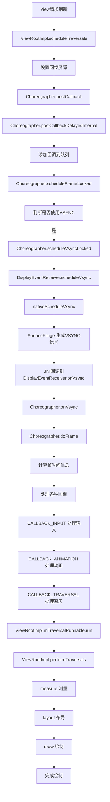

# View请求刷新时app-vsync信号的计算和返回机制分析

## 1. 概述

当Android应用中的View需要刷新时，系统会请求app-vsync信号来同步绘制操作。app-vsync信号是由SurfaceFlinger生成的，用于协调应用的绘制操作与显示硬件的刷新率，确保流畅的用户体验。

## 2. 核心组件

### 2.1 ViewRootImpl

ViewRootImpl是View层次结构的根，负责管理视图的测量、布局和绘制过程。当View需要刷新时，最终会通过ViewRootImpl的`scheduleTraversals`方法发起刷新请求。

### 2.2 Choreographer

Choreographer是Android系统中用于协调动画、输入和绘制的核心类。它接收来自SurfaceFlinger的VSYNC信号，并将其分发给应用程序中的各个组件。

### 2.3 DisplayEventReceiver

DisplayEventReceiver是Java层与底层系统交互的接口，用于接收来自SurfaceFlinger的显示事件，包括VSYNC信号。

## 3. 详细流程

### 3.1 View请求刷新的起始点

当View需要刷新时（例如调用`invalidate()`或`requestLayout()`），最终会通过ViewRootImpl的`scheduleTraversals`方法发起刷新请求：

```java
void scheduleTraversals() {
    if (!mTraversalScheduled) {
        mTraversalScheduled = true;
        // 设置同步屏障，确保绘制操作优先执行
        mTraversalBarrier = mQueue.postSyncBarrier();
        // 注册遍历回调
        mChoreographer.postCallback(
                Choreographer.CALLBACK_TRAVERSAL, mTraversalRunnable, null);
        notifyRendererOfFramePending();
        pokeDrawLockIfNeeded();
    }
}
```

### 3.2 Choreographer处理刷新请求

Choreographer的`postCallback`方法会将回调添加到队列中，并调用`scheduleFrameLocked`方法：

```java
private void postCallbackDelayedInternal(int callbackType, Object action, Object token, long delayMillis) {
    synchronized (mLock) {
        final long now = SystemClock.uptimeMillis();
        final long dueTime = now + delayMillis;
        mCallbackQueues[callbackType].addCallbackLocked(dueTime, action, token);

        if (dueTime <= now) {
            scheduleFrameLocked(now);
        } else {
            Message msg = mHandler.obtainMessage(MSG_DO_SCHEDULE_CALLBACK, action);
            msg.arg1 = callbackType;
            msg.setAsynchronous(true);
            mHandler.sendMessageAtTime(msg, dueTime);
        }
    }
}
```

### 3.3 请求VSYNC信号

`scheduleFrameLocked`方法会判断是否需要使用VSYNC信号，如果需要，则调用`scheduleVsyncLocked`方法：

```java
private void scheduleFrameLocked(long now) {
    if (!mFrameScheduled) {
        mFrameScheduled = true;
        if (USE_VSYNC) {
            if (DEBUG_FRAMES) {
                Log.d(TAG, "Scheduling next frame on vsync.");
            }

            // 如果在Looper线程上运行，则立即调度vsync
            // 否则，发送消息以尽快从UI线程调度vsync
            if (isRunningOnLooperThreadLocked()) {
                scheduleVsyncLocked();
            } else {
                Message msg = mHandler.obtainMessage(MSG_DO_SCHEDULE_VSYNC);
                msg.setAsynchronous(true);
                mHandler.sendMessageAtFrontOfQueue(msg);
            }
        } else {
            // 不使用VSYNC的情况
            // ...
        }
    }
}
```

`scheduleVsyncLocked`方法会调用DisplayEventReceiver的`scheduleVsync`方法：

```java
private void scheduleVsyncLocked() {
    try {
        Trace.traceBegin(Trace.TRACE_TAG_VIEW, "Choreographer#scheduleVsyncLocked");
        mDisplayEventReceiver.scheduleVsync();
    } finally {
        Trace.traceEnd(Trace.TRACE_TAG_VIEW);
    }
}
```

### 3.4 与底层系统交互

DisplayEventReceiver的`scheduleVsync`方法会调用JNI方法`nativeScheduleVsync`，与底层系统交互：

```java
public void scheduleVsync() {
    if (mReceiverPtr == 0) {
        Log.w(TAG, "Attempted to schedule a vertical sync pulse but the display event "
                + "receiver has already been disposed.");
    } else {
        nativeScheduleVsync(mReceiverPtr);
    }
}
```

### 3.5 SurfaceFlinger生成VSYNC信号

底层系统（SurfaceFlinger）会根据显示硬件的刷新率（通常是60Hz、90Hz或120Hz）生成VSYNC信号。当接收到应用的VSYNC请求时，SurfaceFlinger会在下次VSYNC信号到来时，通过JNI回调到Java层。

### 3.6 接收VSYNC信号

当VSYNC信号到达时，会调用DisplayEventReceiver的`onVsync`方法：

```java
public void onVsync(long timestampNanos, int builtInDisplayId, int frame, 
        VsyncEventData vsyncEventData) {
    // 处理VSYNC事件
    // ...
    mHandler.sendMessage(mHandler.obtainMessage(MSG_DISPLAY_EVENT, this));
}
```

### 3.7 处理VSYNC信号

DisplayEventReceiver的Handler会处理MSG_DISPLAY_EVENT消息，并调用`dispatchVsync`方法：

```java
private void dispatchVsync(long timestampNanos, int builtInDisplayId, int frame,
        VsyncEventData vsyncEventData) {
    onVsync(timestampNanos, builtInDisplayId, frame, vsyncEventData);
}
```

Choreographer会重写`onVsync`方法，处理VSYNC信号并调用`doFrame`方法：

```java
public void onVsync(long timestampNanos, int builtInDisplayId, int frame, 
        VsyncEventData vsyncEventData) {
    // ...
    doFrame(timestampNanos, frame, vsyncEventData);
}
```

### 3.8 计算app-vsync信号

`doFrame`方法会计算当前帧的时间信息，并处理各种回调：

```java
void doFrame(long frameTimeNanos, int frame, DisplayEventReceiver.VsyncEventData vsyncEventData) {
    final long startNanos;
    final long frameIntervalNanos = vsyncEventData.frameInterval;
    // 原始的VSYNC时间，未经过抖动或缓冲区填充恢复调整
    final long intendedFrameTimeNanos = frameTimeNanos;
    long offsetFrameTimeNanos = frameTimeNanos;
    boolean resynced = false;

    // 评估缓冲区填充恢复是否需要开始或结束，以及需要采取什么行动进行恢复
    if (bufferStuffingRecovery()) {
        switch (updateBufferStuffingState(frameTimeNanos, vsyncEventData)) {
            case OFFSET:
                // 添加动画偏移量
                offsetFrameTimeNanos = frameTimeNanos - frameIntervalNanos;
                break;
            case DELAY_FRAME:
                // 故意延迟帧以帮助减少排队的缓冲区数量
                mBufferStuffingState.numberWaitsForNextVsync++;
                scheduleVsyncLocked();
                return;
            default:
                break;
        }
    }

    // 更新帧数据和时间线
    FrameTimeline timeline = mFrameData.update(offsetFrameTimeNanos, vsyncEventData);

    synchronized (mLock) {
        if (!mFrameScheduled) {
            return; // 没有工作要做
        }
        mLastNoOffsetFrameTimeNanos = frameTimeNanos;

        // 计算抖动时间
        startNanos = System.nanoTime();
        final long jitterNanos = startNanos - frameTimeNanos;

        // 处理帧速率除数
        if (mFPSDivisor > 1) {
            long timeSinceVsync = frameTimeNanos - mLastFrameTimeNanos;
            if (timeSinceVsync < (frameIntervalNanos * mFPSDivisor) && timeSinceVsync > 0) {
                scheduleVsyncLocked();
                return;
            }
        }

        // 设置帧信息
        mFrameInfo.setVsync(intendedFrameTimeNanos, frameTimeNanos,
                vsyncEventData.preferredFrameTimeline().vsyncId,
                vsyncEventData.preferredFrameTimeline().deadline, startNanos,
                vsyncEventData.frameInterval);
        mFrameScheduled = false;
        mLastFrameTimeNanos = frameTimeNanos;
        mLastFrameIntervalNanos = frameIntervalNanos;
        mLastVsyncEventData.copyFrom(vsyncEventData);
    }

    // 处理各种回调（包括遍历回调）
    AnimationUtils.lockAnimationClock(frameTimeNanos / TimeUtils.NANOS_PER_MS,
            timeline.mExpectedPresentationTimeNanos);
    mFrameInfo.markInputHandlingStart();
    doCallbacks(Choreographer.CALLBACK_INPUT, frameTimeNanos);
    mFrameInfo.markAnimationsStart();
    doCallbacks(Choreographer.CALLBACK_ANIMATION, frameTimeNanos);
    mFrameInfo.markPerformTraversalsStart();
    doCallbacks(Choreographer.CALLBACK_TRAVERSAL, frameTimeNanos);
    doCallbacks(Choreographer.CALLBACK_COMMIT, frameTimeNanos);

    // 解锁动画时钟
    AnimationUtils.unlockAnimationClock();
}
```

## 4. app-vsync信号的计算

app-vsync信号的计算主要涉及以下几个方面：

### 4.1 时间戳计算

app-vsync信号的时间戳是由SurfaceFlinger生成的，代表硬件VSYNC信号的实际时间。在Java层，这个时间戳会经过以下处理：

1. **原始时间戳**：SurfaceFlinger生成的原始VSYNC时间戳（`frameTimeNanos`）
2. **偏移时间戳**：考虑到缓冲区填充恢复等因素，可能会对原始时间戳进行调整（`offsetFrameTimeNanos`）
3. **抖动时间**：应用收到VSYNC信号与实际处理信号之间的时间差（`jitterNanos`）

### 4.2 帧间隔计算

帧间隔是指两个连续VSYNC信号之间的时间差，通常等于显示硬件的刷新率的倒数（例如，60Hz的刷新率对应约16.67ms的帧间隔）。帧间隔信息包含在`VsyncEventData`中，用于计算下一帧的预期时间。

### 4.3 时间线管理

Choreographer使用`FrameTimeline`类来管理帧的时间线信息，包括：

- VSYNC ID：帧的唯一标识符
- 预期显示时间：帧预计在屏幕上显示的时间
- 截止时间：帧必须完成绘制的时间

### 4.4 缓冲区填充恢复

为了避免过多的缓冲区导致延迟，系统会监控缓冲区的使用情况，并在必要时调整VSYNC信号的处理：

1. **OFFSET**：添加动画偏移量，调整帧时间线
2. **DELAY_FRAME**：故意延迟帧，减少排队的缓冲区数量

## 5. app-vsync信号的返回

app-vsync信号的返回是通过回调机制实现的：

1. SurfaceFlinger生成VSYNC信号后，通过JNI回调到Java层
2. Java层的`onVsync`方法处理VSYNC信号
3. Choreographer的`doFrame`方法计算帧时间信息并处理各种回调
4. 遍历回调（`CALLBACK_TRAVERSAL`）会触发View的测量、布局和绘制过程
5. 绘制完成后，帧会被提交到SurfaceFlinger，等待显示

## 6. 流程图



## 7. 性能优化

### 7.1 减少VSYNC请求

过多的VSYNC请求会增加系统负担，导致性能问题。应用应该：

1. 避免频繁调用`invalidate()`和`requestLayout()`
2. 使用批量更新机制
3. 合理使用硬件加速

### 7.2 优化绘制过程

绘制过程应该尽可能高效，避免在主线程上执行耗时操作：

1. 减少视图层次结构的复杂性
2. 使用`ViewStub`延迟加载视图
3. 避免在`onDraw`方法中创建对象
4. 使用`RecyclerView`代替`ListView`

### 7.3 合理使用帧率

应用应该根据内容的性质选择合适的帧率：

1. 静态内容可以使用较低的帧率
2. 动态内容（如视频、游戏）可以使用较高的帧率
3. 利用Android的帧率自适应功能

## 8. 总结

当View请求刷新时，app-vsync信号的计算和返回是一个复杂的过程，涉及多个系统组件的协调工作。SurfaceFlinger生成VSYNC信号，Choreographer负责协调应用的绘制操作，ViewRootImpl负责管理视图的测量、布局和绘制过程。

app-vsync信号的计算考虑了多种因素，包括原始时间戳、帧间隔、抖动时间和缓冲区填充情况。通过合理的优化，可以减少VSYNC请求的数量，提高绘制效率，提升应用的性能和用户体验。