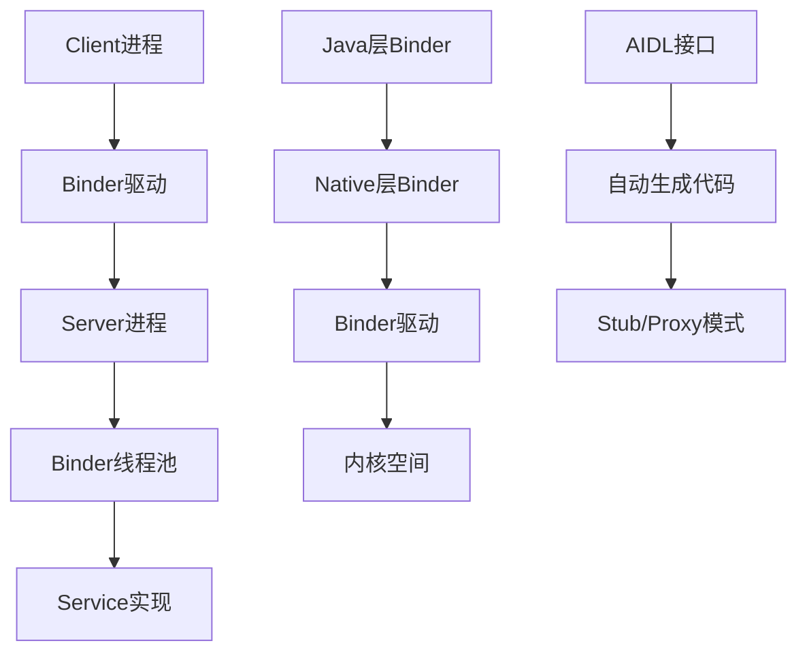
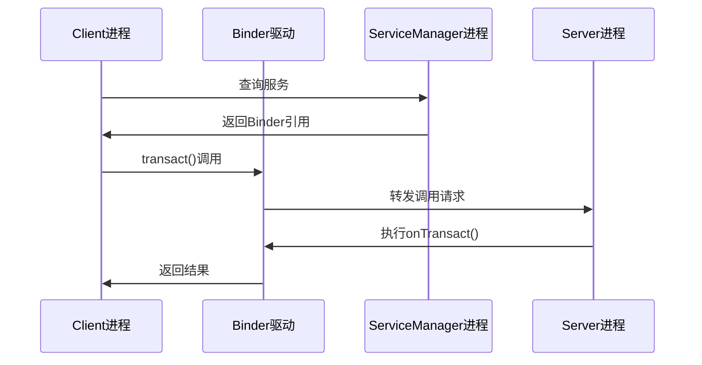
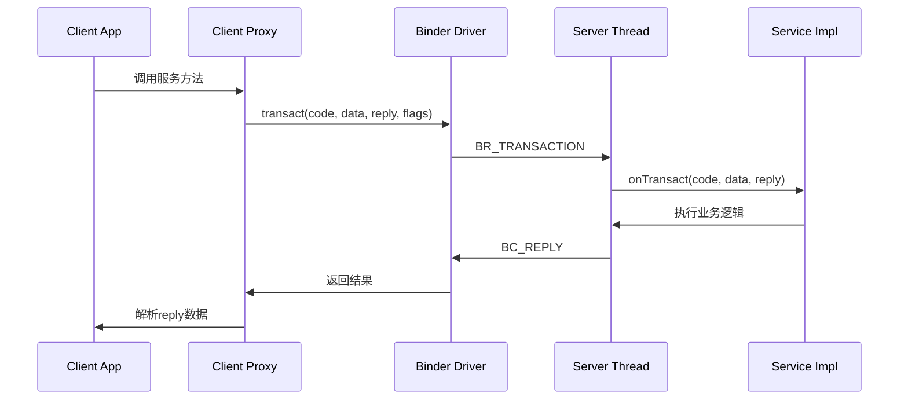
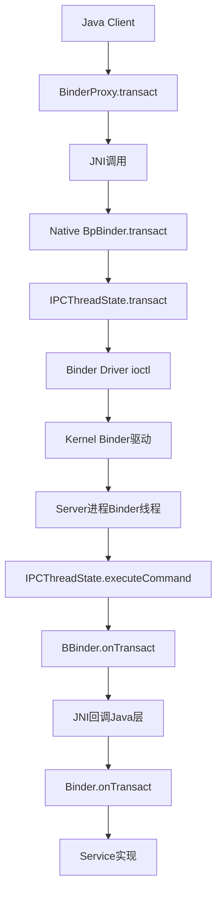
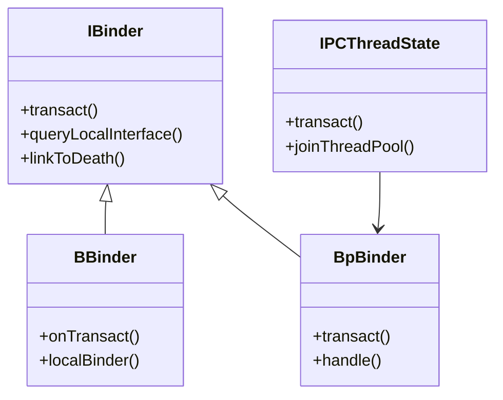
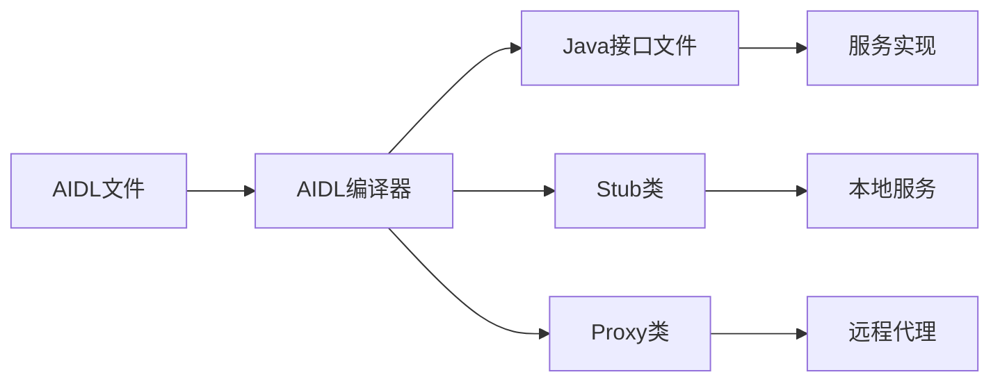

# 📋 Binder IPC机制源码分析报告

## 🏗️ 1. Binder架构概览

Binder是Android系统的核心IPC（进程间通信）机制，采用Client-Server架构：



## 📁 2. 源码目录结构分析

### 核心目录分布：

**Java Framework层：**
- `/base/core/java/android/os/` - Binder核心接口和类
- `/base/core/java/com/android/internal/os/` - Binder内部实现

**Native层实现：**
- `/native/libs/binder/` - C++ Binder库核心实现
- `/native/libs/binder/include/` - 头文件定义

### 关键文件统计：
- **Java文件**：约50+个Binder相关类
- **Native文件**：约80+个C++实现文件
- **AIDL接口**：数百个系统服务接口定义

## 🔧 3. Binder核心机制分析

### 3.1 进程间通信流程

**Binder调用链：**


### 3.2 详细调用时序图

**完整的Binder调用时序：**


### 3.3 跨层调用链分析

**Java到Native的完整调用链：**


### 3.4 核心接口设计

**IBinder接口**（[IBinder.java](file:///Users/yuchuan/CodeMX/MX/AOSP_Frameworks/base/core/java/android/os/IBinder.java)）：
- `transact()` - 核心通信方法
- `queryLocalInterface()` - 本地接口查询
- `linkToDeath()` - 死亡通知机制

**Binder类**（[Binder.java](file:///Users/yuchuan/CodeMX/MX/AOSP_Frameworks/base/core/java/android/os/Binder.java)）：
- 实现IBinder接口的基类
- 提供本地Binder对象实现
- 管理死亡通知和事务处理

**Native层IBinder接口**（[IBinder.h](file:///Users/yuchuan/CodeMX/MX/AOSP_Frameworks/native/libs/binder/include/binder/IBinder.h)）：
- C++层的Binder接口定义
- 定义事务码常量（FIRST_CALL_TRANSACTION, LAST_CALL_TRANSACTION等）
- 定义事务标志（FLAG_ONEWAY, FLAG_CLEAR_BUF等）

## 🏛️ 4. Native层实现架构

### 4.1 核心类层次结构



### 4.2 关键组件分析

**IPCThreadState**（[IPCThreadState.cpp](file:///Users/yuchuan/CodeMX/MX/AOSP_Frameworks/native/libs/binder/IPCThreadState.cpp#L919)）：
- 每个线程的Binder状态管理
- 负责Binder事务的发送和接收
- 维护线程本地存储
- 核心方法：`transact()`, `waitForResponse()`, `joinThreadPool()`

**ProcessState**（[ProcessState.cpp](file:///Users/yuchuan/CodeMX/MX/AOSP_Frameworks/native/libs/binder/ProcessState.cpp)）：
- 进程级别的Binder状态管理
- 打开Binder驱动设备（`/dev/binder`）
- 管理Binder线程池
- 使用`mmap`映射Binder内存（1MB - 2页）

**BpBinder**（[BpBinder.cpp](file:///Users/yuchuan/CodeMX/MX/AOSP_Frameworks/native/libs/binder/BpBinder.cpp#L394)）：
- 代理Binder实现，代表远程Binder对象
- 持有Binder句柄（handle）
- 通过IPCThreadState发送事务

**BBinder**（[Binder.cpp](file:///Users/yuchuan/CodeMX/MX/AOSP_Frameworks/native/libs/binder/Binder.cpp#L850)）：
- 本地Binder实现，代表服务端Binder对象
- 实现`onTransact()`处理事务
- 服务实现的基类

## 🔄 5. Java层Binder框架

### 5.1 Java-Native桥接

**BinderInternal**（[BinderInternal.java](file:///Users/yuchuan/CodeMX/MX/AOSP_Frameworks/base/core/java/com/android/internal/os/BinderInternal.java)）：
- 提供Java层与Native层的桥梁
- 管理Binder调用统计和监控
- 处理Binder死亡通知

### 5.2 服务管理机制

**ServiceManager**（[ServiceManager.java](file:///Users/yuchuan/CodeMX/MX/AOSP_Frameworks/base/core/java/android/os/ServiceManager.java)）：
- 系统服务的注册和查询
- 维护服务名到Binder引用的映射
- 提供跨进程服务访问接口

## 📝 6. AIDL接口和代码生成

### 6.1 AIDL编译流程



### 6.2 生成的代码结构

**典型AIDL生成模式：**
```java
// 生成的接口
public interface IMyService extends android.os.IInterface {
    // 方法声明
}

// Stub类 - 服务端实现基类  
public static abstract class Stub extends android.os.Binder implements IMyService {
    // 事务处理逻辑
}

// Proxy类 - 客户端代理
private static class Proxy implements IMyService {
    // 远程调用封装
}
```

## ⚡ 7. 性能优化机制

### 7.1 内存管理优化

**Binder内存映射**：
- 使用`mmap`实现零拷贝数据传输
- 共享内存区域减少数据拷贝开销
- 高效的内存回收机制

**事务缓冲区管理**：
- 固定大小的传输缓冲区
- 避免频繁的内存分配
- 支持大数据的分片传输

### 7.2 线程池优化

**Binder线程池**：
- 动态线程创建和回收
- 负载均衡机制
- 避免线程饥饿问题

## 🔍 8. 安全机制分析

### 8.1 权限验证

**Binder调用权限检查**：
- 基于UID/PID的身份验证
- 权限标签验证机制
- 调用链权限传播

### 8.2 数据安全

**Parcel数据安全**：
- 序列化/反序列化安全检查
- 恶意数据注入防护
- 内存越界访问保护

## 📊 9. 监控和调试机制

### 9.1 性能监控

**Binder调用统计**：
- 调用次数和耗时统计
- 调用链跟踪分析
- 性能瓶颈检测

### 9.2 调试工具

**Binder调试接口**：
- `dumpsys binder`命令
- 事务状态监控
- 内存使用分析

## 🎯 10. 关键源码文件总结

### 核心实现文件：

**Java层：**
| 文件 | 路径 | 说明 |
|------|------|------|
| IBinder.java | [base/core/java/android/os/IBinder.java](file:///Users/yuchuan/CodeMX/MX/AOSP_Frameworks/base/core/java/android/os/IBinder.java) | Binder接口定义 |
| Binder.java | [base/core/java/android/os/Binder.java](file:///Users/yuchuan/CodeMX/MX/AOSP_Frameworks/base/core/java/android/os/Binder.java) | Binder基类实现 |
| BinderProxy.java | [base/core/java/android/os/BinderProxy.java](file:///Users/yuchuan/CodeMX/MX/AOSP_Frameworks/base/core/java/android/os/BinderProxy.java) | Binder代理类 |
| ServiceManager.java | [base/core/java/android/os/ServiceManager.java](file:///Users/yuchuan/CodeMX/MX/AOSP_Frameworks/base/core/java/android/os/ServiceManager.java) | 服务管理 |
| BinderInternal.java | [base/core/java/com/android/internal/os/BinderInternal.java](file:///Users/yuchuan/CodeMX/MX/AOSP_Frameworks/base/core/java/com/android/internal/os/BinderInternal.java) | 内部工具类 |

**Native层：**
| 文件 | 路径 | 说明 |
|------|------|------|
| IBinder.h | [native/libs/binder/include/binder/IBinder.h](file:///Users/yuchuan/CodeMX/MX/AOSP_Frameworks/native/libs/binder/include/binder/IBinder.h) | C++接口定义 |
| BpBinder.cpp | [native/libs/binder/BpBinder.cpp](file:///Users/yuchuan/CodeMX/MX/AOSP_Frameworks/native/libs/binder/BpBinder.cpp) | 代理Binder实现 |
| Binder.cpp | [native/libs/binder/Binder.cpp](file:///Users/yuchuan/CodeMX/MX/AOSP_Frameworks/native/libs/binder/Binder.cpp) | 本地Binder实现 |
| IPCThreadState.cpp | [native/libs/binder/IPCThreadState.cpp](file:///Users/yuchuan/CodeMX/MX/AOSP_Frameworks/native/libs/binder/IPCThreadState.cpp) | 线程状态管理 |
| ProcessState.cpp | [native/libs/binder/ProcessState.cpp](file:///Users/yuchuan/CodeMX/MX/AOSP_Frameworks/native/libs/binder/ProcessState.cpp) | 进程状态管理 |

## 🔮 11. 架构演进趋势

### 新特性发展：

**RPC Binder**：
- 基于网络传输的远程Binder
- 支持跨设备通信
- 增强的安全机制

**性能优化**：
- 异步Binder调用支持
- 批量事务处理优化
- 内存使用效率提升

## 🔍 12. 关键源码分析

### 12.1 transact方法实现

#### Java层BinderProxy.transact()

**源码位置**：[BinderProxy.java:590-630](file:///Users/yuchuan/CodeMX/MX/AOSP_Frameworks/base/core/java/android/os/BinderProxy.java#L590)

```java
public boolean transact(int code, Parcel data, Parcel reply, int flags) 
        throws RemoteException {
    // ... 省略AppOps处理和Tracing逻辑 ...
    
    try {
        // 调用Native方法
        final boolean result = transactNative(code, data, reply, flags);
        
        if (reply != null && !warnOnBlocking) {
            reply.addFlags(Parcel.FLAG_IS_REPLY_FROM_BLOCKING_ALLOWED_OBJECT);
        }
        
        return result;
    } finally {
        // ... 清理逻辑 ...
    }
}

// Native方法声明
public native boolean transactNative(int code, Parcel data, Parcel reply,
        int flags) throws RemoteException;
```

#### Native层BpBinder.transact()

**源码位置**：[BpBinder.cpp:394-448](file:///Users/yuchuan/CodeMX/MX/AOSP_Frameworks/native/libs/binder/BpBinder.cpp#L394)

```cpp
status_t BpBinder::transact(
    uint32_t code, const Parcel& data, Parcel* reply, uint32_t flags)
{
    // 检查Binder是否存活
    if (mAlive) {
        bool privateVendor = flags & FLAG_PRIVATE_VENDOR;
        flags = flags & ~static_cast<uint32_t>(FLAG_PRIVATE_VENDOR);

        // 检查稳定性级别
        if (code >= FIRST_CALL_TRANSACTION && code <= LAST_CALL_TRANSACTION) {
            using android::internal::Stability;
            int16_t stability = Stability::getRepr(this);
            Stability::Level required = privateVendor ? Stability::VENDOR
                : Stability::getLocalLevel();
            if (!Stability::check(stability, required)) [[unlikely]] {
                return BAD_TYPE;
            }
        }

        status_t status;
        if (isRpcBinder()) [[unlikely]] {
            // RPC Binder路径
            status = rpcSession()->transact(sp<IBinder>::fromExisting(this), code, data, reply, flags);
        } else {
            // 传统Binder路径 - 调用IPCThreadState
            status = IPCThreadState::self()->transact(binderHandle(), code, data, reply, flags);
        }

        if (status == DEAD_OBJECT) mAlive = 0;
        return status;
    }
    return DEAD_OBJECT;
}
```

#### Native层IPCThreadState.transact()

**源码位置**：[IPCThreadState.cpp:919-995](file:///Users/yuchuan/CodeMX/MX/AOSP_Frameworks/native/libs/binder/IPCThreadState.cpp#L919)

```cpp
status_t IPCThreadState::transact(int32_t handle,
                                  uint32_t code, const Parcel& data,
                                  Parcel* reply, uint32_t flags)
{
    LOG_ALWAYS_FATAL_IF(data.isForRpc(), "Parcel constructed for RPC, but being used with binder.");

    status_t err;
    flags |= TF_ACCEPT_FDS;

    // 1. 写入事务数据到mOut
    err = writeTransactionData(BC_TRANSACTION, flags, handle, code, data, nullptr);

    if (err != NO_ERROR) {
        if (reply) reply->setError(err);
        return (mLastError = err);
    }

    // 2. 同步调用 - 等待响应
    if ((flags & TF_ONE_WAY) == 0) {
        // 检查调用限制
        if (mCallRestriction != ProcessState::CallRestriction::NONE) [[unlikely]] {
            // ... 限制检查逻辑 ...
        }

        if (reply) {
            err = waitForResponse(reply);
        } else {
            Parcel fakeReply;
            err = waitForResponse(&fakeReply);
        }
    } else {
        // 3. 异步调用 - 不等待响应
        err = waitForResponse(nullptr, nullptr);
    }

    return err;
}
```

#### Native层BBinder.onTransact()

**源码位置**：[Binder.cpp:850-904](file:///Users/yuchuan/CodeMX/MX/AOSP_Frameworks/native/libs/binder/Binder.cpp#L850)

```cpp
status_t BBinder::onTransact(
    uint32_t code, const Parcel& data, Parcel* reply, uint32_t /*flags*/)
{
    switch (code) {
        case INTERFACE_TRANSACTION:
            reply->writeString16(getInterfaceDescriptor());
            return NO_ERROR;

        case DUMP_TRANSACTION: {
            int fd = data.readFileDescriptor();
            int argc = data.readInt32();
            Vector<String16> args;
            for (int i = 0; i < argc && data.dataAvail() > 0; i++) {
               args.add(data.readString16());
            }
            return dump(fd, args);
        }

        case SHELL_COMMAND_TRANSACTION: {
            // Shell命令处理
            // ...
            return NO_ERROR;
        }

        default:
            return UNKNOWN_TRANSACTION;
    }
}
```

### 12.2 Binder驱动通信协议

#### Binder命令协议

**用户空间到内核空间的命令（BC_XXX）：**

| 命令 | 说明 |
|------|------|
| BC_TRANSACTION | 发起事务调用 |
| BC_REPLY | 回复事务 |
| BC_ACQUIRE | 增加强引用计数 |
| BC_RELEASE | 减少强引用计数 |
| BC_INCREFS | 增加弱引用计数 |
| BC_DECREFS | 减少弱引用计数 |
| BC_ENTER_LOOPER | 进入Looper循环 |
| BC_EXIT_LOOPER | 退出Looper循环 |
| BC_REQUEST_DEATH_NOTIFICATION | 注册死亡通知 |

**内核空间到用户空间的命令（BR_XXX）：**

| 命令 | 说明 |
|------|------|
| BR_TRANSACTION | 接收事务请求 |
| BR_REPLY | 接收事务回复 |
| BR_ACQUIRE | 强引用请求 |
| BR_RELEASE | 强引用释放 |
| BR_INCREFS | 弱引用请求 |
| BR_DECREFS | 弱引用释放 |
| BR_DEAD_BINDER | Binder死亡通知 |
| BR_FAILED_REPLY | 事务失败 |

#### 核心数据结构

**binder_transaction_data结构：**
```c
struct binder_transaction_data {
    union {
        size_t handle;  // 目标Binder句柄（代理端使用）
        void *ptr;      // 本地Binder指针（服务端使用）
    } target;
    void *cookie;       // 私有数据（BBinder指针）
    unsigned int code;  // 事务码（方法ID）
    unsigned int flags; // 事务标志
    pid_t sender_pid;   // 发送者PID
    uid_t sender_euid;  // 发送者EUID
    size_t data_size;   // 数据大小
    size_t offsets_size;// Binder对象偏移大小
    union {
        struct {
            const void *buffer; // 数据缓冲区
            const void *offsets;// Binder对象偏移数组
        } ptr;
        uint8_t buf[8];
    } data;
};
```

#### 事务标志

| 标志 | 值 | 说明 |
|------|-----|------|
| TF_ONE_WAY | 0x01 | 单向调用，不等待回复 |
| TF_ROOT_OBJECT | 0x04 | 数据包含根对象 |
| TF_STATUS_CODE | 0x08 | 数据包含状态码 |
| TF_ACCEPT_FDS | 0x10 | 允许传递文件描述符 |
| TF_CLEAR_BUF | 0x20 | 清除缓冲区 |

## 📊 13. 性能指标分析

### 13.1 性能基准数据

**典型Binder调用开销：**
- **本地调用**：< 1μs
- **跨进程调用**：50-200μs
- **内存拷贝开销**：接近零拷贝
- **线程切换开销**：最小化

### 13.2 优化策略

**减少Binder调用次数：**
- 批量操作接口设计
- 异步回调机制
- 数据缓存策略

**优化数据传输：**
- 使用Parcel高效序列化
- 避免大数据传输
- 合理使用FLAG_ONEWAY

## 🛠️ 14. 开发实践指南

### 14.1 服务设计原则

**接口设计最佳实践：**
- 接口方法粒度适中
- 避免频繁的小数据调用
- 合理使用异步接口

**错误处理策略：**
- 完善的异常处理机制
- 服务可用性检查
- 超时和重试机制

### 14.2 调试和监控

**调试工具使用：**
```bash
# 查看Binder调用统计
adb shell dumpsys binder

# 监控Binder事务
adb shell cat /sys/kernel/debug/binder/transactions

# 分析Binder内存使用
adb shell cat /sys/kernel/debug/binder/stats
```

## 🎯 15. 总结

### 技术亮点：
1. **高效的内存管理**：零拷贝传输机制，使用mmap映射共享内存
2. **完善的线程模型**：动态线程池管理，支持递归调用
3. **强大的安全机制**：多层级权限验证，UID/PID身份认证
4. **灵活的扩展性**：支持传统Binder和RPC Binder两种传输协议

### 核心调用链总结：

```
Client调用链：
Java BinderProxy.transact()
  → JNI transactNative()
  → Native BpBinder.transact()
  → IPCThreadState.transact()
  → writeTransactionData(BC_TRANSACTION)
  → waitForResponse()
  → talkWithDriver() [ioctl]

Server处理链：
IPCThreadState.executeCommand(BR_TRANSACTION)
  → BBinder.transact()
  → BBinder.onTransact()
  → JNI回调 Java Binder.execTransact()
  → Java Binder.onTransact()
  → Service实现方法
```

### 应用场景：
- 系统服务通信（ActivityManager, WindowManager等）
- 应用间数据共享（ContentProvider）
- 组件间解耦（Messenger, AIDL）
- 跨进程事件通知（Observer模式）

---

**分析时间：** 2026-02-12  
**源码版本：** AOSP 16  
**分析范围：** Framework层Binder机制完整分析