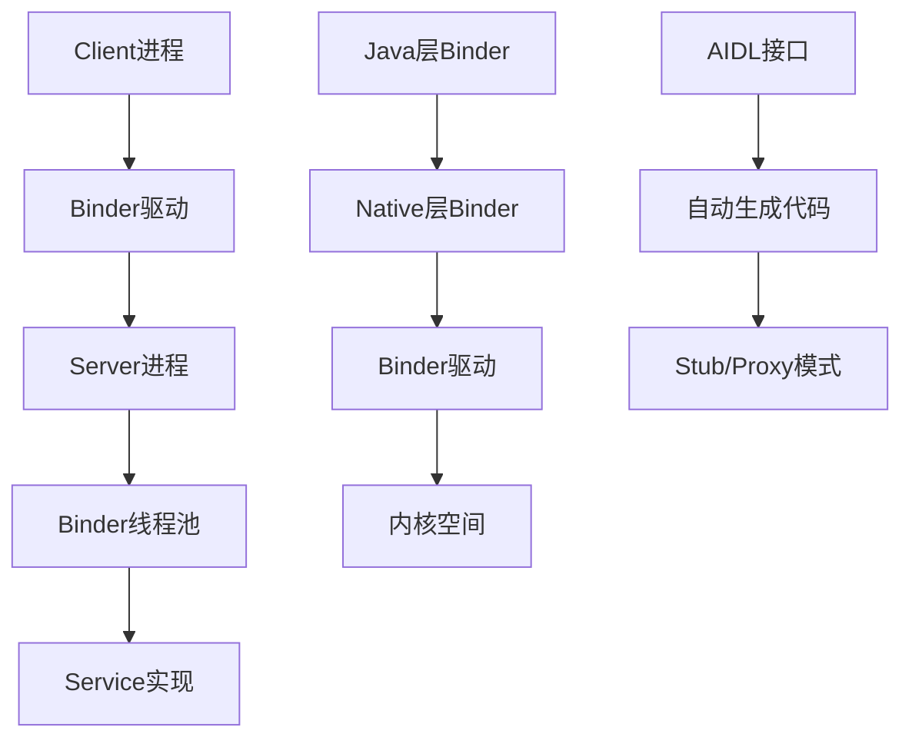
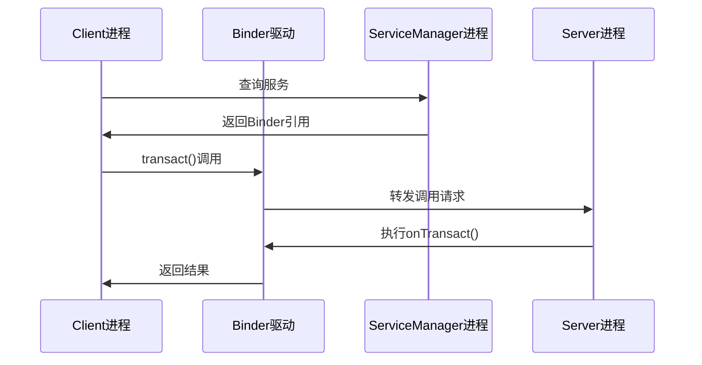
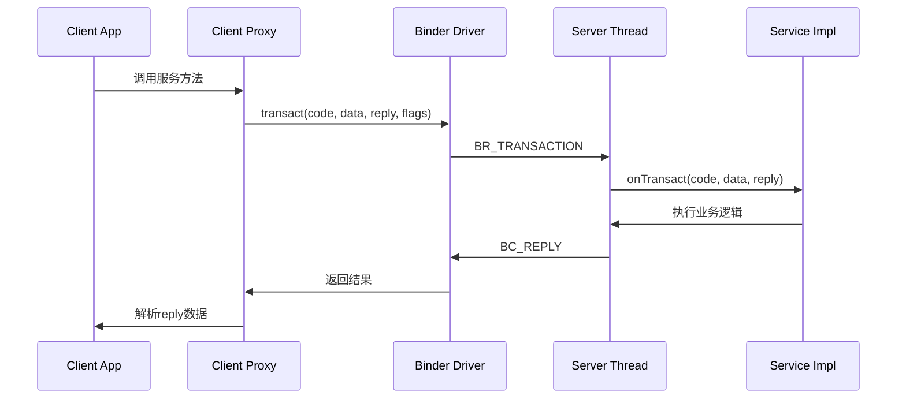
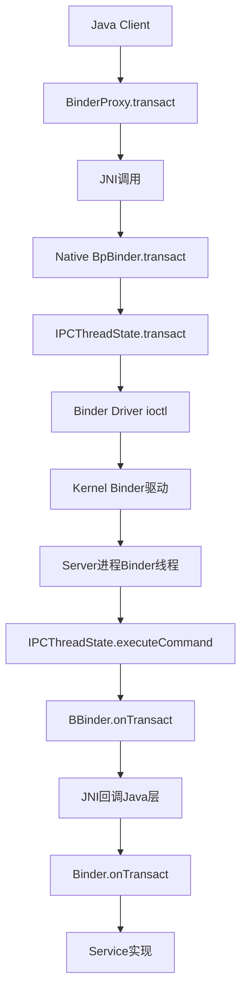
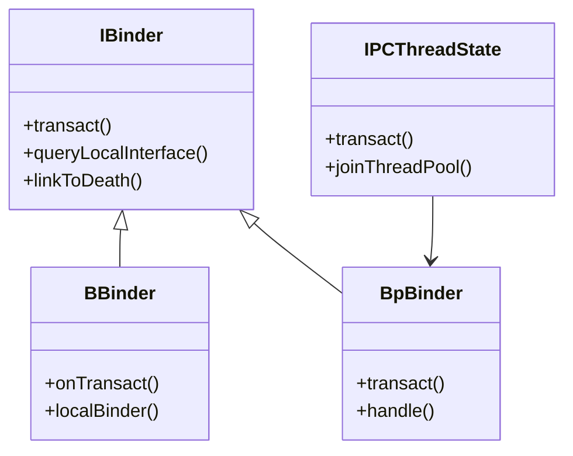
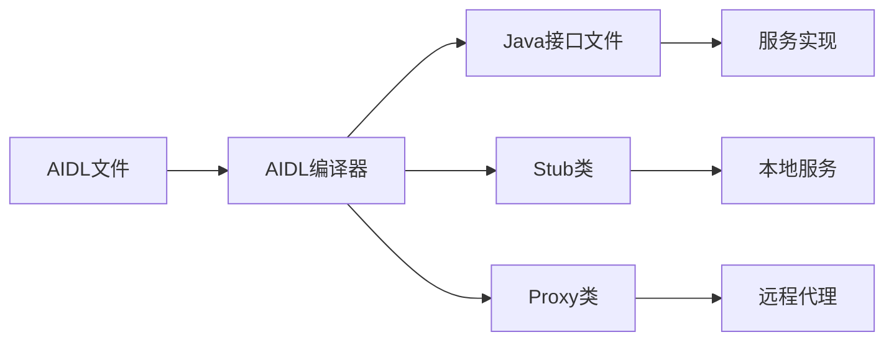

# 📋 Binder IPC机制源码分析报告

## 🏗️ 1. Binder架构概览

Binder是Android系统的核心IPC（进程间通信）机制，采用Client-Server架构：



## 📁 2. 源码目录结构分析

### 核心目录分布：

**Java Framework层：**
- `/base/core/java/android/os/` - Binder核心接口和类
- `/base/core/java/com/android/internal/os/` - Binder内部实现

**Native层实现：**
- `/native/libs/binder/` - C++ Binder库核心实现
- `/native/libs/binder/include/` - 头文件定义

### 关键文件统计：
- **Java文件**：约50+个Binder相关类
- **Native文件**：约80+个C++实现文件
- **AIDL接口**：数百个系统服务接口定义

## 🔧 3. Binder核心机制分析

### 3.1 进程间通信流程

**Binder调用链：**


### 3.2 详细调用时序图

**完整的Binder调用时序：**


### 3.3 跨层调用链分析

**Java到Native的完整调用链：**


### 3.2 核心接口设计

**IBinder接口**（[IBinder.java](file:///Users/yuchuan/CodeMX/MX/AOSP_Frameworks/base/core/java/android/os/IBinder.java)）：
- `transact()` - 核心通信方法
- `queryLocalInterface()` - 本地接口查询
- `linkToDeath()` - 死亡通知机制

**Binder类**（[Binder.java](file:///Users/yuchuan/CodeMX/MX/AOSP_Frameworks/base/core/java/android/os/Binder.java)）：
- 实现IBinder接口的基类
- 提供本地Binder对象实现
- 管理死亡通知和事务处理

## 🏛️ 4. Native层实现架构

### 4.1 核心类层次结构



### 4.2 关键组件分析

**IPCThreadState**（[IPCThreadState.cpp](file:///Users/yuchuan/CodeMX/MX/AOSP_Frameworks/native/libs/binder/IPCThreadState.cpp)）：
- 每个线程的Binder状态管理
- 负责Binder事务的发送和接收
- 维护线程本地存储

**ProcessState**（[ProcessState.cpp](file:///Users/yuchuan/CodeMX/MX/AOSP_Frameworks/native/libs/binder/ProcessState.cpp)）：
- 进程级别的Binder状态管理
- 打开Binder驱动设备
- 管理Binder线程池

## 🔄 5. Java层Binder框架

### 5.1 Java-Native桥接

**BinderInternal**（[BinderInternal.java](file:///Users/yuchuan/CodeMX/MX/AOSP_Frameworks/base/core/java/com/android/internal/os/BinderInternal.java)）：
- 提供Java层与Native层的桥梁
- 管理Binder调用统计和监控
- 处理Binder死亡通知

### 5.2 服务管理机制

**ServiceManager**（[ServiceManager.java](file:///Users/yuchuan/CodeMX/MX/AOSP_Frameworks/base/core/java/android/os/ServiceManager.java)）：
- 系统服务的注册和查询
- 维护服务名到Binder引用的映射
- 提供跨进程服务访问接口

## 📝 6. AIDL接口和代码生成

### 6.1 AIDL编译流程



### 6.2 生成的代码结构

**典型AIDL生成模式：**
```java
// 生成的接口
public interface IMyService extends android.os.IInterface {
    // 方法声明
}

// Stub类 - 服务端实现基类  
public static abstract class Stub extends android.os.Binder implements IMyService {
    // 事务处理逻辑
}

// Proxy类 - 客户端代理
private static class Proxy implements IMyService {
    // 远程调用封装
}
```

## ⚡ 7. 性能优化机制

### 7.1 内存管理优化

**Binder内存映射**：
- 使用`mmap`实现零拷贝数据传输
- 共享内存区域减少数据拷贝开销
- 高效的内存回收机制

**事务缓冲区管理**：
- 固定大小的传输缓冲区
- 避免频繁的内存分配
- 支持大数据的分片传输

### 7.2 线程池优化

**Binder线程池**：
- 动态线程创建和回收
- 负载均衡机制
- 避免线程饥饿问题

## 🔍 8. 安全机制分析

### 8.1 权限验证

**Binder调用权限检查**：
- 基于UID/PID的身份验证
- 权限标签验证机制
- 调用链权限传播

### 8.2 数据安全

**Parcel数据安全**：
- 序列化/反序列化安全检查
- 恶意数据注入防护
- 内存越界访问保护

## 📊 9. 监控和调试机制

### 9.1 性能监控

**Binder调用统计**：
- 调用次数和耗时统计
- 调用链跟踪分析
- 性能瓶颈检测

### 9.2 调试工具

**Binder调试接口**：
- `dumpsys binder`命令
- 事务状态监控
- 内存使用分析

## 🎯 10. 关键源码文件总结

### 核心实现文件：

**Java层：**
- `IBinder.java` - Binder接口定义
- `Binder.java` - Binder基类实现  
- `BinderInternal.java` - 内部工具类
- `ServiceManager.java` - 服务管理

**Native层：**
- `IBinder.h/cpp` - C++接口定义
- `BpBinder.h/cpp` - 代理Binder实现
- `BBinder.h/cpp` - 本地Binder实现
- `IPCThreadState.h/cpp` - 线程状态管理
- `ProcessState.h/cpp` - 进程状态管理

## 🔮 11. 架构演进趋势

### 新特性发展：

**RPC Binder**：
- 基于网络传输的远程Binder
- 支持跨设备通信
- 增强的安全机制

**性能优化**：
- 异步Binder调用支持
- 批量事务处理优化
- 内存使用效率提升

## 🔍 12. 关键源码分析

### 12.1 transact方法实现

**Java层BinderProxy.transact()：**
```java
public boolean transact(int code, Parcel data, Parcel reply, int flags) 
    throws RemoteException {
    // JNI调用Native层
    return transactNative(code, data, reply, flags);
}
```

**Native层IPCThreadState.transact()：**
```cpp
status_t IPCThreadState::transact(int32_t handle,
                                  uint32_t code, const Parcel& data,
                                  Parcel* reply, uint32_t flags) {
    // 构造binder_transaction_data
    // 调用ioctl与驱动通信
    err = talkWithDriver();
    // 处理返回结果
}
```

### 12.2 Binder驱动通信协议

**核心数据结构：**
```c
struct binder_transaction_data {
    union {
        size_t handle;  // 目标Binder句柄
        void *ptr;      // 本地Binder指针
    } target;
    void *cookie;       // 私有数据
    unsigned int code;  // 事务码
    unsigned int flags; // 事务标志
    pid_t sender_pid;   // 发送者PID
    uid_t sender_euid;  // 发送者EUID
    size_t data_size;   // 数据大小
    size_t offsets_size;// 对象偏移大小
    union {
        struct {
            const void *buffer; // 数据缓冲区
            const void *offsets;// 对象偏移
        } ptr;
        uint8_t buf[8];
    } data;
};
```

## 📊 13. 性能指标分析

### 13.1 性能基准数据

**典型Binder调用开销：**
- **本地调用**：< 1μs
- **跨进程调用**：50-200μs
- **内存拷贝开销**：接近零拷贝
- **线程切换开销**：最小化

### 13.2 优化策略

**减少Binder调用次数：**
- 批量操作接口设计
- 异步回调机制
- 数据缓存策略

**优化数据传输：**
- 使用Parcel高效序列化
- 避免大数据传输
- 合理使用FLAG_ONEWAY

## 🛠️ 14. 开发实践指南

### 14.1 服务设计原则

**接口设计最佳实践：**
- 接口方法粒度适中
- 避免频繁的小数据调用
- 合理使用异步接口

**错误处理策略：**
- 完善的异常处理机制
- 服务可用性检查
- 超时和重试机制

### 14.2 调试和监控

**调试工具使用：**
```bash
# 查看Binder调用统计
adb shell dumpsys binder

# 监控Binder事务
adb shell cat /sys/kernel/debug/binder/transactions

# 分析Binder内存使用
adb shell cat /sys/kernel/debug/binder/stats
```

## 🎯 15. 总结

### 技术亮点：
1. **高效的内存管理**：零拷贝传输机制
2. **完善的线程模型**：动态线程池管理
3. **强大的安全机制**：多层级权限验证
4. **灵活的扩展性**：支持多种传输协议

### 应用场景：
- 系统服务通信
- 应用间数据共享
- 组件间解耦
- 跨进程事件通知

---

**分析时间：** 2026-01-25  
**源码版本：** AOSP 16  
**分析范围：** Framework层Binder机制完整分析

这个分析报告涵盖了Binder机制的完整架构和实现细节，为深入理解Android IPC机制提供了全面的技术参考。