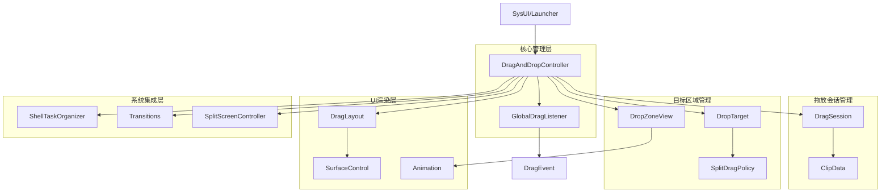
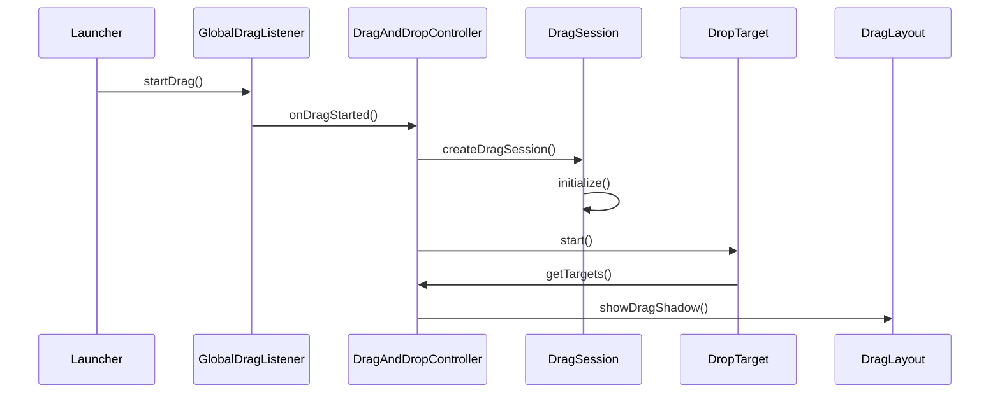
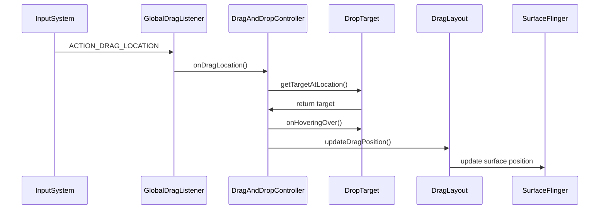
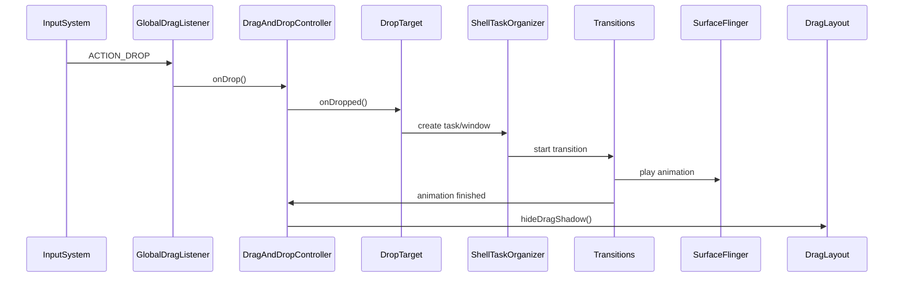

# AOSP DragAndDrop 源码架构与流程深度分析

## 概述

DragAndDrop是Android WindowManager Shell中的重要组件，负责处理全局拖放操作，支持应用图标拖放、分屏拖放、桌面模式拖放等高级功能。本文基于AOSP 16源码，深入分析DragAndDrop的完整架构和核心流程。

## 整体架构图



## 核心组件深度分析

### 1. DragAndDropController - 拖放系统核心控制器

**文件**: `DragAndDropController.java`

DragAndDropController是拖放系统的总入口，负责协调所有拖放操作：

```java
/**
 * 处理Shell的全局拖放操作
 */
public class DragAndDropController implements RemoteCallable<DragAndDropController>,
        GlobalDragListener.GlobalDragListenerCallback,
        DisplayController.OnDisplaysChangedListener,
        ShellTaskOrganizer.TaskVanishedListener,
        View.OnDragListener, ComponentCallbacks2 {
    
    private static final String TAG = DragAndDropController.class.getSimpleName();
    
    // 核心依赖组件
    private final Context mContext;
    private final ShellController mShellController;
    private final ShellCommandHandler mShellCommandHandler;
    private final ShellTaskOrganizer mShellTaskOrganizer;
    private final DisplayController mDisplayController;
    private final DragAndDropEventLogger mLogger;
    private final GlobalDragListener mGlobalDragListener;
    private final Transitions mTransitions;
    
    // 按显示器管理的拖放目标
    private final SparseArray<PerDisplay> mDisplayDropTargets = new SparseArray<>();
    
    // 当前活动的拖放显示器
    private int mActiveDragDisplay = -1;
    
    public DragAndDropController(Context context,
            ShellInit shellInit,
            ShellController shellController,
            ShellCommandHandler shellCommandHandler,
            ShellTaskOrganizer shellTaskOrganizer,
            DisplayController displayController,
            UiEventLogger uiEventLogger,
            IconProvider iconProvider,
            GlobalDragListener globalDragListener,
            Transitions transitions,
            Lazy<DragToBubbleController> dragToBubbleControllerLazy,
            ShellExecutor mainExecutor,
            DesktopState desktopState) {
        
        mContext = context;
        mShellController = shellController;
        mShellCommandHandler = shellCommandHandler;
        mShellTaskOrganizer = shellTaskOrganizer;
        mDisplayController = displayController;
        mLogger = new DragAndDropEventLogger(uiEventLogger);
        mGlobalDragListener = globalDragListener;
        mTransitions = transitions;
        
        // 注册初始化回调
        shellInit.addInitCallback(this::onInit, this);
    }
    
    /**
     * 控制器初始化
     */
    public void onInit() {
        // 注册显示器监听器
        mDisplayController.addDisplayWindowListener(this);
        
        // 注册外部接口
        mShellController.addExternalInterface(IDragAndDrop.DESCRIPTOR,
                this::createExternalInterface, this);
        
        // 注册任务消失监听器
        mShellTaskOrganizer.addTaskVanishedListener(this);
        
        // 设置全局拖放监听器
        mGlobalDragListener.setListener(this);
    }
    
    /**
     * 处理拖放事件的核心方法
     */
    @Override
    public boolean onDrag(View v, DragEvent event) {
        final int action = event.getAction();
        
        switch (action) {
            case DragEvent.ACTION_DRAG_STARTED:
                return onDragStarted(event);
            case DragEvent.ACTION_DRAG_ENTERED:
                return onDragEntered(event);
            case DragEvent.ACTION_DRAG_LOCATION:
                return onDragLocation(event);
            case DragEvent.ACTION_DRAG_EXITED:
                return onDragExited(event);
            case DragEvent.ACTION_DROP:
                return onDrop(event);
            case DragEvent.ACTION_DRAG_ENDED:
                return onDragEnded(event);
            default:
                return false;
        }
    }
    
    /**
     * 拖放开始处理
     */
    private boolean onDragStarted(DragEvent event) {
        // 创建拖放会话
        final DragSession session = createDragSession(event);
        
        // 初始化会话数据
        session.initialize(false);
        
        // 设置活动拖放显示器
        mActiveDragDisplay = event.getDisplayId();
        
        // 通知监听器
        for (DragAndDropListener listener : mListeners) {
            listener.onDragStarted();
        }
        
        return true;
    }
}
```

### 2. DragSession - 拖放会话数据管理

**文件**: `DragSession.java`

DragSession管理单个拖放操作的所有数据状态：

```java
/**
 * 每个拖放会话的数据管理
 */
public class DragSession {
    private final ActivityTaskManager mActivityTaskManager;
    @Nullable
    private final ClipData mInitialDragData;
    private final int mInitialDragFlags;
    
    // 显示布局信息
    final DisplayLayout displayLayout;
    
    // 应用信息
    @Nullable
    ActivityInfo activityInfo;
    
    // 拖放数据
    @Nullable
    Intent appData;
    @Nullable
    PendingIntent launchableIntent;
    
    // 运行任务信息
    ActivityManager.RunningTaskInfo runningTaskInfo;
    int runningTaskWinMode = WINDOWING_MODE_UNDEFINED;
    int runningTaskActType = ACTIVITY_TYPE_STANDARD;
    
    // 拖放支持特性
    boolean dragItemSupportsSplitscreen;
    final int hideDragSourceTaskId;
    
    public DragSession(ActivityTaskManager activityTaskManager,
            DisplayLayout dispLayout, ClipData data, int dragFlags) {
        mActivityTaskManager = activityTaskManager;
        mInitialDragData = data;
        mInitialDragFlags = dragFlags;
        displayLayout = dispLayout;
        
        // 提取拖放源任务ID
        hideDragSourceTaskId = data != null && data.getDescription().getExtras() != null
                ? data.getDescription().getExtras().getInt(EXTRA_HIDE_DRAG_SOURCE_TASK_ID, -1)
                : -1;
    }
    
    /**
     * 更新运行任务信息
     */
    void updateRunningTask() {
        final boolean hideDragSourceTask = hideDragSourceTaskId != -1;
        final List<ActivityManager.RunningTaskInfo> tasks =
                mActivityTaskManager.getTasks(5, false);
        
        for (int i = 0; i < tasks.size(); i++) {
            final ActivityManager.RunningTaskInfo task = tasks.get(i);
            
            // 跳过隐藏的拖放源任务
            if (hideDragSourceTask && hideDragSourceTaskId == task.taskId) {
                continue;
            }
            
            if (!task.isVisible || task.configuration.windowConfiguration.isAlwaysOnTop()) {
                // 跳过不可见或始终置顶的任务
                continue;
            }
            
            runningTaskInfo = task;
            runningTaskWinMode = task.getWindowingMode();
            runningTaskActType = task.getActivityType();
            break;
        }
    }
    
    /**
     * 初始化会话数据
     */
    void initialize(boolean skipUpdateRunningTask) {
        if (!skipUpdateRunningTask) {
            updateRunningTask();
        }
        
        // 提取活动信息
        activityInfo = mInitialDragData.getItemAt(0).getActivityInfo();
        
        // 检查是否支持分屏
        dragItemSupportsSplitscreen = activityInfo == null
                || ActivityInfo.isResizeableMode(activityInfo.resizeMode);
        
        // 提取应用数据
        appData = DragUtils.isAppDrag(getClipDescription())
                ? mInitialDragData.getItemAt(0).getIntent()
                : null;
        
        // 提取可启动意图
        launchableIntent = appData != null
                ? null
                : DragUtils.getLaunchIntent(mInitialDragData, mInitialDragFlags);
    }
}
```

### 3. DropTarget - 拖放目标接口定义

**文件**: `DropTarget.kt`

DropTarget定义了拖放目标的行为接口：

```kotlin
/**
 * 为Shell中的DragAndDrop提供拖放目标的接口
 */
interface DropTarget {
    
    /**
     * 在拖放开始前调用，处理输入事件之前
     */
    fun start(dragSession: DragSession, logSessionId: InstanceId)
    
    /**
     * 根据显示边界中的坐标获取对应的目标
     */
    fun getTargetAtLocation(x: Int, y: Int) : SplitDragPolicy.Target
    
    /**
     * 返回当前拖放会话的拖放目标总数
     */
    fun getNumTargets() : Int
    
    /**
     * 返回当前拖放会话要显示的目标列表
     */
    fun getTargets(insets: Insets) : List<SplitDragPolicy.Target>
    
    /**
     * 当用户在目标上悬停拖放对象时调用
     */
    fun onHoveringOver(target: SplitDragPolicy.Target?) {}
    
    /**
     * 当用户在目标上释放拖放对象时调用
     */
    fun onDropped(target: SplitDragPolicy.Target, hideTaskToken: WindowContainerToken)
}
```

### 4. DragLayout - 拖放布局和UI渲染

**文件**: `DragLayout.java`

DragLayout负责拖放操作的UI渲染和视觉效果：

```java
/**
 * 拖放操作的布局容器，管理拖放视觉效果
 */
public class DragLayout extends FrameLayout {
    
    private static final String TAG = DragLayout.class.getSimpleName();
    
    // Surface控制
    private SurfaceControl mSurfaceControl;
    private SurfaceControl.Transaction mTransaction;
    
    // 动画相关
    private ValueAnimator mDragAnimator;
    private DragShadowBuilder mShadowBuilder;
    
    public DragLayout(Context context) {
        super(context);
        init();
    }
    
    private void init() {
        // 设置窗口参数
        setWindowParams();
        
        // 初始化Surface控制
        mSurfaceControl = new SurfaceControl.Builder()
                .setName("DragLayout")
                .setOpaque(false)
                .build();
        
        mTransaction = new SurfaceControl.Transaction();
    }
    
    /**
     * 显示拖放阴影
     */
    public void showDragShadow(DragSession session, float x, float y) {
        // 创建拖放阴影
        mShadowBuilder = createShadowBuilder(session);
        
        // 开始拖放动画
        startDragAnimation(x, y);
    }
    
    /**
     * 更新拖放位置
     */
    public void updateDragPosition(float x, float y) {
        if (mDragAnimator != null && mDragAnimator.isRunning()) {
            mDragAnimator.cancel();
        }
        
        // 立即更新位置
        setTranslationX(x);
        setTranslationY(y);
        
        // 更新Surface位置
        mTransaction.setPosition(mSurfaceControl, x, y);
        mTransaction.apply();
    }
    
    /**
     * 隐藏拖放阴影
     */
    public void hideDragShadow() {
        if (mDragAnimator != null && mDragAnimator.isRunning()) {
            mDragAnimator.cancel();
        }
        
        // 执行隐藏动画
        animate().alpha(0f)
                .setDuration(200)
                .withEndAction(() -> {
                    setVisibility(View.GONE);
                    cleanup();
                })
                .start();
    }
}
```

### 5. GlobalDragListener - 全局拖放监听器

**文件**: `GlobalDragListener.kt`

GlobalDragListener负责监听系统级的拖放事件：

```kotlin
/**
 * 全局拖放监听器，拦截和处理系统拖放事件
 */
class GlobalDragListener(
    private val context: Context,
    private val mainExecutor: ShellExecutor
) {
    
    private var listener: GlobalDragListenerCallback? = null
    
    /**
     * 设置拖放监听回调
     */
    fun setListener(callback: GlobalDragListenerCallback) {
        listener = callback
        registerGlobalDragInterceptor()
    }
    
    /**
     * 注册全局拖放拦截器
     */
    private fun registerGlobalDragInterceptor() {
        try {
            val windowManager = context.getSystemService(WindowManager::class.java)
            
            // 设置全局拖放拦截标志
            val params = WindowManager.LayoutParams().apply {
                type = WindowManager.LayoutParams.TYPE_APPLICATION_OVERLAY
                flags = WindowManager.LayoutParams.FLAG_NOT_FOCUSABLE or
                        WindowManager.LayoutParams.FLAG_HARDWARE_ACCELERATED
                privateFlags = WindowManager.LayoutParams.PRIVATE_FLAG_INTERCEPT_GLOBAL_DRAG_AND_DROP
            }
            
            windowManager.addView(interceptorView, params)
        } catch (e: Exception) {
            Log.e(TAG, "Failed to register global drag interceptor", e)
        }
    }
    
    /**
     * 处理拖放事件分发
     */
    fun dispatchDragEvent(event: DragEvent): Boolean {
        return listener?.onGlobalDragEvent(event) ?: false
    }
    
    /**
     * 全局拖放监听回调接口
     */
    interface GlobalDragListenerCallback {
        fun onGlobalDragEvent(event: DragEvent): Boolean
    }
}
```

## 关键流程分析

### 1. 拖放启动流程



### 2. 拖放移动流程



### 3. 拖放释放流程



## 动画系统实现

### 1. 拖放阴影动画

DragAndDrop使用复杂的动画系统来提供流畅的拖放体验：

```java
/**
 * 拖放阴影动画供应商
 */
class DropTargetAnimSupplier {
    
    /**
     * 创建进入动画
     */
    fun createEnterAnimation(target: SplitDragPolicy.Target): Animator {
        return ObjectAnimator.ofFloat(target.view, View.ALPHA, 0f, 1f).apply {
            duration = 200
            interpolator = ACCELERATE_DECELERATE
        }
    }
    
    /**
     * 创建悬停动画
     */
    fun createHoverAnimation(target: SplitDragPolicy.Target): Animator {
        return ObjectAnimator.ofFloat(target.view, View.SCALE_X, 1f, 1.1f, 1f).apply {
            duration = 300
            interpolator = OVERSHOOT
        }
    }
}
```

### 2. SurfaceControl动画

使用SurfaceControl进行硬件加速的拖放动画：

```java
/**
 * Surface动画控制
 */
class DragZoneAnimator {
    
    private val surfaceControl: SurfaceControl
    private val transactionPool: TransactionPool
    
    /**
     * 执行拖放区域动画
     */
    fun animateDragZone(show: Boolean, bounds: Rect) {
        val transaction = transactionPool.acquire()
        
        if (show) {
            // 显示动画
            transaction.setVisibility(surfaceControl, true)
            transaction.setAlpha(surfaceControl, 0f)
            transaction.setWindowCrop(surfaceControl, bounds)
            transaction.setPosition(surfaceControl, bounds.left.toFloat(), bounds.top.toFloat())
            transaction.apply()
            
            // 渐入动画
            transaction.setAlpha(surfaceControl, 1f)
            transaction.setFrameTimelineVsync(Choreographer.getInstance().vsyncId)
            transaction.apply()
        } else {
            // 隐藏动画
            transaction.setAlpha(surfaceControl, 0f)
            transaction.setFrameTimelineVsync(Choreographer.getInstance().vsyncId)
            transaction.apply()
            
            transaction.setVisibility(surfaceControl, false)
            transaction.apply()
        }
        
        transactionPool.release(transaction)
    }
}
```

## 跨进程通信机制

### 1. AIDL接口定义

**文件**: `IDragAndDrop.aidl`

```java
/**
 * DragAndDrop的AIDL接口定义
 */
interface IDragAndDrop {
    
    /**
     * 启动拖放操作
     */
    void startDrag(in ClipData data, int flags);
    
    /**
     * 结束拖放操作
     */
    void endDrag(boolean success);
    
    /**
     * 注册拖放监听器
     */
    void registerListener(in IDragAndDropListener listener);
    
    /**
     * 取消注册拖放监听器
     */
    void unregisterListener(in IDragAndDropListener listener);
}

/**
 * 拖放监听器接口
 */
interface IDragAndDropListener {
    
    /**
     * 拖放状态变化回调
     */
    void onDragStateChanged(int state);
    
    /**
     * 拖放目标变化回调
     */
    void onDropTargetsChanged(in List<DropTargetInfo> targets);
}
```

### 2. Binder实现

```java
/**
 * IDragAndDrop的Binder实现
 */
private class IDragAndDropImpl extends IDragAndDrop.Stub {
    
    private final DragAndDropController mController;
    
    IDragAndDropImpl(DragAndDropController controller) {
        mController = controller;
    }
    
    @Override
    public void startDrag(ClipData data, int flags) {
        mController.getRemoteCallExecutor().execute(() -> {
            mController.handleStartDrag(data, flags);
        });
    }
    
    @Override
    public void endDrag(boolean success) {
        mController.getRemoteCallExecutor().execute(() -> {
            mController.handleEndDrag(success);
        });
    }
}
```

## 性能优化策略

### 1. 内存优化

- **对象池**: 重用Transaction对象减少GC压力
- **懒加载**: 延迟初始化非关键组件
- **缓存策略**: 智能缓存拖放目标信息

### 2. 渲染优化

- **硬件加速**: 使用SurfaceControl进行GPU渲染
- **批量操作**: 合并多个Surface操作减少IPC调用
- **预测执行**: 基于用户行为预测提前准备资源

### 3. 响应性优化

- **异步处理**: 所有耗时操作异步执行
- **优先级调度**: 拖放操作高优先级处理
- **超时机制**: 防止操作阻塞系统

## 总结

DragAndDrop组件是Android WindowManager Shell中的重要子系统，具有以下核心特点：

### 架构优势
1. **模块化设计**: 各组件职责清晰，便于维护扩展
2. **状态机管理**: 拖放会话状态有序可控
3. **异步处理**: 避免阻塞主线程，提高响应性
4. **跨进程通信**: 支持多进程协作拖放

### 功能完整性
1. **全局拖放**: 支持系统级拖放操作
2. **多目标支持**: 分屏、桌面模式等多种拖放目标
3. **动画系统**: 流畅的拖放视觉效果
4. **错误处理**: 完善的异常处理和恢复机制

### 技术先进性
1. **SurfaceControl渲染**: 硬件加速的拖放动画
2. **AIDL通信**: 标准化的跨进程接口
3. **性能优化**: 多层次性能优化策略
4. **可扩展性**: 支持自定义拖放目标和行为

DragAndDrop系统为Android的多任务、多窗口体验提供了强大的拖放支持，是现代Android窗口系统的重要组成部分。