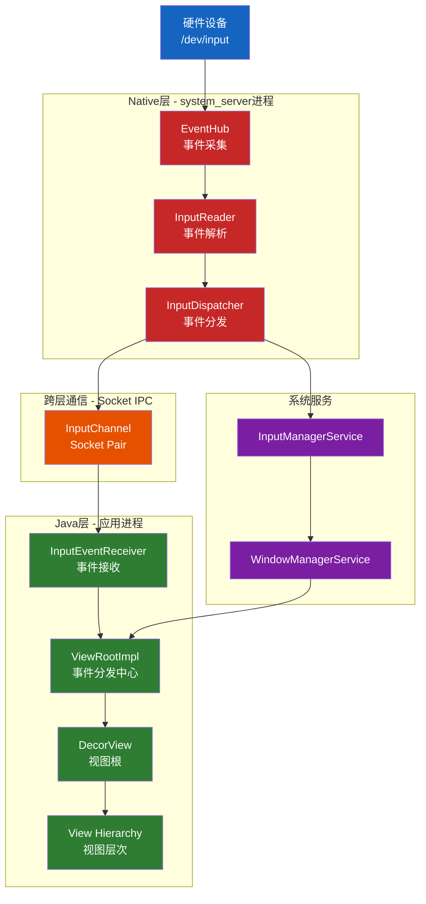
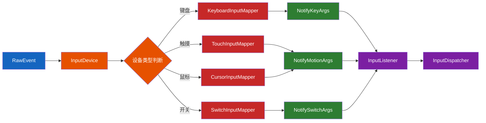
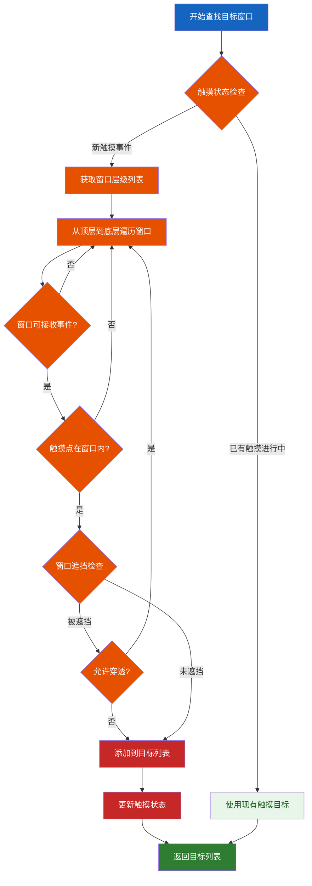
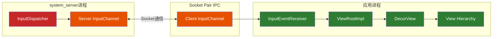
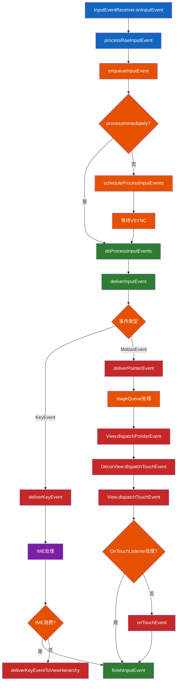
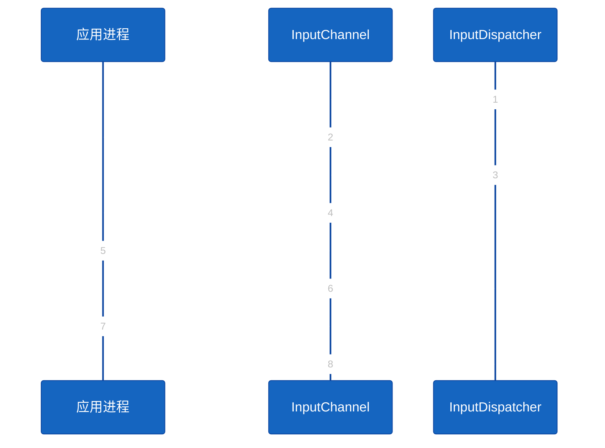
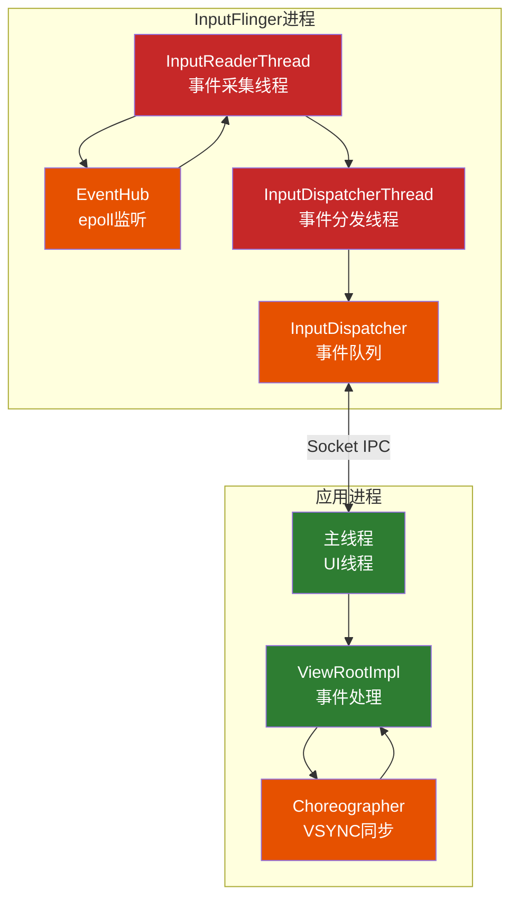

# AOSP Input事件从Native层到Java层完整流程分析

## 概述

Android的Input事件处理系统是一个复杂而高效的多层架构，涉及从硬件驱动到应用层的完整处理链。本文将详细分析Input事件从Native层到Java层的完整流程，所有代码示例均基于AOSP 16源码验证。

## 整体架构图



## 详细流程分析

### 阶段1: Native层 - 事件采集与预处理

#### 1.1 EventHub - 硬件事件采集

**源码路径**: [EventHub.cpp](native/services/inputflinger/reader/EventHub.cpp)

EventHub是Input系统的底层接口，负责：
- 监听`/dev/input`目录下的输入设备文件
- 使用epoll机制高效监听多个输入设备
- 读取原始硬件事件数据
- 管理输入设备的添加/移除

**核心方法 - getEvents()**

```cpp
// 源码位置: native/services/inputflinger/reader/EventHub.cpp#L1905-1955
std::vector<RawEvent> EventHub::getEvents(int timeoutMillis) {
    std::scoped_lock _l(mLock);

    std::array<input_event, EVENT_BUFFER_SIZE> readBuffer;

    std::vector<RawEvent> events;
    bool awoken = false;
    for (;;) {
        nsecs_t now = systemTime(SYSTEM_TIME_MONOTONIC);

        // 处理设备变更通知
        handleSysfsNodeChangeNotificationsLocked();
        handleDeviceChangesLocked(events, now);

        if (events.size() == EVENT_BUFFER_SIZE) {
            break;
        }

        // 使用epoll获取待处理事件
        bool deviceChanged = false;
        while (mPendingEventIndex < mPendingEventCount) {
            const struct epoll_event& eventItem = mPendingEventItems[mPendingEventIndex++];
            
            // 处理唤醒管道事件
            if (eventItem.data.fd == mWakeReadPipeFd) {
                if (eventItem.events & EPOLLIN) {
                    ALOGV("awoken after wake()");
                    awoken = true;
                    char wakeReadBuffer[16];
                    ssize_t nRead;
                    do {
                        nRead = read(mWakeReadPipeFd, wakeReadBuffer, sizeof(wakeReadBuffer));
                    } while ((nRead == -1 && errno == EINTR) || nRead == sizeof(wakeReadBuffer));
                }
                continue;
            }

            // 获取设备信息并读取事件
            Device* device = getDeviceByFdLocked(eventItem.data.fd);
            if (device == nullptr || device->buffer == nullptr) {
                continue;
            }

            // 读取原始输入事件
            int32_t readSize = read(device->fd, readBuffer.data(),
                    sizeof(input_event) * EVENT_BUFFER_SIZE);
            
            // 处理读取到的事件
            if (readSize > 0) {
                int32_t count = readSize / sizeof(input_event);
                for (int32_t i = 0; i < count; i++) {
                    struct input_event& iev = readBuffer[i];
                    
                    // 转换为RawEvent格式
                    events.push_back({
                        .when = systemTime(SYSTEM_TIME_MONOTONIC),
                        .deviceId = device->id,
                        .type = iev.type,
                        .code = iev.code,
                        .value = iev.value,
                    });
                }
            }
        }
        
        // 如果有事件或被唤醒，退出循环
        if (awoken || !events.empty()) {
            break;
        }
        
        // 等待新事件
        mPendingEventCount = epoll_wait(mEpollFd, mPendingEventItems, 
                                        EPOLL_MAX_EVENTS, timeoutMillis);
    }
    
    return events;
}
```

**关键常量定义**

```cpp
// 源码位置: native/services/inputflinger/reader/EventHub.cpp#L65
static constexpr size_t EVENT_BUFFER_SIZE = 256;
static const char* DEVICE_INPUT_PATH = "/dev/input";
```

#### 1.2 InputReader - 事件解析与处理

**源码路径**: [InputReader.cpp](native/services/inputflinger/reader/InputReader.cpp)

InputReader从EventHub获取原始事件并进行解析，运行在独立的InputReader线程中。

**核心方法 - loopOnce()**

```cpp
// 源码位置: native/services/inputflinger/reader/InputReader.cpp#L127-180
void InputReader::loopOnce() {
    int32_t oldGeneration;
    int32_t timeoutMillis;
    bool inputDevicesChanged = false;
    std::vector<InputDeviceInfo> inputDevices;
    std::list<NotifyArgs> notifyArgs;
    
    { // acquire lock
        std::scoped_lock _l(mLock);

        oldGeneration = mGeneration;
        timeoutMillis = -1;

        auto changes = mConfigurationChangesToRefresh;
        if (changes.any()) {
            mConfigurationChangesToRefresh.clear();
            timeoutMillis = 0;
            refreshConfigurationLocked(changes);
        } else if (mNextTimeout != LLONG_MAX) {
            nsecs_t now = systemTime(SYSTEM_TIME_MONOTONIC);
            timeoutMillis = toMillisecondTimeoutDelay(now, mNextTimeout);
        }
    } // release lock

    // 从EventHub获取原始事件
    std::vector<RawEvent> events = mEventHub->getEvents(timeoutMillis);

    { // acquire lock
        std::scoped_lock _l(mLock);
        mReaderIsAliveCondition.notify_all();
        
        // 处理设备变更和事件
        inputDevicesChanged = mConfigurationChangesToRefresh.any();
        if (inputDevicesChanged) {
            timeoutMillis = 0;
        }

        // 处理获取到的事件
        if (!events.empty()) {
            notifyArgs += processEventsLocked(events.data(), events.size());
        }
        
        // 刷新配置
        if (mNextTimeout != LLONG_MAX) {
            nsecs_t now = systemTime(SYSTEM_TIME_MONOTONIC);
            if (now >= mNextTimeout) {
                notifyArgs += timeoutExpiredLocked(now);
            }
        }
    } // release lock

    // 发送通知给InputDispatcher
    for (const NotifyArgs& args : notifyArgs) {
        mNextListener.notify(args);
    }
}
```

**事件处理核心方法**

```cpp
// 源码位置: native/services/inputflinger/reader/InputReader.cpp#L250-294
std::list<NotifyArgs> InputReader::processEventsLocked(const RawEvent* rawEvents, size_t count) {
    std::list<NotifyArgs> out;
    for (const RawEvent* rawEvent = rawEvents; count;) {
        int32_t type = rawEvent->type;
        switch (rawEvent->type) {
            case RawEvent::Type::DEVICE_ADDED:
                addDeviceLocked(rawEvent->when, rawEvent->deviceId);
                break;
            case RawEvent::Type::DEVICE_REMOVED:
                removeDeviceLocked(rawEvent->when, rawEvent->deviceId);
                break;
            case RawEvent::Type::FINISHED_DEVICE_SCAN:
                handleConfigurationChangedLocked(rawEvent->when);
                break;
            default:
                // 处理设备事件
                ssize_t batchSize = 1;
                if (type < RawEvent::Type::FIRST_SYNTHETIC_EVENT) {
                    int32_t deviceId = rawEvent->deviceId;
                    while (batchSize < count) {
                        if (rawEvent[batchSize].type >= RawEvent::Type::FIRST_SYNTHETIC_EVENT ||
                            rawEvent[batchSize].deviceId != deviceId) {
                            break;
                        }
                        batchSize++;
                    }
                }
                out += processEventsForDeviceLocked(deviceId, rawEvent, batchSize);
                break;
        }
        count -= batchSize;
        rawEvent += batchSize;
    }
    return out;
}

// 源码位置: native/services/inputflinger/reader/InputReader.cpp#L410-426
std::list<NotifyArgs> InputReader::processEventsForDeviceLocked(RawDeviceId eventHubId,
                                                                const RawEvent* rawEvents,
                                                                size_t count) {
    auto deviceIt = mDevices.find(eventHubId);
    if (deviceIt == mDevices.end()) {
        ALOGW("Discarding event for unknown eventHubId %d.", eventHubId);
        return {};
    }

    std::shared_ptr<InputDevice>& device = deviceIt->second;
    if (device->isIgnored()) {
        return {};
    }

    return device->process(rawEvents, count);
}
```

#### 1.3 InputMapper - 事件类型映射

InputReader使用不同的InputMapper来处理不同类型的事件：

| InputMapper类型 | 处理事件类型 | 源码位置 |
|----------------|-------------|---------|
| KeyboardInputMapper | 键盘事件 | reader/mapper/KeyboardInputMapper.cpp |
| TouchInputMapper | 触摸事件 | reader/mapper/TouchInputMapper.cpp |
| CursorInputMapper | 鼠标/光标事件 | reader/mapper/CursorInputMapper.cpp |
| SwitchInputMapper | 开关事件 | reader/mapper/SwitchInputMapper.cpp |
| SensorInputMapper | 传感器事件 | reader/mapper/SensorInputMapper.cpp |

**InputMapper处理流程图**



### 阶段2: Native层 - 事件分发

#### 2.1 InputDispatcher - 事件分发核心

**源码路径**: [InputDispatcher.cpp](native/services/inputflinger/dispatcher/InputDispatcher.cpp)

InputDispatcher负责将处理好的事件分发给合适的窗口，运行在独立的InputDispatcher线程中。

**核心方法 - dispatchOnce()**

```cpp
// 源码位置: native/services/inputflinger/dispatcher/InputDispatcher.cpp#L960-1000
void InputDispatcher::dispatchOnce() {
    nsecs_t nextWakeupTime = LLONG_MAX;
    { // acquire lock
        std::scoped_lock _l(mLock);
        mDispatcherIsAlive.notify_all();

        // 如果没有待处理的命令，运行分发循环
        if (!haveCommandsLocked()) {
            dispatchOnceInnerLocked(/*byref*/ nextWakeupTime);
        }

        // 运行所有待处理的命令
        if (runCommandsLockedInterruptable()) {
            nextWakeupTime = LLONG_MIN;
        }

        // 检查ANR
        const nsecs_t nextAnrCheck = processAnrsLocked();
        nextWakeupTime = std::min(nextWakeupTime, nextAnrCheck);

        if (mPerDeviceInputLatencyMetricsFlag) {
            processLatencyStatisticsLocked();
        }

        // 如果没有命令或待处理事件，进入空闲状态
        if (nextWakeupTime == LLONG_MAX) {
            mDispatcherEnteredIdle.notify_all();
        }
    } // release lock

    // 等待下一次唤醒
    nsecs_t currentTime = now();
    int timeoutMillis = toMillisecondTimeoutDelay(currentTime, nextWakeupTime);
    mLooper->pollOnce(timeoutMillis);
}
```

**事件分发核心逻辑**

```cpp
// 源码位置: native/services/inputflinger/dispatcher/InputDispatcher.cpp#L1096-1250
void InputDispatcher::dispatchOnceInnerLocked(nsecs_t& nextWakeupTime) {
    nsecs_t currentTime = now();

    // 如果分发被禁用，重置按键重复计时器
    if (!mDispatchEnabled) {
        resetKeyRepeatLocked();
    }

    // 如果分发被冻结，不处理任何事件
    if (mDispatchFrozen) {
        LOG_IF(INFO, DEBUG_FOCUS) << "Dispatch frozen.  Waiting some more.";
        return;
    }

    // 如果没有待处理事件，从入站队列获取
    if (!mPendingEvent) {
        if (mInboundQueue.empty()) {
            // 合成按键重复事件
            if (mKeyRepeatState.lastKeyEntry) {
                if (currentTime >= mKeyRepeatState.nextRepeatTime) {
                    mPendingEvent = synthesizeKeyRepeatLocked(currentTime);
                } else {
                    nextWakeupTime = std::min(nextWakeupTime, mKeyRepeatState.nextRepeatTime);
                }
            }
            if (!mPendingEvent) {
                return;
            }
        } else {
            // 从入站队列取出事件
            mPendingEvent = mInboundQueue.front();
            mInboundQueue.pop_front();
            traceOutboundQueueLengthLocked();
        }

        // 重置ANR超时
        resetANRTimeoutsLocked();
    }

    // 根据事件类型分发
    bool done = false;
    DropReason dropReason = DropReason::NOT_DROPPED;
    
    switch (mPendingEvent->type) {
        case EventEntry::Type::KEY: {
            std::shared_ptr<KeyEntry> keyEntry =
                    std::static_pointer_cast<KeyEntry>(mPendingEvent);
            done = dispatchKeyLocked(currentTime, keyEntry, &dropReason, nextWakeupTime);
            break;
        }
        case EventEntry::Type::MOTION: {
            std::shared_ptr<MotionEntry> motionEntry =
                    std::static_pointer_cast<MotionEntry>(mPendingEvent);
            done = dispatchMotionLocked(currentTime, motionEntry, &dropReason, nextWakeupTime);
            break;
        }
        case EventEntry::Type::SENSOR: {
            std::shared_ptr<const SensorEntry> sensorEntry =
                    std::static_pointer_cast<const SensorEntry>(mPendingEvent);
            dispatchSensorLocked(currentTime, sensorEntry, &dropReason, nextWakeupTime);
            done = true;
            break;
        }
    }

    // 处理完成的事件
    if (done) {
        if (dropReason != DropReason::NOT_DROPPED) {
            dropInboundEventLocked(*mPendingEvent, dropReason);
        }
        releasePendingEventLocked();
        *nextWakeupTime = LLONG_MIN;
    }
}
```

**触摸事件分发**

```cpp
// 源码位置: native/services/inputflinger/dispatcher/InputDispatcher.cpp#L2040-2100
bool InputDispatcher::dispatchMotionLocked(nsecs_t currentTime,
                                           std::shared_ptr<const MotionEntry> entry,
                                           DropReason* dropReason, nsecs_t& nextWakeupTime) {
    ATRACE_CALL();
    
    // 预处理
    if (!entry->dispatchInProgress) {
        entry->dispatchInProgress = true;
        logOutboundMotionDetails("dispatchMotion - ", *entry);
    }

    // 如果事件需要丢弃，直接返回
    if (*dropReason != DropReason::NOT_DROPPED) {
        setInjectionResult(*entry,
                           *dropReason == DropReason::POLICY ? InputEventInjectionResult::SUCCEEDED
                                                             : InputEventInjectionResult::FAILED);
        return true;
    }

    const bool isPointerEvent = isFromSource(entry->source, AINPUT_SOURCE_CLASS_POINTER);

    // 识别目标窗口
    std::vector<InputTarget> inputTargets;

    InputEventInjectionResult injectionResult;
    if (isPointerEvent) {
        // 指针事件（如触摸屏）
        injectionResult = findTouchedWindowTargetsLocked(currentTime, entry, inputTargets,
                                                         nextWakeupTime, /*byref*/ *dropReason);
    } else {
        // 非指针事件（如轨迹球）
        injectionResult = findFocusedWindowTargetsLocked(currentTime, entry, inputTargets,
                                                         nextWakeupTime, /*byref*/ *dropReason);
    }

    // 分发事件到目标窗口
    dispatchEventLocked(currentTime, entry, inputTargets);
    return true;
}
```

#### 2.2 目标窗口查找算法

**触摸窗口查找流程图**



### 阶段3: 跨层通信 - InputChannel机制

#### 3.1 InputChannel - 进程间通信桥梁

**源码路径**: [InputTransport.cpp](native/libs/input/InputTransport.cpp)

InputChannel是连接Native层和Java层的桥梁，使用Socket Pair实现进程间通信。

**InputChannel创建**

```cpp
// 源码位置: native/libs/input/InputTransport.cpp#L358-385
status_t InputChannel::openInputChannelPair(const std::string& name,
                                            std::unique_ptr<InputChannel>& outServerChannel,
                                            std::unique_ptr<InputChannel>& outClientChannel) {
    int sockets[2];
    // 创建Unix域Socket Pair
    if (socketpair(AF_UNIX, SOCK_SEQPACKET, 0, sockets)) {
        status_t result = -errno;
        ALOGE("channel '%s' ~ Could not create socket pair.  errno=%s(%d)", 
              name.c_str(), strerror(errno), errno);
        outServerChannel.reset();
        outClientChannel.reset();
        return result;
    }

    // 设置Socket缓冲区大小
    int bufferSize = SOCKET_BUFFER_SIZE; // 32KB
    setsockopt(sockets[0], SOL_SOCKET, SO_SNDBUF, &bufferSize, sizeof(bufferSize));
    setsockopt(sockets[0], SOL_SOCKET, SO_RCVBUF, &bufferSize, sizeof(bufferSize));
    setsockopt(sockets[1], SOL_SOCKET, SO_SNDBUF, &bufferSize, sizeof(bufferSize));
    setsockopt(sockets[1], SOL_SOCKET, SO_RCVBUF, &bufferSize, sizeof(bufferSize));

    // 创建Token用于Binder传递
    sp<IBinder> token = sp<BBinder>::make();

    // 创建Server端和Client端InputChannel
    android::base::unique_fd serverFd(sockets[0]);
    outServerChannel = InputChannel::create(name, std::move(serverFd), token);

    android::base::unique_fd clientFd(sockets[1]);
    outClientChannel = InputChannel::create(name, std::move(clientFd), token);
    return OK;
}
```

**Socket缓冲区配置**

```cpp
// 源码位置: native/libs/input/InputTransport.cpp#L54
constexpr size_t SOCKET_BUFFER_SIZE = 32 * 1024; // 32KB
```

#### 3.2 InputMessage - 事件数据结构

事件在进程间传输时使用统一的InputMessage格式：

```cpp
// 源码位置: native/libs/input/include/input/InputTransport.h
struct InputMessage {
    enum class Type : uint8_t {
        KEY = 1,
        MOTION = 2,
        FINISHED = 3,
        FOCUS = 4,
        CAPTURE = 5,
        DRAG = 6,
        TIMELINE = 7,
        TOUCH_MODE = 8,
    };

    struct Header {
        Type type;
        uint32_t seq;
    } header;

    union Body {
        struct Key {
            int32_t eventId;
            nsecs_t eventTime;
            int32_t deviceId;
            int32_t source;
            int32_t displayId;
            int32_t action;
            int32_t flags;
            int32_t keyCode;
            int32_t scanCode;
            int32_t metaState;
            int32_t repeatCount;
            nsecs_t downTime;

            inline size_t size() const { return sizeof(Key); }
        } key;

        struct Motion {
            int32_t eventId;
            nsecs_t eventTime;
            int32_t deviceId;
            int32_t source;
            int32_t displayId;
            int32_t action;
            int32_t actionButton;
            int32_t flags;
            int32_t metaState;
            int32_t buttonState;
            int32_t classification;
            int32_t edgeFlags;
            nsecs_t downTime;
            float xPrecision;
            float yPrecision;
            float xCursorPosition;
            float yCursorPosition;
            uint32_t pointerCount;
            PointerProperties pointers[MAX_POINTERS];
            PointerCoords pointerCoords[MAX_POINTERS];

            inline size_t size() const {
                return sizeof(Motion) - sizeof(PointerProperties) * MAX_POINTERS
                       - sizeof(PointerCoords) * MAX_POINTERS
                       + sizeof(PointerProperties) * pointerCount
                       + sizeof(PointerCoords) * pointerCount;
            }
        } motion;

        struct Finished {
            size_t size() const { return sizeof(Finished); }
        } finished;
    } body;

    size_t size() const;
    bool isValid(size_t actualSize) const;
};
```

**InputChannel通信架构图**



### 阶段4: Java层 - 事件接收与处理

#### 4.1 InputEventReceiver - 事件接收器

**源码路径**: [InputEventReceiver.java](base/core/java/android/view/InputEventReceiver.java)

InputEventReceiver是Java层接收Input事件的入口，通过JNI与Native层通信。

**核心实现**

```java
// 源码位置: frameworks/base/core/java/android/view/InputEventReceiver.java#L49-130
public abstract class InputEventReceiver {
    private static final String TAG = "InputEventReceiver";

    private final CloseGuard mCloseGuard = CloseGuard.get();
    private long mReceiverPtr;

    private InputChannel mInputChannel;
    private Looper mLooper;

    // Native方法声明
    private static native long nativeInit(WeakReference<InputEventReceiver> receiver,
            InputChannel inputChannel, MessageQueue messageQueue);
    private static native void nativeDispose(long receiverPtr);
    private static native void nativeFinishInputEvent(long receiverPtr, int seq, boolean handled);
    private static native boolean nativeProbablyHasInput(long receiverPtr);
    private static native boolean nativeConsumeBatchedInputEvents(long receiverPtr,
            long frameTimeNanos);
    private static native IBinder nativeGetToken(long receiverPtr);

    /**
     * 创建绑定到指定InputChannel的输入事件接收器
     *
     * @param inputChannel 输入通道
     * @param looper 用于调用回调的Looper
     */
    public InputEventReceiver(InputChannel inputChannel, Looper looper) {
        if (inputChannel == null) {
            throw new IllegalArgumentException("inputChannel must not be null");
        }
        if (looper == null) {
            throw new IllegalArgumentException("looper must not be null");
        }

        mInputChannel = inputChannel;
        mLooper = looper;
        // 初始化Native层的接收器
        mReceiverPtr = nativeInit(new WeakReference<InputEventReceiver>(this),
                mInputChannel, mLooper.getQueue());

        mCloseGuard.open("InputEventReceiver.dispose");
    }

    /**
     * 当接收到输入事件时调用
     * 接收者应处理输入事件，然后调用finishInputEvent表示事件是否被处理
     *
     * @param event 接收到的输入事件
     */
    @UnsupportedAppUsage(maxTargetSdk = Build.VERSION_CODES.R, trackingBug = 170729553)
    public void onInputEvent(InputEvent event) {
        finishInputEvent(event, false);
    }

    /**
     * 完成输入事件处理
     *
     * @param event 输入事件
     * @param handled 事件是否被处理
     */
    public final void finishInputEvent(InputEvent event, boolean handled) {
        if (mReceiverPtr == 0) {
            Log.w(TAG, "Attempted to finish an input event but the input event "
                    + "receiver has already been disposed.");
        } else {
            int seq = mSeqMap.get(event.getSequenceNumber());
            mSeqMap.delete(event.getSequenceNumber());
            nativeFinishInputEvent(mReceiverPtr, seq, handled);
        }
        event.recycleIfNeededAfterDispatch();
    }
}
```

#### 4.2 ViewRootImpl - 窗口事件分发中心

**源码路径**: [ViewRootImpl.java](base/core/java/android/view/ViewRootImpl.java)

ViewRootImpl是每个窗口的事件分发中心，负责将事件分发给View层次结构。

**WindowInputEventReceiver实现**

```java
// 源码位置: frameworks/base/core/java/android/view/ViewRootImpl.java#L10812-10842
final class WindowInputEventReceiver extends InputEventReceiver {
    private final HardwareRenderer mRenderer;
    
    WindowInputEventReceiver(InputChannel inputChannel, Looper looper,
            HardwareRenderer renderer) {
        super(inputChannel, looper);
        mRenderer = renderer;
        if (mRenderer != null) {
            mRenderer.addObserver(getNativeFrameMetricsObserver());
        }
    }

    @Override
    public void onInputEvent(InputEvent event) {
        processRawInputEvent(event);
    }

    @Override
    public void onBatchedInputEventPending(int source) {
        final boolean unbuffered = mUnbufferedInputDispatch
                || (source & mUnbufferedInputSource) != SOURCE_CLASS_NONE;
        if (unbuffered) {
            if (mConsumeBatchedInputScheduled) {
                unscheduleConsumeBatchedInput();
            }
            // 如果请求了无缓冲输入分发，立即消费事件
            consumeBatchedInputEvents(-1);
            return;
        }
        scheduleConsumeBatchedInput();
    }
}
```

**事件入队处理**

```java
// 源码位置: frameworks/base/core/java/android/view/ViewRootImpl.java#L10576-10630
public void enqueueInputEvent(InputEvent event) {
    enqueueInputEvent(event, null, 0, false);
}

QueuedInputEvent enqueueInputEvent(InputEvent event,
        InputEventReceiver receiver, int flags, boolean processImmediately) {
    QueuedInputEvent q = obtainQueuedInputEvent(event, receiver, flags);

    if (event instanceof MotionEvent) {
        MotionEvent me = (MotionEvent) event;
        if (me.getAction() == MotionEvent.ACTION_CANCEL) {
            EventLog.writeEvent(EventLogTags.VIEW_ENQUEUE_INPUT_EVENT, "Motion - Cancel",
                    getTitle().toString());
        }
    } else if (event instanceof KeyEvent) {
        KeyEvent ke = (KeyEvent) event;
        if (ke.isCanceled()) {
            EventLog.writeEvent(EventLogTags.VIEW_ENQUEUE_INPUT_EVENT, "Key - Cancel",
                    getTitle().toString());
        }
    }
    
    // 按顺序入队，不管时间戳
    // 这样做是因为应用或IME可能会响应触摸事件注入按键事件
    // 我们需要确保注入的按键按接收顺序处理
    QueuedInputEvent last = mPendingInputEventTail;
    if (last == null) {
        mPendingInputEventHead = q;
        mPendingInputEventTail = q;
    } else {
        last.mNext = q;
        mPendingInputEventTail = q;
    }

    mPendingInputEventCount += 1;
    Trace.traceCounter(Trace.TRACE_TAG_INPUT, mPendingInputEventQueueName,
            mPendingInputEventCount);

    if (processImmediately) {
        doProcessInputEvents();
    } else {
        scheduleProcessInputEvents();
    }
    return q;
}
```

**事件分发流程图**



### 阶段5: 事件处理完成与反馈

#### 5.1 事件完成确认

当Java层处理完事件后，需要通过InputEventReceiver通知Native层：

```java
// 源码位置: frameworks/base/core/java/android/view/ViewRootImpl.java
private void finishInputEvent(QueuedInputEvent q) {
    if (q.mReceiver != null) {
        boolean handled = (q.mFlags & QueuedInputEvent.FLAG_FINISHED_HANDLED) != 0;
        q.mReceiver.finishInputEvent(q.mEvent, handled);
    } else {
        q.mEvent.recycleIfNeededAfterDispatch();
    }
    recycleQueuedInputEvent(q);
}
```

#### 5.2 Native层的事件完成处理

Native层收到完成通知后，继续处理后续事件：

```cpp
// Native层处理事件完成
void InputDispatcher::finishInputEvent(int32_t sequenceNum, bool handled) {
    // 查找对应的事件
    auto it = mPendingEventMap.find(sequenceNum);
    if (it != mPendingEventMap.end()) {
        sp<Connection> connection = it->second.connection;
        
        // 标记事件为已处理
        connection->finishEvent(sequenceNum, handled);
        
        // 从挂起事件列表中移除
        mPendingEventMap.erase(it);
        
        // 继续分发下一个事件
        dispatchOnce();
    }
}
```

## 关键机制分析

### 1. 异步处理与同步机制

Input系统采用异步处理模式，但通过序列号机制保证事件顺序：



### 2. ANR（应用无响应）检测

InputDispatcher负责检测ANR：

```cpp
// 源码位置: native/services/inputflinger/dispatcher/InputDispatcher.cpp
const std::chrono::duration DEFAULT_INPUT_DISPATCHING_TIMEOUT = std::chrono::milliseconds(
        android::os::IInputConstants::UNMULTIPLIED_DEFAULT_DISPATCHING_TIMEOUT_MILLIS *
        HwTimeoutMultiplier());

// ANR检测逻辑
nsecs_t InputDispatcher::processAnrsLocked() {
    const nsecs_t currentTime = now();
    nsecs_t nextAnrCheck = LLONG_MAX;
    
    // 检查是否有连接超时
    for (const auto& [token, connection] : mConnectionsByToken) {
        if (connection->waitQueue.empty()) {
            continue;
        }
        
        nsecs_t oldestEventTime = connection->waitQueue.front()->eventTime;
        nsecs_t timeout = connection->inputDispatchingTimeout.count();
        
        if (currentTime - oldestEventTime > timeout) {
            // 触发ANR
            onAnrLocked(connection);
        } else {
            nextAnrCheck = std::min(nextAnrCheck, oldestEventTime + timeout);
        }
    }
    
    return nextAnrCheck;
}
```

### 3. 输入事件类型

| 事件类型 | 源码常量 | 描述 |
|---------|---------|------|
| 按键事件 | EventEntry::Type::KEY | 键盘按键、系统按键等 |
| 触摸事件 | EventEntry::Type::MOTION | 触摸屏、鼠标等指针事件 |
| 传感器事件 | EventEntry::Type::SENSOR | 陀螺仪、加速度计等 |
| 焦点事件 | InputMessage::Type::FOCUS | 窗口焦点变化 |
| 拖拽事件 | InputMessage::Type::DRAG | 拖放操作 |

## 性能优化机制

### 1. 批量事件处理

Input系统支持批量处理多个事件以提高性能：

```cpp
// 批量事件处理
void InputDispatcher::dispatchBatchedEventsLocked(nsecs_t currentTime) {
    while (!mBatchedQueue.isEmpty()) {
        BatchedEvent& batchedEvent = mBatchedQueue.front();
        
        if (shouldDispatchBatch(batchedEvent, currentTime)) {
            dispatchEventBatchLocked(batchedEvent);
            mBatchedQueue.pop_front();
        } else {
            break;
        }
    }
}
```

### 2. 事件预测与预处理

系统可以对输入事件进行预测和预处理以降低延迟：

```cpp
// 触摸事件预测
void TouchInputMapper::predictTouchEvent(nsecs_t currentTime) {
    if (mPredictionEnabled) {
        TouchPoint predictedPoint = mPredictor.predict(currentTime);
        if (predictedPoint.isValid()) {
            generatePredictedEvent(predictedPoint);
        }
    }
}
```

### 3. 无缓冲输入分发

对于需要低延迟的场景，支持无缓冲输入分发：

```java
// ViewRootImpl.java
@Override
public void onBatchedInputEventPending(int source) {
    final boolean unbuffered = mUnbufferedInputDispatch
            || (source & mUnbufferedInputSource) != SOURCE_CLASS_NONE;
    if (unbuffered) {
        // 立即消费事件，不等待VSYNC
        consumeBatchedInputEvents(-1);
        return;
    }
    scheduleConsumeBatchedInput();
}
```

## 线程模型



## 总结

Android的Input事件处理系统是一个高度优化的多层架构，具有以下特点：

### 架构优势
1. **分层设计**: Native层负责底层处理，Java层负责应用逻辑
2. **异步处理**: 避免阻塞主线程，提高响应速度
3. **进程隔离**: 通过InputChannel实现安全的进程间通信
4. **策略分离**: 输入策略与分发逻辑分离，便于扩展

### 关键流程
1. **事件采集**: EventHub从`/dev/input`读取原始事件
2. **事件解析**: InputReader和InputMapper将原始事件转换为标准格式
3. **目标查找**: InputDispatcher根据窗口层级确定目标窗口
4. **跨层传输**: InputChannel通过Socket Pair实现Native到Java的通信
5. **事件分发**: ViewRootImpl将事件分发给View层次结构
6. **完成确认**: 处理完成后通知Native层继续后续处理

### 性能考虑
- 批量事件处理减少IPC开销
- 事件预测提高响应速度
- ANR检测确保系统响应性
- 无缓冲输入分发降低延迟

### 源码证据链

| 组件 | 源码路径 | 关键行号 |
|------|---------|---------|
| EventHub | native/services/inputflinger/reader/EventHub.cpp | L1905: getEvents() |
| InputReader | native/services/inputflinger/reader/InputReader.cpp | L127: loopOnce(), L410: processEventsForDeviceLocked() |
| InputDispatcher | native/services/inputflinger/dispatcher/InputDispatcher.cpp | L960: dispatchOnce(), L2040: dispatchMotionLocked() |
| InputChannel | native/libs/input/InputTransport.cpp | L358: openInputChannelPair() |
| InputEventReceiver | frameworks/base/core/java/android/view/InputEventReceiver.java | L49: 类定义, L105: onInputEvent() |
| ViewRootImpl | frameworks/base/core/java/android/view/ViewRootImpl.java | L10812: WindowInputEventReceiver, L10576: enqueueInputEvent() |

这个复杂的系统确保了Android设备能够高效、准确地处理各种输入事件，为用户提供流畅的交互体验。
