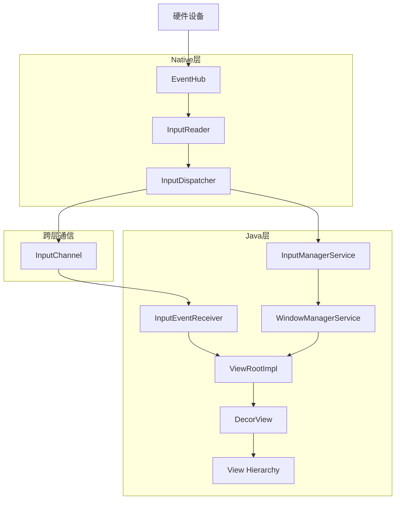

# AOSP Input事件从Native层到Java层完整流程分析

## 概述

Android的Input事件处理系统是一个复杂而高效的多层架构，涉及从硬件驱动到应用层的完整处理链。本文将详细分析Input事件从Native层到Java层的完整流程。

## 整体架构图



## 详细流程分析

### 阶段1: Native层 - 事件采集与预处理

#### 1.1 EventHub - 硬件事件采集

**文件**: `native/services/inputflinger/EventHub.cpp`

EventHub是Input系统的底层接口，负责：
- 监听`/dev/input`目录下的输入设备文件
- 读取原始硬件事件数据
- 管理输入设备的添加/移除

```cpp
// EventHub的核心循环
void EventHub::loop() {
    while (true) {
        // 使用epoll监听多个输入设备
        int pollResult = epoll_wait(mEpollFd, mPendingEventItems, EPOLL_MAX_EVENTS, timeout);
        
        for (int i = 0; i < pollResult; i++) {
            struct input_event iev;
            // 读取原始输入事件
            read(mPendingEventItems[i].data.fd, &iev, sizeof(iev));
            
            // 将原始事件转换为RawEvent结构
            RawEvent event;
            event.when = systemTime(SYSTEM_TIME_MONOTONIC);
            event.deviceId = device->id;
            event.type = iev.type;
            event.code = iev.code;
            event.value = iev.value;
            
            // 将事件加入队列
            mEventQueue.push_back(event);
        }
    }
}
```

#### 1.2 InputReader - 事件解析与处理

**文件**: `native/services/inputflinger/reader/InputReader.cpp`

InputReader从EventHub获取原始事件并进行解析：

```cpp
// InputReader的主循环
void InputReader::loopOnce() {
    // 1. 从EventHub获取原始事件
    size_t count = mEventHub->getEvents(timeoutMillis, mEventBuffer, EVENT_BUFFER_SIZE);
    
    // 2. 处理每个原始事件
    for (size_t i = 0; i < count; i++) {
        const RawEvent& rawEvent = mEventBuffer[i];
        
        // 根据设备类型选择合适的InputMapper
        processEventForDeviceLocked(rawEvent.when, rawEvent.deviceId, rawEvent);
    }
    
    // 3. 刷新处理结果
    flush();
}

// 事件处理核心方法
void InputReader::processEventForDeviceLocked(nsecs_t when, int32_t deviceId, 
                                              const RawEvent& rawEvent) {
    // 查找对应的InputDevice
    auto deviceIt = mDevices.find(deviceId);
    if (deviceIt != mDevices.end()) {
        // 委托给InputDevice处理
        deviceIt->second->process(rawEvent);
    }
}
```

#### 1.3 InputMapper - 事件类型映射

InputReader使用不同的InputMapper来处理不同类型的事件：

- **KeyboardInputMapper**: 处理键盘事件
- **TouchInputMapper**: 处理触摸事件  
- **MouseInputMapper**: 处理鼠标事件
- **SwitchInputMapper**: 处理开关事件

```cpp
// 以TouchInputMapper为例
void TouchInputMapper::process(const RawEvent* rawEvent) {
    switch (rawEvent->type) {
        case EV_ABS:
            // 处理绝对坐标事件
            processAbsoluteAxis(rawEvent->code, rawEvent->value);
            break;
        case EV_SYN:
            // 同步事件，表示一个完整的手势
            processSyn(rawEvent->code, rawEvent->value);
            break;
    }
}
```

### 阶段2: Native层 - 事件分发

#### 2.1 InputDispatcher - 事件分发核心

**文件**: `native/services/inputflinger/dispatcher/InputDispatcher.cpp`

InputDispatcher负责将处理好的事件分发给合适的窗口：

```cpp
// InputDispatcher的主分发循环
void InputDispatcher::dispatchOnce() {
    // 1. 从队列获取事件
    std::shared_ptr<EventEntry> event = mInboundQueue.dequeueAtHead();
    
    // 2. 根据事件类型分发
    switch (event->type) {
        case EventEntry::Type::MOTION:
            dispatchMotionLocked(currentTime, 
                                static_cast<MotionEntry&>(*event));
            break;
        case EventEntry::Type::KEY:
            dispatchKeyLocked(currentTime, 
                             static_cast<KeyEntry&>(*event));
            break;
    }
}

// 触摸事件分发
void InputDispatcher::dispatchMotionLocked(nsecs_t currentTime, MotionEntry& entry) {
    // 1. 寻找目标窗口
    std::vector<InputTarget> inputTargets;
    findTouchedWindowTargetsLocked(currentTime, entry, inputTargets);
    
    // 2. 分发到目标窗口
    dispatchEventToCurrentInputTargetsLocked(currentTime, entry, inputTargets);
}
```

#### 2.2 目标窗口查找算法

InputDispatcher使用复杂的算法来确定事件的目标窗口：

```cpp
void InputDispatcher::findTouchedWindowTargetsLocked(nsecs_t currentTime, 
                                                     MotionEntry& entry,
                                                     std::vector<InputTarget>& targets) {
    // 1. 检查触摸状态
    if (mTouchState.down) {
        // 已有触摸在进行中，使用现有目标
        targets = mTouchState.getWindowsWithValidConnections();
    } else {
        // 新的触摸事件，需要寻找目标窗口
        
        // 2. 获取窗口层级信息
        const std::vector<sp<WindowInfoHandle>> windowHandles = 
            mWindowInfosListener.getWindowHandles();
        
        // 3. 从顶层到底层遍历窗口
        for (auto it = windowHandles.rbegin(); it != windowHandles.rend(); ++it) {
            const sp<WindowInfoHandle>& windowHandle = *it;
            
            // 4. 检查窗口是否可接收触摸事件
            if (isWindowReadyForInput(windowHandle) &&
                isTouchWithinWindow(entry, windowHandle)) {
                
                // 5. 添加到目标列表
                InputTarget target;
                target.inputChannel = windowHandle->getInputChannel();
                target.flags = InputTarget::FLAG_DISPATCH_AS_IS;
                targets.push_back(target);
                
                // 6. 更新触摸状态
                mTouchState.addOrUpdateWindow(windowHandle, 
                                             target.flags, 
                                             entry.pointerIds);
                break; // 找到第一个可接收的窗口
            }
        }
    }
}
```

### 阶段3: 跨层通信 - InputChannel机制

#### 3.1 InputChannel - 进程间通信桥梁

**文件**: `frameworks/native/libs/input/InputTransport.cpp`

InputChannel是连接Native层和Java层的桥梁：

```cpp
// InputChannel的创建
status_t InputChannel::openInputChannelPair(const std::string& name,
                                           sp<InputChannel>& outServerChannel,
                                           sp<InputChannel>& outClientChannel) {
    // 1. 创建socket pair用于进程间通信
    int sockets[2];
    if (socketpair(AF_UNIX, SOCK_SEQPACKET, 0, sockets)) {
        return -errno;
    }
    
    // 2. 设置socket属性
    fcntl(sockets[0], F_SETFL, O_NONBLOCK);
    fcntl(sockets[1], F_SETFL, O_NONBLOCK);
    
    // 3. 创建server和client端的InputChannel
    outServerChannel = new InputChannel(name, sockets[0]);
    outClientChannel = new InputChannel(name, sockets[1]);
    
    return OK;
}

// 事件发送
status_t InputChannel::sendMessage(const InputMessage* msg) {
    ssize_t nWrite;
    do {
        nWrite = ::send(mFd, msg, sizeof(InputMessage), MSG_DONTWAIT | MSG_NOSIGNAL);
    } while (nWrite == -1 && errno == EINTR);
    
    return nWrite == sizeof(InputMessage) ? OK : -errno;
}
```

#### 3.2 InputMessage - 事件数据结构

事件在进程间传输时使用统一的InputMessage格式：

```cpp
struct InputMessage {
    enum {
        TYPE_KEY = 1,
        TYPE_MOTION = 2,
        TYPE_FINISHED = 3,
        TYPE_FOCUS = 4,
    };
    
    int32_t type;
    nsecs_t eventTime;
    
    union {
        struct {
            int32_t action;
            int32_t flags;
            int32_t keyCode;
            int32_t scanCode;
            int32_t metaState;
            int32_t repeatCount;
            nsecs_t downTime;
        } key;
        
        struct {
            int32_t action;
            int32_t flags;
            int32_t metaState;
            int32_t buttonState;
            int32_t edgeFlags;
            nsecs_t downTime;
            float xOffset;
            float yOffset;
            float xPrecision;
            float yPrecision;
            uint32_t pointerCount;
            PointerProperties pointers[MAX_POINTERS];
            PointerCoords pointerCoords[MAX_POINTERS];
        } motion;
    };
};
```

### 阶段4: Java层 - 事件接收与处理

#### 4.1 InputEventReceiver - 事件接收器

**文件**: `frameworks/base/core/java/android/view/InputEventReceiver.java`

InputEventReceiver是Java层接收Input事件的入口：

```java
public abstract class InputEventReceiver {
    private final InputChannel mInputChannel;
    private final Looper mLooper;
    private long mReceiverPtr; // Native层指针
    
    // Native方法声明
    private static native long nativeInit(WeakReference<InputEventReceiver> receiver,
                                         InputChannel inputChannel, MessageQueue messageQueue);
    
    public InputEventReceiver(InputChannel inputChannel, Looper looper) {
        mInputChannel = inputChannel;
        mLooper = looper;
        
        // 初始化Native层的接收器
        mReceiverPtr = nativeInit(new WeakReference<InputEventReceiver>(this),
                                 mInputChannel, mLooper.getQueue());
    }
    
    // 事件回调方法
    public void onInputEvent(InputEvent event) {
        // 默认实现：立即完成事件处理
        finishInputEvent(event, false);
    }
    
    // 完成事件处理
    public final void finishInputEvent(InputEvent event, boolean handled) {
        if (event instanceof KeyEvent) {
            finishKeyEvent((KeyEvent) event, handled);
        } else if (event instanceof MotionEvent) {
            finishMotionEvent((MotionEvent) event, handled);
        }
    }
}
```

#### 4.2 Native到Java的回调机制

Native层通过JNI回调Java层的`onInputEvent`方法：

```cpp
// Native层回调Java层的实现
static void nativeDispatchInputEvent(JNIEnv* env, jclass clazz, 
                                     jlong receiverPtr, jlong eventPtr) {
    // 获取Java对象引用
    InputEventReceiver* receiver = reinterpret_cast<InputEventReceiver*>(receiverPtr);
    InputEvent* event = reinterpret_cast<InputEvent*>(eventPtr);
    
    // 回调到Java层
    env->CallVoidMethod(receiver->getJavaObject(),
                       gInputEventReceiverClassInfo.onInputEvent,
                       event->getJavaObject());
}
```

#### 4.3 ViewRootImpl - 窗口事件分发中心

**文件**: `frameworks/base/core/java/android/view/ViewRootImpl.java`

ViewRootImpl是每个窗口的事件分发中心：

```java
public final class ViewRootImpl implements ViewParent {
    private final WindowInputEventReceiver mInputEventReceiver;
    
    // 内部InputEventReceiver实现
    final class WindowInputEventReceiver extends InputEventReceiver {
        public WindowInputEventReceiver(InputChannel inputChannel, Looper looper) {
            super(inputChannel, looper);
        }
        
        @Override
        public void onInputEvent(InputEvent event) {
            // 将事件加入队列进行处理
            enqueueInputEvent(event, this, 0, true);
        }
    }
    
    // 事件入队处理
    void enqueueInputEvent(InputEvent event, InputEventReceiver receiver,
                          int flags, boolean processImmediately) {
        QueuedInputEvent q = obtainQueuedInputEvent(event, receiver, flags);
        
        // 将事件加入队列
        QueuedInputEvent last = mPendingInputEventTail;
        if (last == null) {
            mPendingInputEventHead = q;
            mPendingInputEventTail = q;
        } else {
            last.mNext = q;
            mPendingInputEventTail = q;
        }
        
        // 立即处理或等待VSYNC
        if (processImmediately) {
            doProcessInputEvents();
        } else {
            scheduleProcessInputEvents();
        }
    }
    
    // 处理输入事件队列
    void doProcessInputEvents() {
        while (mPendingInputEventHead != null) {
            QueuedInputEvent q = mPendingInputEventHead;
            mPendingInputEventHead = q.mNext;
            
            // 分发事件
            deliverInputEvent(q);
        }
    }
    
    // 事件分发
    private void deliverInputEvent(QueuedInputEvent q) {
        // 尝试预处理（如IME处理）
        if (mInputEventConsistencyVerifier != null) {
            mInputEventConsistencyVerifier.onInputEvent(q.mEvent, 0);
        }
        
        // 根据事件类型分发
        if (q.mEvent instanceof KeyEvent) {
            deliverKeyEvent(q);
        } else {
            deliverPointerEvent(q);
        }
    }
}
```

#### 4.4 触摸事件的分发流程

触摸事件在View层次结构中的分发：

```java
// ViewRootImpl中的触摸事件分发
private void deliverPointerEvent(QueuedInputEvent q) {
    final MotionEvent event = (MotionEvent) q.mEvent;
    
    // 1. 检查是否需要拦截
    boolean handled = false;
    if (mView != null) {
        // 2. 分发到DecorView
        handled = mView.dispatchPointerEvent(event);
    }
    
    // 3. 完成事件处理
    finishInputEvent(q, handled);
}

// View中的事件分发
public boolean dispatchTouchEvent(MotionEvent event) {
    // 1. 检查OnTouchListener
    if (mOnTouchListener != null && (mViewFlags & ENABLED_MASK) == ENABLED &&
        mOnTouchListener.onTouch(this, event)) {
        return true;
    }
    
    // 2. 调用onTouchEvent
    if (onTouchEvent(event)) {
        return true;
    }
    
    return false;
}

// ViewGroup中的事件分发（更复杂）
public boolean dispatchTouchEvent(MotionEvent ev) {
    // 1. 检查是否拦截
    final boolean intercepted;
    if (actionMasked == MotionEvent.ACTION_DOWN || mFirstTouchTarget != null) {
        final boolean disallowIntercept = (mGroupFlags & FLAG_DISALLOW_INTERCEPT) != 0;
        if (!disallowIntercept) {
            intercepted = onInterceptTouchEvent(ev);
        } else {
            intercepted = false;
        }
    } else {
        intercepted = true;
    }
    
    // 2. 如果不拦截，分发给子View
    if (!intercepted) {
        // 寻找可以接收事件的子View
        for (int i = childrenCount - 1; i >= 0; i--) {
            final View child = getChildAt(i);
            
            if (!canViewReceivePointerEvents(child) ||
                !isTransformedTouchPointInView(x, y, child, null)) {
                continue;
            }
            
            // 分发给子View
            if (dispatchTransformedTouchEvent(ev, false, child, idBitsToAssign)) {
                // 子View处理了事件
                mFirstTouchTarget = addTouchTarget(child, idBitsToAssign);
                break;
            }
        }
    }
    
    // 3. 如果没有子View处理，自己处理
    if (mFirstTouchTarget == null) {
        handled = dispatchTransformedTouchEvent(ev, true, null, TouchTarget.ALL_POINTER_IDS);
    }
    
    return handled;
}
```

### 阶段5: 事件处理完成与反馈

#### 5.1 事件完成确认

当Java层处理完事件后，需要通过InputEventReceiver通知Native层：

```java
// 完成事件处理
private void finishInputEvent(QueuedInputEvent q, boolean handled) {
    // 通知Native层事件处理完成
    q.mReceiver.finishInputEvent(q.mEvent, handled);
    
    // 回收事件对象
    recycleQueuedInputEvent(q);
}

// Native层的方法调用
private static native void nativeFinishInputEvent(long receiverPtr, int seq, boolean handled);
```

#### 5.2 Native层的事件完成处理

Native层收到完成通知后，继续处理后续事件：

```cpp
// InputDispatcher中的事件完成处理
void InputDispatcher::finishInputEvent(int32_t sequenceNum, bool handled) {
    // 查找对应的事件
    auto it = mPendingEventMap.find(sequenceNum);
    if (it != mPendingEventMap.end()) {
        sp<Connection> connection = it->second.connection;
        
        // 标记事件为已处理
        connection->finishEvent(sequenceNum, handled);
        
        // 从挂起事件列表中移除
        mPendingEventMap.erase(it);
        
        // 继续分发下一个事件
        dispatchOnce();
    }
}
```

## 关键机制分析

### 1. 异步处理与同步机制

Input系统采用异步处理模式，但通过序列号机制保证事件顺序：

```cpp
// 事件序列号管理
struct PendingEvent {
    int32_t sequenceNum;
    sp<Connection> connection;
    nsecs_t dispatchTime;
};

// 序列号生成
int32_t InputDispatcher::generateSequenceNumber() {
    return mNextSequenceNum++;
}
```

### 2. ANR（应用无响应）检测

InputDispatcher负责检测ANR：

```cpp
// ANR检测逻辑
void InputDispatcher::checkForAnrLocked() {
    const nsecs_t currentTime = now();
    
    // 检查是否有事件超时
    for (auto& entry : mPendingEventMap) {
        const nsecs_t waitingTime = currentTime - entry.second.dispatchTime;
        
        if (waitingTime > DEFAULT_INPUT_DISPATCHING_TIMEOUT) {
            // 触发ANR
            onAnrLocked(entry.second.connection);
            break;
        }
    }
}
```

### 3. 输入过滤与策略

Input系统支持多种输入过滤策略：

```cpp
// 输入过滤接口
class InputFilter {
public:
    virtual bool filterInputEvent(const InputEvent& event) = 0;
};

// 实际过滤实现
bool InputDispatcher::shouldDropEvent(const EventEntry& entry) {
    // 检查各种过滤条件
    if (mInputFilterEnabled && mInputFilter->filterInputEvent(entry)) {
        return true;
    }
    
    // 其他过滤逻辑...
    return false;
}
```

## 性能优化机制

### 1. 批量事件处理

Input系统支持批量处理多个事件以提高性能：

```cpp
// 批量事件处理
void InputDispatcher::dispatchBatchedEventsLocked(nsecs_t currentTime) {
    while (!mBatchedQueue.isEmpty()) {
        BatchedEvent& batchedEvent = mBatchedQueue.front();
        
        // 检查是否达到批量处理条件
        if (shouldDispatchBatch(batchedEvent, currentTime)) {
            dispatchEventBatchLocked(batchedEvent);
            mBatchedQueue.pop_front();
        } else {
            break;
        }
    }
}
```

### 2. 事件预测与预处理

系统可以对输入事件进行预测和预处理：

```cpp
// 触摸事件预测
void TouchInputMapper::predictTouchEvent(nsecs_t currentTime) {
    if (mPredictionEnabled) {
        // 基于历史数据预测下一个触摸点
        TouchPoint predictedPoint = mPredictor.predict(currentTime);
        
        if (predictedPoint.isValid()) {
            // 生成预测事件
            generatePredictedEvent(predictedPoint);
        }
    }
}
```

## 总结

Android的Input事件处理系统是一个高度优化的多层架构，具有以下特点：

### 架构优势
1. **分层设计**: Native层负责底层处理，Java层负责应用逻辑
2. **异步处理**: 避免阻塞主线程，提高响应速度
3. **进程隔离**: 通过InputChannel实现安全的进程间通信
4. **策略分离**: 输入策略与分发逻辑分离，便于扩展

### 关键流程
1. **事件采集**: EventHub从硬件读取原始事件
2. **事件解析**: InputReader和InputMapper将原始事件转换为标准格式
3. **目标查找**: InputDispatcher根据窗口层级确定目标窗口
4. **跨层传输**: InputChannel实现Native到Java的通信
5. **事件分发**: ViewRootImpl将事件分发给View层次结构
6. **完成确认**: 处理完成后通知Native层继续后续处理

### 性能考虑
- 批量事件处理减少IPC开销
- 事件预测提高响应速度
- ANR检测确保系统响应性
- 输入过滤优化用户体验

这个复杂的系统确保了Android设备能够高效、准确地处理各种输入事件，为用户提供流畅的交互体验。