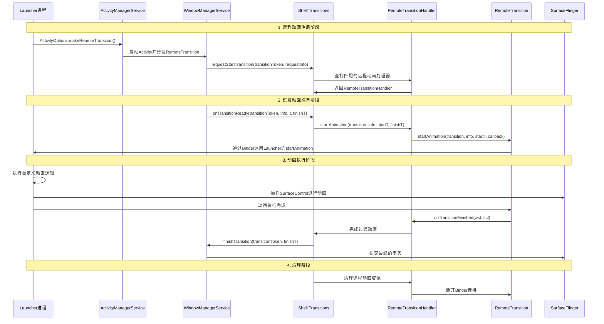

# Launcher远程动画与Window交互逻辑分析

## 概述

本文档详细分析Shell Transition系统中Launcher远程动画与Window的交互逻辑，包括远程动画的注册、分发、执行和完成流程。通过完整的流程图和代码分析，揭示Launcher如何通过远程动画机制实现流畅的窗口过渡效果。

## 架构组件

### 1. 核心组件关系

```
Launcher进程 (远程动画提供者)
    ↓
IRemoteTransition接口 (AIDL)
    ↓
WindowManager Shell进程 (动画协调者)
    ↓
RemoteTransitionHandler (远程动画处理器)
    ↓
WindowManagerService (窗口状态管理)
    ↓
SurfaceFlinger (图形合成)
```

### 2. 关键类说明

- **IRemoteTransition**: 远程动画接口，定义动画执行协议
- **RemoteTransition**: 远程动画的包装类，包含Binder引用
- **RemoteTransitionHandler**: Shell进程中的远程动画处理器
- **OneShotRemoteHandler**: 一次性远程动画处理器
- **Transitions**: Shell Transition系统的核心管理器

## 远程动画注册流程

### 1. Launcher注册远程动画

Launcher通过ActivityOptions注册远程动画：

```java
// Launcher中注册远程动画
ActivityOptions options = ActivityOptions.makeRemoteTransition(
    new RemoteTransition(launcherRemoteTransition)
);

// 启动应用时使用远程动画
Intent intent = new Intent(Intent.ACTION_MAIN);
intent.addCategory(Intent.CATEGORY_LAUNCHER);
intent.setComponent(component);
startActivity(intent, options.toBundle());
```

### 2. Shell Transition系统注册

Shell Transition系统通过TransitionFilter匹配远程动画：

```java
// 创建TransitionFilter匹配Launcher动画
TransitionFilter filter = new TransitionFilter();
filter.mType = TRANSIT_OPEN;  // 打开应用动画
filter.mFlags = TransitionInfo.FLAG_IS_WALLPAPER;

// 注册远程动画处理器
mTransitions.registerRemote(filter, launcherRemoteTransition);
```

## 完整的交互流程图



## 详细流程分析

### 1. 远程动画请求流程

当Launcher启动应用时，通过ActivityOptions传递RemoteTransition：

```java
// WindowManagerService处理过渡请求
public void requestStartTransition(@NonNull IBinder transitionToken,
        @NonNull TransitionRequestInfo request) {
    
    // 检查是否有远程动画请求
    RemoteTransition remote = request.getRemoteTransition();
    if (remote != null) {
        // 记录到请求的远程动画列表
        mRequestedRemotes.put(transitionToken, remote);
        ProtoLog.v(TAG, "RemoteTransition directly requested for %s", remote);
    }
    
    // 通知WindowManagerCore开始应用过渡
    mOrganizer.startTransition(transitionToken, request);
}
```

### 2. 过渡动画准备流程

当WindowManagerCore完成过渡应用后，通知Shell准备动画：

```java
// RemoteTransitionHandler处理动画开始
@Override
public boolean startAnimation(@NonNull IBinder transition, @NonNull TransitionInfo info,
        @NonNull SurfaceControl.Transaction startTransaction,
        @NonNull SurfaceControl.Transaction finishTransaction,
        @NonNull Transitions.TransitionFinishCallback finishCallback) {
    
    // 查找对应的远程动画
    RemoteTransition pendingRemote = mRequestedRemotes.get(transition);
    if (pendingRemote == null) {
        // 如果没有显式请求，通过过滤器查找
        for (int i = mFilters.size() - 1; i >= 0; --i) {
            if (mFilters.get(i).first.matches(info)) {
                pendingRemote = mFilters.get(i).second;
                mRequestedRemotes.put(transition, pendingRemote);
                break;
            }
        }
    }
    
    if (pendingRemote == null) return false;
    
    // 创建完成回调
    IRemoteTransitionFinishedCallback cb = new IRemoteTransitionFinishedCallback.Stub() {
        @Override
        public void onTransitionFinished(WindowContainerTransaction wct,
                SurfaceControl.Transaction sct) {
            // 处理动画完成
            if (sct != null) {
                finishTransaction.merge(sct);
            }
            mMainExecutor.execute(() -> {
                mRequestedRemotes.remove(transition);
                finishCallback.onTransitionFinished(wct);
            });
        }
    };
    
    // 执行远程动画
    try {
        pendingRemote.getRemoteTransition().startAnimation(
            transition, info, startTransaction, cb);
        startTransaction.clear(); // 假设远程会应用事务
        return true;
    } catch (RemoteException e) {
        Log.e(TAG, "Error running remote transition.", e);
        return false;
    }
}
```

### 3. Launcher端动画执行

Launcher实现IRemoteTransition接口处理动画：

```java
// Launcher中的远程动画实现
public class LauncherRemoteTransition extends IRemoteTransition.Stub {
    
    @Override
    public void startAnimation(IBinder transition, TransitionInfo info,
            SurfaceControl.Transaction startT, IRemoteTransitionFinishedCallback finishCallback) {
        
        // 解析过渡信息
        List<TransitionInfo.Change> changes = info.getChanges();
        
        // 创建动画控制器
        RemoteAnimationController controller = new RemoteAnimationController(
            transition, info, startT, finishCallback);
        
        // 执行自定义动画逻辑
        controller.startAnimation();
    }
    
    @Override
    public void mergeAnimation(IBinder transition, TransitionInfo info,
            SurfaceControl.Transaction t, IBinder mergeTarget,
            IRemoteTransitionFinishedCallback finishCallback) {
        // 处理动画合并
        mergeAnimations(transition, info, t, mergeTarget, finishCallback);
    }
}
```

### 4. 动画合并机制

Shell Transition支持动画合并，提高性能：

```java
// RemoteTransitionHandler处理动画合并
@Override
public void mergeAnimation(@NonNull IBinder transition, @NonNull TransitionInfo info,
        @NonNull SurfaceControl.Transaction startT,
        @NonNull SurfaceControl.Transaction finishT,
        @NonNull IBinder mergeTarget,
        @NonNull Transitions.TransitionFinishCallback finishCallback) {
    
    RemoteTransition remoteTransition = mRequestedRemotes.get(mergeTarget);
    if (remoteTransition == null) return;
    
    // 请求远程动画合并
    try {
        remoteTransition.getRemoteTransition().mergeAnimation(
            transition, info, startT, mergeTarget, finishCallback);
    } catch (RemoteException e) {
        Log.e(TAG, "Error merging remote transition.", e);
    }
}
```

## 关键交互点分析

### 1. Binder通信机制

远程动画通过Binder进行跨进程通信：

```java
// 远程动画接口定义
public interface IRemoteTransition extends IInterface {
    
    void startAnimation(IBinder transition, TransitionInfo info,
            SurfaceControl.Transaction startT, IRemoteTransitionFinishedCallback finishCallback);
    
    void mergeAnimation(IBinder transition, TransitionInfo info,
            SurfaceControl.Transaction t, IBinder mergeTarget,
            IRemoteTransitionFinishedCallback finishCallback);
}
```

### 2. SurfaceControl操作

Launcher通过SurfaceControl操作窗口表面：

```java
// 在Launcher中操作SurfaceControl
public void animateWindow(TransitionInfo.Change change, SurfaceControl leash) {
    // 设置动画属性
    Transaction t = new Transaction();
    t.setAlpha(leash, 0f); // 初始透明度
    t.show(leash); // 显示表面
    
    // 执行动画
    ValueAnimator animator = ValueAnimator.ofFloat(0f, 1f);
    animator.addUpdateListener(animation -> {
        float alpha = (float) animation.getAnimatedValue();
        Transaction frameT = new Transaction();
        frameT.setAlpha(leash, alpha);
        frameT.apply();
    });
    
    animator.start();
}
```

### 3. 事务管理

Shell Transition系统管理SurfaceControl事务：

```java
// 事务合并和提交
private void handleAnimationFinish(WindowContainerTransaction wct,
        SurfaceControl.Transaction sct) {
    
    // 合并远程动画的事务
    if (sct != null) {
        mFinishTransaction.merge(sct);
    }
    
    // 提交最终事务
    mMainExecutor.execute(() -> {
        finishCallback.onTransitionFinished(wct);
    });
}
```

## 性能优化特性

### 1. 进程优先级提升

远程动画执行期间提升Launcher进程优先级：

```java
// 提升动画进程优先级
Transitions.setRunningRemoteTransitionDelegate(remote.getAppThread());

// 在ActivityTaskManager中实现
public void setRunningRemoteTransitionDelegate(IApplicationThread appThread) {
    if (appThread == null) return;
    
    // 提升进程优先级
    setProcessImportant(appThread, true, "RemoteTransition");
}
```

### 2. 动画缩放设置

支持全局动画缩放设置：

```java
// 应用动画缩放
private void dispatchAnimScaleSetting(float scale) {
    for (TransitionHandler handler : mHandlers) {
        handler.setAnimScaleSetting(scale);
    }
}
```

### 3. 死亡监听机制

处理远程进程死亡情况：

```java
// 远程Binder死亡监听
private void handleDeath(@NonNull IBinder remote,
        @Nullable Transitions.TransitionFinishCallback finishCallback) {
    
    RemoteDeathHandler deathHandler = new RemoteDeathHandler(remote);
    remote.linkToDeath(deathHandler, 0);
    deathHandler.addUser(finishCallback);
}
```

## 调试和监控

### 1. 过渡追踪

集成Perfetto追踪系统：

```java
// 记录过渡事件
mTransitionTracer.logTransitionRequest(transitionToken, request);
mTransitionTracer.logTransitionReady(transitionToken, info);
mTransitionTracer.logTransitionStart(transitionToken);
mTransitionTracer.logTransitionFinish(transitionToken);
```

### 2. 性能指标

监控远程动画性能指标：

- **动画启动延迟**: 从请求到开始执行的时间
- **动画执行时间**: 动画实际执行的时间
- **Binder调用耗时**: 跨进程通信的时间
- **帧率稳定性**: 动画期间的帧率表现

## 常见场景分析

### 1. 应用启动动画

```
Launcher点击应用图标
    ↓
创建RemoteTransition并通过ActivityOptions传递
    ↓
WindowManagerService触发过渡请求
    ↓
Shell Transition系统匹配远程动画处理器
    ↓
Launcher执行自定义启动动画
    ↓
动画完成，应用窗口显示
```

### 2. 应用返回动画

```
用户点击返回键
    ↓
当前应用准备关闭
    ↓
Shell Transition系统请求Launcher动画
    ↓
Launcher执行返回动画（如缩放、淡出）
    ↓
动画完成，应用窗口关闭
```

### 3. 多任务切换动画

```
用户切换多任务
    ↓
Shell Transition系统检测到任务切换
    ↓
匹配Launcher的远程动画处理器
    ↓
Launcher执行任务切换动画
    ↓
动画完成，新任务窗口显示
```

## 总结

Launcher远程动画与Window的交互逻辑体现了Android图形系统的先进设计：

1. **模块化架构**: 将动画逻辑从系统服务中分离，提高可维护性
2. **跨进程协作**: 通过Binder实现Launcher与系统服务的无缝协作
3. **性能优化**: 支持动画合并、进程优先级提升等优化特性
4. **灵活扩展**: 支持自定义动画处理器，满足多样化需求

这种设计使得Launcher能够提供高度定制化的动画效果，同时保持系统级的性能和稳定性。通过完整的流程图和详细的代码分析，我们可以深入理解这一复杂但高效的交互机制。