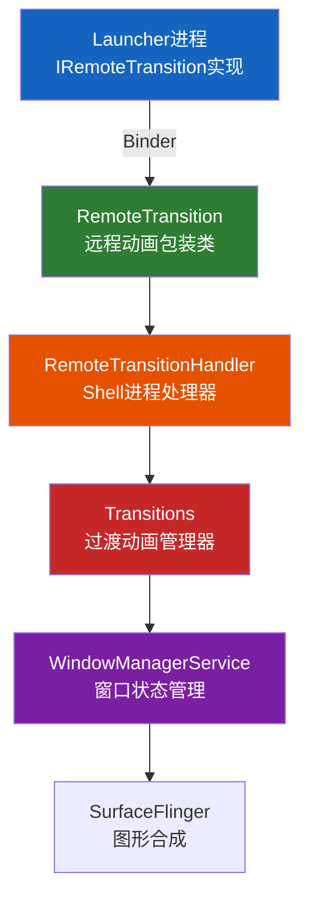
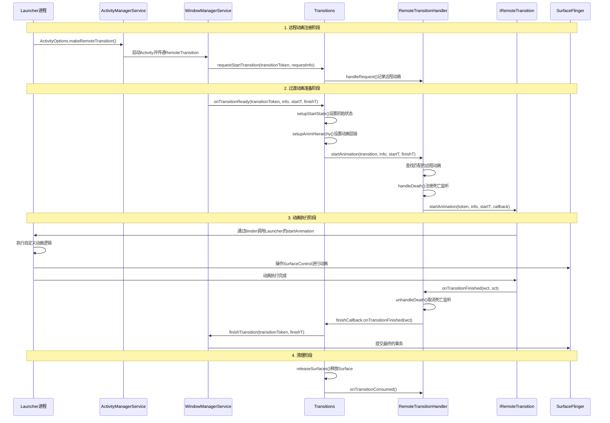
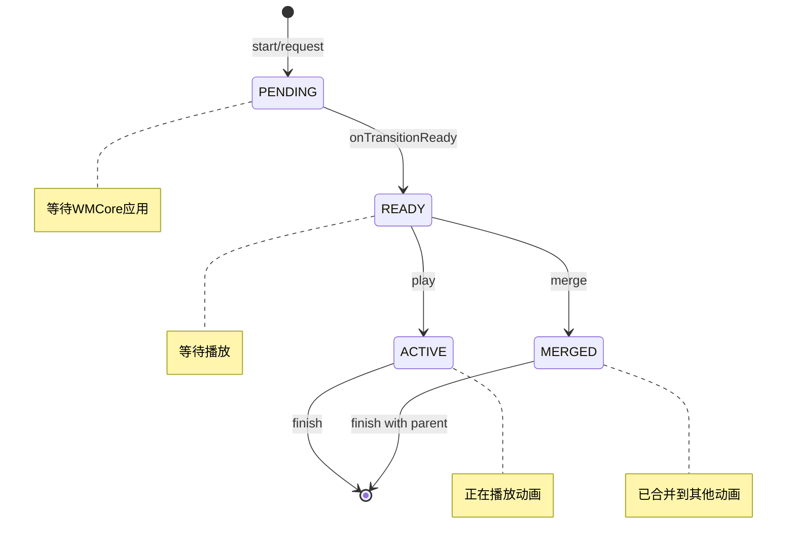
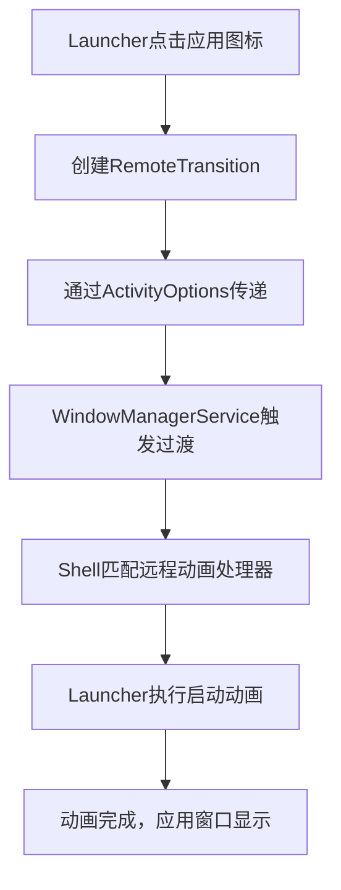
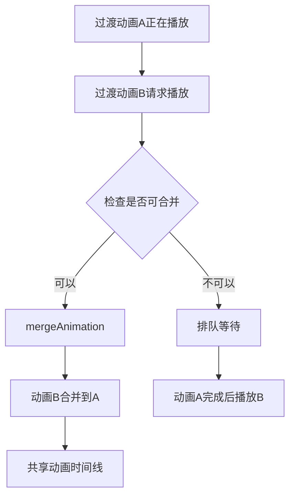
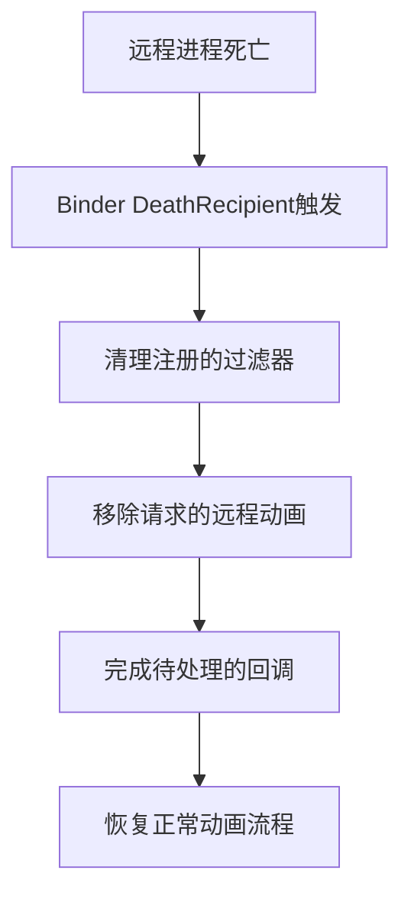

# Launcher远程动画与Window交互逻辑分析

## 概述

本文档基于AOSP源码详细分析Shell Transition系统中Launcher远程动画与Window的交互逻辑，包括远程动画的注册、分发、执行和完成流程。通过完整的流程图和代码分析，揭示Launcher如何通过远程动画机制实现流畅的窗口过渡效果。

## 架构组件

### 1. 核心组件关系



### 2. 关键类说明

| 类名 | 路径 | 职责 |
|------|------|------|
| **IRemoteTransition** | [IRemoteTransition.aidl](base/core/java/android/window/IRemoteTransition.aidl) | 远程动画接口，定义动画执行协议 |
| **RemoteTransition** | [RemoteTransition.java](base/core/java/android/window/RemoteTransition.java) | 远程动画的包装类，包含Binder引用和应用线程信息 |
| **RemoteTransitionHandler** | [RemoteTransitionHandler.java](base/libs/WindowManager/Shell/src/com/android/wm/shell/transition/RemoteTransitionHandler.java) | Shell进程中的远程动画处理器 |
| **OneShotRemoteHandler** | [OneShotRemoteHandler.java](base/libs/WindowManager/Shell/src/com/android/wm/shell/transition/OneShotRemoteHandler.java) | 一次性远程动画处理器 |
| **Transitions** | [Transitions.java](base/libs/WindowManager/Shell/src/com/android/wm/shell/transition/Transitions.java) | Shell Transition系统的核心管理器 |
| **TransitionFilter** | [TransitionFilter.java](base/core/java/android/window/TransitionFilter.java) | 过渡动画过滤器，用于匹配远程动画 |

## 远程动画接口定义

### 1. IRemoteTransition接口

```java
/**
 * 允许远程进程播放过渡动画的接口
 * 使用流程：
 * 1. 远程进程通过ActivityOptions#makeRemoteAnimation标记生命周期事件
 * 2. Shell将过渡事件与IRemoteTransition关联
 * 3. Shell收到onTransitionReady后委托给IRemoteTransition执行动画
 * 4. IRemoteTransition完成动画后调用finishCallback
 * 5. Shell/Core完成过渡
 */
oneway interface IRemoteTransition {
    /**
     * 启动过渡动画
     * @param token 过渡动画标识符
     * @param info 过渡动画信息
     * @param t SurfaceControl事务
     * @param finishCallback 完成回调
     */
    void startAnimation(in IBinder token, in TransitionInfo info, 
            in SurfaceControl.Transaction t,
            in IRemoteTransitionFinishedCallback finishCallback);

    /**
     * 尝试将过渡动画合并到当前正在播放的动画中
     * @param transition 要合并的过渡动画
     * @param mergeTarget 当前正在播放的过渡动画
     */
    void mergeAnimation(in IBinder transition, in TransitionInfo info,
            in SurfaceControl.Transaction t, in IBinder mergeTarget,
            in IRemoteTransitionFinishedCallback finishCallback);

    /**
     * 接管现有过渡动画的窗口动画
     */
    void takeOverAnimation(in IBinder transition, in TransitionInfo info,
            in SurfaceControl.Transaction t, 
            in IRemoteTransitionFinishedCallback finishCallback,
            in WindowAnimationState[] states);

    /**
     * 当其他处理器消费了过渡动画时调用
     */
    void onTransitionConsumed(in IBinder transition, in boolean aborted);
}
```

### 2. RemoteTransition包装类

```java
/**
 * 表示远程过渡动画及其运行所需信息
 */
public final class RemoteTransition implements Parcelable {
    /** 实际用于运行过渡动画的远程接口 */
    private @NonNull IRemoteTransition mRemoteTransition;

    /** 运行远程动画的应用线程（用于进程优先级提升） */
    private @Nullable IApplicationThread mAppThread;

    /** 调试名称 */
    private @Nullable String mDebugName;

    /** 获取底层Binder引用 */
    public @Nullable IBinder asBinder() {
        return mRemoteTransition.asBinder();
    }
}
```

### 3. 完成回调接口

```java
/**
 * 远程动画完成时由控制进程调用的接口
 */
interface IRemoteTransitionFinishedCallback {
    void onTransitionFinished(in WindowContainerTransaction wct, 
            in SurfaceControl.Transaction sct);
}
```

## 完整的交互流程图



## 详细流程分析

### 1. 远程动画请求流程

当Launcher启动应用时，通过ActivityOptions传递RemoteTransition：

```java
// RemoteTransitionHandler.java - 处理远程动画请求
@Override
@Nullable
public WindowContainerTransaction handleRequest(@NonNull IBinder transition,
        @Nullable TransitionRequestInfo request) {
    RemoteTransition remote = request.getRemoteTransition();
    if (remote == null) return null;
    
    // 记录到请求的远程动画列表
    mRequestedRemotes.put(transition, remote);
    ProtoLog.v(ShellProtoLogGroup.WM_SHELL_TRANSITIONS, 
            "RemoteTransition directly requested for (#%d) %s: %s", 
            request.getDebugId(), transition, remote);
    return new WindowContainerTransaction();
}
```

### 2. 过渡动画准备流程

Transitions类负责准备动画的初始状态和层级：

```java
// Transitions.java - 设置动画初始状态
private static void setupStartState(@NonNull TransitionInfo info,
        @NonNull SurfaceControl.Transaction t, 
        @NonNull SurfaceControl.Transaction finishT) {
    boolean isOpening = isOpeningType(info.getType());
    for (int i = info.getChanges().size() - 1; i >= 0; --i) {
        final TransitionInfo.Change change = info.getChanges().get(i);
        final SurfaceControl leash = change.getLeash();
        final int mode = change.getMode();

        if (mode == TRANSIT_OPEN || mode == TRANSIT_TO_FRONT) {
            t.show(leash);
            t.setMatrix(leash, 1, 0, 0, 1);
            if (isOpening) {
                t.setAlpha(leash, 0.f);  // 初始透明
            }
            finishT.show(leash);
        } else if (mode == TRANSIT_CLOSE || mode == TRANSIT_TO_BACK) {
            finishT.hide(leash);
        }
    }
}
```

### 3. RemoteTransitionHandler动画启动

```java
// RemoteTransitionHandler.java - 启动远程动画
@Override
public boolean startAnimation(@NonNull IBinder transition, @NonNull TransitionInfo info,
        @NonNull SurfaceControl.Transaction startTransaction,
        @NonNull SurfaceControl.Transaction finishTransaction,
        @NonNull Transitions.TransitionFinishCallback finishCallback) {
    
    // 检查是否忽略远程动画（显示尺寸或旋转变化）
    final boolean ignoreTransition = !Transitions.SHELL_TRANSITIONS_ROTATION
            && TransitionUtil.hasDisplayChange(info);
    if (ignoreTransition) {
        mRequestedRemotes.remove(transition);
        return false;
    }
    
    // 查找对应的远程动画
    RemoteTransition pendingRemote = mRequestedRemotes.get(transition);
    if (pendingRemote == null) {
        // 通过过滤器查找匹配的远程动画
        for (int i = mFilters.size() - 1; i >= 0; --i) {
            if (mFilters.get(i).first.matches(info)) {
                pendingRemote = mFilters.get(i).second;
                mRequestedRemotes.put(transition, pendingRemote);
                break;
            }
        }
    }

    if (pendingRemote == null) return false;

    final RemoteTransition remote = pendingRemote;
    
    // 创建完成回调
    IRemoteTransitionFinishedCallback cb = new IRemoteTransitionFinishedCallback.Stub() {
        @Override
        public void onTransitionFinished(WindowContainerTransaction wct,
                SurfaceControl.Transaction sct) {
            unhandleDeath(remote.asBinder(), finishCallback);
            if (sct != null) {
                finishTransaction.merge(sct);
            }
            mMainExecutor.execute(() -> {
                mRequestedRemotes.remove(transition);
                finishCallback.onTransitionFinished(wct);
            });
        }
    };
    
    // 处理本地进程的特殊情况
    final SurfaceControl.Transaction remoteStartT =
            copyIfLocal(startTransaction, remote.getRemoteTransition());
    final TransitionInfo remoteInfo =
            remoteStartT == startTransaction ? info : info.localRemoteCopy();
            
    try {
        handleDeath(remote.asBinder(), finishCallback);
        remote.getRemoteTransition().startAnimation(
                transition, remoteInfo, remoteStartT, cb);
        startTransaction.clear();  // 假设远程会应用事务
        Transitions.setRunningRemoteTransitionDelegate(remote.getAppThread());
    } catch (RemoteException e) {
        Log.e(Transitions.TAG, "Error running remote transition.", e);
        startTransaction.apply();
        unhandleDeath(remote.asBinder(), finishCallback);
        mRequestedRemotes.remove(transition);
        mMainExecutor.execute(() -> finishCallback.onTransitionFinished(null));
    }
    return true;
}
```

### 4. 本地进程事务复制机制

```java
// RemoteTransitionHandler.java - 处理本地进程的特殊情况
static SurfaceControl.Transaction copyIfLocal(SurfaceControl.Transaction t,
        IRemoteTransition remote) {
    // 检查是否是本地接口
    if (remote.asBinder().queryLocalInterface(IRemoteTransition.DESCRIPTOR) == null) {
        return t;  // 非本地，Binder会自动序列化
    }
    
    // 本地接口需要复制事务，因为远程实现会清理本地native引用
    final Parcel p = Parcel.obtain();
    try {
        t.writeToParcel(p, 0);
        p.setDataPosition(0);
        return SurfaceControl.Transaction.CREATOR.createFromParcel(p);
    } finally {
        p.recycle();
    }
}
```

### 5. 动画合并机制

```java
// RemoteTransitionHandler.java - 动画合并
@Override
public void mergeAnimation(@NonNull IBinder transition, @NonNull TransitionInfo info,
        @NonNull SurfaceControl.Transaction startT,
        @NonNull SurfaceControl.Transaction finishT,
        @NonNull IBinder mergeTarget,
        @NonNull Transitions.TransitionFinishCallback finishCallback) {
    
    final RemoteTransition remoteTransition = mRequestedRemotes.get(mergeTarget);
    if (remoteTransition == null) return;

    final IRemoteTransition remote = remoteTransition.getRemoteTransition();
    if (remote == null) return;

    IRemoteTransitionFinishedCallback cb = new IRemoteTransitionFinishedCallback.Stub() {
        @Override
        public void onTransitionFinished(WindowContainerTransaction wct,
                SurfaceControl.Transaction sct) {
            // 清理本地事务，避免重复应用
            startT.clear();
            mMainExecutor.execute(() -> {
                finishCallback.onTransitionFinished(wct);
            });
        }
    };
    
    try {
        final SurfaceControl.Transaction remoteT = copyIfLocal(startT, remote);
        final TransitionInfo remoteInfo = remoteT == startT ? info : info.localRemoteCopy();
        remote.mergeAnimation(transition, remoteInfo, remoteT, mergeTarget, cb);
    } catch (RemoteException e) {
        Log.e(Transitions.TAG, "Error attempting to merge remote transition.", e);
    }
}
```

## TransitionFilter匹配机制

### 1. 过滤器结构

```java
// TransitionFilter.java - 过渡动画过滤器
public final class TransitionFilter implements Parcelable {
    /** 匹配的过渡类型集合 */
    @Nullable public @TransitionType int[] mTypeSet = null;

    /** 必须设置的标志 */
    public @WindowManager.TransitionFlags int mFlags = 0;

    /** 必须未设置的标志 */
    public @WindowManager.TransitionFlags int mNotFlags = 0;

    /** 变更要求列表 */
    @Nullable public Requirement[] mRequirements = null;

    /** 检查info是否满足所有要求 */
    public boolean matches(@NonNull TransitionInfo info) {
        // 检查类型
        if (mTypeSet != null) {
            boolean typePass = false;
            for (int i = 0; i < mTypeSet.length; ++i) {
                if (info.getType() == mTypeSet[i]) {
                    typePass = true;
                    break;
                }
            }
            if (!typePass) return false;
        }
        
        // 检查标志
        if ((info.getFlags() & mFlags) != mFlags) return false;
        if ((info.getFlags() & mNotFlags) != 0) return false;
        
        // 检查所有要求
        if (mRequirements != null) {
            for (int i = 0; i < mRequirements.length; ++i) {
                final boolean matches = mRequirements[i].matches(info);
                if (matches == mRequirements[i].mNot) return false;
            }
        }
        return true;
    }
}
```

### 2. Requirement要求定义

```java
// TransitionFilter.java - 变更要求
public static final class Requirement implements Parcelable {
    public int mActivityType = ACTIVITY_TYPE_UNDEFINED;
    public boolean mMustBeIndependent = true;
    public boolean mNot = false;
    public int[] mModes = null;
    public @TransitionInfo.ChangeFlags int mFlags = 0;
    public boolean mMustBeTask = false;
    public @ContainerOrder int mOrder = CONTAINER_ORDER_ANY;
    public ComponentName mTopActivity;
    public IBinder mLaunchCookie;
    public Boolean mCustomAnimation = null;
    public int mWindowingMode = WINDOWING_MODE_UNDEFINED;
    public boolean mIsCrossDisplayMove = false;

    /** 检查变更是否匹配此要求 */
    boolean matches(@NonNull TransitionInfo info) {
        for (int i = info.getChanges().size() - 1; i >= 0; --i) {
            final TransitionInfo.Change change = info.getChanges().get(i);
            
            // 检查独立性
            if (mMustBeIndependent && !TransitionInfo.isIndependent(change, info)) {
                continue;
            }
            
            // 检查是否是顶层
            if (mOrder == CONTAINER_ORDER_TOP && i > 0) {
                continue;
            }
            
            // 检查Activity类型
            if (mActivityType != ACTIVITY_TYPE_UNDEFINED) {
                if (change.getTaskInfo() == null ||
                    change.getTaskInfo().getActivityType() != mActivityType) {
                    continue;
                }
            }
            
            // 检查模式
            if (mModes != null) {
                boolean pass = false;
                for (int m = 0; m < mModes.length; ++m) {
                    if (mModes[m] == change.getMode()) {
                        pass = true;
                        break;
                    }
                }
                if (!pass) continue;
            }
            
            return true;
        }
        return false;
    }
}
```

## Transitions核心管理器

### 1. 过渡动画生命周期



### 2. Track机制

```java
// Transitions.java - Track管理
private static class Track {
    /** 等待播放的过渡动画队列 */
    final ArrayList<ActiveTransition> mReadyTransitions = new ArrayList<>();

    /** 当前正在播放的过渡动画 */
    ActiveTransition mActiveTransition = null;

    boolean isIdle() {
        return mActiveTransition == null && mReadyTransitions.isEmpty();
    }
}
```

### 3. 动画分发机制

```java
// Transitions.java - 分发过渡动画
public TransitionHandler dispatchTransition(
        @NonNull IBinder transition,
        @NonNull TransitionInfo info,
        @NonNull SurfaceControl.Transaction startT,
        @NonNull SurfaceControl.Transaction finishT,
        @NonNull TransitionFinishCallback finishCB,
        @Nullable TransitionHandler skip) {
    
    // 按优先级顺序尝试每个处理器
    for (int i = mHandlers.size() - 1; i >= 0; --i) {
        if (mHandlers.get(i) == skip) continue;
        
        boolean consumed = mHandlers.get(i).startAnimation(
                transition, info, startT, finishT, finishCB);
        if (consumed) {
            ProtoLog.v(WM_SHELL_TRANSITIONS, " animated by %s", mHandlers.get(i));
            return mHandlers.get(i);
        }
    }
    throw new IllegalStateException("No handler consumed the transition.");
}
```

## 关键交互点分析

### 1. Binder通信机制


**关键特性：**
- IRemoteTransition使用`oneway`关键字，表示异步调用
- 回调接口IRemoteTransitionFinishedCallback是同步的
- 支持跨进程的SurfaceControl.Transaction传递

### 2. 死亡监听机制

```java
// RemoteTransitionHandler.java - 处理远程进程死亡
private void handleDeath(@NonNull IBinder remote,
        @Nullable Transitions.TransitionFinishCallback finishCallback) {
    synchronized (mDeathHandlers) {
        RemoteDeathHandler deathHandler = mDeathHandlers.get(remote);
        if (deathHandler == null) {
            deathHandler = new RemoteDeathHandler(remote);
            try {
                remote.linkToDeath(deathHandler, 0);
            } catch (RemoteException e) {
                Slog.e(TAG, "Failed to link to death");
                return;
            }
            mDeathHandlers.put(remote, deathHandler);
        }
        deathHandler.addUser(finishCallback);
    }
}

private class RemoteDeathHandler implements IBinder.DeathRecipient {
    @Override
    @BinderThread
    public void binderDied() {
        mMainExecutor.execute(() -> {
            // 清理所有相关过渡动画
            for (int i = mFilters.size() - 1; i >= 0; --i) {
                if (mRemote.equals(mFilters.get(i).second.asBinder())) {
                    mFilters.remove(i);
                }
            }
            // 完成所有待处理的回调
            for (int i = mPendingFinishCallbacks.size() - 1; i >= 0; --i) {
                mPendingFinishCallbacks.get(i).onTransitionFinished(null);
            }
        });
    }
}
```

### 3. 进程优先级提升

```java
// Transitions.java - 提升动画进程优先级
public static void setRunningRemoteTransitionDelegate(IApplicationThread appThread) {
    if (appThread == null) return;
    try {
        ActivityTaskManager.getService().setRunningRemoteTransitionDelegate(appThread);
    } catch (SecurityException e) {
        Log.e(TAG, "Unable to boost animation process.");
    } catch (RemoteException e) {
        e.rethrowFromSystemServer();
    }
}
```

## OneShotRemoteHandler一次性处理器

```java
// OneShotRemoteHandler.java - 一次性远程动画处理器
public class OneShotRemoteHandler implements Transitions.TransitionHandler {
    private final ShellExecutor mMainExecutor;
    private IBinder mTransition = null;
    private RemoteTransition mRemote;

    @Override
    public boolean startAnimation(@NonNull IBinder transition, @NonNull TransitionInfo info,
            @NonNull SurfaceControl.Transaction startTransaction,
            @NonNull SurfaceControl.Transaction finishTransaction,
            @NonNull Transitions.TransitionFinishCallback finishCallback) {
        if (mTransition != transition) return false;

        final IBinder.DeathRecipient remoteDied = createDeathRecipient(finishCallback);
        IRemoteTransitionFinishedCallback cb = createFinishedCallback(
                info, finishTransaction, finishCallback, remoteDied);
        
        Transitions.setRunningRemoteTransitionDelegate(mRemote.getAppThread());
        
        try {
            if (mRemote.asBinder() != null) {
                mRemote.asBinder().linkToDeath(remoteDied, 0);
            }
            final SurfaceControl.Transaction remoteStartT = 
                    RemoteTransitionHandler.copyIfLocal(startTransaction, 
                            mRemote.getRemoteTransition());
            final TransitionInfo remoteInfo = 
                    remoteStartT == startTransaction ? info : info.localRemoteCopy();
            mRemote.getRemoteTransition().startAnimation(
                    transition, remoteInfo, remoteStartT, cb);
            startTransaction.clear();
        } catch (RemoteException e) {
            Log.e(Transitions.TAG, "Error running remote transition.", e);
            finishCallback.onTransitionFinished(null);
            mRemote = null;
        }
        return true;
    }

    @Override
    public boolean takeOverAnimation(@NonNull IBinder transition, @NonNull TransitionInfo info,
            @NonNull SurfaceControl.Transaction transaction,
            @NonNull Transitions.TransitionFinishCallback finishCallback,
            @NonNull WindowAnimationState[] states) {
        // 接管现有动画的实现
        // ...
    }
}
```

## 性能优化特性

### 1. 动画缩放设置

```java
// Transitions.java - 应用动画缩放
private void dispatchAnimScaleSetting(float scale) {
    for (int i = mHandlers.size() - 1; i >= 0; --i) {
        mHandlers.get(i).setAnimScaleSetting(scale);
    }
}
```

### 2. Surface释放优化

```java
// Transitions.java - 释放动画Surface
private void releaseSurfaces(@Nullable TransitionInfo info) {
    if (info == null) return;
    if (Flags.releaseAllTransitionSurfaces()) {
        info.releaseAllSurfaces();
        return;
    }
    info.releaseAnimSurfaces();
}
```

### 3. 同步过渡处理

```java
// Transitions.java - 处理同步过渡
private static final int SYNC_ALLOWANCE_MS = 120;

boolean dispatchReady(ActiveTransition active) {
    final TransitionInfo info = active.mInfo;

    if (info.getType() == TRANSIT_SLEEP || active.isSync()) {
        mReadyDuringSync.add(0, active);
        boolean hadPreceding = false;
        
        // 刷新所有活动的Track
        for (int i = 0; i < mTracks.size(); ++i) {
            final Track tr = mTracks.get(i);
            if (tr.isIdle()) continue;
            hadPreceding = true;
            finishForSync(active.mToken, i, null);
        }
        
        if (hadPreceding) return false;
        mReadyDuringSync.remove(active);
    }
    // ...
}
```

## 调试和监控

### 1. 过渡追踪

```java
// Transitions.java - Perfetto追踪集成
private final TransitionTracer mTransitionTracer;

// 记录过渡事件
mTransitionTracer.logTransitionRequest(transitionToken, request);
mTransitionTracer.logTransitionReady(transitionToken, info);
mTransitionTracer.logTransitionStart(transitionToken);
mTransitionTracer.logTransitionFinish(transitionToken);
mTransitionTracer.logMerged(mergedId, targetId);
mTransitionTracer.logAborted(info.getDebugId());
```

### 2. ProtoLog日志

```java
// 使用ProtoLog记录关键事件
ProtoLog.v(WM_SHELL_TRANSITIONS, 
        "onTransitionReady (#%d) %s: %s", 
        info.getDebugId(), transitionToken, info.toString());

ProtoLog.v(WM_SHELL_TRANSITIONS, 
        "Transition animation finished (aborted=%b), notifying core %s", 
        active.mAborted, active);
```

### 3. 性能指标

监控远程动画性能指标：

| 指标 | 描述 | 监控方法 |
|------|------|----------|
| **动画启动延迟** | 从请求到开始执行的时间 | TransitionTracer |
| **动画执行时间** | 动画实际执行的时间 | onTransitionFinished回调 |
| **Binder调用耗时** | 跨进程通信的时间 | Perfetto追踪 |
| **帧率稳定性** | 动画期间的帧率表现 | FrameMetrics |

## 常见场景分析

### 1. 应用启动动画



### 2. 动画合并场景



### 3. 进程死亡处理



## 总结

Launcher远程动画与Window的交互逻辑体现了Android图形系统的先进设计：

1. **模块化架构**：将动画逻辑从系统服务中分离，通过RemoteTransition包装类实现跨进程协作
2. **跨进程协作**：通过Binder实现Launcher与系统服务的无缝协作，支持异步调用和同步回调
3. **性能优化**：支持动画合并、进程优先级提升、Surface及时释放等优化特性
4. **健壮性设计**：完善的死亡监听机制、事务复制机制、同步过渡处理
5. **灵活扩展**：通过TransitionFilter实现灵活的动画匹配，支持自定义动画处理器

这种设计使得Launcher能够提供高度定制化的动画效果，同时保持系统级的性能和稳定性。通过完整的流程图和详细的源码分析，我们可以深入理解这一复杂但高效的交互机制。

---

**文档版本**: 2.0  
**基于AOSP版本**: Android 16  
**最后更新**: 2026年2月12日  
**源码路径**: 
- [IRemoteTransition.aidl](base/core/java/android/window/IRemoteTransition.aidl)
- [RemoteTransition.java](base/core/java/android/window/RemoteTransition.java)
- [RemoteTransitionHandler.java](base/libs/WindowManager/Shell/src/com/android/wm/shell/transition/RemoteTransitionHandler.java)
- [Transitions.java](base/libs/WindowManager/Shell/src/com/android/wm/shell/transition/Transitions.java)
- [TransitionFilter.java](base/core/java/android/window/TransitionFilter.java)
- [OneShotRemoteHandler.java](base/libs/WindowManager/Shell/src/com/android/wm/shell/transition/OneShotRemoteHandler.java)
