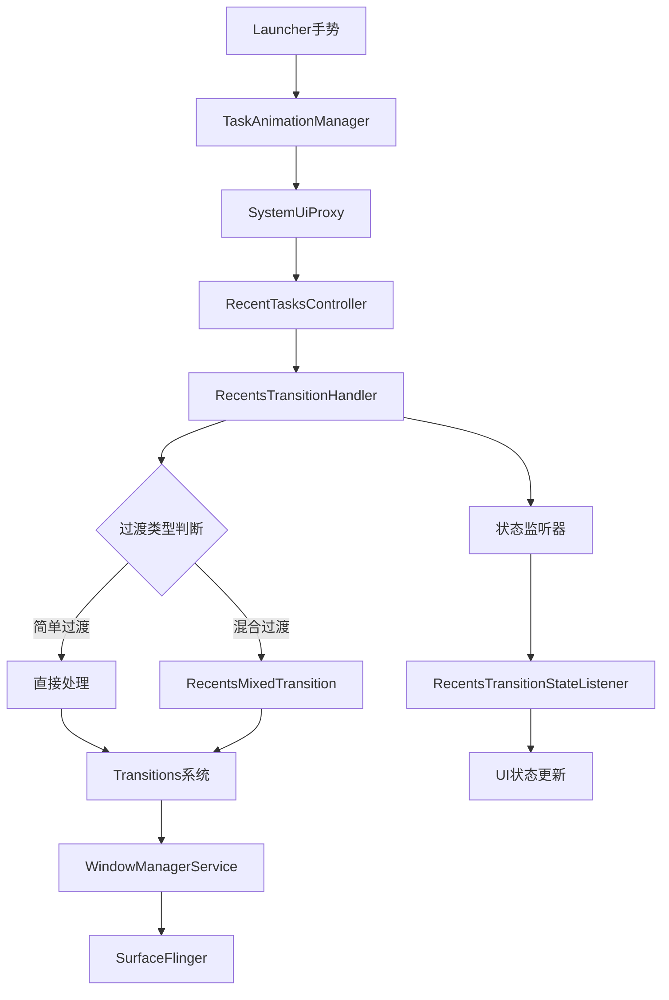
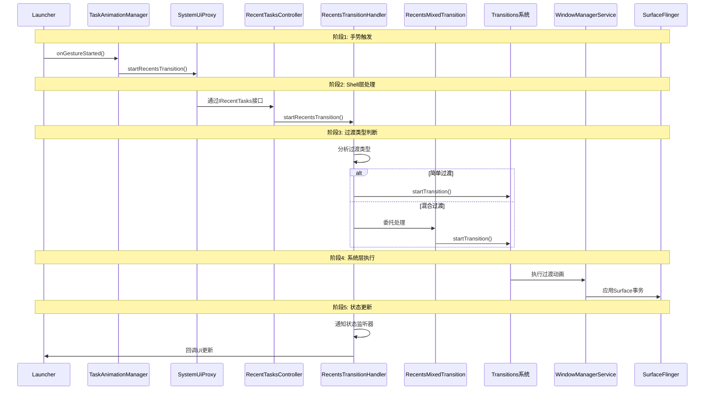

# AOSP 16 Recent Tasks 架构分析

## 概述

在 AOSP 16 中，Recent Tasks（最近任务）系统的架构经历了重大重构，从传统的 `RecentsAnimationController` 架构转向了基于 `WindowManager Shell` 的现代化架构。新的架构更加模块化、可扩展，并支持多窗口、桌面模式等新特性。

## 架构演进

### AOSP 13 及之前
- **客户端**: `com.android.quickstep.RecentsAnimationController`
- **服务端**: `com.android.server.wm.RecentsAnimationController`
- **通信**: 通过 AIDL 接口直接通信

### AOSP 16 新架构
- **Shell 层**: `com.android.wm.shell.recents` 包下的多个组件
- **核心控制器**: `RecentTasksController` 和 `RecentsTransitionHandler`
- **混合处理**: `RecentsMixedTransition` 支持复杂场景
- **状态监听**: `RecentsTransitionStateListener` 提供状态管理

## 核心组件分析

### 1. RecentTasksController - 任务管理核心

**文件路径**: `base/libs/WindowManager/Shell/src/com/android/wm/shell/recents/RecentTasksController.java`

**主要职责**:
- 管理最近任务列表的缓存和更新
- 处理任务分屏和桌面模式
- 提供任务信息的查询接口
- 监听任务栈变化

**核心成员**:
```java
public class RecentTasksController implements TaskStackListenerCallback,
        RemoteCallable<RecentTasksController>, DesktopRepository.ActiveTasksListener,
        TaskStackTransitionObserver.TaskStackTransitionObserverListener, UserChangeListener,
        DesktopRepository.DeskChangeListener {
    
    private final RecentTasksImpl mImpl = new RecentTasksImpl();
    private RecentsTransitionHandler mTransitionHandler = null;
    private IRecentTasksListener mListener;
    
    // 分屏任务管理
    private final SparseIntArray mSplitTasks = new SparseIntArray();
    private final Map<Integer, SplitBounds> mTaskSplitBoundsMap = new HashMap<>();
    
    // 可见任务缓存
    private final List<RunningTaskInfo> mVisibleTasks = new ArrayList<>();
    private final Map<Integer, TaskInfo> mVisibleTasksMap = new HashMap<>();
}
```

### 2. RecentsTransitionHandler - 过渡动画处理

**文件路径**: `base/libs/WindowManager/Shell/src/com/android/wm/shell/recents/RecentsTransitionHandler.java`

**主要职责**:
- 处理 Recents（概览）动画的启动和完成
- 管理过渡动画的生命周期
- 支持合成过渡和真实系统过渡
- 协调多窗口和桌面模式的动画

**核心方法**:
```java
public class RecentsTransitionHandler implements Transitions.TransitionHandler,
        Transitions.TransitionObserver {
    
    // 启动 Recents 过渡
    public void startRecentsTransition(...) {
        // 处理过渡动画的启动逻辑
    }
    
    // 处理过渡请求
    @Override
    public boolean startTransition(@NonNull TransitionRequestInfo request) {
        // 处理过渡请求
    }
    
    // 动画混合处理
    public void addMixer(RecentsMixedHandler mixer) {
        mMixers.add(mixer);
    }
}
```

### 3. RecentsMixedTransition - 混合过渡处理

**文件路径**: `base/libs/WindowManager/Shell/src/com/android/wm/shell/transition/RecentsMixedTransition.java`

**主要职责**:
- 处理 Recents 与其他过渡类型的混合场景
- 支持分屏、PiP、桌面模式等复杂场景
- 提供过渡动画的协调和同步

**核心逻辑**:

```java
public class RecentsMixedTransition implements Transitions.TransitionHandler {
    
    @Override
    public boolean startAnimation(@NonNull IBinder transition, @NonNull TransitionInfo info,
            @NonNull SurfaceControl.Transaction startT,
            @NonNull SurfaceControl.Transaction finishT,
            @NonNull Transitions.TransitionFinishCallback finishCallback) {
        // 处理混合过渡动画
    }
}
```

## 新的架构流程图



## 详细调用序列



## 关键变化分析

### 1. 架构分层更加清晰

**AOSP 13**:
- 客户端和服务端直接通信
- 职责边界不够清晰

**AOSP 16**:
```
Launcher层 (UI控制)
    ↓
Shell层 (业务逻辑)
    ↓  
系统层 (窗口管理)
    ↓
内核层 (Surface控制)
```

### 2. 支持混合过渡场景

新的架构支持多种复杂的过渡场景：

```java
// 分屏过渡
TRANSIT_SPLIT_SCREEN_PAIR

// PiP过渡  
TRANSIT_PIP

// 桌面模式过渡
TRANSIT_DESKTOP_MODE

// Recents过渡
TRANSIT_START_RECENTS_TRANSITION
TRANSIT_END_RECENTS_TRANSITION
```

### 3. 状态管理更加完善

通过 `RecentsTransitionStateListener` 提供完整的状态管理：

```java
public interface RecentsTransitionStateListener {
    int TRANSITION_STATE_NOT_RUNNING = 0;
    int TRANSITION_STATE_REQUESTED = 1;
    int TRANSITION_STATE_ANIMATING = 2;
    
    void onTransitionStateChanged(int state);
}
```

### 4. 桌面模式支持

AOSP 16 新增了对桌面模式的支持：

```java
public class RecentTasksController implements DesktopRepository.ActiveTasksListener,
        DesktopRepository.DeskChangeListener {
    
    // 处理桌面模式任务
    private final Map<Integer, Desk> mTmpDesks = new HashMap<>();
    
    @Override
    public void onDeskChanged(int deskId, boolean created) {
        // 处理桌面变化
    }
}
```

## 核心接口和AIDL

### 1. IRecentTasks 接口

**位置**: `frameworks/base/core/java/android/window/IRecentTasks.aidl`

**主要方法**:
```java
interface IRecentTasks {
    // 启动Recents过渡
    void startRecentsTransition(in PendingIntent recentsIntent, in Intent intent,
            in Bundle options, in IApplicationThread appThread,
            in IRecentsAnimationRunner runner);
    
    // 取消Recents动画
    void cancelRecentsAnimation(boolean restoreHomeStackPosition);
    
    // 获取最近任务
    List<RecentTaskInfo> getRecentTasks(int maxNum, int flags, int userId);
}
```

### 2. RecentsAnimationRunner 接口

**位置**: `frameworks/base/core/java/android/window/IRecentsAnimationRunner.aidl`

**主要回调**:
```java
interface IRecentsAnimationRunner {
    // 动画开始回调
    void onAnimationStart(in IRecentsAnimationController controller,
            in RemoteAnimationTarget[] apps, in RemoteAnimationTarget[] wallpapers,
            in Rect homeContentInsets, in Rect minimizedHomeBounds, in Bundle extras,
            in TransitionInfo transitionInfo);
    
    // 动画取消回调
    void onAnimationCanceled(in Map taskThumbnails);
    
    // 任务出现回调
    void onTasksAppeared(in RemoteAnimationTarget[] apps);
}
```

## 线程模型

### 1. Shell主线程
```java
@ShellMainThread
ShellExecutor mMainExecutor;
```

所有Shell组件的核心操作都在Shell主线程执行，确保线程安全。

### 2. 异步回调处理
```java
mExecutor.execute(() -> {
    // 异步处理过渡动画
    startTransitionInternal(request);
});
```

### 3. Binder线程池
AIDL回调在Binder线程池执行，需要切换到适当的线程：

```java
@BinderThread
public void onAnimationStart(...) {
    mMainExecutor.execute(() -> {
        // 切换到Shell主线程处理
        handleAnimationStart(...);
    });
}
```

## 性能优化

### 1. 任务缓存机制
```java
// 缓存可见任务列表
private final List<RunningTaskInfo> mVisibleTasks = new ArrayList<>();
private final Map<Integer, TaskInfo> mVisibleTasksMap = new HashMap<>();
```

### 2. 过渡动画复用
支持合成过渡和真实系统过渡的智能选择：

```java
// 合成过渡（性能优化）
public static final IBinder SYNTHETIC_TRANSITION = new Binder();

// 真实系统过渡
TRANSIT_START_RECENTS_TRANSITION
```

### 3. 背景颜色优化
```java
public void setTransitionBackgroundColor(@Nullable Color color) {
    mBackgroundColor = color;
}
```

## 错误处理和恢复

### 1. 过渡超时处理
```java
private static final int CANCEL_WITH_SNAPSHOTS_FINISH_TIMEOUT_MS = 200;
```

### 2. 状态一致性保证
通过状态监听器确保UI状态与系统状态一致：

```java
public void addTransitionStateListener(RecentsTransitionStateListener listener) {
    mStateListeners.add(listener);
}
```

### 3. 资源清理
```java
private void cleanupTransition() {
    // 清理过渡资源
    mAnimApp = null;
    mFinishTransactionSupplier = null;
}
```

## 测试支持

### 1. 单元测试
```java
@VisibleForTesting
public void setFinishTransactionSupplier(
        Supplier<SurfaceControl.Transaction> finishTransactionSupplier) {
    mFinishTransactionSupplier = finishTransactionSupplier;
}
```

### 2. 集成测试
通过Shell命令处理器支持测试：

```java
private final RecentsShellCommandHandler mRecentsShellCommandHandler;
```

## 总结

AOSP 16 的 Recent Tasks 架构相比 AOSP 13 有了重大改进：

### 主要优势
1. **模块化设计**: 各组件职责清晰，易于维护和扩展
2. **混合过渡支持**: 支持复杂场景的动画处理
3. **桌面模式集成**: 原生支持多桌面环境
4. **性能优化**: 缓存机制和过渡复用提升性能
5. **测试友好**: 完善的测试支持框架

### 架构演进意义
新的架构为 Android 系统的多窗口、桌面模式等高级特性提供了坚实的基础，体现了 Android 系统向更加现代化、模块化方向发展的趋势。

### 未来展望
随着 Android 系统的不断发展，Recent Tasks 架构可能会进一步演进，支持更多的交互模式和设备类型，为用户提供更加流畅和智能的任务管理体验。


- 