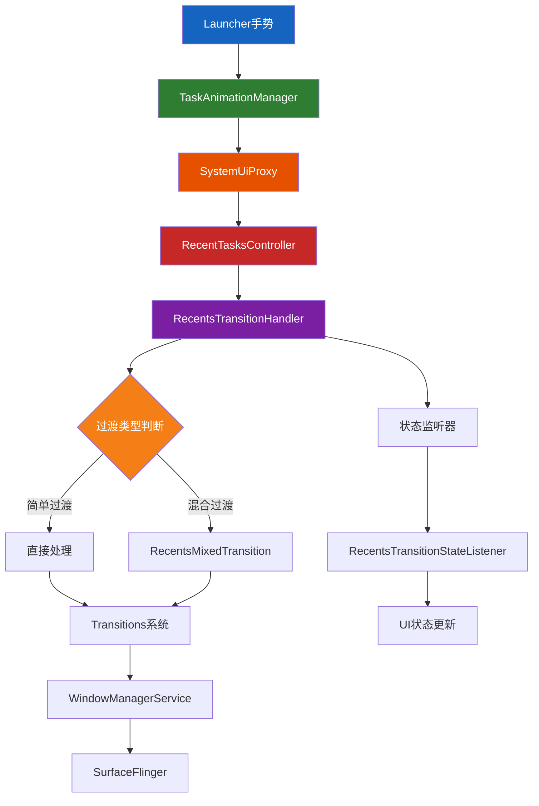
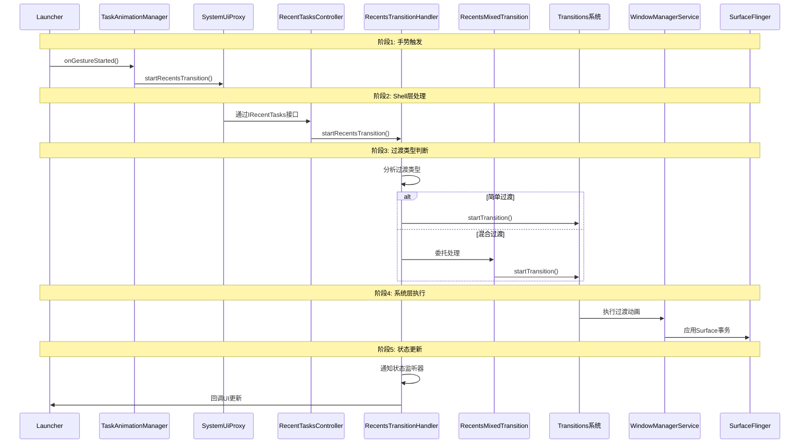
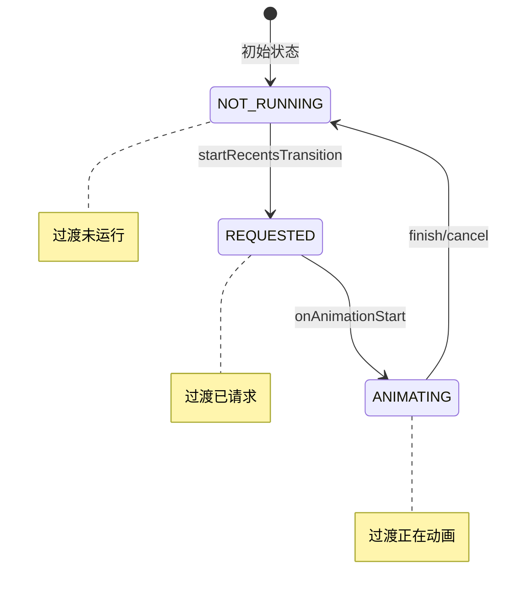
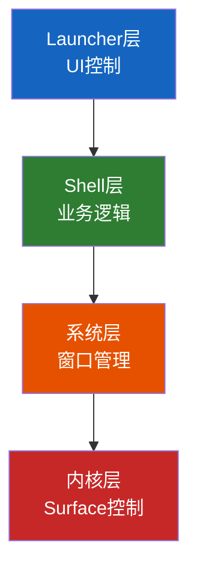

# AOSP 16 Recent Tasks 架构分析

## 概述

在 AOSP 16 中，Recent Tasks（最近任务）系统的架构经历了重大重构，从传统的 `RecentsAnimationController` 架构转向了基于 `WindowManager Shell` 的现代化架构。新的架构更加模块化、可扩展，并支持多窗口、桌面模式等新特性。本文档基于AOSP源码进行详细分析。

## 架构演进

### AOSP 13 及之前
- **客户端**: `com.android.quickstep.RecentsAnimationController`
- **服务端**: `com.android.server.wm.RecentsAnimationController`
- **通信**: 通过 AIDL 接口直接通信

### AOSP 16 新架构
- **Shell 层**: `com.android.wm.shell.recents` 包下的多个组件
- **核心控制器**: `RecentTasksController` 和 `RecentsTransitionHandler`
- **混合处理**: `RecentsMixedTransition` 支持复杂场景
- **状态监听**: `RecentsTransitionStateListener` 提供状态管理

## 核心组件分析

### 1. RecentTasksController - 任务管理核心

**文件路径**: [RecentTasksController.java](base/libs/WindowManager/Shell/src/com/android/wm/shell/recents/RecentTasksController.java)

**主要职责**:
- 管理最近任务列表的缓存和更新
- 处理任务分屏和桌面模式
- 提供任务信息的查询接口
- 监听任务栈变化

**核心成员**:
```java
public class RecentTasksController implements TaskStackListenerCallback,
        RemoteCallable<RecentTasksController>, DesktopRepository.ActiveTasksListener,
        TaskStackTransitionObserver.TaskStackTransitionObserverListener, UserChangeListener,
        DesktopRepository.DeskChangeListener {
    
    private final RecentTasksImpl mImpl = new RecentTasksImpl();
    private RecentsTransitionHandler mTransitionHandler = null;
    private IRecentTasksListener mListener;
    
    // 分屏任务管理
    private final SparseIntArray mSplitTasks = new SparseIntArray();
    private final Map<Integer, SplitBounds> mTaskSplitBoundsMap = new HashMap<>();
    
    // 可见任务缓存
    private final List<RunningTaskInfo> mVisibleTasks = new ArrayList<>();
    private final Map<Integer, TaskInfo> mVisibleTasksMap = new HashMap<>();
    
    // 桌面模式支持
    private final Optional<DesktopUserRepositories> mDesktopUserRepositories;
    private final DesktopState mDesktopState;
}
```

**分屏任务管理**:
```java
// 添加分屏任务对
public boolean addSplitPair(int taskId1, int taskId2, SplitBounds splitBounds) {
    if (taskId1 == taskId2) {
        return false;
    }
    // 移除之前的配对
    removeSplitPair(taskId1);
    removeSplitPair(taskId2);
    
    mSplitTasks.put(taskId1, taskId2);
    mSplitTasks.put(taskId2, taskId1);
    mTaskSplitBoundsMap.put(taskId1, splitBounds);
    mTaskSplitBoundsMap.put(taskId2, splitBounds);
    notifyRecentTasksChanged();
    return true;
}

// 获取任务的分屏边界
@Nullable
public SplitBounds getSplitBoundsForTaskId(int taskId) {
    if (taskId == INVALID_TASK_ID) {
        return null;
    }
    return mTaskSplitBoundsMap.get(taskId);
}
```

### 2. RecentsTransitionHandler - 过渡动画处理

**文件路径**: [RecentsTransitionHandler.java](base/libs/WindowManager/Shell/src/com/android/wm/shell/recents/RecentsTransitionHandler.java)

**主要职责**:
- 处理 Recents（概览）动画的启动和完成
- 管理过渡动画的生命周期
- 支持合成过渡和真实系统过渡
- 协调多窗口和桌面模式的动画

**核心成员**:
```java
public class RecentsTransitionHandler implements Transitions.TransitionHandler,
        Transitions.TransitionObserver {
    
    // 合成过渡占位符
    public static final IBinder SYNTHETIC_TRANSITION = new Binder();
    
    private static final int CANCEL_WITH_SNAPSHOTS_FINISH_TIMEOUT_MS = 200;
    
    private final Transitions mTransitions;
    private final ShellTaskOrganizer mShellTaskOrganizer;
    private final ShellExecutor mExecutor;
    private IApplicationThread mAnimApp = null;
    
    // 控制器列表
    private final ArrayList<RecentsController> mControllers = new ArrayList<>();
    
    // 状态监听器
    private final ArrayList<RecentsTransitionStateListener> mStateListeners = new ArrayList<>();
    
    // 混合处理器列表
    private final ArrayList<RecentsMixedHandler> mMixers = new ArrayList<>();
}
```

**启动Recents过渡**:
```java
@VisibleForTesting
public IBinder startRecentsTransition(PendingIntent intent, Intent fillIn, Bundle options,
        @Nullable WindowContainerTransaction wct,
        IApplicationThread appThread, IRecentsAnimationRunner listener) {
    
    mAnimApp = appThread;
    
    // 检查是否为合成请求
    final boolean isSyntheticRequest = options.getBoolean(
            "is_synthetic_recents_transition", false);
    
    ActivityOptions activityOptions = ActivityOptions.fromBundle(options);
    int displayId = activityOptions.getLaunchDisplayId();
    if (displayId == INVALID_DISPLAY) {
        displayId = DEFAULT_DISPLAY;
    }
    
    // 检查是否存在正在运行的过渡
    final RecentsController lastController = findControllerForDisplay(displayId);
    if (lastController != null) {
        lastController.cancel(lastController.isSyntheticTransition()
                ? "existing_running_synthetic_transition"
                : "existing_running_transition");
        return null;
    }
    
    // 通知状态监听器
    for (int i = 0; i < mStateListeners.size(); i++) {
        mStateListeners.get(i).onTransitionStateChanged(TRANSITION_STATE_REQUESTED);
    }
    
    if (isSyntheticRequest) {
        return startSyntheticRecentsTransition(listener, displayId);
    } else {
        return startRealRecentsTransition(intent, fillIn, options, wct, listener, displayId);
    }
}
```

### 3. RecentsTransitionStateListener - 状态监听

**文件路径**: [RecentsTransitionStateListener.java](base/libs/WindowManager/Shell/src/com/android/wm/shell/recents/RecentsTransitionStateListener.java)

```java
public interface RecentsTransitionStateListener {

    int TRANSITION_STATE_NOT_RUNNING = 1;
    int TRANSITION_STATE_REQUESTED = 2;
    int TRANSITION_STATE_ANIMATING = 3;

    /** 通知过渡状态变化 */
    default void onTransitionStateChanged(@RecentsTransitionState int state) {
    }

    /** 返回过渡是否正在运行 */
    static boolean isRunning(@RecentsTransitionState int state) {
        return state >= TRANSITION_STATE_REQUESTED;
    }

    /** 返回过渡是否正在动画 */
    static boolean isAnimating(@RecentsTransitionState int state) {
        return state >= TRANSITION_STATE_ANIMATING;
    }

    static String stateToString(@RecentsTransitionState int state) {
        return switch (state) {
            case TRANSITION_STATE_NOT_RUNNING -> "TRANSITION_STATE_NOT_RUNNING";
            case TRANSITION_STATE_REQUESTED -> "TRANSITION_STATE_REQUESTED";
            case TRANSITION_STATE_ANIMATING -> "TRANSITION_STATE_ANIMATING";
            default -> "UNKNOWN";
        };
    }
}
```

### 4. RecentsMixedTransition - 混合过渡处理

**文件路径**: [RecentsMixedTransition.java](base/libs/WindowManager/Shell/src/com/android/wm/shell/transition/RecentsMixedTransition.java)

**主要职责**:
- 处理 Recents 与其他过渡类型的混合场景
- 支持分屏、PiP、桌面模式等复杂场景
- 提供过渡动画的协调和同步

**支持的混合类型**:
```java
class RecentsMixedTransition extends DefaultMixedHandler.MixedTransition {
    private final RecentsTransitionHandler mRecentsHandler;
    private final DesktopTasksController mDesktopTasksController;
    
    @Nullable
    private final Integer mActiveDeskIdOnStart;

    @Override
    boolean startAnimation(
            @NonNull IBinder transition, @NonNull TransitionInfo info,
            @NonNull SurfaceControl.Transaction startTransaction,
            @NonNull SurfaceControl.Transaction finishTransaction,
            @NonNull Transitions.TransitionFinishCallback finishCallback) {
        return switch (mType) {
            case TYPE_RECENTS_DURING_DESKTOP ->
                    animateRecentsDuringDesktop(info, startTransaction, finishTransaction, finishCallback);
            case TYPE_RECENTS_DURING_KEYGUARD ->
                    animateRecentsDuringKeyguard(info, startTransaction, finishTransaction, finishCallback);
            case TYPE_RECENTS_DURING_SPLIT ->
                    animateRecentsDuringSplit(info, startTransaction, finishTransaction, finishCallback);
            default -> throw new IllegalStateException(
                    "Starting Recents mixed animation with unknown or illegal type: " + mType);
        };
    }
}
```

## 核心接口和AIDL

### 1. IRecentTasks 接口

**文件路径**: [IRecentTasks.aidl](base/libs/WindowManager/Shell/src/com/android/wm/shell/recents/IRecentTasks.aidl)

```java
/**
 * 暴露给远程调用者获取最近任务的接口
 */
interface IRecentTasks {
    /** 注册最近任务监听器 */
    oneway void registerRecentTasksListener(in IRecentTasksListener listener);

    /** 注销最近任务监听器 */
    oneway void unregisterRecentTasksListener(in IRecentTasksListener listener);

    /** 获取最近任务集合 */
    GroupedTaskInfo[] getRecentTasks(int maxNum, int flags, int userId);

    /** 获取运行中任务集合 */
    RunningTaskInfo[] getRunningTasks(int maxNum);

    /** 启动Recents过渡 */
    oneway void startRecentsTransition(in PendingIntent intent, in Intent fillIn, in Bundle options,
                    in @nullable WindowContainerTransaction wct, IApplicationThread appThread,
                    IRecentsAnimationRunner listener);
}
```

### 2. IRecentsAnimationRunner 接口

**文件路径**: [IRecentsAnimationRunner.aidl](base/libs/WindowManager/Shell/src/com/android/wm/shell/recents/IRecentsAnimationRunner.aidl)

```java
/**
 * 从WindowManager回调到运行Recents动画进程的接口
 */
oneway interface IRecentsAnimationRunner {

    /**
     * 系统需要取消当前动画时调用
     * @param taskIds 取消快照的任务ID
     * @param taskSnapshots 如果为null，动画立即取消；否则任务内容替换为快照
     */
    void onAnimationCanceled(in @nullable int[] taskIds,
            in @nullable TaskSnapshot[] taskSnapshots);

    /**
     * 系统准备好开始动画所有可见任务时调用
     * @param homeContentInsets 当前Home应用内容边距
     */
    void onAnimationStart(in IRecentsAnimationController controller,
            in RemoteAnimationTarget[] apps, in RemoteAnimationTarget[] wallpapers,
            in Rect homeContentInsets, in Bundle extras, in @nullable TransitionInfo info);

    /**
     * Recents动画运行期间启动的Activity任务准备好控制时调用
     */
    void onTasksAppeared(in RemoteAnimationTarget[] app,
            in @nullable TransitionInfo transitionInfo);
}
```

### 3. IRecentTasksListener 接口

**文件路径**: [IRecentTasksListener.aidl](base/libs/WindowManager/Shell/src/com/android/wm/shell/recents/IRecentTasksListener.aidl)

```java
/**
 * Launcher附加到SystemUI获取分屏回调的监听器接口
 */
oneway interface IRecentTasksListener {

    /** 最近任务集合变化时调用 */
    void onRecentTasksChanged();

    /** 运行任务出现时调用 */
    void onRunningTaskAppeared(in RunningTaskInfo taskInfo);

    /** 运行任务消失时调用 */
    void onRunningTaskVanished(in RunningTaskInfo taskInfo);

    /** 运行任务变化时调用 */
    void onRunningTaskChanged(in RunningTaskInfo taskInfo);

    /** 任务移到前台 */
    void onTaskMovedToFront(in GroupedTaskInfo taskToFront);

    /** 任务信息变化 */
    void onTaskInfoChanged(in RunningTaskInfo taskInfo);

    /** 可见任务变化 */
    void onVisibleTasksChanged(in GroupedTaskInfo[] visibleTasks);
}
```

## 新的架构流程图



## 详细调用序列



## 过渡动画生命周期



## 关键变化分析

### 1. 架构分层更加清晰



### 2. 支持混合过渡场景

新的架构支持多种复杂的过渡场景：

| 过渡类型 | 常量 | 描述 |
|---------|------|------|
| **Recents过渡** | `TRANSIT_START_RECENTS_TRANSITION` | 启动Recents过渡 |
| **Recents结束** | `TRANSIT_END_RECENTS_TRANSITION` | 结束Recents过渡 |
| **分屏配对** | `TRANSIT_SPLIT_SCREEN_PAIR_OPEN` | 分屏配对打开 |
| **PiP过渡** | `TRANSIT_PIP` | 画中画过渡 |
| **桌面模式** | `TRANSIT_DESKTOP_MODE_TYPES` | 桌面模式过渡 |

### 3. 合成过渡与真实过渡

```java
// 合成过渡（性能优化）- 不由真实WM过渡支持
public static final IBinder SYNTHETIC_TRANSITION = new Binder();

private IBinder startSyntheticRecentsTransition(@NonNull IRecentsAnimationRunner listener,
        int displayId) {
    // 创建合成过渡并立即启动
    final RecentsController controller = new RecentsController(listener, displayId);
    controller.startSyntheticTransition(displayId);
    mControllers.add(controller);
    return SYNTHETIC_TRANSITION;
}

// 真实系统过渡
private IBinder startRealRecentsTransition(PendingIntent intent, Intent fillIn, Bundle options,
        @Nullable WindowContainerTransaction requestWct, IRecentsAnimationRunner listener,
        int displayId) {
    final WindowContainerTransaction wct = requestWct != null
            ? requestWct : new WindowContainerTransaction();
    wct.sendPendingIntent(intent, fillIn, options);
    
    // 查找混合处理器
    RecentsMixedHandler mixer = null;
    for (int i = 0; i < mMixers.size(); ++i) {
        setTransitionForMixer = mMixers.get(i).handleRecentsRequest(displayId);
        if (setTransitionForMixer != null) {
            mixer = mMixers.get(i);
            break;
        }
    }
    
    final IBinder transition = mTransitions.startTransition(
            TRANSIT_START_RECENTS_TRANSITION, wct, mixer == null ? this : mixer);
    // ...
}
```

### 4. 桌面模式支持

```java
// RecentTasksController.java - 桌面模式任务管理
private static class Desk {
    final int mDeskId;
    final int mDisplayId;
    boolean mHasVisibleTasks = false;
    final ArrayList<TaskInfo> mDeskTasks = new ArrayList<>();
    final Set<Integer> mMinimizedDeskTasks = new HashSet<>();

    void addTask(TaskInfo taskInfo, boolean isMinimized, boolean isVisible) {
        mDeskTasks.add(taskInfo);
        if (isMinimized) {
            mMinimizedDeskTasks.add(taskInfo.taskId);
        }
        mHasVisibleTasks |= isVisible;
    }

    GroupedTaskInfo createDeskTaskInfo() {
        return GroupedTaskInfo.forDeskTasks(mDeskId, mDisplayId, mDeskTasks,
                mMinimizedDeskTasks);
    }
}
```

### 5. 任务列表生成

```java
// RecentTasksController.java - 生成任务列表
@VisibleForTesting
<T extends TaskInfo> ArrayList<GroupedTaskInfo> generateList(@NonNull List<T> tasks,
        String reason) {
    final boolean multipleDesktopsEnabled = mDesktopState.enableMultipleDesktops();
    
    initializeDesksMap(multipleDesktopsEnabled);
    
    // Phase 1: 提取桌面任务和可见的全屏/分屏任务
    for (int i = 0; i < tasks.size(); i++) {
        final TaskInfo taskInfo = tasks.get(i);
        
        // 处理桌面任务
        if (mDesktopState.canEnterDesktopMode() && mDesktopUserRepositories.isPresent()) {
            Integer deskId = getDeskIdForTask(taskInfo);
            if (deskId != null) {
                final Desk desk = getOrCreateDesk(deskId);
                desk.addTask(taskInfo, isMinimized, isVisible);
                continue;
            }
        }
        
        // 处理分屏任务
        if (extractAndAddSplitGroupedTask(taskInfo, mTmpRemaining, visibleGroupedTasks)) {
            continue;
        }
        
        // 处理全屏任务
        visibleGroupedTasks.add(GroupedTaskInfo.forFullscreenTasks(taskInfo));
    }
    
    // Phase 2-5: 合并可见任务、添加剩余任务、添加桌面任务
    // ...
}
```

## 线程模型

### 1. Shell主线程
```java
@ShellMainThread
ShellExecutor mMainExecutor;
```

所有Shell组件的核心操作都在Shell主线程执行，确保线程安全。

### 2. 异步回调处理
```java
mMainExecutor.execute(() -> {
    // 在Shell主线程处理
    notifyRecentTasksChanged();
});
```

### 3. Binder线程池
AIDL回调在Binder线程池执行，需要切换到适当的线程：

```java
@BinderThread
public void onAnimationStart(...) {
    mMainExecutor.execute(() -> {
        // 切换到Shell主线程处理
        handleAnimationStart(...);
    });
}
```

## 性能优化

### 1. 任务缓存机制
```java
// 缓存可见任务列表
private final List<RunningTaskInfo> mVisibleTasks = new ArrayList<>();
private final Map<Integer, TaskInfo> mVisibleTasksMap = new HashMap<>();
```

### 2. 过渡动画复用
支持合成过渡和真实系统过渡的智能选择：

```java
// 合成过渡（性能优化）
public static final IBinder SYNTHETIC_TRANSITION = new Binder();

// 真实系统过渡
TRANSIT_START_RECENTS_TRANSITION
```

### 3. 背景颜色优化
```java
public void setTransitionBackgroundColor(@Nullable Color color) {
    mBackgroundColor = color;
}
```

### 4. 分屏边界缓存
```java
private final Map<Integer, SplitBounds> mTaskSplitBoundsMap = new HashMap<>();

public SplitBounds getSplitBoundsForTaskId(int taskId) {
    return mTaskSplitBoundsMap.get(taskId);
}
```

## 错误处理和恢复

### 1. 过渡超时处理
```java
private static final int CANCEL_WITH_SNAPSHOTS_FINISH_TIMEOUT_MS = 200;
```

### 2. 状态一致性保证
通过状态监听器确保UI状态与系统状态一致：

```java
public void addTransitionStateListener(RecentsTransitionStateListener listener) {
    mStateListeners.add(listener);
}

// 状态变化时通知
for (int i = 0; i < mStateListeners.size(); i++) {
    mStateListeners.get(i).onTransitionStateChanged(TRANSITION_STATE_REQUESTED);
}
```

### 3. 资源清理
```java
@Override
public void onTransitionConsumed(IBinder transition, boolean aborted,
        SurfaceControl.Transaction finishTransaction) {
    // 取消所有现有动画，确保不会进入损坏状态
    for (int i = mControllers.size() - 1; i >= 0; i--) {
        mControllers.get(i).cancel("onTransitionConsumed");
    }
}
```

### 4. 重复过渡检测
```java
// 检查是否存在正在运行的过渡
final RecentsController lastController = findControllerForDisplay(displayId);
if (lastController != null) {
    lastController.cancel(lastController.isSyntheticTransition()
            ? "existing_running_synthetic_transition"
            : "existing_running_transition");
    return null;
}
```

## 混合过渡场景详解

### 1. Recents + 桌面模式
```java
private boolean animateRecentsDuringDesktop(
        @NonNull TransitionInfo info,
        @NonNull SurfaceControl.Transaction startTransaction,
        @NonNull SurfaceControl.Transaction finishTransaction,
        @NonNull Transitions.TransitionFinishCallback finishCallback) {
    
    // 使用Recents处理器处理动画
    boolean consumed = mRecentsHandler.startAnimation(
            mTransition, info, startTransaction, finishTransaction, finishCB);
    
    // 同步桌面任务Surface状态
    if (mDesktopTasksController != null) {
        mDesktopTasksController.syncSurfaceState(info, finishTransaction);
    }
    
    return consumed;
}
```

### 2. Recents + 分屏模式
```java
private boolean animateRecentsDuringSplit(
        @NonNull TransitionInfo info,
        @NonNull SurfaceControl.Transaction startTransaction,
        @NonNull SurfaceControl.Transaction finishTransaction,
        @NonNull Transitions.TransitionFinishCallback finishCallback) {
    
    // 检查是否有分屏到PiP的动画
    for (int i = info.getChanges().size() - 1; i >= 0; --i) {
        final TransitionInfo.Change change = info.getChanges().get(i);
        if (mPipHandler.isEnteringPip(change, info.getType())
                && mSplitHandler.getSplitItemPosition(change.getLastParent())
                != SPLIT_POSITION_UNDEFINED) {
            return animateEnterPipFromSplit(...);
        }
    }
    
    // 通知分屏处理器动画开始
    mSplitHandler.onRecentsInSplitAnimationStart(info);
    
    // 启动Recents动画
    return mLeftoversHandler.startAnimation(
            mTransition, info, startTransaction, finishTransaction, finishCB);
}
```

### 3. Recents + 锁屏
```java
private boolean animateRecentsDuringKeyguard(
        @NonNull TransitionInfo info,
        @NonNull SurfaceControl.Transaction startTransaction,
        @NonNull SurfaceControl.Transaction finishTransaction,
        @NonNull Transitions.TransitionFinishCallback finishCallback) {
    
    // 检查锁屏状态
    if (!mKeyguardHandler.isKeyguardShowing() || mKeyguardHandler.isKeyguardAnimating()) {
        return false;
    }
    
    return startSubAnimation(mRecentsHandler, info, startTransaction, finishTransaction);
}
```

## 测试支持

### 1. 单元测试
```java
@VisibleForTesting
public void setFinishTransactionSupplier(
        Supplier<SurfaceControl.Transaction> finishTransactionSupplier) {
    mFinishTransactionSupplier = finishTransactionSupplier;
}

@VisibleForTesting
RecentsController findController(@NonNull IBinder transition) {
    // ...
}

@VisibleForTesting
ArrayList<GroupedTaskInfo> getRecentTasks(int maxNum, int flags, int userId) {
    // ...
}
```

### 2. 集成测试
通过Shell命令处理器支持测试：

```java
private final RecentsShellCommandHandler mRecentsShellCommandHandler;
```

## 调试和日志

### 1. ProtoLog日志
```java
ProtoLog.v(ShellProtoLogGroup.WM_SHELL_RECENTS_TRANSITION,
        "startRecentsTransition");

ProtoLog.v(ShellProtoLogGroup.WM_SHELL_RECENTS_TRANSITION,
        "RecentsTransitionHandler.startAnimation: no controller found");

ProtoLog.v(ShellProtoLogGroup.WM_SHELL_SPLIT_SCREEN, 
        "Add split pair: %d, %d, %s", taskId1, taskId2, splitBounds);
```

### 2. 状态追踪
```java
ProtoLog.v(WM_SHELL_TASK_OBSERVER, 
        "RecentTasksController.generateList(%s)", reason);
```

## 总结

AOSP 16 的 Recent Tasks 架构相比 AOSP 13 有了重大改进：

### 主要优势
1. **模块化设计**: 各组件职责清晰，易于维护和扩展
2. **混合过渡支持**: 支持复杂场景的动画处理（桌面、分屏、锁屏）
3. **桌面模式集成**: 原生支持多桌面环境和多显示器
4. **性能优化**: 缓存机制、合成过渡、Surface同步优化
5. **测试友好**: 完善的测试支持框架和可见性注解
6. **状态管理**: 完整的过渡状态监听和通知机制

### 架构演进意义
新的架构为 Android 系统的多窗口、桌面模式等高级特性提供了坚实的基础，体现了 Android 系统向更加现代化、模块化方向发展的趋势。

### 未来展望
随着 Android 系统的不断发展，Recent Tasks 架构可能会进一步演进，支持更多的交互模式和设备类型，为用户提供更加流畅和智能的任务管理体验。

---

**文档版本**: 2.0  
**基于AOSP版本**: Android 16  
**最后更新**: 2026年2月12日  
**源码路径**:
- [RecentTasksController.java](base/libs/WindowManager/Shell/src/com/android/wm/shell/recents/RecentTasksController.java)
- [RecentsTransitionHandler.java](base/libs/WindowManager/Shell/src/com/android/wm/shell/recents/RecentsTransitionHandler.java)
- [RecentsTransitionStateListener.java](base/libs/WindowManager/Shell/src/com/android/wm/shell/recents/RecentsTransitionStateListener.java)
- [RecentsMixedTransition.java](base/libs/WindowManager/Shell/src/com/android/wm/shell/transition/RecentsMixedTransition.java)
- [IRecentTasks.aidl](base/libs/WindowManager/Shell/src/com/android/wm/shell/recents/IRecentTasks.aidl)
- [IRecentsAnimationRunner.aidl](base/libs/WindowManager/Shell/src/com/android/wm/shell/recents/IRecentsAnimationRunner.aidl)
- [IRecentTasksListener.aidl](base/libs/WindowManager/Shell/src/com/android/wm/shell/recents/IRecentTasksListener.aidl)
