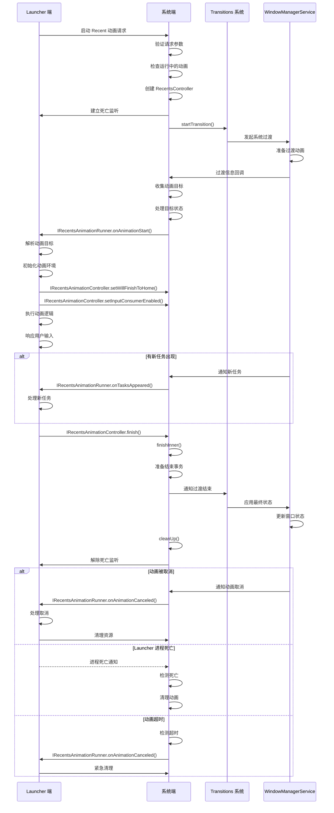
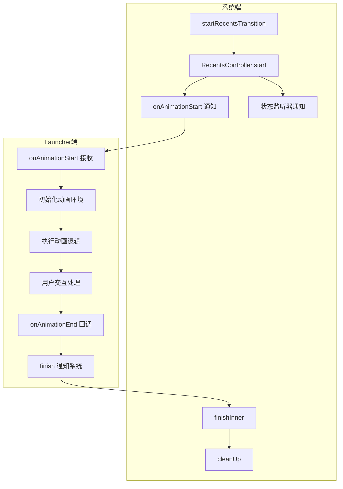
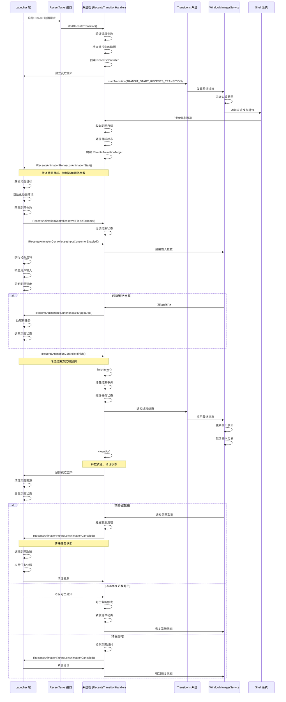

# Recent 动画通信机制分析报告

## 概述

Recent 动画是 Android 系统中用于在应用和最近任务列表（Recents）之间切换的过渡动画。本文将详细分析 Recent 动画过程中 Launcher 端与系统端的通信机制，包括启动流程、通信接口、状态变化和回调机制等。

## 系统端 Recent 动画启动流程

### 1. 启动流程详解

系统端 Recent 动画的启动流程由 `RecentsTransitionHandler` 负责，是一个多步骤的复杂过程：

1. **请求接收与验证**：
   - 接收来自 Launcher 的动画启动请求
   - 验证请求参数的有效性
   - 检查是否有正在运行的动画

2. **控制器初始化**：
   - 为每个动画创建独立的 `RecentsController` 实例
   - 建立与 Launcher 的死亡监听机制
   - 初始化动画状态管理

3. **系统过渡启动**：
   - 构建 `WindowContainerTransaction` 事务
   - 调用 `Transitions.startTransition` 发起系统级过渡
   - 处理混合动画场景（如与分屏、PiP 等的混合）

4. **动画目标准备**：
   - 收集所有参与动画的窗口目标
   - 分类处理不同类型的窗口（应用、壁纸、分屏等）
   - 为每个目标创建动画 leash

5. **状态计算与排序**：
   - 计算窗口层级关系
   - 确定动画开始和结束状态
   - 处理特殊窗口的显示逻辑

6. **Launcher 通知**：
   - 通过 `IRecentsAnimationRunner.onAnimationStart` 发送通知
   - 传递完整的动画目标列表
   - 提供 `IRecentsAnimationController` 控制接口

### 2. 系统端核心工作分析

**1. 状态管理**
系统端通过 `RecentsController` 维护详细的动画状态：
- **任务状态追踪**：记录所有暂停、打开和关闭的任务
- **层级管理**：维护窗口的 Z 轴顺序
- **动画状态机**：管理动画的不同阶段（正常、切换任务等）
- **异常处理**：处理动画取消、超时等异常情况

**2. 动画目标处理**
系统端需要处理多种类型的动画目标：
- **应用窗口**：普通应用的主窗口
- **壁纸窗口**：系统壁纸
- **分屏窗口**：分屏模式下的两个窗口
- **PiP 窗口**：画中画模式的窗口
- **桌面窗口**：多桌面模式下的桌面窗口

**3. 事务管理**
系统端使用 `SurfaceControl.Transaction` 管理所有表面操作：
- **开始事务**：配置动画初始状态
- **结束事务**：定义动画最终状态
- **事务合并**：处理动画过程中的状态变化
- **批处理**：优化表面操作性能

**4. 通信管理**
系统端与 Launcher 端的通信管理：
- **AIDL 接口**：通过 `IRecentsAnimationRunner` 发送通知
- **死亡监听**：监控 Launcher 进程状态
- **回调机制**：处理 Launcher 端的控制请求
- **超时处理**：防止动画卡住

### 3. 核心代码分析

**启动 Recent 动画**：
```java
// RecentsTransitionHandler.java
public IBinder startRecentsTransition(PendingIntent intent, Intent fillIn, Bundle options,
        @Nullable WindowContainerTransaction wct,
        IApplicationThread appThread, IRecentsAnimationRunner listener) {
    // 记录动画应用线程
    mAnimApp = appThread;
    
    // 检查是否为合成过渡请求
    final boolean isSyntheticRequest = options.getBoolean(
            "is_synthetic_recents_transition", /* defaultValue= */ false);
    final IBinder transition;
    ActivityOptions activityOptions = ActivityOptions.fromBundle(options);
    int displayId = activityOptions.getLaunchDisplayId();
    if (displayId == INVALID_DISPLAY) {
        displayId = DEFAULT_DISPLAY;
    }
    
    // 检查是否已有运行中的过渡
    final RecentsController lastController = findControllerForDisplay(displayId);
    if (lastController != null) {
        lastController.cancel(lastController.isSyntheticTransition()
                ? "existing_running_synthetic_transition"
                : "existing_running_transition");
        return null;
    }
    
    // 通知状态监听器
    for (int i = 0; i < mStateListeners.size(); i++) {
        mStateListeners.get(i).onTransitionStateChanged(TRANSITION_STATE_REQUESTED);
    }
    
    // 根据请求类型启动过渡
    if (isSyntheticRequest) {
        transition = startSyntheticRecentsTransition(listener, displayId);
    } else {
        transition = startRealRecentsTransition(intent, fillIn, options, wct, listener,
                displayId);
    }
    return transition;
}
```

**动画目标处理**：
```java
// RecentsTransitionHandler.RecentsController
boolean start(TransitionInfo info, SurfaceControl.Transaction t,
        SurfaceControl.Transaction finishT, Transitions.TransitionFinishCallback finishCB) {
    // 检查监听器和过渡是否存在
    if (mListener == null || mTransition == null) {
        cancel("No listener or transition");
        return false;
    }
    
    // 检查是否为有效的 recents 过渡
    boolean hasPausingTasks = false;
    for (int i = 0; i < info.getChanges().size(); ++i) {
        final TransitionInfo.Change change = info.getChanges().get(i);
        if (TransitionUtil.isWallpaper(change)) continue;
        if (TransitionUtil.isClosingType(change.getMode())) {
            hasPausingTasks = true;
            continue;
        }
        final ActivityManager.RunningTaskInfo taskInfo = change.getTaskInfo();
        if (taskInfo != null && taskInfo.topActivityType == ACTIVITY_TYPE_RECENTS) {
            mRecentsTask = taskInfo.token;
            mRecentsTaskId = taskInfo.taskId;
        } else if (taskInfo != null && taskInfo.topActivityType == ACTIVITY_TYPE_HOME) {
            mRecentsTask = taskInfo.token;
            mRecentsTaskId = taskInfo.taskId;
        }
    }
    
    // 准备动画目标
    mInfo = info;
    mFinishCB = finishCB;
    mFinishTransaction = finishT;
    mPausingTasks = new ArrayList<>();
    mPausingDesk = null;
    mClosingTasks = new ArrayList<>();
    mOpeningTasks = new ArrayList<>();
    mLeashMap = new ArrayMap<>();
    mKeyguardLocked = (info.getFlags() & TRANSIT_FLAG_KEYGUARD_LOCKED) != 0;
    
    // 收集动画目标
    final ArrayList<RemoteAnimationTarget> apps = new ArrayList<>();
    final ArrayList<RemoteAnimationTarget> wallpapers = new ArrayList<>();
    TransitionUtil.LeafTaskFilter leafTaskFilter = new TransitionUtil.LeafTaskFilter();
    
    // 分层处理
    final int belowLayers = info.getChanges().size();
    final int middleLayers = info.getChanges().size() * 2;
    final int aboveLayers = info.getChanges().size() * 3;
    
    // 处理每个变化
    for (int i = 0; i < info.getChanges().size(); ++i) {
        final TransitionInfo.Change change = info.getChanges().get(i);
        final ActivityManager.RunningTaskInfo taskInfo = change.getTaskInfo();
        
        if (TransitionUtil.isWallpaper(change)) {
            // 处理壁纸
            final RemoteAnimationTarget target = TransitionUtil.newTarget(change,
                    belowLayers - i, info, t, mLeashMap);
            wallpapers.add(target);
            t.setAlpha(target.leash, 1);
        } else if (leafTaskFilter.test(change)) {
            // 处理叶子任务
            final RemoteAnimationTarget target = TransitionUtil.newTarget(change,
                    belowLayers - i, info, t, mLeashMap);
            apps.add(target);
            
            if (TransitionUtil.isClosingType(change.getMode())) {
                // 处理关闭的任务
                mPausingTasks.add(new TaskState(change, target.leash));
                // 提升层级
                final int layer = aboveLayers - i;
                t.setLayer(target.leash, layer);
            } else if (taskInfo != null && taskInfo.topActivityType == ACTIVITY_TYPE_RECENTS) {
                // 处理 Recents 任务
                final int layer = middleLayers - i;
                t.setLayer(target.leash, layer);
            }
            // ... 其他类型的处理 ...
        }
        // ... 其他类型的处理 ...
    }
    
    // 应用事务
    t.apply();
    
    // 准备额外数据
    Bundle b = new Bundle(2);
    b.putParcelable(KEY_EXTRA_SPLIT_BOUNDS,
            mRecentTasksController.getSplitBoundsForTaskId(closingSplitTaskId));
    b.putBoolean(KEY_EXTRA_SHELL_CAN_HAND_OFF_ANIMATION, mTakeoverHandler != null);
    
    // 通知 Launcher
    try {
        mListener.onAnimationStart(this,
                apps.toArray(new RemoteAnimationTarget[apps.size()]),
                wallpapers.toArray(new RemoteAnimationTarget[wallpapers.size()]),
                new Rect(), b, info);
        for (int i = 0; i < mStateListeners.size(); i++) {
            mStateListeners.get(i).onTransitionStateChanged(TRANSITION_STATE_ANIMATING);
        }
    } catch (RemoteException e) {
        Slog.e(TAG, "Error starting recents animation", e);
        cancel("onAnimationStart() failed");
    }
    return true;
}
```

## Launcher 端 IRecentsAnimationRunner 实现

### 1. 接口定义

`IRecentsAnimationRunner` 是 Launcher 端需要实现的核心接口，定义在 `IRecentsAnimationRunner.aidl` 文件中：

```aidl
oneway interface IRecentsAnimationRunner {
    void onAnimationCanceled(in @nullable int[] taskIds,
            in @nullable TaskSnapshot[] taskSnapshots) = 1;
    
    void onAnimationStart(in IRecentsAnimationController controller,
            in RemoteAnimationTarget[] apps, in RemoteAnimationTarget[] wallpapers,
            in Rect homeContentInsets, in Bundle extras, in @nullable TransitionInfo info) = 2;
    
    void onTasksAppeared(in RemoteAnimationTarget[] app,
            in @nullable TransitionInfo transitionInfo) = 3;
}
```

### 2. Launcher 端核心工作分析

**1. 动画环境初始化**
Launcher 端在接收到动画启动通知后，需要进行详细的初始化工作：
- **控制器保存**：保存系统端提供的 `IRecentsAnimationController` 实例
- **目标解析**：解析和分类系统端传递的动画目标
- **动画参数计算**：根据当前设备状态计算动画参数
- **视图层次准备**：准备动画所需的视图层次结构

**2. 动画逻辑执行**
Launcher 端负责执行具体的动画效果：
- **动画类型选择**：根据场景选择合适的动画类型（如手势触发、按钮点击等）
- **插值器配置**：配置动画的插值器和时间曲线
- **多目标协调**：协调多个窗口的动画同步
- **性能优化**：使用硬件加速和图层优化

**3. 用户交互处理**
Launcher 端需要处理动画过程中的用户交互：
- **输入事件拦截**：通过 `setInputConsumerEnabled` 控制输入拦截
- **手势识别**：识别和处理用户的手势操作
- **实时反馈**：根据用户输入实时调整动画状态
- **状态切换**：处理用户选择不同任务的情况

**4. 动画控制与结束**
Launcher 端通过 `IRecentsAnimationController` 控制动画：
- **状态通知**：通过 `setWillFinishToHome` 通知系统端结束状态
- **动画进度**：控制动画的进度和时间
- **结束触发**：在适当的时机调用 `finish` 结束动画
- **结果传递**：传递动画结束的最终状态

**5. 异常处理**
Launcher 端需要处理各种异常情况：
- **动画取消**：在 `onAnimationCanceled` 中处理动画被取消的情况
- **新任务出现**：在 `onTasksAppeared` 中处理新任务
- **超时处理**：处理动画超时的情况
- **资源清理**：确保资源正确释放

### 3. Launcher 端实现细节

**1. 目标处理**
Launcher 端接收到系统端传递的动画目标后，需要进行详细处理：
- **分类处理**：区分应用窗口、壁纸、分屏等不同类型的目标
- **状态提取**：提取每个目标的当前状态和目标状态
- **层级管理**：根据系统端提供的层级信息管理视图层级
- **特殊处理**：对特殊窗口（如 PiP、分屏）进行特殊处理

**2. 动画实现**
Launcher 端的动画实现通常包括：
- **属性动画**：使用 Android 的属性动画系统
- **Canvas 动画**：对于复杂效果使用 Canvas 绘制
- **Lottie 动画**：对于复杂的矢量动画使用 Lottie
- **硬件加速**：充分利用硬件加速提高性能

**3. 与系统端的交互**
Launcher 端与系统端的交互是双向的：
- **接收通知**：接收系统端的动画启动、取消等通知
- **发送控制**：向系统端发送动画控制命令
- **状态同步**：保持与系统端的状态同步
- **错误处理**：处理通信过程中的错误

**4. 性能优化**
Launcher 端需要进行多种性能优化：
- **视图复用**：复用现有的视图和动画
- **内存管理**：避免内存泄漏和过度分配
- **绘制优化**：减少不必要的绘制操作
- **线程管理**：合理使用线程提高性能

### 4. 典型实现示例

**Launcher 端的典型实现**：
```java
public class RecentsAnimationRunnerImpl extends IRecentsAnimationRunner.Stub {
    private IRecentsAnimationController mController;
    private List<RemoteAnimationTarget> mAppTargets;
    private List<RemoteAnimationTarget> mWallpaperTargets;
    private AnimationController mAnimationController;
    
    @Override
    public void onAnimationStart(IRecentsAnimationController controller,
            RemoteAnimationTarget[] apps, RemoteAnimationTarget[] wallpapers,
            Rect homeContentInsets, Bundle extras, TransitionInfo info) {
        // 保存控制器
        mController = controller;
        
        // 处理动画目标
        mAppTargets = Arrays.asList(apps);
        mWallpaperTargets = Arrays.asList(wallpapers);
        
        // 初始化动画环境
        initAnimationEnvironment(extras, info);
        
        // 开始动画
        startAnimation();
    }
    
    private void initAnimationEnvironment(Bundle extras, TransitionInfo info) {
        // 解析额外参数
        boolean canHandOffAnimation = extras.getBoolean(
                KEY_EXTRA_SHELL_CAN_HAND_OFF_ANIMATION, false);
        
        // 初始化动画控制器
        mAnimationController = new AnimationController();
        
        // 准备视图层次
        prepareViewHierarchy();
    }
    
    private void startAnimation() {
        // 配置动画参数
        AnimationConfig config = createAnimationConfig();
        
        // 启动动画
        mAnimationController.startAnimation(mAppTargets, mWallpaperTargets, config,
                new AnimationCallback() {
                    @Override
                    public void onAnimationEnd() {
                        // 动画结束，通知系统
                        finishAnimation();
                    }
                });
    }
    
    private void finishAnimation() {
        try {
            // 通知系统动画结束
            mController.finish(true, false, null);
        } catch (RemoteException e) {
            Log.e(TAG, "Error finishing animation", e);
        }
    }
    
    @Override
    public void onAnimationCanceled(int[] taskIds, TaskSnapshot[] taskSnapshots) {
        // 处理动画取消
        cancelAnimation(taskIds, taskSnapshots);
    }
    
    @Override
    public void onTasksAppeared(RemoteAnimationTarget[] app, TransitionInfo transitionInfo) {
        // 处理新任务出现
        handleNewTasks(app, transitionInfo);
    }
    
    private void cancelAnimation(int[] taskIds, TaskSnapshot[] taskSnapshots) {
        // 取消正在进行的动画
        if (mAnimationController != null) {
            mAnimationController.cancelAnimation();
        }
        
        // 处理快照（如果有）
        if (taskSnapshots != null) {
            handleTaskSnapshots(taskIds, taskSnapshots);
        }
        
        // 清理资源
        cleanupResources();
    }
}
```

## 系统端与 Launcher 端的通信机制

### 1. 通信接口详解

系统端与 Launcher 端通过精心设计的 AIDL 接口进行双向通信，确保动画过程中的信息同步和控制传递：

| 接口 | 方向 | 作用 | 详细说明 |
|------|------|------|----------|
| `IRecentsAnimationRunner.onAnimationStart` | 系统 → Launcher | 通知动画开始 | 传递完整的动画目标列表、控制器接口和额外参数，是动画启动的核心通知 |
| `IRecentsAnimationRunner.onAnimationCanceled` | 系统 → Launcher | 通知动画取消 | 传递被取消任务的 ID 和快照，用于平滑处理取消场景 |
| `IRecentsAnimationRunner.onTasksAppeared` | 系统 → Launcher | 通知新任务出现 | 传递新出现的任务目标，用于动态调整动画 |
| `IRecentsAnimationController.finish` | Launcher → 系统 | 通知动画结束 | 控制动画结束方式，决定是否返回主页和是否发送用户离开提示 |
| `IRecentsAnimationController.setInputConsumerEnabled` | Launcher → 系统 | 控制输入拦截 | 启用或禁用输入事件拦截，用于处理动画过程中的用户交互 |
| `IRecentsAnimationController.setWillFinishToHome` | Launcher → 系统 | 设置结束状态 | 通知系统端动画结束时是否返回主页，用于系统端提前准备 |
| `IRecentsAnimationController.setFinishTaskTransaction` | Launcher → 系统 | 设置最终事务 | 为特定任务设置最终的表面事务，用于 PiP 等特殊场景 |
| `IRecentsAnimationController.handOffAnimation` | Launcher → 系统 | 移交动画控制权 | 将动画控制权移交给其他处理器，用于复杂动画场景 |

### 2. 通信数据结构

**1. 核心数据结构**
- **RemoteAnimationTarget**：包含动画目标的完整信息，包括表面、模式、层级等
- **TransitionInfo**：包含过渡动画的详细信息，包括所有变化和标志
- **TaskSnapshot**：包含任务的快照信息，用于动画取消时的平滑过渡
- **Bundle**：用于传递额外参数，如分屏边界、动画选项等

**2. 数据传递流程**
- **系统端→Launcher端**：系统端收集所有动画目标，构建完整的目标列表，通过 AIDL 传递给 Launcher 端
- **Launcher端→系统端**：Launcher 端通过控制器接口传递控制命令和状态信息
- **双向同步**：通过回调机制保持状态同步，确保动画过程的一致性

### 3. 通信流程详解

**1. 启动阶段通信**
1. **请求发起**：Launcher 端通过 `IRecentTasks` 接口发起动画启动请求
2. **参数验证**：系统端验证请求参数，检查是否有正在运行的动画
3. **控制器创建**：系统端创建 `RecentsController`，建立与 Launcher 的死亡监听
4. **系统过渡**：系统端调用 `Transitions.startTransition` 发起系统级过渡
5. **目标收集**：系统端收集并处理所有动画目标
6. **通知发送**：系统端通过 `onAnimationStart` 发送启动通知，传递完整信息
7. **环境初始化**：Launcher 端初始化动画环境，准备执行动画

**2. 执行阶段通信**
1. **状态通知**：Launcher 端通过 `setWillFinishToHome` 通知系统端结束状态
2. **输入控制**：Launcher 端通过 `setInputConsumerEnabled` 控制输入拦截
3. **实时反馈**：Launcher 端根据用户输入调整动画状态
4. **状态同步**：系统端和 Launcher 端保持状态同步
5. **新任务处理**：系统端通过 `onTasksAppeared` 通知新任务出现

**3. 结束阶段通信**
1. **结束触发**：Launcher 端在适当时机调用 `finish` 结束动画
2. **状态处理**：系统端处理动画结束逻辑，准备最终事务
3. **事务应用**：系统端应用最终的窗口容器事务
4. **资源清理**：系统端和 Launcher 端各自清理资源
5. **状态重置**：系统端重置动画状态，准备下一次动画

**4. 异常处理通信**
1. **动画取消**：系统端通过 `onAnimationCanceled` 通知动画取消
2. **超时处理**：系统端检测动画超时，触发取消流程
3. **进程死亡**：系统端通过死亡监听检测 Launcher 进程死亡
4. **错误处理**：双方处理通信过程中的异常情况

### 4. 通信机制优化

**1. 性能优化**
- **批处理**：批量处理动画目标，减少通信次数
- **缓存机制**：缓存常用数据结构，减少序列化开销
- **异步通信**：使用 oneway 接口提高通信效率
- **数据压缩**：对大型数据结构进行压缩传输

**2. 可靠性优化**
- **死亡监听**：建立双向死亡监听机制
- **超时处理**：实现动画超时检测和处理
- **错误重试**：对通信错误进行重试处理
- **状态同步**：确保双方状态的最终一致性

**3. 安全性优化**
- **权限验证**：验证通信双方的权限
- **数据验证**：验证传递的数据有效性
- **隔离机制**：隔离不同动画的通信
- **资源限制**：限制通信资源使用

### 5. 通信时序图（详细版）



## 动画过程中的状态变化和回调机制

### 1. 系统端状态管理

系统端通过 `RecentsController` 维护详细的动画状态，形成一个完整的状态管理体系：

**1. 核心状态**
- **STATE_NORMAL**：动画空闲状态，等待用户选择要切换的任务
- **STATE_NEW_TASK**：用户已选择新任务，动画正在切换到该任务

**2. 任务状态追踪**
- **mPausingTasks**：记录所有正在暂停的任务
- **mOpeningTasks**：记录所有正在打开的任务
- **mClosingTasks**：记录所有正在关闭的任务
- **mPausingDesk**：记录正在暂停的桌面

**3. 动画上下文状态**
- **mTransition**：当前动画的过渡令牌
- **mInfo**：当前动画的过渡信息
- **mFinishTransaction**：动画结束时的事务
- **mKeyguardLocked**：是否在锁屏状态下
- **mWillFinishToHome**：是否将结束到主页

**4. 状态监听器**
系统端通过 `RecentsTransitionStateListener` 通知状态变化：
- **TRANSITION_STATE_NOT_RUNNING**：动画未运行
- **TRANSITION_STATE_REQUESTED**：动画已请求
- **TRANSITION_STATE_ANIMATING**：动画正在运行

### 2. Launcher 端状态管理

Launcher 端同样需要管理复杂的动画状态：

**1. 动画状态**
- **IDLE**：动画未开始
- **INITIALIZING**：动画环境初始化中
- **RUNNING**：动画正在执行
- **FINISHING**：动画正在结束
- **CANCELED**：动画已取消

**2. 用户交互状态**
- **INPUT_DISABLED**：输入已禁用
- **INPUT_ENABLED**：输入已启用
- **GESTURE_IN_PROGRESS**：手势正在进行中

**3. 任务选择状态**
- **NO_TASK_SELECTED**：未选择任务
- **TASK_SELECTED**：已选择任务
- **HOME_SELECTED**：已选择返回主页

### 3. 回调机制详解

**1. 系统端回调机制**

**动画生命周期回调**：
- **onAnimationStart**：通知 Launcher 动画开始，传递完整的动画环境
- **onAnimationCanceled**：通知 Launcher 动画被取消，传递任务快照
- **onTasksAppeared**：通知 Launcher 有新任务出现，用于动态调整

**状态变化回调**：
- **onTransitionStateChanged**：通知系统端状态监听器状态变化
- **onTransitionConsumed**：通知系统端过渡已被消费
- **onTransitionReady**：通知系统端过渡已准备就绪

**2. Launcher 端回调机制**

**动画控制回调**：
- **AnimationCallback.onAnimationStart**：动画开始回调
- **AnimationCallback.onAnimationUpdate**：动画更新回调
- **AnimationCallback.onAnimationEnd**：动画结束回调
- **AnimationCallback.onAnimationCancel**：动画取消回调

**用户交互回调**：
- **GestureCallback.onGestureStart**：手势开始回调
- **GestureCallback.onGestureUpdate**：手势更新回调
- **GestureCallback.onGestureEnd**：手势结束回调

**3. 双向回调流程**



### 4. 状态转换分析

**1. 正常状态转换**
- **系统端**：NOT_RUNNING → REQUESTED → ANIMATING → NOT_RUNNING
- **Launcher端**：IDLE → INITIALIZING → RUNNING → FINISHING → IDLE

**2. 异常状态转换**
- **动画取消**：ANIMATING → CANCELED → NOT_RUNNING
- **进程死亡**：ANIMATING → 检测死亡 → 清理资源
- **超时处理**：ANIMATING → 检测超时 → 取消动画

**3. 状态转换触发条件**
- **启动**：Launcher 端请求 → 系统端验证 → 状态转换
- **取消**：系统端通知 → Launcher 端处理 → 状态转换
- **结束**：Launcher 端通知 → 系统端处理 → 状态转换
- **异常**：死亡监听触发 → 系统端处理 → 状态转换

### 5. 核心代码分析

**系统端状态管理**：
```java
// RecentsTransitionHandler
public void addTransitionStateListener(RecentsTransitionStateListener listener) {
    mStateListeners.add(listener);
}

// 状态变化通知
for (int i = 0; i < mStateListeners.size(); i++) {
    mStateListeners.get(i).onTransitionStateChanged(TRANSITION_STATE_ANIMATING);
}
```

**Launcher 端状态管理**：
```java
// Launcher 端典型实现
private void updateAnimationState(int newState) {
    int oldState = mCurrentState;
    mCurrentState = newState;
    
    // 通知状态变化
    for (AnimationStateListener listener : mStateListeners) {
        listener.onAnimationStateChanged(oldState, newState);
    }
    
    // 根据新状态执行相应操作
    switch (newState) {
        case STATE_INITIALIZING:
            initializeAnimationEnvironment();
            break;
        case STATE_RUNNING:
            startAnimation();
            break;
        case STATE_FINISHING:
            prepareForFinish();
            break;
        case STATE_CANCELED:
            handleAnimationCanceled();
            break;
    }
}
```

**回调处理**：
```java
// 系统端回调处理
@Override
public void onTransitionConsumed(IBinder transition, boolean aborted,
        SurfaceControl.Transaction finishTransaction) {
    // 取消所有现有动画
    for (int i = mControllers.size() - 1; i >= 0; i--) {
        mControllers.get(i).cancel("onTransitionConsumed");
    }
}

// Launcher 端回调处理
@Override
public void onAnimationCanceled(int[] taskIds, TaskSnapshot[] taskSnapshots) {
    // 处理动画取消
    mAnimationState = AnimationState.CANCELED;
    
    // 处理快照
    if (taskSnapshots != null) {
        applyTaskSnapshots(taskIds, taskSnapshots);
    }
    
    // 清理资源
    cleanupAnimationResources();
}
```

## 动画结束时的处理流程

### 1. 结束流程详解

动画结束是一个复杂的多步骤过程，涉及系统端和 Launcher 端的紧密协作：

**1. 结束触发**
- **用户操作触发**：用户选择任务或返回主页
- **动画完成触发**：预设动画时间结束
- **异常情况触发**：动画被取消或超时

**2. Launcher 端结束处理**
- **状态准备**：准备动画结束状态
- **控制器调用**：调用 `IRecentsAnimationController.finish()`
- **参数传递**：传递结束方式和用户离开提示标志
- **本地清理**：清理 Launcher 端的动画资源

**3. 系统端结束处理**
- **结束通知接收**：接收 Launcher 端的结束通知
- **事务准备**：准备最终的窗口容器事务
- **状态计算**：计算所有任务的最终状态
- **事务应用**：应用最终事务到系统
- **资源清理**：清理系统端的动画资源

**4. 窗口状态恢复**
- **可见性恢复**：恢复所有任务的可见性
- **层级调整**：调整窗口的最终层级
- **焦点处理**：处理窗口焦点的转移
- **输入处理**：恢复输入事件的正常分发

### 2. 系统端结束处理详解

**1. 结束事务准备**
系统端在 `finishInner` 方法中准备详细的结束事务：
- **创建事务**：创建 `WindowContainerTransaction` 实例
- **状态标记**：标记 `mWillFinishToHome` 状态
- **任务处理**：根据结束方式处理不同任务的状态
- **批处理**：批量处理所有任务的状态变化

**2. 不同结束方式的处理**

**返回主页的处理**：
- 隐藏所有暂停的任务
- 确保主页任务可见
- 调整层级使主页位于顶部
- 处理桌面模式的特殊情况

**返回应用的处理**：
- 恢复被暂停的任务
- 隐藏 Recents 任务
- 确保目标应用可见
- 处理分屏和 PiP 的特殊情况

**3. 事务应用**
- **应用表面事务**：应用 `mFinishTransaction` 到所有表面
- **应用窗口事务**：应用 `WindowContainerTransaction` 到窗口管理器
- **事务同步**：确保两个事务的同步执行

**4. 资源清理**
系统端的 `cleanUp` 方法执行全面的资源清理：
- **死亡监听解除**：解除与 Launcher 的死亡监听
- **引用清空**：清空所有对象引用
- **Surface 释放**：释放所有动画 leash
- **事务关闭**：关闭所有事务对象
- **控制器移除**：从控制器列表中移除当前控制器
- **状态通知**：通知状态监听器动画结束

### 3. Launcher 端结束处理详解

**1. 结束触发**
Launcher 端在以下情况下触发结束：
- **用户选择任务**：用户在 Recents 中选择了一个任务
- **用户返回主页**：用户选择返回主页
- **手势结束**：用户手势操作结束
- **动画完成**：预设动画时间结束

**2. 结束准备**
- **状态保存**：保存当前动画状态
- **参数计算**：计算 `finish` 方法的参数
- **回调准备**：准备动画结束回调
- **资源准备**：准备需要传递给系统端的资源

**3. 系统通知**
- **控制器调用**：调用 `mController.finish()`
- **异常处理**：处理可能的远程异常
- **状态更新**：更新本地动画状态

**4. 本地清理**
- **动画资源**：清理动画相关的视图和资源
- **控制器引用**：清空系统端控制器引用
- **目标引用**：清空动画目标引用
- **状态重置**：重置动画状态机

### 4. 异常情况下的结束处理

**1. 动画取消的处理**
- **系统端通知**：系统端通过 `onAnimationCanceled` 通知
- **快照处理**：处理系统端传递的任务快照
- **紧急清理**：紧急清理动画资源
- **状态恢复**：恢复到取消前的状态

**2. 超时处理**
- **系统端检测**：系统端检测动画超时
- **取消触发**：触发动画取消流程
- **超时通知**：通知 Launcher 端超时
- **强制清理**：强制清理所有资源

**3. 进程死亡处理**
- **死亡监听触发**：系统端死亡监听触发
- **紧急清理**：系统端紧急清理资源
- **状态重置**：重置所有相关状态
- **错误处理**：处理进程死亡的错误情况

### 5. 核心代码分析

**系统端结束处理**：
```java
// RecentsTransitionHandler.RecentsController
void finishInner(boolean toHome, boolean userLeave, IResultReceiver finishCb, String reason) {
    if (mFinishCB == null) {
        // 没有结束回调，直接清理
        cleanUp();
        return;
    }
    
    // 准备结束事务
    final WindowContainerTransaction wct = new WindowContainerTransaction();
    
    // 处理返回主页的情况
    if (toHome) {
        // 标记要返回主页
        mWillFinishToHome = true;
        
        // 隐藏所有暂停的任务
        if (mPausingTasks != null) {
            for (int i = 0; i < mPausingTasks.size(); ++i) {
                final TaskState state = mPausingTasks.get(i);
                if (state.mLeash != null) {
                    mFinishTransaction.setAlpha(state.mLeash, 0);
                }
            }
        }
    } else {
        // 不返回主页，恢复任务状态
        if (mPausingTasks != null) {
            for (int i = 0; i < mPausingTasks.size(); ++i) {
                final TaskState state = mPausingTasks.get(i);
                if (state.mLeash != null) {
                    // 恢复暂停的任务
                    mFinishTransaction.setAlpha(state.mLeash, 1);
                }
            }
        }
        
        // 隐藏 Recents 任务
        if (mRecentsTask != null) {
            wct.hide(mRecentsTask);
        }
    }
    
    // 应用结束事务
    mFinishTransaction.apply();
    
    // 通知系统动画结束
    mFinishCB.onTransitionFinished(wct);
    
    // 清理资源
    cleanUp();
}
```

**系统端清理**：
```java
// RecentsTransitionHandler.RecentsController
void cleanUp() {
    // 解除死亡监听
    if (mListener != null && mDeathHandler != null) {
        mListener.asBinder().unlinkToDeath(mDeathHandler, 0 /* flags */);
        mDeathHandler = null;
    }
    
    // 清空引用
    mListener = null;
    mFinishCB = null;
    
    // 释放 leash surfacecontrols
    if (mLeashMap != null) {
        for (int i = 0; i < mLeashMap.size(); ++i) {
            mLeashMap.valueAt(i).release();
        }
        mLeashMap = null;
    }
    
    // 清空其他资源
    mFinishTransaction = null;
    mPausingTasks = null;
    mPausingDesk = null;
    mClosingTasks = null;
    mOpeningTasks = null;
    mInfo = null;
    mMergingInfo = null;
    mTransition = null;
    mPendingPauseSnapshotsForCancel = null;
    mPipTaskId = -1;
    mPipTask = null;
    mPipTransaction = null;
    mPendingRunnerFinishCb = null;
    mPendingFinishTransition = null;
    if (mPendingFinishTransaction != null) {
        mPendingFinishTransaction.close();
    }
    mPendingFinishTransaction = null;
    
    // 从控制器列表中移除
    mControllers.remove(this);
    
    // 通知状态监听器
    for (int i = 0; i < mStateListeners.size(); i++) {
        mStateListeners.get(i).onTransitionStateChanged(TRANSITION_STATE_NOT_RUNNING);
    }
}
```

**Launcher 端结束处理**：
```java
// Launcher 端典型实现
private void finishAnimation(boolean returnToHome) {
    try {
        // 通知系统动画结束
        mController.finish(returnToHome, false, new IResultReceiver.Stub() {
            @Override
            public void send(int resultCode, Bundle data) {
                // 系统端确认动画结束
                onSystemAnimationFinished();
            }
        });
        
        // 更新本地状态
        mAnimationState = AnimationState.FINISHING;
        
    } catch (RemoteException e) {
        Log.e(TAG, "Error finishing animation", e);
        // 处理远程异常
        handleFinishError();
    }
}

private void onSystemAnimationFinished() {
    // 清理动画资源
    cleanupAnimationResources();
    
    // 重置状态
    resetAnimationState();
    
    // 通知监听器
    notifyAnimationFinished();
}

private void cleanupAnimationResources() {
    // 清理动画视图
    if (mAnimationView != null) {
        mAnimationView.clearAnimation();
        mAnimationView = null;
    }
    
    // 清理动画控制器
    if (mAnimationController != null) {
        mAnimationController.cancel();
        mAnimationController = null;
    }
    
    // 清空系统控制器引用
    mController = null;
    
    // 清理目标列表
    mAppTargets = null;
    mWallpaperTargets = null;
}
```

## 完整的调用链和时序图

### 1. 详细调用链分析

**1. 启动 Recent 动画调用链**

**Launcher 端发起请求**：
1. `LauncherRecentsController.startRecents`
2. `IRecentTasks.startRecentsAnimation`
3. `RecentTasksController.startRecentsAnimation`
4. `RecentsTransitionHandler.startRecentsTransition`

**系统端处理**：
5. `RecentsTransitionHandler.startRealRecentsTransition`
6. `Transitions.startTransition(TRANSIT_START_RECENTS_TRANSITION)`
7. `WMS.handleTransition`
8. `ShellTransitions.onTransitionReady`
9. `RecentsTransitionHandler.onTransitionReady`
10. `RecentsTransitionHandler.startAnimation`
11. `RecentsController.start`

**通知 Launcher 端**：
12. `IRecentsAnimationRunner.onAnimationStart` (Launcher 端)
13. `LauncherRecentsAnimationRunner.onAnimationStart`
14. `RecentsAnimationControllerImpl.startAnimation`

**2. 动画执行调用链**

**Launcher 端控制**：
1. `RecentsAnimationControllerImpl.setWillFinishToHome`
2. `IRecentsAnimationController.setWillFinishToHome`
3. `RecentsController.setWillFinishToHome`

**用户交互处理**：
4. `RecentsAnimationControllerImpl.setInputConsumerEnabled`
5. `IRecentsAnimationController.setInputConsumerEnabled`
6. `RecentsController.setInputConsumerEnabled`

**3. 动画结束调用链**

**Launcher 端触发结束**：
1. `RecentsAnimationControllerImpl.finish`
2. `IRecentsAnimationController.finish`
3. `RecentsController.finish`

**系统端处理结束**：
4. `RecentsController.finishInner`
5. `Transitions.TransitionFinishCallback.onTransitionFinished`
6. `WMS.handleTransitionFinished`

**资源清理**：
7. `RecentsController.cleanUp`
8. `LauncherRecentsAnimationRunner.cleanup`

**4. 动画取消调用链**

**系统端触发取消**：
1. `RecentsTransitionHandler.onTransitionConsumed`
2. `RecentsController.cancel`
3. `IRecentsAnimationRunner.onAnimationCanceled`

**Launcher 端处理取消**：
4. `LauncherRecentsAnimationRunner.onAnimationCanceled`
5. `RecentsAnimationControllerImpl.cancelAnimation`
6. `RecentsAnimationControllerImpl.cleanupResources`

### 2. 完整时序图



### 3. 调用链总结

**核心调用路径**：
- **启动路径**：Launcher → RecentTasks → RecentsTransitionHandler → Transitions → WMS → Shell → RecentsController → Launcher
- **执行路径**：Launcher ↔ RecentsController (双向通信)
- **结束路径**：Launcher → RecentsController → Transitions → WMS → RecentsController → Launcher
- **异常路径**：WMS/System → RecentsController → Launcher (单向通知)

**关键同步点**：
1. **启动同步**：系统端等待 WMS 准备过渡动画
2. **目标同步**：系统端收集所有动画目标后通知 Launcher
3. **结束同步**：系统端等待 Launcher 通知结束后再应用最终状态
4. **异常同步**：系统端检测到异常后立即通知 Launcher 并清理

**性能关键点**：
1. **目标收集**：系统端收集动画目标的效率
2. **通信开销**：跨进程通信的频率和数据量
3. **事务应用**：批量处理表面事务的时机
4. **资源清理**：及时释放不再需要的资源

## 总结和优化建议

### 1. 总结

Recent 动画通信机制是一个复杂的跨进程通信过程，涉及以下关键组件：

1. **系统端**：`RecentsTransitionHandler` 负责管理动画生命周期和状态
2. **Launcher 端**：实现 `IRecentsAnimationRunner` 接口执行具体动画
3. **通信接口**：通过 AIDL 接口实现跨进程通信
4. **状态管理**：通过控制器和回调机制管理动画状态

### 2. 优化建议

1. **性能优化**：
   - 减少跨进程通信次数，可考虑批量传递动画目标
   - 优化动画目标的收集和处理逻辑，减少主线程阻塞
   - 使用更高效的序列化方式传递动画数据

2. **可靠性优化**：
   - 增强错误处理机制，提高动画过程的稳定性
   - 增加超时机制，避免动画卡住
   - 优化资源管理，确保及时释放不再需要的资源

3. **可维护性优化**：
   - 简化状态管理逻辑，减少状态转换的复杂性
   - 增加详细的日志和监控，便于问题定位
   - 模块化设计，提高代码的可测试性

4. **功能优化**：
   - 支持更多动画类型和场景
   - 提供更灵活的动画控制接口
   - 增强与其他系统组件的集成

## 结论

Recent 动画通信机制是 Android 系统中一个重要的跨进程协作案例，展示了如何在系统端和应用端之间实现复杂的动画协同。通过本文的分析，我们可以看到整个通信过程设计合理，职责明确，但也存在一些优化空间。

未来的优化方向应该是提高通信效率、增强可靠性、简化状态管理，并支持更多的动画场景，以提供更流畅、更美观的用户体验。