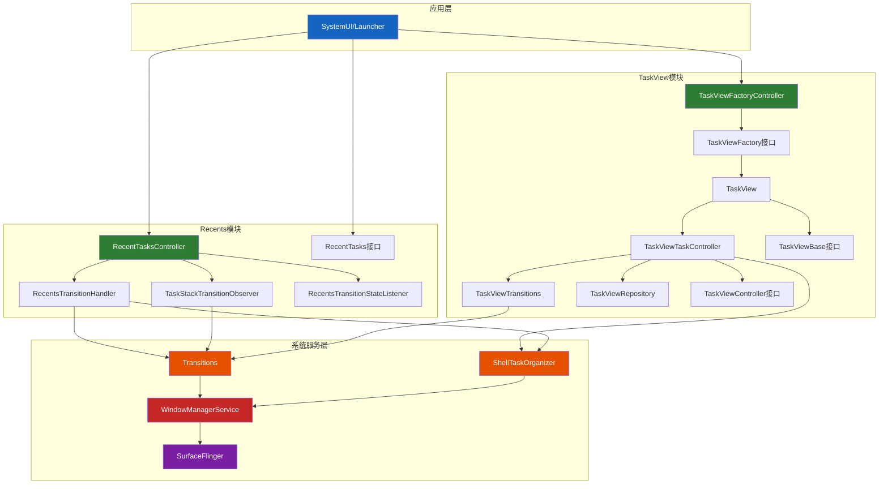
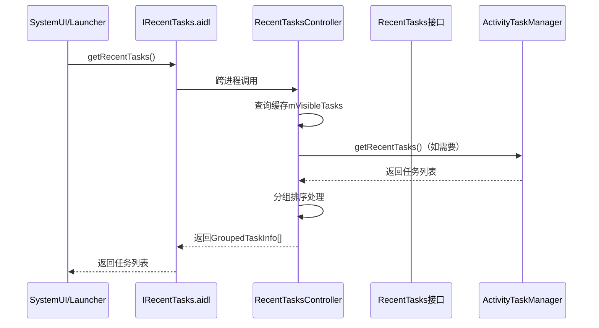
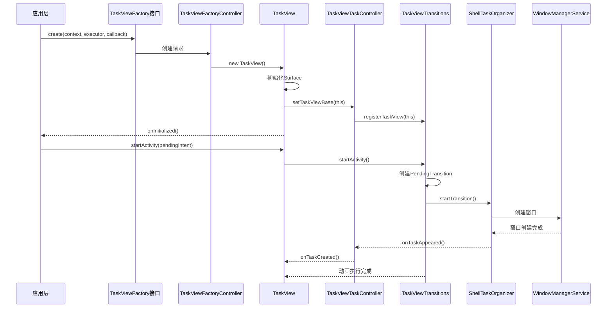
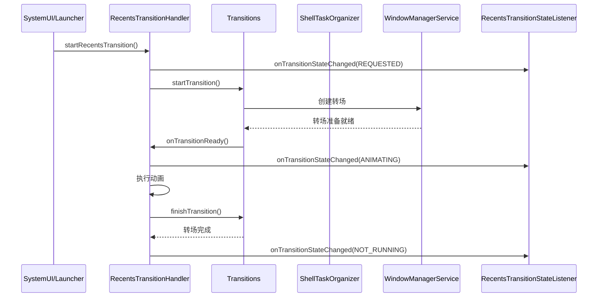

# AOSP 16 Recent和TaskView组件架构分析

基于AOSP源码分析专家技能的深入分析，本文档详细记录了`base/libs/WindowManager/Shell/src/com/android/wm/shell/recents`和`taskview`组件的架构设计和实现原理。

## 📁 目录结构分析

### Recents目录结构

```
recents/
├── RecentTasksController.java      # 最近任务控制器（核心管理器）
├── RecentsTransitionHandler.java   # 最近任务转场处理器
├── RecentTasks.java                # 最近任务接口定义
├── TaskStackTransitionObserver.kt  # 任务栈转场观察器（Kotlin）
├── RecentsTransitionStateListener.java  # 转场状态监听器
├── RecentsShellCommandHandler.kt   # Shell命令处理器（Kotlin）
├── IRecentTasks.aidl               # 远程调用接口定义
├── IRecentTasksListener.aidl       # 监听器接口定义
├── IRecentsAnimationController.aidl # 动画控制器接口
└── IRecentsAnimationRunner.aidl    # 动画运行器接口
```

### TaskView目录结构
```
taskview/
├── TaskView.java                   # 任务视图容器（SurfaceView实现）
├── TaskViewBase.java               # 任务视图基础接口
├── TaskViewController.java         # 任务视图控制器接口
├── TaskViewFactory.java            # 任务视图工厂接口
├── TaskViewFactoryController.java  # 任务视图工厂控制器
├── TaskViewRepository.java         # 任务视图资源库
├── TaskViewTaskController.java     # 任务视图任务控制器
└── TaskViewTransitions.java        # 任务视图转场处理器
```

## 🏗️ 组件架构概览



## 🔗 核心组件调用链

### RecentTasks模块调用链
```
SystemUI/Launcher 
    ↓ IRecentTasks.aidl
RecentTasksController 
    ├── RecentTasks接口（对外暴露）
    ├── RecentsTransitionHandler（动画处理）
    ├── TaskStackTransitionObserver（转场观察）
    ├── DesktopRepository（桌面模式支持）
    └── TaskStackListenerImpl（任务栈监听）
```

### TaskView模块调用链
```
应用层 
    ↓ TaskViewFactory接口
TaskViewFactoryController 
    ↓ create()
TaskView（UI容器）
    ├── TaskViewTaskController（任务生命周期管理）
    │   ├── TaskViewTransitions（转场动画）
    │   ├── TaskViewRepository（状态追踪）
    │   └── ShellTaskOrganizer（任务组织）
    └── TaskViewBase接口（与Controller通信）
```

## 🔍 关键组件职责分析

### RecentTasksController
**文件位置**: [RecentTasksController.java](base/libs/WindowManager/Shell/src/com/android/wm/shell/recents/RecentTasksController.java)

**主要职责**: 管理最近任务列表，缓存系统任务信息，协调任务相关操作

**关键接口**:
- `TaskStackListenerCallback`: 监听任务栈变化
- `RemoteCallable<RecentTasksController>`: 支持远程调用
- `DesktopRepository.ActiveTasksListener`: 桌面模式任务监听
- `TaskStackTransitionObserver.TaskStackTransitionObserverListener`: 转场观察监听
- `UserChangeListener`: 用户切换监听
- `DesktopRepository.DeskChangeListener`: 桌面变化监听

**核心功能**:
- 维护最近任务缓存和可见任务列表
- 处理任务分组和排序（分屏任务、桌面任务）
- 响应任务栈变化事件
- 提供远程调用接口（通过IRecentTasks.aidl）

**源码证据**:
```java
// RecentTasksController.java#L94-L99
public class RecentTasksController implements TaskStackListenerCallback,
        RemoteCallable<RecentTasksController>, DesktopRepository.ActiveTasksListener,
        TaskStackTransitionObserver.TaskStackTransitionObserverListener, UserChangeListener,
        DesktopRepository.DeskChangeListener {
    // 实现多个监听器接口，处理系统级任务变化
}
```

```java
// RecentTasksController.java#L119-L124
// 分屏任务映射关系
private final SparseIntArray mSplitTasks = new SparseIntArray();
// 任务分屏边界映射
private final Map<Integer, SplitBounds> mTaskSplitBoundsMap = new HashMap<>();
// 可见任务缓存列表
private final List<RunningTaskInfo> mVisibleTasks = new ArrayList<>();
```

### RecentsTransitionHandler
**文件位置**: [RecentsTransitionHandler.java](base/libs/WindowManager/Shell/src/com/android/wm/shell/recents/RecentsTransitionHandler.java)

**主要职责**: 处理最近任务相关的转场动画，管理Recents动画状态

**关键接口**:
- `Transitions.TransitionHandler`: 转场处理器
- `Transitions.TransitionObserver`: 转场观察者

**关键依赖**:
- `Transitions`: 转场动画框架
- `ShellTaskOrganizer`: 任务组织器
- `DisplayController`: 显示器控制器
- `HomeTransitionObserver`: Home转场观察器
- `DesksOrganizer`: 桌面组织器
- `BubbleController`: 气泡控制器（可选）

**核心功能**:
- 处理最近任务启动/关闭动画
- 管理PIP（画中画）转场
- 协调多任务切换动画
- 支持混合处理器（RecentsMixedHandler）
- 维护转场状态通知机制

**源码证据**:
```java
// RecentsTransitionHandler.java#L73-L74
public class RecentsTransitionHandler implements Transitions.TransitionHandler,
        Transitions.TransitionObserver {
```

```java
// RecentsTransitionHandler.java#L80-L96
private final Transitions mTransitions;
private final ShellTaskOrganizer mShellTaskOrganizer;
private final ShellExecutor mExecutor;
@Nullable
private final RecentTasksController mRecentTasksController;
private IApplicationThread mAnimApp = null;
private final ArrayList<RecentsController> mControllers = new ArrayList<>();
private final ArrayList<RecentsTransitionStateListener> mStateListeners = new ArrayList<>();
// 混合处理器列表
private final ArrayList<RecentsMixedHandler> mMixers = new ArrayList<>();
```

### TaskStackTransitionObserver
**文件位置**: [TaskStackTransitionObserver.kt](base/libs/WindowManager/Shell/src/com/android/wm/shell/recents/TaskStackTransitionObserver.kt)

**主要职责**: 观察Shell转场，追踪可见任务并通知监听器

**关键接口**:
- `Transitions.TransitionObserver`: 转场观察者
- `ShellTaskOrganizer.TaskVanishedListener`: 任务消失监听器

**核心功能**:
- 追踪可见任务列表（按Z序从上到下排序）
- 在转场开始和结束时通知监听器
- 过滤非叶子任务（leaf task）
- 支持桌面模式和Shell顶部任务追踪两种模式

**源码证据**:
```kotlin
// TaskStackTransitionObserver.kt#L46-L54
class TaskStackTransitionObserver(
    shellInit: ShellInit,
    private val shellTaskOrganizer: Lazy<ShellTaskOrganizer>,
    private val shellCommandHandler: ShellCommandHandler,
    private val transitions: Lazy<Transitions>,
) : Transitions.TransitionObserver, ShellTaskOrganizer.TaskVanishedListener {
    // 按Z序排序的可见任务列表
    private var visibleTasks: MutableList<RunningTaskInfo> = mutableListOf()
    private val pendingCloseTasks: MutableList<RunningTaskInfo> = mutableListOf()
```

### RecentsTransitionStateListener
**文件位置**: [RecentsTransitionStateListener.java](base/libs/WindowManager/Shell/src/com/android/wm/shell/recents/RecentsTransitionStateListener.java)

**主要职责**: 定义转场状态监听接口

**状态定义**:
- `TRANSITION_STATE_NOT_RUNNING`: 转场未运行
- `TRANSITION_STATE_REQUESTED`: 转场已请求
- `TRANSITION_STATE_ANIMATING`: 转场动画中

**源码证据**:
```java
// RecentsTransitionStateListener.java#L27-L33
int TRANSITION_STATE_NOT_RUNNING = 1;
int TRANSITION_STATE_REQUESTED = 2;
int TRANSITION_STATE_ANIMATING = 3;
```

### RecentTasks接口
**文件位置**: [RecentTasks.java](base/libs/WindowManager/Shell/src/com/android/wm/shell/recents/RecentTasks.java)

**主要职责**: 定义最近任务操作的外部接口

**核心方法**:
- `getRecentTasks()`: 获取最近任务列表
- `addAnimationStateListener()`: 添加动画状态监听
- `setTransitionBackgroundColor()`: 设置转场背景色

**源码证据**:
```java
// RecentTasks.java#L34-L38
@ExternalThread
public interface RecentTasks {
    default void getRecentTasks(int maxNum, int flags, int userId, Executor callbackExecutor,
            Consumer<List<GroupedTaskInfo>> callback) {
    }
```

### TaskView
**文件位置**: [TaskView.java](base/libs/WindowManager/Shell/src/com/android/wm/shell/taskview/TaskView.java)

**主要职责**: 显示任务的SurfaceView容器，实现TaskViewBase接口

**关键接口**:
- `SurfaceHolder.Callback`: Surface生命周期回调
- `ViewTreeObserver.OnComputeInternalInsetsListener`: 内边距计算
- `TaskViewBase`: 任务视图基础接口

**核心功能**:
- 提供任务渲染的Surface
- 管理任务可见性和生命周期
- 处理触摸事件和输入
- 支持窗口移动（setIsMovingWindows）

**源码证据**:
```java
// TaskView.java#L34-L56
public interface Listener {
    default void onInitialized() {}
    default void onSurfaceAlreadyCreated() {}
    default void onReleased() {}
    default void onTaskCreated(int taskId, ComponentName name) {}
    default void onTaskVisibilityChanged(int taskId, boolean visible) {}
    default void onTaskRemovalStarted(int taskId) {}
    default void onTaskInfoChanged(ActivityManager.RunningTaskInfo taskInfo) {}
    default void onBackPressedOnTaskRoot(int taskId) {}
}
```

```java
// TaskView.java#L58-L68
public class TaskView extends SurfaceView implements SurfaceHolder.Callback,
        ViewTreeObserver.OnComputeInternalInsetsListener, TaskViewBase {
    private final TaskViewController mTaskViewController;
    private final TaskViewTaskController mTaskViewTaskController;
    private Region mObscuredTouchRegion;
    private Insets mCaptionInsets;
    private Handler mHandler;
    private boolean mIsMovingWindows;
```

### TaskViewFactoryController
**文件位置**: [TaskViewFactoryController.java](base/libs/WindowManager/Shell/src/com/android/wm/shell/taskview/TaskViewFactoryController.java)

**主要职责**: TaskView的工厂控制器，创建和管理TaskView实例

**关键依赖**:
- `ShellTaskOrganizer`: 任务组织器
- `ShellExecutor`: Shell执行器
- `SyncTransactionQueue`: 同步事务队列
- `TaskViewController`: 任务视图控制器（可选）

**核心功能**:
- 创建TaskView实例
- 协调TaskView与系统组件的交互
- 提供外部调用接口（通过TaskViewFactory）

**源码证据**:
```java
// TaskViewFactoryController.java#L33-L39
public class TaskViewFactoryController {
    private final ShellTaskOrganizer mTaskOrganizer;
    private final ShellExecutor mShellExecutor;
    private final SyncTransactionQueue mSyncQueue;
    private final TaskViewController mTaskViewController;
    private final TaskViewFactory mImpl = new TaskViewFactoryImpl();
```

```java
// TaskViewFactoryController.java#L56-L62
public void create(@UiContext Context context, Executor executor, Consumer<TaskView> onCreate) {
    TaskView taskView = new TaskView(context, mTaskViewController, new TaskViewTaskController(
            context, mTaskOrganizer, mTaskViewController, mSyncQueue));
    executor.execute(() -> {
        onCreate.accept(taskView);
    });
}
```

### TaskViewTaskController
**文件位置**: [TaskViewTaskController.java](base/libs/WindowManager/Shell/src/com/android/wm/shell/taskview/TaskViewTaskController.java)

**主要职责**: TaskView任务的可见性管理，与ShellTaskOrganizer交互

**关键接口**: `ShellTaskOrganizer.TaskListener`

**核心功能**:
- 管理任务生命周期（onTaskAppeared/onTaskVanished）
- 处理任务信息变化
- 管理Caption Insets（标题栏插入）
- 协调Surface创建和销毁

**源码证据**:
```java
// TaskViewTaskController.java#L49-L57
public class TaskViewTaskController implements ShellTaskOrganizer.TaskListener {
    private final CloseGuard mGuard = new CloseGuard();
    private final SurfaceControl.Transaction mTransaction = new SurfaceControl.Transaction();
    private final Binder mCaptionInsetsOwner = new Binder();
    @NonNull
    private final ShellTaskOrganizer mTaskOrganizer;
    private final Executor mShellExecutor;
    private final SyncTransactionQueue mSyncQueue;
    private final TaskViewController mTaskViewController;
```

### TaskViewTransitions
**文件位置**: [TaskViewTransitions.java](base/libs/WindowManager/Shell/src/com/android/wm/shell/taskview/TaskViewTransitions.java)

**主要职责**: 处理TaskView相关的转场动画，实现TaskViewController接口

**关键接口**:
- `Transitions.TransitionHandler`: 转场处理器
- `TaskViewController`: 任务视图控制器

**核心功能**:
- 管理TaskView任务的转场动画
- 处理显示变化和重定向转场
- 维护待处理转场队列（PendingTransition）
- 支持外部转场入队（enqueueExternal）

**源码证据**:
```java
// TaskViewTransitions.java#L57-L67
public class TaskViewTransitions implements Transitions.TransitionHandler, TaskViewController {
    private final TaskViewRepository mTaskViewRepo;
    private final ArrayList<PendingTransition> mPending = new ArrayList<>();
    private final Transitions mTransitions;
    private final boolean[] mRegistered = new boolean[]{false};
    private final ShellTaskOrganizer mTaskOrganizer;
    private final Executor mShellExecutor;
    private final SyncTransactionQueue mSyncQueue;
```

```java
// TaskViewTransitions.java#L84-L102
@VisibleForTesting
static class PendingTransition {
    final @WindowManager.TransitionType int mType;
    final WindowContainerTransaction mWct;
    final @NonNull TaskViewTaskController mTaskView;
    ExternalTransition mExternalTransition;
    IBinder mClaimed;
    final IBinder mLaunchCookie;
```

### TaskViewRepository
**文件位置**: [TaskViewRepository.java](base/libs/WindowManager/Shell/src/com/android/wm/shell/taskview/TaskViewRepository.java)

**主要职责**: 追踪所有已知的TaskView状态

**核心功能**:
- 维护TaskView状态列表（TaskViewState）
- 支持按TaskView或Token查找状态
- 自动清理已释放的TaskView引用（WeakReference）

**源码证据**:
```java
// TaskViewRepository.java#L30-L40
public static class TaskViewState {
    final WeakReference<TaskViewTaskController> mTaskView;
    public boolean mVisible;
    public Rect mBounds = new Rect();

    TaskViewState(TaskViewTaskController taskView) {
        mTaskView = new WeakReference<>(taskView);
    }
}
```

### TaskViewController接口
**文件位置**: [TaskViewController.java](base/libs/WindowManager/Shell/src/com/android/wm/shell/taskview/TaskViewController.java)

**主要职责**: 定义TaskView控制操作接口

**核心方法**:
- `registerTaskView()`: 注册TaskView
- `unregisterTaskView()`: 注销TaskView
- `startActivity()`: 启动Activity
- `startShortcutActivity()`: 启动快捷方式Activity
- `startRootTask()`: 启动根任务
- `removeTaskView()`: 移除TaskView
- `moveTaskViewToFullscreen()`: 移动到全屏
- `setTaskViewVisible()`: 设置可见性
- `setTaskBounds()`: 设置任务边界

**源码证据**:
```java
// TaskViewController.java#L34-L42
public interface TaskViewController {
    void registerTaskView(@NonNull TaskViewTaskController tv);
    void unregisterTaskView(@NonNull TaskViewTaskController tv);
    void startShortcutActivity(@NonNull TaskViewTaskController destination,
            @NonNull ShortcutInfo shortcut, @NonNull ActivityOptions options, 
            @Nullable Rect launchBounds);
    void startActivity(@NonNull TaskViewTaskController destination,
            @NonNull PendingIntent pendingIntent, @Nullable Intent fillInIntent,
            @NonNull ActivityOptions options, @Nullable Rect launchBounds);
```

### TaskViewBase接口
**文件位置**: [TaskViewBase.java](base/libs/WindowManager/Shell/src/com/android/wm/shell/taskview/TaskViewBase.java)

**主要职责**: 定义TaskView与TaskViewTaskController之间的通信接口

**核心方法**:
- `getCurrentBoundsOnScreen()`: 获取当前屏幕边界
- `setResizeBgColor()`: 设置调整大小背景色
- `onTaskAppeared()`: 任务出现回调
- `onTaskVanished()`: 任务消失回调
- `onTaskInfoChanged()`: 任务信息变化回调

**源码证据**:
```java
// TaskViewBase.java#L26-L30
public interface TaskViewBase {
    Rect getCurrentBoundsOnScreen();
    void setResizeBgColor(SurfaceControl.Transaction transaction, int color);
    default void onTaskAppeared(ActivityManager.RunningTaskInfo taskInfo, SurfaceControl leash) {}
    default void onTaskVanished(ActivityManager.RunningTaskInfo taskInfo) {}
    default void onTaskInfoChanged(ActivityManager.RunningTaskInfo taskInfo) {}
```

## ⏱️ 组件交互时序图

### 最近任务获取时序



### TaskView创建和任务启动时序



### Recents转场动画时序



## 🔄 系统级行为归因分析

### 最近任务显示流程归因
1. **用户触发** → SystemUI请求任务列表 → IRecentTasks.aidl跨进程调用
2. **数据准备** → RecentTasksController查询缓存/系统 → 分组排序 → 返回GroupedTaskInfo[]
3. **动画执行** → RecentsTransitionHandler处理转场 → TaskStackTransitionObserver追踪可见任务 → 用户看到任务界面

### TaskView任务启动归因
1. **容器创建** → TaskViewFactoryController实例化 → TaskView创建Surface → TaskViewTaskController注册
2. **任务启动** → TaskViewTransitions创建PendingTransition → ShellTaskOrganizer组织任务 → Activity启动
3. **转场处理** → TaskViewTransitions处理动画 → onTaskAppeared回调 → 窗口显示完成

### 可见任务追踪归因
1. **转场开始** → TaskStackTransitionObserver.onTransitionReady()
2. **任务过滤** → 过滤非叶子任务和壁纸任务
3. **列表更新** → 更新visibleTasks列表 → 通知监听器onVisibleTasksChanged()

## 🎯 架构设计特点

### 模块化设计
- **职责分离**: RecentTasks负责数据管理，TaskView负责UI展示
- **接口抽象**: 通过AIDL和接口定义清晰的组件边界
- **依赖注入**: 通过构造函数注入依赖，提高可测试性
- **接口隔离**: TaskViewBase、TaskViewController等接口职责单一

### 异步处理
- **线程安全**: 使用ShellExecutor处理跨线程调用
- **事件驱动**: 基于监听器模式响应系统事件
- **状态管理**: 维护清晰的状态机处理复杂交互
- **延迟注册**: TaskViewTransitions延迟注册直到第一个TaskView创建

### 扩展性设计
- **插件化架构**: 支持桌面模式、多任务、气泡等扩展
- **配置驱动**: 通过Flags控制功能开关（enableShellTopTaskTracking等）
- **混合处理器**: RecentsMixedHandler支持混合转场处理
- **向后兼容**: 保持与旧版本系统的兼容性

### 资源管理
- **弱引用追踪**: TaskViewRepository使用WeakReference避免内存泄漏
- **生命周期管理**: CloseGuard确保资源正确释放
- **Surface管理**: 支持窗口移动时保持Surface（setIsMovingWindows）

## 📈 技术演进趋势

从AOSP 13到AOSP 16的演进：
- **RecentsAnimationController** → **RecentTasksController + RecentsTransitionHandler**
- **单一控制器** → **职责分离的组件架构**
- **简单动画** → **复杂的转场状态机管理**
- **Java实现** → **Kotlin混合实现**（TaskStackTransitionObserver.kt）
- **同步调用** → **异步回调+接口抽象**

## ✅ 架构评估结论

### 优势分析
- ✅ **模块化清晰**: 职责分离明确，便于维护和扩展
- ✅ **异步处理完善**: 线程安全和事件驱动设计
- ✅ **扩展性良好**: 支持桌面模式、多任务、气泡等高级特性
- ✅ **兼容性保证**: 向后兼容设计，支持旧版本系统
- ✅ **接口设计优秀**: 接口隔离原则应用得当
- ✅ **资源管理规范**: 弱引用、CloseGuard等机制完善

### 潜在改进点
- 🔄 **性能优化**: 大量监听器可能影响系统性能
- 🔄 **内存管理**: TaskView实例需要更好的生命周期控制
- 🔄 **错误处理**: 转场动画失败时的恢复机制可以加强
- 🔄 **PendingTransition队列**: 目前手动管理队列，可考虑服务端统一管理

## 📊 文件统计

### recents目录文件统计
- **总文件数**: 10个文件
- **Java文件**: 6个
- **Kotlin文件**: 2个
- **AIDL文件**: 4个 (IRecentTasks.aidl, IRecentTasksListener.aidl, IRecentsAnimationController.aidl, IRecentsAnimationRunner.aidl)

### taskview目录文件统计
- **总文件数**: 8个文件
- **Java文件**: 8个
- **Kotlin文件**: 0个

## 🔗 相关文档

- [AppVsyncAnalysis.md](docs/AppVsyncAnalysis.md) - App VSYNC信号分析
- [WindowManagerShellTransitionAnalysis.md](docs/WindowManagerShellTransitionAnalysis.md) - WindowManager Shell转场分析
- [LauncherRemoteAnimation.md](docs/LauncherRemoteAnimation.md) - Launcher远程动画分析

---

**分析时间**: 2026年2月12日  
**AOSP版本**: 16  
**分析工具**: Trae IDE AOSP源码分析专家技能
