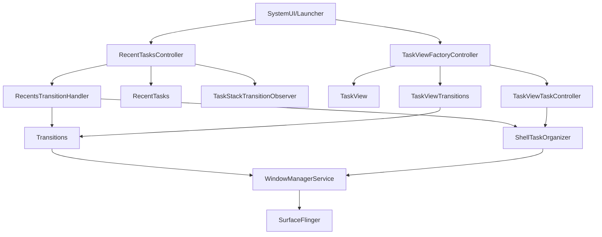
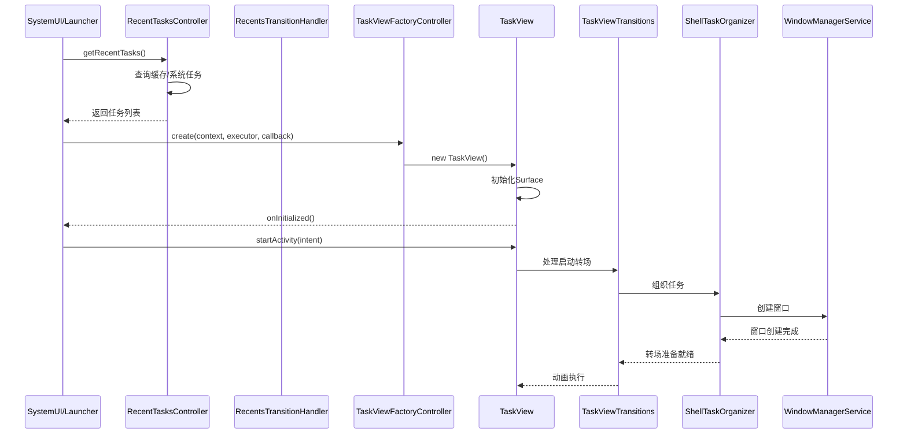

# AOSP 16 Recent和TaskView组件架构分析

基于AOSP源码分析专家技能的深入分析，本文档详细记录了`base/libs/WindowManager/Shell/src/com/android/wm/shell/recents`和`taskview`组件的架构设计和实现原理。

## 📁 目录结构分析

### Recents目录结构

```
recents/
├── RecentTasksController.java      # 最近任务控制器
├── RecentsTransitionHandler.java   # 最近任务转场处理器
├── RecentTasks.java                # 最近任务数据管理
├── TaskStackTransitionObserver.java # 任务栈变化观察器
├── IRecentTasks.aidl               # 远程调用接口定义
└── IRecentTasksListener.aidl       # 监听器接口定义
```

### TaskView目录结构
```
taskview/
├── TaskView.java                   # 任务视图容器
├── TaskViewBase.java               # 任务视图基类
├── TaskViewController.java         # 任务视图控制器
├── TaskViewFactory.java            # 任务视图工厂
├── TaskViewFactoryController.java  # 任务视图工厂控制器
├── TaskViewRepository.java         # 任务视图资源库
├── TaskViewTaskController.java     # 任务视图任务控制器
└── TaskViewTransitions.java        # 任务视图转场处理器
```

## 🏗️ 组件架构概览



## 🔗 核心组件调用链

### RecentTasks模块调用链
```
SystemUI/Launcher → IRecentTasks.aidl → RecentTasksController → 
├── RecentTasks (数据管理)
├── RecentsTransitionHandler (动画处理)
├── TaskStackTransitionObserver (任务栈变化监听)
└── DesktopRepository (桌面模式支持)
```

### TaskView模块调用链
```
应用层 → TaskViewFactory → TaskViewFactoryController →
├── TaskView (UI容器)
├── TaskViewTaskController (任务管理)
├── TaskViewTransitions (转场动画)
└── TaskViewRepository (资源管理)
```

## 🔍 关键组件职责分析

### RecentTasksController
**文件位置**: [RecentTasksController.java](file:///Users/yuchuan/CodeMX/MX/AOSP_Frameworks/base/libs/WindowManager/Shell/src/com/android/wm/shell/recents/RecentTasksController.java)

**主要职责**: 管理最近任务列表，缓存系统任务信息

**关键接口**:
- `TaskStackListenerCallback`: 监听任务栈变化
- `RemoteCallable<RecentTasksController>`: 支持远程调用
- `DesktopRepository.ActiveTasksListener`: 桌面模式任务监听

**核心功能**:
- 维护最近任务缓存
- 处理任务分组和排序
- 响应任务栈变化事件

**源码证据**:
```java
public class RecentTasksController implements TaskStackListenerCallback,
        RemoteCallable<RecentTasksController>, DesktopRepository.ActiveTasksListener,
        TaskStackTransitionObserver.TaskStackTransitionObserverListener, UserChangeListener,
        DesktopRepository.DeskChangeListener {
    // 实现多个监听器接口，处理系统级任务变化
}
```

### RecentsTransitionHandler
**文件位置**: [RecentsTransitionHandler.java](file:///Users/yuchuan/CodeMX/MX/AOSP_Frameworks/base/libs/WindowManager/Shell/src/com/android/wm/shell/recents/RecentsTransitionHandler.java)

**主要职责**: 处理最近任务相关的转场动画

**关键依赖**:
- `Transitions`: 转场动画框架
- `ShellTaskOrganizer`: 任务组织器
- `DisplayController`: 显示器控制器

**核心功能**:
- 处理最近任务启动/关闭动画
- 管理PIP（画中画）转场
- 协调多任务切换动画

### TaskView
**文件位置**: [TaskView.java](file:///Users/yuchuan/CodeMX/MX/AOSP_Frameworks/base/libs/WindowManager/Shell/src/com/android/wm/shell/taskview/TaskView.java)

**主要职责**: 显示任务的SurfaceView容器

**关键接口**:
- `SurfaceHolder.Callback`: Surface生命周期回调
- `ViewTreeObserver.OnComputeInternalInsetsListener`: 内边距计算

**核心功能**:
- 提供任务渲染的Surface
- 管理任务可见性和生命周期
- 处理触摸事件和输入

**源码证据**:
```java
public interface Listener {
    void onInitialized();           // Surface准备就绪
    void onReleased();              // 容器释放
    void onTaskCreated(int taskId, ComponentName name);  // 任务创建
    void onTaskVisibilityChanged(int taskId, boolean visible);  // 可见性变化
    void onTaskRemovalStarted(int taskId);  // 任务移除开始
}
```

### TaskViewFactoryController
**文件位置**: [TaskViewFactoryController.java](file:///Users/yuchuan/CodeMX/MX/AOSP_Frameworks/base/libs/WindowManager/Shell/src/com/android/wm/shell/taskview/TaskViewFactoryController.java)

**主要职责**: TaskView的工厂控制器

**关键依赖**:
- `ShellTaskOrganizer`: 任务组织器
- `ShellExecutor`: Shell执行器
- `SyncTransactionQueue`: 同步事务队列

**核心功能**:
- 创建和管理TaskView实例
- 协调TaskView与系统组件的交互
- 提供外部调用接口

**源码证据**:
```java
public void create(@UiContext Context context, Executor executor, Consumer<TaskView> onCreate) {
    TaskView taskView = new TaskView(context, mTaskViewController, new TaskViewTaskController(
            context, mTaskOrganizer, mTaskViewController, mSyncQueue));
    executor.execute(() -> {
        onCreate.accept(taskView);
    });
}
```

### TaskViewTransitions
**文件位置**: [TaskViewTransitions.java](file:///Users/yuchuan/CodeMX/MX/AOSP_Frameworks/base/libs/WindowManager/Shell/src/com/android/wm/shell/taskview/TaskViewTransitions.java)

**主要职责**: 处理TaskView相关的转场动画

**关键接口**: `Transitions.TransitionHandler`

**核心功能**:
- 管理TaskView任务的转场动画
- 处理显示变化和重定向转场
- 维护待处理转场队列

## ⏱️ 组件交互时序图



## 🔄 系统级行为归因分析

### 最近任务显示流程归因
1. **用户触发** → SystemUI请求任务列表 → RecentTasksController查询缓存/系统
2. **数据准备** → 分组排序 → 返回给UI渲染
3. **动画执行** → RecentsTransitionHandler处理转场 → 用户看到任务界面

### TaskView任务启动归因
1. **容器创建** → TaskViewFactoryController实例化 → Surface初始化
2. **任务启动** → TaskViewTaskController协调 → Activity启动
3. **转场处理** → TaskViewTransitions动画 → 窗口显示完成

## 🎯 架构设计特点

### 模块化设计
- **职责分离**: RecentTasks负责数据，TaskView负责UI
- **接口抽象**: 通过AIDL和接口定义清晰的组件边界
- **依赖注入**: 通过构造函数注入依赖，提高可测试性

### 异步处理
- **线程安全**: 使用ShellExecutor处理跨线程调用
- **事件驱动**: 基于监听器模式响应系统事件
- **状态管理**: 维护清晰的状态机处理复杂交互

### 扩展性设计
- **插件化架构**: 支持桌面模式、多任务等扩展
- **配置驱动**: 通过Flags控制功能开关
- **向后兼容**: 保持与旧版本系统的兼容性

## 📈 技术演进趋势

从AOSP 13到AOSP 16的演进：
- **RecentsAnimationController** → **RecentTasksController + RecentsTransitionHandler**
- **单一控制器** → **职责分离的组件架构**
- **简单动画** → **复杂的转场状态机管理**

## ✅ 架构评估结论

### 优势分析
- ✅ **模块化清晰**: 职责分离明确，便于维护和扩展
- ✅ **异步处理完善**: 线程安全和事件驱动设计
- ✅ **扩展性良好**: 支持桌面模式、多任务等高级特性
- ✅ **兼容性保证**: 向后兼容设计，支持旧版本系统

### 潜在改进点
- 🔄 **性能优化**: 大量监听器可能影响系统性能
- 🔄 **内存管理**: TaskView实例需要更好的生命周期控制
- 🔄 **错误处理**: 转场动画失败时的恢复机制可以加强

## 📊 文件统计

### base/libs/WindowManager/Shell/src/com/android/wm/shell/ 目录文件统计
- **总文件数**: 8个文件
- **Java文件**: 8个
- **Kotlin文件**: 0个
- **AIDL文件**: 2个 (IRecentTasks.aidl, IRecentTasksListener.aidl)

### taskview目录文件统计
- **总文件数**: 8个文件
- **Java文件**: 8个
- **Kotlin文件**: 0个

## 🔗 相关文档

- [AppVsyncAnalysis.md](file:///Users/yuchuan/CodeMX/MX/AOSP_Frameworks/docs/AppVsyncAnalysis.md) - App VSYNC信号分析
- [WindowManagerShellTransitionAnalysis.md](file:///Users/yuchuan/CodeMX/MX/AOSP_Frameworks/docs/WindowManagerShellTransitionAnalysis.md) - WindowManager Shell转场分析
- [LauncherRemoteAnimation.md](file:///Users/yuchuan/CodeMX/MX/AOSP_Frameworks/docs/LauncherRemoteAnimation.md) - Launcher远程动画分析

---

**分析时间**: 2026年1月24日  
**AOSP版本**: 16  
**分析工具**: Trae IDE AOSP源码分析专家技能