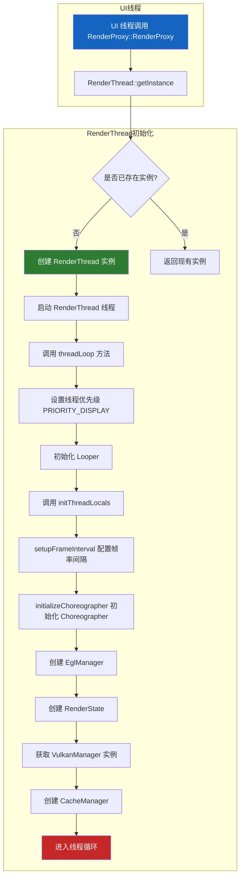
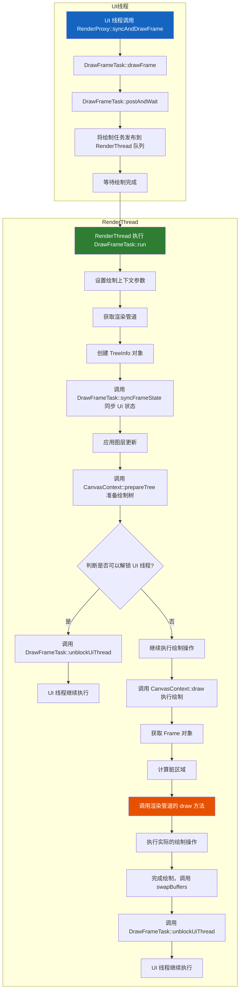
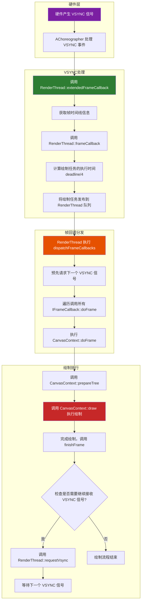
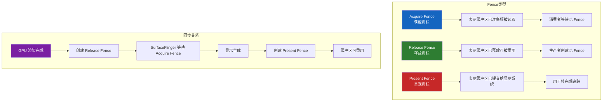
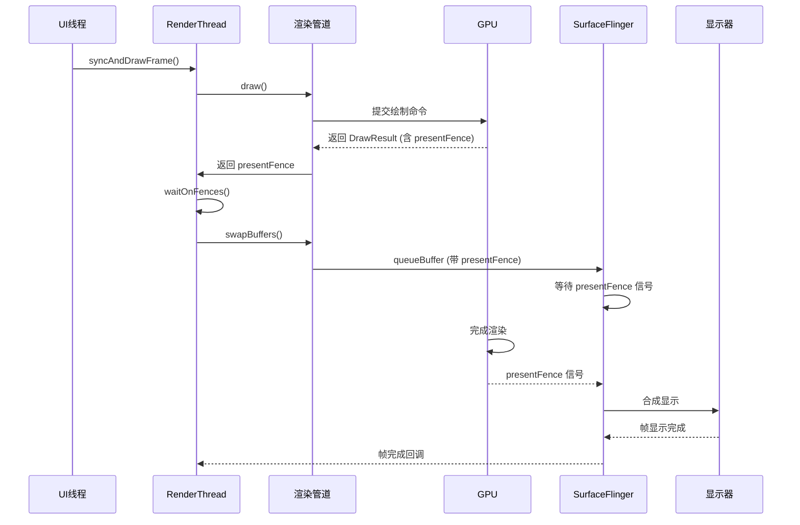
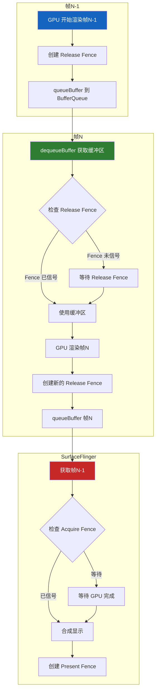

# RenderThread 详细代码流程分析

## 1. RenderThread 概述

RenderThread 是 Android UI 渲染系统的核心组件，它负责将 UI 线程生成的显示列表转换为实际的像素，并绘制到屏幕上。RenderThread 的主要目标是将渲染工作从 UI 线程分离出来，提高渲染性能和稳定性，减少卡顿。

**源码位置**: `base/libs/hwui/renderthread/`

## 2. RenderThread 核心组件

### 2.1 主要类结构

| 类名 | 文件位置 | 作用 |
|------|----------|------|
| RenderThread | [RenderThread.cpp](base/libs/hwui/renderthread/RenderThread.cpp) | 渲染线程的核心类，管理线程生命周期、VSYNC 处理和任务队列 |
| RenderProxy | [RenderProxy.cpp](base/libs/hwui/renderthread/RenderProxy.cpp) | UI 线程和 RenderThread 之间的桥梁，提供线程安全的接口 |
| DrawFrameTask | [DrawFrameTask.cpp](base/libs/hwui/renderthread/DrawFrameTask.cpp) | 绘制任务的核心类，负责同步 UI 状态和执行绘制操作 |
| CanvasContext | [CanvasContext.cpp](base/libs/hwui/renderthread/CanvasContext.cpp) | 管理绘制上下文，包括渲染管道、图层和渲染状态 |
| IRenderPipeline | [IRenderPipeline.h](base/libs/hwui/renderthread/IRenderPipeline.h) | 渲染管道接口，定义了绘制操作的标准接口 |
| SkiaOpenGLPipeline | [SkiaOpenGLPipeline.cpp](base/libs/hwui/pipeline/skia/SkiaOpenGLPipeline.cpp) | 基于 OpenGL 的 Skia 渲染管道实现 |
| SkiaVulkanPipeline | [SkiaVulkanPipeline.cpp](base/libs/hwui/pipeline/skia/SkiaVulkanPipeline.cpp) | 基于 Vulkan 的 Skia 渲染管道实现 |
| EglManager | [EglManager.cpp](base/libs/hwui/renderthread/EglManager.cpp) | 管理 EGL 上下文和表面，负责与 GPU 的交互 |
| CacheManager | [CacheManager.cpp](base/libs/hwui/renderthread/CacheManager.cpp) | 管理各种缓存资源，如纹理、着色器等 |
| VulkanManager | [VulkanManager.cpp](base/libs/hwui/renderthread/VulkanManager.cpp) | 管理 Vulkan 上下文和资源 |
| TimeLord | [TimeLord.cpp](base/libs/hwui/renderthread/TimeLord.cpp) | 管理帧时间和 VSYNC 时间同步 |
| HintSessionWrapper | [HintSessionWrapper.cpp](base/libs/hwui/renderthread/HintSessionWrapper.cpp) | 封装性能提示会话，用于 CPU 调度优化 |
| ReliableSurface | [ReliableSurface.cpp](base/libs/hwui/renderthread/ReliableSurface.cpp) | 可靠的 Surface 封装，处理 Surface 错误恢复 |

### 2.2 目录结构

```
renderthread/
├── RenderThread.cpp/h           # 渲染线程核心
├── RenderProxy.cpp/h            # 线程代理
├── DrawFrameTask.cpp/h          # 绘制任务
├── CanvasContext.cpp/h          # 画布上下文
├── IRenderPipeline.h            # 渲染管道接口
├── EglManager.cpp/h             # EGL 管理
├── VulkanManager.cpp/h          # Vulkan 管理
├── VulkanSurface.cpp/h          # Vulkan Surface
├── CacheManager.cpp/h           # 缓存管理
├── TimeLord.cpp/h               # 时间管理
├── Frame.cpp/h                  # 帧封装
├── RenderTask.cpp/h             # 渲染任务
├── ReliableSurface.cpp/h        # 可靠 Surface
├── HintSessionWrapper.cpp/h     # 性能提示会话
├── HardwareBufferRenderParams.h # 硬件缓冲区参数
└── RenderEffectCapabilityQuery.cpp/h # 渲染效果能力查询
```

## 3. RenderThread 启动流程



### 代码分析：

RenderThread 是一个单例类，通过 `getInstance()` 方法获取实例：

```cpp
// RenderThread.cpp#L107-L114
RenderThread& RenderThread::getInstance() {
    [[clang::no_destroy]] static sp<RenderThread> sInstance = []() {
        sp<RenderThread> thread = sp<RenderThread>::make();
        thread->start("RenderThread");
        return thread;
    }();
    gHasRenderThreadInstance = true;
    return *sInstance;
}
```

线程启动后，会调用 `threadLoop()` 方法进入线程循环：

```cpp
// RenderThread.cpp#L435-L461
bool RenderThread::threadLoop() {
    setpriority(PRIO_PROCESS, 0, PRIORITY_DISPLAY);
    Looper::setForThread(mLooper);
    if (gOnStartHook) {
        gOnStartHook("RenderThread");
    }
    initThreadLocals();

    while (true) {
        waitForWork();
        processQueue();

        // 处理帧回调和 VSYNC 请求
        if (mPendingRegistrationFrameCallbacks.size() && !mFrameCallbackTaskPending) {
            mVsyncSource->drainPendingEvents();
            mFrameCallbacks.insert(mPendingRegistrationFrameCallbacks.begin(),
                                   mPendingRegistrationFrameCallbacks.end());
            mPendingRegistrationFrameCallbacks.clear();
            requestVsync();
        }

        if (!mFrameCallbackTaskPending && !mVsyncRequested && mFrameCallbacks.size()) {
            requestVsync();
        }

        mCacheManager->onThreadIdle();
    }

    return false;
}
```

`initThreadLocals()` 初始化线程本地资源：

```cpp
// RenderThread.cpp#L178-L184
void RenderThread::initThreadLocals() {
    setupFrameInterval();
    initializeChoreographer();
    mEglManager = new EglManager();
    mRenderState = new RenderState(*this);
    mVkManager = VulkanManager::getInstance();
    mCacheManager = new CacheManager(*this);
}
```

## 4. 绘制流程



### 代码分析：

UI 线程通过 `RenderProxy::syncAndDrawFrame()` 触发绘制：

```cpp
// RenderProxy.cpp#L117-L119
int RenderProxy::syncAndDrawFrame() {
    return mDrawFrameTask.drawFrame();
}
```

`DrawFrameTask::drawFrame()` 会将绘制任务发布到 RenderThread 的消息队列中，并等待绘制完成：

```cpp
// DrawFrameTask.cpp#L55-L62
int DrawFrameTask::drawFrame() {
    LOG_ALWAYS_FATAL_IF(!mContext, "Cannot drawFrame with no CanvasContext!");

    mSyncResult = SyncResult::OK;
    mSyncQueued = systemTime(SYSTEM_TIME_MONOTONIC);
    postAndWait();

    return mSyncResult;
}
```

`postAndWait()` 方法会将任务发布到 RenderThread 的队列，并等待任务完成：

```cpp
// DrawFrameTask.cpp#L64-L69
void DrawFrameTask::postAndWait() {
    ATRACE_CALL();
    AutoMutex _lock(mLock);
    mRenderThread->queue().post([this]() { run(); });
    mSignal.wait(mLock);
}
```

RenderThread 执行 `DrawFrameTask::run()` 方法，开始绘制流程：

```cpp
// DrawFrameTask.cpp#L71-L130
void DrawFrameTask::run() {
    const int64_t vsyncId = mFrameInfo[static_cast<int>(FrameInfoIndex::FrameTimelineVsyncId)];
    ATRACE_FORMAT("DrawFrames %" PRId64, vsyncId);

    mContext->setSyncDelayDuration(systemTime(SYSTEM_TIME_MONOTONIC) - mSyncQueued);
    mContext->setTargetSdrHdrRatio(mRenderSdrHdrRatio);

    auto hardwareBufferParams = mHardwareBufferParams;
    mContext->setHardwareBufferRenderParams(hardwareBufferParams);
    IRenderPipeline* pipeline = mContext->getRenderPipeline();
    bool canUnblockUiThread;
    bool canDrawThisFrame;
    bool solelyTextureViewUpdates;
    {
        TreeInfo info(TreeInfo::MODE_FULL, *mContext);
        info.forceDrawFrame = mForceDrawFrame;
        mForceDrawFrame = false;
        canUnblockUiThread = syncFrameState(info);
        canDrawThisFrame = !info.out.skippedFrameReason.has_value();
        solelyTextureViewUpdates = info.out.solelyTextureViewUpdates;

        if (mFrameCommitCallback) {
            mContext->addFrameCommitListener(std::move(mFrameCommitCallback));
            mFrameCommitCallback = nullptr;
        }
    }

    // 解锁 UI 线程
    if (canUnblockUiThread) {
        unblockUiThread();
    }

    // 执行绘制
    if (CC_LIKELY(canDrawThisFrame)) {
        context->draw(solelyTextureViewUpdates);
    } else {
        // 处理跳过帧的情况
        if (GrDirectContext* grContext = mRenderThread->getGrContext()) {
            grContext->flushAndSubmit();
        }
        context->waitOnFences();
    }

    if (!canUnblockUiThread) {
        unblockUiThread();
    }

    // 处理硬件缓冲区
    if (pipeline->hasHardwareBuffer()) {
        auto fence = pipeline->flush();
        hardwareBufferParams.invokeRenderCallback(std::move(fence), 0);
    }
}
```

`CanvasContext::draw()` 方法执行实际的绘制操作：

```cpp
// CanvasContext.cpp#L597-L680
void CanvasContext::draw(bool solelyTextureViewUpdates) {
    // 检查 GrContext 是否有效
    if (auto grContext = getGrContext()) {
        if (grContext->abandoned()) {
            if (grContext->isDeviceLost()) {
                LOG_ALWAYS_FATAL("Lost GPU device unexpectedly");
                return;
            }
            LOG_ALWAYS_FATAL("GrContext is abandoned at start of CanvasContext::draw");
            return;
        }
    }
    
    SkRect dirty;
    mDamageAccumulator.finish(&dirty);

    // 检查是否需要跳过绘制
    const auto skippedFrameReason = [&]() -> std::optional<SkippedFrameReason> {
        if (!Properties::isDrawingEnabled()) {
            return SkippedFrameReason::DrawingOff;
        }

        if (dirty.isEmpty() && Properties::skipEmptyFrames && !surfaceRequiresRedraw()) {
            return SkippedFrameReason::NothingToDraw;
        }

        return std::nullopt;
    }();
    if (skippedFrameReason) {
        mCurrentFrameInfo->setSkippedFrameReason(*skippedFrameReason);
        // ... 处理跳过帧
        return;
    }

    ScopedActiveContext activeContext(this);
    mCurrentFrameInfo->set(FrameInfoIndex::FrameInterval) = 
            mRenderThread.timeLord().frameIntervalNanos();

    mCurrentFrameInfo->markIssueDrawCommandsStart();

    Frame frame = getFrame();
    SkRect windowDirty = computeDirtyRect(frame, &dirty);

    // 调用渲染管道执行绘制
    IRenderPipeline::DrawResult drawResult;
    drawResult = mRenderPipeline->draw(
            frame, windowDirty, dirty, mLightGeometry, &mLayerUpdateQueue, mContentDrawBounds,
            mOpaque, mLightInfo, mRenderNodes, &(profiler()), mBufferParams, profilerLock());

    // 处理绘制结果...
}
```

## 5. VSYNC 处理流程



### 代码分析：

RenderThread 通过 `initializeChoreographer()` 方法初始化 Choreographer，用于接收 VSYNC 信号：

```cpp
// RenderThread.cpp#L168-L183
void RenderThread::initializeChoreographer() {
    LOG_ALWAYS_FATAL_IF(mVsyncSource, "Initializing a second Choreographer?");

    if (!Properties::isolatedProcess) {
        mChoreographer = AChoreographer_create();
        LOG_ALWAYS_FATAL_IF(mChoreographer == nullptr, "Initialization of Choreographer failed");
        AChoreographer_registerRefreshRateCallback(mChoreographer,
                                                   RenderThread::refreshRateCallback, this);

        // Register the FD
        mLooper->addFd(AChoreographer_getFd(mChoreographer), 0, Looper::EVENT_INPUT,
                       RenderThread::choreographerCallback, this);
        mVsyncSource = new ChoreographerSource(this);
    } else {
        mVsyncSource = new DummyVsyncSource(this);
    }
}
```

当 VSYNC 信号到达时，会调用 `RenderThread::extendedFrameCallback()`：

```cpp
// RenderThread.cpp#L41-L55
void RenderThread::extendedFrameCallback(const AChoreographerFrameCallbackData* cbData,
                                         void* data) {
    RenderThread* rt = reinterpret_cast<RenderThread*>(data);
    size_t preferredFrameTimelineIndex =
            AChoreographerFrameCallbackData_getPreferredFrameTimelineIndex(cbData);
    AVsyncId vsyncId = AChoreographerFrameCallbackData_getFrameTimelineVsyncId(
            cbData, preferredFrameTimelineIndex);
    int64_t frameDeadline = AChoreographerFrameCallbackData_getFrameTimelineDeadlineNanos(
            cbData, preferredFrameTimelineIndex);
    int64_t frameTimeNanos = AChoreographerFrameCallbackData_getFrameTimeNanos(cbData);
    int64_t frameInterval = AChoreographer_getFrameInterval(rt->mChoreographer);
    rt->frameCallback(vsyncId, frameDeadline, frameTimeNanos, frameInterval);
}
```

`RenderThread::frameCallback()` 会计算任务执行时间并发布到消息队列：

```cpp
// RenderThread.cpp#L57-L83
void RenderThread::frameCallback(int64_t vsyncId, int64_t frameDeadline, int64_t frameTimeNanos,
                                 int64_t frameInterval) {
    mVsyncRequested = false;
    if (timeLord().vsyncReceived(frameTimeNanos, frameTimeNanos, vsyncId, frameDeadline,
                                 frameInterval) &&
        !mFrameCallbackTaskPending) {
        mFrameCallbackTaskPending = true;

        using SteadyClock = std::chrono::steady_clock;
        using Nanos = std::chrono::nanoseconds;
        using toNsecs_t = std::chrono::duration<nsecs_t, std::nano>;
        using toFloatMillis = std::chrono::duration<float, std::milli>;

        const auto frameTimeTimePoint = SteadyClock::time_point(Nanos(frameTimeNanos));
        const auto deadlineTimePoint = SteadyClock::time_point(Nanos(frameDeadline));

        const auto timeUntilDeadline = deadlineTimePoint - frameTimeTimePoint;
        // 在 deadline 的 1/4 时间点执行，留出足够时间完成绘制
        const auto runAt = (frameTimeTimePoint + (timeUntilDeadline / 4));

        ATRACE_FORMAT("queue mFrameCallbackTask to run after %.2fms",
                      toFloatMillis(runAt - SteadyClock::now()).count());
        queue().postAt(toNsecs_t(runAt.time_since_epoch()).count(),
                       [this]() { dispatchFrameCallbacks(); });
    }
}
```

`dispatchFrameCallbacks()` 会调用所有注册的帧回调：

```cpp
// RenderThread.cpp#L415-L430
void RenderThread::dispatchFrameCallbacks() {
    ATRACE_CALL();
    mFrameCallbackTaskPending = false;

    std::set<IFrameCallback*> callbacks;
    mFrameCallbacks.swap(callbacks);

    if (callbacks.size()) {
        // 预先请求下一个 VSYNC 信号
        requestVsync();
        for (std::set<IFrameCallback*>::iterator it = callbacks.begin(); it != callbacks.end();
             it++) {
            (*it)->doFrame();
        }
    }
}
```

## 6. 线程通信机制

RenderThread 使用 `WorkQueue`（继承自 `ThreadBase`）实现线程间通信，UI 线程可以通过 `RenderProxy` 将任务发布到 RenderThread 的消息队列中。

### 主要通信方法：

| 方法 | 说明 | 阻塞性 |
|------|------|--------|
| `WorkQueue::post()` | 将任务发布到消息队列中，异步执行 | 非阻塞 |
| `WorkQueue::postAt()` | 在指定时间执行任务 | 非阻塞 |
| `WorkQueue::postDelayed()` | 延迟执行任务 | 非阻塞 |
| `WorkQueue::runSync()` | 将任务发布到消息队列中，并等待任务执行完成 | 阻塞 |

### RenderProxy 中的线程通信示例：

```cpp
// RenderProxy.cpp#L56-L63
RenderProxy::RenderProxy(bool translucent, RenderNode* rootRenderNode,
                         IContextFactory* contextFactory)
        : mRenderThread(RenderThread::getInstance()), mContext(nullptr) {
    pid_t uiThreadId = pthread_gettid_np(pthread_self());
    pid_t renderThreadId = getRenderThreadTid();
    // 同步创建 CanvasContext
    mContext = mRenderThread.queue().runSync([=, this]() -> CanvasContext* {
        CanvasContext* context = CanvasContext::create(mRenderThread, translucent, rootRenderNode,
                                                       contextFactory, uiThreadId, renderThreadId);
        return context;
    });
    mDrawFrameTask.setContext(&mRenderThread, mContext, rootRenderNode);
}
```

```cpp
// RenderProxy.cpp#L93-L96
void RenderProxy::setSurface(ANativeWindow* window, bool enableTimeout) {
    if (window) { ANativeWindow_acquire(window); }
    mRenderThread.queue().post([this, win = window, enableTimeout]() mutable {
        mContext->setSurface(win, enableTimeout);
        if (win) { ANativeWindow_release(win); }
    });
}
```

## 7. 渲染管道

RenderThread 支持多种渲染管道，通过 `Properties::getRenderPipelineType()` 获取渲染管道类型：

### 渲染管道类型：

| 类型 | 实现类 | 说明 |
|------|--------|------|
| SkiaGL | SkiaOpenGLPipeline | 基于 OpenGL ES 的 Skia 渲染管道（默认） |
| SkiaVulkan | SkiaVulkanPipeline | 基于 Vulkan 的 Skia 渲染管道 |
| SkiaCpu | SkiaCpuPipeline | 基于 CPU 的渲染管道（仅用于测试） |

### 渲染管道选择：

```cpp
// Properties.cpp 中通过系统属性控制
// 系统属性: debug.hwui.renderer
// 可选值: skia_gl (默认), skia_vk, skia_cpu
```

### CanvasContext 创建渲染管道：

```cpp
// CanvasContext.cpp#L59-L79
CanvasContext* CanvasContext::create(RenderThread& thread, bool translucent,
                                     RenderNode* rootRenderNode, IContextFactory* contextFactory,
                                     pid_t uiThreadId, pid_t renderThreadId) {
    auto renderType = Properties::getRenderPipelineType();

    switch (renderType) {
        case RenderPipelineType::SkiaGL:
            return new CanvasContext(thread, translucent, rootRenderNode, contextFactory,
                                     std::make_unique<skiapipeline::SkiaOpenGLPipeline>(thread),
                                     uiThreadId, renderThreadId);
        case RenderPipelineType::SkiaVulkan:
            return new CanvasContext(thread, translucent, rootRenderNode, contextFactory,
                                     std::make_unique<skiapipeline::SkiaVulkanPipeline>(thread),
                                     uiThreadId, renderThreadId);
#ifndef __ANDROID__
        case RenderPipelineType::SkiaCpu:
            return new CanvasContext(thread, translucent, rootRenderNode, contextFactory,
                                     std::make_unique<skiapipeline::SkiaCpuPipeline>(thread),
                                     uiThreadId, renderThreadId);
#endif
        default:
            LOG_ALWAYS_FATAL("canvas context type %d not supported", (int32_t)renderType);
            break;
    }
    return nullptr;
}
```

### IRenderPipeline 接口定义：

```cpp
// IRenderPipeline.h#L46-L85
class IRenderPipeline {
public:
    virtual MakeCurrentResult makeCurrent() = 0;
    virtual Frame getFrame() = 0;

    struct DrawResult {
        bool success = false;
        static constexpr nsecs_t kUnknownTime = -1;
        nsecs_t commandSubmissionTime = kUnknownTime;
        android::base::unique_fd presentFence;
    };
    
    virtual DrawResult draw(const Frame& frame, const SkRect& screenDirty, const SkRect& dirty,
                            const LightGeometry& lightGeometry, LayerUpdateQueue* layerUpdateQueue,
                            const Rect& contentDrawBounds, bool opaque, const LightInfo& lightInfo,
                            const std::vector<sp<RenderNode>>& renderNodes,
                            FrameInfoVisualizer* profiler,
                            const HardwareBufferRenderParams& bufferParams,
                            std::mutex& profilerLock) = 0;
    virtual bool swapBuffers(const Frame& frame, IRenderPipeline::DrawResult&,
                             const SkRect& screenDirty, FrameInfo* currentFrameInfo,
                             bool* requireSwap) = 0;
    virtual DeferredLayerUpdater* createTextureLayer() = 0;
    [[nodiscard]] virtual android::base::unique_fd flush() = 0;
    virtual bool setSurface(ANativeWindow* window, SwapBehavior swapBehavior) = 0;
    // ... 更多接口方法
};
```

## 8. 跳帧原因分析

CanvasContext 定义了多种跳帧原因：

```cpp
enum class SkippedFrameReason {
    DrawingOff,          // 绘制已禁用
    NothingToDraw,       // 没有需要绘制的内容
    NoBuffer,            // 没有可用缓冲区
    NoOutputTarget,      // 没有输出目标
    ContextIsStopped,    // 上下文已停止
    AlreadyDrawn,        // 已经绘制过（同一 VSYNC）
};
```

### 跳帧判断逻辑：

```cpp
// CanvasContext.cpp#L605-L620
const auto skippedFrameReason = [&]() -> std::optional<SkippedFrameReason> {
    if (!Properties::isDrawingEnabled()) {
        return SkippedFrameReason::DrawingOff;
    }

    if (dirty.isEmpty() && Properties::skipEmptyFrames && !surfaceRequiresRedraw()) {
        return SkippedFrameReason::NothingToDraw;
    }

    return std::nullopt;
}();
```

## 9. 性能优化

RenderThread 采用了多种性能优化技术：

### 9.1 VSYNC 同步
- 确保绘制操作与硬件的刷新率同步，减少卡顿
- 使用 `AChoreographer` 接收 VSYNC 信号
- 在 deadline 的 1/4 时间点开始绘制，留出足够时间完成

### 9.2 脏区域优化
- 只绘制发生变化的区域，减少绘制工作量
- 使用 `DamageAccumulator` 累积脏区域
- 支持部分更新（`enablePartialUpdates`）

### 9.3 图层管理
- 使用硬件图层减少重绘次数
- `LayerUpdateQueue` 管理图层更新
- 支持纹理视图单独更新（`solelyTextureViewUpdates`）

### 9.4 缓存管理
- 缓存纹理、着色器等资源，提高渲染效率
- `CacheManager` 统一管理缓存
- 支持内存压力时的缓存清理（`trimMemory`）

### 9.5 线程优先级
- 将 RenderThread 的优先级设置为 `PRIORITY_DISPLAY`
- 确保绘制操作得到及时执行

### 9.6 跳过空帧
- 当没有需要绘制的内容时，跳过绘制操作
- 通过 `skipEmptyFrames` 属性控制

### 9.7 HintSession 优化
- 使用 `HintSessionWrapper` 向系统提供性能提示
- 帮助 CPU 调度器优化线程调度

### 9.8 SwapChain 监控
- 检测 SwapChain 是否堵塞（`isSwapChainStuffed`）
- 避免因缓冲区队列问题导致的卡顿

## 10. 关键数据结构

### 10.1 FrameInfo
帧信息追踪，用于性能分析：

```cpp
enum class FrameInfoIndex {
    Flags = 0,
    FrameTimelineVsyncId,
    Vsync,
    IntendedVsync,
    FrameDeadline,
    FrameInterval,
    FrameStartTime,
    SyncQueued,
    SyncStart,
    IssueDrawCommandsStart,
    // ... 更多索引
};
```

### 10.2 TreeInfo
渲染树信息，用于准备和同步：

```cpp
class TreeInfo {
public:
    enum Mode { MODE_FULL = 0, MODE_RT_ONLY = 1 };
    
    struct Out {
        bool hasAnimations = false;
        bool requiresUiRedraw = false;
        bool solelyTextureViewUpdates = false;
        std::optional<SkippedFrameReason> skippedFrameReason;
        nsecs_t animatedImageDelay = kNoAnimatedImageDelay;
    };
    
    Mode mode;
    DamageAccumulator* damageAccumulator = nullptr;
    LayerUpdateQueue* layerUpdateQueue = nullptr;
    Out out;
};
```

### 10.3 SwapHistory
交换历史记录，用于检测 SwapChain 问题：

```cpp
struct SwapHistory {
    nsecs_t vsyncTime;
    nsecs_t swapCompletedTime;
    nsecs_t dequeueDuration;
    nsecs_t queueDuration;
};
```

## 11. Fence 同步机制

Fence 是 Android 图形系统中的核心同步机制，用于协调 CPU、GPU 和显示硬件之间的异步操作。RenderThread 通过 Fence 机制确保图形缓冲区在正确的时机被访问，避免竞态条件和画面撕裂。

### 11.1 Fence 概述



### 11.2 Fence 核心组件

| 组件 | 文件位置 | 作用 |
|------|----------|------|
| EglManager | [EglManager.cpp](base/libs/hwui/renderthread/EglManager.cpp) | EGL Fence 的创建和等待 |
| VulkanManager | [VulkanManager.cpp](base/libs/hwui/renderthread/VulkanManager.cpp) | Vulkan Semaphore/Fence 管理 |
| CanvasContext | [CanvasContext.cpp](base/libs/hwui/renderthread/CanvasContext.cpp) | 帧级 Fence 等待管理 |
| DeferredLayerUpdater | [DeferredLayerUpdater.cpp](base/libs/hwui/DeferredLayerUpdater.cpp) | SurfaceTexture 的 Fence 处理 |
| IRenderPipeline | [IRenderPipeline.h](base/libs/hwui/renderthread/IRenderPipeline.h) | 渲染管道的 Fence 接口 |

### 11.3 EGL Fence 实现

#### 11.3.1 Fence 创建

EglManager 提供了创建 EGL Fence 的方法：

```cpp
// EglManager.cpp#L689-L735
status_t EglManager::fenceWait(int fence) {
    if (!hasEglContext()) {
        ALOGE("EglManager::fenceWait: EGLDisplay not initialized");
        return INVALID_OPERATION;
    }

    if (EglExtensions.waitSync && EglExtensions.nativeFenceSync) {
        // GPU 等待 Fence
        // 从当前 fence 创建 EGLSyncKHR
        int fenceFd = ::dup(fence);
        if (fenceFd == -1) {
            ALOGE("EglManager::fenceWait: error dup'ing fence fd: %d", errno);
            return -errno;
        }
        EGLint attribs[] = {EGL_SYNC_NATIVE_FENCE_FD_ANDROID, fenceFd, EGL_NONE};
        EGLSyncKHR sync = eglCreateSyncKHR(mEglDisplay, EGL_SYNC_NATIVE_FENCE_ANDROID, attribs);
        if (sync == EGL_NO_SYNC_KHR) {
            close(fenceFd);
            ALOGE("EglManager::fenceWait: error creating EGL fence: %#x", eglGetError());
            return UNKNOWN_ERROR;
        }

        // 等待 Fence 信号
        eglWaitSyncKHR(mEglDisplay, sync, 0);
        EGLint eglErr = eglGetError();
        eglDestroySyncKHR(mEglDisplay, sync);
        if (eglErr != EGL_SUCCESS) {
            ALOGE("EglManager::fenceWait: error waiting for EGL fence: %#x", eglErr);
            return UNKNOWN_ERROR;
        }
    } else {
        // CPU 等待 Fence
        status_t err = waitForeverOnFence(fence, "EglManager::fenceWait");
        if (err != NO_ERROR) {
            ALOGE("EglManager::fenceWait: error waiting for fence: %d", err);
            return err;
        }
    }
    return OK;
}
```

#### 11.3.2 Release Fence 创建

```cpp
// EglManager.cpp#L737-L788
status_t EglManager::createReleaseFence(bool useFenceSync, EGLSyncKHR* eglFence, int* nativeFence) {
    *nativeFence = -1;
    if (!hasEglContext()) {
        ALOGE("EglManager::createReleaseFence: EGLDisplay not initialized");
        return INVALID_OPERATION;
    }

    if (EglExtensions.nativeFenceSync) {
        // 创建 Native Fence
        EGLSyncKHR sync = eglCreateSyncKHR(mEglDisplay, EGL_SYNC_NATIVE_FENCE_ANDROID, nullptr);
        if (sync == EGL_NO_SYNC_KHR) {
            ALOGE("EglManager::createReleaseFence: error creating EGL fence: %#x", eglGetError());
            return UNKNOWN_ERROR;
        }
        glFlush();
        int fenceFd = eglDupNativeFenceFDANDROID(mEglDisplay, sync);
        eglDestroySyncKHR(mEglDisplay, sync);
        if (fenceFd == EGL_NO_NATIVE_FENCE_FD_ANDROID) {
            ALOGE("EglManager::createReleaseFence: error dup'ing native fence fd: %#x",
                  eglGetError());
            return UNKNOWN_ERROR;
        }
        *nativeFence = fenceFd;
        *eglFence = EGL_NO_SYNC_KHR;
    } else if (useFenceSync && EglExtensions.fenceSync) {
        // 使用 EGL Fence Sync
        if (*eglFence != EGL_NO_SYNC_KHR) {
            // 等待之前的 Fence
            EGLint result = eglClientWaitSyncKHR(mEglDisplay, *eglFence, 0, 1000000000);
            if (result == EGL_FALSE) {
                ALOGE("EglManager::createReleaseFence: error waiting for previous fence: %#x",
                      eglGetError());
                return UNKNOWN_ERROR;
            } else if (result == EGL_TIMEOUT_EXPIRED_KHR) {
                ALOGE("EglManager::createReleaseFence: timeout waiting for previous fence");
                return TIMED_OUT;
            }
            eglDestroySyncKHR(mEglDisplay, *eglFence);
        }

        // 创建新的 Fence
        *eglFence = eglCreateSyncKHR(mEglDisplay, EGL_SYNC_FENCE_KHR, nullptr);
        if (*eglFence == EGL_NO_SYNC_KHR) {
            ALOGE("EglManager::createReleaseFence: error creating fence: %#x", eglGetError());
            return UNKNOWN_ERROR;
        }
        glFlush();
    }
    return OK;
}
```

### 11.4 Vulkan Fence 实现

Vulkan 使用 Semaphore 和 Fence 实现同步：

```cpp
// VulkanManager.cpp#L796-L843
status_t VulkanManager::fenceWait(int fence, GrDirectContext* grContext) {
    if (!hasVkContext()) {
        ALOGE("VulkanManager::fenceWait: VkDevice not initialized");
        return INVALID_OPERATION;
    }

    // GPU 等待 Fence
    int fenceFd = ::dup(fence);
    if (fenceFd == -1) {
        ALOGE("VulkanManager::fenceWait: error dup'ing fence fd: %d", errno);
        return -errno;
    }

    // 创建 Vulkan Semaphore 并等待
    VkSemaphoreCreateInfo semaphoreInfo = {
            .sType = VK_STRUCTURE_TYPE_SEMAPHORE_CREATE_INFO,
    };
    VkSemaphore semaphore;
    VkResult err = mCreateSemaphore(mDevice, &semaphoreInfo, nullptr, &semaphore);
    // ... 导入 Fence 到 Semaphore 并等待
    return OK;
}
```

```cpp
// VulkanManager.cpp#L846-L899
status_t VulkanManager::createReleaseFence(int* nativeFence, GrDirectContext* grContext) {
    *nativeFence = -1;
    if (!hasVkContext()) {
        ALOGE("VulkanManager::createReleaseFence: VkDevice not initialized");
        return INVALID_OPERATION;
    }

    // 创建 Vulkan Semaphore
    VkSemaphoreCreateInfo semaphoreInfo = {
            .sType = VK_STRUCTURE_TYPE_SEMAPHORE_CREATE_INFO,
    };
    VkSemaphore semaphore;
    VkResult err = mCreateSemaphore(mDevice, &semaphoreInfo, nullptr, &semaphore);
    if (VK_SUCCESS != err) {
        ALOGE("VulkanManager::createReleaseFence: Failed to create semaphore");
        return INVALID_OPERATION;
    }

    // 提交到 GPU 并获取 Fence FD
    grContext->submit();
    // ... 获取 Fence 文件描述符
    *nativeFence = fenceFd;
    return OK;
}
```

### 11.5 Present Fence 流程



### 11.6 DrawResult 中的 Present Fence

渲染管道的 `draw()` 方法返回 `DrawResult` 结构，包含 present fence：

```cpp
// IRenderPipeline.h#L48-L56
struct DrawResult {
    // 绘制是否成功
    bool success = false;
    // 命令提交时间，-1 表示未知
    static constexpr nsecs_t kUnknownTime = -1;
    nsecs_t commandSubmissionTime = kUnknownTime;
    // Present Fence，GPU 渲染完成后信号
    android::base::unique_fd presentFence;
};
```

### 11.7 CanvasContext Fence 管理

CanvasContext 维护帧级 Fence 队列：

```cpp
// CanvasContext.cpp#L1086-L1094
void CanvasContext::waitOnFences() {
    if (mFrameFences.size()) {
        ATRACE_CALL();
        for (auto& fence : mFrameFences) {
            fence.get();  // 等待 future 完成
        }
        mFrameFences.clear();
    }
}
```

在绘制流程中调用 `waitOnFences()`：

```cpp
// CanvasContext.cpp#L681
void CanvasContext::draw(bool solelyTextureViewUpdates) {
    // ... 绘制操作
    
    waitOnFences();  // 等待之前的帧完成
    
    // ... swapBuffers
}
```

### 11.8 SurfaceTexture Fence 处理

DeferredLayerUpdater 处理 SurfaceTexture 的 Fence：

```cpp
// DeferredLayerUpdater.cpp#L92-L107
status_t DeferredLayerUpdater::createReleaseFence(bool useFenceSync, EGLSyncKHR* eglFence,
                                                  EGLDisplay* display, int* releaseFence,
                                                  void* handle) {
    *display = EGL_NO_DISPLAY;
    DeferredLayerUpdater* dlu = (DeferredLayerUpdater*)handle;
    RenderState& renderState = dlu->mRenderState;
    status_t err;
    if (Properties::getRenderPipelineType() == RenderPipelineType::SkiaGL) {
        EglManager& eglManager = renderState.getRenderThread().eglManager();
        *display = eglManager.eglDisplay();
        err = eglManager.createReleaseFence(useFenceSync, eglFence, releaseFence);
    } else {
        err = renderState.getRenderThread().vulkanManager().createReleaseFence(
                releaseFence, renderState.getRenderThread().getGrContext());
    }
    return err;
}

status_t DeferredLayerUpdater::fenceWait(int fence, void* handle) {
    DeferredLayerUpdater* dlu = (DeferredLayerUpdater*)handle;
    RenderState& renderState = dlu->mRenderState;
    if (Properties::getRenderPipelineType() == RenderPipelineType::SkiaGL) {
        return renderState.getRenderThread().eglManager().fenceWait(fence);
    } else {
        return renderState.getRenderThread().vulkanManager().fenceWait(
                fence, renderState.getRenderThread().getGrContext());
    }
}
```

### 11.9 Fence 同步时序图



### 11.10 Fence 性能优化

#### 11.10.1 GPU vs CPU 等待

```cpp
// EglManager.cpp 中的优化选择
if (EglExtensions.waitSync && EglExtensions.nativeFenceSync) {
    // GPU 等待：更高效，不阻塞 CPU
    eglWaitSyncKHR(mEglDisplay, sync, 0);
} else {
    // CPU 等待：回退方案，可能阻塞
    sync_wait(fence, -1);
}
```

#### 11.10.2 Fence 超时处理

```cpp
// EglManager.cpp#L673-L685
static status_t waitForeverOnFence(int fence, const char* logname) {
    ATRACE_CALL();
    if (fence == -1) {
        return NO_ERROR;
    }
    constexpr int warningTimeout = 3000;  // 3秒警告超时
    int err = sync_wait(fence, warningTimeout);
    if (err < 0 && errno == ETIME) {
        ALOGE("%s: fence %d didn't signal in %d ms", logname, fence, warningTimeout);
        err = sync_wait(fence, -1);  // 无限等待
    }
    return err < 0 ? -errno : status_t(NO_ERROR);
}
```

### 11.11 Fence 扩展支持

EglManager 初始化时检测 Fence 扩展：

```cpp
// EglManager.cpp#L296-L298
void EglManager::initExtensions() {
    // ...
    EglExtensions.fenceSync = extensions.has("EGL_KHR_fence_sync");
    EglExtensions.waitSync = extensions.has("EGL_KHR_wait_sync");
    EglExtensions.nativeFenceSync = extensions.has("EGL_ANDROID_native_fence_sync");
}
```

| 扩展名称 | 作用 |
|----------|------|
| EGL_KHR_fence_sync | 基础 Fence Sync 支持 |
| EGL_KHR_wait_sync | GPU 端 Fence 等待 |
| EGL_ANDROID_native_fence_sync | Android Native Fence 支持 |

## 12. 总结

RenderThread 是 Android UI 渲染系统的核心组件，它通过将渲染工作从 UI 线程分离出来，提高了渲染性能和稳定性。RenderThread 的主要流程包括：

### 12.1 启动流程
1. 单例模式创建 RenderThread 实例
2. 设置线程优先级为 `PRIORITY_DISPLAY`
3. 初始化 Choreographer、EglManager、VulkanManager、CacheManager 等组件
4. 进入线程循环，等待任务

### 12.2 绘制流程
1. UI 线程通过 RenderProxy 触发绘制
2. DrawFrameTask 同步 UI 状态到 RenderThread
3. CanvasContext 准备渲染树并执行绘制
4. 渲染管道执行实际的 GPU 绘制命令

### 12.3 VSYNC 处理流程
1. AChoreographer 接收 VSYNC 信号
2. 计算最佳绘制时间点（deadline/4）
3. 分发帧回调给所有监听者
4. 执行绘制并请求下一个 VSYNC

### 12.4 架构特点
- **线程安全**: 通过 WorkQueue 实现线程间安全通信
- **模块化**: 渲染管道可插拔，支持 OpenGL/Vulkan
- **性能优化**: 脏区域绘制、缓存管理、跳帧优化
- **可观测性**: 完整的帧信息追踪和性能分析支持

---

**分析时间**: 2026年2月12日  
**AOSP版本**: 16  
**分析工具**: Trae IDE AOSP源码分析专家技能
