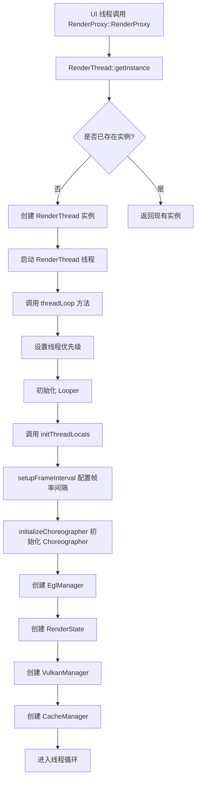
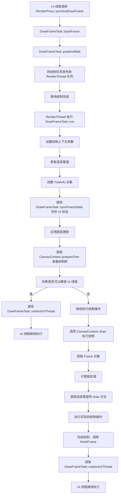
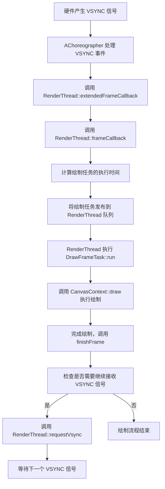

# RenderThread 详细代码流程分析

## 1. RenderThread 概述

RenderThread 是 Android UI 渲染系统的核心组件，它负责将 UI 线程生成的显示列表转换为实际的像素，并绘制到屏幕上。RenderThread 的主要目标是将渲染工作从 UI 线程分离出来，提高渲染性能和稳定性，减少卡顿。

## 2. RenderThread 核心组件

### 2.1 主要类结构

| 类名 | 作用 |
|------|------|
| RenderThread | 渲染线程的核心类，管理线程生命周期、VSYNC 处理和任务队列 |
| RenderProxy | UI 线程和 RenderThread 之间的桥梁，提供线程安全的接口 |
| DrawFrameTask | 绘制任务的核心类，负责同步 UI 状态和执行绘制操作 |
| CanvasContext | 管理绘制上下文，包括渲染管道、图层和渲染状态 |
| IRenderPipeline | 渲染管道接口，定义了绘制操作的标准接口 |
| SkiaOpenGLPipeline/SkiaVulkanPipeline | 具体的渲染管道实现，基于 Skia 图形库 |
| EglManager | 管理 EGL 上下文和表面，负责与 GPU 的交互 |
| CacheManager | 管理各种缓存资源，如纹理、着色器等 |

## 3. RenderThread 启动流程



### 代码分析：

RenderThread 是一个单例类，通过 `getInstance()` 方法获取实例：

```cpp
RenderThread& RenderThread::getInstance() {
    [[clang::no_destroy]] static sp<RenderThread> sInstance = []() {
        sp<RenderThread> thread = sp<RenderThread>::make();
        thread->start("RenderThread");
        return thread;
    }();
    gHasRenderThreadInstance = true;
    return *sInstance;
}
```

线程启动后，会调用 `threadLoop()` 方法进入线程循环：

```cpp
bool RenderThread::threadLoop() {
    setpriority(PRIO_PROCESS, 0, PRIORITY_DISPLAY);
    Looper::setForThread(mLooper);
    if (gOnStartHook) {
        gOnStartHook("RenderThread");
    }
    initThreadLocals();

    while (true) {
        waitForWork();
        processQueue();

        // 处理帧回调和 VSYNC 请求
        if (mPendingRegistrationFrameCallbacks.size() && !mFrameCallbackTaskPending) {
            mVsyncSource->drainPendingEvents();
            mFrameCallbacks.insert(mPendingRegistrationFrameCallbacks.begin(),
                                   mPendingRegistrationFrameCallbacks.end());
            mPendingRegistrationFrameCallbacks.clear();
            requestVsync();
        }

        if (!mFrameCallbackTaskPending && !mVsyncRequested && mFrameCallbacks.size()) {
            requestVsync();
        }

        mCacheManager->onThreadIdle();
    }

    return false;
}
```

## 4. 绘制流程



### 代码分析：

UI 线程通过 `RenderProxy::syncAndDrawFrame()` 触发绘制：

```cpp
int RenderProxy::syncAndDrawFrame() {
    return mDrawFrameTask.drawFrame();
}
```

`DrawFrameTask::drawFrame()` 会将绘制任务发布到 RenderThread 的消息队列中，并等待绘制完成：

```cpp
int DrawFrameTask::drawFrame() {
    LOG_ALWAYS_FATAL_IF(!mContext, "Cannot drawFrame with no CanvasContext!");

    mSyncResult = SyncResult::OK;
    mSyncQueued = systemTime(SYSTEM_TIME_MONOTONIC);
    postAndWait();

    return mSyncResult;
}
```

`postAndWait()` 方法会将任务发布到 RenderThread 的队列，并等待任务完成：

```cpp
void DrawFrameTask::postAndWait() {
    ATRACE_CALL();
    AutoMutex _lock(mLock);
    mRenderThread->queue().post([this]() { run(); });
    mSignal.wait(mLock);
}
```

RenderThread 执行 `DrawFrameTask::run()` 方法，开始绘制流程：

```cpp
void DrawFrameTask::run() {
    const int64_t vsyncId = mFrameInfo[static_cast<int>(FrameInfoIndex::FrameTimelineVsyncId)];
    ATRACE_FORMAT("DrawFrames %" PRId64, vsyncId);

    mContext->setSyncDelayDuration(systemTime(SYSTEM_TIME_MONOTONIC) - mSyncQueued);
    mContext->setTargetSdrHdrRatio(mRenderSdrHdrRatio);

    auto hardwareBufferParams = mHardwareBufferParams;
    mContext->setHardwareBufferRenderParams(hardwareBufferParams);
    IRenderPipeline* pipeline = mContext->getRenderPipeline();
    bool canUnblockUiThread;
    bool canDrawThisFrame;
    bool solelyTextureViewUpdates;
    {
        TreeInfo info(TreeInfo::MODE_FULL, *mContext);
        info.forceDrawFrame = mForceDrawFrame;
        mForceDrawFrame = false;
        canUnblockUiThread = syncFrameState(info);
        canDrawThisFrame = !info.out.skippedFrameReason.has_value();
        solelyTextureViewUpdates = info.out.solelyTextureViewUpdates;

        if (mFrameCommitCallback) {
            mContext->addFrameCommitListener(std::move(mFrameCommitCallback));
            mFrameCommitCallback = nullptr;
        }
    }

    // 解锁 UI 线程
    if (canUnblockUiThread) {
        unblockUiThread();
    }

    // 执行绘制
    if (CC_LIKELY(canDrawThisFrame)) {
        mContext->draw(solelyTextureViewUpdates);
    } else {
        // 处理跳过帧的情况
        // ...
    }

    if (!canUnblockUiThread) {
        unblockUiThread();
    }

    // 处理硬件缓冲区
    if (pipeline->hasHardwareBuffer()) {
        auto fence = pipeline->flush();
        hardwareBufferParams.invokeRenderCallback(std::move(fence), 0);
    }
}
```

`CanvasContext::draw()` 方法执行实际的绘制操作：

```cpp
void CanvasContext::draw(bool solelyTextureViewUpdates) {
    // 检查绘制是否可用
    SkRect dirty;
    mDamageAccumulator.finish(&dirty);

    // 检查是否需要跳过绘制
    const auto skippedFrameReason = [&]() -> std::optional<SkippedFrameReason> {
        if (!Properties::isDrawingEnabled()) {
            return SkippedFrameReason::DrawingOff;
        }

        if (dirty.isEmpty() && Properties::skipEmptyFrames && !surfaceRequiresRedraw()) {
            return SkippedFrameReason::NothingToDraw;
        }

        return std::nullopt;
    }();
    if (skippedFrameReason) {
        // 处理跳过帧的情况
        // ...
        return;
    }

    ScopedActiveContext activeContext(this);
    mCurrentFrameInfo->set(FrameInfoIndex::FrameInterval) = mRenderThread.timeLord().frameIntervalNanos();

    mCurrentFrameInfo->markIssueDrawCommandsStart();

    Frame frame = getFrame();
    SkRect windowDirty = computeDirtyRect(frame, &dirty);

    // 调用渲染管道执行绘制
    IRenderPipeline::DrawResult drawResult;
    drawResult = mRenderPipeline->draw(
            frame, windowDirty, dirty, mLightGeometry, &mLayerUpdateQueue, mContentDrawBounds,
            mOpaque, mLightInfo, mRenderNodes, &(profiler()), mBufferParams, profilerLock());

    // 处理绘制结果
    // ...
}
```

## 5. VSYNC 处理流程



### 代码分析：

RenderThread 通过 `initializeChoreographer()` 方法初始化 Choreographer，用于接收 VSYNC 信号：

```cpp
void RenderThread::initializeChoreographer() {
    LOG_ALWAYS_FATAL_IF(mVsyncSource, "Initializing a second Choreographer?");

    if (!Properties::isolatedProcess) {
        mChoreographer = AChoreographer_create();
        LOG_ALWAYS_FATAL_IF(mChoreographer == nullptr, "Initialization of Choreographer failed");
        AChoreographer_registerRefreshRateCallback(mChoreographer,
                                                   RenderThread::refreshRateCallback, this);

        // 注册文件描述符
        mLooper->addFd(AChoreographer_getFd(mChoreographer), 0, Looper::EVENT_INPUT,
                       RenderThread::choreographerCallback, this);
        mVsyncSource = new ChoreographerSource(this);
    } else {
        mVsyncSource = new DummyVsyncSource(this);
    }
}
```

当 VSYNC 信号到达时，会调用 `RenderThread::extendedFrameCallback()`：

```cpp
void RenderThread::extendedFrameCallback(const AChoreographerFrameCallbackData* cbData,
                                         void* data) {
    RenderThread* rt = reinterpret_cast<RenderThread*>(data);
    size_t preferredFrameTimelineIndex = AChoreographerFrameCallbackData_getPreferredFrameTimelineIndex(cbData);
    AVsyncId vsyncId = AChoreographerFrameCallbackData_getFrameTimelineVsyncId(cbData, preferredFrameTimelineIndex);
    int64_t frameDeadline = AChoreographerFrameCallbackData_getFrameTimelineDeadlineNanos(cbData, preferredFrameTimelineIndex);
    int64_t frameTimeNanos = AChoreographerFrameCallbackData_getFrameTimeNanos(cbData);
    int64_t frameInterval = AChoreographer_getFrameInterval(rt->mChoreographer);
    rt->frameCallback(vsyncId, frameDeadline, frameTimeNanos, frameInterval);
}
```

`RenderThread::frameCallback()` 会将绘制任务发布到 RenderThread 的消息队列中：

```cpp
void RenderThread::frameCallback(int64_t vsyncId, int64_t frameDeadline, int64_t frameTimeNanos,
                                 int64_t frameInterval) {
    mVsyncRequested = false;
    if (timeLord().vsyncReceived(frameTimeNanos, frameTimeNanos, vsyncId, frameDeadline,
                                 frameInterval) &&
        !mFrameCallbackTaskPending) {
        mFrameCallbackTaskPending = true;

        using SteadyClock = std::chrono::steady_clock;
        using Nanos = std::chrono::nanoseconds;
        using toNsecs_t = std::chrono::duration<nsecs_t, std::nano>;
        using toFloatMillis = std::chrono::duration<float, std::milli>;

        const auto frameTimeTimePoint = SteadyClock::time_point(Nanos(frameTimeNanos));
        const auto deadlineTimePoint = SteadyClock::time_point(Nanos(frameDeadline));

        const auto timeUntilDeadline = deadlineTimePoint - frameTimeTimePoint;
        const auto runAt = (frameTimeTimePoint + (timeUntilDeadline / 4));

        ATRACE_FORMAT("queue mFrameCallbackTask to run after %.2fms",
                      toFloatMillis(runAt - SteadyClock::now()).count());
        queue().postAt(toNsecs_t(runAt.time_since_epoch()).count(),
                       [this]() { dispatchFrameCallbacks(); });
    }
}
```

`dispatchFrameCallbacks()` 会调用所有注册的帧回调：

```cpp
void RenderThread::dispatchFrameCallbacks() {
    ATRACE_CALL();
    mFrameCallbackTaskPending = false;

    std::set<IFrameCallback*> callbacks;
    mFrameCallbacks.swap(callbacks);

    if (callbacks.size()) {
        // 预先请求下一个 VSYNC 信号
        requestVsync();
        for (std::set<IFrameCallback*>::iterator it = callbacks.begin(); it != callbacks.end();
             it++) {
            (*it)->doFrame();
        }
    }
}
```

## 6. 线程通信机制

RenderThread 使用 `WorkQueue` 实现线程间通信，UI 线程可以通过 `RenderProxy` 将任务发布到 RenderThread 的消息队列中。RenderThread 会依次执行队列中的任务。

主要的线程通信方法包括：

1. `WorkQueue::post()`：将任务发布到消息队列中，异步执行。
2. `WorkQueue::postAt()`：在指定时间执行任务。
3. `WorkQueue::runSync()`：将任务发布到消息队列中，并等待任务执行完成。
4. `WorkQueue::runSyncQuietly()`：与 `runSync()` 类似，但不会抛出异常。

## 7. 渲染管道

RenderThread 支持多种渲染管道，包括：

1. `SkiaOpenGLPipeline`：基于 OpenGL 的渲染管道。
2. `SkiaVulkanPipeline`：基于 Vulkan 的渲染管道。
3. `SkiaCpuPipeline`：基于 CPU 的渲染管道（用于测试和调试）。

渲染管道的选择由系统属性 `debug.hwui.renderer` 决定。

```cpp
RenderPipelineType Properties::getRenderPipelineType() {
    if (!sRenderPipelineInitialized) {
        sRenderPipelineInitialized = true;
        const char* renderPipelineProperty = getProp("debug.hwui.renderer", "skia_gl");
        if (!strcmp(renderPipelineProperty, "skia_vk")) {
            sRenderPipelineType = RenderPipelineType::SkiaVulkan;
        } else if (!strcmp(renderPipelineProperty, "skia_cpu")) {
            sRenderPipelineType = RenderPipelineType::SkiaCpu;
        } else {
            sRenderPipelineType = RenderPipelineType::SkiaGL;
        }
    }
    return sRenderPipelineType;
}
```

## 8. 性能优化

RenderThread 采用了多种性能优化技术：

1. **VSYNC 同步**：确保绘制操作与硬件的刷新率同步，减少卡顿。
2. **脏区域优化**：只绘制发生变化的区域，减少绘制工作量。
3. **图层管理**：使用硬件图层减少重绘次数。
4. **缓存管理**：缓存纹理、着色器等资源，提高渲染效率。
5. **线程优先级**：将 RenderThread 的优先级设置为 `PRIORITY_DISPLAY`，确保绘制操作得到及时执行。
6. **跳过空帧**：当没有需要绘制的内容时，跳过绘制操作，减少不必要的工作量。

## 9. 总结

RenderThread 是 Android UI 渲染系统的核心组件，它通过将渲染工作从 UI 线程分离出来，提高了渲染性能和稳定性。RenderThread 的主要流程包括：

1. 启动流程：初始化线程、Choreographer 和各种管理器。
2. 绘制流程：同步 UI 状态、执行绘制操作。
3. VSYNC 处理流程：接收和处理 VSYNC 信号，同步绘制操作。

RenderThread 采用了多种性能优化技术，确保 Android 应用的 UI 渲染流畅、高效。