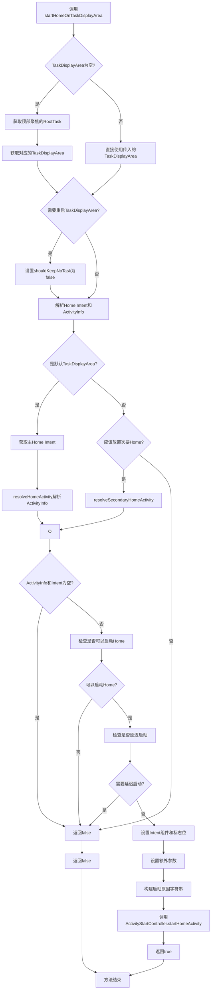
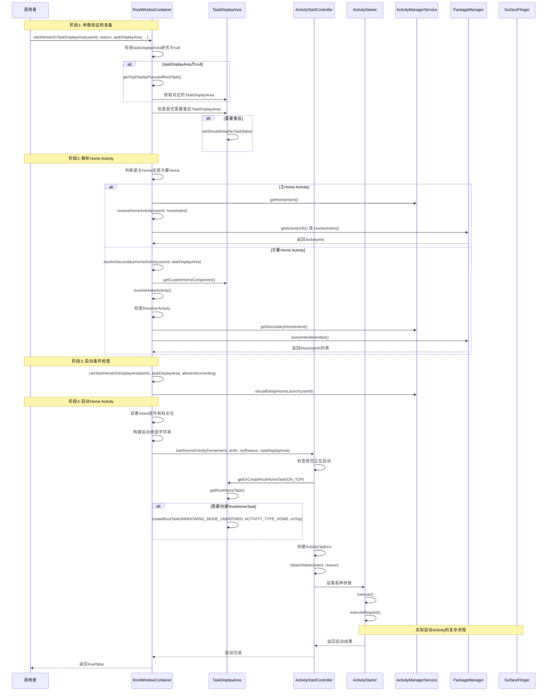
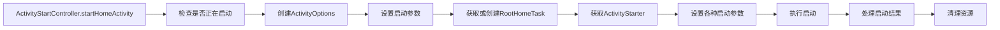

# RootWindowContainer startHomeOnTaskDisplayArea方法分析

## 方法概述

`startHomeOnTaskDisplayArea`方法是Android WindowManager系统中负责启动Home Activity的核心方法。该方法根据指定的TaskDisplayArea和用户ID，解析并启动对应的Home Activity。

## 方法签名

```java
boolean startHomeOnTaskDisplayArea(int userId, String reason, TaskDisplayArea taskDisplayArea,
        boolean allowInstrumenting, boolean fromHomeKey)
```

## 完整调用流程图



## 详细调用序列图



## 核心代码分析

### 1. 参数验证和TaskDisplayArea处理

```java
// Fallback to top focused display area if the provided one is invalid.
if (taskDisplayArea == null) {
    final Task rootTask = getTopDisplayFocusedRootTask();
    taskDisplayArea = rootTask != null ? rootTask.getDisplayArea()
            : getDefaultTaskDisplayArea();
}

// When display content mode management flag is enabled, the task display area is marked as
// removed when switching from extended display to mirroring display. We need to restart the
// task display area before starting the home.
if (ENABLE_DISPLAY_CONTENT_MODE_MANAGEMENT.isTrue()
        && taskDisplayArea.shouldKeepNoTask()) {
    taskDisplayArea.setShouldKeepNoTask(false);
}
```

### 2. Home Intent和ActivityInfo解析

```java
Intent homeIntent = null;
ActivityInfo aInfo = null;
if (taskDisplayArea == getDefaultTaskDisplayArea()
        || mWmService.shouldPlacePrimaryHomeOnDisplay(
                taskDisplayArea.getDisplayId(), userId)) {
    homeIntent = mService.getHomeIntent();
    aInfo = resolveHomeActivity(userId, homeIntent);
} else if (shouldPlaceSecondaryHomeOnDisplayArea(taskDisplayArea)) {
    Pair<ActivityInfo, Intent> info = resolveSecondaryHomeActivity(userId, taskDisplayArea);
    aInfo = info.first;
    homeIntent = info.second;
}
```

### 3. resolveHomeActivity方法

```java
@VisibleForTesting
ActivityInfo resolveHomeActivity(int userId, Intent homeIntent) {
    final int flags = ActivityManagerService.STOCK_PM_FLAGS;
    final ComponentName comp = homeIntent.getComponent();
    ActivityInfo aInfo = null;
    try {
        if (comp != null) {
            // Factory test.
            aInfo = AppGlobals.getPackageManager().getActivityInfo(comp, flags, userId);
        } else {
            final String resolvedType =
                    homeIntent.resolveTypeIfNeeded(mService.mContext.getContentResolver());
            final ResolveInfo info = mTaskSupervisor.resolveIntent(homeIntent, resolvedType,
                    userId, flags, Binder.getCallingUid(), Binder.getCallingPid());
            if (info != null) {
                aInfo = info.activityInfo;
            }
        }
    } catch (RemoteException e) {
        // ignore
    }
    // ... 错误处理和返回
}
```

### 4. resolveSecondaryHomeActivity方法

```java
@VisibleForTesting
Pair<ActivityInfo, Intent> resolveSecondaryHomeActivity(int userId,
        @NonNull TaskDisplayArea taskDisplayArea) {
    // 检查自定义Home组件
    final ComponentName customHomeComponent =
            taskDisplayArea.getDisplayContent() != null
                    ? taskDisplayArea.getDisplayContent().getCustomHomeComponent()
                    : null;
    if (customHomeComponent != null) {
        homeIntent.setComponent(customHomeComponent);
        ActivityInfo customHomeActivityInfo = resolveHomeActivity(userId, homeIntent);
        if (customHomeActivityInfo != null) {
            aInfo = customHomeActivityInfo;
            lookForSecondaryHomeActivityInPrimaryHomePackage = false;
        }
    }
    
    // 在主Home包中查找次要Home Activity
    if (lookForSecondaryHomeActivityInPrimaryHomePackage) {
        homeIntent = mService.getSecondaryHomeIntent(aInfo.applicationInfo.packageName);
        final List<ResolveInfo> resolutions = resolveActivities(userId, homeIntent);
        // ... 解析逻辑
    }
    
    // 回退到默认次要Home组件
    if (aInfo == null) {
        homeIntent = mService.getSecondaryHomeIntent(null);
        aInfo = resolveHomeActivity(userId, homeIntent);
    }
    return Pair.create(aInfo, homeIntent);
}
```

### 5. 启动条件检查

```java
boolean canStartHomeOnDisplayArea(ActivityInfo homeInfo, TaskDisplayArea taskDisplayArea,
        boolean allowInstrumenting) {
    // 工厂测试模式检查
    if (mService.mFactoryTest == FactoryTest.FACTORY_TEST_LOW_LEVEL
            && mService.mTopAction == null) {
        return false;
    }
    
    // 检查是否正在被插桩
    final WindowProcessController app =
            mService.getProcessController(homeInfo.processName, homeInfo.applicationInfo.uid);
    if (!allowInstrumenting && app != null && app.isInstrumenting()) {
        return false;
    }
    
    // 检查TaskDisplayArea是否支持Home Task
    if (taskDisplayArea != null && !taskDisplayArea.canHostHomeTask()) {
        return false;
    }
    
    // 检查是否应该放置主Home
    final int displayId = taskDisplayArea != null ? taskDisplayArea.getDisplayId()
            : INVALID_DISPLAY;
    if (shouldPlacePrimaryHomeOnDisplay(displayId)) {
        return true;
    }
    
    // 检查是否应该放置次要Home
    if (!shouldPlaceSecondaryHomeOnDisplayArea(taskDisplayArea)) {
        return false;
    }
    
    // 检查是否支持多实例
    final boolean supportMultipleInstance = homeInfo.launchMode != LAUNCH_SINGLE_TASK
            && homeInfo.launchMode != LAUNCH_SINGLE_INSTANCE;
    if (!supportMultipleInstance) {
        return false;
    }
    
    return true;
}
```

### 6. 最终启动逻辑

```java
// Updates the home component of the intent.
homeIntent.setComponent(new ComponentName(aInfo.applicationInfo.packageName, aInfo.name));
homeIntent.setFlags(homeIntent.getFlags() | FLAG_ACTIVITY_NEW_TASK);

// Updates the extra information of the intent.
if (fromHomeKey) {
    homeIntent.putExtra(WindowManagerPolicy.EXTRA_FROM_HOME_KEY, true);
}
homeIntent.putExtra(WindowManagerPolicy.EXTRA_START_REASON, reason);

// Update the reason for ANR debugging
final String myReason = reason + ":" + userId + ":" + UserHandle.getUserId(
        aInfo.applicationInfo.uid) + ":" + taskDisplayArea.getDisplayId();

mService.getActivityStartController().startHomeActivity(homeIntent, aInfo, myReason,
        taskDisplayArea);
return true;
```

## ActivityStartController.startHomeActivity流程



### ActivityStartController关键代码

```java
void startHomeActivity(Intent intent, ActivityInfo aInfo, String reason,
        TaskDisplayArea taskDisplayArea) {
    if (mHomeLaunchingTaskDisplayAreas.contains(taskDisplayArea)) {
        Slog.e(TAG, "Abort starting home on " + taskDisplayArea + " recursively.");
        return;
    }

    final ActivityOptions options = ActivityOptions.makeBasic();
    options.setLaunchWindowingMode(WINDOWING_MODE_FULLSCREEN);
    if (!ActivityRecord.isResolverActivity(aInfo.name)) {
        options.setLaunchActivityType(ACTIVITY_TYPE_HOME);
    }
    final int displayId = taskDisplayArea.getDisplayId();
    options.setLaunchDisplayId(displayId);
    options.setLaunchTaskDisplayArea(taskDisplayArea.mRemoteToken.toWindowContainerToken());

    // 延迟resume以避免递归操作
    mSupervisor.beginDeferResume();
    final Task rootHomeTask;
    try {
        // 确保RootHomeTask存在
        rootHomeTask = taskDisplayArea.getOrCreateRootHomeTask(ON_TOP);
    } finally {
        mSupervisor.endDeferResume();
    }

    try {
        mHomeLaunchingTaskDisplayAreas.add(taskDisplayArea);
        mLastHomeActivityStartResult = obtainStarter(intent, "startHomeActivity: " + reason)
                .setOutActivity(tmpOutRecord)
                .setCallingUid(0)
                .setActivityInfo(aInfo)
                .setActivityOptions(options.toBundle(),
                        Binder.getCallingPid(), Binder.getCallingUid())
                .execute();
    } finally {
        mHomeLaunchingTaskDisplayAreas.remove(taskDisplayArea);
    }
    
    // 处理resume逻辑
    if (rootHomeTask.mInResumeTopActivity) {
        mSupervisor.scheduleResumeTopActivities();
    }
}
```

## TaskDisplayArea.getOrCreateRootHomeTask流程

```java
Task getOrCreateRootHomeTask(boolean onTop) {
    Task homeTask = getRootHomeTask();
    // 检查TaskDisplayArea是否支持Home Task
    if (homeTask == null && canHostHomeTask()) {
        homeTask = createRootTask(WINDOWING_MODE_UNDEFINED, ACTIVITY_TYPE_HOME, onTop);
    }
    return homeTask;
}
```

## 关键类和接口

### 1. RootWindowContainer
- 管理系统中所有窗口容器的根容器
- 负责协调不同Display之间的窗口管理
- 提供启动Home Activity的核心方法

### 2. TaskDisplayArea
- 表示屏幕中包含应用窗口容器的区域
- 管理Task的层次结构
- 提供RootHomeTask的创建和管理

### 3. ActivityStartController
- 负责委托Activity启动请求
- 将外部启动请求准备成离散的Activity启动
- 处理启动前后的逻辑

### 4. ActivityStarter
- 解释如何将Intent和标志转换为Activity和Task
- 执行实际的Activity启动流程
- 处理启动过程中的各种复杂情况

### 5. ActivityTaskSupervisor
- 监督Activity的启动和生命周期管理
- 处理Activity栈的管理
- 协调多个Activity之间的交互

## 异常处理机制

### 1. 递归启动检测
```java
if (mHomeLaunchingTaskDisplayAreas.contains(taskDisplayArea)) {
    Slog.e(TAG, "Abort starting home on " + taskDisplayArea + " recursively.");
    return;
}
```

### 2. 远程调用异常处理
```java
try {
    if (comp != null) {
        aInfo = AppGlobals.getPackageManager().getActivityInfo(comp, flags, userId);
    } else {
        // ...
    }
} catch (RemoteException e) {
    // ignore
}
```

### 3. 延迟启动处理
```java
if (mService.mAmInternal.shouldDelayHomeLaunch(userId)) {
    Slog.d(TAG, "ThemeHomeDelay: Home launch was deferred with user " + userId);
    return false;
}
```

## 性能优化点

### 1. 延迟Resume机制
```java
mSupervisor.beginDeferResume();
try {
    rootHomeTask = taskDisplayArea.getOrCreateRootHomeTask(ON_TOP);
} finally {
    mSupervisor.endDeferResume();
}
```

### 2. 缓存RootHomeTask引用
```java
// Cached reference to some special tasks we tend to get a lot
private Task mRootHomeTask;
```

### 3. 避免不必要的配置更新
```java
final boolean globalConfigWillChange = mRequest.globalConfig != null
        && mService.getGlobalConfiguration().diff(mRequest.globalConfig) != 0;
```

## 总结

`startHomeOnTaskDisplayArea`方法是Android WindowManager系统中启动Home Activity的核心入口，它通过复杂的条件判断、Activity解析和启动流程，确保Home Activity能够正确地在指定的TaskDisplayArea中启动。整个流程涉及多个系统组件的协作，体现了Android窗口管理系统的复杂性和健壮性。