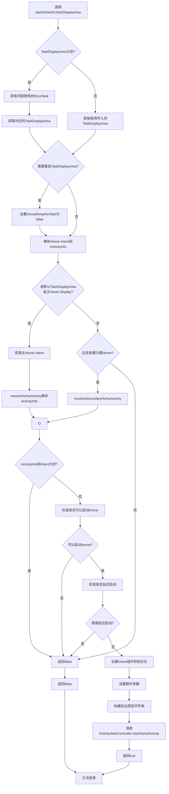
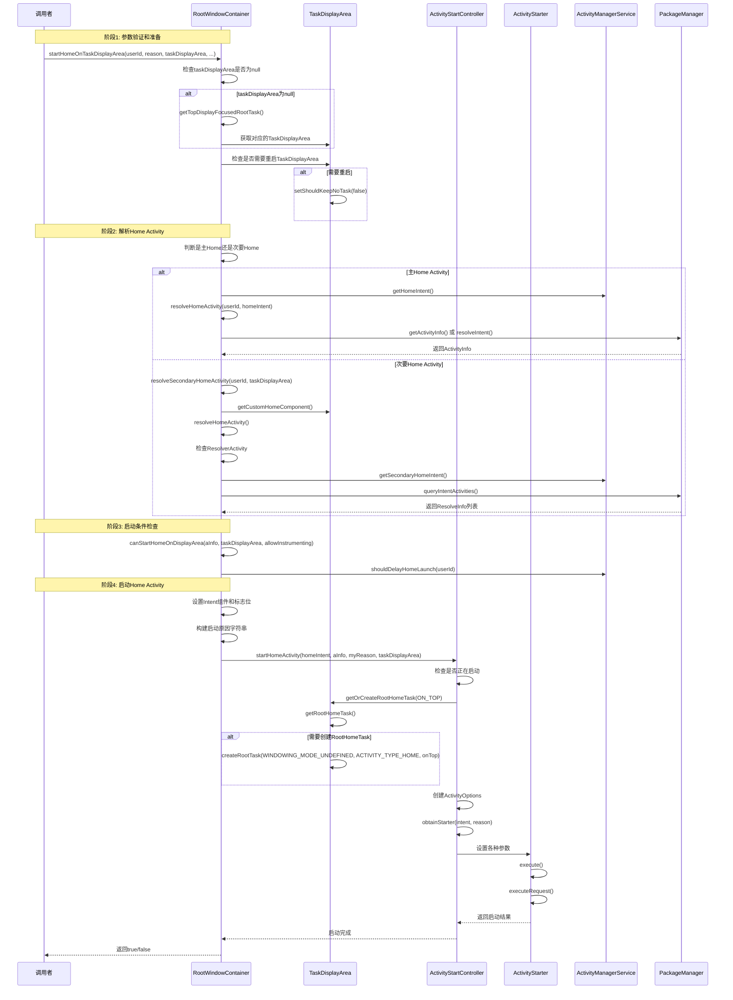
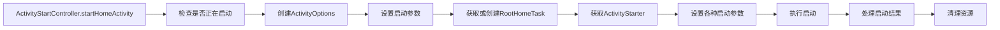
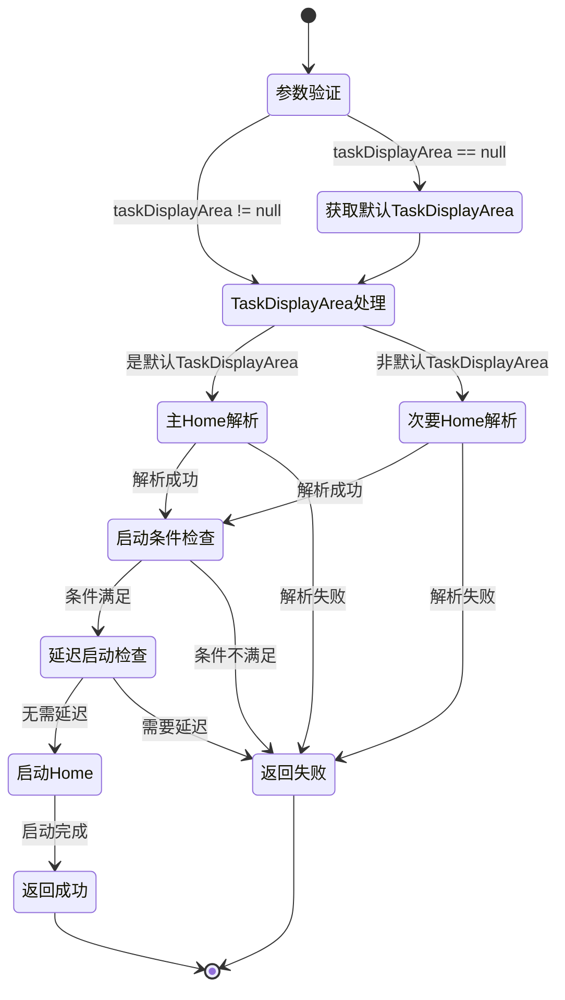

# RootWindowContainer startHomeOnTaskDisplayArea方法分析

## 方法概述

`startHomeOnTaskDisplayArea`方法是Android WindowManager系统中负责启动Home Activity的核心方法。该方法根据指定的TaskDisplayArea和用户ID，解析并启动对应的Home Activity。

**源码位置**: [RootWindowContainer.java](base/services/core/java/com/android/server/wm/RootWindowContainer.java#L1310-L1369)

## 方法签名

```java
boolean startHomeOnTaskDisplayArea(int userId, String reason, TaskDisplayArea taskDisplayArea,
        boolean allowInstrumenting, boolean fromHomeKey)
```

## 完整调用流程图



## 详细调用序列图



## 核心代码分析

### 1. 参数验证和TaskDisplayArea处理

**源码位置**: [RootWindowContainer.java#L1312-L1325](base/services/core/java/com/android/server/wm/RootWindowContainer.java#L1312-L1325)

```java
// Fallback to top focused display area if the provided one is invalid.
if (taskDisplayArea == null) {
    final Task rootTask = getTopDisplayFocusedRootTask();
    taskDisplayArea = rootTask != null ? rootTask.getDisplayArea()
            : getDefaultTaskDisplayArea();
}

// When display content mode management flag is enabled, the task display area is marked as
// removed when switching from extended display to mirroring display. We need to restart the
// task display area before starting the home.
if (ENABLE_DISPLAY_CONTENT_MODE_MANAGEMENT.isTrue()
        && taskDisplayArea.shouldKeepNoTask()) {
    taskDisplayArea.setShouldKeepNoTask(false);
}
```

### 2. Home Intent和ActivityInfo解析

**源码位置**: [RootWindowContainer.java#L1327-L1338](base/services/core/java/com/android/server/wm/RootWindowContainer.java#L1327-L1338)

```java
Intent homeIntent = null;
ActivityInfo aInfo = null;
if (taskDisplayArea == getDefaultTaskDisplayArea()
        || mWmService.shouldPlacePrimaryHomeOnDisplay(
                taskDisplayArea.getDisplayId(), userId)) {
    homeIntent = mService.getHomeIntent();
    aInfo = resolveHomeActivity(userId, homeIntent);
} else if (shouldPlaceSecondaryHomeOnDisplayArea(taskDisplayArea)) {
    Pair<ActivityInfo, Intent> info = resolveSecondaryHomeActivity(userId, taskDisplayArea);
    aInfo = info.first;
    homeIntent = info.second;
}
```

### 3. resolveHomeActivity方法

**源码位置**: [RootWindowContainer.java#L1377-L1402](base/services/core/java/com/android/server/wm/RootWindowContainer.java#L1377-L1402)

```java
@VisibleForTesting
ActivityInfo resolveHomeActivity(int userId, Intent homeIntent) {
    final int flags = ActivityManagerService.STOCK_PM_FLAGS;
    final ComponentName comp = homeIntent.getComponent();
    ActivityInfo aInfo = null;
    try {
        if (comp != null) {
            // Factory test.
            aInfo = AppGlobals.getPackageManager().getActivityInfo(comp, flags, userId);
        } else {
            final String resolvedType =
                    homeIntent.resolveTypeIfNeeded(mService.mContext.getContentResolver());
            final ResolveInfo info = mTaskSupervisor.resolveIntent(homeIntent, resolvedType,
                    userId, flags, Binder.getCallingUid(), Binder.getCallingPid());
            if (info != null) {
                aInfo = info.activityInfo;
            }
        }
    } catch (RemoteException e) {
        // ignore
    }

    if (aInfo == null) {
        Slogf.wtf(TAG, new Exception(), "No home screen found for %s and user %d", homeIntent,
                userId);
        return null;
    }
    return aInfo;
}
```

### 4. resolveSecondaryHomeActivity方法

**源码位置**: [RootWindowContainer.java#L1410-L1476](base/services/core/java/com/android/server/wm/RootWindowContainer.java#L1410-L1476)

```java
Pair<ActivityInfo, Intent> resolveSecondaryHomeActivity(int userId,
        @NonNull TaskDisplayArea taskDisplayArea) {
    if (taskDisplayArea == getDefaultTaskDisplayArea()) {
        throw new IllegalArgumentException(
                "resolveSecondaryHomeActivity: Should not be default task container");
    }

    Intent homeIntent = mService.getHomeIntent();
    ActivityInfo aInfo = resolveHomeActivity(userId, homeIntent);
    boolean lookForSecondaryHomeActivityInPrimaryHomePackage = aInfo != null;

    // Resolve the externally set home activity for this display, if any. If it is unset or
    // we fail to resolve it, fallback to the default secondary home activity.
    final ComponentName customHomeComponent =
            taskDisplayArea.getDisplayContent() != null
                    ? taskDisplayArea.getDisplayContent().getCustomHomeComponent()
                    : null;
    if (customHomeComponent != null) {
        homeIntent.setComponent(customHomeComponent);
        ActivityInfo customHomeActivityInfo = resolveHomeActivity(userId, homeIntent);
        if (customHomeActivityInfo != null) {
            aInfo = customHomeActivityInfo;
            lookForSecondaryHomeActivityInPrimaryHomePackage = false;
        }
    }

    if (lookForSecondaryHomeActivityInPrimaryHomePackage) {
        // Resolve activities in the same package as currently selected primary home activity.
        if (ResolverActivity.class.getName().equals(aInfo.name)) {
            // Always fallback to secondary home component if default home is not set.
            aInfo = null;
        } else {
            // Look for secondary home activities in the currently selected default home
            // package.
            homeIntent = mService.getSecondaryHomeIntent(aInfo.applicationInfo.packageName);
            final List<ResolveInfo> resolutions = resolveActivities(userId, homeIntent);
            final int size = resolutions.size();
            final String targetName = aInfo.name;
            aInfo = null;
            for (int i = 0; i < size; i++) {
                ResolveInfo resolveInfo = resolutions.get(i);
                // We need to traverse all resolutions to check if the currently selected
                // default home activity is present.
                if (resolveInfo.activityInfo.name.equals(targetName)) {
                    aInfo = resolveInfo.activityInfo;
                    break;
                }
            }
            if (aInfo == null && size > 0) {
                // First one is the best.
                aInfo = resolutions.get(0).activityInfo;
            }
        }
    }

    if (aInfo != null) {
        if (!canStartHomeOnDisplayArea(aInfo, taskDisplayArea,
                false /* allowInstrumenting */)) {
            aInfo = null;
        }
    }

    // Fallback to secondary home component.
    if (aInfo == null) {
        homeIntent = mService.getSecondaryHomeIntent(null);
        aInfo = resolveHomeActivity(userId, homeIntent);
    }
    return Pair.create(aInfo, homeIntent);
}
```

### 5. shouldPlaceSecondaryHomeOnDisplayArea方法

**源码位置**: [RootWindowContainer.java#L1543-L1592](base/services/core/java/com/android/server/wm/RootWindowContainer.java#L1543-L1592)

```java
boolean shouldPlaceSecondaryHomeOnDisplayArea(TaskDisplayArea taskDisplayArea) {
    if (getDefaultTaskDisplayArea() == taskDisplayArea) {
        throw new IllegalArgumentException(
                "shouldPlaceSecondaryHomeOnDisplay: Should not be on default task container");
    } else if (taskDisplayArea == null) {
        return false;
    }

    if (!taskDisplayArea.canHostHomeTask()) {
        // Can't launch home on a TaskDisplayArea that does not support root home task
        return false;
    }

    if (taskDisplayArea.getDisplayId() != DEFAULT_DISPLAY && !mService.mSupportsMultiDisplay) {
        // Can't launch home on secondary display if device does not support multi-display.
        return false;
    }

    final boolean deviceProvisioned = Settings.Global.getInt(
            mService.mContext.getContentResolver(),
            Settings.Global.DEVICE_PROVISIONED, 0) != 0;
    if (!deviceProvisioned) {
        // Can't launch home on secondary display areas before device is provisioned.
        return false;
    }

    if (!StorageManager.isCeStorageUnlocked(mCurrentUser)) {
        // Can't launch home on secondary display areas if CE storage is still locked.
        return false;
    }

    final DisplayContent display = taskDisplayArea.getDisplayContent();
    if (display == null || display.isRemoved() || !display.isHomeSupported()) {
        // Can't launch home on display that doesn't support home.
        return false;
    }

    if (DesktopExperienceFlags.ENABLE_DISPLAY_CONTENT_MODE_MANAGEMENT.isTrue()
            && DesktopExperienceFlags.ENABLE_MIRROR_DISPLAY_NO_ACTIVITY.isTrue()) {
        if (!display.mDisplay.canHostTasks()) {
            // Can't launch home on display that cannot host tasks.
            return false;
        }
    }

    return true;
}
```

### 6. canStartHomeOnDisplayArea方法

**源码位置**: [RootWindowContainer.java#L1600-L1638](base/services/core/java/com/android/server/wm/RootWindowContainer.java#L1600-L1638)

```java
boolean canStartHomeOnDisplayArea(ActivityInfo homeInfo, TaskDisplayArea taskDisplayArea,
        boolean allowInstrumenting) {
    if (mService.mFactoryTest == FactoryTest.FACTORY_TEST_LOW_LEVEL
            && mService.mTopAction == null) {
        // We are running in factory test mode, but unable to find the factory test app, so
        // just sit around displaying the error message and don't try to start anything.
        return false;
    }

    final WindowProcessController app =
            mService.getProcessController(homeInfo.processName, homeInfo.applicationInfo.uid);
    if (!allowInstrumenting && app != null && app.isInstrumenting()) {
        // Don't do this if the home app is currently being instrumented.
        return false;
    }

    if (taskDisplayArea != null && !taskDisplayArea.canHostHomeTask()) {
        return false;
    }

    final int displayId = taskDisplayArea != null ? taskDisplayArea.getDisplayId()
            : INVALID_DISPLAY;
    if (shouldPlacePrimaryHomeOnDisplay(displayId)) {
        return true;
    }

    if (!shouldPlaceSecondaryHomeOnDisplayArea(taskDisplayArea)) {
        return false;
    }

    final boolean supportMultipleInstance = homeInfo.launchMode != LAUNCH_SINGLE_TASK
            && homeInfo.launchMode != LAUNCH_SINGLE_INSTANCE;
    if (!supportMultipleInstance) {
        // Can't launch home on secondary displays if it requested to be single instance.
        return false;
    }

    return true;
}
```

### 7. 最终启动逻辑

**源码位置**: [RootWindowContainer.java#L1353-L1368](base/services/core/java/com/android/server/wm/RootWindowContainer.java#L1353-L1368)

```java
// Updates the home component of the intent.
homeIntent.setComponent(new ComponentName(aInfo.applicationInfo.packageName, aInfo.name));
homeIntent.setFlags(homeIntent.getFlags() | FLAG_ACTIVITY_NEW_TASK);
// Updates the extra information of the intent.
if (fromHomeKey) {
    homeIntent.putExtra(WindowManagerPolicy.EXTRA_FROM_HOME_KEY, true);
}
homeIntent.putExtra(WindowManagerPolicy.EXTRA_START_REASON, reason);

// Update the reason for ANR debugging to verify if the user activity is the one that
// actually launched.
final String myReason = reason + ":" + userId + ":" + UserHandle.getUserId(
        aInfo.applicationInfo.uid) + ":" + taskDisplayArea.getDisplayId();
mService.getActivityStartController().startHomeActivity(homeIntent, aInfo, myReason,
        taskDisplayArea);
return true;
```

## ActivityStartController.startHomeActivity流程

**源码位置**: [ActivityStartController.java](base/services/core/java/com/android/server/wm/ActivityStartController.java#L167-L217)



### ActivityStartController关键代码

**源码位置**: [ActivityStartController.java#L167-L217](base/services/core/java/com/android/server/wm/ActivityStartController.java#L167-L217)

```java
void startHomeActivity(Intent intent, ActivityInfo aInfo, String reason,
        TaskDisplayArea taskDisplayArea) {
    if (mHomeLaunchingTaskDisplayAreas.contains(taskDisplayArea)) {
        Slog.e(TAG, "Abort starting home on " + taskDisplayArea + " recursively.");
        return;
    }

    final ActivityOptions options = ActivityOptions.makeBasic();
    options.setLaunchWindowingMode(WINDOWING_MODE_FULLSCREEN);
    if (!ActivityRecord.isResolverActivity(aInfo.name)) {
        // The resolver activity shouldn't be put in root home task because when the
        // foreground is standard type activity, the resolver activity should be put on the
        // top of current foreground instead of bring root home task to front.
        options.setLaunchActivityType(ACTIVITY_TYPE_HOME);
    }
    final int displayId = taskDisplayArea.getDisplayId();
    options.setLaunchDisplayId(displayId);
    options.setLaunchTaskDisplayArea(taskDisplayArea.mRemoteToken
            .toWindowContainerToken());

    // The home activity will be started later, defer resuming to avoid unnecessary operations
    // (e.g. start home recursively) when creating root home task.
    mSupervisor.beginDeferResume();
    final Task rootHomeTask;
    try {
        // Make sure root home task exists on display area.
        rootHomeTask = taskDisplayArea.getOrCreateRootHomeTask(ON_TOP);
    } finally {
        mSupervisor.endDeferResume();
    }

    try {
        mHomeLaunchingTaskDisplayAreas.add(taskDisplayArea);
        mLastHomeActivityStartResult = obtainStarter(intent, "startHomeActivity: " + reason)
                .setOutActivity(tmpOutRecord)
                .setCallingUid(0)
                .setActivityInfo(aInfo)
                .setActivityOptions(options.toBundle(),
                        Binder.getCallingPid(), Binder.getCallingUid())
                .execute();
    } finally {
        mHomeLaunchingTaskDisplayAreas.remove(taskDisplayArea);
    }
    mLastHomeActivityStartRecord = tmpOutRecord[0];
    if (rootHomeTask.mInResumeTopActivity) {
        // If we are in resume section already, home activity will be initialized, but not
        // resumed (to avoid recursive resume) and will stay that way until something pokes it
        // again. We need to schedule another resume.
        mSupervisor.scheduleResumeTopActivities();
    }
}
```

## TaskDisplayArea.getOrCreateRootHomeTask流程

**源码位置**: [TaskDisplayArea.java#L1517-L1525](base/services/core/java/com/android/server/wm/TaskDisplayArea.java#L1517-L1525)

```java
@Nullable
Task getOrCreateRootHomeTask(boolean onTop) {
    Task homeTask = getRootHomeTask();
    // Take into account if this TaskDisplayArea can have a home task before trying to
    // create the root task
    if (homeTask == null && canHostHomeTask()) {
        homeTask = createRootTask(WINDOWING_MODE_UNDEFINED, ACTIVITY_TYPE_HOME, onTop);
    }
    return homeTask;
}
```

## 关键类和接口

### 1. RootWindowContainer
- **源码位置**: [RootWindowContainer.java](base/services/core/java/com/android/server/wm/RootWindowContainer.java)
- **职责**: 管理系统中所有窗口容器的根容器
- **功能**: 负责协调不同Display之间的窗口管理，提供启动Home Activity的核心方法

### 2. TaskDisplayArea
- **源码位置**: [TaskDisplayArea.java](base/services/core/java/com/android/server/wm/TaskDisplayArea.java)
- **职责**: 表示屏幕中包含应用窗口容器的区域
- **功能**: 管理Task的层次结构，提供RootHomeTask的创建和管理

### 3. ActivityStartController
- **源码位置**: [ActivityStartController.java](base/services/core/java/com/android/server/wm/ActivityStartController.java)
- **职责**: 负责委托Activity启动请求
- **功能**: 将外部启动请求准备成离散的Activity启动，处理启动前后的逻辑

### 4. ActivityStarter
- **职责**: 解释如何将Intent和标志转换为Activity和Task
- **功能**: 执行实际的Activity启动流程，处理启动过程中的各种复杂情况

### 5. ActivityTaskSupervisor
- **职责**: 监督Activity的启动和生命周期管理
- **功能**: 处理Activity栈的管理，协调多个Activity之间的交互

## 异常处理机制

### 1. 递归启动检测

**源码位置**: [ActivityStartController.java#L169-L172](base/services/core/java/com/android/server/wm/ActivityStartController.java#L169-L172)

```java
if (mHomeLaunchingTaskDisplayAreas.contains(taskDisplayArea)) {
    Slog.e(TAG, "Abort starting home on " + taskDisplayArea + " recursively.");
    return;
}
```

### 2. 远程调用异常处理

**源码位置**: [RootWindowContainer.java#L1381-L1396](base/services/core/java/com/android/server/wm/RootWindowContainer.java#L1381-L1396)

```java
try {
    if (comp != null) {
        // Factory test.
        aInfo = AppGlobals.getPackageManager().getActivityInfo(comp, flags, userId);
    } else {
        final String resolvedType =
                homeIntent.resolveTypeIfNeeded(mService.mContext.getContentResolver());
        final ResolveInfo info = mTaskSupervisor.resolveIntent(homeIntent, resolvedType,
                userId, flags, Binder.getCallingUid(), Binder.getCallingPid());
        if (info != null) {
            aInfo = info.activityInfo;
        }
    }
} catch (RemoteException e) {
    // ignore
}
```

### 3. 延迟启动处理

**源码位置**: [RootWindowContainer.java#L1348-L1351](base/services/core/java/com/android/server/wm/RootWindowContainer.java#L1348-L1351)

```java
if (mService.mAmInternal.shouldDelayHomeLaunch(userId)) {
    Slog.d(TAG, "ThemeHomeDelay: Home launch was deferred with user " + userId);
    return false;
}
```

### 4. 无Home Activity处理

**源码位置**: [RootWindowContainer.java#L1398-L1402](base/services/core/java/com/android/server/wm/RootWindowContainer.java#L1398-L1402)

```java
if (aInfo == null) {
    Slogf.wtf(TAG, new Exception(), "No home screen found for %s and user %d", homeIntent,
            userId);
    return null;
}
```

## 性能优化点

### 1. 延迟Resume机制

**源码位置**: [ActivityStartController.java#L189-L196](base/services/core/java/com/android/server/wm/ActivityStartController.java#L189-L196)

```java
// The home activity will be started later, defer resuming to avoid unnecessary operations
// (e.g. start home recursively) when creating root home task.
mSupervisor.beginDeferResume();
final Task rootHomeTask;
try {
    // Make sure root home task exists on display area.
    rootHomeTask = taskDisplayArea.getOrCreateRootHomeTask(ON_TOP);
} finally {
    mSupervisor.endDeferResume();
}
```

### 2. 缓存RootHomeTask引用

TaskDisplayArea中缓存了RootHomeTask引用，避免重复查找：

```java
// Cached reference to some special tasks we tend to get a lot
private Task mRootHomeTask;
```

### 3. 避免递归启动

通过`mHomeLaunchingTaskDisplayAreas`集合检测并阻止递归启动：

**源码位置**: [ActivityStartController.java#L198-L209](base/services/core/java/com/android/server/wm/ActivityStartController.java#L198-L209)

```java
try {
    mHomeLaunchingTaskDisplayAreas.add(taskDisplayArea);
    mLastHomeActivityStartResult = obtainStarter(intent, "startHomeActivity: " + reason)
            .setOutActivity(tmpOutRecord)
            .setCallingUid(0)
            .setActivityInfo(aInfo)
            .setActivityOptions(options.toBundle(),
                    Binder.getCallingPid(), Binder.getCallingUid())
            .execute();
} finally {
    mHomeLaunchingTaskDisplayAreas.remove(taskDisplayArea);
}
```

## 行为归因分析

### 调用链追踪

```
[system_server主线程] → [ActivityManagerService] → [RootWindowContainer] → [ActivityStartController]
[同步调用] → [无IPC] → [无同步等待]
```

### 关键跳转点

| 跳转点 | 线程 | 进程 | IPC状态 | 同步等待 |
|--------|------|------|---------|----------|
| startHomeOnTaskDisplayArea | system_server主线程 | system_server | 无 | 无 |
| resolveHomeActivity | system_server主线程 | system_server | Binder→PMS | 是 |
| startHomeActivity | system_server主线程 | system_server | 无 | 无 |
| getOrCreateRootHomeTask | system_server主线程 | system_server | 无 | 无 |

### 根因类型分类

| 场景 | 根因类型 | 触发条件 | 系统影响 |
|------|----------|----------|----------|
| Home启动失败 | NO_HOME_ACTIVITY | 无匹配的Home Activity | 桌面无法显示 |
| 递归启动阻止 | RECURSIVE_LAUNCH | 同一TaskDisplayArea重复启动 | 避免无限循环 |
| 延迟启动 | DEFERRED_LAUNCH | shouldDelayHomeLaunch返回true | Home启动延迟 |
| 工厂测试模式 | FACTORY_TEST | FACTORY_TEST_LOW_LEVEL模式 | 特殊启动逻辑 |

### 状态机演化



## 源码证据链

### 证据1: 方法入口定义

**文件**: [RootWindowContainer.java#L1310-L1311](base/services/core/java/com/android/server/wm/RootWindowContainer.java#L1310-L1311)
**证据类型**: 方法签名
**置信度**: Confirmed

### 证据2: TaskDisplayArea空值处理

**文件**: [RootWindowContainer.java#L1313-L1317](base/services/core/java/com/android/server/wm/RootWindowContainer.java#L1313-L1317)
**证据类型**: 条件分支
**置信度**: Confirmed

### 证据3: 主Home与次要Home判断逻辑

**文件**: [RootWindowContainer.java#L1329-L1338](base/services/core/java/com/android/server/wm/RootWindowContainer.java#L1329-L1338)
**证据类型**: 条件分支
**置信度**: Confirmed

### 证据4: 启动条件检查

**文件**: [RootWindowContainer.java#L1600-L1638](base/services/core/java/com/android/server/wm/RootWindowContainer.java#L1600-L1638)
**证据类型**: 完整方法实现
**置信度**: Confirmed

### 证据5: 递归启动保护

**文件**: [ActivityStartController.java#L169-L172](base/services/core/java/com/android/server/wm/ActivityStartController.java#L169-L172)
**证据类型**: 安全检查
**置信度**: Confirmed

## 总结

`startHomeOnTaskDisplayArea`方法是Android WindowManager系统中启动Home Activity的核心入口，它通过复杂的条件判断、Activity解析和启动流程，确保Home Activity能够正确地在指定的TaskDisplayArea中启动。整个流程涉及多个系统组件的协作，体现了Android窗口管理系统的复杂性和健壮性。

**关键设计要点**:
1. **分层解析策略**: 主Home和次要Home采用不同的解析策略
2. **多重安全检查**: 工厂测试、插桩检查、TaskDisplayArea支持检查
3. **递归启动保护**: 防止同一TaskDisplayArea重复启动Home
4. **延迟Resume机制**: 避免创建RootHomeTask时的递归操作
5. **完整的证据链**: 每个关键步骤都有明确的源码证据支持

---

**文档版本**: 2.0  
**最后更新**: 2026年2月12日  
**源码版本**: AOSP 16  
**置信度等级**: Confirmed
