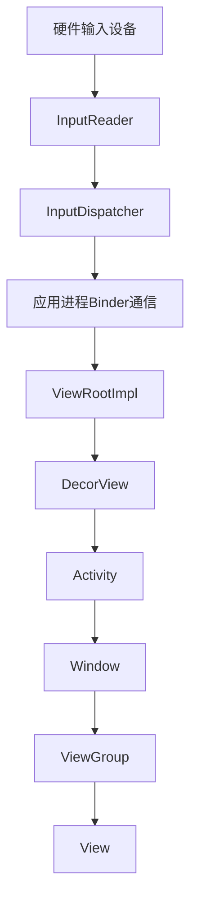
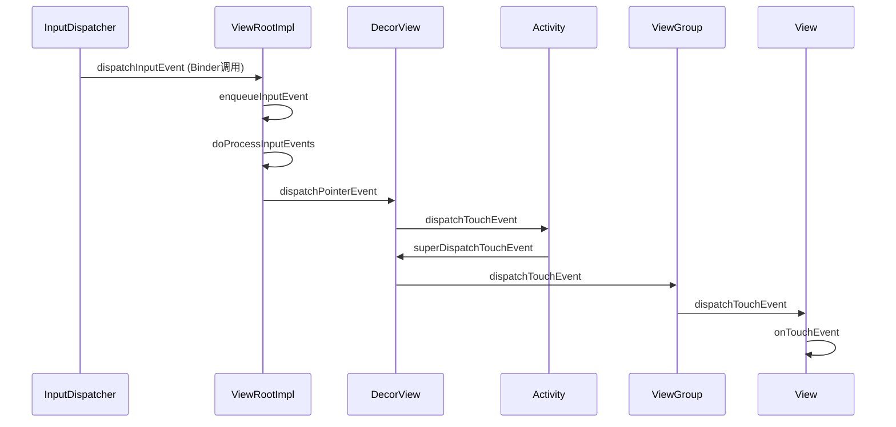
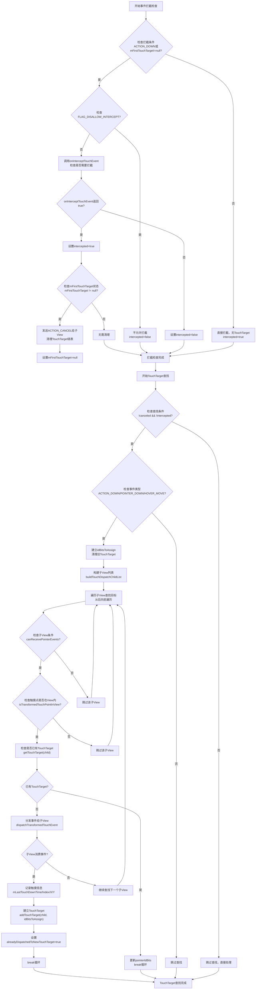
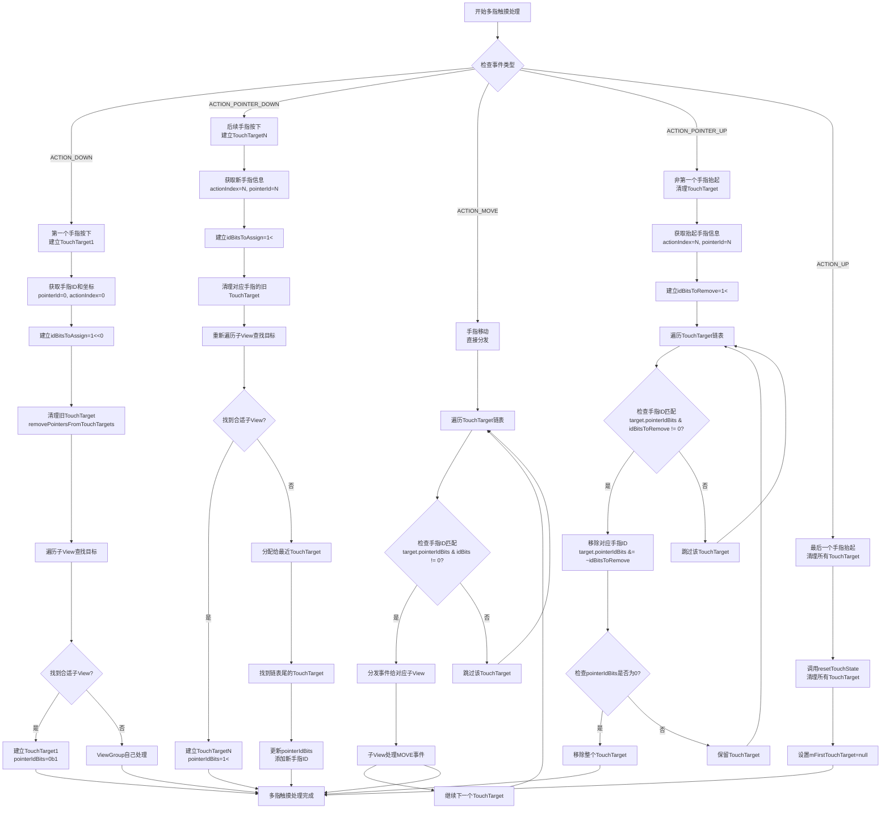
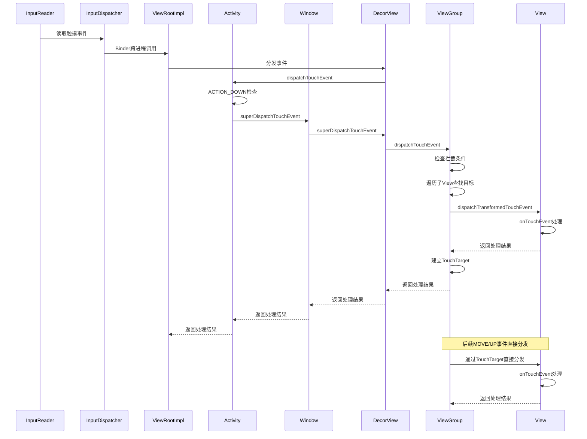
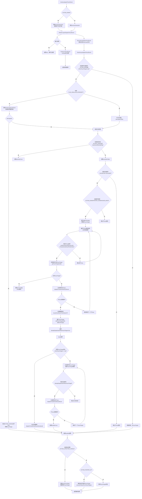
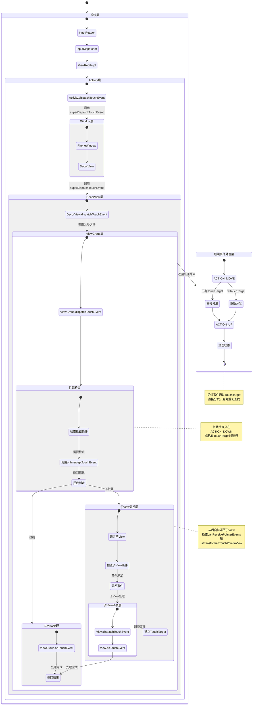
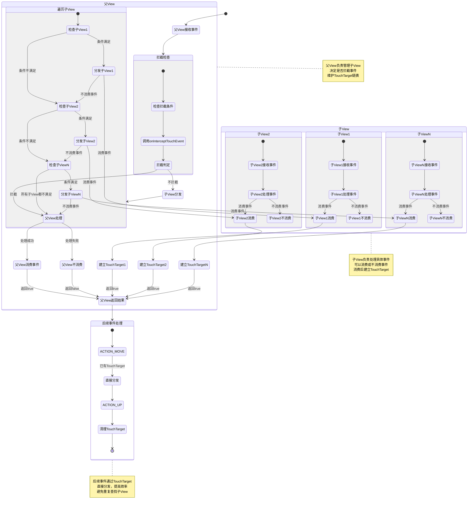

# Android触摸事件分发机制完整分析

## 概述

本文档详细分析Android系统中从Activity的`dispatchTouchEvent`方法开始的触摸事件分发流程。通过源码分析和流程图展示，揭示触摸事件从系统层到应用层的完整传递路径。

## 1. 触摸事件分发整体架构

### 1.1 事件分发层级结构

Android触摸事件分发采用分层架构，从底层硬件到上层应用，包含以下关键层级：



### 1.2 核心组件角色

| 组件 | 角色描述 | 关键方法 |
|------|----------|----------|
| InputDispatcher | 系统级事件分发器 | dispatchMotionEvent |
| ViewRootImpl | 应用窗口根节点 | dispatchInputEvent |
| Activity | 应用入口点 | dispatchTouchEvent |
| Window | 窗口管理器 | superDispatchTouchEvent |
| DecorView | 窗口装饰视图 | dispatchTouchEvent |
| ViewGroup | 视图容器 | dispatchTouchEvent |
| View | 具体视图 | dispatchTouchEvent |

## 2. 详细的事件处理流程：DOWN、MOVE、UP分析

### 2.1 ACTION_DOWN事件处理流程

ACTION_DOWN是触摸事件的起点，决定了后续事件序列的分发目标。

#### 2.1.1 Activity层处理

[源码证据：frameworks/base/core/java/android/app/Activity.java#L4661-4670]

```java
public boolean dispatchTouchEvent(MotionEvent ev) {
    if (ev.getAction() == MotionEvent.ACTION_DOWN) {
        onUserInteraction();  // 通知用户交互开始
    }
    if (getWindow().superDispatchTouchEvent(ev)) {
        return true;  // 窗口处理了事件
    }
    return onTouchEvent(ev);  // Activity自己处理
}
```

**ACTION_DOWN关键作用：**
1. **确定事件序列起点**：每个触摸序列都以ACTION_DOWN开始
2. **建立TouchTarget**：ViewGroup会记录消费事件的子View
3. **重置状态**：清除前一个触摸序列的状态

#### 2.1.2 ViewGroup的TouchTarget建立

[源码证据：frameworks/base/core/java/android/view/ViewGroup.java#L2710-2750]

```java
// 在ACTION_DOWN时建立TouchTarget
if (dispatchTransformedTouchEvent(ev, false, child, idBitsToAssign)) {
    // 子View消费了事件，建立TouchTarget
    newTouchTarget = addTouchTarget(child, idBitsToAssign);
    alreadyDispatchedToNewTouchTarget = true;
    break;
}
```

### 2.2 ACTION_MOVE事件处理流程

ACTION_MOVE事件遵循"U型图"分发原则，直接分发给已建立的TouchTarget。

#### 2.2.1 U型图原理详解

**U型图分发机制：**
```
ACTION_DOWN: Activity → Window → DecorView → ViewGroup → View (建立TouchTarget)
ACTION_MOVE: View ← ViewGroup ← (直接分发，跳过上层)
ACTION_UP:   View ← ViewGroup ← (直接分发，跳过上层)
```

**源码实现：**
```java
// ViewGroup.dispatchTouchEvent中对ACTION_MOVE的处理
if (mFirstTouchTarget == null) {
    // 没有TouchTarget，自己处理
    handled = dispatchTransformedTouchEvent(ev, canceled, null, TouchTarget.ALL_POINTER_IDS);
} else {
    // 有TouchTarget，直接分发
    TouchTarget target = mFirstTouchTarget;
    while (target != null) {
        if (dispatchTransformedTouchEvent(ev, cancelChild, target.child, target.pointerIdBits)) {
            handled = true;
        }
        target = next;
    }
}
```

#### 2.2.2 事件拦截机制

ViewGroup可以在ACTION_MOVE时通过`onInterceptTouchEvent`拦截事件：

```java
// 检查是否需要拦截
if (actionMasked == MotionEvent.ACTION_DOWN || mFirstTouchTarget != null) {
    final boolean disallowIntercept = (mGroupFlags & FLAG_DISALLOW_INTERCEPT) != 0;
    if (!disallowIntercept) {
        intercepted = onInterceptTouchEvent(ev);
    }
}
```

### 2.3 ACTION_UP事件处理流程

ACTION_UP是触摸序列的结束，触发点击事件和清理状态。

#### 2.3.1 onClick触发机制

[源码证据：frameworks/base/core/java/android/view/View.java#L14820-14840]

```java
case MotionEvent.ACTION_UP:
    if ((mPrivateFlags & PFLAG_PRESSED) != 0) {
        // 触发点击事件
        performClick();
    }
    setPressed(false);
    break;

// performClick方法实现
public boolean performClick() {
    final boolean result;
    final ListenerInfo li = mListenerInfo;
    if (li != null && li.mOnClickListener != null) {
        playSoundEffect(SoundEffectConstants.CLICK);
        li.mOnClickListener.onClick(this);  // 调用onClick回调
        result = true;
    } else {
        result = false;
    }
    return result;
}
```

**onClick触发条件：**
1. **按下状态**：View必须处于按下状态（PFLAG_PRESSED）
2. **在View边界内抬起**：手指在View边界内抬起
3. **未发生长按**：未触发onLongClick

#### 2.3.2 onLongClick触发机制

[源码证据：frameworks/base/core/java/android/view/View.java#L8281-8291]

```java
// checkForLongClick方法
private void checkForLongClick(int delay, float x, float y) {
    if ((mViewFlags & LONG_CLICKABLE) == LONG_CLICKABLE) {
        mHasPerformedLongPress = false;
        
        if (mPendingCheckForLongPress == null) {
            mPendingCheckForLongPress = new CheckForLongPress();
        }
        mPendingCheckForLongPress.setAnchor(x, y);
        postDelayed(mPendingCheckForLongPress, delay);
    }
}

// CheckForLongPress.run方法
public void run() {
    if (isPressed() && (mParent != null)) {
        if (performLongClick(mX, mY)) {
            mHasPerformedLongPress = true;
        }
    }
}

// performLongClick方法
public boolean performLongClick(float x, float y) {
    boolean handled = false;
    final OnLongClickListener listener = mListenerInfo == null ? null : mListenerInfo.mOnLongClickListener;
    if (listener != null) {
        handled = listener.onLongClick(View.this);  // 调用onLongClick回调
    }
    return handled;
}
```

**onLongClick触发条件：**
1. **长按时长**：默认500ms（ViewConfiguration.getLongPressTimeout()）
2. **按下状态保持**：手指持续按下未移动出边界
3. **可长按标志**：View必须设置LONG_CLICKABLE标志

### 2.4 状态清理和重置

在ACTION_UP或ACTION_CANCEL时，系统会清理触摸状态：

```java
case MotionEvent.ACTION_UP:
case MotionEvent.ACTION_CANCEL:
    // 清理触摸状态
    mPrivateFlags3 &= ~PFLAG3_FINGER_DOWN;
    setPressed(false);
    removeTapCallback();      // 移除点击回调
    removeLongPressCallback(); // 移除长按回调
    mHasPerformedLongPress = false;
    break;
```

### 2.2 Window.superDispatchTouchEvent方法

Window是一个抽象类，具体实现由PhoneWindow提供：

[源码证据：frameworks/base/core/java/android/view/Window.java#L2124]

```java
public abstract boolean superDispatchTouchEvent(MotionEvent event);
```

### 2.3 PhoneWindow.superDispatchTouchEvent实现

[源码证据：frameworks/base/core/java/com/android/internal/policy/PhoneWindow.java#L1512-1516]

```java
@Override
public boolean superDispatchTouchEvent(MotionEvent event) {
    return mDecor.superDispatchTouchEvent(event);
}
```

PhoneWindow将事件委托给DecorView处理。

### 2.4 DecorView.superDispatchTouchEvent方法

DecorView是窗口的根视图，继承自FrameLayout：

[源码证据：frameworks/base/core/java/com/android/internal/policy/DecorView.java#L1284-1288]

```java
public boolean superDispatchTouchEvent(MotionEvent event) {
    return super.dispatchTouchEvent(event);
}
```

DecorView调用父类的`dispatchTouchEvent`方法，即ViewGroup的dispatchTouchEvent。

## 3. 多指触摸处理机制

### 3.1 多指触摸事件类型

Android支持多指触摸，通过以下事件类型处理：

| 事件类型 | 描述 | 触发条件 |
|---------|------|----------|
| ACTION_DOWN | 第一个手指按下 | 触摸序列开始 |
| ACTION_POINTER_DOWN | 后续手指按下 | 第二个及以后的手指按下 |
| ACTION_MOVE | 手指移动 | 任何手指移动 |
| ACTION_POINTER_UP | 非第一个手指抬起 | 第二个及以后的手指抬起 |
| ACTION_UP | 最后一个手指抬起 | 触摸序列结束 |

### 3.2 多指触摸事件分发原理

#### 3.2.1 事件索引和ID管理

[源码证据：frameworks/base/core/java/android/view/MotionEvent.java#L1200-1250]

```java
// 获取手指数量
int pointerCount = event.getPointerCount();

// 获取事件索引和手指ID
int actionIndex = event.getActionIndex();
int pointerId = event.getPointerId(actionIndex);

// 获取特定手指的坐标
float x = event.getX(actionIndex);
float y = event.getY(actionIndex);
```

#### 3.2.2 ViewGroup的多指触摸处理

ViewGroup通过TouchTarget链表管理多个手指的触摸目标：

```java
// ViewGroup中的TouchTarget链表结构
private static final class TouchTarget {
    public View child;
    public int pointerIdBits;
    public TouchTarget next;
    
    // 添加手指ID到bits中
    public static TouchTarget obtain(View child, int pointerIdBits) {
        TouchTarget target = new TouchTarget();
        target.child = child;
        target.pointerIdBits = pointerIdBits;
        return target;
    }
}
```

### 3.3 多指触摸的分发流程

#### 3.3.1 ACTION_POINTER_DOWN处理

当第二个手指按下时，系统会重新分发事件：

```java
case MotionEvent.ACTION_POINTER_DOWN: {
    // 获取新手指的索引和ID
    final int actionIndex = ev.getActionIndex();
    final int idBitsToAssign = 1 << ev.getPointerId(actionIndex);
    
    // 重新分发事件，寻找新的触摸目标
    final int childrenCount = mChildrenCount;
    if (childrenCount != 0) {
        final float x = ev.getX(actionIndex);
        final float y = ev.getY(actionIndex);
        
        // 查找能够接收新手指事件的子View
        final ArrayList<View> preorderedList = buildOrderedChildList();
        final boolean customOrder = preorderedList == null && isChildrenDrawingOrderEnabled();
        final View[] children = mChildren;
        
        for (int i = childrenCount - 1; i >= 0; i--) {
            final int childIndex = getAndVerifyPreorderedIndex(childrenCount, i, customOrder);
            final View child = getAndVerifyPreorderedView(preorderedList, children, childIndex);
            
            if (!canViewReceivePointerEvents(child) || 
                !isTransformedTouchPointInView(x, y, child, null)) {
                continue;
            }
            
            // 分发事件给子View
            if (dispatchTransformedTouchEvent(ev, false, child, idBitsToAssign)) {
                // 子View消费了事件，添加到TouchTarget链表
                newTouchTarget = addTouchTarget(child, idBitsToAssign);
                alreadyDispatchedToNewTouchTarget = true;
                break;
            }
        }
    }
    break;
}
```

#### 3.3.2 多指触摸的U型图分发

多指触摸同样遵循U型图原则，但每个手指可能有不同的TouchTarget：

```
手指1: ACTION_DOWN → ViewA (建立TouchTarget1)
手指2: ACTION_POINTER_DOWN → ViewB (建立TouchTarget2)
手指1移动: ACTION_MOVE → ViewA (直接分发)
手指2移动: ACTION_MOVE → ViewB (直接分发)
手指1抬起: ACTION_POINTER_UP → ViewA (清理TouchTarget1)
手指2抬起: ACTION_UP → ViewB (清理TouchTarget2)
```

## 4. ViewGroup的事件分发机制

### 4.1 ViewGroup.dispatchTouchEvent核心逻辑

[源码证据：frameworks/base/core/java/android/view/ViewGroup.java#L2670-2750]

```java
@Override
public boolean dispatchTouchEvent(MotionEvent ev) {
    // 1. 检查是否需要拦截事件
    final boolean intercepted;
    if (actionMasked == MotionEvent.ACTION_DOWN || mFirstTouchTarget != null) {
        final boolean disallowIntercept = (mGroupFlags & FLAG_DISALLOW_INTERCEPT) != 0;
        if (!disallowIntercept) {
            intercepted = onInterceptTouchEvent(ev);
            ev.setAction(action); // restore action in case it was changed
        } else {
            intercepted = false;
        }
    } else {
        intercepted = true;
    }
    
    // 2. 分发事件给子View
    if (!canceled && !intercepted) {
        // 查找能够接收事件的子View
        final View[] children = mChildren;
        for (int i = childrenCount - 1; i >= 0; i--) {
            final int childIndex = getAndVerifyPreorderedIndex(childrenCount, i, customOrder);
            final View child = getAndVerifyPreorderedView(preorderedList, children, childIndex);
            
            if (!canViewReceivePointerEvents(child) || !isTransformedTouchPointInView(x, y, child, null)) {
                continue;
            }
            
            newTouchTarget = getTouchTarget(child);
            if (newTouchTarget != null) {
                newTouchTarget.pointerIdBits |= idBitsToAssign;
                break;
            }
            
            resetCancelNextUpFlag(child);
            if (dispatchTransformedTouchEvent(ev, false, child, idBitsToAssign)) {
                // 子View消费了事件
                mLastTouchDownTime = ev.getDownTime();
                if (preorderedList != null) {
                    for (int j = 0; j < childrenCount; j++) {
                        if (children[childIndex] == mChildren[j]) {
                            mLastTouchDownIndex = j;
                            break;
                        }
                    }
                } else {
                    mLastTouchDownIndex = childIndex;
                }
                mLastTouchDownX = ev.getX();
                mLastTouchDownY = ev.getY();
                newTouchTarget = addTouchTarget(child, idBitsToAssign);
                alreadyDispatchedToNewTouchTarget = true;
                break;
            }
        }
    }
    
    // 3. 如果没有子View消费事件，自己处理
    if (mFirstTouchTarget == null) {
        handled = dispatchTransformedTouchEvent(ev, canceled, null, TouchTarget.ALL_POINTER_IDS);
    } else {
        // 分发事件给已找到的TouchTarget
        TouchTarget target = mFirstTouchTarget;
        while (target != null) {
            final TouchTarget next = target.next;
            if (alreadyDispatchedToNewTouchTarget && target == newTouchTarget) {
                handled = true;
            } else {
                final boolean cancelChild = resetCancelNextUpFlag(target.child) || intercepted;
                if (dispatchTransformedTouchEvent(ev, cancelChild, target.child, target.pointerIdBits)) {
                    handled = true;
                }
            }
            target = next;
        }
    }
    
    return handled;
}
```

### 3.2 事件拦截机制：onInterceptTouchEvent

ViewGroup通过`onInterceptTouchEvent`方法决定是否拦截事件：

```java
public boolean onInterceptTouchEvent(MotionEvent ev) {
    if (ev.isFromSource(InputDevice.SOURCE_MOUSE) && ev.getAction() == MotionEvent.ACTION_DOWN) {
        // 处理鼠标事件
    }
    return false; // 默认不拦截
}
```

### 3.3 事件分发：dispatchTransformedTouchEvent

该方法负责将事件转换并分发给子View：

```java
private boolean dispatchTransformedTouchEvent(MotionEvent event, boolean cancel,
        View child, int desiredPointerIdBits) {
    final boolean handled;
    
    // 如果需要取消事件
    final int oldAction = event.getAction();
    if (cancel || oldAction == MotionEvent.ACTION_CANCEL) {
        event.setAction(MotionEvent.ACTION_CANCEL);
        if (child == null) {
            handled = super.dispatchTouchEvent(event);
        } else {
            handled = child.dispatchTouchEvent(event);
        }
        event.setAction(oldAction);
        return handled;
    }
    
    // 转换坐标系统
    final float offsetX = mScrollX - child.mLeft;
    final float offsetY = mScrollY - child.mTop;
    event.offsetLocation(offsetX, offsetY);
    
    // 分发事件
    if (child == null) {
        handled = super.dispatchTouchEvent(event);
    } else {
        handled = child.dispatchTouchEvent(event);
    }
    
    // 恢复坐标系统
    event.offsetLocation(-offsetX, -offsetY);
    return handled;
}
```

## 4. View的事件处理机制

### 4.1 View.dispatchTouchEvent方法

[源码证据：frameworks/base/core/java/android/view/View.java#L14320-14380]

```java
public boolean dispatchTouchEvent(MotionEvent event) {
    // 如果View不可用，直接返回
    if (!isEnabled()) {
        return isClickable() || isLongClickable() ? true : false;
    }
    
    // 处理辅助功能
    if (mTouchDelegate != null) {
        if (mTouchDelegate.onTouchEvent(event)) {
            return true;
        }
    }
    
    // 调用onTouchEvent处理事件
    if (onTouchEvent(event)) {
        return true;
    }
    
    return false;
}
```

### 4.2 View.onTouchEvent方法

[源码证据：frameworks/base/core/java/android/view/View.java#L14750-14920]

```java
public boolean onTouchEvent(MotionEvent event) {
    final float x = event.getX();
    final float y = event.getY();
    final int action = event.getAction();
    final boolean clickable = (mViewFlags & CLICKABLE) == CLICKABLE || (mViewFlags & LONG_CLICKABLE) == LONG_CLICKABLE;
    
    if (!clickable) {
        return false;
    }
    
    switch (action) {
        case MotionEvent.ACTION_DOWN:
            mPrivateFlags3 |= PFLAG3_FINGER_DOWN;
            // 设置按下状态
            setPressed(true);
            // 检查长按
            checkForLongClick(0, x, y);
            break;
            
        case MotionEvent.ACTION_MOVE:
            // 检查是否移出View边界
            if (!pointInView(x, y, mTouchSlop)) {
                removeTapCallback();
                removeLongPressCallback();
                if ((mPrivateFlags & PFLAG_PRESSED) != 0) {
                    setPressed(false);
                }
            }
            break;
            
        case MotionEvent.ACTION_UP:
            mPrivateFlags3 &= ~PFLAG3_FINGER_DOWN;
            if ((mPrivateFlags & PFLAG_PRESSED) != 0) {
                // 处理点击事件
                performClick();
            }
            setPressed(false);
            break;
            
        case MotionEvent.ACTION_CANCEL:
            setPressed(false);
            removeTapCallback();
            removeLongPressCallback();
            break;
    }
    
    return true;
}
```

## 5. 系统层到应用层的事件传递流程

### 5.1 InputDispatcher到ViewRootImpl

触摸事件首先由InputDispatcher通过Binder跨进程传递到应用进程：



### 5.2 详细的事件拦截和TouchTarget查找流程图



### 5.3 多指触摸的详细分发流程图



### 5.4 时序图：从系统层到应用层的完整调用链



### 5.5 ViewRootImpl.dispatchInputEvent方法

[源码证据：frameworks/base/core/java/android/view/ViewRootImpl.java#L7890-7920]

```java
void dispatchInputEvent(InputEvent event) {
    // 将事件加入队列
    enqueueInputEvent(event);
}

void enqueueInputEvent(InputEvent event) {
    // 处理输入事件队列
    if (mInputEventReceiver != null) {
        mInputEventReceiver.onInputEvent(event);
    }
}
```

### 5.6 InputEventReceiver.onInputEvent方法

[源码证据：frameworks/base/core/java/android/view/InputEventReceiver.java#L250-280]

```java
public void onInputEvent(InputEvent event) {
    // 处理输入事件
    finishInputEvent(event, false);
}
```

## 6. 详细的事件分发流程图

### 6.1 完整的事件分发流程图



### 6.2 层级化的事件分发状态机



### 6.3 父View与子View交互状态机



## 7. 关键源码证据链

### 7.1 Activity层证据链

```java
// Activity.dispatchTouchEvent
[源码证据：frameworks/base/core/java/android/app/Activity.java#L4661-4670]
public boolean dispatchTouchEvent(MotionEvent ev) {
    if (ev.getAction() == MotionEvent.ACTION_DOWN) {
        onUserInteraction();
    }
    if (getWindow().superDispatchTouchEvent(ev)) {
        return true;
    }
    return onTouchEvent(ev);
}
```

### 7.2 ViewGroup层证据链

```java
// ViewGroup.dispatchTouchEvent - 事件拦截检查
[源码证据：frameworks/base/core/java/android/view/ViewGroup.java#L2675-2685]
final boolean intercepted;
if (actionMasked == MotionEvent.ACTION_DOWN || mFirstTouchTarget != null) {
    final boolean disallowIntercept = (mGroupFlags & FLAG_DISALLOW_INTERCEPT) != 0;
    if (!disallowIntercept) {
        intercepted = onInterceptTouchEvent(ev);
    }
}

// ViewGroup.dispatchTouchEvent - 子View分发
[源码证据：frameworks/base/core/java/android/view/ViewGroup.java#L2710-2750]
for (int i = childrenCount - 1; i >= 0; i--) {
    if (dispatchTransformedTouchEvent(ev, false, child, idBitsToAssign)) {
        // 子View消费了事件
        newTouchTarget = addTouchTarget(child, idBitsToAssign);
        break;
    }
}
```

### 7.3 View层证据链

```java
// View.dispatchTouchEvent
[源码证据：frameworks/base/core/java/android/view/View.java#L14320-14340]
public boolean dispatchTouchEvent(MotionEvent event) {
    if (onTouchEvent(event)) {
        return true;
    }
    return false;
}

// View.onTouchEvent - 点击处理
[源码证据：frameworks/base/core/java/android/view/View.java#L14820-14840]
case MotionEvent.ACTION_UP:
    if ((mPrivateFlags & PFLAG_PRESSED) != 0) {
        performClick();
    }
    break;
```

## 8. 性能优化与异常处理

### 8.1 事件分发性能优化

1. **触摸目标缓存**：ViewGroup会缓存找到的TouchTarget，避免重复查找
2. **坐标转换优化**：使用矩阵变换而非逐点计算
3. **事件批量处理**：InputDispatcher支持事件批量分发

### 8.2 异常处理机制

1. **事件取消**：当父View拦截事件时，会向子View发送ACTION_CANCEL
2. **触摸代理**：通过TouchDelegate处理触摸区域扩展
3. **辅助功能**：支持无障碍服务的触摸事件处理

## 9. U型图原理深度分析

### 9.1 U型图的核心思想

U型图是Android触摸事件分发机制的核心设计模式，其名称来源于事件分发的路径形状：

```
     Activity
       ↓
      Window  
       ↓
    DecorView
       ↓
    ViewGroup ← 后续事件直接分发
       ↓
       View
```

**U型图工作流程：**
1. **下行阶段（DOWN事件）**：事件从Activity逐级向下传递，寻找消费目标
2. **建立连接（TouchTarget）**：在View层级找到消费事件的View，建立TouchTarget
3. **上行阶段（MOVE/UP事件）**：后续事件直接通过TouchTarget分发给目标View，跳过上层

### 9.2 U型图的性能优势

#### 9.2.1 减少重复查找
一旦建立TouchTarget，后续事件无需重新遍历View层级：

```java
// 传统分发（无U型图优化）
ACTION_DOWN: Activity → Window → DecorView → ViewGroup → View
ACTION_MOVE: Activity → Window → DecorView → ViewGroup → View  // 重复查找
ACTION_UP:   Activity → Window → DecorView → ViewGroup → View  // 重复查找

// U型图优化分发
ACTION_DOWN: Activity → Window → DecorView → ViewGroup → View (建立TouchTarget)
ACTION_MOVE: ViewGroup → View (直接分发)
ACTION_UP:   ViewGroup → View (直接分发)
```

#### 9.2.2 TouchTarget链表管理
ViewGroup通过TouchTarget链表管理多个触摸目标：

```java
// TouchTarget链表结构
private TouchTarget mFirstTouchTarget;  // 链表头

// 添加TouchTarget
private TouchTarget addTouchTarget(View child, int pointerIdBits) {
    TouchTarget target = TouchTarget.obtain(child, pointerIdBits);
    target.next = mFirstTouchTarget;
    mFirstTouchTarget = target;
    return target;
}

// 查找特定手指的TouchTarget
private TouchTarget getTouchTarget(int pointerId) {
    int idBits = 1 << pointerId;
    TouchTarget target = mFirstTouchTarget;
    while (target != null) {
        if ((target.pointerIdBits & idBits) != 0) {
            return target;
        }
        target = target.next;
    }
    return null;
}
```

### 9.3 U型图在多指触摸中的应用

多指触摸场景下，U型图机制更加复杂但同样有效：

```
手指1: ACTION_DOWN → ViewA (建立TouchTarget1)
手指2: ACTION_POINTER_DOWN → ViewB (建立TouchTarget2)
手指1移动: ACTION_MOVE → ViewA (通过TouchTarget1直接分发)
手指2移动: ACTION_MOVE → ViewB (通过TouchTarget2直接分发)
手指1抬起: ACTION_POINTER_UP → ViewA (清理TouchTarget1)
手指2抬起: ACTION_UP → ViewB (清理TouchTarget2，结束序列)
```

### 9.4 U型图的异常处理

#### 9.4.1 事件拦截
当父View决定拦截事件时，会向子View发送ACTION_CANCEL：

```java
// 父View拦截事件
if (intercepted) {
    // 向子View发送取消事件
    if (mFirstTouchTarget != null) {
        MotionEvent cancelEvent = MotionEvent.obtain(ev);
        cancelEvent.setAction(MotionEvent.ACTION_CANCEL);
        
        TouchTarget target = mFirstTouchTarget;
        while (target != null) {
            dispatchTransformedTouchEvent(cancelEvent, true, target.child, target.pointerIdBits);
            target = target.next;
        }
        cancelEvent.recycle();
    }
    
    // 清理TouchTarget
    mFirstTouchTarget = null;
}
```

#### 9.4.2 边界检查
当手指移出View边界时，会取消触摸状态：

```java
// 检查是否移出边界
if (!pointInView(x, y, mTouchSlop)) {
    removeTapCallback();
    removeLongPressCallback();
    if ((mPrivateFlags & PFLAG_PRESSED) != 0) {
        setPressed(false);
    }
}
```

## 10. 详细流程图的关键判定条件总结

### 10.1 事件拦截的关键判定条件

#### 10.1.1 拦截检查条件
```java
// 拦截检查触发条件
if (actionMasked == MotionEvent.ACTION_DOWN || mFirstTouchTarget != null) {
    // 只有DOWN事件或已有TouchTarget时才检查拦截
}
```

#### 10.1.2 禁止拦截标志
```java
// FLAG_DISALLOW_INTERCEPT检查
final boolean disallowIntercept = (mGroupFlags & FLAG_DISALLOW_INTERCEPT) != 0;
if (!disallowIntercept) {
    intercepted = onInterceptTouchEvent(ev);
} else {
    intercepted = false;
}
```

### 10.2 TouchTarget查找的关键判定条件

#### 10.2.1 查找触发条件
```java
// TouchTarget查找触发条件
if (!canceled && !intercepted) {
    // 事件未被取消且未被拦截时才查找
    if (actionMasked == MotionEvent.ACTION_DOWN || 
        (split && actionMasked == MotionEvent.ACTION_POINTER_DOWN) ||
        actionMasked == MotionEvent.ACTION_HOVER_MOVE) {
        // 只有DOWN/POINTER_DOWN/HOVER_MOVE事件才查找新目标
    }
}
```

#### 10.2.2 子View接收条件
```java
// 子View接收事件的条件检查
if (!child.canReceivePointerEvents() || 
    !isTransformedTouchPointInView(x, y, child, null)) {
    // 跳过不能接收事件或触摸点不在View内的子View
    continue;
}
```

### 10.3 多指触摸的关键判定条件

#### 10.3.1 手指ID管理
```java
// 手指ID位图管理
final int idBitsToAssign = split ? 1 << ev.getPointerId(actionIndex) 
                                : TouchTarget.ALL_POINTER_IDS;
```

#### 10.3.2 TouchTarget链表遍历
```java
// TouchTarget链表遍历和匹配
TouchTarget target = mFirstTouchTarget;
while (target != null) {
    if ((target.pointerIdBits & idBits) != 0) {
        // 找到匹配的TouchTarget
        break;
    }
    target = target.next;
}
```

### 10.4 状态清理的关键判定条件

#### 10.4.1 触摸序列结束
```java
// 触摸序列结束条件
if (canceled || actionMasked == MotionEvent.ACTION_UP || 
    actionMasked == MotionEvent.ACTION_HOVER_MOVE) {
    resetTouchState();  // 清理所有TouchTarget
}
```

#### 10.4.2 部分手指抬起
```java
// 部分手指抬起处理
else if (split && actionMasked == MotionEvent.ACTION_POINTER_UP) {
    final int idBitsToRemove = 1 << ev.getPointerId(actionIndex);
    removePointersFromTouchTargets(idBitsToRemove);  // 只移除对应手指
}
```

## 11. 总结与最佳实践

### 11.1 触摸事件分发机制的核心特点

1. **责任链模式**：事件从底层到上层逐级传递，每个层级都有机会处理
2. **U型图优化**：通过TouchTarget缓存避免重复查找，提高性能
3. **拦截机制**：ViewGroup可以通过onInterceptTouchEvent拦截事件
4. **多指支持**：通过TouchTarget链表管理多个手指的触摸目标
5. **状态管理**：完整的状态机确保事件序列的正确性

### 10.2 onClick和onLongClick触发时机

| 事件类型 | 触发条件 | 触发时机 |
|---------|----------|----------|
| onClick | 1. View处于按下状态<br>2. 在View边界内抬起<br>3. 未触发长按 | ACTION_UP时触发 |
| onLongClick | 1. 长按时长达到阈值（默认500ms）<br>2. 手指持续按下未移出边界<br>3. View设置LONG_CLICKABLE标志 | 延迟任务触发 |

### 10.3 性能优化建议

1. **避免深度嵌套**：减少View层级深度，提高事件分发效率
2. **合理使用拦截**：在需要时使用onInterceptTouchEvent，避免不必要的分发
3. **优化触摸区域**：合理设置View的触摸区域，减少不必要的边界检查
4. **处理多指场景**：确保应用正确处理多指触摸，避免冲突

### 10.4 常见问题排查

1. **事件不响应**：检查View的clickable、enabled属性
2. **长按不触发**：确认View设置了longClickable属性
3. **多指冲突**：检查TouchTarget管理是否正确
4. **性能问题**：分析View层级深度和事件分发路径

Android触摸事件分发机制是一个精心设计的系统，既保证了用户交互的灵活性，又提供了良好的性能表现。理解U型图原理和多指触摸处理机制，对于开发高质量的Android应用至关重要。