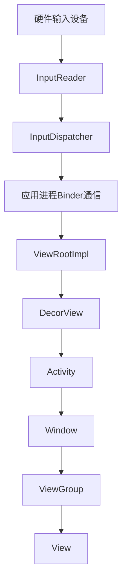

# Android触摸事件分发机制完整分析

[toc]

## 概述

本文档详细分析Android系统中从Activity的`dispatchTouchEvent`方法开始的触摸事件分发流程。通过源码分析和流程图展示，揭示触摸事件从系统层到应用层的完整传递路径。

## 1. 触摸事件分发整体架构

### 1.1 事件分发层级结构

Android触摸事件分发采用分层架构，从底层硬件到上层应用，包含以下关键层级：



### 1.2 核心组件角色

| 组件 | 角色描述 | 关键方法 |
|------|----------|----------|
| InputDispatcher | 系统级事件分发器 | dispatchMotionEvent |
| ViewRootImpl | 应用窗口根节点 | dispatchInputEvent |
| Activity | 应用入口点 | dispatchTouchEvent |
| Window | 窗口管理器 | superDispatchTouchEvent |
| DecorView | 窗口装饰视图 | dispatchTouchEvent |
| ViewGroup | 视图容器 | dispatchTouchEvent |
| View | 具体视图 | dispatchTouchEvent |

## 2. 详细的事件处理流程：DOWN、MOVE、UP分析

### 2.1 ACTION_DOWN事件处理流程

ACTION_DOWN是触摸事件的起点，决定了后续事件序列的分发目标。

#### 2.1.1 Activity层处理

[源码证据：frameworks/base/core/java/android/app/Activity.java#L4661-4669]

```java
public boolean dispatchTouchEvent(MotionEvent ev) {
    if (ev.getAction() == MotionEvent.ACTION_DOWN) {
        onUserInteraction();  // 通知用户交互开始
    }
    if (getWindow().superDispatchTouchEvent(ev)) {
        return true;  // 窗口处理了事件
    }
    return onTouchEvent(ev);  // Activity自己处理
}
```

**ACTION_DOWN关键作用：**
1. **确定事件序列起点**：每个触摸序列都以ACTION_DOWN开始
2. **建立TouchTarget**：ViewGroup会记录消费事件的子View
3. **重置状态**：清除前一个触摸序列的状态

#### 2.1.2 ViewGroup的TouchTarget建立

[源码证据：frameworks/base/core/java/android/view/ViewGroup.java#L2768-2785]

```java
// 在ACTION_DOWN时建立TouchTarget
if (dispatchTransformedTouchEvent(ev, false, child, idBitsToAssign)) {
    // Child wants to receive touch within its bounds.
    mLastTouchDownTime = ev.getDownTime();
    if (preorderedList != null) {
        // childIndex points into presorted list, find original index
        for (int j = 0; j < childrenCount; j++) {
            if (children[childIndex] == mChildren[j]) {
                mLastTouchDownIndex = j;
                break;
            }
        }
    } else {
        mLastTouchDownIndex = childIndex;
    }
    mLastTouchDownX = x;
    mLastTouchDownY = y;
    newTouchTarget = addTouchTarget(child, idBitsToAssign);
    alreadyDispatchedToNewTouchTarget = true;
    break;
}
```

### 2.2 ACTION_MOVE事件处理流程

ACTION_MOVE事件遵循"U型图"分发原则，直接分发给已建立的TouchTarget。

#### 2.2.1 U型图原理详解

**U型图分发机制：**
```
ACTION_DOWN: Activity → Window → DecorView → ViewGroup → View (建立TouchTarget)
ACTION_MOVE: View ← ViewGroup ← (直接分发，跳过上层)
ACTION_UP:   View ← ViewGroup ← (直接分发，跳过上层)
```

**源码实现：**
[源码证据：frameworks/base/core/java/android/view/ViewGroup.java#L2809-2841]

```java
// ViewGroup.dispatchTouchEvent中对ACTION_MOVE的处理
if (mFirstTouchTarget == null) {
    // No touch targets so treat this as an ordinary view.
    handled = dispatchTransformedTouchEvent(ev, canceled, null,
            TouchTarget.ALL_POINTER_IDS);
} else {
    // Dispatch to touch targets, excluding the new touch target if we already
    // dispatched to it.  Cancel touch targets if necessary.
    TouchTarget predecessor = null;
    TouchTarget target = mFirstTouchTarget;
    while (target != null) {
        final TouchTarget next = target.next;
        if (alreadyDispatchedToNewTouchTarget && target == newTouchTarget) {
            handled = true;
        } else {
            final boolean cancelChild =
                    (target.child != null && resetCancelNextUpFlag(target.child))
                            || intercepted;
            if (target.child != null && dispatchTransformedTouchEvent(ev, cancelChild,
                    target.child, target.pointerIdBits)) {
                handled = true;
            }
            // ...
        }
        predecessor = target;
        target = next;
    }
}
```

#### 2.2.2 事件拦截机制

ViewGroup可以在ACTION_MOVE时通过`onInterceptTouchEvent`拦截事件：

[源码证据：frameworks/base/core/java/android/view/ViewGroup.java#L2673-2687]

```java
// Check for interception.
final boolean intercepted;
ViewRootImpl viewRootImpl = getViewRootImpl();
if (actionMasked == MotionEvent.ACTION_DOWN || mFirstTouchTarget != null) {
    final boolean disallowIntercept = (mGroupFlags & FLAG_DISALLOW_INTERCEPT) != 0;
    if (!disallowIntercept) {
        // Allow back to intercept touch
        intercepted = onInterceptTouchEvent(ev);
        ev.setAction(action); // restore action in case it was changed
    } else {
        intercepted = false;
    }
} else {
    // There are no touch targets and this action is not an initial down
    // so this view group continues to intercept touches.
    intercepted = true;
}
```

### 2.3 ACTION_UP事件处理流程

ACTION_UP是触摸序列的结束，触发点击事件和清理状态。

#### 2.3.1 onClick触发机制

[源码证据：frameworks/base/core/java/android/view/View.java#L18303-18355]

```java
case MotionEvent.ACTION_UP:
    mPrivateFlags3 &= ~PFLAG3_FINGER_DOWN;
    if ((viewFlags & TOOLTIP) == TOOLTIP) {
        handleTooltipUp();
    }
    if (!clickable) {
        removeTapCallback();
        removeLongPressCallback();
        mInContextButtonPress = false;
        mHasPerformedLongPress = false;
        mIgnoreNextUpEvent = false;
        break;
    }
    boolean prepressed = (mPrivateFlags & PFLAG_PREPRESSED) != 0;
    if ((mPrivateFlags & PFLAG_PRESSED) != 0 || prepressed) {
        // take focus if we don't have it already and we should in
        // touch mode.
        boolean focusTaken = false;
        if (isFocusable() && isFocusableInTouchMode() && !isFocused()) {
            focusTaken = requestFocus();
        }

        if (prepressed) {
            // The button is being released before we actually
            // showed it as pressed.  Make it show the pressed
            // state now (before scheduling the click) to ensure
            // the user sees it.
            setPressed(true, x, y);
        }

        if (!mHasPerformedLongPress && !mIgnoreNextUpEvent) {
            // This is a tap, so remove the longpress check
            removeLongPressCallback();

            // Only perform take click actions if we were in the pressed state
            if (!focusTaken) {
                // Use a Runnable and post this rather than calling
                // performClick directly. This lets other visual state
                // of the view update before click actions start.
                if (mPerformClick == null) {
                    mPerformClick = new PerformClick();
                }
                if (!post(mPerformClick)) {
                    performClickInternal();
                }
            }
        }
        // ...
    }
    break;
```

**performClick方法实现：**
[源码证据：frameworks/base/core/java/android/view/View.java#L8195-8215]

```java
public boolean performClick() {
    // We still need to call this method to handle the cases where performClick() was called
    // externally, instead of through performClickInternal()
    notifyAutofillManagerOnClick();

    final boolean result;
    final ListenerInfo li = mListenerInfo;
    if (li != null && li.mOnClickListener != null) {
        playSoundEffect(SoundEffectConstants.CLICK);
        li.mOnClickListener.onClick(this);  // 调用onClick回调
        result = true;
    } else {
        result = false;
    }

    sendAccessibilityEvent(AccessibilityEvent.TYPE_VIEW_CLICKED);

    notifyEnterOrExitForAutoFillIfNeeded(true);

    return result;
}
```

**onClick触发条件：**
1. **按下状态**：View必须处于按下状态（PFLAG_PRESSED）
2. **在View边界内抬起**：手指在View边界内抬起
3. **未发生长按**：未触发onLongClick

#### 2.3.2 onLongClick触发机制

[源码证据：frameworks/base/core/java/android/view/View.java#L18358-18398]

```java
case MotionEvent.ACTION_DOWN:
    if (event.getSource() == InputDevice.SOURCE_TOUCHSCREEN) {
        mPrivateFlags3 |= PFLAG3_FINGER_DOWN;
    }
    mHasPerformedLongPress = false;

    if (!clickable) {
        checkForLongClick(
                getLongPressTimeoutMillis(),
                x,
                y,
                TOUCH_GESTURE_CLASSIFIED__CLASSIFICATION__LONG_PRESS);
        break;
    }

    if (performButtonActionOnTouchDown(event)) {
        break;
    }

    // Walk up the hierarchy to determine if we're inside a scrolling container.
    boolean isInScrollingContainer = isInScrollingContainer();

    // For views inside a scrolling container, delay the pressed feedback for
    // a short period in case this is a scroll.
    if (isInScrollingContainer) {
        mPrivateFlags |= PFLAG_PREPRESSED;
        if (mPendingCheckForTap == null) {
            mPendingCheckForTap = new CheckForTap();
        }
        mPendingCheckForTap.x = event.getX();
        mPendingCheckForTap.y = event.getY();
        postDelayed(mPendingCheckForTap, getTapTimeoutMillis());
    } else {
        // Not inside a scrolling container, so show the feedback right away
        setPressed(true, x, y);
        checkForLongClick(
                getLongPressTimeoutMillis(),
                x,
                y,
                TOUCH_GESTURE_CLASSIFIED__CLASSIFICATION__LONG_PRESS);
    }
    break;
```

**onLongClick触发条件：**
1. **长按时长**：默认500ms（ViewConfiguration.getLongPressTimeout()）
2. **按下状态保持**：手指持续按下未移动出边界
3. **可长按标志**：View必须设置LONG_CLICKABLE标志

### 2.4 状态清理和重置

在ACTION_UP或ACTION_CANCEL时，系统会清理触摸状态：

[源码证据：frameworks/base/core/java/android/view/View.java#L18401-18410]

```java
case MotionEvent.ACTION_CANCEL:
    if (clickable) {
        setPressed(false);
    }
    removeTapCallback();
    removeLongPressCallback();
    mInContextButtonPress = false;
    mHasPerformedLongPress = false;
    mIgnoreNextUpEvent = false;
    mPrivateFlags3 &= ~PFLAG3_FINGER_DOWN;
    break;
```

### 2.5 Window.superDispatchTouchEvent方法

Window是一个抽象类，具体实现由PhoneWindow提供：

[源码证据：frameworks/base/core/java/android/view/Window.java]

```java
public abstract boolean superDispatchTouchEvent(MotionEvent event);
```

### 2.6 PhoneWindow.superDispatchTouchEvent实现

[源码证据：frameworks/base/core/java/com/android/internal/policy/PhoneWindow.java#L2016-2017]

```java
@Override
public boolean superDispatchTouchEvent(MotionEvent event) {
    return mDecor.superDispatchTouchEvent(event);
}
```

PhoneWindow将事件委托给DecorView处理。

### 2.7 DecorView.superDispatchTouchEvent方法

DecorView是窗口的根视图，继承自FrameLayout：

[源码证据：frameworks/base/core/java/com/android/internal/policy/DecorView.java#L502-503]

```java
public boolean superDispatchTouchEvent(MotionEvent event) {
    return super.dispatchTouchEvent(event);
}
```

DecorView调用父类的`dispatchTouchEvent`方法，即ViewGroup的dispatchTouchEvent。

## 3. 多指触摸处理机制

### 3.1 多指触摸事件类型

Android支持多指触摸，通过以下事件类型处理：

| 事件类型 | 描述 | 触发条件 |
|---------|------|----------|
| ACTION_DOWN | 第一个手指按下 | 触摸序列开始 |
| ACTION_POINTER_DOWN | 后续手指按下 | 第二个及以后的手指按下 |
| ACTION_MOVE | 手指移动 | 任何手指移动 |
| ACTION_POINTER_UP | 非第一个手指抬起 | 第二个及以后的手指抬起 |
| ACTION_UP | 最后一个手指抬起 | 触摸序列结束 |

### 3.2 多指触摸事件分发原理

#### 3.2.1 事件索引和ID管理

[源码证据：frameworks/base/core/java/android/view/MotionEvent.java]

```java
// 获取手指数量
int pointerCount = event.getPointerCount();

// 获取事件索引和手指ID
int actionIndex = event.getActionIndex();
int pointerId = event.getPointerId(actionIndex);

// 获取特定手指的坐标
float x = event.getX(actionIndex);
float y = event.getY(actionIndex);
```

#### 3.2.2 ViewGroup的多指触摸处理

ViewGroup通过TouchTarget链表管理多个手指的触摸目标：

[源码证据：frameworks/base/core/java/android/view/ViewGroup.java#L2975-2982]

```java
// ViewGroup中的TouchTarget链表结构
private static final class TouchTarget {
    public View child;
    public int pointerIdBits;
    public TouchTarget next;
}

// 添加TouchTarget
private TouchTarget addTouchTarget(@NonNull View child, int pointerIdBits) {
    final TouchTarget target = TouchTarget.obtain(child, pointerIdBits);
    target.next = mFirstTouchTarget;
    mFirstTouchTarget = target;
    return target;
}
```

### 3.3 多指触摸的分发流程

#### 3.3.1 ACTION_POINTER_DOWN处理

当第二个手指按下时，系统会重新分发事件：

[源码证据：frameworks/base/core/java/android/view/ViewGroup.java#L2708-2792]

```java
if (actionMasked == MotionEvent.ACTION_DOWN
        || (split && actionMasked == MotionEvent.ACTION_POINTER_DOWN)
        || actionMasked == MotionEvent.ACTION_HOVER_MOVE) {
    final int actionIndex = ev.getActionIndex(); // always 0 for down
    final int idBitsToAssign = split ? 1 << ev.getPointerId(actionIndex)
            : TouchTarget.ALL_POINTER_IDS;

    // Clean up earlier touch targets for this pointer id in case they
    // have become out of sync.
    removePointersFromTouchTargets(idBitsToAssign);

    final int childrenCount = mChildrenCount;
    if (newTouchTarget == null && childrenCount != 0) {
        final float x = ev.getXDispatchLocation(actionIndex);
        final float y = ev.getYDispatchLocation(actionIndex);
        // Find a child that can receive the event.
        // Scan children from front to back.
        final ArrayList<View> preorderedList = buildTouchDispatchChildList();
        final boolean customOrder = preorderedList == null
                && isChildrenDrawingOrderEnabled();
        final View[] children = mChildren;
        for (int i = childrenCount - 1; i >= 0; i--) {
            final int childIndex = getAndVerifyPreorderedIndex(
                    childrenCount, i, customOrder);
            final View child = getAndVerifyPreorderedView(
                    preorderedList, children, childIndex);
            // ... 遍历子View查找目标
        }
    }
}
```

#### 3.3.2 多指触摸的U型图分发

多指触摸同样遵循U型图原则，但每个手指可能有不同的TouchTarget：

```
手指1: ACTION_DOWN → ViewA (建立TouchTarget1)
手指2: ACTION_POINTER_DOWN → ViewB (建立TouchTarget2)
手指1移动: ACTION_MOVE → ViewA (直接分发)
手指2移动: ACTION_MOVE → ViewB (直接分发)
手指1抬起: ACTION_POINTER_UP → ViewA (清理TouchTarget1)
手指2抬起: ACTION_UP → ViewB (清理TouchTarget2)
```

## 4. 事件分发机制

### 4.1 ViewGroup

#### 4.1.1 ViewGroup.dispatchTouchEvent核心逻辑

[源码证据：frameworks/base/core/java/android/view/ViewGroup.java#L2646-2845]

```java
@Override
public boolean dispatchTouchEvent(MotionEvent ev) {
    if (mInputEventConsistencyVerifier != null) {
        mInputEventConsistencyVerifier.onTouchEvent(ev, 1);
    }

    // If the event targets the accessibility focused view and this is it, start
    // normal event dispatch. Maybe a descendant is what will handle the click.
    if (ev.isTargetAccessibilityFocus() && isAccessibilityFocusedViewOrHost()) {
        ev.setTargetAccessibilityFocus(false);
    }

    boolean handled = false;
    if (onFilterTouchEventForSecurity(ev)) {
        final int action = ev.getAction();
        final int actionMasked = action & MotionEvent.ACTION_MASK;

        // Handle an initial down.
        if (actionMasked == MotionEvent.ACTION_DOWN) {
            // Throw away all previous state when starting a new touch gesture.
            // The framework may have dropped the up or cancel event for the previous gesture
            // due to an app switch, ANR, or some other state change.
            cancelAndClearTouchTargets(ev);
            resetTouchState();
        }

        // Check for interception.
        final boolean intercepted;
        ViewRootImpl viewRootImpl = getViewRootImpl();
        if (actionMasked == MotionEvent.ACTION_DOWN || mFirstTouchTarget != null) {
            final boolean disallowIntercept = (mGroupFlags & FLAG_DISALLOW_INTERCEPT) != 0;
            if (!disallowIntercept) {
                // Allow back to intercept touch
                intercepted = onInterceptTouchEvent(ev);
                ev.setAction(action); // restore action in case it was changed
            } else {
                intercepted = false;
            }
        } else {
            // There are no touch targets and this action is not an initial down
            // so this view group continues to intercept touches.
            intercepted = true;
        }
        // ... 后续分发逻辑
    }
    return handled;
}
```

#### 4.1.2 事件拦截机制：onInterceptTouchEvent

ViewGroup通过`onInterceptTouchEvent`方法决定是否拦截事件：

```java
public boolean onInterceptTouchEvent(MotionEvent ev) {
    if (ev.isFromSource(InputDevice.SOURCE_MOUSE) && ev.getAction() == MotionEvent.ACTION_DOWN) {
        // 处理鼠标事件
    }
    return false; // 默认不拦截
}
```

#### 4.1.3 事件分发：dispatchTransformedTouchEvent

该方法负责将事件转换并分发给子View：

[源码证据：frameworks/base/core/java/android/view/ViewGroup.java#L3105-3184]

```java
private boolean dispatchTransformedTouchEvent(MotionEvent event, boolean cancel,
        View child, int desiredPointerIdBits) {
    final int oldAction = event.getAction();
    try {
        final boolean handled;
        if (cancel) {
            event.setAction(MotionEvent.ACTION_CANCEL);
        }

        // Calculate the number of pointers to deliver.
        final int oldPointerIdBits = event.getPointerIdBits();
        int newPointerIdBits = oldPointerIdBits & desiredPointerIdBits;

        // If for some reason we ended up in an inconsistent state where it looks like we
        // might produce a non-cancel motion event with no pointers in it, then drop the event.
        // Make sure that we don't drop any cancel events.
        if (newPointerIdBits == 0) {
            if (event.getAction() != MotionEvent.ACTION_CANCEL) {
                return false;
            } else {
                newPointerIdBits = oldPointerIdBits;
            }
        }

        // If the number of pointers is the same and we don't need to perform any fancy
        // irreversible transformations, then we can reuse the motion event for this
        // dispatch as long as we are careful to revert any changes we make.
        // Otherwise we need to make a copy.
        final MotionEvent transformedEvent;
        if (newPointerIdBits == oldPointerIdBits) {
            if (child == null || child.hasIdentityMatrix()) {
                if (child == null) {
                    handled = super.dispatchTouchEvent(event);
                } else {
                    final float offsetX = mScrollX - child.mLeft;
                    final float offsetY = mScrollY - child.mTop;
                    event.offsetLocation(offsetX, offsetY);

                    handled = child.dispatchTouchEvent(event);

                    event.offsetLocation(-offsetX, -offsetY);
                }
                return handled;
            }
            transformedEvent = MotionEvent.obtain(event);
        } else {
            transformedEvent = event.split(newPointerIdBits);
        }

        // Perform any necessary transformations and dispatch.
        if (child == null) {
            handled = super.dispatchTouchEvent(transformedEvent);
        } else {
            final float offsetX = mScrollX - child.mLeft;
            final float offsetY = mScrollY - child.mTop;
            transformedEvent.offsetLocation(offsetX, offsetY);
            if (!child.hasIdentityMatrix()) {
                transformedEvent.transform(child.getInverseMatrix());
            }

            handled = child.dispatchTouchEvent(transformedEvent);
        }

        // Done.
        transformedEvent.recycle();
        return handled;

    } finally {
        event.setAction(oldAction);
    }
}
```

### 4.2 View的事件处理机制

#### 4.2.1 View.dispatchTouchEvent方法

[源码证据：frameworks/base/core/java/android/view/View.java#L16750-16792]

```java
public boolean dispatchTouchEvent(MotionEvent event) {
    // If the event should be handled by accessibility focus first.
    if (event.isTargetAccessibilityFocus()) {
        // We don't have focus or no virtual descendant has it, do not handle the event.
        if (!isAccessibilityFocusedViewOrHost()) {
            return false;
        }
        // We have focus and got the event, then use normal event dispatch.
        event.setTargetAccessibilityFocus(false);
    }
    boolean result = false;

    if (mInputEventConsistencyVerifier != null) {
        mInputEventConsistencyVerifier.onTouchEvent(event, 0);
    }

    final int actionMasked = event.getActionMasked();
    if (actionMasked == MotionEvent.ACTION_DOWN) {
        // Defensive cleanup for new gesture
        stopNestedScroll();
    }

    if (onFilterTouchEventForSecurity(event)) {
        result = performOnTouchCallback(event);
    }

    if (!result && mInputEventConsistencyVerifier != null) {
        mInputEventConsistencyVerifier.onUnhandledEvent(event, 0);
    }

    // Clean up after nested scrolls if this is the end of a gesture;
    // also cancel it if we tried an ACTION_DOWN but we didn't want the rest
    // of the gesture.
    if (actionMasked == MotionEvent.ACTION_UP ||
            actionMasked == MotionEvent.ACTION_CANCEL ||
            (actionMasked == MotionEvent.ACTION_DOWN && !result)) {
        stopNestedScroll();
    }

    return result;
}
```

#### 4.2.2 View.onTouchEvent方法

[源码证据：frameworks/base/core/java/android/view/View.java#L18265-18464]

```java
public boolean onTouchEvent(MotionEvent event) {
    final float x = event.getX();
    final float y = event.getY();
    final int viewFlags = mViewFlags;
    final int action = event.getAction();

    final boolean clickable = ((viewFlags & CLICKABLE) == CLICKABLE
            || (viewFlags & LONG_CLICKABLE) == LONG_CLICKABLE)
            || (viewFlags & CONTEXT_CLICKABLE) == CONTEXT_CLICKABLE;

    if ((viewFlags & ENABLED_MASK) == DISABLED
            && (mPrivateFlags4 & PFLAG4_ALLOW_CLICK_WHEN_DISABLED) == 0) {
        if (action == MotionEvent.ACTION_UP && (mPrivateFlags & PFLAG_PRESSED) != 0) {
            setPressed(false);
        }
        mPrivateFlags3 &= ~PFLAG3_FINGER_DOWN;
        // A disabled view that is clickable still consumes the touch
        // events, it just doesn't respond to them.
        return clickable;
    }
    if (mTouchDelegate != null) {
        if (mTouchDelegate.onTouchEvent(event)) {
            return true;
        }
    }

    if (clickable || (viewFlags & TOOLTIP) == TOOLTIP) {
        switch (action) {
            case MotionEvent.ACTION_UP:
                // 处理点击事件
                break;
            case MotionEvent.ACTION_DOWN:
                // 设置按下状态，检查长按
                break;
            case MotionEvent.ACTION_CANCEL:
                // 清理状态
                break;
            case MotionEvent.ACTION_MOVE:
                // 检查是否移出边界
                break;
        }
        return true;
    }

    return false;
}
```

---

**最后更新**: 2026年2月12日  
**适用项目**: AOSP Frameworks源码分析  
**版本**: 2.0
