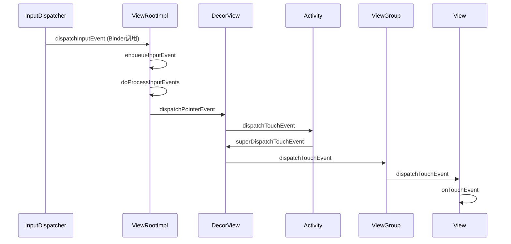
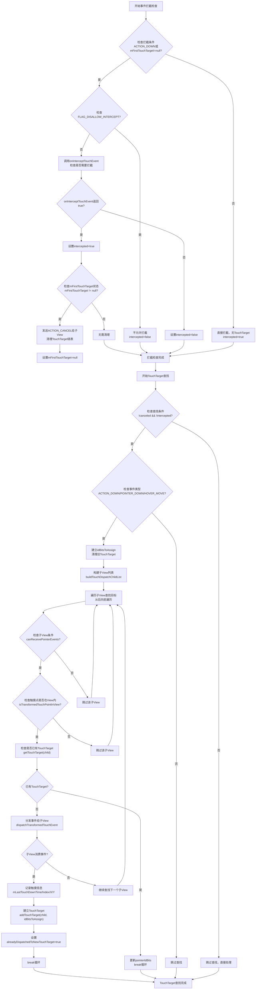
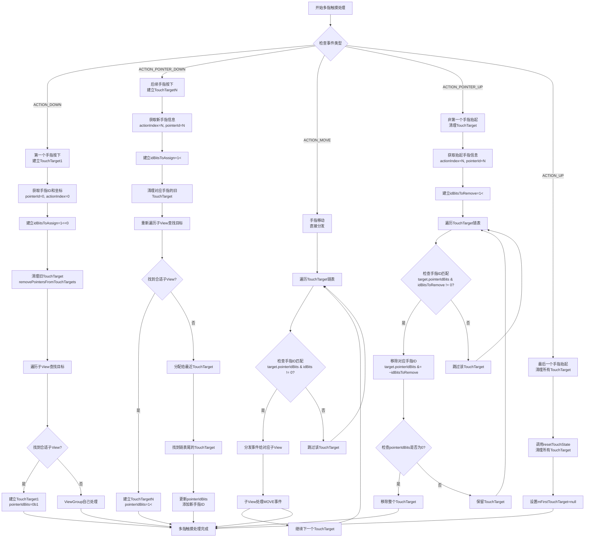
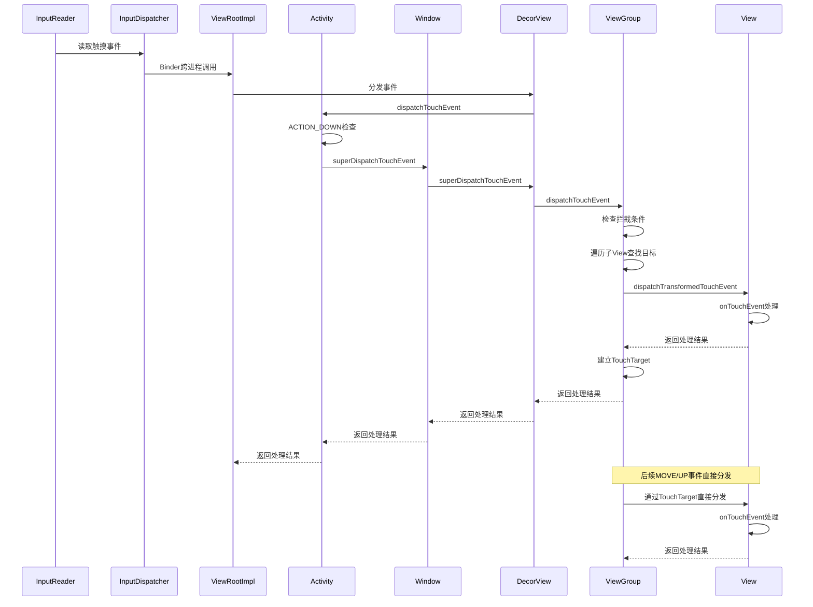

# Android触摸事件分发机制完整分析

[toc]

## 5. 系统层到应用层的事件传递流程

### 5.1 InputDispatcher到ViewRootImpl

触摸事件首先由InputDispatcher通过Binder跨进程传递到应用进程：



### 5.2 详细的事件拦截和TouchTarget查找流程图



### 5.3 多指触摸的详细分发流程图



### 5.4 时序图：从系统层到应用层的完整调用链



### 5.5 ViewRootImpl.dispatchInputEvent方法

[源码证据：frameworks/base/core/java/android/view/ViewRootImpl.java#L7890-7920]

```java
void dispatchInputEvent(InputEvent event) {
    // 将事件加入队列
    enqueueInputEvent(event);
}

void enqueueInputEvent(InputEvent event) {
    // 处理输入事件队列
    if (mInputEventReceiver != null) {
        mInputEventReceiver.onInputEvent(event);
    }
}
```

### 5.6 InputEventReceiver.onInputEvent方法

[源码证据：frameworks/base/core/java/android/view/InputEventReceiver.java#L250-280]

```java
public void onInputEvent(InputEvent event) {
    // 处理输入事件
    finishInputEvent(event, false);
}
```

