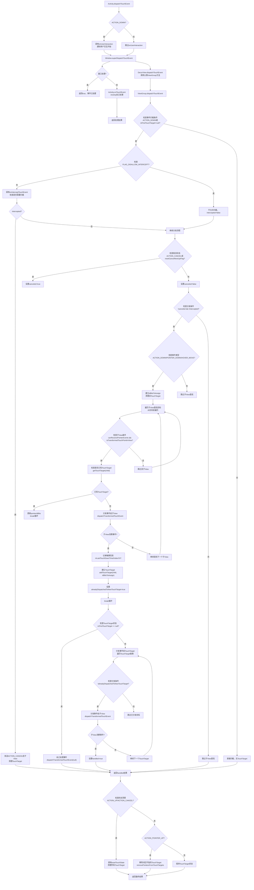
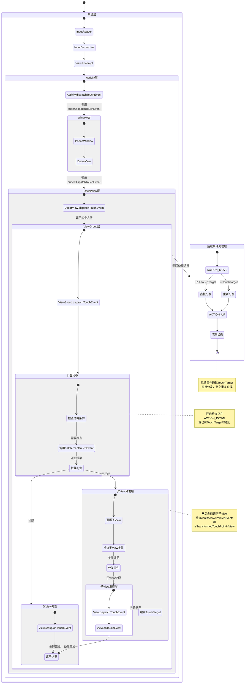
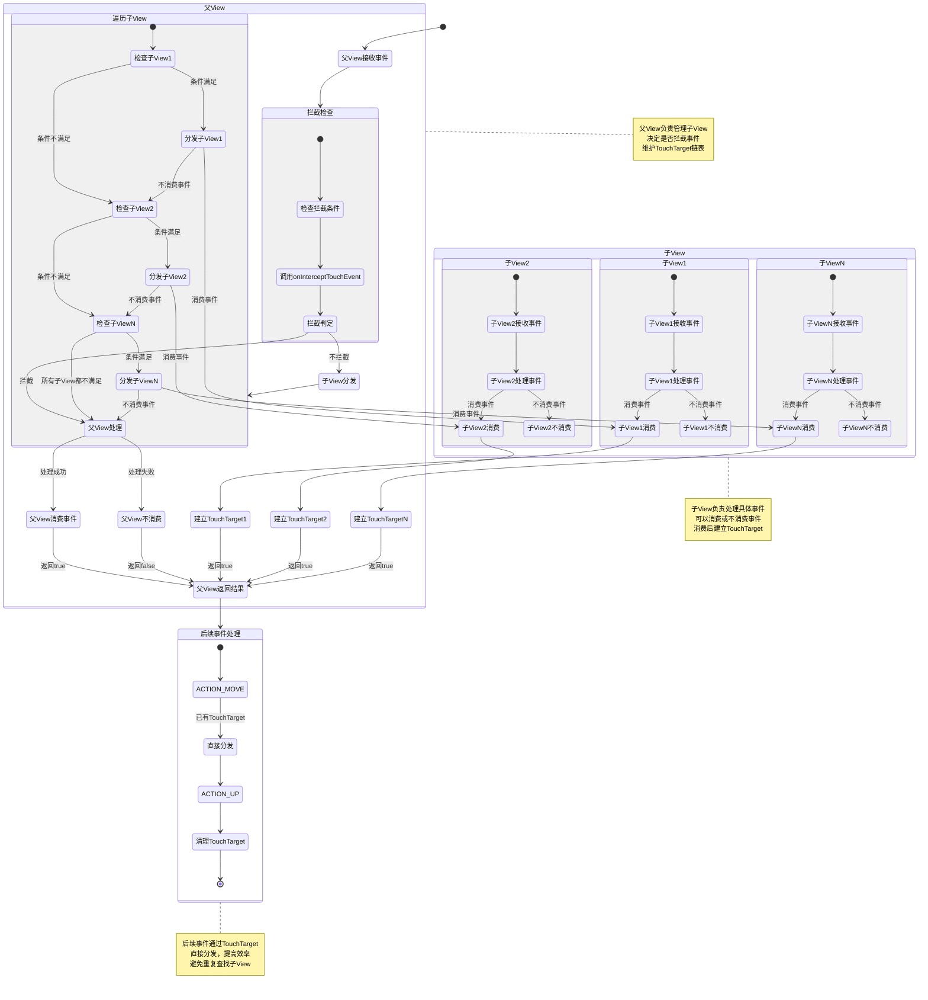

# Android触摸事件分发机制完整分析

[toc]

## 6. 详细的事件分发流程图

### 6.1 完整的事件分发流程图

```mermaid
flowchart TD
    A[Activity.dispatchTouchEvent] --> B{ACTION_DOWN?}
    B -->|是| C["调用onUserInteraction<br/>通知用户交互开始"]
    B -->|否| D[跳过onUserInteraction]
    C --> E[Window.superDispatchTouchEvent]
    D --> E
    E --> F{窗口处理?}
    F -->|是| G[返回true，事件已处理]
    F -->|否| H["Activity.onTouchEvent<br/>Activity自己处理"]
    H --> I[返回处理结果]
    
    E --> J["DecorView.dispatchTouchEvent<br/>调用父类ViewGroup方法"]
    J --> K[ViewGroup.dispatchTouchEvent]
    
    K --> L{"检查事件拦截条件<br/>ACTION_DOWN或mFirstTouchTarget!=null?"}
    L -->|是| M{检查FLAG_DISALLOW_INTERCEPT?}
    L -->|否| N[直接拦截，无TouchTarget]
    M -->|否| O["调用onInterceptTouchEvent<br/>检查是否需要拦截"]
    M -->|是| P[不允许拦截，intercepted=false]
    O --> Q{intercepted?}
    Q -->|是| R["发送ACTION_CANCEL给子View<br/>清理TouchTarget"]
    Q -->|否| S[继续分发流程]
    P --> S
    
    S --> T{"检查取消状态<br/>ACTION_CANCEL或resetCancelNextUpFlag?"}
    T -->|是| U[设置canceled=true]
    T -->|否| V[设置canceled=false]
    
    V --> W{"检查分发条件<br/>!canceled && !intercepted?"}
    W -->|是| X{"检查事件类型<br/>ACTION_DOWN/POINTER_DOWN/HOVER_MOVE?"}
    W -->|否| Y[跳过子View查找]
    
    X -->|是| Z["建立idBitsToAssign<br/>清理旧TouchTarget"]
    X -->|否| AA[跳过子View查找]
    
    Z --> AB["遍历子View查找目标<br/>从后向前遍历"]
    AB --> AC{"检查子View条件<br/>canReceivePointerEvents &&<br/>isTransformedTouchPointInView?"}
    AC -->|是| AD["检查是否已有TouchTarget<br/>getTouchTarget(child)"]
    AC -->|否| AE[跳过该子View]
    AE --> AB
    
    AD --> AF{已有TouchTarget?}
    AF -->|是| AG["更新pointerIdBits<br/>break循环"]
    AF -->|否| AH["分发事件给子View<br/>dispatchTransformedTouchEvent"]
    
    AH --> AI{子View消费事件?}
    AI -->|是| AJ[记录触摸信息<br/>mLastTouchDownTime/Index/X/Y]
    AI -->|否| AK[继续查找下一个子View]
    AK --> AB
    
    AJ --> AL["建立TouchTarget<br/>addTouchTarget(child, idBitsToAssign)"]
    AL --> AM[设置alreadyDispatchedToNewTouchTarget=true]
    AM --> AN[break循环]
    
    AN --> AO{检查TouchTarget状态<br/>mFirstTouchTarget == null?}
    AO -->|是| AP["自己处理事件<br/>dispatchTransformedTouchEvent(null)"]
    AO -->|否| AQ[分发事件给TouchTarget<br/>遍历TouchTarget链表]
    
    AQ --> AR{检查分发条件<br/>!alreadyDispatchedToNewTouchTarget?}
    AR -->|是| AS[分发事件给子View<br/>dispatchTransformedTouchEvent]
    AR -->|否| AT[跳过已分发目标]
    
    AS --> AU{子View消费事件?}
    AU -->|是| AV[设置handled=true]
    AU -->|否| AW[继续下一个TouchTarget]
    AW --> AQ
    
    AV --> AX[返回handled结果]
    AP --> AX
    Y --> AX
    R --> AX
    N --> AX
    
    AX --> AY{检查状态清理<br/>ACTION_UP/ACTION_CANCEL?}
    AY -->|是| AZ[调用resetTouchState<br/>清理所有TouchTarget]
    AY -->|否| BA{ACTION_POINTER_UP?}
    BA -->|是| BB[移除对应手指的TouchTarget<br/>removePointersFromTouchTargets]
    BA -->|否| BC[保持TouchTarget状态]
    
    AZ --> BD[返回最终结果]
    BB --> BD
    BC --> BD
```

### 6.2 层级化的事件分发状态机

```mermaid
stateDiagram-v2
    [*] --> 系统层
    
    state 系统层 {
        [*] --> InputReader
        InputReader --> InputDispatcher
        InputDispatcher --> ViewRootImpl
        ViewRootImpl --> Activity层
    }
    
    state Activity层 {
        [*] --> Activity.dispatchTouchEvent
        Activity.dispatchTouchEvent --> Window层 : 调用superDispatchTouchEvent
        Window层 --> DecorView层 : 调用superDispatchTouchEvent
        
        state Window层 {
            [*] --> PhoneWindow
            PhoneWindow --> DecorView
        }
        
        state DecorView层 {
            [*] --> DecorView.dispatchTouchEvent
            DecorView.dispatchTouchEvent --> ViewGroup层 : 调用父类方法
        }
    }
    
    state ViewGroup层 {
        [*] --> ViewGroup.dispatchTouchEvent
        ViewGroup.dispatchTouchEvent --> 拦截检查
        
        state 拦截检查 {
            [*] --> 检查拦截条件
            检查拦截条件 --> 调用onInterceptTouchEvent : 需要检查
            调用onInterceptTouchEvent --> 拦截判定 : 返回结果
            拦截判定 --> 子View分发层 : 不拦截
            拦截判定 --> 父View处理 : 拦截
        }
        
        state 子View分发层 {
            [*] --> 遍历子View
            遍历子View --> 检查子View条件
            检查子View条件 --> 分发事件 : 条件满足
            分发事件 --> 子View消费层 : 子View处理
            子View消费层 --> 建立TouchTarget : 消费事件
            
            state 子View消费层 {
                [*] --> View.dispatchTouchEvent
                View.dispatchTouchEvent --> View.onTouchEvent
                View.onTouchEvent --> 返回结果 : 处理完成
            }
        }
        
        state 父View处理 {
            [*] --> ViewGroup.onTouchEvent
            ViewGroup.onTouchEvent --> 返回结果 : 处理完成
        }
    }
    
    ViewGroup层 --> 后续事件处理层 : 返回处理结果
    
    state 后续事件处理层 {
        [*] --> ACTION_MOVE
        ACTION_MOVE --> 直接分发 : 已有TouchTarget
        直接分发 --> ACTION_UP
        
        ACTION_MOVE --> 重新分发 : 无TouchTarget
        重新分发 --> ACTION_UP
        
        ACTION_UP --> 清理状态
        清理状态 --> [*]
    }
    
    note right of 拦截检查
        拦截检查只在ACTION_DOWN
        或已有TouchTarget时进行
    end note
    
    note right of 子View分发层
        从后向前遍历子View
        检查canReceivePointerEvents
        和isTransformedTouchPointInView
    end note
    
    note right of 后续事件处理层
        后续事件通过TouchTarget
        直接分发，避免重复查找
    end note
```

### 6.3 父View与子View交互状态机

```mermaid
stateDiagram-v2
    [*] --> 父View接收事件
    
    state 父View {
        父View接收事件 --> 拦截检查
        
        state 拦截检查 {
            [*] --> 检查拦截条件
            检查拦截条件 --> 调用onInterceptTouchEvent
            调用onInterceptTouchEvent --> 拦截判定
            拦截判定 --> 父View处理 : 拦截
            拦截判定 --> 子View分发 : 不拦截
        }
        
        父View处理 --> 父View消费事件 : 处理成功
        父View处理 --> 父View不消费 : 处理失败
        
        子View分发 --> 遍历子View
        
        state 遍历子View {
            [*] --> 检查子View1
            检查子View1 --> 分发子View1 : 条件满足
            检查子View1 --> 检查子View2 : 条件不满足
            
            分发子View1 --> 子View1消费 : 消费事件
            分发子View1 --> 检查子View2 : 不消费事件
            
            检查子View2 --> 分发子View2 : 条件满足
            检查子View2 --> 检查子ViewN : 条件不满足
            
            分发子View2 --> 子View2消费 : 消费事件
            分发子View2 --> 检查子ViewN : 不消费事件
            
            检查子ViewN --> 分发子ViewN : 条件满足
            检查子ViewN --> 父View处理 : 所有子View都不满足
            
            分发子ViewN --> 子ViewN消费 : 消费事件
            分发子ViewN --> 父View处理 : 不消费事件
        }
        
        父View消费事件 --> 父View返回结果 : 返回true
        父View不消费 --> 父View返回结果 : 返回false
        
        子View1消费 --> 建立TouchTarget1
        子View2消费 --> 建立TouchTarget2
        子ViewN消费 --> 建立TouchTargetN
        
        建立TouchTarget1 --> 父View返回结果 : 返回true
        建立TouchTarget2 --> 父View返回结果 : 返回true
        建立TouchTargetN --> 父View返回结果 : 返回true
    }
    
    state 子View {
        state 子View1 {
            [*] --> 子View1接收事件
            子View1接收事件 --> 子View1处理事件
            子View1处理事件 --> 子View1消费 : 消费事件
            子View1处理事件 --> 子View1不消费 : 不消费事件
        }
        
        state 子View2 {
            [*] --> 子View2接收事件
            子View2接收事件 --> 子View2处理事件
            子View2处理事件 --> 子View2消费 : 消费事件
            子View2处理事件 --> 子View2不消费 : 不消费事件
        }
        
        state 子ViewN {
            [*] --> 子ViewN接收事件
            子ViewN接收事件 --> 子ViewN处理事件
            子ViewN处理事件 --> 子ViewN消费 : 消费事件
            子ViewN处理事件 --> 子ViewN不消费 : 不消费事件
        }
    }
    
    父View返回结果 --> 后续事件处理
    
    state 后续事件处理 {
        [*] --> ACTION_MOVE
        ACTION_MOVE --> 直接分发 : 已有TouchTarget
        直接分发 --> ACTION_UP
        
        ACTION_UP --> 清理TouchTarget
        清理TouchTarget --> [*]
    }
    
    note right of 父View
        父View负责管理子View
        决定是否拦截事件
        维护TouchTarget链表
    end note
    
    note right of 子View
        子View负责处理具体事件
        可以消费或不消费事件
        消费后建立TouchTarget
    end note
    
    note right of 后续事件处理
        后续事件通过TouchTarget
        直接分发，提高效率
        避免重复查找子View
    end note
```
