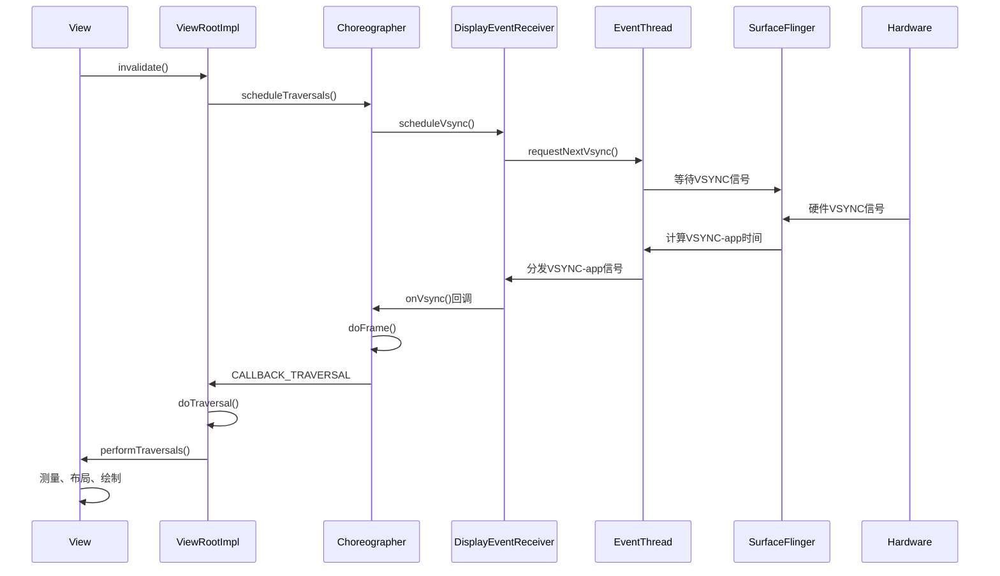

# VSYNC机制完整分析

## 概述

VSYNC（Vertical Synchronization，垂直同步）是Android图形系统的核心同步机制，用于协调应用渲染、SurfaceFlinger合成和显示硬件的刷新过程。本文档整合了多个VSYNC相关分析文档的精华内容，提供从硬件VSYNC到应用VSYNC的完整流程分析。

## 1. VSYNC信号类型与作用

### 1.1 硬件VSYNC（HW-VSYNC）

硬件VSYNC信号由显示硬件生成，表示显示器完成一次垂直扫描并准备开始下一帧的显示。

**特性：**
- **固定频率**：通常为60Hz、90Hz、120Hz等，由硬件决定
- **硬件触发**：由显示控制器硬件生成
- **不可变**：软件无法修改硬件VSYNC频率

### 1.2 应用VSYNC（VSYNC-app）

应用VSYNC信号由SurfaceFlinger基于硬件VSYNC计算生成，用于同步应用程序的渲染工作。

**特性：**
- **软件生成**：基于硬件VSYNC计算得出
- **时间偏移**：包含应用偏移量（appVsyncOffset）
- **可预测**：支持预测性VSYNC调度

### 1.3 SurfaceFlinger VSYNC（VSYNC-sf）

SurfaceFlinger VSYNC信号用于同步SurfaceFlinger的合成操作。

**特性：**
- **合成同步**：确保合成操作在正确时机执行
- **相位偏移**：相对于应用VSYNC有特定的相位偏移
- **优先级管理**：支持合成优先级的调度

## 2. HW-VSYNC计算模型与校准

### 2.1 线性回归模型建立

Android系统通过线性回归建立HW-VSYNC的计算模型：

1. **数据采集**：SurfaceFlinger启动或屏幕刷新率改变时，收集至少6个HW-VSYNC信号的到达时间
2. **模型建立**：以信号到达次序为X轴，实际到达时间为Y轴，通过线性回归计算出线性关系`y = ax + b`
3. **模型使用**：给定任意时间，代入模型可预测下一个HW-VSYNC信号的到达时间
4. **校准优化**：计算结果会减去半个周期后重新计算，确保准确性

### 2.2 模型优势

这个模型使得系统能够在不持续监听硬件中断的情况下，准确预测VSYNC信号的到达时间，显著降低功耗。

## 3. 软件VSYNC信号计算过程

### 3.1 关键参数定义

VSYNC-app和VSYNC-sf的计算涉及两个关键参数：

- **workDuration**：模块完成自身工作的理论耗时（如app的渲染耗时）
- **readyDuration**：工作完成后传递给下一模块的等待时间

### 3.2 VSYNC-app信号计算示例

假设：
- app的workDuration = 16.6ms
- app的readyDuration = 15.6ms
- 应用在24.9ms时请求VSYNC-app信号

**计算流程：**
1. 在请求时间(24.9ms)基础上加上workDuration和readyDuration，得到时间点a：`24.9ms + 16.6ms + 15.6ms = 57.1ms`
2. 找到a之后的下一个HW-VSYNC时间点b：假设为81ms
3. 从b减去workDuration和readyDuration，得到VSYNC-app信号时间：`81ms - 16.6ms - 15.6ms = 48.8ms`
4. 设置定时器，在48.8ms时向应用发送VSYNC-app信号

### 3.3 相位差设计原理

软件VSYNC信号与HW-VSYNC保持特定相位差，确保渲染和合成流程能够及时完成：

- VSYNC-app比HW-VSYNC提前(workDuration + readyDuration)时间触发
- VSYNC-sf在VSYNC-app之后、HW-VSYNC之前触发

## 4. 应用层VSYNC请求流程

### 4.1 ViewRootImpl触发刷新请求

当View需要刷新时（例如调用`invalidate()`或`requestLayout()`），通过ViewRootImpl发起刷新请求：

[源码证据：frameworks/base/core/java/android/view/ViewRootImpl.java#L3085-3100]

```java
@UnsupportedAppUsage(maxTargetSdk = Build.VERSION_CODES.R, trackingBug = 170729553)
void scheduleTraversals() {
    if (!mTraversalScheduled) {
        mTraversalScheduled = true;
        // The following behavior is load-bearing for public API correctness.
        // For example, the following code is defined to be correct and the
        // MessageQueue sync barrier mechanism and its usage here is
        // responsible for ensuring it:
        //
        //   textView.setText("Hello, world!");
        //   textView.getHandler().post(new Runnable() {
        //     public void run() {
        //       // This code will run after traversals have happened
        //       // and the TextView has been measured with its new text.
        //       reportNewTextWidth(textView.getWidth());
        //     }
        //   });
        mTraversalBarrier = mQueue.postSyncBarrier();
        mChoreographer.postCallback(
                Choreographer.CALLBACK_TRAVERSAL, mTraversalRunnable, null);
        notifyRendererOfFramePending();
    }
}
```

### 4.2 Choreographer调度机制

Choreographer负责协调动画、输入和绘制的时序，通过postCallback方法将遍历回调安排到适当的时机执行：

[源码证据：frameworks/base/core/java/android/view/Choreographer.java#L612-637]

```java
private void postCallbackDelayedInternal(int callbackType,
        Object action, Object token, long delayMillis) {
    if (DEBUG_FRAMES) {
        Log.d(TAG, "PostCallback: type=" + callbackType
                + ", action=" + action + ", token=" + token
                + ", delayMillis=" + delayMillis);
    }

    synchronized (mLock) {
        final long now = SystemClock.uptimeMillis();
        final long dueTime = now + delayMillis;
        mCallbackQueues[callbackType].addCallbackLocked(dueTime, action, token);

        if (dueTime <= now) {
            scheduleFrameLocked(now);
        } else {
            Message msg = mHandler.obtainMessage(MSG_DO_SCHEDULE_CALLBACK, action);
            msg.arg1 = callbackType;
            msg.setAsynchronous(true);
            mHandler.sendMessageAtTime(msg, dueTime);
        }
    }
}
```

### 4.3 VSYNC信号注册

Choreographer通过`scheduleFrameLocked`方法请求VSYNC信号：

[源码证据：frameworks/base/core/java/android/view/Choreographer.java#L872-897]

```java
private void scheduleFrameLocked(long now) {
    if (!mFrameScheduled) {
        mFrameScheduled = true;
        if (USE_VSYNC) {
            if (DEBUG_FRAMES) {
                Log.d(TAG, "Scheduling next frame on vsync.");
            }

            // If running on the Looper thread, then schedule the vsync immediately,
            // otherwise post a message to schedule the vsync from the UI thread
            // as soon as possible.
            if (isRunningOnLooperThreadLocked()) {
                scheduleVsyncLocked();
            } else {
                Message msg = mHandler.obtainMessage(MSG_DO_SCHEDULE_VSYNC);
                msg.setAsynchronous(true);
                mHandler.sendMessageAtFrontOfQueue(msg);
            }
        } else {
            final long nextFrameTime = Math.max(
                    mLastFrameTimeNanos / TimeUtils.NANOS_PER_MS + sFrameDelay, now);
            if (DEBUG_FRAMES) {
                Log.d(TAG, "Scheduling next frame in " + (nextFrameTime - now) + " ms.");
            }
            Message msg = mHandler.obtainMessage(MSG_DO_FRAME);
            msg.setAsynchronous(true);
            mHandler.sendMessageAtTime(msg, nextFrameTime);
        }
    }
}
```

## 5. DisplayEventReceiver与底层交互

### 5.1 VSYNC信号请求

Choreographer通过DisplayEventReceiver请求VSYNC信号：

[源码证据：frameworks/base/core/java/android/view/Choreographer.java#L1270-1279]

```java
@UnsupportedAppUsage(maxTargetSdk = Build.VERSION_CODES.R, trackingBug = 170729553)
private void scheduleVsyncLocked() {
    try {
        Trace.traceBegin(Trace.TRACE_TAG_VIEW, "Choreographer#scheduleVsyncLocked");
        mDisplayEventReceiver.scheduleVsync();
    } finally {
        Trace.traceEnd(Trace.TRACE_TAG_VIEW);
    }
}
```

[源码证据：frameworks/base/core/java/android/view/DisplayEventReceiver.java#L363-373]

```java
/**
 * Schedules a single vertical sync pulse to be delivered when the next
 * display frame begins.
 */
@UnsupportedAppUsage
public void scheduleVsync() {
    if (mReceiverPtr == 0) {
        Log.w(TAG, "Attempted to schedule a vertical sync pulse but the display event "
                + "receiver has already been disposed.");
    } else {
        nativeScheduleVsync(mReceiverPtr);
    }
}
```

### 5.2 Native层注册

DisplayEventReceiver通过JNI调用Native层注册VSYNC监听：

[源码证据：frameworks/base/core/jni/android_view_DisplayEventReceiver.cpp]

```cpp
// Native层注册
static jlong nativeInit(JNIEnv* env, jobject clazz, 
        jobject receiverWeak, jobject messageQueueObj, jint vsyncSource) {
    // 创建EventThread连接
    sp<EventThreadConnection> connection = eventThread->createEventConnection();
    
    // 注册VSYNC监听
    connection->requestNextVsync();
    
    return reinterpret_cast<jlong>(connection.get());
}
```

## 6. SurfaceFlinger中的VSYNC处理

### 6.1 EventThread架构

EventThread是SurfaceFlinger中负责分发VSYNC信号的核心组件：

[源码证据：native/services/surfaceflinger/Scheduler/EventThread.cpp#L532-590]

```cpp
void EventThread::threadMain(std::unique_lock<std::mutex>& lock) {
    DisplayEventConsumers consumers;

    while (mState != State::Quit) {
        std::optional<DisplayEventReceiver::Event> event;

        // Determine next event to dispatch.
        if (!mPendingEvents.empty()) {
            event = mPendingEvents.front();
            mPendingEvents.pop_front();

            if (event->header.type == DisplayEventType::DISPLAY_EVENT_HOTPLUG) {
                if (event->hotplug.connectionError == 0) {
                    if (event->hotplug.connected && !mVSyncState) {
                        mVSyncState.emplace();
                    } else if (!event->hotplug.connected &&
                               mVsyncSchedule->getPhysicalDisplayId() == event->header.displayId) {
                        mVSyncState.reset();
                    }
                }
            }
        }

        bool vsyncRequested = false;

        // Find connections that should consume this event.
        auto it = mDisplayEventConnections.begin();
        while (it != mDisplayEventConnections.end()) {
            if (const auto connection = it->promote()) {
                if (event && shouldConsumeEvent(*event, connection)) {
                    consumers.push_back(connection);
                }

                vsyncRequested |= connection->vsyncRequest != VSyncRequest::None;

                ++it;
            } else {
                it = mDisplayEventConnections.erase(it);
            }
        }

        if (!consumers.empty()) {
            dispatchEvent(*event, consumers);
            consumers.clear();
        }

        if (mVSyncState && vsyncRequested) {
            const bool vsyncOmitted =
                    FlagManager::getInstance().no_vsyncs_on_screen_off() && mVSyncState->omitted;
            if (vsyncOmitted) {
                updateState(State::Idle);
                SFTRACE_INT("VsyncPendingScreenOn", 1);
            } else {
                updateState(mVSyncState->synthetic ? State::SyntheticVSync : State::VSync);
            }
        }
        // ...
    }
}
```

### 6.2 VSYNC请求管理

EventThread管理应用的VSYNC连接和请求：

[源码证据：native/services/surfaceflinger/Scheduler/EventThread.cpp#L261-265]

```cpp
binder::Status EventThreadConnection::requestNextVsync() {
    SFTRACE_CALL();
    mEventThread->requestNextVsync(sp<EventThreadConnection>::fromExisting(this));
    return binder::Status::ok();
}
```

[源码证据：native/services/surfaceflinger/Scheduler/EventThread.cpp#L417-428]

```cpp
void EventThread::requestNextVsync(const sp<EventThreadConnection>& connection) {
    mCallback.resync(IEventThreadCallback::ResyncCaller::RequestNextVsync);

    std::lock_guard<std::mutex> lock(mMutex);

    if (connection->vsyncRequest == VSyncRequest::None) {
        connection->vsyncRequest = VSyncRequest::Single;
        mCondition.notify_all();
    } else if (connection->vsyncRequest == VSyncRequest::SingleSuppressCallback) {
        connection->vsyncRequest = VSyncRequest::Single;
    }
}
```

### 6.3 VSYNC信号调度

EventThread根据workDuration和readyDuration参数调度VSYNC信号：

[源码证据：native/services/surfaceflinger/Scheduler/EventThread.cpp#L598-608]

```cpp
if (mState == State::VSync) {
    const auto scheduleResult = mVsyncRegistration.schedule(
            {.workDuration = mWorkDuration.get().count(),
             .readyDuration = mReadyDuration.count(),
             .lastVsync = mLastVsyncCallbackTime.ns(),
             .committedVsyncOpt = mLastCommittedVsyncTime.ns()});
    LOG_ALWAYS_FATAL_IF(!scheduleResult, "Error scheduling callback");
} else {
    mVsyncRegistration.cancel();
}
```

## 7. VSYNC信号接收与处理

### 7.1 VSYNC信号回调

当VSYNC信号到达时，DisplayEventReceiver的`onVsync`方法被调用：

[源码证据：frameworks/base/core/java/android/view/DisplayEventReceiver.java#L268-271]

```java
public void onVsync(long timestampNanos, long physicalDisplayId, int frame,
        VsyncEventData vsyncEventData) {
}
```

### 7.2 FrameDisplayEventReceiver处理

Choreographer内部的FrameDisplayEventReceiver处理VSYNC回调：

[源码证据：frameworks/base/core/java/android/view/Choreographer.java#L1552-1604]

```java
private final class FrameDisplayEventReceiver extends DisplayEventReceiver
        implements Runnable {
    private boolean mHavePendingVsync;
    private long mTimestampNanos;
    private int mFrame;
    private final VsyncEventData mLastVsyncEventData = new VsyncEventData();

    FrameDisplayEventReceiver(Looper looper, int vsyncSource, long layerHandle) {
        super(looper, vsyncSource, /* eventRegistration */ 0, layerHandle);
    }

    // TODO(b/116025192): physicalDisplayId is ignored because SF only emits VSYNC events for
    // the internal display and DisplayEventReceiver#scheduleVsync only allows requesting VSYNC
    // for the internal display implicitly.
    @Override
    public void onVsync(long timestampNanos, long physicalDisplayId, int frame,
            VsyncEventData vsyncEventData) {
        try {
            if (Trace.isTagEnabled(Trace.TRACE_TAG_VIEW)) {
                Trace.traceBegin(Trace.TRACE_TAG_VIEW,
                        "Choreographer#onVsync "
                                + vsyncEventData.preferredFrameTimeline().vsyncId);
            }
            // Post the vsync event to the Handler.
            // The idea is to prevent incoming vsync events from completely starving
            // the message queue.  If there are no messages in the queue with timestamps
            // earlier than the frame time, then the vsync event will be processed immediately.
            // Otherwise, messages that predate the vsync event will be handled first.
            long now = System.nanoTime();
            if (timestampNanos > now) {
                if (DEBUG_JANK) {
                    Log.w(TAG, "Frame time is " + ((timestampNanos - now) * 0.000001f)
                            + " ms in the future!  Check that graphics HAL is generating vsync "
                            + "timestamps using the correct timebase.");
                }
                timestampNanos = now;
            }

            if (mHavePendingVsync) {
                if (DEBUG_JANK) {
                    Log.w(TAG, "Already have a pending vsync event.  There should only be "
                            + "one at a time.");
                }
            } else {
                mHavePendingVsync = true;
            }

            mTimestampNanos = timestampNanos;
            mFrame = frame;
            mLastVsyncEventData.copyFrom(vsyncEventData);
            Message msg = Message.obtain(mHandler, this);
            msg.setAsynchronous(true);
            mHandler.sendMessageAtTime(msg, timestampNanos / TimeUtils.NANOS_PER_MS);
        } finally {
            Trace.traceEnd(Trace.TRACE_TAG_VIEW);
        }
    }

    @Override
    public void run() {
        mHavePendingVsync = false;
        doFrame(mTimestampNanos, mFrame, mLastVsyncEventData);
    }
}
```

### 7.3 帧处理与回调执行

Choreographer的`doFrame`方法处理VSYNC信号并执行各种回调：

[源码证据：frameworks/base/core/java/android/view/Choreographer.java#L1021-1095]

```java
void doFrame(long frameTimeNanos, int frame,
        DisplayEventReceiver.VsyncEventData vsyncEventData) {
    final long startNanos;
    final long frameIntervalNanos = vsyncEventData.frameInterval;
    // Original intended vsync time that is not adjusted by jitter
    // or buffer stuffing recovery. Reported for jank tracking.
    final long intendedFrameTimeNanos = frameTimeNanos;
    long offsetFrameTimeNanos = frameTimeNanos;
    boolean resynced = false;

    // Evaluate if buffer stuffing recovery needs to start or end, and
    // what actions need to be taken for recovery.
    if (bufferStuffingRecovery()) {
        switch (updateBufferStuffingState(frameTimeNanos, vsyncEventData)) {
            case NONE:
                // Without buffer stuffing recovery, offsetFrameTimeNanos is
                // synonymous with frameTimeNanos.
                break;
            case OFFSET:
                // Add animation offset. Used to update frame timeline with
                // offset before jitter is calculated.
                offsetFrameTimeNanos = frameTimeNanos - frameIntervalNanos;
                break;
            case DELAY_FRAME:
                // Intentional frame delay to help reduce queued buffer count.
                mBufferStuffingState.numberWaitsForNextVsync++;
                scheduleVsyncLocked();
                return;
            default:
                break;
        }
    }

    try {
        FrameTimeline timeline = mFrameData.update(offsetFrameTimeNanos, vsyncEventData);
        if (Trace.isTagEnabled(Trace.TRACE_TAG_VIEW)) {
            Trace.traceBegin(
                    Trace.TRACE_TAG_VIEW, "Choreographer#doFrame " + timeline.mVsyncId);
            mInDoFrameCallback = true;
        }
        synchronized (mLock) {
            if (!mFrameScheduled) {
                traceMessage("Frame not scheduled");
                return; // no work to do
            }
            mLastNoOffsetFrameTimeNanos = frameTimeNanos;

            startNanos = System.nanoTime();
            // Calculating jitter involves using the original frame time without
            // adjustments from buffer stuffing
            final long jitterNanos = startNanos - frameTimeNanos;
            if (jitterNanos >= frameIntervalNanos) {
                frameTimeNanos = startNanos;
                if (frameIntervalNanos == 0) {
                    Log.i(TAG, "Vsync data empty due to timeout");
                } else {
                    long lastFrameOffset = jitterNanos % frameIntervalNanos;
                    frameTimeNanos = frameTimeNanos - lastFrameOffset;
                    final long skippedFrames = jitterNanos / frameIntervalNanos;
                    if (skippedFrames >= SKIPPED_FRAME_WARNING_LIMIT) {
                        Log.i(TAG, "Skipped " + skippedFrames + " frames!  "
                                + "The application may be doing too much work on its main "
                                + "thread.");
                    }
                }
            }
        }
        // ...
    }
    // 执行回调队列
    doCallbacks(Choreographer.CALLBACK_INPUT, frameTimeNanos, vsyncEventData);
    doCallbacks(Choreographer.CALLBACK_ANIMATION, frameTimeNanos, vsyncEventData);
    doCallbacks(Choreographer.CALLBACK_INSETS_ANIMATION, frameTimeNanos, vsyncEventData);
    doCallbacks(Choreographer.CALLBACK_TRAVERSAL, frameTimeNanos, vsyncEventData);
    doCallbacks(Choreographer.CALLBACK_COMMIT, frameTimeNanos, vsyncEventData);
}
```

### 7.4 遍历回调执行

在`CALLBACK_TRAVERSAL`回调中，ViewRootImpl的`doTraversal()`方法被调用：

[源码证据：frameworks/base/core/java/android/view/ViewRootImpl.java#L3123-3129]

```java
void doTraversal() {
    if (mTraversalScheduled) {
        mTraversalScheduled = false;
        mQueue.removeSyncBarrier(mTraversalBarrier);
        performTraversals();
    }
}
```

## 8. 完整的VSYNC流程时序图



## 9. 性能优化与异常处理

### 9.1 帧跳过检测

Choreographer会检测帧跳过情况并发出警告：

[源码证据：frameworks/base/core/java/android/view/Choreographer.java#L1080-1095]

```java
startNanos = System.nanoTime();
// Calculating jitter involves using the original frame time without
// adjustments from buffer stuffing
final long jitterNanos = startNanos - frameTimeNanos;
if (jitterNanos >= frameIntervalNanos) {
    frameTimeNanos = startNanos;
    if (frameIntervalNanos == 0) {
        Log.i(TAG, "Vsync data empty due to timeout");
    } else {
        long lastFrameOffset = jitterNanos % frameIntervalNanos;
        frameTimeNanos = frameTimeNanos - lastFrameOffset;
        final long skippedFrames = jitterNanos / frameIntervalNanos;
        if (skippedFrames >= SKIPPED_FRAME_WARNING_LIMIT) {
            Log.i(TAG, "Skipped " + skippedFrames + " frames!  "
                    + "The application may be doing too much work on its main "
                    + "thread.");
        }
    }
}
```

### 9.2 缓冲区填充恢复

系统通过缓冲区填充恢复机制处理帧堆积问题：

[源码证据：frameworks/base/core/java/android/view/Choreographer.java#L1058-1075]

```java
// Evaluate if buffer stuffing recovery needs to start or end, and
// what actions need to be taken for recovery.
if (bufferStuffingRecovery()) {
    switch (updateBufferStuffingState(frameTimeNanos, vsyncEventData)) {
        case NONE:
            // Without buffer stuffing recovery, offsetFrameTimeNanos is
            // synonymous with frameTimeNanos.
            break;
        case OFFSET:
            // Add animation offset. Used to update frame timeline with
            // offset before jitter is calculated.
            offsetFrameTimeNanos = frameTimeNanos - frameIntervalNanos;
            break;
        case DELAY_FRAME:
            // Intentional frame delay to help reduce queued buffer count.
            mBufferStuffingState.numberWaitsForNextVsync++;
            scheduleVsyncLocked();
            return;
        default:
            break;
    }
}
```

## 10. 总结

VSYNC机制是Android图形系统的核心同步机制，通过以下关键设计确保流畅的用户体验：

1. **分层设计**：硬件VSYNC、应用VSYNC、合成VSYNC三层分离
2. **预测模型**：基于线性回归的HW-VSYNC预测模型降低功耗
3. **相位差调度**：软件VSYNC与硬件VSYNC保持特定相位差，确保渲染和合成及时完成
4. **请求-响应机制**：应用需要主动请求VSYNC信号，避免不必要的分发
5. **异常处理**：帧跳过检测和缓冲区填充恢复机制处理异常情况

这种设计使得Android系统能够在保证图形流畅性的同时，最大限度地降低功耗和系统负载。