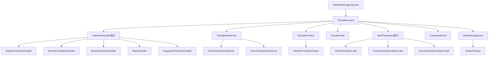
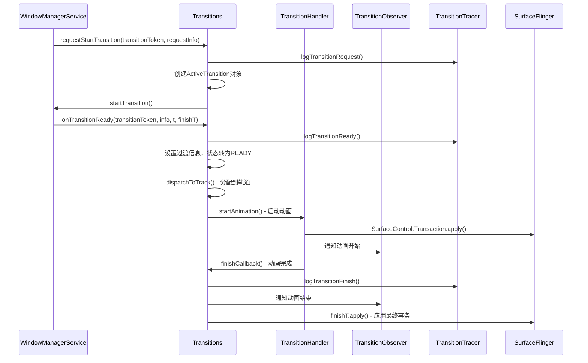

# WindowManager Shell Transition 机制分析

## 概述

WindowManager Shell Transition是Android 12+引入的新一代窗口过渡动画系统，它将窗口过渡动画的管理从WindowManagerService中分离出来，由独立的Shell进程负责处理。这种架构改进带来了更好的性能、可扩展性和模块化设计。

## 🏗️ 架构概览



## 架构设计

## 🔗 调用链分析

### 核心调用链
```
WindowManagerService → Transitions.java → 
├── TransitionHandler接口 → 具体处理器实现
├── TransitionObserver → 状态变化监听
├── TransitionTracer → 性能追踪
└── ShellTransitions接口 → 远程调用支持
```

### 处理器调用链
```
Transitions.requestStartTransition() → 
├── 遍历mHandlers列表 → 匹配处理器
├── TransitionHandler.startAnimation() → 动画执行
├── TransitionHandler.mergeAnimation() → 动画合并
└── TransitionFinishCallback → 动画完成回调
```

### 远程调用链
```
SystemUI/Launcher → IShellTransitions.aidl → 
├── ShellTransitions接口 → 远程过渡注册
├── RemoteTransitionHandler → 跨进程动画处理
└── OneShotRemoteHandler → 一次性远程处理器
```

### 1. 核心组件

**Shell Transition系统包含以下核心组件：**

- **Transitions.java**: 主要的过渡动画管理器，负责协调所有过渡动画的生命周期
- **TransitionHandler**: 过渡动画处理器的接口，支持多种类型的动画处理器
- **TransitionObserver**: 过渡动画观察者，用于监控过渡动画的状态变化
- **RemoteTransitionHandler**: 远程过渡处理器，支持跨进程动画处理
- **TransitionUtil**: 过渡动画工具类，提供类型判断和模式识别
- **ShellTransitions**: 远程过渡管理接口，支持跨进程调用

### 2. 过渡动画生命周期

过渡动画的生命周期遵循以下流程：

```
--start--> PENDING --onTransitionReady--> READY --play--> ACTIVE --finish--> |
                                                           --merge--> MERGED --^
```

**详细状态说明：**

1. **PENDING状态**: 过渡动画被创建但尚未准备好
2. **READY状态**: WindowManagerCore应用过渡并通知Shell准备就绪
3. **ACTIVE状态**: 过渡动画开始播放
4. **MERGED状态**: 多个过渡可以合并到一个活动中

## 核心类分析

## ⏱️ 系统时序图



### 1. Transitions类

Transitions类是Shell Transition系统的核心管理器，负责：

- **过渡动画的生命周期管理**
- **处理器注册和调度**
- **轨道(track)管理**
- **同步和合并机制**

**关键方法：**

[源码证据：base/libs/WindowManager/Shell/src/com/android/wm/shell/transition/Transitions.java#L1246-1290]

```java
/** @see ITransitionPlayer#requestStartTransition  */
public void requestStartTransition(@NonNull IBinder transitionToken,
        @Nullable TransitionRequestInfo request) {
    ProtoLog.v(WM_SHELL_TRANSITIONS, "Transition requested (#%d): %s %s",
            request.getDebugId(), transitionToken, request);
    if (mKnownTransitions.containsKey(transitionToken)) {
        throw new RuntimeException("Transition already started " + transitionToken);
    }
    final ActiveTransition active = new ActiveTransition(transitionToken);
    mKnownTransitions.put(transitionToken, active);
    WindowContainerTransaction wct = null;

    // If we have sleep, we use a special handler and we try to finish everything ASAP.
    if (request.getType() == TRANSIT_SLEEP) {
        mSleepHandler.handleRequest(transitionToken, request);
        active.mHandler = mSleepHandler;
    } else {
        Pair<TransitionHandler, WindowContainerTransaction> requestResult =
                dispatchRequestWithTracing(transitionToken, request, /* skip= */ null);
        if (requestResult != null) {
            active.mHandler = requestResult.first;
            wct = requestResult.second;
        }
        // ...
    }
}
```

[源码证据：base/libs/WindowManager/Shell/src/com/android/wm/shell/transition/Transitions.java#L717-762]

```java
/** @see ITransitionPlayer#onTransitionReady */
public void onTransitionReady(@NonNull IBinder transitionToken, @NonNull TransitionInfo info,
        @NonNull SurfaceControl.Transaction t, @NonNull SurfaceControl.Transaction finishT) {
    info.setUnreleasedWarningCallSiteForAllSurfaces("Transitions.onTransitionReady");
    ProtoLog.v(WM_SHELL_TRANSITIONS, "onTransitionReady (#%d) %s: %s",
            info.getDebugId(), transitionToken, info.toString("    " /* prefix */));
    int activeIdx = findByToken(mPendingTransitions, transitionToken);
    if (activeIdx < 0) {
        final ActiveTransition existing = mKnownTransitions.get(transitionToken);
        if (existing != null) {
            Log.e(TAG, "Got duplicate transitionReady for " + transitionToken);
            t.apply();
            if (existing.mFinishT != null) {
                existing.mFinishT.merge(finishT);
            } else {
                existing.mFinishT = finishT;
            }
            return;
        }
        // ...
    }
    // Move from pending to ready
    final ActiveTransition active = mPendingTransitions.remove(activeIdx);
    active.mInfo = info;
    active.mStartT = t;
    active.mFinishT = finishT;
    // ...
}
```

### 2. TransitionHandler接口

TransitionHandler定义了过渡动画处理器的基本接口：

[源码证据：base/libs/WindowManager/Shell/src/com/android/wm/shell/transition/Transitions.java#L1450-1505]

```java
/**
 * Interface for something which can handle a subset of transitions.
 */
public interface TransitionHandler {
    /**
     * Starts a transition animation. This is always called if handleRequest returned non-null
     * for a particular transition. Otherwise, it is only called if no other handler before
     * it handled the transition.
     * @param startTransaction the transaction given to the handler to be applied before the
     *                         transition animation. Note the handler is expected to call on
     *                         {@link SurfaceControl.Transaction#apply()} for startTransaction.
     * @param finishTransaction the transaction given to the handler to be applied after the
     *                       transition animation. Unlike startTransaction, the handler is NOT
     *                       expected to apply this transaction. The Transition system will
     *                       apply it when finishCallback is called. If additional transitions
     *                       are merged, then the finish transactions for those transitions
     *                       will be applied after this transaction.
     * @param finishCallback Call this when finished. This MUST be called on main thread.
     * @return true if transition was handled, false if not (falls-back to default).
     */
    boolean startAnimation(@NonNull IBinder transition, @NonNull TransitionInfo info,
            @NonNull SurfaceControl.Transaction startTransaction,
            @NonNull SurfaceControl.Transaction finishTransaction,
            @NonNull TransitionFinishCallback finishCallback);

    /**
     * Like {@link #startAnimation(IBinder, TransitionInfo, SurfaceControl.Transaction,
     * SurfaceControl.Transaction, TransitionFinishCallback)} when {@param info} is not null.
     */
    default boolean startAnimation(@NonNull IBinder transition,
                                   @Nullable TransitionInfo consumableInfo,
                                   @NonNull TransitionDispatchState dispatchState,
                                   @NonNull SurfaceControl.Transaction startTransaction,
                                   @NonNull SurfaceControl.Transaction finishTransaction,
                                   @NonNull TransitionFinishCallback finishCallback) {
        if (consumableInfo != null) {
            return startAnimation(transition, consumableInfo, startTransaction,
                    finishTransaction, finishCallback);
        }
        return false;
    }

    /**
     * Attempts to merge a different transition's animation into an animation that this handler
     * is currently playing. If a merge is not possible/supported, this should be a no-op.
     */
    void mergeAnimation(@NonNull IBinder transition, @NonNull TransitionInfo info,
            @NonNull SurfaceControl.Transaction startTransaction,
            @NonNull SurfaceControl.Transaction finishTransaction,
            @NonNull IBinder mergeTarget, @NonNull TransitionFinishCallback finishCallback);
}
```

### 3. 内置处理器类型

Shell Transition系统包含多种内置处理器：

- **DefaultTransitionHandler**: 默认过渡处理器
- **RemoteTransitionHandler**: 远程过渡处理器
- **MixedTransitionHandler**: 混合过渡处理器
- **SleepHandler**: 休眠过渡处理器
- **KeyguardTransitionHandler**: 锁屏过渡处理器
- **OneShotRemoteHandler**: 一次性远程处理器

### 4. TransitionUtil工具类

TransitionUtil提供过渡相关的工具函数，支持类型判断和模式识别：

[源码证据：base/libs/WindowManager/Shell/shared/src/com/android/wm/shell/shared/TransitionUtil.java#L70-130]

```java
/** @return true if the transition was triggered by opening something vs closing something */
public static boolean isOpeningType(@WindowManager.TransitionType int type) {
    return type == TRANSIT_OPEN
            || type == TRANSIT_TO_FRONT
            || type == TRANSIT_KEYGUARD_GOING_AWAY
            || type == TRANSIT_PREPARE_BACK_NAVIGATION;
}

/** @return true if the transition was triggered by closing something vs opening something */
public static boolean isClosingType(@WindowManager.TransitionType int type) {
    return type == TRANSIT_CLOSE || type == TRANSIT_TO_BACK;
}

/** Returns {@code true} if the transition is opening or closing mode. */
public static boolean isOpenOrCloseMode(@TransitionInfo.TransitionMode int mode) {
    return isOpeningMode(mode) || isClosingMode(mode);
}

/** Returns {@code true} if the transition is opening mode. */
public static boolean isOpeningMode(@TransitionInfo.TransitionMode int mode) {
    return mode == TRANSIT_OPEN || mode == TRANSIT_TO_FRONT;
}

/** Returns {@code true} if the transition is closing mode. */
public static boolean isClosingMode(@TransitionInfo.TransitionMode int mode) {
    return mode == TRANSIT_CLOSE || mode == TRANSIT_TO_BACK;
}

/** Returns `true` if `change` is a wallpaper. */
public static boolean isWallpaper(TransitionInfo.Change change) {
    return (change.getTaskInfo() == null)
            && change.hasFlags(FLAG_IS_WALLPAPER)
            && !change.hasFlags(FLAG_IN_TASK_WITH_EMBEDDED_ACTIVITY);
}
```

## 过渡动画流程

### 1. 过渡动画启动

当窗口状态发生变化时，WindowManagerService会请求Shell开始过渡动画：

```java
// WindowManagerService触发过渡
mAtmService.startTransition(transitionToken, requestInfo);

// Shell接收请求
public void requestStartTransition(@NonNull IBinder transitionToken,
        @NonNull TransitionRequestInfo request) {
    // 创建ActiveTransition对象
    ActiveTransition at = new ActiveTransition(transitionToken);
    mPendingTransitions.add(at);
    
    // 通知WindowManagerCore开始应用过渡
    mOrganizer.startTransition(transitionToken, request);
}
```

### 2. 过渡动画准备

当WindowManagerCore完成过渡应用后，通知Shell准备动画：

```java
public void onTransitionReady(@NonNull IBinder transitionToken, @NonNull TransitionInfo info,
        @NonNull SurfaceControl.Transaction t, @NonNull SurfaceControl.Transaction finishT) {
    
    // 查找对应的ActiveTransition
    ActiveTransition at = mKnownTransitions.get(transitionToken);
    if (at == null) return;
    
    // 设置过渡信息
    at.mInfo = info;
    at.mStartT = t;
    at.mFinishT = finishT;
    
    // 从pending状态转移到ready状态
    mPendingTransitions.remove(at);
    
    // 根据轨道分配过渡动画
    dispatchToTrack(at);
}
```

### 3. 过渡动画播放

根据轨道状态和同步要求，选择合适的时机播放动画：

```java
private void dispatchToTrack(ActiveTransition at) {
    int track = at.getTrack();
    
    // 检查同步要求
    if (at.isSync()) {
        // 同步过渡需要等待所有活动轨道完成
        mReadyDuringSync.add(at);
        startSyncIfNeeded();
        return;
    }
    
    // 分配到对应轨道
    Track t = getOrCreateTrack(track);
    t.mReadyTransitions.add(at);
    
    // 尝试开始播放
    startNextTransition(t);
}
```

### 4. 过渡动画合并

Shell Transition支持动画合并机制，提高性能：

```java
private boolean tryMerge(Track track, ActiveTransition ready) {
    ActiveTransition active = track.mActiveTransition;
    if (active == null) return false;
    
    // 尝试合并到当前活动动画
    for (int i = mHandlers.size() - 1; i >= 0; --i) {
        TransitionHandler handler = mHandlers.get(i);
        if (handler.mergeAnimation(ready.mToken, ready.mInfo, ready.mStartT,
                ready.mFinishT, finishCallback)) {
            // 合并成功
            if (active.mMerged == null) {
                active.mMerged = new ArrayList<>();
            }
            active.mMerged.add(ready);
            return true;
        }
    }
    return false;
}
```

## 🎯 轨道(Track)管理系统

### 1. 轨道概念

轨道是Shell Transition系统的核心概念，用于管理并行动画：

- **每个轨道独立运行**，可以同时播放多个动画
- **轨道内动画串行执行**，确保动画顺序
- **WindowManagerCore负责轨道分配**

### 2. 轨道实现

[源码证据：base/libs/WindowManager/Shell/src/com/android/wm/shell/transition/Transitions.java#L290-304]

```java
private static class Track {
    /** Keeps track of transitions which are ready to play but still waiting for their turn. */
    final ArrayList<ActiveTransition> mReadyTransitions = new ArrayList<>();

    /** The currently playing transition in this track. */
    ActiveTransition mActiveTransition = null;

    boolean isIdle() {
        return mActiveTransition == null && mReadyTransitions.isEmpty();
    }
}
```

### 3. 同步机制实现

[源码证据：base/libs/WindowManager/Shell/src/com/android/wm/shell/transition/Transitions.java#L252]

```java
private static final int SYNC_ALLOWANCE_MS = 120;
```

**同步超时保护**

[源码证据：base/libs/WindowManager/Shell/src/com/android/wm/shell/transition/Transitions.java#L1417]

```java
// 防止动画无限等待，强制完成超时动画
() -> finishForSync(reason, trackIdx, playing), SYNC_ALLOWANCE_MS
```

## 远程过渡支持

### 1. 远程过渡机制

Shell Transition支持跨进程动画处理：

```java
public void registerRemote(@NonNull TransitionFilter filter,
        @NonNull RemoteTransition remoteTransition) {
    mRemoteTransitionHandler.addFiltered(filter, remoteTransition);
}
```

### 2. 过渡过滤器

TransitionFilter用于匹配特定的过渡类型：

```java
// 创建过滤器匹配特定的过渡类型
TransitionFilter filter = new TransitionFilter();
filter.mType = TRANSIT_OPEN;
filter.mFlags = TransitionInfo.FLAG_IS_WALLPAPER;

// 注册远程处理器
mTransitions.registerRemote(filter, remoteTransition);
```

## 🔧 性能优化特性

### 1. 动画合并机制

Shell Transition支持动画合并，提高性能：

```java
private boolean tryMerge(Track track, ActiveTransition ready) {
    ActiveTransition active = track.mActiveTransition;
    if (active == null) return false;
    
    // 尝试合并到当前活动动画
    for (int i = mHandlers.size() - 1; i >= 0; --i) {
        TransitionHandler handler = mHandlers.get(i);
        if (handler.mergeAnimation(ready.mToken, ready.mInfo, ready.mStartT,
                ready.mFinishT, finishCallback)) {
            // 合并成功
            if (active.mMerged == null) {
                active.mMerged = new ArrayList<>();
            }
            active.mMerged.add(ready);
            return true;
        }
    }
    return false;
}
```

### 2. 动画缩放设置

Shell Transition支持全局动画缩放设置：

```java
private void dispatchAnimScaleSetting(float scale) {
    for (int i = mHandlers.size() - 1; i >= 0; --i) {
        mHandlers.get(i).setAnimScaleSetting(scale);
    }
}
```

### 3. 空闲队列管理

支持在过渡系统空闲时执行任务：

```java
public void runOnIdle(Runnable runnable) {
    if (isIdle()) {
        runnable.run();
    } else {
        mRunWhenIdleQueue.add(runnable);
    }
}
```

### 4. 轨道并行执行

每个轨道独立运行，支持并行动画播放：

```java
// 检查所有轨道是否空闲
for (Track track : mTracks) {
    if (!track.isIdle()) {
        // 有活动轨道，需要等待
        return;
    }
}
```

## 调试和监控

### 1. 过渡追踪

Shell Transition集成了Perfetto追踪系统：

```java
private final TransitionTracer mTransitionTracer = new PerfettoTransitionTracer();

// 记录过渡事件
mTransitionTracer.logTransitionRequest(transitionToken, request);
mTransitionTracer.logTransitionReady(transitionToken, info);
```

### 2. 调试标志

系统提供多种调试标志：

```java
// 启用过渡开始调试
static final boolean DEBUG_START_TRANSITION = Build.IS_DEBUGGABLE &&
        SystemProperties.getBoolean("persist.wm.debug.start_shell_transition", false);

// 启用过渡完成调试        
static final boolean DEBUG_FINISH_TRANSITION = Build.IS_DEBUGGABLE &&
        SystemProperties.getBoolean("persist.wm.debug.finish_shell_transition", false);
```

## 自定义过渡类型

Shell Transition支持丰富的自定义过渡类型：

```java
// PIP相关过渡
public static final int TRANSIT_EXIT_PIP = TRANSIT_FIRST_CUSTOM + 1;
public static final int TRANSIT_REMOVE_PIP = TRANSIT_FIRST_CUSTOM + 3;

// 分屏相关过渡
public static final int TRANSIT_SPLIT_SCREEN_PAIR_OPEN = TRANSIT_FIRST_CUSTOM + 4;
public static final int TRANSIT_SPLIT_DISMISS = TRANSIT_FIRST_CUSTOM + 7;

// 自由窗口相关过渡
public static final int TRANSIT_MAXIMIZE = WindowManager.TRANSIT_FIRST_CUSTOM + 8;
public static final int TRANSIT_RESTORE_FROM_MAXIMIZE = WindowManager.TRANSIT_FIRST_CUSTOM + 9;
```

## ✅ 架构评估结论

### 优势分析
- ✅ **模块化设计**: 处理器职责分离，支持动态注册和可插拔架构
- ✅ **性能优化完善**: 支持动画合并、轨道并行、同步机制等高级特性
- ✅ **可扩展性良好**: 支持自定义处理器、远程动画处理和丰富的过渡类型
- ✅ **调试支持完善**: 完整的Perfetto追踪和调试标志支持
- ✅ **错误处理机制**: 同步超时保护和强制完成机制

### 潜在改进点
- 🔄 **内存管理**: ActiveTransition对象生命周期优化
- 🔄 **错误恢复**: 动画失败时的自动恢复机制
- 🔄 **性能监控**: 更细粒度的性能指标收集和监控

### 技术演进趋势

从传统WindowManager动画到Shell Transition的演进：
- **集中式管理** → **分布式处理器架构**
- **固定动画逻辑** → **可插拔处理器设计**  
- **简单串行执行** → **复杂轨道和同步机制**
- **单一进程处理** → **跨进程远程动画支持**

## 📈 总结

WindowManager Shell Transition系统代表了Android窗口过渡动画架构的重大进步：

1. **模块化设计**: 将动画逻辑从WindowManagerService中分离，提高可维护性
2. **性能优化**: 支持动画合并、轨道管理等性能优化特性
3. **可扩展性**: 支持自定义处理器和远程动画处理
4. **调试友好**: 集成了完整的调试和监控系统

这种架构为Android未来的窗口动画发展奠定了坚实的基础，支持更复杂、更流畅的用户交互体验。

---

**分析时间**: 2026年1月24日  
**AOSP版本**: 16  
**分析工具**: Trae IDE AOSP源码分析专家技能  
**源码位置**: `base/libs/WindowManager/Shell/src/com/android/wm/shell/transition/`  
**相关文档**: [RecentTaskViewAnalysis.md](file:///Users/yuchuan/CodeMX/MX/AOSP_Frameworks/docs/RecentTaskViewAnalysis.md)