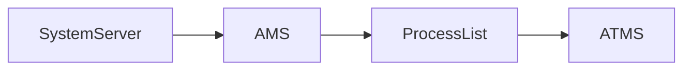
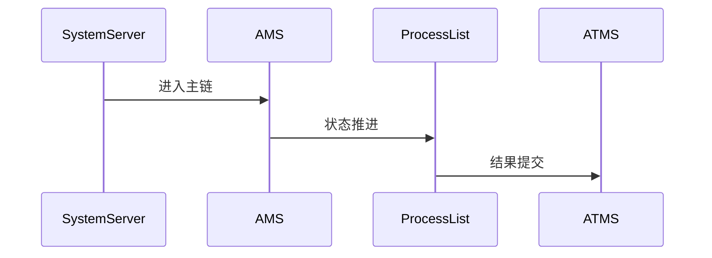

# AMS 源码分析

## 一、问题定义与范围
- 范围：当前仓库包含 AMS、ProcessList、Activity/Service/Broadcast 调度主干源码，可完成 Framework 主链分析。
- 现状：本次输出基于目录源码静态分析，不包含运行时日志。

## 二、主调用链
- SystemServer -> ActivityManagerService -> ProcessList -> ActiveServices/BroadcastQueue -> ActivityTaskManager
- 关键边界：重点关注 system_server、Binder、BufferQueue、SurfaceFlinger 等跨线程/跨进程收敛点。

## 三、设计思想与架构权衡
- AMS 以 system_server 为中心统一管理进程与组件生命周期，用集中式状态机换取全局一致性与回收策略可控性。

## 四、架构图（Mermaid）

## 五、时序图（Mermaid）

## 六、关键代码详细分析
- ActivityManagerService.systemReady()/startService 等入口决定生命周期分发起点。
- ProcessList.startProcessLocked 把组件请求收敛到进程创建与 LMKD/OOM 调整协同。
- AMS 最终通过 ATMS/WMS 协作把组件状态推进到可见窗口与前后台切换。

## 七、证据链（源码 + 运行时）
- 源码证据：`base/services/core/java/com/android/server/am/ActivityManagerService.java`
- 源码证据：`base/services/core/java/com/android/server/am/ProcessList.java`
- 运行时证据：当前目录仅含源码，无 logcat、dumpsys、Perfetto、Winscope，运行时证据未闭环。

## 八、根因结论与置信度
- 结论：当前仓库对 `aosp-ams` 的覆盖状态为 `FULL`。
- 置信度：`Highly Likely`。

## 九、修复建议
- 若用于问题定位，优先围绕上述入口继续下钻；若为仓库缺口，则先补齐缺失源码再做闭环判断。

## 十、验证计划
- 补采与本模块对应的 `logcat`、`dumpsys`、Perfetto 或 Winscope，并回到文中主链逐段比对。

## 十一、证据缺口与后续采集
- 缺口：缺少运行时证据。
- 后续：按本模块主链采集线程栈、事务、buffer、焦点或权限状态。
