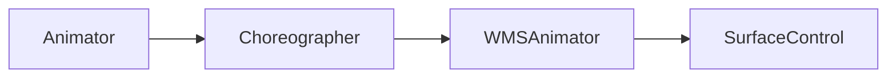
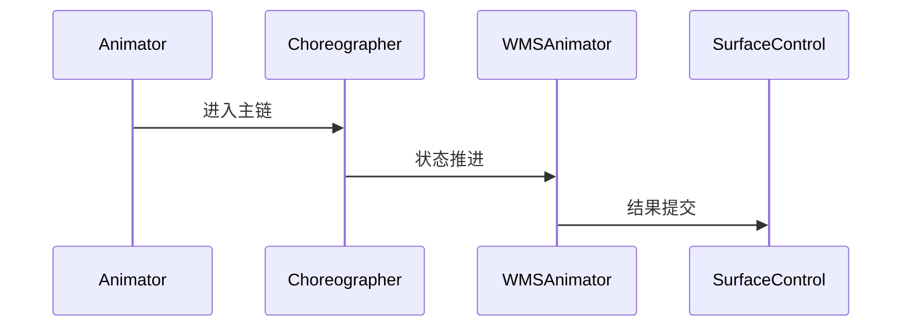

# Animation 源码分析

## 一、问题定义与范围
- 范围：当前仓库覆盖 ValueAnimator、WindowStateAnimator 与 WMS 动画相关主链。
- 现状：本次输出基于目录源码静态分析，不包含运行时日志。

## 二、主调用链
- Animator/Transition trigger -> Choreographer -> WindowStateAnimator/App transition -> Surface transaction
- 关键边界：重点关注 system_server、Binder、BufferQueue、SurfaceFlinger 等跨线程/跨进程收敛点。

## 三、设计思想与架构权衡
- 动画系统以 VSYNC 驱动为节拍，在 Java 与 WMS/SF 之间拆分逻辑与合成职责。

## 四、架构图（Mermaid）

## 五、时序图（Mermaid）

## 六、关键代码详细分析
- ValueAnimator 管理时间轴和插值，决定属性动画推进方式。
- WindowStateAnimator 把窗口动画收敛到 surface alpha/position 等可提交状态。
- 动画异常往往不是单点算法问题，而是节拍、事务、生效窗口三者失配。

## 七、证据链（源码 + 运行时）
- 源码证据：`base/core/java/android/animation/ValueAnimator.java`
- 源码证据：`base/services/core/java/com/android/server/wm/WindowStateAnimator.java`
- 运行时证据：当前目录仅含源码，无 logcat、dumpsys、Perfetto、Winscope，运行时证据未闭环。

## 八、根因结论与置信度
- 结论：当前仓库对 `aosp-animation` 的覆盖状态为 `FULL`。
- 置信度：`Highly Likely`。

## 九、修复建议
- 若用于问题定位，优先围绕上述入口继续下钻；若为仓库缺口，则先补齐缺失源码再做闭环判断。

## 十、验证计划
- 补采与本模块对应的 `logcat`、`dumpsys`、Perfetto 或 Winscope，并回到文中主链逐段比对。

## 十一、证据缺口与后续采集
- 缺口：缺少运行时证据。
- 后续：按本模块主链采集线程栈、事务、buffer、焦点或权限状态。
