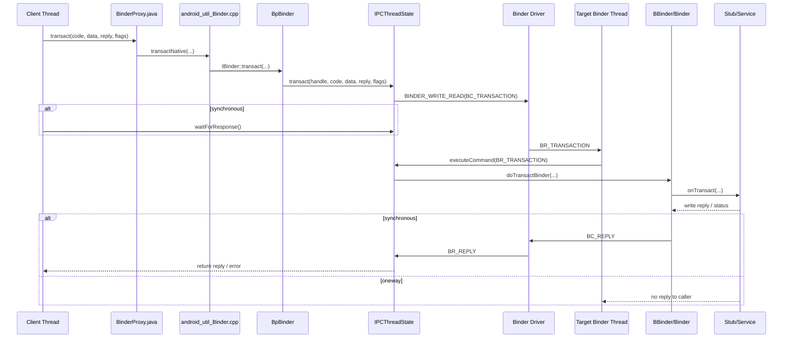

# AOSP Binder 源码分析

## 一、问题定义与范围
- 现象：用户要求分析 AOSP Binder 源码，目标是解释 Binder 在 Framework Java 层、JNI、native libbinder、Binder 线程池之间的主调用链与关键设计。
- 影响：该链路是 Android 系统服务 IPC 基础设施，直接影响 `system_server`、app 进程、native service 的跨进程调用、线程阻塞、权限身份传播和服务发现。
- 触发条件：任意 Java AIDL/手写 Binder 接口发起 `transact()`，或通过 `ServiceManager` 获取/注册服务时都会进入该机制。
- 版本范围：基于当前仓库 `/Users/yuchuan/CodeMX/MX/AOSP_Frameworks` 中 `base/` 与 `native/libs/binder/` 代码。
- 设备与构建信息：当前仅有源码仓，无设备日志、bugreport、Perfetto、binderfs 统计或内核 Binder driver 源码。
- 分析边界：本次是机制型源码分析，不对某一具体 ANR/死锁/慢事务做根因确认。

## 二、主调用链
- Java client 侧：AIDL Proxy 或手写 client 调用 `BinderProxy.transact()`。
- JNI 边界：`android_os_BinderProxy_transact()` 将 Java `Parcel` 转为 native `Parcel`，调用 native `IBinder::transact()`。
- native client 侧：`BpBinder::transact()` 做稳定性校验后转入 `IPCThreadState::transact()`。
- Driver 边界：`IPCThreadState::talkWithDriver()` 通过 `ioctl(fd, BINDER_WRITE_READ, ...)` 与 Binder driver 交换命令/数据。
- native server 侧：目标进程 Binder 线程在 `IPCThreadState::joinThreadPool()` 循环中接收 `BR_TRANSACTION`，由 `executeCommand()` 解析事务。
- Stub 分发：`doTransactBinder(...)` 进入 `BBinder::transact()`，再调用具体 `onTransact()`。
- Java server 侧：Java Binder 对象通过 `Binder.execTransact()` / `execTransactInternal()` 回到 `Binder.onTransact()`，通常再由 AIDL 生成的 Stub `onTransact()` 分发到真实服务实现。
- 同步等待点：
  - client 线程在 `IPCThreadState::waitForResponse()` 等待 `BR_REPLY`。
  - server 线程若无空闲 Binder 线程，则事务会在目标进程排队。
- 异步等待点：
  - `FLAG_ONEWAY` / `TF_ONE_WAY` 事务客户端不等 reply，但仍可能在服务端 oneway 队列和线程池上积压。

## 三、设计思想与架构权衡
- Binder 采用对象语义而不是裸字节流。收益是能直接传递 Binder 引用、死亡通知、UID/PID 身份；代价是引用管理、buffer 管理和线程模型更复杂。
- Binder 把 Java/Native 统一收敛到 libbinder + driver。收益是 Java service、native service 共用同一 IPC 基础设施；代价是问题定位必须跨 Java/JNI/native/driver 多层追踪。
- 同步事务默认 request/reply。收益是接口语义简单，调用方容易拿到错误码和返回值；代价是 caller 线程被 `waitForResponse()` 阻塞，容易把服务端慢路径放大成 ANR。
- `oneway` 降低 caller 等待。收益是避免同步阻塞；代价是服务端积压不再直接反馈给 caller，问题会转化为 binder thread 饥饿、延迟漂移或 oneway spam。
- Binder 线程池按需处理入站事务。收益是避免“一请求一线程”；代价是 `system_server` 这类共享线程池的进程容易被长事务、嵌套 Binder、持锁调用放大。
- `ServiceManager` 通过 context object/handle 0 暴露。收益是服务发现统一；代价是启动期 `waitForService()` 与 lazy service 拉起容易形成串行依赖。

## 四、架构图（Mermaid）

```mermaid
flowchart LR
    A[App/System Service Client] --> B[Java BinderProxy / AIDL Proxy]
    B --> C[JNI android_os_BinderProxy_transact]
    C --> D[libbinder BpBinder]
    D --> E[IPCThreadState]
    E --> F[Binder Driver via BINDER_WRITE_READ]
    F --> G[Target Process Binder Thread]
    G --> H[IPCThreadState::executeCommand]
    H --> I[BBinder::transact]
    I --> J[Java Binder.execTransact or Native onTransact]
    J --> K[Stub.onTransact]
    K --> L[Real Service Implementation]
    L --> M[reply Parcel]
    M --> F
    F --> E
```

## 五、时序图（Mermaid）

## 六、关键代码详细分析
### 6.1 Client 发起路径

#### 6.1.1 BinderProxy.transact 核心方法
- 代码位置：[base/core/java/android/os/BinderProxy.java](/Users/yuchuan/CodeMX/MX/AOSP_Frameworks/base/core/java/android/os/BinderProxy.java#L541)
- 线程/进程上下文：调用方线程，可能是 app 主线程、binder 回调线程或 system_server 工作线程。
- 输入输出：
  - 输入：事务码 `code`、请求 `Parcel data`、可选 `reply`、`flags`。
  - 输出：同步事务返回布尔值并可能填充 `reply`，异常通过 `RemoteException` 抛出。
- 关键逻辑：
  - `Binder.checkParcel(...)` 在 Java 层先做过大 Parcel 告警，避免无意识把超大对象推到 driver 路径。
  - 非 `FLAG_ONEWAY` 情况下会检查 blocking 警告状态，说明 Framework 明确把“同步 Binder 阻塞”视为需要治理的风险点。
  - `sTransactListener`、`Trace.traceBegin(...)`、`AppOpsManager.pauseNotedAppOpsCollection()` 都挂在真正跨进程发送前，说明这里也是统计和治理插桩点。
  - 最终通过 `transactNative(code, data, reply, flags)` 下沉到 JNI。
- 关键分支：
  - `FLAG_ONEWAY` 不代表“完全无成本”，只是 caller 不等业务 reply。
  - `reply != null && !warnOnBlocking` 时给 reply 打 `FLAG_IS_REPLY_FROM_BLOCKING_ALLOWED_OBJECT`，这是 Framework 对“谁可以合法阻塞”的显式标记。
- 设计意图：Java 层只保留策略控制、统计和 tracing，真正 IPC 语义下沉到 native，避免 Java 自己实现跨进程协议。
- 风险点：
  - UI 线程走到这里且未使用 `FLAG_ONEWAY` 时，后续所有 server 慢路径都会直接反映成 UI 卡顿。
  - 这里看不到真正阻塞点，很多误判会把问题归到 `BinderProxy.transact`，但它只是同步链路入口。

### 6.2 JNI 桥接路径

#### 6.2.1 android_os_BinderProxy_transact 桥接方法
- 代码位置：[base/core/jni/android_util_Binder.cpp](/Users/yuchuan/CodeMX/MX/AOSP_Frameworks/base/core/jni/android_util_Binder.cpp#L1542)
- 线程/进程上下文：仍在 client 原线程内执行，尚未切到目标进程。
- 输入输出：
  - 输入：Java `Parcel` 对象和 Java `BinderProxy`。
  - 输出：native `status_t` 被转换成 Java 布尔结果或异常。
- 关键逻辑：
  - `parcelForJavaObject(...)` 将 Java `Parcel` 映射到 native `Parcel`。
  - 从 `BinderProxyNativeData` 取出底层 `IBinder*`，随后调用 `target->transact(...)`。
  - `UNKNOWN_TRANSACTION` 被当作 `false` 返回，其它错误走 `signalExceptionForError(...)`，映射到 Java `RemoteException` / `RuntimeException`。
- 时序位置：对应时序图里 `BinderProxy.java -> JNI -> BpBinder`。
- 设计意图：JNI 层不做业务分发，只做对象桥接和错误语义转换。
- 风险点：
  - 如果 Java proxy 已 finalizer 清理，`target == NULL` 会直接抛 `IllegalStateException`，这是对象生命周期问题，不是远端服务问题。

### 6.3 native Client 发包路径

#### 6.3.1 BpBinder.transact 核心方法
- 代码位置：
  - [native/libs/binder/BpBinder.cpp](/Users/yuchuan/CodeMX/MX/AOSP_Frameworks/native/libs/binder/BpBinder.cpp#L394)
  - [native/libs/binder/IPCThreadState.cpp](/Users/yuchuan/CodeMX/MX/AOSP_Frameworks/native/libs/binder/IPCThreadState.cpp#L919)
- 线程/进程上下文：client 进程中的 native 调用线程。
- 输入输出：
  - 输入：binder handle、事务码、序列化后的 `Parcel`、事务 flag。
  - 输出：`status_t` 和可选 reply。
- 关键逻辑：
  - `BpBinder::transact()` 先做稳定性级别检查，再决定走 RPC Binder 还是 kernel Binder；本仓源码默认主路径仍是 `IPCThreadState::self()->transact(...)`。
  - `IPCThreadState::transact()` 先补 `TF_ACCEPT_FDS`，说明 Binder 默认允许 FD 跨进程传输。
  - `writeTransactionData(BC_TRANSACTION, ...)` 把 handle、code、flags、buffer 指针、offsets 指针打包成 `binder_transaction_data`，这是用户态协议包的核心收敛点。
  - 同步事务进入 `waitForResponse(reply)`；oneway 则只等待 transaction complete，不等业务 reply。
- 关键等待点：
  - 同步调用阻塞在 `waitForResponse()`。
  - 如果服务端线程池不足或服务端执行慢，caller 线程会一直卡在这里。
- 关键分支：
  - `mCallRestriction != NONE` 时，会对非 oneway 事务打日志甚至 fatal，说明某些进程被设计成只允许异步 Binder。
  - `status == DEAD_OBJECT` 时 `BpBinder` 会把 `mAlive` 置 0，后续再调不再尝试发给 driver。
- 设计意图：统一由 `IPCThreadState` 管理线程本地状态、driver 命令队列、caller 身份和 reply 处理，避免每个 Binder 对象自己管理 fd 通信。
- 风险点：
  - 大对象、高频小包、携带 FD 都在这里汇聚，性能问题通常先在这个点体现为 transaction 放大。

#### 6.3.2 writeTransactionData 协议封装方法
- 代码位置：[native/libs/binder/IPCThreadState.cpp](/Users/yuchuan/CodeMX/MX/AOSP_Frameworks/native/libs/binder/IPCThreadState.cpp#L1387)
- 作用：把用户态一次 Binder 调用压成一个标准 `binder_transaction_data` 包，并写入 `mOut` 命令流。
- 关键字段：
  - `tr.target.handle = handle`：目标远端对象句柄。
  - `tr.code = code`：事务码，最终对应 Stub 的分发分支。
  - `tr.flags = binderFlags`：是否 oneway、是否带状态码等。
  - `tr.data.ptr.buffer` / `tr.data.ptr.offsets`：序列化数据区和 Binder object offsets。
- 关键分支：
  - `data.errorCheck() == NO_ERROR` 时写正常业务数据。
  - 否则如果提供了 `statusBuffer`，会打上 `TF_STATUS_CODE` 直接传错误状态，不再传业务 payload。
- 分析意义：
  - 这一步是“Parcel 数据”到“Binder 协议包”的边界。
  - 大部分 `TransactionTooLarge`、对象 offsets 异常、FD 传递问题，最终都会沿这条路径进入 driver。

### 6.4 Driver 交互与阻塞路径

#### 6.4.1 talkWithDriver 与 waitForResponse 核心方法
- 代码位置：[native/libs/binder/IPCThreadState.cpp](/Users/yuchuan/CodeMX/MX/AOSP_Frameworks/native/libs/binder/IPCThreadState.cpp#L1163)
- 线程/进程上下文：仍在 caller 线程；这里是用户态 libbinder 与 kernel Binder driver 的真实边界。
- 输入输出：
  - 输入：`mOut` 中待发送命令流，`mIn` 作为接收缓冲。
  - 输出：更新 `mIn/mOut`，返回 `status_t`，必要时填充 `reply Parcel`。
- 关键逻辑：
  - `talkWithDriver()` 组装 `binder_write_read`，调用 `ioctl(mDriverFD, BINDER_WRITE_READ, &bwr)`。
  - `outAvail = (!doReceive || needRead) ? mOut.dataSize() : 0` 体现了“还有未消费输入时先不继续写”的协议节奏控制。
  - `waitForResponse()` 循环读取 driver 返回命令，重点处理 `BR_REPLY`、`BR_DEAD_REPLY`、`BR_FAILED_REPLY`、`BR_ONEWAY_SPAM_SUSPECT`。
  - `BR_REPLY` 路径把 driver 返回 buffer 重新绑定到 `reply Parcel`，避免再次复制用户态数据。
- 时序位置：对应时序图里 `IPCThreadState <-> Binder Driver`。
- 设计意图：把 write/read 批处理进一次 ioctl，减少用户态和内核态切换，同时保留命令流协议。
- 风险点：
  - caller 栈若卡在这里，原因可能是 server 慢、driver 队列堵塞、目标进程无可用 Binder 线程，不应直接判成 driver bug。
  - `BR_ONEWAY_SPAM_SUSPECT` 说明异步模型也会被滥用，oneway 不是无限容量队列。

### 6.5 Server 接收与分发路径

#### 6.5.1 executeCommand(BR_TRANSACTION) 核心方法
- 代码位置：[native/libs/binder/IPCThreadState.cpp](/Users/yuchuan/CodeMX/MX/AOSP_Frameworks/native/libs/binder/IPCThreadState.cpp#L1430)
- 线程/进程上下文：目标进程 Binder 线程池线程；如果是 `system_server`，这里是共享资源。
- 输入输出：
  - 输入：driver 发来的 `binder_transaction_data`。
  - 输出：本地 `Parcel buffer`、本地 `reply`，必要时回 `BC_REPLY`。
- 关键逻辑：
  - `buffer.ipcSetDataReference(...)` 直接引用 driver 提供的 buffer 和 offsets，不先反序列化成 Java/业务对象。
  - 进入事务前保存 `origPid/origUid/origSid/origWorkSource/...`，然后把 `mCallingPid/mCallingUid/mCallingSid` 切换成 sender 身份。
  - `tr.target.ptr` 非空时，先对目标对象的 weak ref 做 `attemptIncStrong(this)`，避免 Binder 对象已析构却被继续分发。
  - 同步事务执行完成后通过 `sendReply(reply, ...)` 回包；oneway 不回业务 reply。
  - 回包前 `buffer.setDataSize(0)` 是显式释放当前事务 buffer 的关键步骤，用来降低 reply-return race 导致的 buffer 占用放大。
  - 末尾恢复原来的 calling identity、strict mode、work source，保证一个 Binder 线程处理下一笔事务时不会串身份。
- 时序位置：对应时序图里 `Target Binder Thread -> executeCommand -> BBinder/Binder -> Stub`。
- 设计意图：caller 身份不是显式参数，而是由 Binder 线程上下文临时注入，这让服务端可以直接用 `Binder.getCallingUid()` 等接口做权限检查。
- 风险点：
  - 只要服务实现持锁、做慢 IO、或再发同步 Binder，这个 Binder 线程就会被长时间占用。
  - 如果身份恢复路径出错，会污染同一线程后续事务；源码这里专门保存并恢复一整组上下文，说明这是高风险区。

#### 6.5.2 BBinder.transact 与 Binder.execTransact 收敛点
- 代码位置：
  - [native/libs/binder/Binder.cpp](/Users/yuchuan/CodeMX/MX/AOSP_Frameworks/native/libs/binder/Binder.cpp#L411)
  - [base/core/java/android/os/Binder.java](/Users/yuchuan/CodeMX/MX/AOSP_Frameworks/base/core/java/android/os/Binder.java#L1399)
- 线程/进程上下文：服务端 Binder 线程，已经带有当前 caller identity。
- 输入输出：
  - 输入：已经构建好的 request `Parcel` 和空 `reply`。
  - 输出：`onTransact()` 的布尔结果、异常写回、reply 数据。
- 关键逻辑：
  - `BBinder::transact()` 统一处理少量保留事务码，其余落入 `onTransact()`。
  - Java Binder 对象通过 `execTransact()` / `execTransactInternal()` 取出 native `Parcel`，调用 `onTransact()`，并在异常时决定是否写回异常结果。
  - `execTransactInternal()` 中如果不是 oneway，`RemoteException|RuntimeException` 会被序列化到 `reply.writeException(e)`；如果是 oneway，异常只记日志，不会回给 caller。
  - Java 层还在这里挂了 observer、AIDL trace、heavy hitter watcher、AppOps noted collection，说明服务端治理点并不只在 client。
- 关键分支：
  - `FLAG_COLLECT_NOTED_APP_OPS` 会包裹 `onTransact()`，意味着某些权限/审计信息在 Binder 服务端路径采集。
  - `checkParcel(this, code, reply, ...)` 会对 reply 过大做告警，避免服务端把大对象回传给 caller。
- 设计意图：`BBinder` 负责 native 统一入口，`Binder.execTransact` 负责 Java Stub 侧策略增强，两者共同构成“服务端收敛点”。
- 风险点：
  - oneway 服务端异常很容易“静默丢给日志”，caller 看不到业务错误，只会感知状态不一致或延迟。
  - reply 过大、异常序列化、AIDL trace 等都发生在真正业务逻辑之后，容易被忽略为“尾部成本”。

#### 6.5.3 IPCThreadState.executeCommand(BR_TRANSACTION) 逐段讲解
- 代码位置：[native/libs/binder/IPCThreadState.cpp](/Users/yuchuan/CodeMX/MX/AOSP_Frameworks/native/libs/binder/IPCThreadState.cpp#L1510)
- 阶段 1，解析 driver 命令头：
  - `BR_TRANSACTION_SEC_CTX` 和 `BR_TRANSACTION` 共用一条主逻辑，只是前者多了 `secctx`。
  - 这说明 SELinux/security context 并不是另一套事务模型，而是同一事务模型上的扩展字段。
- 阶段 2，把 driver buffer 绑定成入站 `Parcel`：
  - `buffer.ipcSetDataReference(...)` 直接绑定 `tr.data.ptr.buffer` 和 `tr.data.ptr.offsets`。
  - 这里的输入仍然是 Binder 原始 buffer，尚未进入 AIDL Stub 的字段反序列化。
  - 分析性能问题时，这意味着“慢”可能发生在两类位置：
    - 到达这里之前，事务在队列/线程池里等待。
    - 到达这里之后，才开始实际业务解析和执行。
- 阶段 3，切换 Binder 线程的调用者身份：
  - `mCallingPid = tr.sender_pid`
  - `mCallingUid = tr.sender_euid`
  - `mCallingSid = tr_secctx.secctx`
  - `mLastTransactionBinderFlags = tr.flags`
  - 这一步是 `Binder.getCallingUid()`、`clearCallingIdentity()` 等 API 能工作的基础。
  - 同时先保存 `origPid/origUid/origSid/origWorkSource/...`，说明这条线程处理完后必须恢复现场。
- 阶段 4，确定目标 Binder 对象并分发：
  - `tr.target.ptr` 非空时，说明这是普通目标对象事务。
  - 先做 `attemptIncStrong(this)`，避免对象只剩 weak 引用时被误调用。
  - 成功后用 `tr.cookie` 转成 `BBinder*`，再调用 `doTransactBinder(...)`。
  - `tr.target.ptr` 为空时走 `the_context_object`，这就是 handle 0 / context manager 路径。
- 阶段 5，决定是否回包：
  - 同步事务：`(tr.flags & TF_ONE_WAY) == 0`，则 `sendReply(reply, ...)`。
  - oneway 事务：即使服务端产生 reply 或错误，也不会回给 caller，只做日志处理。
  - 这就是“oneway 不等于不执行，只是不返回业务结果”的源码落点。
- 阶段 6，恢复线程上下文：
  - 恢复 `mCallingPid/mCallingUid/mCallingSid/mWorkSource/...`。
  - 这一步如果缺失，会把上一个调用方身份污染到下一个事务，是 Binder 框架最不能出错的状态恢复点之一。

#### 6.5.4 Binder.execTransactInternal 逐段讲解
- 代码位置：[base/core/java/android/os/Binder.java](/Users/yuchuan/CodeMX/MX/AOSP_Frameworks/base/core/java/android/os/Binder.java#L1429)
- 阶段 1，建立服务端观察和 trace 上下文：
  - `observer.callStarted(...)` 建立一次事务观测会话。
  - `getTransactionTraceName(code)` 与 `Trace.traceBegin(...)` 让 AIDL 事务可以进系统 trace。
  - 这意味着 Java Binder 服务端不是“黑盒 onTransact”，而是已经被纳入可观测框架。
- 阶段 2，选择是否采集 AppOps：
  - `FLAG_COLLECT_NOTED_APP_OPS` 分支会在 `onTransact()` 外围包一层 `AppOpsManager.startNotedAppOpsCollection(...)`。
  - 这说明一些权限审计是在 Binder 服务端执行窗口内采集的，不是单纯靠 caller 侧记账。
- 阶段 3，真正调用 `onTransact()`：
  - 这里没有再走 `transact()`，而是直接调用 `onTransact()`，因为请求已经从 IPC 进入服务端，没必要再做本地 parcel rewind 包装。
  - 对 AIDL 接口来说，这一步通常进入生成的 `Stub.onTransact()`，再转到具体服务方法。
- 阶段 4，处理异常与 reply：
  - 如果 `onTransact()` 抛 `RemoteException|RuntimeException`：
    - oneway：只记日志和 `onUnhandledException(...)`，caller 看不到明确异常 reply。
    - synchronous：先清空 `reply`，再 `reply.writeException(e)`。
  - 这就是 Java caller 侧 `readException()` 能拿到服务端异常的根源。
- 阶段 5，结束观测与尾部检查：
  - `observer.callEnded(...)` 回填 request size、reply size、workSourceUid。
  - `checkParcel(this, code, reply, ...)` 对 reply 过大打告警。
  - `StrictMode.clearGatheredViolations()` 清理本线程累计的 strict mode 状态，避免串到下一笔 Binder 事务。

### 6.6 线程池与线程模型

#### 6.6.1 ProcessState.startThreadPool 与 IPCThreadState.joinThreadPool
- 代码位置：
  - [native/libs/binder/ProcessState.cpp](/Users/yuchuan/CodeMX/MX/AOSP_Frameworks/native/libs/binder/ProcessState.cpp#L220)
  - [native/libs/binder/IPCThreadState.cpp](/Users/yuchuan/CodeMX/MX/AOSP_Frameworks/native/libs/binder/IPCThreadState.cpp#L839)
- 线程/进程上下文：服务端进程初始化阶段及其后续 Binder loop 线程。
- 关键逻辑：
  - `ProcessState::startThreadPool()` 只在首次调用时真正 `spawnPooledThread(true)`，不是每次事务都扩线程。
  - `joinThreadPool()` 把线程声明成 `BC_ENTER_LOOPER` 或 `BC_REGISTER_LOOPER`，随后循环执行 `getAndExecuteCommand()`。
  - 当非主 looper 线程 `TIMED_OUT` 时可退出，说明线程池并非无上限常驻。
- 设计意图：用受控线程池消费 driver 事务，而不是“来一个事务建一个线程”。
- 风险点：
  - 线程池配置过小会排队，配置过大则增加内存和调度成本；真正瓶颈通常仍是慢事务而不是线程数本身。

### 6.7 ServiceManager 与上下文对象路径

#### 6.7.1 ServiceManager.getIServiceManager 与 ProcessState.getContextObject
- 代码位置：
  - [base/core/java/android/os/ServiceManager.java](/Users/yuchuan/CodeMX/MX/AOSP_Frameworks/base/core/java/android/os/ServiceManager.java#L149)
  - [native/libs/binder/ProcessState.cpp](/Users/yuchuan/CodeMX/MX/AOSP_Frameworks/native/libs/binder/ProcessState.cpp#L183)
  - [native/libs/binder/IServiceManager.cpp](/Users/yuchuan/CodeMX/MX/AOSP_Frameworks/native/libs/binder/IServiceManager.cpp#L333)
- 关键逻辑：
  - Java `ServiceManager.getIServiceManager()` 通过 `BinderInternal.getContextObject()` 拿 handle 0，再 `asInterface(...)` 成 `IServiceManager`。
  - `ProcessState::getContextObject()` 本质是 `getStrongProxyForHandle(0)`，说明 ServiceManager 是 Binder 上下文管理者暴露出来的根对象。
  - `defaultServiceManager()` 通过 `CppBackendShim` 包装统一服务管理后端。
- 设计意图：Android 把“服务发现”也建立在 Binder 自身之上，避免额外注册中心协议。

## 七、证据链（源码 + 运行时）
### 源码证据
- Java client 发起点：
  - [BinderProxy.java](/Users/yuchuan/CodeMX/MX/AOSP_Frameworks/base/core/java/android/os/BinderProxy.java#L541) `transact(...)`
- JNI 桥接：
  - [android_util_Binder.cpp](/Users/yuchuan/CodeMX/MX/AOSP_Frameworks/base/core/jni/android_util_Binder.cpp#L1542) `android_os_BinderProxy_transact(...)`
- native client 发包：
  - [BpBinder.cpp](/Users/yuchuan/CodeMX/MX/AOSP_Frameworks/native/libs/binder/BpBinder.cpp#L394) `BpBinder::transact(...)`
  - [IPCThreadState.cpp](/Users/yuchuan/CodeMX/MX/AOSP_Frameworks/native/libs/binder/IPCThreadState.cpp#L919) `IPCThreadState::transact(...)`
- driver 交互与 reply：
  - [IPCThreadState.cpp](/Users/yuchuan/CodeMX/MX/AOSP_Frameworks/native/libs/binder/IPCThreadState.cpp#L1163) `waitForResponse(...)`
  - [IPCThreadState.cpp](/Users/yuchuan/CodeMX/MX/AOSP_Frameworks/native/libs/binder/IPCThreadState.cpp#L1268) `talkWithDriver(...)`
- server 收包与分发：
  - [IPCThreadState.cpp](/Users/yuchuan/CodeMX/MX/AOSP_Frameworks/native/libs/binder/IPCThreadState.cpp#L1510) `BR_TRANSACTION`
  - [Binder.cpp](/Users/yuchuan/CodeMX/MX/AOSP_Frameworks/native/libs/binder/Binder.cpp#L411) `BBinder::transact(...)`
  - [Binder.java](/Users/yuchuan/CodeMX/MX/AOSP_Frameworks/base/core/java/android/os/Binder.java#L1399) `execTransact(...)`
- 服务发现：
  - [ServiceManager.java](/Users/yuchuan/CodeMX/MX/AOSP_Frameworks/base/core/java/android/os/ServiceManager.java#L149) `getIServiceManager()`
  - [ProcessState.cpp](/Users/yuchuan/CodeMX/MX/AOSP_Frameworks/native/libs/binder/ProcessState.cpp#L183) `getContextObject(...)`

### 运行时证据
- 当前缺失：没有 `logcat`、`dumpsys binder*`、`/dev/binderfs`、Perfetto、bugreport、kernel trace，因此不能把本次分析升级为某个问题的已确认根因。
- 针对本机制，建议采集的运行时证据：
  - `dumpsys binder_calls_stats --full`：确认高频/慢事务、调用方 UID、接口名。
  - `dumpsys activity binder-proxies` 或 Binder proxy count：确认 proxy 泄漏/暴涨。
  - binderfs 节点：`/dev/binderfs/binder_logs/state`、`stats`，确认线程池、pending transaction、death notification。
  - Perfetto：启用 `binder_driver`、`binder_lock`、`sched`、`freq`、`am` 等轨道，确认 caller 等待与服务端执行时长。
  - system_server traces / app traces：确认 Binder thread 是否被慢 IO、锁竞争或嵌套调用占住。

### 关键结论与证据绑定
- 结论 1：同步 Binder 的核心阻塞点在 client `waitForResponse()`，不是 Java `BinderProxy` 本身。
  - 源码证据：`IPCThreadState::transact()` 在非 oneway 分支调用 `waitForResponse()`。
  - 运行时证据：需要 Perfetto 或线程栈看到 caller 卡在 Binder reply wait。
- 结论 2：服务端权限身份来自 Binder 线程上下文切换，而非业务层手动传参。
  - 源码证据：`executeCommand(BR_TRANSACTION)` 写入 `mCallingPid/mCallingUid/mCallingSid`，Java 层再经 `Binder.getCallingUid()` 读取。
  - 运行时证据：需要服务端日志、审计日志或 trace 验证权限校验时读取的 UID。
- 结论 3：Binder 线程池饥饿会把服务端慢事务放大为 caller 侧普遍卡顿。
  - 源码证据：`joinThreadPool()` 持续循环处理入站事务；源码中已有 starvation log 分支。
  - 运行时证据：需要 binderfs state、Perfetto、ANR trace 看到线程池满载或事务排队。

## 八、根因结论与置信度
- App 层：若 app 主线程发起同步 Binder，最容易在 server 变慢时被放大为卡顿或 ANR。
- Framework 层：`BinderProxy -> JNI -> BpBinder -> IPCThreadState -> executeCommand -> Binder/BBinder` 是当前仓内已确认的主调用链。
- Native 层：真正的协议收发、caller identity、reply 处理、线程池循环主要在 libbinder 的 `IPCThreadState`/`ProcessState`。
- Kernel 层：当前仓库缺少 `drivers/android/binder.c`，无法在本仓直接闭合 driver 内部 `binder_transaction`、唤醒策略、buffer 分配实现。
- 置信度：
  - 主调用链与分层关系：`Confirmed`
  - 线程池饥饿、oneway 积压、嵌套 Binder 放大阻塞属于常见问题模式，但当前无具体运行时证据：`Highly Likely`
  - 任一具体线上故障根因：`Speculative`

## 九、修复建议
- 若目标是降低 Binder 卡顿：
  - 避免主线程发同步 Binder，能 `oneway` 的接口不要做 request/reply。
  - 避免 Binder 线程内做慢 IO、长锁区、嵌套跨服务同步调用。
  - 合并高频小 IPC，减少 getter 式跨进程轮询。
  - 大对象改 FD/shared memory/分段拉取，避免大 Parcel 压力。
- 若目标是降低 system_server 风险：
  - 针对关键服务建立 Binder 耗时统计和 heavy hitter 监控。
  - 审核 `waitForService()` 和启动期串行依赖，避免服务发现阻塞引导后续链路。
  - 合理设置和验证线程池大小，但不要把“加线程”当成唯一解，先削减慢事务。
- 若目标是做源码深入分析：
  - 补充对应 AIDL 生成 Stub/Proxy、目标系统服务 `onTransact()`、以及内核 Binder driver 源码。

## 十、验证计划
- 功能回归：
  - 验证目标服务的 `getService/checkService/waitForService`、同步调用、oneway 调用都正常返回。
- 性能回归：
  - 采集 `binder_calls_stats` 前后对比平均耗时、P95/P99、调用频率、最大 Parcel 大小。
- 稳定性回归：
  - 压测 Binder 线程池，观察是否出现 thread starvation、dead reply、oneway spam suspect。
- 边界场景验证：
  - 大 Parcel、服务未启动、服务死亡、caller 主线程、嵌套 Binder、冻结进程、权限失败。

## 十一、证据缺口与后续采集
- 缺口 1：没有具体问题现象和日志，无法判断本次分析应聚焦同步阻塞、oneway 堆积、死亡通知还是 ServiceManager 路径。
- 缺口 2：当前仓缺少 Binder driver 源码，无法直接分析 `binder_transaction()`、buffer 分配、线程唤醒内核细节。
- 缺口 3：未提供任何运行时证据，无法确认哪个服务/接口最慢。
- 后续采集建议：
  - 指定一个目标服务或事务，例如 AMS/WMS/PMS 某条 Binder 调用。
  - 提供 ANR trace、Perfetto、`dumpsys binder_calls_stats --full`、binderfs state。
  - 如需跨到内核层，再补 kernel 仓中的 Binder driver 源码。
