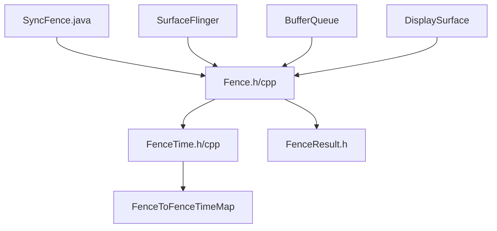
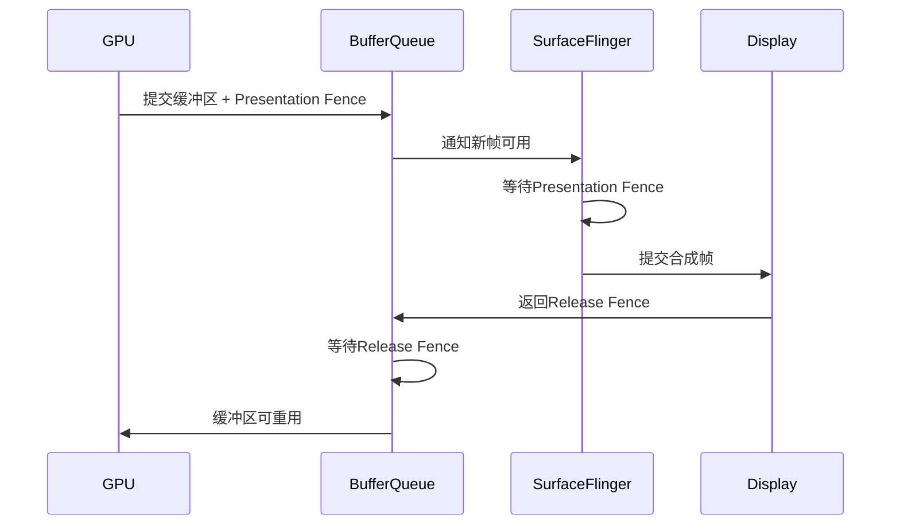

# AOSP Fence 源码分析

## 概述

Fence是Android图形系统中关键的同步原语，用于协调GPU、显示控制器和其他硬件单元之间的工作同步。Fence机制确保在图形渲染、显示合成等操作中的正确时序和资源安全访问。

## Fence 架构分析

### 1. Fence 类层次结构



### 2. 核心组件分析

#### 2.1 SyncFence (Java层)

**位置**: `base/core/java/android/hardware/SyncFence.java`

**核心职责**:
- 提供Java层的Fence封装
- 支持Parcelable序列化
- 管理Native Fence的生命周期

**关键实现**:
```java
public final class SyncFence implements AutoCloseable, Parcelable {
    // 信号时间常量
    public static final long SIGNAL_TIME_INVALID = -1;
    public static final long SIGNAL_TIME_PENDING = Long.MAX_VALUE;
    
    // 等待机制
    public boolean awaitForever() {
        return await(-1);
    }
    
    // 信号时间获取
    public long getSignalTime() {
        synchronized (mCloser) {
            return mNativePtr != 0 ? nGetSignalTime(mNativePtr) : SIGNAL_TIME_INVALID;
        }
    }
}
```

#### 2.2 Fence (Native层)

**位置**: `native/libs/ui/include/ui/Fence.h`, `native/libs/ui/Fence.cpp`

**核心职责**:
- 底层Fence文件描述符管理
- 同步等待机制实现
- Fence合并操作

**关键实现**:
```cpp
class Fence : public LightRefBase<Fence>, public Flattenable<Fence> {
public:
    static const sp<Fence> NO_FENCE;
    static constexpr nsecs_t SIGNAL_TIME_PENDING = INT64_MAX;
    
    // 等待机制
    status_t wait(int timeout);
    status_t waitForever(const char* logname);
    
    // Fence合并
    static sp<Fence> merge(const char* name, const sp<Fence>& f1, const sp<Fence>& f2);
};
```

#### 2.3 FenceTime (信号时间管理)

**位置**: `native/libs/ui/include/ui/FenceTime.h`

**核心职责**:
- 缓存Fence的信号时间
- 提供线程安全的信号时间访问
- 自动关闭已完成的Fence

**关键实现**:
```cpp
class FenceTime {
public:
    struct Snapshot : public Flattenable<Snapshot> {
        enum class State {
            EMPTY,
            FENCE,
            SIGNAL_TIME,
        };
        
        State state{State::EMPTY};
        sp<Fence> fence{Fence::NO_FENCE};
        nsecs_t signalTime{Fence::SIGNAL_TIME_INVALID};
    };
    
    // 获取信号时间快照
    Snapshot getSnapshot() const;
};
```

## Fence 在图形系统中的作用

### 3. Fence 类型和用途

#### 3.1 Presentation Fence (显示Fence)
- **作用**: 表示GPU渲染完成，可以安全显示
- **产生**: GPU渲染完成后生成
- **使用**: SurfaceFlinger合成时等待

#### 3.2 Release Fence (释放Fence)
- **作用**: 表示显示完成，可以安全重用缓冲区
- **产生**: 显示控制器完成显示后生成
- **使用**: BufferQueue释放缓冲区时等待

#### 3.3 Acquire Fence (获取Fence)
- **作用**: 表示缓冲区可以安全写入
- **产生**: 生产者获取缓冲区时设置
- **使用**: GPU渲染前等待

### 4. Fence 在SurfaceFlinger中的使用

#### 4.1 BufferQueue中的Fence使用

```cpp
// BufferSlot中的Fence管理
struct BufferSlot {
    sp<Fence> mFence;           // 释放Fence
    sp<Fence> mAcquireFence;    // 获取Fence
    nsecs_t mQueueTime;         // 入队时间
    nsecs_t mPresentationTime;  // 显示时间
};
```

#### 4.2 DisplaySurface中的Fence同步

```cpp
// DisplaySurface接口中的Fence操作
class DisplaySurface {
public:
    // 准备帧，返回显示Fence
    virtual status_t prepareFrame(CompositionType compositionType) = 0;
    
    // 提交帧，返回释放Fence
    virtual sp<Fence> advanceFrame() = 0;
    
    // 等待缓冲区释放
    virtual void onFrameCommitted() = 0;
};
```

## Fence 同步机制分析

### 5. Fence 等待机制

#### 5.1 同步等待实现

```cpp
// Fence.cpp中的等待实现
status_t Fence::wait(int timeout) {
    ATRACE_CALL();
    if (mFenceFd == -1) {
        return NO_ERROR;  // 无效Fence视为已信号
    }
    int err = sync_wait(mFenceFd, timeout);
    return err < 0 ? -errno : status_t(NO_ERROR);
}
```

#### 5.2 信号时间获取

```cpp
// Fence信号时间获取实现
nsecs_t Fence::getSignalTime() const {
    if (mFenceFd == -1) {
        return SIGNAL_TIME_INVALID;
    }
    
    struct sync_file_info* finfo = sync_file_info(mFenceFd);
    if (finfo == nullptr) {
        return SIGNAL_TIME_INVALID;
    }
    
    // 遍历所有sync point，取最大时间戳
    uint64_t timestamp = 0;
    struct sync_fence_info* pinfo = sync_get_fence_info(finfo);
    for (size_t i = 0; i < finfo->num_fences; i++) {
        if (pinfo[i].timestamp_ns > timestamp) {
            timestamp = pinfo[i].timestamp_ns;
        }
    }
    
    sync_file_info_free(finfo);
    return timestamp;
}
```

### 6. Fence 合并机制

#### 6.1 多Fence合并

```cpp
// Fence合并实现
sp<Fence> Fence::merge(const char* name, const sp<Fence>& f1, const sp<Fence>& f2) {
    ATRACE_CALL();
    int result;
    
    // 处理无效Fence的情况
    if (f1->isValid() && f2->isValid()) {
        result = sync_merge(name, f1->mFenceFd, f2->mFenceFd);
    } else if (f1->isValid()) {
        result = sync_merge(name, f1->mFenceFd, f1->mFenceFd);
    } else if (f2->isValid()) {
        result = sync_merge(name, f2->mFenceFd, f2->mFenceFd);
    } else {
        return NO_FENCE;
    }
    
    if (result == -1) {
        return NO_FENCE;
    }
    return sp<Fence>(new Fence(result));
}
```

## Fence 性能优化分析

### 7. 内存优化策略

#### 7.1 FenceTime缓存机制
- 缓存已完成的Fence信号时间
- 避免重复查询内核空间
- 减少系统调用开销

#### 7.2 智能指针管理
- 使用sp<Fence>自动引用计数
- 防止Fence泄漏
- 自动关闭文件描述符

### 8. 性能监控指标

#### 8.1 Fence等待时间
- 平均等待时间
- 最大等待时间
- 等待超时统计

#### 8.2 Fence信号时间
- 信号延迟分布
- 信号时间准确性
- 同步点数量统计

## Fence 在实际应用中的使用

### 9. SurfaceControl中的Fence使用

```java
// BufferFlinger中的Fence使用示例
public class BufferFlinger {
    public void addBuffer(SurfaceControl.Transaction t, SurfaceControl surfaceControl) {
        t.setBuffer(
            surfaceControl,
            HardwareBuffer.createFromGraphicBuffer(buffer),
            null,
            (SyncFence fence) -> releaseCallback(fence, buffer)
        );
    }
    
    public void releaseCallback(SyncFence fence, GraphicBuffer buffer) {
        if (fence != null) {
            fence.awaitForever();  // 等待释放Fence
        }
        mBufferQ.add(buffer);      // 安全重用缓冲区
    }
}
```

### 10. 图形管线中的Fence流程



## 总结

Fence机制是Android图形系统的核心同步组件，通过文件描述符和内核同步框架实现高效的硬件间协调。其主要特点包括：

### 架构优势
1. **跨进程同步**: 通过文件描述符支持进程间Fence传递
2. **硬件加速**: 直接与GPU和显示控制器集成
3. **性能优化**: 缓存机制减少系统调用开销

### 设计亮点
1. **类型安全**: Java和Native层都有严格的类型检查
2. **资源管理**: 自动引用计数和文件描述符管理
3. **错误处理**: 完善的错误码和异常处理机制

### 应用价值
1. **显示流畅性**: 确保渲染和显示的时序正确
2. **资源安全**: 防止缓冲区访问冲突
3. **性能监控**: 提供详细的同步时间统计

Fence机制的成功实现为Android图形系统的稳定性和性能提供了坚实基础，是现代移动操作系统图形架构的重要范例。

