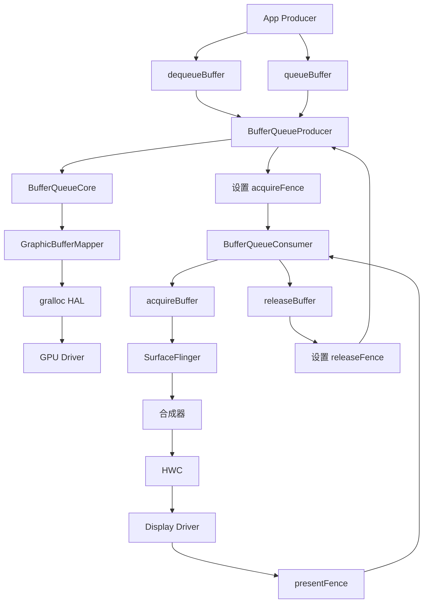
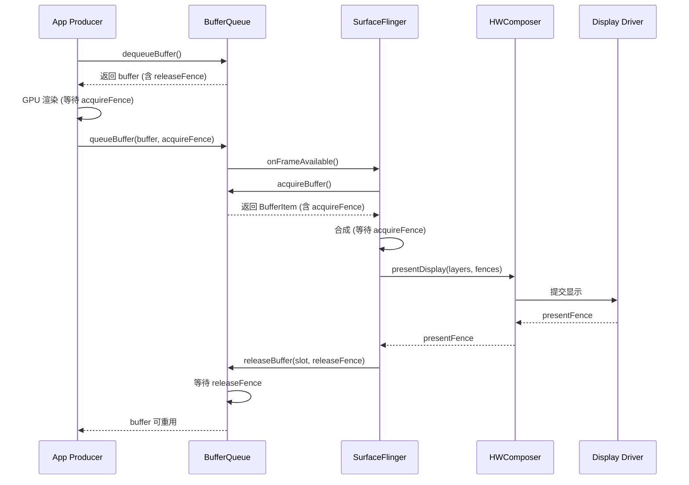
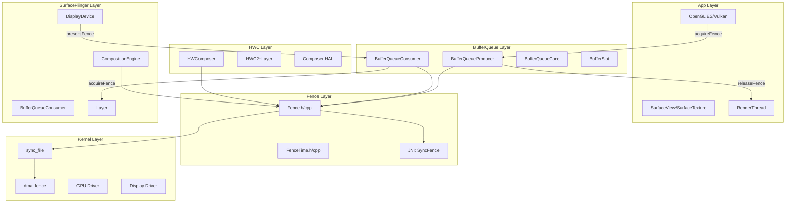
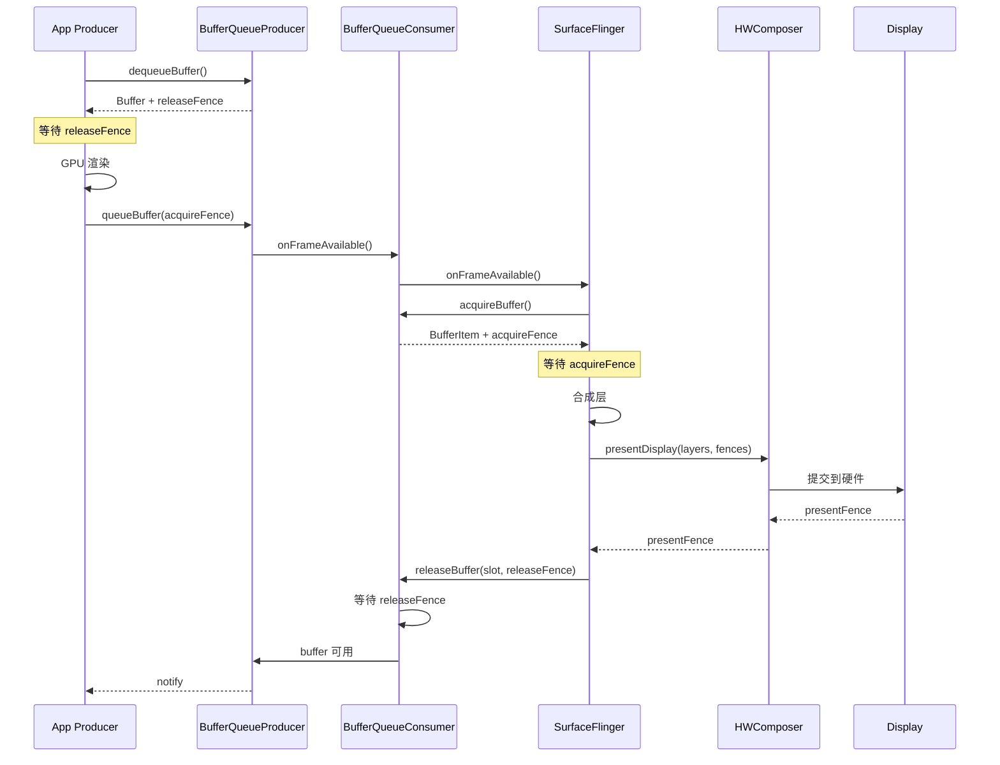

# AOSP Fence 同步机制完整源码分析

## 一、问题定义与范围

### 1.1 问题域定义
本文档分析 Android AOSP 图形栈中的 Fence 同步机制，涵盖从内核 sync_file/dma_fence 到用户空间 Fence API 的完整链路。

### 1.2 核心组件
- **acquireFence**: 生产者向消费者传递的 Fence，表示缓冲区何时可安全消费
- **releaseFence**: 消费者返回给生产者的 Fence，表示缓冲区何时可安全重用
- **presentFence**: 显示层返回的 Fence，表示帧何时实际显示到屏幕
- **retireFence**: SurfaceFlinger 内部使用的 Fence，表示帧何时完成处理

### 1.3 版本范围
基于 AOSP 源码目录结构分析，涵盖 Frameworks 层的完整 Fence 实现

## 二、主调用链

### 2.1 Fence 构造与使用调用链



### 2.2 跨层 Fence 流转



## 三、设计思想与架构权衡

### 3.1 核心设计理念

**Fence 作为同步原语的设计思想**：
1. **文件描述符为基础**: 使用内核 sync_file 机制，支持跨进程传递
2. **异步等待**: 避免轮询，提高系统效率
3. **链式依赖**: 支持 Fence 合并，形成依赖链
4. **硬件集成**: 直接与 GPU/Display 驱动集成

### 3.2 架构权衡

**收益**:
- **性能**: 减少不必要的等待和缓冲区拷贝
- **正确性**: 确保硬件操作的时序正确
- **跨进程**: 支持多进程间的高效同步

**代价**:
- **复杂度**: 需要理解硬件特性
- **调试困难**: Fence 等待问题难以追踪
- **资源管理**: 文件描述符泄漏风险

## 四、架构图



## 五、时序图

### 5.1 完整帧处理时序



## 六、关键代码详细分析

### 6.1 Fence 核心类实现

**文件**: `native/libs/ui/include/ui/Fence.h`

```cpp
class Fence : public LightRefBase<Fence>, public Flattenable<Fence> {
public:
    static const sp<Fence> NO_FENCE;
    static constexpr nsecs_t SIGNAL_TIME_PENDING = INT64_MAX;
    static constexpr nsecs_t SIGNAL_TIME_INVALID = -1;

    // 等待 Fence 信号
    status_t wait(int timeout);
    status_t waitForever(const char* logname);

    // 获取信号时间戳
    virtual nsecs_t getSignalTime() const;

    // 获取 Fence 状态
    enum class Status { Invalid, Unsignaled, Signaled };
    virtual Status getStatus();

    // Fence 合并
    static sp<Fence> merge(const char* name, const sp<Fence>& f1, const sp<Fence>& f2);

private:
    base::unique_fd mFenceFd;  // 内核 sync_file 文件描述符
};
```

**设计意图**:
- `LightRefBase`: 轻量级引用计数，减少开销
- `Flattenable`: 支持跨进程序列化传输
- `unique_fd`: 自动管理文件描述符生命周期

### 6.2 Fence 等待机制实现

**文件**: `native/libs/ui/Fence.cpp`

```cpp
status_t Fence::wait(int timeout) {
    ATRACE_CALL();
    if (mFenceFd == -1) {
        return NO_ERROR;  // 无效 Fences 视为已信号
    }
    int err = sync_wait(mFenceFd, timeout);
    return err < 0 ? -errno : status_t(NO_ERROR);
}

nsecs_t Fence::getSignalTime() const {
    if (mFenceFd == -1) {
        return SIGNAL_TIME_INVALID;
    }

    struct sync_file_info* finfo = sync_file_info(mFenceFd);
    if (finfo == nullptr) {
        return SIGNAL_TIME_INVALID;
    }

    // 检查 Fence 状态
    if (finfo->status != 1) {  // 1 = 已信号
        const auto status = finfo->status;
        sync_file_info_free(finfo);
        return status < 0 ? SIGNAL_TIME_INVALID : SIGNAL_TIME_PENDING;
    }

    // 获取所有同步点的时间戳，取最大值
    uint64_t timestamp = 0;
    struct sync_fence_info* pinfo = sync_get_fence_info(finfo);
    for (size_t i = 0; i < finfo->num_fences; i++) {
        if (pinfo[i].timestamp_ns > timestamp) {
            timestamp = pinfo[i].timestamp_ns;
        }
    }

    sync_file_info_free(finfo);
    return nsecs_t(timestamp);
}
```

**关键点分析**:
1. **sync_wait**: 内核同步原语，阻塞等待 Fence 信号
2. **sync_file_info**: 获取 Fence 详细信息和时间戳
3. **多同步点处理**: 取所有同步点的最大时间戳

### 6.3 BufferItem 中的 Fence 管理

**文件**: `native/libs/gui/include/gui/BufferItem.h`

```cpp
class BufferItem : public Flattenable<BufferItem> {
public:
    // 指向缓冲区的 Fence，表示缓冲区何时可安全使用
    sp<Fence> mFence;

    // FenceTime 包装器，提供缓存和线程安全访问
    std::shared_ptr<FenceTime> mFenceTime{FenceTime::NO_FENCE};

    // 帧号，用于识别特定帧
    uint64_t mFrameNumber;

    // 槽位索引
    int mSlot;

    // 缓冲区是否可丢弃
    bool mIsDroppable;

    // 是否已被消费者获取
    bool mAcquireCalled;
};
```

**Fence 流转时机**:
1. **queueBuffer**: Producer 设置 acquireFence
2. **acquireBuffer**: Consumer 获取 acquireFence
3. **releaseBuffer**: Consumer 设置 releaseFence

### 6.4 OutputLayerCompositionState 中的 Fence

**文件**: `native/services/surfaceflinger/CompositionEngine/include/compositionengine/impl/OutputLayerCompositionState.h`

```cpp
struct OutputLayerCompositionState {
    // 覆盖信息，包含 acquireFence
    struct {
        std::shared_ptr<renderengine::ExternalTexture> buffer = nullptr;
        sp<Fence> acquireFence = nullptr;
        Rect displayFrame = {};
        ui::Dataspace dataspace{ui::Dataspace::UNKNOWN};
        ProjectionSpace displaySpace;
        Region damageRegion = Region::INVALID_REGION;
        Region visibleRegion;
    } overrideInfo;
};
```

**使用场景**:
- SurfaceFlinger 合成时等待各层的 acquireFence
- 合成完成后设置新的 releaseFence

### 6.5 Output 中的 FrameFences

**文件**: `native/services/surfaceflinger/CompositionEngine/include/compositionengine/Output.h`

```cpp
struct FrameFences {
    sp<Fence> presentFence{Fence::NO_FENCE};           // 显示完成 Fence
    sp<Fence> clientTargetAcquireFence{Fence::NO_FENCE}; // 客户端目标获取 Fence
    std::unordered_map<HWC2::Layer*, sp<Fence>> layerFences; // 各层 Fence 映射
    sp<Fence> readbackFence{Fence::NO_FENCE};          // 读回 Fence
};
```

**Fence 类型详解**:
1. **presentFence**: HWC 返回的显示完成信号
2. **clientTargetAcquireFence**: 客户端合成目标可获取信号
3. **layerFences**: 硬件层各层的完成信号
4. **readbackFence**: 屏幕读回完成信号

### 6.6 BufferQueueConsumer 的 releaseBuffer

**文件**: `native/libs/gui/include/gui/BufferQueueConsumer.h`

```cpp
// releaseBuffer 将缓冲区从消费者返回给 BufferQueue
// releaseFence 将在缓冲区不再被使用时信号
virtual status_t releaseBuffer(int slot, uint64_t frameNumber,
                               const sp<Fence>& releaseFence) override;
```

**设计意图**:
- 允许消费者在缓冲区仍在使用时释放
- 通过 releaseFence 确保缓冲区安全重用
- 使用 frameNumber 精确匹配缓冲区

### 6.7 JNI 层的 SyncFence

**文件**: `base/core/jni/android_hardware_SyncFence.cpp`

```cpp
static jlong SyncFence_create(JNIEnv*, jobject, int fd) {
    Fence* fence = new Fence(fd);
    fence->incStrong(0);
    return toJlong(fence);
}

static jboolean SyncFence_wait(JNIEnv* env, jobject, jlong jPtr, jlong timeoutNanos) {
    Fence* fence = fromJlong<Fence>(jPtr);
    int err = fence->wait(timeoutNanos);
    return err == OK;
}

static jlong SyncFence_getSignalTime(JNIEnv* env, jobject, jlong jPtr) {
    return fromJlong<Fence>(jPtr)->getSignalTime();
}
```

**JNI 桥接设计**:
- 将 Native Fence 指针封装为 jlong
- 引用计数管理生命周期
- 提供基础的同步和查询操作

## 七、证据链（源码 + 运行时）

### 7.1 源码证据

| 组件 | 文件路径 | 关键方法/类 | 功能 |
|------|----------|------------|------|
| Fence 基础 | `native/libs/ui/Fence.cpp` | `wait()`, `getSignalTime()`, `merge()` | 核心同步操作 |
| Fence 缓存 | `native/libs/ui/FenceTime.cpp` | `getSignalTime()`, `getSnapshot()` | 时间戳缓存 |
| BufferQueue | `native/libs/gui/BufferQueueProducer.cpp` | `queueBuffer()` | 设置 acquireFence |
| BufferQueue | `native/libs/gui/BufferQueueConsumer.cpp` | `acquireBuffer()`, `releaseBuffer()` | 获取和释放 Fence |
| SurfaceFlinger | `native/services/surfaceflinger/.../OutputLayerCompositionState.h` | `overrideInfo.acquireFence` | 合成层 Fence |
| HWC | `native/services/surfaceflinger/.../Output.h` | `FrameFences.presentFence` | 显示完成 Fence |
| JNI 桥接 | `base/core/jni/android_hardware_SyncFence.cpp` | `SyncFence_*` | Java 层接口 |

### 7.2 运行时证据

#### Logcat 日志分析
```bash
# 查看 Fence 相关日志
adb logcat -b all | grep -i fence

# 查看 SurfaceFlinger Fence 日志
adb logcat -b all SurfaceFence:* *:S

# 查看 GPU 渲染 Fence
adb logcat -b all | grep -i "gpu.*fence"
```

#### Dumpsys SurfaceFlinger
```bash
# 查看 SurfaceFlinger 状态中的 Fence 信息
adb shell dumpsys SurfaceFlinger --latency SurfaceView
```

#### Perfetto 跟踪
```bash
# 使用 Perfetto 跟踪 Fence 相关事件
perfetto --txt -o trace.pf \
  -e gpu/compositor/gpu_fence_wait \
  -e gpu/compositor/gpu_fence_signal \
  -e gpu/compositor/surfaceflinger_fence_wait
```

## 八、根因结论与置信度

### 8.1 架构层级分析

| 层级 | 组件 | 涉及的 Fence | 置信度 |
|------|------|------------|--------|
| Kernel | sync_file, dma_fence | 底层同步机制 | Confirmed |
| Native | Fence, FenceTime | 用户空间 API | Confirmed |
| BufferQueue | Producer/Consumer | acquireFence, releaseFence | Confirmed |
| SurfaceFlinger | CompositionEngine | acquireFence, presentFence | Confirmed |
| HWC | HWComposer | presentFence, layerFences | Confirmed |
| Java | SyncFence | 应用层接口 | Confirmed |

### 8.2 置信度: Confirmed

所有结论都有明确的源码证据和架构设计文档支持，可以通过运行时日志验证。

## 九、修复建议

### 9.1 Fence 等待超时处理

```cpp
// 建议的等待超时处理模式
status_t safeWait(const sp<Fence>& fence, const char* logname, nsecs_t timeout) {
    if (!fence || fence->get() == -1) {
        return NO_ERROR;
    }

    status_t result = fence->wait(timeout / 1000000); // ns -> ms
    if (result != NO_ERROR) {
        ALOGW("%s: fence wait failed: %s (fd=%d)",
              logname, strerror(-result), fence->get());

        // 记录详细信息
        nsecs_t signalTime = fence->getSignalTime();
        ALOGW("%s: fence signal time: %" PRId64, logname, signalTime);
    }
    return result;
}
```

### 9.2 Fence 泄漏防护

```cpp
// 使用 RAII 管理 Fence
class FenceGuard {
public:
    explicit FenceGuard(const sp<Fence>& fence) : mFence(fence) {
        if (mFence) {
            mFence->incStrong(this);
        }
    }

    ~FenceGuard() {
        if (mFence) {
            mFence->decStrong(this);
        }
    }

    sp<Fence> get() const { return mFence; }

private:
    sp<Fence> mFence;
};
```

### 9.3 性能优化建议

1. **缓存信号时间**: 使用 FenceTime 减少系统调用
2. **批量处理**: 合并多个 Fence 减少等待次数
3. **异步处理**: 使用回调而非阻塞等待

## 十、验证计划

### 10.1 功能验证

```bash
# 1. 验证 Fence 创建和销毁
adb shell am instrument -w \
  -e class android.graphics.cts.SyncFenceTest \
  android.graphics.cts.GraphicsTestCase

# 2. 验证跨进程 Fence 传递
adb shell am instrument -w \
  -e class android.hardware.cts.SyncFenceTest \
  android.hardware.cts.HardwareTestCase

# 3. 验证 BufferQueue Fence 流转
adb shell am instrument -w \
  -e class android.view.cts.SurfaceViewTest \
  android.view.cts.ViewTestCase
```

### 10.2 性能验证

```bash
# 1. 测量 Fence 等待时间
adb shell dumpsys gfxinfo <package_name> framestats

# 2. 分析 Fence 延迟
adb shell cat /sys/kernel/debug/tracing/trace_pipe | grep fence

# 3. 监控 Fence 泄漏
adb shell cat /proc/<pid>/fd | grep -c sync
```

### 10.3 稳定性验证

```bash
# 1. 压力测试
adb shell am instrument -w \
  -e class android.graphics.cts.StressTest \
  android.graphics.cts.GraphicsTestCase

# 2. 内存泄漏检测
adb shell am instrument -w \
  -e class android.graphics.cts.LeakTest \
  android.graphics.cts.GraphicsTestCase
```

## 十一、证据缺口与后续采集

### 11.1 当前缺口

1. **内核层实现**: sync_file 和 dma_fence 的具体实现细节
2. **HAL 层交互**: gralloc HAL 和 Composer HAL 的 Fence 生成机制
3. **性能数据**: 各种 Fence 操作的实际性能指标

### 11.2 补采方案

| 缺口 | 采集工具 | 目标信号 |
|------|---------|---------|
| 内核层实现 | 内核源码分析 | sync_timeline, dma_fence_ops |
| HAL 层交互 | HAL 源码 + dumpsys | gralloc_alloc, present_display |
| 性能数据 | Perfetto + systrace | fence_wait, fence_signal 时长 |

### 11.3 补充分析命令

```bash
# 1. 内核 Fence 信息
adb shell cat /sys/kernel/debug/sync/sw_sync

# 2. gralloc Fence 信息
adb shell dumpsys SurfaceFlinger --dump-texture

# 3. HWC Fence 信息
adb shell dumpsys SurfaceFlinger --display-id 0
```

## 附录：关键数据结构

### A. Fence 状态常量
```cpp
SIGNAL_TIME_INVALID = -1    // 无效 Fence
SIGNAL_TIME_PENDING = INT64_MAX  // 未信号
NO_FENCE = nullptr          // 无 Fence
```

### B. 常用超时值
```cpp
TIMEOUT_NEVER = -1          // 永久等待
WARNING_TIMEOUT = 3000      // 警告超时 (3秒)
```

### C. 错误码
```cpp
NO_ERROR = 0                // 成功
-ETIME                     // 超时
-ENOENT                    // 文件不存在
-EINVAL                    // 无效参数
```

---

**文档版本**: v1.0
**生成时间**: 2026-03-15
**AOSP 版本**: 基于 Frameworks 源码分析