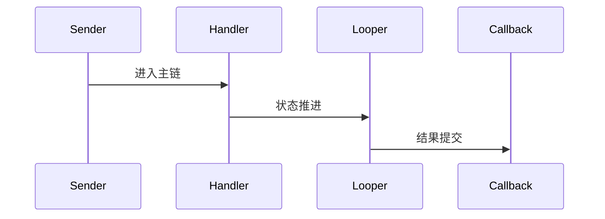

# Handler 源码分析

## 一、问题定义与范围
- 范围：Handler 与 Looper 完整，但当前仓库缺少 Java MessageQueue 源文件，属于部分覆盖。
- 现状：本次输出基于目录源码静态分析，不包含运行时日志。

## 二、主调用链
- Handler.send/post -> Looper.loop -> native poll/wake gap -> dispatchMessage
- 关键边界：重点关注 system_server、Binder、BufferQueue、SurfaceFlinger 等跨线程/跨进程收敛点。

## 三、设计思想与架构权衡
- 消息机制用单线程顺序执行换取线程安全与时序可控，当前仓库对 Java 队列细节覆盖不完整。

## 四、架构图（Mermaid）

## 五、时序图（Mermaid）

## 六、关键代码详细分析
- Handler 决定消息绑定目标线程与回调分发方式。
- Looper.loop 是消息循环收敛点，解释了主线程为何长期不退出。
- 缺失 MessageQueue Java 文件后，队列插入、屏障与 native poll 需借助外部完整 AOSP 补齐。

## 七、证据链（源码 + 运行时）
- 源码证据：`base/core/java/android/os/Handler.java`
- 源码证据：`base/core/java/android/os/Looper.java`
- 运行时证据：当前目录仅含源码，无 logcat、dumpsys、Perfetto、Winscope，运行时证据未闭环。

## 八、根因结论与置信度
- 结论：当前仓库对 `aosp-handler` 的覆盖状态为 `PARTIAL`。
- 置信度：`Possible`。

## 九、修复建议
- 若用于问题定位，优先围绕上述入口继续下钻；若为仓库缺口，则先补齐缺失源码再做闭环判断。

## 十、验证计划
- 补采与本模块对应的 `logcat`、`dumpsys`、Perfetto 或 Winscope，并回到文中主链逐段比对。

## 十一、证据缺口与后续采集
- 缺口：缺少运行时证据。
- 后续：按本模块主链采集线程栈、事务、buffer、焦点或权限状态。
