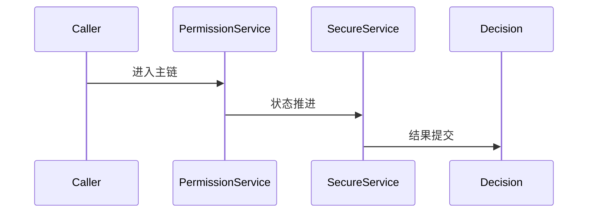

# Security 源码分析

## 一、问题定义与范围
- 范围：权限服务与锁设置服务存在，可分析权限边界、鉴权与系统服务安全面的一部分。
- 现状：本次输出基于目录源码静态分析，不包含运行时日志。

## 二、主调用链
- Permission request -> PermissionManagerService -> service-side checks -> access decision
- 关键边界：重点关注 system_server、Binder、BufferQueue、SurfaceFlinger 等跨线程/跨进程收敛点。

## 三、设计思想与架构权衡
- Android 安全把安装期签名/权限和运行期服务端检查结合，形成多层边界。

## 四、架构图（Mermaid）

## 五、时序图（Mermaid）

## 六、关键代码详细分析
- PermissionManagerService 负责权限定义、授予、撤销与持久化。
- LockSettingsService 体现系统关键资产的服务端安全边界。
- 越权分析必须同时看调用方身份、Binder 清身份与服务端二次校验。

## 七、证据链（源码 + 运行时）
- 源码证据：`base/services/core/java/com/android/server/pm/permission/PermissionManagerService.java`
- 源码证据：`base/services/core/java/com/android/server/locksettings/LockSettingsService.java`
- 运行时证据：当前目录仅含源码，无 logcat、dumpsys、Perfetto、Winscope，运行时证据未闭环。

## 八、根因结论与置信度
- 结论：当前仓库对 `aosp-security` 的覆盖状态为 `FULL`。
- 置信度：`Highly Likely`。

## 九、修复建议
- 若用于问题定位，优先围绕上述入口继续下钻；若为仓库缺口，则先补齐缺失源码再做闭环判断。

## 十、验证计划
- 补采与本模块对应的 `logcat`、`dumpsys`、Perfetto 或 Winscope，并回到文中主链逐段比对。

## 十一、证据缺口与后续采集
- 缺口：缺少运行时证据。
- 后续：按本模块主链采集线程栈、事务、buffer、焦点或权限状态。
