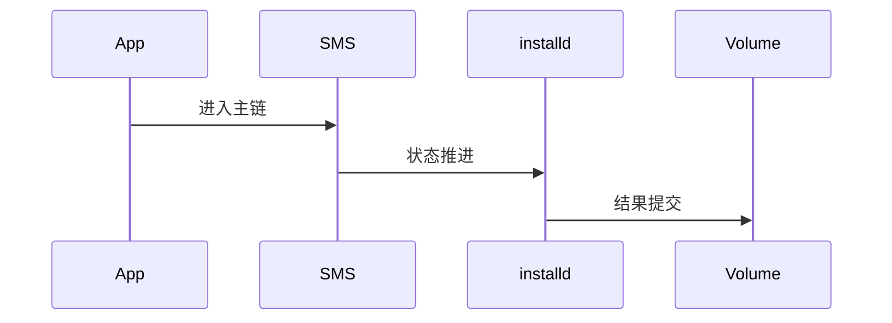

# Storage 源码分析

## 一、问题定义与范围
- 范围：StorageManagerService 与 installd 入口齐全，可分析存储管理与应用数据目录相关主链。
- 现状：本次输出基于目录源码静态分析，不包含运行时日志。

## 二、主调用链
- Framework API -> StorageManagerService -> vold/installd bridge -> volume/app data state
- 关键边界：重点关注 system_server、Binder、BufferQueue、SurfaceFlinger 等跨线程/跨进程收敛点。

## 三、设计思想与架构权衡
- 存储栈把策略、权限和卷管理放在系统服务层，底层目录/配额交给 native 守护进程。

## 四、架构图（Mermaid）

## 五、时序图（Mermaid）

## 六、关键代码详细分析
- StorageManagerService 负责卷状态、挂载广播和对上层的统一接口。
- installd 处理应用目录创建、dexopt 关联和数据生命周期。
- 安装与文件可见性异常往往要联合 PMS、权限与用户隔离一并看。

## 七、证据链（源码 + 运行时）
- 源码证据：`base/services/core/java/com/android/server/StorageManagerService.java`
- 源码证据：`native/cmds/installd/installd.cpp`
- 运行时证据：当前目录仅含源码，无 logcat、dumpsys、Perfetto、Winscope，运行时证据未闭环。

## 八、根因结论与置信度
- 结论：当前仓库对 `aosp-storage` 的覆盖状态为 `FULL`。
- 置信度：`Highly Likely`。

## 九、修复建议
- 若用于问题定位，优先围绕上述入口继续下钻；若为仓库缺口，则先补齐缺失源码再做闭环判断。

## 十、验证计划
- 补采与本模块对应的 `logcat`、`dumpsys`、Perfetto 或 Winscope，并回到文中主链逐段比对。

## 十一、证据缺口与后续采集
- 缺口：缺少运行时证据。
- 后续：按本模块主链采集线程栈、事务、buffer、焦点或权限状态。
